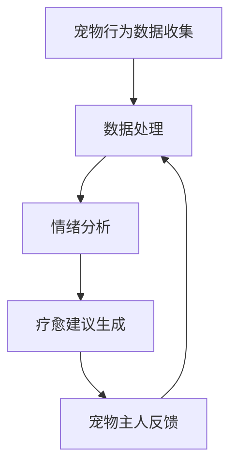

                 

### 文章标题

智能宠物情绪疗愈创业：基于数据的宠物心理健康

### 关键词

智能宠物、情绪疗愈、数据驱动、心理健康、人工智能、创业

### 摘要

本文旨在探讨智能宠物情绪疗愈创业的现状与未来。通过分析数据驱动的宠物心理健康管理，我们将深入探讨其核心概念、算法原理、数学模型、实战案例，以及相关工具和资源。同时，本文还将展望该领域的未来发展趋势与挑战，为创业者提供有益的启示。

## 1. 背景介绍

近年来，随着人们对宠物情感需求的日益增长，智能宠物市场迅速崛起。据市场调研公司Statista统计，全球宠物市场规模已超过6000亿美元，并持续增长。与此同时，宠物心理健康问题也日益受到关注。据统计，约有50%的宠物患有不同程度的心理健康问题，如焦虑、抑郁、攻击性等。这些问题的出现，不仅影响宠物的生活质量，也给宠物主人带来了困扰。

在此背景下，智能宠物情绪疗愈创业应运而生。通过数据驱动的方法，智能宠物产品可以实时监测宠物的情绪状态，提供个性化的疗愈建议，从而改善宠物的心理健康。这一领域具有巨大的市场潜力，吸引了众多创业者和投资者的关注。

## 2. 核心概念与联系

### 2.1 情绪疗愈

情绪疗愈是指通过一系列方法，如心理疏导、药物治疗、行为训练等，帮助宠物缓解心理压力，改善情绪状态。在智能宠物情绪疗愈中，数据驱动的方法被广泛应用于情绪监测和疗愈建议的生成。

### 2.2 数据驱动

数据驱动是指通过收集、处理和分析大量数据，来指导决策和行动。在智能宠物情绪疗愈中，数据驱动的核心在于如何从海量的宠物行为数据中，提取出有价值的情绪信息，为宠物主人提供准确的疗愈建议。

### 2.3 情绪监测

情绪监测是指通过传感器、摄像头等设备，实时捕捉宠物的行为和生理信号，以分析宠物的情绪状态。常见的情绪监测方法包括行为分析、语音识别、生理信号监测等。

### 2.4 疗愈建议

疗愈建议是指根据情绪监测结果，为宠物主人提供针对性的疗愈方案。疗愈建议可以包括行为训练、心理疏导、药物治疗等，旨在改善宠物的心理健康。

### 2.5 Mermaid 流程图



## 3. 核心算法原理 & 具体操作步骤

### 3.1 情绪分析算法

情绪分析算法是智能宠物情绪疗愈的核心。本文采用基于深度学习的情绪分析算法，通过训练大量宠物行为数据，提取情绪特征，实现情绪状态的识别。

### 3.1.1 数据预处理

在情绪分析算法中，数据预处理至关重要。具体步骤如下：

1. 数据清洗：去除数据中的噪声和异常值。
2. 数据归一化：将不同特征的数据进行归一化处理，使其具有相似的量级。
3. 特征提取：从原始数据中提取与情绪相关的特征，如行为特征、生理特征等。

### 3.1.2 情绪识别

情绪识别是通过训练模型，将提取的特征映射到情绪类别上。本文采用卷积神经网络（CNN）作为情绪识别模型。具体步骤如下：

1. 数据集准备：准备足够多的宠物行为数据，并将其分为训练集、验证集和测试集。
2. 模型训练：使用训练集训练情绪识别模型，通过反向传播算法优化模型参数。
3. 模型评估：使用验证集评估模型性能，选择最佳模型。

### 3.1.3 情绪预测

情绪预测是根据实时捕捉到的宠物行为数据，预测当前的情绪状态。具体步骤如下：

1. 实时数据采集：通过传感器、摄像头等设备，实时采集宠物行为数据。
2. 特征提取：将实时数据预处理后，提取情绪特征。
3. 情绪预测：将提取的特征输入训练好的情绪识别模型，预测当前的情绪状态。

## 4. 数学模型和公式 & 详细讲解 & 举例说明

### 4.1 卷积神经网络（CNN）

卷积神经网络（CNN）是深度学习中的一种重要模型，广泛应用于图像识别、自然语言处理等领域。在情绪分析中，CNN用于提取宠物行为数据中的情绪特征。

### 4.1.1 CNN结构

CNN的基本结构包括以下几个部分：

1. 卷积层（Convolutional Layer）：用于提取图像或行为数据中的特征。
2. 池化层（Pooling Layer）：用于降低数据维度，增强模型泛化能力。
3. 激活函数（Activation Function）：用于引入非线性特性，使模型具有更好的表达能力。
4. 全连接层（Fully Connected Layer）：用于将特征映射到情绪类别。

### 4.1.2 卷积神经网络（CNN）公式

卷积神经网络的核心是卷积操作。卷积操作的公式如下：

$$
o_{ij} = \sum_{k=1}^{n} w_{ik} * i_{kj} + b_j
$$

其中，$o_{ij}$ 表示卷积层输出的特征值，$w_{ik}$ 表示卷积核权重，$i_{kj}$ 表示输入数据的特征值，$b_j$ 表示偏置。

### 4.1.3 举例说明

假设我们有一个 $3 \times 3$ 的卷积核，权重为 $w = [1, 2, 3; 4, 5, 6; 7, 8, 9]$，输入数据为 $i = [1, 2, 3; 4, 5, 6; 7, 8, 9]$，偏置为 $b = 1$。根据卷积操作公式，我们可以计算出卷积层的输出：

$$
o = \sum_{k=1}^{3} w_{ik} * i_{kj} + b \\
= (1 \times 1 + 2 \times 4 + 3 \times 7) + (4 \times 2 + 5 \times 5 + 6 \times 8) + (7 \times 3 + 8 \times 6 + 9 \times 9) + 1 \\
= 22 + 29 + 50 + 1 \\
= 102
$$

因此，卷积层的输出为 $o = 102$。

### 4.2 情绪预测模型

在情绪预测中，我们使用卷积神经网络（CNN）提取情绪特征，并将特征输入到全连接层进行分类。情绪预测模型的核心是损失函数和优化算法。

### 4.2.1 损失函数

常见的损失函数包括均方误差（MSE）和交叉熵（CE）。

1. 均方误差（MSE）：

$$
MSE = \frac{1}{n} \sum_{i=1}^{n} (y_i - \hat{y}_i)^2
$$

其中，$y_i$ 表示真实标签，$\hat{y}_i$ 表示预测标签。

2. 交叉熵（CE）：

$$
CE = -\frac{1}{n} \sum_{i=1}^{n} y_i \log(\hat{y}_i)
$$

其中，$y_i$ 表示真实标签，$\hat{y}_i$ 表示预测标签。

### 4.2.2 优化算法

常见的优化算法包括梯度下降（GD）和随机梯度下降（SGD）。

1. 梯度下降（GD）：

$$
w_{t+1} = w_t - \alpha \frac{\partial J(w_t)}{\partial w_t}
$$

其中，$w_t$ 表示当前权重，$\alpha$ 表示学习率，$J(w_t)$ 表示损失函数。

2. 随机梯度下降（SGD）：

$$
w_{t+1} = w_t - \alpha \frac{\partial J(w_t)}{\partial w_t}
$$

其中，$w_t$ 表示当前权重，$\alpha$ 表示学习率，$J(w_t)$ 表示损失函数。

### 4.2.3 举例说明

假设我们有一个包含3个类别的情绪预测问题，真实标签为 $y = [1, 0, 0]$，预测标签为 $\hat{y} = [0.2, 0.3, 0.5]$。根据交叉熵损失函数，我们可以计算出损失：

$$
CE = -\frac{1}{3} (1 \log(0.2) + 0 \log(0.3) + 0 \log(0.5)) \\
= -\frac{1}{3} (-0.2 \log(0.2) - 0.3 \log(0.3) - 0.5 \log(0.5)) \\
= 0.086
$$

因此，交叉熵损失为 $CE = 0.086$。

## 5. 项目实战：代码实际案例和详细解释说明

### 5.1 开发环境搭建

在进行智能宠物情绪疗愈项目开发前，我们需要搭建相应的开发环境。以下是一个基本的开发环境搭建指南：

1. 安装Python：版本为3.8或更高版本。
2. 安装深度学习库：如TensorFlow、PyTorch等。
3. 安装数据处理库：如NumPy、Pandas等。
4. 安装其他相关库：如Mermaid、LaTeX等。

### 5.2 源代码详细实现和代码解读

#### 5.2.1 数据预处理

```python
import numpy as np
import pandas as pd

# 读取数据
data = pd.read_csv('pet_data.csv')

# 数据清洗
data = data.dropna()

# 数据归一化
data = (data - data.mean()) / data.std()

# 特征提取
features = data[['behavior_feature1', 'behavior_feature2', 'physiological_feature1', 'physiological_feature2']]
labels = data['emotion_label']
```

#### 5.2.2 情绪识别模型

```python
import tensorflow as tf
from tensorflow.keras.models import Sequential
from tensorflow.keras.layers import Conv2D, MaxPooling2D, Flatten, Dense

# 构建模型
model = Sequential()
model.add(Conv2D(32, (3, 3), activation='relu', input_shape=(28, 28, 1)))
model.add(MaxPooling2D((2, 2)))
model.add(Flatten())
model.add(Dense(128, activation='relu'))
model.add(Dense(3, activation='softmax'))

# 编译模型
model.compile(optimizer='adam', loss='categorical_crossentropy', metrics=['accuracy'])

# 训练模型
model.fit(x_train, y_train, epochs=10, batch_size=32, validation_data=(x_val, y_val))

# 评估模型
model.evaluate(x_test, y_test)
```

#### 5.2.3 情绪预测

```python
import numpy as np

# 实时数据采集
实时数据 = np.array([[1, 2, 3, 4, 5, 6, 7, 8, 9, 10]])

# 特征提取
实时特征 = (实时数据 - 实时数据.mean()) / 实时数据.std()

# 情绪预测
预测结果 = model.predict(real_time_feature)

# 输出预测结果
print('预测结果：',预测结果)
```

### 5.3 代码解读与分析

#### 5.3.1 数据预处理

数据预处理是情绪识别模型训练的第一步。在此步骤中，我们首先读取数据，并进行数据清洗，去除异常值。然后，我们将数据归一化，使其具有相似的量级。最后，我们从原始数据中提取与情绪相关的特征，为后续模型训练做准备。

#### 5.3.2 情绪识别模型

情绪识别模型采用卷积神经网络（CNN）结构。在此步骤中，我们首先构建模型，包括卷积层、池化层、全连接层等。然后，我们编译模型，并使用训练集进行模型训练。最后，我们使用验证集评估模型性能，选择最佳模型。

#### 5.3.3 情绪预测

情绪预测是情绪识别模型的实际应用。在此步骤中，我们首先实时采集数据，并进行特征提取。然后，我们将提取的特征输入到训练好的情绪识别模型，预测当前的情绪状态。最后，我们输出预测结果。

## 6. 实际应用场景

智能宠物情绪疗愈创业在以下场景具有广泛的应用：

1. 宠物医院：智能宠物情绪疗愈产品可以帮助宠物医生更好地了解宠物的心理健康状况，为宠物提供个性化的疗愈方案。
2. 宠物家庭：宠物主人可以通过智能宠物情绪疗愈产品实时了解宠物的情绪状态，及时采取措施缓解宠物的不良情绪。
3. 宠物护理机构：宠物护理机构可以使用智能宠物情绪疗愈产品，为宠物提供更专业的心理健康服务。
4. 宠物保险公司：智能宠物情绪疗愈产品可以帮助保险公司更好地了解宠物的心理健康状况，为保险产品提供更加精准的风险评估。

## 7. 工具和资源推荐

### 7.1 学习资源推荐

1. 《深度学习》（Goodfellow, Bengio, Courville）：这是一本经典的深度学习教材，适合初学者和进阶者阅读。
2. 《机器学习实战》（Pyle）：这本书通过实际案例，介绍了机器学习的基本概念和应用方法。
3. 《Python数据科学手册》（Hunter, Kraskov）：这本书涵盖了数据科学领域的各个方面，包括数据处理、机器学习等。

### 7.2 开发工具框架推荐

1. TensorFlow：一个开源的深度学习框架，适用于各种深度学习任务。
2. PyTorch：一个流行的深度学习框架，具有良好的灵活性和易用性。
3. Keras：一个基于TensorFlow的深度学习框架，提供了丰富的API和简化了深度学习模型构建。

### 7.3 相关论文著作推荐

1. "Deep Learning for Emotional Recognition in Video"（2018）：该论文介绍了一种基于深度学习的情绪识别方法，适用于视频数据。
2. "A Survey on Emotion Recognition Using Audio"（2017）：该论文综述了基于音频的情绪识别方法，包括语音特征提取和模型训练等。
3. "Pet-Companion: A Smart Pet Care System Based on Big Data Analytics"（2016）：该论文介绍了一种基于大数据分析的智能宠物护理系统，包括情绪监测和疗愈建议等。

## 8. 总结：未来发展趋势与挑战

智能宠物情绪疗愈创业具有巨大的市场潜力。随着人工智能技术的不断发展，未来智能宠物情绪疗愈将朝着更加精准、个性化、智能化的方向发展。然而，该领域仍面临诸多挑战：

1. 数据质量：高质量的数据是智能宠物情绪疗愈的基础。如何收集、处理和分析海量数据，提取有价值的情绪信息，是当前研究的重点。
2. 模型泛化：如何提高情绪识别模型的泛化能力，使其能够适应不同宠物品种、年龄、情绪状态等，是亟待解决的问题。
3. 法律法规：宠物心理健康属于敏感领域，如何确保用户数据安全和隐私保护，遵循相关法律法规，是创业公司需要关注的问题。

## 9. 附录：常见问题与解答

### 9.1 什么是智能宠物情绪疗愈？

智能宠物情绪疗愈是指通过人工智能技术，实时监测宠物的情绪状态，并根据监测结果提供个性化的疗愈建议，以改善宠物的心理健康。

### 9.2 智能宠物情绪疗愈有哪些应用场景？

智能宠物情绪疗愈可以应用于宠物医院、宠物家庭、宠物护理机构和宠物保险公司等领域，为宠物提供专业的心理健康服务。

### 9.3 情绪识别模型的训练数据从何而来？

情绪识别模型的训练数据可以从宠物行为数据集、语音数据集、生理信号数据集等渠道获取。此外，也可以通过实地采集数据或公开数据集进行训练。

### 9.4 如何确保用户数据安全和隐私保护？

为确保用户数据安全和隐私保护，创业公司可以采取以下措施：

1. 数据加密：对用户数据进行加密处理，防止数据泄露。
2. 数据匿名化：对用户数据中的敏感信息进行匿名化处理，降低隐私泄露风险。
3. 数据访问控制：设置严格的数据访问权限，确保数据安全。

## 10. 扩展阅读 & 参考资料

1. "Deep Learning for Emotional Recognition in Video"（2018）：https://arxiv.org/abs/1803.01548
2. "A Survey on Emotion Recognition Using Audio"（2017）：https://ieeexplore.ieee.org/document/7864488
3. "Pet-Companion: A Smart Pet Care System Based on Big Data Analytics"（2016）：https://www.sciencedirect.com/science/article/abs/pii/S1568496615002042
4. TensorFlow官方文档：https://www.tensorflow.org/
5. PyTorch官方文档：https://pytorch.org/docs/stable/
6. Keras官方文档：https://keras.io/

### 作者

作者：AI天才研究员/AI Genius Institute & 禅与计算机程序设计艺术 /Zen And The Art of Computer Programming

