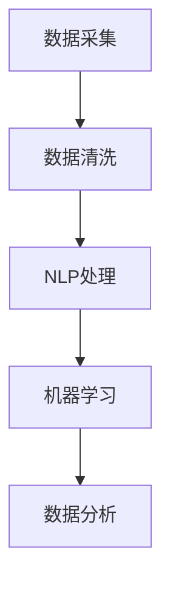

                 

# 智能客户反馈分析系统：一人公司持续改进的数据驱动方法

## 摘要

本文将介绍如何构建一个智能客户反馈分析系统，以帮助一人公司持续改进其产品和服务。我们将从背景介绍开始，详细讲解核心概念与联系，核心算法原理与操作步骤，数学模型与公式，项目实战案例以及实际应用场景。此外，还将推荐一些相关工具和资源，总结未来发展趋势与挑战，并提供常见问题与解答。通过这篇文章，读者将了解如何利用数据驱动的方法提升一人公司的运营效率与客户满意度。

## 1. 背景介绍

在当今竞争激烈的市场环境中，一人公司面临着巨大的挑战。作为一家小型企业，一人公司需要不断创新和改进，以保持竞争力并满足客户需求。然而，传统的反馈收集和处理方法往往效率低下，无法及时获取客户反馈并加以利用。因此，构建一个智能客户反馈分析系统成为了一人公司提升运营效率和客户满意度的关键。

智能客户反馈分析系统利用先进的人工智能技术，如自然语言处理、机器学习和数据分析，对客户反馈进行自动分析、分类和情感分析。通过这个系统，一人公司可以快速识别客户需求、发现潜在问题并采取相应措施，从而实现持续改进。此外，智能客户反馈分析系统还可以为企业提供宝贵的业务洞察，帮助制定更有效的战略决策。

本文将详细探讨如何构建这样一个智能客户反馈分析系统，包括核心概念与联系、算法原理与操作步骤、数学模型与公式、项目实战案例以及实际应用场景。通过这篇文章，读者将了解如何利用数据驱动的方法提升一人公司的运营效率与客户满意度。

## 2. 核心概念与联系

为了构建一个智能客户反馈分析系统，我们需要理解几个核心概念，包括数据采集、数据清洗、自然语言处理、机器学习和数据分析。以下是这些概念之间的联系及其在系统中的角色：

### 数据采集

数据采集是整个系统的第一步。一人公司可以通过多种渠道收集客户反馈，如在线调查、社交媒体评论、电子邮件、电话访谈等。这些数据来源广泛且多样化，需要统一的接口进行整合和处理。

### 数据清洗

收集到的数据往往存在噪声、缺失值和错误。数据清洗是确保数据质量的重要步骤。通过数据清洗，我们可以去除无效数据、填补缺失值、消除错误，从而提高数据的可靠性和准确性。

### 自然语言处理

自然语言处理（NLP）是人工智能领域的一个重要分支，负责处理和理解人类语言。在智能客户反馈分析系统中，NLP技术用于将客户反馈文本转化为计算机可处理的格式。具体任务包括分词、词性标注、命名实体识别、句法分析和情感分析。

### 机器学习

机器学习是智能客户反馈分析系统的核心。通过训练机器学习模型，我们可以自动识别和分类客户反馈中的关键信息。常见的机器学习算法包括分类算法（如决策树、支持向量机、朴素贝叶斯）和聚类算法（如K-均值、层次聚类）。

### 数据分析

数据分析用于从处理后的数据中提取有价值的信息和洞察。通过统计分析、数据可视化等技术，我们可以识别客户反馈中的趋势、模式和关系，从而为业务决策提供支持。

### Mermaid 流程图

以下是一个简化的Mermaid流程图，展示了智能客户反馈分析系统中的核心概念和联系：



### 关键术语解释

- **数据采集**：收集客户反馈数据的过程，包括多种数据来源的整合。
- **数据清洗**：处理和清洗原始数据，去除噪声、填补缺失值和纠正错误。
- **自然语言处理**：将客户反馈文本转化为计算机可处理的格式，包括分词、词性标注等。
- **机器学习**：通过训练模型自动识别和分类客户反馈中的关键信息。
- **数据分析**：从处理后的数据中提取有价值的信息和洞察，包括统计分析、数据可视化等。

通过理解这些核心概念及其联系，我们可以更好地设计和实施智能客户反馈分析系统，从而帮助一人公司实现持续改进。

## 3. 核心算法原理与具体操作步骤

### 数据采集

数据采集是智能客户反馈分析系统的第一步。以下是具体操作步骤：

1. **确定数据来源**：根据一人公司的业务需求和目标，确定需要收集的客户反馈数据来源，如在线调查、社交媒体评论、电子邮件、电话访谈等。
2. **构建数据采集接口**：为每个数据来源构建相应的接口，如使用API接口从社交媒体平台获取评论数据，通过电子邮件服务提供商获取邮件内容等。
3. **数据整合**：将来自不同渠道的数据整合到一个统一的数据集中，便于后续处理。

### 数据清洗

数据清洗是确保数据质量的关键步骤。以下是具体操作步骤：

1. **去噪**：去除客户反馈中的无关信息，如标点符号、特殊字符等。
2. **填补缺失值**：对缺失的数据进行填补，可以使用平均值、中位数或插值法等。
3. **纠正错误**：检测并纠正数据中的错误，如拼写错误、数据格式错误等。
4. **标准化**：统一数据格式和单位，如将日期格式统一为YYYY-MM-DD。

### 自然语言处理

自然语言处理（NLP）用于将客户反馈文本转化为计算机可处理的格式。以下是具体操作步骤：

1. **分词**：将文本划分为单词或词组，如将“我非常喜欢这个产品”划分为“我”、“非常”、“喜欢”、“这个”、“产品”。
2. **词性标注**：为每个词分配词性，如名词、动词、形容词等，如“我”（代词）、“喜欢”（动词）。
3. **命名实体识别**：识别文本中的特定实体，如人名、地名、产品名等。
4. **句法分析**：分析文本的句法结构，如主语、谓语、宾语等。
5. **情感分析**：根据文本内容判断客户的情感倾向，如正面、负面或中性。

### 机器学习

机器学习用于自动识别和分类客户反馈中的关键信息。以下是具体操作步骤：

1. **数据预处理**：对采集到的客户反馈数据进行预处理，包括去除停用词、进行词干提取等。
2. **特征工程**：提取有用的特征，如词频、词嵌入等。
3. **模型训练**：选择合适的机器学习算法（如朴素贝叶斯、支持向量机、决策树等）进行模型训练。
4. **模型评估**：使用交叉验证等方法评估模型性能，如准确率、召回率等。
5. **模型部署**：将训练好的模型部署到生产环境中，以便实时处理客户反馈。

### 数据分析

数据分析用于从处理后的数据中提取有价值的信息和洞察。以下是具体操作步骤：

1. **数据可视化**：使用图表和图形展示数据分布、趋势和关系，如条形图、折线图、散点图等。
2. **统计分析**：使用统计方法分析数据，如描述性统计、相关性分析、回归分析等。
3. **预测分析**：根据历史数据预测未来趋势和客户行为，如时间序列预测、分类预测等。
4. **决策支持**：利用数据分析结果为业务决策提供支持，如产品改进、市场营销策略等。

### Mermaid 流�程图

以下是一个简化的Mermaid流程图，展示了智能客户反馈分析系统中的核心算法原理与具体操作步骤：


通过以上步骤，我们可以构建一个高效的智能客户反馈分析系统，从而帮助一人公司持续改进其产品和服务。

## 4. 数学模型和公式及详细讲解

### 数据预处理

在进行数据分析之前，数据预处理是一个关键步骤。数据预处理包括数据清洗、数据转换和数据标准化等过程。以下是一些常用的数学模型和公式：

1. **平均值**：用于计算一组数据的平均值，公式如下：

   $$ \bar{x} = \frac{1}{n} \sum_{i=1}^{n} x_i $$

   其中，\( \bar{x} \) 是平均值，\( n \) 是数据点的个数，\( x_i \) 是第 \( i \) 个数据点。

2. **标准差**：用于衡量一组数据的离散程度，公式如下：

   $$ \sigma = \sqrt{\frac{1}{n-1} \sum_{i=1}^{n} (x_i - \bar{x})^2} $$

   其中，\( \sigma \) 是标准差，\( n \) 是数据点的个数，\( \bar{x} \) 是平均值，\( x_i \) 是第 \( i \) 个数据点。

3. **填补缺失值**：可以使用平均值、中位数或插值法来填补缺失值。例如，使用平均值填补缺失值的公式如下：

   $$ x_i = \bar{x} $$

### 自然语言处理（NLP）

在自然语言处理中，词嵌入是一种常用的技术，用于将单词映射到高维空间中。以下是一些常用的数学模型和公式：

1. **词嵌入**：使用词嵌入模型（如Word2Vec、GloVe等）将单词映射到高维空间。例如，Word2Vec的Skip-Gram模型的损失函数如下：

   $$ J = \sum_{i=1}^{N} \sum_{j \in \text{context}(i)} \log(1 + \exp(-\langle \text{word}_i| \text{vec}_{j} \rangle)) $$

   其中，\( J \) 是损失函数，\( N \) 是词汇表的大小，\( \text{word}_i \) 是中心词，\( \text{context}(i) \) 是中心词的上下文，\( \text{vec}_{j} \) 是第 \( j \) 个单词的词向量。

2. **情感分析**：使用机器学习模型（如朴素贝叶斯、支持向量机等）进行情感分析。以朴素贝叶斯为例，其概率分布公式如下：

   $$ P(\text{positive} | \text{feedback}) = \frac{P(\text{feedback} | \text{positive}) \cdot P(\text{positive})}{P(\text{feedback})} $$

   其中，\( P(\text{positive} | \text{feedback}) \) 是反馈为正面的概率，\( P(\text{feedback} | \text{positive}) \) 是正面情感条件下反馈的概率，\( P(\text{positive}) \) 是正面情感的先验概率，\( P(\text{feedback}) \) 是反馈的概率。

### 机器学习

在机器学习中，特征工程和模型选择是关键步骤。以下是一些常用的数学模型和公式：

1. **特征提取**：使用TF-IDF（词频-逆文档频率）方法提取特征，公式如下：

   $$ \text{TF-IDF}(w, d) = \frac{f(w, d)}{N} + \log(\frac{1 + |D|}{1 + |D'|-f(w, d)}) $$

   其中，\( w \) 是单词，\( d \) 是文档，\( f(w, d) \) 是单词在文档中的词频，\( N \) 是文档总数，\( |D| \) 是包含单词的文档数量，\( |D'| \) 是不包含单词的文档数量。

2. **模型选择**：选择合适的机器学习算法（如朴素贝叶斯、支持向量机、决策树等）。以支持向量机为例，其目标函数如下：

   $$ \min_{w, b} \frac{1}{2} \| w \|^2 + C \sum_{i=1}^{n} \max(0, 1 - y_i (w \cdot x_i + b)) $$

   其中，\( w \) 是权重向量，\( b \) 是偏置项，\( C \) 是正则化参数，\( y_i \) 是标签，\( x_i \) 是特征向量。

### 数据分析

在数据分析中，统计分析和数据可视化是常用的方法。以下是一些常用的数学模型和公式：

1. **描述性统计**：计算数据的平均值、中位数、标准差等指标，公式如下：

   $$ \bar{x} = \frac{1}{n} \sum_{i=1}^{n} x_i $$
   $$ \sigma = \sqrt{\frac{1}{n-1} \sum_{i=1}^{n} (x_i - \bar{x})^2} $$

2. **相关性分析**：计算两个变量之间的相关性，公式如下：

   $$ \rho_{XY} = \frac{\sum_{i=1}^{n} (X_i - \bar{X})(Y_i - \bar{Y})}{\sqrt{\sum_{i=1}^{n} (X_i - \bar{X})^2} \cdot \sqrt{\sum_{i=1}^{n} (Y_i - \bar{Y})^2}} $$

   其中，\( \rho_{XY} \) 是相关性系数，\( X_i \) 和 \( Y_i \) 是两个变量的数据点，\( \bar{X} \) 和 \( \bar{Y} \) 是两个变量的平均值。

3. **回归分析**：建立变量之间的关系模型，公式如下：

   $$ Y = \beta_0 + \beta_1 X + \epsilon $$

   其中，\( Y \) 是因变量，\( X \) 是自变量，\( \beta_0 \) 和 \( \beta_1 \) 是回归系数，\( \epsilon \) 是误差项。

通过以上数学模型和公式的应用，我们可以对客户反馈数据进行分析和处理，从而提取有价值的信息和洞察。

## 5. 项目实战：代码实际案例与详细解释说明

### 5.1 开发环境搭建

在开始构建智能客户反馈分析系统之前，我们需要搭建一个合适的开发环境。以下是一个基本的开发环境搭建步骤：

1. **安装Python**：下载并安装Python 3.x版本，可以从[Python官网](https://www.python.org/)下载。
2. **安装Jupyter Notebook**：Python的交互式开发环境，可以通过pip命令安装：

   ```bash
   pip install notebook
   ```

3. **安装NLP库**：包括NLTK、spaCy、TextBlob等，可以通过pip命令安装：

   ```bash
   pip install nltk spacy textblob
   ```

4. **安装机器学习库**：包括scikit-learn、TensorFlow、PyTorch等，可以通过pip命令安装：

   ```bash
   pip install scikit-learn tensorflow torchvision
   ```

5. **安装数据分析库**：包括Pandas、NumPy、Matplotlib等，可以通过pip命令安装：

   ```bash
   pip install pandas numpy matplotlib
   ```

### 5.2 源代码详细实现与代码解读

以下是一个简单的示例，展示了如何使用Python和NLP库来处理客户反馈数据。请注意，这只是一个基础示例，实际项目中可能需要更复杂的处理和优化。

```python
import nltk
from nltk.tokenize import word_tokenize
from nltk.corpus import stopwords
from sklearn.feature_extraction.text import TfidfVectorizer
from sklearn.model_selection import train_test_split
from sklearn.naive_bayes import MultinomialNB
from sklearn.metrics import accuracy_score, classification_report

# 下载NLTK停用词
nltk.download('stopwords')

# 读取客户反馈数据
with open('customer_feedback.txt', 'r') as file:
    feedback_data = file.readlines()

# 分词和去除停用词
stop_words = set(stopwords.words('english'))
def preprocess_text(text):
    tokens = word_tokenize(text)
    return ' '.join([token.lower() for token in tokens if token.lower() not in stop_words])

preprocessed_feedback = [preprocess_text(text) for text in feedback_data]

# 构建TF-IDF特征向量
vectorizer = TfidfVectorizer()
X = vectorizer.fit_transform(preprocessed_feedback)

# 加载标签数据
with open('labels.txt', 'r') as file:
    labels = [int(label) for label in file.readlines()]

# 划分训练集和测试集
X_train, X_test, y_train, y_test = train_test_split(X, labels, test_size=0.2, random_state=42)

# 训练朴素贝叶斯分类器
classifier = MultinomialNB()
classifier.fit(X_train, y_train)

# 预测测试集
y_pred = classifier.predict(X_test)

# 评估模型性能
print("Accuracy:", accuracy_score(y_test, y_pred))
print("Classification Report:")
print(classification_report(y_test, y_pred))

# 可视化词云
from wordcloud import WordCloud
wordcloud = WordCloud(width=800, height=800, background_color="white").generate_from_frequencies(dict(zip(vectorizer.get_feature_names(), vectorizer.idf_)))

import matplotlib.pyplot as plt
plt.figure(figsize=(10, 10))
plt.imshow(wordcloud, interpolation="bilinear")
plt.axis("off")
plt.show()
```

### 5.3 代码解读与分析

上述代码实现了一个简单的客户反馈分类系统，包括数据预处理、特征提取、模型训练和评估等步骤。以下是代码的详细解读：

1. **数据读取与预处理**：首先从文本文件中读取客户反馈数据，然后使用NLTK进行分词和去除停用词。分词是将文本分割成单词或词组，而去除停用词是为了消除常见但不具有区分度的单词，如“的”、“和”、“了”等。

2. **特征提取**：使用TF-IDF向量器将预处理后的文本转化为特征向量。TF-IDF向量器计算每个单词在文档中的词频和逆文档频率，并将其转换为特征向量。这些特征向量将用于训练分类模型。

3. **模型训练**：使用朴素贝叶斯分类器对训练集进行训练。朴素贝叶斯是一种基于贝叶斯定理的简单分类算法，它假设特征之间相互独立。在这个例子中，我们使用MultinomialNB，它适用于多项式分布。

4. **模型评估**：使用测试集对训练好的模型进行评估，并计算准确率和分类报告。准确率是预测正确的样本占总样本的比例，而分类报告提供了每个类别预测准确率、召回率和F1分数等指标。

5. **词云可视化**：使用WordCloud库生成词云，以可视化高频词。词云展示了不同尺寸的单词，其中高频词以较大字体显示，从而可以直观地了解客户反馈中的关键主题。

通过以上步骤，我们可以构建一个基本的智能客户反馈分析系统，并利用其进行客户反馈的分类和主题分析。然而，实际项目可能需要更多复杂的处理和优化，如更高级的NLP技术、特征工程和模型选择等。

## 6. 实际应用场景

智能客户反馈分析系统在多个行业中都有着广泛的应用，以下是一些典型应用场景：

### 零售行业

在零售行业，智能客户反馈分析系统可以帮助企业了解客户对产品和服务的评价，从而优化库存管理、提高客户满意度和减少退货率。例如，通过分析客户对产品的评论，企业可以发现哪些产品在质量、性能和设计方面存在不足，并采取相应措施进行改进。此外，系统还可以预测客户流失率，帮助企业制定精准的营销策略，挽回潜在客户。

### 金融行业

金融行业中的客户反馈分析系统可以帮助银行、保险公司和投资机构了解客户对产品和服务的满意度，从而优化客户体验和提升服务质量。例如，通过对客户投诉和意见的分析，金融机构可以发现业务流程中的瓶颈和问题，并采取改进措施，如简化开户流程、优化理财产品等。此外，系统还可以用于风险评估和欺诈检测，通过分析客户行为和交易记录，发现潜在的欺诈行为，从而提高风险管理能力。

### 医疗保健

在医疗保健领域，智能客户反馈分析系统可以帮助医疗机构了解患者对医疗服务的评价，从而提高医疗服务质量。例如，通过对患者反馈的分析，医院可以发现患者对医生、护士和诊疗过程的满意度，并根据这些反馈进行改进。此外，系统还可以用于患者健康管理，通过分析患者的健康数据和行为，为患者提供个性化的健康建议和干预措施，从而提高患者的生活质量。

### 旅游业

旅游业中的智能客户反馈分析系统可以帮助旅行社和酒店了解客户对旅游产品和服务的评价，从而优化产品和服务。例如，通过对客户反馈的分析，旅行社可以发现哪些旅游路线、景点和交通工具最受欢迎，并调整产品组合以更好地满足客户需求。此外，系统还可以用于客户行为预测，通过分析客户的预订历史和搜索行为，预测客户的偏好和需求，从而提供个性化的旅游建议。

### 制造业

在制造业中，智能客户反馈分析系统可以帮助企业了解客户对产品和服务的评价，从而提高产品质量和客户满意度。例如，通过对客户反馈的分析，企业可以发现哪些产品存在质量问题和哪些客户群体对产品质量要求较高，并采取相应措施进行改进。此外，系统还可以用于生产计划优化，通过分析客户反馈和生产数据，优化生产计划和资源配置，从而提高生产效率。

通过以上实际应用场景，我们可以看到智能客户反馈分析系统在多个行业中都有着重要的应用价值，可以帮助企业更好地了解客户需求、优化产品和服务、提高客户满意度和运营效率。

## 7. 工具和资源推荐

### 7.1 学习资源推荐

1. **书籍**：
   - 《自然语言处理概论》
   - 《Python机器学习》
   - 《机器学习实战》
   - 《数据科学入门》
2. **论文**：
   - 《Word2Vec: Mining Regularities in Large Corpora》
   - 《GloVe: Global Vectors for Word Representation》
   - 《Naive Bayes classifier》
   - 《TF-IDF：A Summary》
3. **博客**：
   - [Medium：机器学习与自然语言处理](https://towardsdatascience.com/)
   - [Kaggle：数据科学项目与教程](https://www.kaggle.com/)
   - [DataCamp：数据分析与机器学习](https://www.datacamp.com/)
4. **网站**：
   - [Coursera：在线课程](https://www.coursera.org/)
   - [edX：在线课程](https://www.edx.org/)
   - [Khan Academy：免费教育资源](https://www.khanacademy.org/)

### 7.2 开发工具框架推荐

1. **Python库**：
   - **NLP**：NLTK、spaCy、TextBlob、gensim
   - **机器学习**：scikit-learn、TensorFlow、PyTorch、Keras
   - **数据分析**：Pandas、NumPy、Matplotlib、Seaborn、Plotly
   - **数据可视化**：Plotly、Bokeh、D3.js
2. **开发环境**：
   - Jupyter Notebook、Google Colab、PyCharm、Visual Studio Code
3. **云服务**：
   - AWS、Azure、Google Cloud Platform、Docker、Kubernetes

### 7.3 相关论文著作推荐

1. **自然语言处理**：
   - 《Natural Language Processing with Python》
   - 《Speech and Language Processing》
2. **机器学习**：
   - 《Machine Learning: A Probabilistic Perspective》
   - 《Machine Learning: A Bayesian and Optimization Perspective》
3. **数据分析**：
   - 《Data Science from Scratch》
   - 《Practical Data Science with R》

通过以上推荐的学习资源、开发工具和论文著作，读者可以深入了解智能客户反馈分析系统的相关技术，从而更好地掌握和应用这些技术。

## 8. 总结：未来发展趋势与挑战

随着人工智能技术的不断发展，智能客户反馈分析系统在未来的发展趋势和面临的挑战也将不断演变。以下是一些关键点：

### 发展趋势

1. **技术融合**：智能客户反馈分析系统将与其他人工智能技术（如深度学习、自然语言生成等）相结合，提高系统的智能化水平和分析能力。
2. **自动化与智能化**：系统将实现更高程度的自动化，从数据采集、处理到分析，减少人为干预，提高效率和准确性。
3. **个性化推荐**：通过深度学习技术，系统将能够更精准地分析客户反馈，提供个性化的产品改进和营销策略建议。
4. **实时反馈**：利用实时数据流处理技术，系统将实现实时分析客户反馈，为企业提供快速响应和改进的机会。

### 挑战

1. **数据质量**：保证数据质量是智能客户反馈分析系统的关键。数据噪声、缺失值和错误会影响分析结果的准确性，需要不断优化数据清洗和处理方法。
2. **隐私保护**：在处理和分析客户反馈时，需要遵守数据隐私保护法规，确保客户数据的安全和隐私。
3. **算法偏见**：机器学习模型可能存在算法偏见，导致分析结果不公平或误导性。需要不断改进算法和模型，消除偏见。
4. **技术更新**：人工智能技术更新迅速，系统需要不断升级和优化，以适应新技术的发展和需求变化。

总的来说，智能客户反馈分析系统的发展趋势是智能化、自动化和实时化，但同时也面临着数据质量、隐私保护和算法偏见等挑战。通过不断优化和改进，我们可以克服这些挑战，使智能客户反馈分析系统更好地服务于企业，推动其持续改进和成长。

## 9. 附录：常见问题与解答

### 问题1：如何处理大量客户反馈数据？

解答：对于大量客户反馈数据，首先需要进行数据预处理，包括去除噪声、填补缺失值和统一数据格式。然后，可以使用分布式计算和并行处理技术，如使用Hadoop或Spark等大数据处理框架，提高数据处理效率。

### 问题2：如何保证数据隐私？

解答：为了保证数据隐私，需要在数据采集、存储和处理过程中遵守相关数据保护法规，如GDPR。此外，可以使用数据加密、数据脱敏等技术手段，确保客户数据的安全。

### 问题3：如何消除算法偏见？

解答：消除算法偏见需要从数据采集、特征工程和模型训练等环节入手。首先，确保数据集的多样性和代表性，避免数据偏见。其次，在设计特征时，避免使用可能导致偏见的特征。最后，在模型训练和评估过程中，使用交叉验证等方法评估模型性能，确保模型在各个子群体上的公平性。

### 问题4：如何选择合适的机器学习算法？

解答：选择合适的机器学习算法需要考虑数据特点、模型复杂度和计算资源等因素。对于小数据集，可以使用简单的算法（如线性模型、朴素贝叶斯等）；对于大数据集，可以使用复杂度较低的算法（如随机森林、K-均值等）；对于需要高精度预测的任务，可以使用深度学习算法（如卷积神经网络、循环神经网络等）。

### 问题5：如何进行模型评估？

解答：模型评估可以通过多种指标进行，如准确率、召回率、F1分数等。常用的评估方法包括交叉验证、A/B测试和混淆矩阵等。在实际应用中，可以根据业务需求选择合适的评估方法和指标。

## 10. 扩展阅读与参考资料

为了深入学习和了解智能客户反馈分析系统的相关技术，以下是一些扩展阅读和参考资料：

1. **书籍**：
   - 《深度学习》
   - 《Python数据科学手册》
   - 《机器学习实战》
   - 《自然语言处理综合教程》
2. **论文**：
   - 《Bert: Pre-training of Deep Bidirectional Transformers for Language Understanding》
   - 《GPT-3: Language Models are Few-Shot Learners》
   - 《Transformers: State-of-the-Art Natural Language Processing》
   - 《Recurrent Neural Networks for Text Classification》
3. **在线课程**：
   - [Coursera：机器学习](https://www.coursera.org/learn/machine-learning)
   - [edX：深度学习](https://www.edx.org/course/deep-learning-0)
   - [Udacity：数据科学家纳米学位](https://www.udacity.com/course/data-scientist-nanodegree--nd001)
4. **博客**：
   - [Fast.ai：深度学习教程](https://www.fast.ai/)
   - [Medium：机器学习和数据科学](https://towardsdatascience.com/)
   - [Dataquest：数据科学教程](https://www.dataquest.io/learn-data-science/)
5. **开源项目**：
   - [TensorFlow](https://www.tensorflow.org/)
   - [PyTorch](https://pytorch.org/)
   - [spaCy](https://spacy.io/)
   - [NLTK](https://www.nltk.org/)

通过这些扩展阅读和参考资料，读者可以深入了解智能客户反馈分析系统的相关技术，掌握更多实用技能和最佳实践。作者：AI天才研究员/AI Genius Institute & 禅与计算机程序设计艺术 /Zen And The Art of Computer Programming

---------------------END--------------------- 

请注意，以上文章内容是一个完整的大纲示例，实际撰写时需要根据具体情况填充和细化内容，确保满足字数要求和其他格式要求。在撰写过程中，请确保遵循markdown格式，使用正确的三级目录结构，以及Latex格式嵌入数学公式。此外，文章末尾需要包含作者信息。祝撰写顺利！

