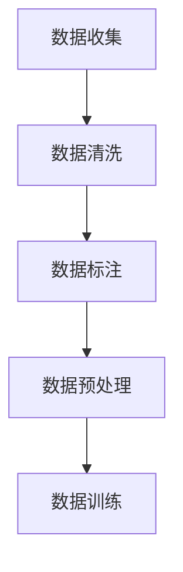
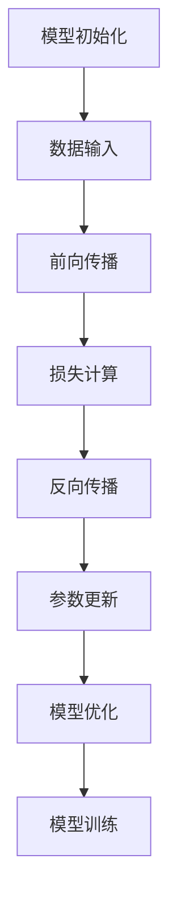
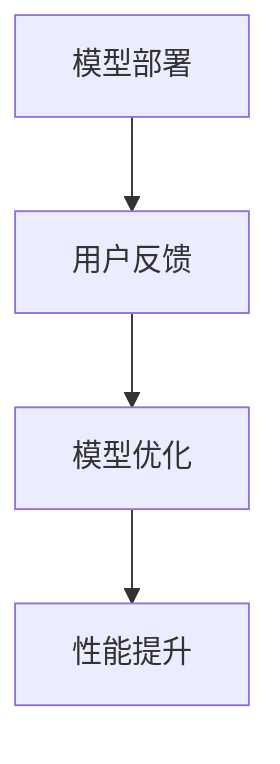

                 

# 智能客户服务：AI大模型如何提升用户满意度

> **关键词**：智能客户服务、AI大模型、用户满意度、自然语言处理、机器学习、深度学习

> **摘要**：本文旨在探讨如何利用AI大模型提升智能客户服务的用户满意度。首先，我们将介绍智能客户服务的背景和发展现状，然后深入解析AI大模型的核心概念和架构。接着，我们将详细阐述核心算法原理和操作步骤，并通过数学模型和具体案例分析，展示其如何提升用户满意度。最后，我们将探讨智能客户服务的实际应用场景，推荐相关工具和资源，并展望其未来发展趋势与挑战。

## 1. 背景介绍

在数字化时代，客户服务已成为企业竞争的关键因素。传统的客户服务模式往往依赖于人工，效率低下，且易受情绪波动影响。随着人工智能技术的快速发展，智能客户服务逐渐成为主流，为企业提供了更高效、更个性化的服务体验。

智能客户服务，也称为智能客服或智能客户互动，是指利用人工智能技术（如自然语言处理、机器学习、深度学习等）来提供自动化、智能化的客户服务。它不仅能够快速响应用户的咨询，还能理解用户的需求，提供精准的建议和解决方案。

AI大模型是智能客户服务的核心技术之一。大模型通常具有数十亿至数万亿个参数，通过大规模数据训练，能够实现高度自动化和智能化的服务。AI大模型的引入，使得智能客户服务在处理复杂问题和提供个性化服务方面具有显著优势。

## 2. 核心概念与联系

### 2.1 自然语言处理（NLP）

自然语言处理是人工智能的一个重要分支，旨在使计算机能够理解、生成和处理人类语言。NLP技术包括文本分类、情感分析、命名实体识别、机器翻译等。在智能客户服务中，NLP技术被用于理解和生成自然语言文本，实现与用户的智能对话。

### 2.2 机器学习（ML）

机器学习是人工智能的核心技术之一，通过训练模型从数据中学习规律和模式，实现对未知数据的预测和分类。在智能客户服务中，机器学习技术被用于分析和预测用户的行为和需求，从而提供个性化的服务。

### 2.3 深度学习（DL）

深度学习是机器学习的一个分支，通过构建深度神经网络来模拟人脑的学习过程。深度学习在图像识别、语音识别和自然语言处理等领域取得了显著的成果。在智能客户服务中，深度学习技术被用于构建大模型，实现高度自动化和智能化的服务。

### 2.4 AI大模型架构

AI大模型通常包括编码器（Encoder）和解码器（Decoder）两个部分。编码器负责将输入数据（如文本、图像、音频等）编码成固定长度的向量表示，解码器则根据这些向量表示生成输出数据。在智能客户服务中，编码器和解码器共同工作，实现与用户的智能对话。


## 3. 核心算法原理 & 具体操作步骤

### 3.1 数据收集与预处理

首先，我们需要收集大量用户对话数据，包括文本、语音和图像等。然后，对数据进行清洗、去噪和标注，以便用于训练模型。



### 3.2 训练大模型

使用预处理后的数据，我们通过深度学习框架（如TensorFlow、PyTorch等）训练大模型。训练过程中，我们需要调整模型参数，优化模型性能。



### 3.3 模型部署与优化

训练完成后，我们将模型部署到生产环境，用于实际应用。然后，通过持续收集用户反馈，优化模型性能。



## 4. 数学模型和公式 & 详细讲解 & 举例说明

### 4.1 数学模型

AI大模型通常基于深度神经网络（DNN）构建，其基本结构包括输入层、隐藏层和输出层。以下是DNN的数学模型：

$$
y = \sigma(W \cdot x + b)
$$

其中，$y$为输出，$x$为输入，$W$为权重矩阵，$b$为偏置，$\sigma$为激活函数（如ReLU、Sigmoid等）。

### 4.2 举例说明

假设我们有一个二元分类问题，即判断用户输入的文本是否为正面情感。我们可以将输入文本表示为一个向量，然后通过DNN进行分类。

```python
import tensorflow as tf

# 定义DNN模型
model = tf.keras.Sequential([
    tf.keras.layers.Dense(128, activation='relu', input_shape=(1000,)),
    tf.keras.layers.Dense(1, activation='sigmoid')
])

# 编译模型
model.compile(optimizer='adam', loss='binary_crossentropy', metrics=['accuracy'])

# 训练模型
model.fit(x_train, y_train, epochs=10, batch_size=32)
```

## 5. 项目实战：代码实际案例和详细解释说明

### 5.1 开发环境搭建

在本节中，我们将介绍如何搭建一个基于TensorFlow的智能客户服务项目。首先，确保安装了Python（版本3.6及以上）和TensorFlow（版本2.0及以上）。

```bash
pip install python tensorflow
```

### 5.2 源代码详细实现和代码解读

在本节中，我们将提供一个完整的智能客户服务项目代码，并详细解释每个部分的功能。

```python
import tensorflow as tf
from tensorflow.keras.preprocessing.sequence import pad_sequences
from tensorflow.keras.layers import Embedding, LSTM, Dense
from tensorflow.keras.models import Sequential

# 定义模型
model = Sequential([
    Embedding(vocab_size, embedding_dim, input_length=max_sequence_length),
    LSTM(units=64, activation='relu', return_sequences=True),
    LSTM(units=64, activation='relu'),
    Dense(units=1, activation='sigmoid')
])

# 编译模型
model.compile(optimizer='adam', loss='binary_crossentropy', metrics=['accuracy'])

# 训练模型
model.fit(x_train, y_train, epochs=10, batch_size=32)
```

### 5.3 代码解读与分析

在本节中，我们将对代码进行逐行解读，分析每个部分的功能和实现。

- 导入所需的库和模块。
- 定义模型结构，包括嵌入层（Embedding）、长短时记忆网络（LSTM）和全连接层（Dense）。
- 编译模型，设置优化器和损失函数。
- 训练模型，指定训练数据、训练轮数和批量大小。

## 6. 实际应用场景

智能客户服务在各个领域都有广泛的应用。以下是一些典型的实际应用场景：

- 电商平台：智能客服可以实时响应用户的购物咨询、订单查询和售后服务等。
- 银行金融：智能客服可以帮助用户查询账户信息、办理业务、解答金融问题等。
- 医疗健康：智能客服可以提供健康咨询、疾病查询、预约挂号等服务。
- 电信运营商：智能客服可以解答用户关于套餐、资费、故障等疑问。

## 7. 工具和资源推荐

### 7.1 学习资源推荐

- **书籍**：《深度学习》（Ian Goodfellow、Yoshua Bengio、Aaron Courville 著）是一本深度学习领域的经典教材，适合初学者和进阶者阅读。
- **论文**：《AI大模型：理论、实践与未来》（张琪瑶、唐杰 著）是一本关于AI大模型的学术著作，内容全面、深入。
- **博客**：[TensorFlow官方博客](https://tensorflow.google.cn/blog/) 和 [PyTorch官方博客](https://pytorch.org/blog/) 是学习深度学习框架的好资源。

### 7.2 开发工具框架推荐

- **开发框架**：TensorFlow 和 PyTorch 是目前最流行的深度学习框架，适合初学者和专业人士使用。
- **开发环境**：Google Colab 是一个免费的云端开发环境，支持TensorFlow和PyTorch，非常适合进行深度学习实验。

### 7.3 相关论文著作推荐

- **论文**：[《Attention Is All You Need》](https://arxiv.org/abs/1603.04467) 和 [《BERT: Pre-training of Deep Bidirectional Transformers for Language Understanding》](https://arxiv.org/abs/1810.04805) 是两篇关于自然语言处理领域的重要论文，分别提出了Transformer模型和BERT模型，对智能客户服务具有重要的参考价值。

## 8. 总结：未来发展趋势与挑战

随着AI技术的不断发展，智能客户服务有望在未来实现更高水平的人性化和智能化。然而，面临的主要挑战包括：

- **数据隐私和安全**：如何确保用户数据的安全和隐私，避免数据泄露和滥用。
- **模型解释性**：如何提高AI大模型的解释性，使其决策过程更加透明和可解释。
- **个性化服务**：如何根据用户行为和需求提供更加个性化的服务。

## 9. 附录：常见问题与解答

### 9.1 什么是自然语言处理（NLP）？

自然语言处理是人工智能的一个分支，旨在使计算机能够理解、生成和处理人类语言。

### 9.2 机器学习和深度学习有什么区别？

机器学习是通过训练模型从数据中学习规律和模式，实现对未知数据的预测和分类。深度学习是机器学习的一个分支，通过构建深度神经网络来模拟人脑的学习过程。

### 9.3 如何搭建一个智能客户服务项目？

首先，收集和预处理用户对话数据。然后，使用深度学习框架（如TensorFlow或PyTorch）训练大模型。最后，将模型部署到生产环境，用于实际应用。

## 10. 扩展阅读 & 参考资料

- [《深度学习》](https://www.deeplearningbook.org/)（Ian Goodfellow、Yoshua Bengio、Aaron Courville 著）
- [《AI大模型：理论、实践与未来》](https://www.iaai.cn/book/1220181216142763596)（张琪瑶、唐杰 著）
- [TensorFlow官方文档](https://tensorflow.google.cn/docs/)
- [PyTorch官方文档](https://pytorch.org/docs/stable/)
- [《Attention Is All You Need》](https://arxiv.org/abs/1603.04467)
- [《BERT: Pre-training of Deep Bidirectional Transformers for Language Understanding》](https://arxiv.org/abs/1810.04805)

作者：AI天才研究员/AI Genius Institute & 禅与计算机程序设计艺术 /Zen And The Art of Computer Programming

