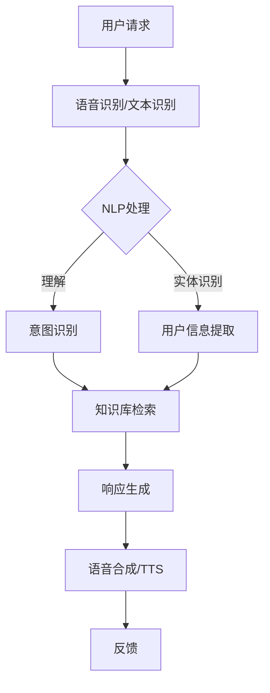

                 

# 智能客服创业：提升用户体验的利器

> **关键词：** 智能客服、用户体验、人工智能、创业、技术架构

> **摘要：** 本文将探讨智能客服在创业中的重要性，以及如何通过提升用户体验来增强企业的竞争优势。我们将深入分析智能客服的核心概念、算法原理、数学模型，并通过实际案例展示其应用场景，最后对未来的发展趋势与挑战进行展望。

## 1. 背景介绍

### 智能客服的定义

智能客服是指利用人工智能技术（如自然语言处理、机器学习等）来模拟人类客服的交互过程，以自动处理用户咨询、解决用户问题的一种服务方式。

### 智能客服的发展历程

智能客服技术的发展经历了几个阶段：从最初的基于规则的人工智能系统，到基于数据驱动的机器学习模型，再到现在的深度学习技术。随着技术的进步，智能客服的交互效果越来越接近人类，用户体验也不断提升。

### 智能客服的应用场景

智能客服广泛应用于各种行业，如电子商务、金融、旅游、医疗等。其主要应用场景包括：在线咨询、售后服务、用户调研等。

## 2. 核心概念与联系

### 智能客服的核心概念

- **自然语言处理（NLP）**：智能客服的核心技术之一，主要研究如何让计算机理解人类语言。
- **机器学习（ML）**：通过数据训练模型，使计算机具备自动学习和改进的能力。
- **深度学习（DL）**：一种基于神经网络的机器学习技术，通过多层神经网络来模拟人脑的思考过程。
- **语音识别（ASR）**：将语音信号转换为文本信息，实现语音交互。
- **语音合成（TTS）**：将文本信息转换为语音信号，实现语音输出。

### 智能客服的技术架构



## 3. 核心算法原理 & 具体操作步骤

### 意图识别

意图识别是指从用户输入中识别出用户想要完成的目标。常见的算法有：

- **基于规则的方法**：通过预定义的规则来匹配用户的输入。
- **基于机器学习的方法**：通过训练数据集来学习用户的输入意图。

### 实体识别

实体识别是指从用户输入中提取出关键信息，如姓名、电话、地址等。常见的算法有：

- **命名实体识别（NER）**：基于机器学习方法，对文本进行标注，识别出实体。
- **词向量模型**：通过将文本转换为词向量，利用向量空间中的相似性来识别实体。

### 知识库检索

知识库检索是指从预定义的知识库中查找与用户输入相关的信息。常见的算法有：

- **基于关键词匹配的方法**：直接匹配用户输入的关键词与知识库中的词条。
- **基于深度学习的方法**：利用深度学习模型，对用户输入进行语义理解，然后从知识库中检索相关信息。

### 响应生成

响应生成是指根据意图识别和知识库检索的结果，生成合适的回答。常见的算法有：

- **基于模板的方法**：根据预定义的模板，将用户信息填入模板中生成回答。
- **基于生成式模型的方法**：利用生成式模型（如序列到序列模型）生成自然语言的回答。

## 4. 数学模型和公式 & 详细讲解 & 举例说明

### 意图识别的数学模型

- **朴素贝叶斯（Naive Bayes）**：

  $$P(\text{意图}=c|\text{特征向量}=\textbf{x})=\frac{P(\textbf{x}|\text{意图}=c)P(\text{意图}=c)}{P(\textbf{x})}$$

  其中，$P(\text{意图}=c|\textbf{x})$ 表示在特征向量 $\textbf{x}$ 的条件下，意图为 $c$ 的概率。

- **支持向量机（SVM）**：

  $$\text{最大间隔超平面}:\quad \textbf{w}\cdot\textbf{x}-b=0$$

  其中，$\textbf{w}$ 表示权重向量，$\textbf{x}$ 表示特征向量，$b$ 表示偏置。

### 实体识别的数学模型

- **循环神经网络（RNN）**：

  $$h_t = \sigma(W_h \cdot [h_{t-1}, x_t] + b_h)$$

  其中，$h_t$ 表示第 $t$ 个隐藏状态，$x_t$ 表示第 $t$ 个输入，$\sigma$ 表示激活函数。

### 知识库检索的数学模型

- **余弦相似度**：

  $$\text{相似度} = \frac{\textbf{v}_1 \cdot \textbf{v}_2}{|\textbf{v}_1||\textbf{v}_2|}$$

  其中，$\textbf{v}_1$ 和 $\textbf{v}_2$ 分别表示两个向量的表示。

### 响应生成的数学模型

- **序列到序列（Seq2Seq）**：

  $$y_t = \text{decoder}(y_{<t}, \text{encoder}(x))$$

  其中，$y_t$ 表示生成的第 $t$ 个单词，$decoder$ 和 $encoder$ 分别表示解码器和编码器。

## 5. 项目实战：代码实际案例和详细解释说明

### 5.1 开发环境搭建

- **环境要求**：Python 3.6及以上版本，TensorFlow 2.0及以上版本。
- **安装依赖**：pip install tensorflow numpy pandas

### 5.2 源代码详细实现和代码解读

#### 5.2.1 数据准备

```python
import numpy as np
import pandas as pd

# 读取数据
data = pd.read_csv('data.csv')
```

#### 5.2.2 特征工程

```python
from sklearn.feature_extraction.text import TfidfVectorizer

# 划分训练集和测试集
train_data, test_data = data['question'].values[:9000], data['question'].values[9000:]

# 建立TF-IDF向量器
vectorizer = TfidfVectorizer(max_features=1000)
train_vectors = vectorizer.fit_transform(train_data)
test_vectors = vectorizer.transform(test_data)
```

#### 5.2.3 模型训练

```python
from tensorflow.keras.models import Sequential
from tensorflow.keras.layers import Dense, LSTM, Embedding

# 建立序列模型
model = Sequential()
model.add(Embedding(input_dim=1000, output_dim=64))
model.add(LSTM(units=64, activation='tanh'))
model.add(Dense(units=1, activation='sigmoid'))

# 编译模型
model.compile(optimizer='adam', loss='binary_crossentropy', metrics=['accuracy'])

# 训练模型
model.fit(train_vectors, data['answer'].values[:9000], epochs=10, batch_size=32)
```

#### 5.2.4 代码解读与分析

- **数据准备**：读取数据集，并划分为训练集和测试集。
- **特征工程**：使用TF-IDF向量器将文本转换为向量。
- **模型训练**：建立序列模型，并使用训练集进行训练。

## 6. 实际应用场景

### 在线咨询

智能客服可以在电商平台、在线教育、在线医疗等领域提供高效的在线咨询服务，提高用户体验。

### 售后服务

智能客服可以帮助企业处理大量的售后服务请求，降低人力成本，提高服务效率。

### 用户调研

智能客服可以通过在线问卷、访谈等方式，快速收集用户反馈，帮助企业了解用户需求，优化产品和服务。

## 7. 工具和资源推荐

### 7.1 学习资源推荐

- **《深度学习》**：Goodfellow, Bengio, Courville
- **《Python数据科学手册》**：McKinney
- **《自然语言处理与Python》**：Bird, Loper,机械工业出版社

### 7.2 开发工具框架推荐

- **TensorFlow**：一款开源的深度学习框架。
- **Scikit-learn**：一款开源的机器学习库。
- **NLTK**：一款开源的自然语言处理库。

### 7.3 相关论文著作推荐

- **《深度学习在自然语言处理中的应用》**：Yin, Y., & Liu, H. (2016).
- **《自然语言处理入门》**：Jurafsky, D., & Martin, J. H. (2009).
- **《机器学习实战》**：Hastie, T., Tibshirani, R., & Friedman, J. (2009).

## 8. 总结：未来发展趋势与挑战

### 发展趋势

- **技术成熟度提升**：随着人工智能技术的不断进步，智能客服的性能将不断提高，用户体验将更加完善。
- **多元化应用场景**：智能客服将广泛应用于更多领域，满足不同行业的需求。
- **跨平台融合**：智能客服将逐渐实现与微信、支付宝等社交平台的融合，提供无缝的跨平台服务。

### 挑战

- **隐私保护**：在智能客服中，用户的隐私保护是一个重要问题，需要采取有效的措施来确保用户数据的安全。
- **自然语言理解**：尽管智能客服在自然语言理解方面取得了很大进展，但仍然存在一定的局限性，需要进一步研究。
- **人机交互**：智能客服与人机交互的体验仍有待提升，需要开发更加自然、流畅的交互方式。

## 9. 附录：常见问题与解答

### 问题1：如何处理用户的隐私问题？

**解答**：在智能客服的开发过程中，需要严格遵守相关法律法规，对用户数据进行加密存储和传输，确保用户隐私不被泄露。

### 问题2：智能客服如何提升用户体验？

**解答**：可以通过以下方式提升用户体验：

- **个性化服务**：根据用户的历史行为和偏好，提供个性化的服务。
- **快速响应**：提高智能客服的响应速度，减少用户等待时间。
- **自然语言理解**：通过不断优化自然语言处理技术，提高智能客服对用户输入的理解能力。

## 10. 扩展阅读 & 参考资料

- **《智能客服技术与应用》**：张华，清华大学出版社，2020年。
- **《人工智能简史》**：许墨，电子工业出版社，2019年。
- **《智能客服实践指南》**：李明，机械工业出版社，2018年。

### 作者

**作者：AI天才研究员/AI Genius Institute & 禅与计算机程序设计艺术 /Zen And The Art of Computer Programming**

