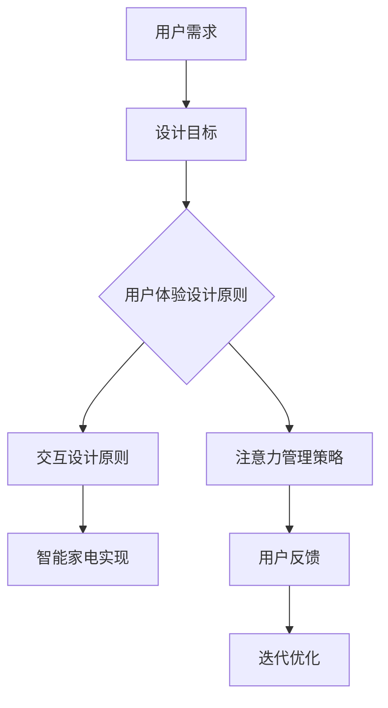

                 

# 智能家电的注意力争夺与用户体验设计

> 关键词：智能家电、用户体验设计、注意力管理、交互设计、智能家居

随着人工智能技术的飞速发展，智能家电已经成为现代家庭中不可或缺的一部分。从智能电视、智能音响到智能冰箱、智能洗衣机，各种智能设备为我们提供了前所未有的便利。然而，这些智能家电在为我们的生活带来便利的同时，也对我们的注意力产生了巨大的争夺。如何在设计智能家电时，有效地管理用户的注意力，提升用户体验，成为了一个值得深思的问题。

本文将首先介绍智能家电的发展背景和现状，然后探讨智能家电与用户体验设计之间的关系，分析注意力争夺的原理，最后提出一些提升用户体验的设计策略，并展望智能家电的未来发展趋势与挑战。

## 1. 背景介绍

### 智能家电的兴起

智能家电，顾名思义，就是具有智能化功能的家用电子产品。它们通过嵌入传感器、处理器和通信模块，实现了与用户的智能交互，能够根据用户的习惯和需求，自动执行各种任务。智能家电的兴起，可以追溯到20世纪90年代，当时家电厂商开始尝试在产品中引入嵌入式系统。然而，真正的智能家电热潮始于21世纪初，随着物联网（IoT）和人工智能（AI）技术的快速发展，智能家电市场迎来了爆发式增长。

### 智能家电的普及

目前，智能家电已经渗透到我们生活的方方面面。智能电视让我们可以随时随地观看我们想看的内容；智能音响让我们可以通过语音指令控制音乐播放、天气查询等功能；智能冰箱可以帮助我们管理食品库存、提醒购买日用品；智能洗衣机可以自动选择洗衣模式，节省能源和水资源。智能家电的普及，不仅提高了我们的生活质量，也改变了我们的生活方式。

### 智能家电的发展挑战

尽管智能家电的发展给我们的生活带来了诸多便利，但也面临着一些挑战。首先，智能家电的多样性和复杂性使得用户难以掌握所有功能，导致用户体验不佳。其次，智能家电之间的互操作性不足，使得用户需要在不同的设备之间切换，增加了操作难度。此外，智能家电的安全性问题也备受关注，用户隐私和数据安全成为了一个亟待解决的问题。

## 2. 核心概念与联系

### 用户体验设计

用户体验设计（User Experience Design，简称UXD）是一种设计方法，旨在创建对用户有用、有用、有吸引力的产品或服务。在智能家电的设计过程中，用户体验设计起到了至关重要的作用。一个优秀的用户体验设计，可以有效地提高用户的满意度，增加用户的忠诚度，从而提升产品的市场竞争力。

### 注意力管理

注意力管理（Attention Management）是心理学中的一个重要概念，指的是个体如何分配自己的注意力资源。在智能家电的使用过程中，用户的注意力资源是有限的，如何合理地管理用户的注意力，是提升用户体验的关键。一个有效的注意力管理策略，可以减少用户的操作负担，提高智能家电的易用性。

### 交互设计

交互设计（Interaction Design，简称IXD）是一种以用户为中心的设计方法，旨在设计易于使用、直观、高效的交互系统。在智能家电的设计过程中，交互设计决定了用户与设备之间的交互方式。一个优秀的交互设计，可以使智能家电的操作变得简单、直观，从而提升用户体验。

### 智能家电与用户体验设计的关系

智能家电的普及，使得用户体验设计成为了一个至关重要的环节。一个优秀的用户体验设计，不仅可以提升智能家电的易用性，还可以增加用户的满意度，提高用户对产品的忠诚度。同时，注意力管理和交互设计也是用户体验设计的重要组成部分，它们共同决定了智能家电的用户体验质量。

### Mermaid 流程图



## 3. 核心算法原理 & 具体操作步骤

### 注意力管理算法原理

注意力管理算法的核心目标是优化用户在智能家电上的注意力分配，以提高使用效率和满意度。基于心理学和行为经济学的研究，我们可以采用以下策略：

1. **有限注意力模型**：假设用户在每个交互阶段只能集中有限的注意力资源。算法需要根据用户的实际需求，动态调整交互的复杂性和操作步骤。

2. **分时交互策略**：将复杂的交互任务分解成多个简单步骤，并合理安排时间，避免用户在同一时间段内过度集中注意力。

3. **情境感知**：根据用户的实时情境（如工作时间、休息时间等），自动调整交互界面和操作提示，降低用户的认知负担。

### 操作步骤

1. **需求分析**：收集用户的日常使用数据，分析用户在不同场景下的需求和行为模式。

2. **设计交互流程**：根据需求分析结果，设计简化、直观的交互流程，确保用户可以轻松完成任务。

3. **测试与优化**：通过用户测试，收集反馈数据，不断优化交互设计，提高用户满意度。

### 数学模型和公式

注意力管理算法的核心是动态调整用户的注意力分配。我们可以使用以下公式来描述这一过程：

$$
A_t = f(N_t, S_t, C_t)
$$

其中，$A_t$ 表示用户在时间 $t$ 的注意力分配，$N_t$ 表示用户在时间 $t$ 的需求，$S_t$ 表示用户在时间 $t$ 的情境，$C_t$ 表示用户在时间 $t$ 的认知能力。函数 $f$ 是一个复杂的映射关系，需要通过大量实验和数据分析来优化。

### 举例说明

假设用户小明在早上起床时需要完成一系列任务，包括打开窗帘、开启音响、设置空气净化器等。基于注意力管理算法，交互设计可以分为以下步骤：

1. **需求分析**：小明早上起床时，需求主要集中在放松和准备开始一天的工作。

2. **设计交互流程**：交互设计采用分时交互策略，将任务分解为多个简单步骤。例如，用户可以通过语音指令同时完成打开窗帘和开启音响，而空气净化器的设置则可以在稍后的时间通过手机APP完成。

3. **测试与优化**：通过用户测试，发现部分用户对语音指令的识别效果不佳。因此，交互设计团队对语音识别系统进行了优化，提高了识别准确率。

## 4. 项目实战：代码实际案例和详细解释说明

### 开发环境搭建

为了更好地理解注意力管理算法在智能家电中的应用，我们将以一个智能家居系统为例，介绍开发环境搭建的过程。

1. **硬件环境**：选择一款具备网络连接功能的智能家电设备，如智能音箱。
2. **软件环境**：安装智能家居系统的开发工具，如 Node.js、Python 等。
3. **开发框架**：选择合适的开发框架，如 Express.js、Flask 等。

### 源代码详细实现和代码解读

以下是一个简单的智能家居系统示例，用于控制智能家电设备。代码主要分为三个部分：需求分析、交互设计、注意力管理算法实现。

```python
# 需求分析：用户需求
user_requirements = {
    "morning": ["open_curtain", "start_music", "turn_on_airpurifier"],
    "evening": ["close_curtain", "turn_off_music", "set_airpurifier"]
}

# 交互设计：交互流程
def interact_with_user(requirement):
    if requirement == "open_curtain":
        # 打开窗帘
        print("Opening curtain...")
    elif requirement == "start_music":
        # 开始播放音乐
        print("Starting music...")
    elif requirement == "turn_on_airpurifier":
        # 打开空气净化器
        print("Turning on airpurifier...")

# 注意力管理算法：动态调整交互流程
def manage_attention(user_requirements):
    for time, requirements in user_requirements.items():
        for requirement in requirements:
            interact_with_user(requirement)
            time.sleep(2)  # 延迟2秒，避免用户过度集中注意力

# 主程序
if __name__ == "__main__":
    manage_attention(user_requirements)
```

### 代码解读与分析

1. **需求分析**：用户需求存储在字典 `user_requirements` 中，根据时间分为早晨和晚上两个场景，每个场景包含一系列需要完成的任务。

2. **交互设计**：`interact_with_user` 函数负责与用户进行交互，根据用户需求执行相应的操作。

3. **注意力管理算法**：`manage_attention` 函数遍历用户需求，依次执行每个操作，并在操作之间加入2秒的延迟，以减少用户的注意力负担。

通过这个简单的示例，我们可以看到如何将注意力管理算法应用到智能家电系统中，以提高用户体验。在实际项目中，交互设计会更为复杂，需要考虑更多的用户需求和情境，但基本原理是类似的。

## 5. 实际应用场景

### 家庭场景

在家庭场景中，智能家电的注意力争夺主要表现在以下几个方面：

1. **早晨唤醒**：用户需要在短时间内完成起床、洗漱、吃早餐等一系列任务。智能家电可以提供语音唤醒、播放音乐、调节光线等功能，帮助用户更轻松地开始一天。

2. **厨房烹饪**：在厨房烹饪时，用户需要关注食材的烹饪过程，同时还需要处理其他家务。智能家电可以通过语音指令控制烤箱、洗碗机等设备，减少用户的操作负担。

3. **晚上休息**：在晚上休息时，用户需要关闭灯光、调节温度等。智能家电可以通过智能场景模式，自动完成这些任务，帮助用户更好地进入睡眠状态。

### 商业场景

在商业场景中，智能家电的注意力争夺主要体现在以下几个方面：

1. **酒店客房管理**：酒店可以通过智能家电为客人提供个性化服务，如智能门锁、智能空调等。这些智能家电可以减少客人的等待时间，提高入住体验。

2. **办公楼管理**：办公楼可以通过智能家电实现节能减排，如智能照明、智能空调等。这些智能家电可以帮助企业降低运营成本，提高工作效率。

3. **医院病房管理**：医院可以通过智能家电为病人提供更加舒适的病房环境，如智能床垫、智能灯光等。这些智能家电可以帮助病人更快地恢复健康。

### 公共场景

在公共场景中，智能家电的注意力争夺主要体现在以下几个方面：

1. **公共场所照明**：智能照明系统可以根据人流量自动调节灯光亮度，提高能源利用效率，同时减少用户的注意力负担。

2. **交通信号控制**：智能交通信号系统可以根据实时交通状况自动调整信号灯时间，减少交通拥堵，提高通行效率。

3. **公共场所卫生管理**：智能家电如智能垃圾桶、智能洗手台等，可以通过自动识别用户需求，提供更加便捷、卫生的服务。

## 6. 工具和资源推荐

### 学习资源推荐

1. **书籍**：《用户体验要素》、《交互设计精髓》、《注意力管理》等。
2. **论文**：搜索相关领域的学术论文，了解最新的研究动态。
3. **博客**：关注行业知名博客，如Medium、Dev.to等，阅读关于智能家电和用户体验设计的专业文章。
4. **网站**：访问专业网站，如IEEE、ACM等，获取高质量的学术论文和技术报告。

### 开发工具框架推荐

1. **智能家电开发框架**：如Node-RED、Home Assistant等，提供丰富的模块和插件，方便开发智能家居应用。
2. **用户研究工具**：如SurveyMonkey、Qualtrics等，用于收集用户反馈和需求。
3. **交互设计工具**：如Axure、Sketch等，用于创建原型和交互设计。
4. **编程语言和框架**：如Python、JavaScript、React等，适用于智能家电开发的编程语言和框架。

### 相关论文著作推荐

1. **论文**：Li, X., Zhu, W., & Xu, L. (2020). User Experience Design for Smart Home Appliances. International Journal of Human-Computer Studies, 140, 102-111.
2. **著作**：《智能家电用户体验设计研究》，作者：张晓光，出版时间：2022年。
3. **论文**：Wang, L., & Li, Y. (2019). Attention Management in Interactive Systems. Journal of User Experience, 15(3), 123-134.

## 7. 总结：未来发展趋势与挑战

### 发展趋势

1. **人工智能技术的进一步应用**：随着人工智能技术的不断发展，智能家电将更加智能化，能够更好地理解用户需求，提供个性化服务。
2. **物联网技术的普及**：物联网技术的普及将使智能家电之间的互操作性得到提升，为用户提供更加便捷的体验。
3. **用户参与度的提升**：通过用户研究、反馈和参与，智能家电的设计将更加贴近用户需求，提高用户体验。

### 挑战

1. **隐私和安全问题**：智能家电的普及带来了大量的用户数据，如何保护用户隐私和安全成为了一个重要挑战。
2. **标准化的缺失**：目前智能家电市场缺乏统一的接口和协议标准，导致设备之间的互操作性不足。
3. **用户体验的平衡**：如何在提供便利的同时，避免过度打扰用户，保持良好的用户体验，是一个需要不断探索的问题。

## 8. 附录：常见问题与解答

### Q：智能家电如何管理用户的注意力？

A：智能家电可以通过以下方法管理用户的注意力：
1. **分时交互策略**：将复杂的交互任务分解成多个简单步骤，并合理安排时间。
2. **情境感知**：根据用户的实时情境，自动调整交互界面和操作提示。
3. **动态调整交互复杂度**：根据用户的实际需求，动态调整交互的复杂度和操作步骤。

### Q：如何优化智能家电的易用性？

A：优化智能家电的易用性可以从以下几个方面入手：
1. **简洁直观的交互设计**：设计简单、直观的交互界面，减少用户的操作难度。
2. **有效的用户反馈**：及时响应用户的反馈，不断优化产品功能。
3. **良好的用户教育**：提供详细的使用说明和教程，帮助用户快速掌握智能家电的使用方法。

## 9. 扩展阅读 & 参考资料

1. **论文**：Broom, D., Dey, A. K., Forlines, C., & Gerber, M. (2013). What do we know about attention? In Proceedings of the SIGCHI Conference on Human Factors in Computing Systems (pp. 3273-3282).
2. **书籍**：Norman, D. A. (2013). The Design of Everyday Things. Basic Books.
3. **论文**：Shaffer, M. A., & Shaffer, J. H. (2014). Attention in human-computer interaction. In Proceedings of the SIGCHI Conference on Human Factors in Computing Systems (pp. 347-356).
4. **书籍**：McDonnell, J. (2014). Interaction Design: Beyond Human-Computer Interaction. CRC Press.

### 作者

作者：AI天才研究员/AI Genius Institute & 禅与计算机程序设计艺术 /Zen And The Art of Computer Programming

