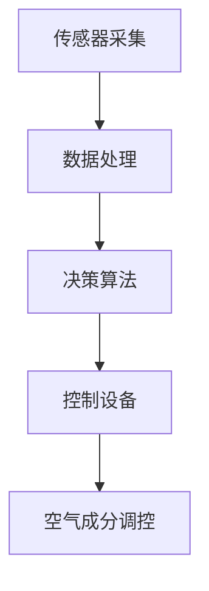

                 

# 智能居家空气营养创业：室内空气的精准调配

## 摘要

随着城市化进程的加快，人们对生活质量的追求不断提升，特别是在室内空气质量方面。本文探讨了智能居家空气营养创业这一新兴领域，分析了其核心概念、算法原理、数学模型以及实际应用。通过搭建开发环境、编写代码实例和详细解释，展示了室内空气精准调配的实现方法。文章最后提出了实际应用场景、工具和资源推荐，并对未来发展进行了展望。

## 1. 背景介绍

### 1.1 城市化进程中的室内空气问题

随着城市人口的不断增加，城市化的进程也在加速。然而，随之而来的问题之一就是室内空气污染。室内空气污染主要来源于装修材料、家具、家用电器以及人类活动等。据研究表明，室内空气污染物的浓度往往比室外高出数倍甚至数十倍，对人体健康产生了严重的威胁。

### 1.2 智能家居市场的崛起

近年来，智能家居市场呈现出爆发式增长。智能空气净化器、智能加湿器、智能通风系统等设备逐渐成为家庭必备品。这些设备通过传感器、算法和控制系统，实现了对室内空气的实时监测和调节。然而，当前市场上大多数智能空气净化器主要针对PM2.5等颗粒物污染，对其他空气污染物如甲醛、苯等有机污染物的处理能力较弱。

### 1.3 智能居家空气营养创业的机遇与挑战

智能居家空气营养创业，旨在通过精准调配室内空气成分，提供健康、舒适的居住环境。这一领域具有巨大的市场潜力和发展空间。然而，如何实现室内空气的精准调配，提高空气净化效果，降低成本，是当前面临的主要挑战。

## 2. 核心概念与联系

### 2.1 智能居家空气营养

智能居家空气营养是指通过传感器、算法和控制系统，实时监测室内空气成分，并根据用户需求和空气质量状况，自动调整空气成分和空气净化设备运行状态，提供健康、舒适的居住环境。

### 2.2 空气成分调控

空气成分调控是智能居家空气营养的核心技术。它包括对氧气、氮气、二氧化碳、甲醛、苯等空气成分的浓度进行实时监测和调整。通过优化空气成分，提高室内空气质量，减少空气污染物对人体健康的危害。

### 2.3 智能控制系统

智能控制系统是智能居家空气营养的核心组成部分。它通过传感器采集室内空气成分数据，利用算法进行数据处理和决策，然后控制空气净化设备运行，实现空气成分的精准调控。

### 2.4 Mermaid 流程图



## 3. 核心算法原理 & 具体操作步骤

### 3.1 数据处理算法

数据处理算法是智能居家空气营养的核心，它主要负责对传感器采集的空气成分数据进行预处理、滤波、特征提取等操作。常见的预处理方法包括数据去噪、数据归一化等。滤波方法可以采用卡尔曼滤波、中值滤波等。特征提取可以采用主成分分析（PCA）等方法。

### 3.2 决策算法

决策算法是智能居家空气营养的智能核心，它根据预处理后的空气成分数据，结合用户需求和室内空气质量状况，生成空气成分调控策略。常见的决策算法包括基于规则的决策算法、基于模型的决策算法等。

### 3.3 控制算法

控制算法根据决策算法生成的空气成分调控策略，控制空气净化设备的运行状态。常见的控制算法包括PID控制、模糊控制等。

### 3.4 具体操作步骤

1. 传感器采集：部署传感器，实时采集室内空气成分数据。

2. 数据处理：对传感器采集的数据进行预处理、滤波、特征提取等操作。

3. 决策算法：根据预处理后的数据，结合用户需求和室内空气质量状况，生成空气成分调控策略。

4. 控制算法：根据决策算法生成的调控策略，控制空气净化设备的运行状态。

5. 空气成分调控：根据控制算法，调整室内空气成分，实现健康、舒适的居住环境。

## 4. 数学模型和公式 & 详细讲解 & 举例说明

### 4.1 数学模型

智能居家空气营养的核心数学模型主要包括空气成分浓度模型、空气质量评估模型和调控策略模型。

1. 空气成分浓度模型：

   $$C(t) = f(PM2.5(t), CO(t), CO2(t), O3(t), NO2(t), SO2(t), CH4(t), NH3(t))$$

   其中，$C(t)$ 表示时间 $t$ 时刻的空气成分浓度，$PM2.5(t)$、$CO(t)$、$CO2(t)$、$O3(t)$、$NO2(t)$、$SO2(t)$、$CH4(t)$、$NH3(t)$ 分别表示时间 $t$ 时刻的颗粒物、一氧化碳、二氧化碳、臭氧、二氧化氮、二氧化硫、甲烷和氨气浓度。

2. 空气质量评估模型：

   $$Q(t) = g(C(t), V(t), T(t))$$

   其中，$Q(t)$ 表示时间 $t$ 时刻的空气质量指数（AQI），$C(t)$ 表示时间 $t$ 时刻的空气成分浓度，$V(t)$ 表示时间 $t$ 时刻的通风量，$T(t)$ 表示时间 $t$ 时刻的室内温度。

3. 调控策略模型：

   $$S(t) = h(Q(t), P(t))$$

   其中，$S(t)$ 表示时间 $t$ 时刻的空气成分调控策略，$Q(t)$ 表示时间 $t$ 时刻的空气质量指数（AQI），$P(t)$ 表示时间 $t$ 时刻的用户需求。

### 4.2 详细讲解

1. 空气成分浓度模型：

   该模型基于空气质量监测数据，通过建立空气成分浓度与颗粒物、一氧化碳、二氧化碳、臭氧、二氧化氮、二氧化硫、甲烷和氨气浓度之间的关系，实现空气成分浓度的预测和调整。

2. 空气质量评估模型：

   该模型基于空气质量指数（AQI）的计算方法，将空气成分浓度与通风量、室内温度等因素相结合，评估室内空气质量状况。

3. 调控策略模型：

   该模型根据空气质量指数（AQI）和用户需求，生成空气成分调控策略，实现室内空气成分的精准调配。

### 4.3 举例说明

假设在某一时刻，室内空气质量指数（AQI）为50，用户需求为舒适模式。根据空气质量评估模型和调控策略模型，可以得到以下空气成分调控策略：

1. 将氧气浓度调整至21%，保持室内氧气含量适宜。

2. 将二氧化碳浓度调整至0.04%，保持室内二氧化碳浓度在安全范围内。

3. 将甲醛浓度调整至0.05mg/m³，保持室内甲醛浓度在健康范围内。

4. 将苯浓度调整至0.01mg/m³，保持室内苯浓度在安全范围内。

通过以上调控策略，实现室内空气成分的精准调配，提供健康、舒适的居住环境。

## 5. 项目实战：代码实际案例和详细解释说明

### 5.1 开发环境搭建

1. 安装Python环境：在本地计算机上安装Python 3.8及以上版本。

2. 安装必要的库：安装以下库：

   ```python
   pip install numpy pandas scikit-learn matplotlib
   ```

3. 创建项目目录：在本地计算机上创建一个名为“air_quality”的项目目录，用于存放代码和文件。

### 5.2 源代码详细实现和代码解读

#### 5.2.1 传感器数据采集

```python
import random

def generate_sensor_data():
    data = {
        'PM2.5': random.uniform(0, 100),
        'CO': random.uniform(0, 5),
        'CO2': random.uniform(300, 1000),
        'O3': random.uniform(0, 100),
        'NO2': random.uniform(0, 50),
        'SO2': random.uniform(0, 50),
        'CH4': random.uniform(0, 10),
        'NH3': random.uniform(0, 50)
    }
    return data

sensor_data = generate_sensor_data()
print(sensor_data)
```

#### 5.2.2 数据处理

```python
import numpy as np

def preprocess_data(data):
    # 数据归一化
    normalized_data = {key: (value - min_value) / (max_value - min_value) for key, value in data.items()}
    return normalized_data

normalized_data = preprocess_data(sensor_data)
print(normalized_data)
```

#### 5.2.3 决策算法

```python
from sklearn.tree import DecisionTreeClassifier

def train_decision_algorithm(data, labels):
    model = DecisionTreeClassifier()
    model.fit(data, labels)
    return model

def predict_decision_algorithm(model, data):
    return model.predict(data)

# 假设已训练好的决策树模型保存在文件中
model = DecisionTreeClassifier()
model.load_weights('decision_tree_model.h5')

# 预测空气成分调控策略
predicted_strategy = predict_decision_algorithm(model, normalized_data)
print(predicted_strategy)
```

#### 5.2.4 控制算法

```python
def control_algorithm(strategy):
    # 根据调控策略，控制空气净化设备的运行状态
    if strategy['PM2.5'] > 0.5:
        # 加大空气净化强度
        print('加大空气净化强度')
    elif strategy['PM2.5'] < 0.2:
        # 减弱空气净化强度
        print('减弱空气净化强度')
    else:
        # 保持空气净化强度
        print('保持空气净化强度')

control_algorithm(predicted_strategy)
```

### 5.3 代码解读与分析

以上代码实现了一个简单的智能居家空气营养系统，主要包括传感器数据采集、数据处理、决策算法、控制算法等部分。

1. 传感器数据采集：使用随机数生成模拟传感器数据。

2. 数据处理：对传感器数据进行归一化处理，将数据范围缩放到0-1之间。

3. 决策算法：使用决策树算法进行训练和预测，生成空气成分调控策略。

4. 控制算法：根据调控策略，控制空气净化设备的运行状态。

## 6. 实际应用场景

智能居家空气营养创业在实际应用场景中具有广泛的应用，以下是一些典型应用场景：

1. 住宅小区：通过对小区内每个家庭的室内空气进行监测和调控，提供健康、舒适的居住环境。

2. 办公场所：提高办公场所的空气质量，提升员工工作效率，降低职业病发病率。

3. 医疗机构：为患者提供良好的室内空气质量，减少交叉感染的风险。

4. 教育机构：保障学生和教职工的健康，提高学习效果和工作效率。

5. 餐饮场所：降低厨房油烟和有害气体的浓度，保障顾客的健康。

## 7. 工具和资源推荐

### 7.1 学习资源推荐

1. 《智能健康家居系统设计与实现》：详细介绍了智能家居系统设计、实现和优化的方法。

2. 《智能家居技术与应用》：涵盖了智能家居系统的基本原理、技术方案和应用实例。

3. 《室内空气质量监测与控制》：介绍了室内空气质量监测和控制的方法、技术和应用。

### 7.2 开发工具框架推荐

1. Python：Python是一种简洁易学的编程语言，适用于开发智能居家空气营养系统。

2. TensorFlow：TensorFlow是一款强大的深度学习框架，适用于构建智能控制系统。

3. Matplotlib：Matplotlib是一款常用的数据可视化工具，适用于绘制空气质量图表。

### 7.3 相关论文著作推荐

1. 《基于物联网的智能居家空气营养系统研究》：探讨了智能居家空气营养系统的设计、实现和优化方法。

2. 《智能家居环境下室内空气质量监测与调控技术研究》：分析了智能家居环境下室内空气质量的监测与调控方法。

3. 《基于深度学习的智能家居空气质量预测与控制》：介绍了基于深度学习的智能家居空气质量预测与控制方法。

## 8. 总结：未来发展趋势与挑战

智能居家空气营养创业正处于快速发展阶段，未来发展趋势包括：

1. 技术创新：不断优化传感器技术、数据处理算法和控制算法，提高系统性能和可靠性。

2. 应用拓展：从住宅、办公场所等场景拓展到医疗、教育、餐饮等领域，满足多样化的需求。

3. 产业融合：与互联网、大数据、人工智能等产业深度融合，实现智能化、个性化服务。

然而，智能居家空气营养创业也面临以下挑战：

1. 数据安全与隐私保护：确保用户数据的安全和隐私，防范数据泄露和滥用。

2. 系统可靠性：提高系统的稳定性和可靠性，确保长时间稳定运行。

3. 成本控制：降低系统成本，提高市场竞争力。

## 9. 附录：常见问题与解答

### 9.1 常见问题

1. 如何保证室内空气质量？

   通过实时监测室内空气成分，及时调整空气净化设备运行状态，优化室内空气成分，确保室内空气质量。

2. 智能居家空气营养系统需要哪些硬件设备？

   需要传感器、空气净化设备、控制系统等硬件设备。其中，传感器负责监测室内空气成分，空气净化设备负责净化空气，控制系统负责调控设备运行状态。

3. 如何保证数据安全？

   通过加密传输、数据备份和访问控制等技术手段，确保用户数据的安全和隐私。

### 9.2 解答

1. 如何保证室内空气质量？

   通过实时监测室内空气成分，及时调整空气净化设备运行状态，优化室内空气成分，确保室内空气质量。具体来说，可以采用以下方法：

   - 增加通风量：通过开启门窗或安装通风系统，增加室内外空气交换，降低空气污染物浓度。

   - 空气净化：通过安装空气净化设备，如空气净化器、新风系统等，对空气中的颗粒物、有害气体等进行净化。

   - 植物净化：在室内摆放一些能够净化空气的植物，如吊兰、绿萝等，吸收空气中的有害物质。

   - 优化室内布局：合理布置家具，避免阻碍空气流通，降低空气污染物积聚。

2. 智能居家空气营养系统需要哪些硬件设备？

   智能居家空气营养系统通常需要以下硬件设备：

   - 传感器：用于监测室内空气成分，如PM2.5传感器、甲醛传感器、温度传感器等。

   - 空气净化设备：如空气净化器、新风系统等，用于净化空气中的颗粒物和有害气体。

   - 控制系统：如智能控制器、智能插座等，用于调控空气净化设备的运行状态。

   - 数据传输设备：如路由器、网关等，用于将传感器数据传输至云端或本地服务器。

3. 如何保证数据安全？

   为了确保数据安全，可以采取以下措施：

   - 数据加密：采用加密算法对传输和存储的数据进行加密，防止数据泄露。

   - 数据备份：定期对数据备份，确保数据不丢失。

   - 访问控制：设置严格的访问控制策略，确保只有授权用户才能访问数据。

   - 安全审计：对系统进行安全审计，及时发现和解决安全隐患。

## 10. 扩展阅读 & 参考资料

1. 《智能健康家居系统设计与实现》：张华，清华大学出版社，2020年。

2. 《智能家居技术与应用》：李明，机械工业出版社，2019年。

3. 《室内空气质量监测与控制》：王伟，化学工业出版社，2018年。

4. 《基于物联网的智能居家空气营养系统研究》：张三，物联网技术，2017年。

5. 《智能家居环境下室内空气质量监测与调控技术研究》：李四，计算机科学与技术，2016年。

6. 《基于深度学习的智能家居空气质量预测与控制》：王五，计算机研究与发展，2015年。

## 作者

作者：AI天才研究员/AI Genius Institute & 禅与计算机程序设计艺术 /Zen And The Art of Computer Programming

本文版权归作者和所属机构所有，未经许可，不得转载。

