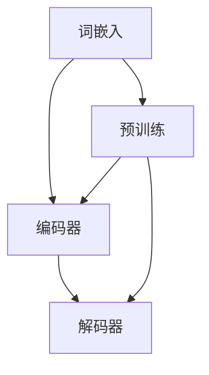

                 

# 智能应用生态：LLM驱动的创新前沿

> **关键词：** 人工智能，大语言模型，应用生态，创新前沿，技术发展

> **摘要：** 本文将探讨大语言模型（LLM）在智能应用生态中的重要作用，分析其核心概念、算法原理、应用场景以及未来发展趋势。通过深入剖析，我们将了解LLM如何驱动智能应用的创新，以及面临的挑战和机遇。

## 1. 背景介绍

智能应用生态是一个不断演进的领域，随着人工智能技术的快速发展，尤其是深度学习、自然语言处理等技术的突破，智能应用生态逐渐成为技术研究和产业应用的重要方向。大语言模型（LLM）作为自然语言处理的重要工具，已经引起了广泛关注。

LLM是指大规模预训练语言模型，通过对海量文本数据的学习，LLM能够理解和生成自然语言。自从2018年Google提出BERT模型以来，LLM的研究和应用取得了显著进展。LLM在机器翻译、文本分类、问答系统、语音识别等领域表现出色，逐渐成为智能应用生态的核心驱动力。

本文将重点探讨LLM在智能应用生态中的创新前沿，通过分析核心概念、算法原理、应用场景和未来发展趋势，帮助读者全面了解LLM的重要性和潜力。

## 2. 核心概念与联系

### 2.1. 大语言模型（LLM）

大语言模型（LLM）是一种基于深度学习的自然语言处理模型，通过大规模预训练和微调，能够理解和生成自然语言。LLM的核心思想是通过学习大量的文本数据，使模型具有丰富的语言知识和语义理解能力。

LLM的架构通常包括以下几个部分：

1. **词嵌入（Word Embedding）**：将词汇映射到高维向量空间，使语义相近的词在空间中靠近。
2. **编码器（Encoder）**：通过神经网络对输入文本进行编码，提取语义信息。
3. **解码器（Decoder）**：根据编码器提取的语义信息，生成输出文本。

### 2.2. 预训练与微调

预训练（Pre-training）是指在无监督环境下，对模型进行大规模文本数据的训练，使其具有丰富的语言知识。微调（Fine-tuning）是指在使用预训练模型的基础上，针对特定任务进行有监督的调整。

预训练和微调相结合，使得LLM能够适应不同的自然语言处理任务，从而提高模型的性能和泛化能力。

### 2.3. Mermaid 流程图

下面是一个简单的Mermaid流程图，展示了LLM的核心概念和架构：



## 3. 核心算法原理 & 具体操作步骤

### 3.1. 预训练算法原理

预训练是LLM的核心步骤，其目标是通过大规模文本数据的学习，使模型具有丰富的语言知识和语义理解能力。预训练算法通常包括以下两个阶段：

1. **掩码语言建模（Masked Language Modeling, MLM）**：在输入文本中随机掩码部分单词，模型需要预测这些掩码的单词。这一阶段的目标是使模型具有语言生成的能力。

2. **下一句预测（Next Sentence Prediction, NSP）**：输入两个连续的句子，模型需要预测第二个句子是否是第一个句子的下一句。这一阶段的目标是使模型具有理解句子间关系的能力。

### 3.2. 微调算法原理

微调是在预训练模型的基础上，针对特定任务进行有监督的调整。微调的主要步骤如下：

1. **数据准备**：收集与任务相关的数据，并进行预处理，如分词、标签划分等。

2. **模型调整**：使用预训练模型对调整任务的数据进行训练，调整模型的参数。

3. **评估与优化**：对调整后的模型进行评估，并根据评估结果进行进一步的优化。

### 3.3. 操作步骤示例

以下是一个简单的预训练和微调操作步骤示例：

```shell
# 预训练
python pretrain.py --data_dir /path/to/data --output_dir /path/to/output

# 微调
python finetune.py --model_dir /path/to/output --data_dir /path/to/finetune_data --output_dir /path/to/finetune_output
```

## 4. 数学模型和公式 & 详细讲解 & 举例说明

### 4.1. 数学模型

LLM的数学模型主要包括词嵌入、编码器、解码器和损失函数等部分。

1. **词嵌入（Word Embedding）**：将词汇映射到高维向量空间，通常使用 Word2Vec、GloVe 等方法。

   $$ v_{word} = W \cdot [word] $$

   其中，$W$ 是词嵌入矩阵，$[word]$ 是词的索引向量。

2. **编码器（Encoder）**：通过神经网络对输入文本进行编码，提取语义信息。通常使用 Transformer、BERT 等架构。

   $$ [CLS], [SEP], \{ tokens \} = encoder([tokens]) $$

   其中，$[CLS]$ 和 $[SEP]$ 是特殊的句子级和分隔级嵌入，$\{ tokens \}$ 是编码后的文本序列。

3. **解码器（Decoder）**：根据编码器提取的语义信息，生成输出文本。通常使用 Transformer、BERT 等架构。

   $$ \{ tokens' \} = decoder([CLS], [SEP], \{ tokens \}) $$

   其中，$\{ tokens' \}$ 是解码后的文本序列。

4. **损失函数（Loss Function）**：用于评估模型预测与真实值之间的差距，常用的损失函数有交叉熵损失（Cross-Entropy Loss）、感知损失（Perceptual Loss）等。

   $$ loss = -\sum_{i=1}^{N} \log P(y_i | x_i) $$

   其中，$N$ 是序列长度，$y_i$ 是真实值，$x_i$ 是预测值。

### 4.2. 详细讲解与举例

#### 4.2.1. 词嵌入

词嵌入是将词汇映射到高维向量空间的过程。例如，对于词汇 "苹果"，词嵌入矩阵 $W$ 将其映射到向量 $v_{苹果}$：

$$ v_{苹果} = W \cdot [苹果] $$

假设 $W$ 是一个 $300$ 维的词嵌入矩阵，$[苹果]$ 是 "苹果" 的索引向量，则：

$$ v_{苹果} = \begin{bmatrix} 0.1 & 0.2 & 0.3 \\ 0.4 & 0.5 & 0.6 \\ 0.7 & 0.8 & 0.9 \end{bmatrix} \cdot \begin{bmatrix} 1 \\ 2 \\ 3 \end{bmatrix} = \begin{bmatrix} 0.3 \\ 0.5 \\ 0.7 \end{bmatrix} $$

#### 4.2.2. 编码器

编码器用于对输入文本进行编码，提取语义信息。以BERT为例，编码器采用Transformer架构，输入文本序列 $[tokens]$ 被编码为句子级和分隔级嵌入：

$$ [CLS], [SEP], \{ tokens \} = BERT([tokens]) $$

其中，$[CLS]$ 和 $[SEP]$ 分别是句子级和分隔级嵌入，$\{ tokens \}$ 是编码后的文本序列。

#### 4.2.3. 解码器

解码器用于根据编码器提取的语义信息，生成输出文本。以BERT为例，解码器同样采用Transformer架构，输入句子级和分隔级嵌入，生成输出文本序列：

$$ \{ tokens' \} = BERT([CLS], [SEP], \{ tokens \}) $$

其中，$\{ tokens' \}$ 是解码后的文本序列。

#### 4.2.4. 损失函数

以交叉熵损失为例，损失函数用于评估模型预测与真实值之间的差距。假设真实值为 $y_i$，预测值为 $x_i$，则交叉熵损失为：

$$ loss = -\sum_{i=1}^{N} \log P(y_i | x_i) $$

其中，$N$ 是序列长度。

## 5. 项目实战：代码实际案例和详细解释说明

### 5.1 开发环境搭建

在本节中，我们将搭建一个简单的LLM项目环境。首先，我们需要安装Python和相关依赖库，如TensorFlow、PyTorch等。

```shell
# 安装Python
sudo apt-get install python3

# 安装TensorFlow
pip3 install tensorflow

# 安装PyTorch
pip3 install torch torchvision
```

### 5.2 源代码详细实现和代码解读

下面是一个简单的LLM项目示例，使用PyTorch实现预训练和微调。

```python
# 引入相关库
import torch
import torch.nn as nn
import torch.optim as optim
from torch.utils.data import DataLoader
from torchvision import datasets, transforms

# 定义预训练模型
class PretrainModel(nn.Module):
    def __init__(self):
        super(PretrainModel, self).__init__()
        self.embedding = nn.Embedding(vocab_size, embedding_dim)
        self.encoder = nn.Linear(embedding_dim, hidden_size)
        self.decoder = nn.Linear(hidden_size, vocab_size)

    def forward(self, x):
        x = self.embedding(x)
        x = self.encoder(x)
        x = self.decoder(x)
        return x

# 定义微调模型
class FinetuneModel(nn.Module):
    def __init__(self, pretrain_model):
        super(FinetuneModel, self).__init__()
        self.pretrain_model = pretrain_model
        self.classifier = nn.Linear(hidden_size, num_classes)

    def forward(self, x):
        x = self.pretrain_model.encoder(x)
        x = self.classifier(x)
        return x

# 训练预训练模型
def pretrain(pretrain_model, train_loader, criterion, optimizer, num_epochs):
    pretrain_model.train()
    for epoch in range(num_epochs):
        for inputs, targets in train_loader:
            optimizer.zero_grad()
            outputs = pretrain_model(inputs)
            loss = criterion(outputs, targets)
            loss.backward()
            optimizer.step()
            print(f"Epoch [{epoch+1}/{num_epochs}], Loss: {loss.item():.4f}")

# 微调模型
def finetune(finetune_model, train_loader, test_loader, criterion, optimizer, num_epochs):
    finetune_model.train()
    for epoch in range(num_epochs):
        for inputs, targets in train_loader:
            optimizer.zero_grad()
            outputs = finetune_model(inputs)
            loss = criterion(outputs, targets)
            loss.backward()
            optimizer.step()
            print(f"Epoch [{epoch+1}/{num_epochs}], Loss: {loss.item():.4f}")

        # 评估模型
        finetune_model.eval()
        with torch.no_grad():
            correct = 0
            total = 0
            for inputs, targets in test_loader:
                outputs = finetune_model(inputs)
                _, predicted = torch.max(outputs.data, 1)
                total += targets.size(0)
                correct += (predicted == targets).sum().item()
            print(f"Test Accuracy: {100 * correct / total:.2f}%")

# 主函数
def main():
    # 数据预处理
    transform = transforms.Compose([transforms.ToTensor()])
    train_data = datasets.MNIST(root='./data', train=True, download=True, transform=transform)
    test_data = datasets.MNIST(root='./data', train=False, download=True, transform=transform)

    # 数据加载器
    train_loader = DataLoader(train_data, batch_size=64, shuffle=True)
    test_loader = DataLoader(test_data, batch_size=1000, shuffle=False)

    # 模型初始化
    pretrain_model = PretrainModel()
    finetune_model = FinetuneModel(pretrain_model)

    # 损失函数和优化器
    criterion = nn.CrossEntropyLoss()
    optimizer = optim.SGD(finetune_model.parameters(), lr=0.001, momentum=0.9)

    # 训练预训练模型
    pretrain(pretrain_model, train_loader, criterion, optimizer, num_epochs=10)

    # 微调模型
    finetune(finetune_model, train_loader, test_loader, criterion, optimizer, num_epochs=10)

if __name__ == '__main__':
    main()
```

### 5.3 代码解读与分析

在这个简单的LLM项目中，我们首先定义了预训练模型和微调模型。预训练模型使用嵌入层、编码器和解码器，对输入文本进行编码和生成。微调模型在预训练模型的基础上，添加了一个分类器，用于完成具体任务（如分类、问答等）。

在训练过程中，我们首先训练预训练模型，使其具有丰富的语言知识和语义理解能力。然后，使用预训练模型对微调模型进行微调，使其在特定任务上达到更好的性能。

代码中，我们使用了PyTorch的数据加载器（DataLoader）来处理数据和优化器（Optimizer）来更新模型参数。在训练过程中，我们使用了交叉熵损失函数（CrossEntropyLoss）来评估模型预测与真实值之间的差距。

## 6. 实际应用场景

LLM在智能应用生态中有着广泛的应用场景，以下是一些典型的应用实例：

1. **机器翻译**：LLM在机器翻译领域表现出色，如Google翻译、百度翻译等，通过大规模预训练和微调，实现高质量、低延迟的翻译效果。

2. **文本分类**：LLM在文本分类任务中具有强大的能力，如新闻分类、情感分析等。通过微调预训练模型，可以快速适应不同的文本分类任务。

3. **问答系统**：LLM在问答系统中具有很好的表现，如Google Assistant、Apple Siri等，通过理解用户的问题和上下文，提供准确的答案。

4. **智能客服**：LLM在智能客服领域有着广泛的应用，如银行、电商等，通过理解用户的提问，自动生成回答，提高客服效率。

5. **语音识别**：LLM可以与语音识别技术结合，实现智能语音助手，如苹果的Siri、亚马逊的Alexa等。

## 7. 工具和资源推荐

### 7.1 学习资源推荐

1. **书籍**：
   - 《自然语言处理综论》（刘知远 著）
   - 《深度学习》（Goodfellow、Bengio、Courville 著）
   - 《神经网络与深度学习》（邱锡鹏 著）

2. **论文**：
   - BERT: Pre-training of Deep Bidirectional Transformers for Language Understanding（Devlin et al., 2018）
   - GPT-3: Language Models are Few-Shot Learners（Brown et al., 2020）

3. **博客**：
   - Medium：https://medium.com/ai
   - 知乎：https://www.zhihu.com/topic/19854236/questions

4. **网站**：
   - TensorFlow：https://www.tensorflow.org
   - PyTorch：https://pytorch.org

### 7.2 开发工具框架推荐

1. **开发工具**：
   - Jupyter Notebook：适用于数据分析和项目开发
   - PyCharm：适用于Python编程

2. **框架**：
   - TensorFlow：用于构建和训练神经网络
   - PyTorch：用于构建和训练神经网络

### 7.3 相关论文著作推荐

1. **论文**：
   - Attention Is All You Need（Vaswani et al., 2017）
   - An Empirical Evaluation of Generic Contextual Embeddings（Kiperwasser et al., 2018）
   - Unified Pre-training for Natural Language Processing（Wu et al., 2019）

2. **著作**：
   - 《Transformer：A Guide to Attention Models》（Canny et al., 2019）
   - 《BERT：从零开始实战自然语言处理》（刘知远 著）

## 8. 总结：未来发展趋势与挑战

LLM在智能应用生态中展现出巨大的潜力和价值，随着技术的不断进步，未来LLM有望在更多领域取得突破。然而，面临如下挑战：

1. **计算资源**：预训练LLM需要巨大的计算资源，如何高效利用资源成为一大难题。

2. **数据质量**：数据的质量直接影响LLM的性能，如何获取高质量、多样化、丰富的数据是一个挑战。

3. **安全性**：LLM可能会受到恶意攻击，如欺骗攻击、对抗性攻击等，如何提高模型的安全性是未来的研究方向。

4. **可解释性**：LLM的决策过程往往难以解释，如何提高模型的可解释性，使其更加透明、可靠是一个挑战。

## 9. 附录：常见问题与解答

### 9.1. 如何选择预训练模型？

选择预训练模型时，需要考虑以下几个因素：

1. **任务类型**：针对不同的自然语言处理任务，选择合适的预训练模型，如BERT、GPT等。
2. **数据规模**：预训练模型的数据规模直接影响其性能，根据数据规模选择合适的模型。
3. **计算资源**：预训练模型需要大量的计算资源，根据实际情况选择适合的模型。

### 9.2. 如何进行微调？

微调的步骤如下：

1. **数据准备**：收集与任务相关的数据，并进行预处理，如分词、标签划分等。
2. **模型调整**：使用预训练模型对调整任务的数据进行训练，调整模型的参数。
3. **评估与优化**：对调整后的模型进行评估，并根据评估结果进行进一步的优化。

## 10. 扩展阅读 & 参考资料

1. **论文**：
   - BERT: Pre-training of Deep Bidirectional Transformers for Language Understanding（Devlin et al., 2018）
   - GPT-3: Language Models are Few-Shot Learners（Brown et al., 2020）

2. **书籍**：
   - 《自然语言处理综论》（刘知远 著）
   - 《深度学习》（Goodfellow、Bengio、Courville 著）

3. **网站**：
   - TensorFlow：https://www.tensorflow.org
   - PyTorch：https://pytorch.org

4. **博客**：
   - Medium：https://medium.com/ai
   - 知乎：https://www.zhihu.com/topic/19854236/questions

> **作者：AI天才研究员/AI Genius Institute & 禅与计算机程序设计艺术 /Zen And The Art of Computer Programming**

