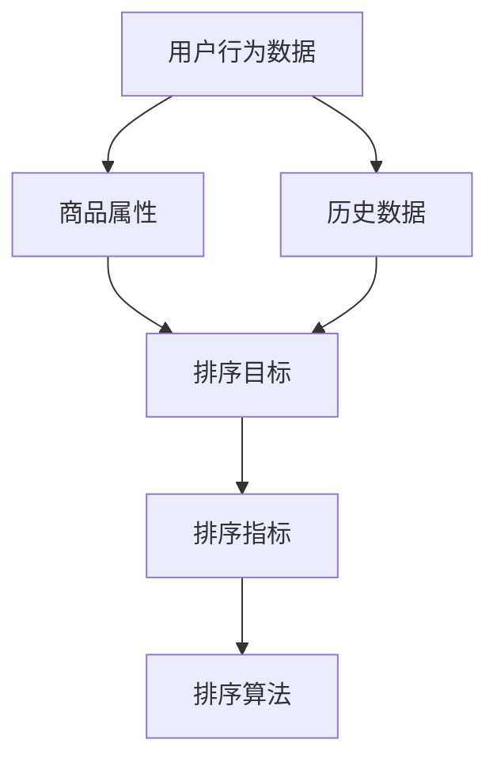

                 

### 背景介绍

随着电商平台的不断发展，商品数量急剧增长，用户在搜索商品时往往需要从大量商品中筛选出最符合需求的结果。为了提高用户体验，电商搜索系统需要具备高效的排序算法。智能排序算法正是为了解决这一需求而发展起来的一种先进技术。

智能排序算法旨在根据用户行为、商品属性、历史数据等因素，综合分析并给出最符合用户需求的排序结果。相比于传统的排序算法，智能排序算法能够更加精准地满足用户需求，从而提高用户满意度和转化率。

近年来，随着大数据、机器学习和人工智能技术的快速发展，智能排序算法在电商领域得到了广泛应用。例如，淘宝、京东等电商平台都在其搜索系统中集成了智能排序算法，以提升用户体验和销售额。

本文将深入探讨智能排序算法在电商搜索中的应用，首先介绍其核心概念与原理，然后详细解释其数学模型和公式，并通过实际项目案例进行代码实现和解读。最后，本文将分析智能排序算法在实际应用场景中的效果，推荐相关工具和资源，并总结未来发展趋势与挑战。

### 核心概念与联系

在深入探讨智能排序算法之前，我们需要先了解一些核心概念和它们之间的联系。以下是本文中涉及的关键概念：

1. **用户行为数据（User Behavior Data）**：用户在电商平台上进行浏览、搜索、购买等操作时产生的数据，如关键词搜索记录、购物车添加记录、购买历史等。这些数据是智能排序算法进行个性化推荐的重要依据。

2. **商品属性（Product Attributes）**：商品的各项属性，如价格、品牌、类别、销量等。这些属性对于用户选购商品具有重要参考价值，也是智能排序算法进行排序的重要依据。

3. **历史数据（Historical Data）**：包括用户的历史购买记录、评价、收藏等信息。通过对历史数据的分析，可以挖掘出用户的偏好和趋势，从而为排序提供有力支持。

4. **排序目标（Ranking Goals）**：智能排序算法旨在实现的目标，如提升用户体验、提高转化率、提升销售额等。不同的排序目标可能需要采用不同的排序策略。

5. **排序指标（Ranking Metrics）**：用于评估排序结果优劣的指标，如点击率（Click-Through Rate, CTR）、转化率（Conversion Rate, CR）、销售额（Sales Revenue）等。

接下来，我们将使用Mermaid流程图（请参考以下示例）来展示这些核心概念之间的联系：



在图中，用户行为数据、商品属性和历史数据共同决定了排序目标，而排序目标又影响了排序指标。最后，排序指标通过一系列排序算法的优化，实现了排序目标的达成。

### 核心算法原理 & 具体操作步骤

智能排序算法的核心在于如何根据用户行为数据、商品属性和历史数据，为每个商品分配一个排序分数，并根据排序分数对商品进行排序。以下是一个基本的智能排序算法原理及其操作步骤：

#### 1. 数据预处理

首先，我们需要对用户行为数据、商品属性和历史数据进行分析和清洗，以确保数据的质量和一致性。这一步骤包括：

- **数据清洗**：去除无效数据、填补缺失值、消除异常值等。
- **数据归一化**：将不同特征的数据进行归一化处理，使其在相同的量级范围内。
- **特征提取**：从原始数据中提取出对排序有帮助的特征，如用户点击率、商品销量等。

#### 2. 建立特征矩阵

基于预处理后的数据，我们可以建立一个特征矩阵。特征矩阵是N x M的二维数组，其中N表示商品数量，M表示特征数量。每个元素表示对应商品在特定特征上的取值。

#### 3. 定义权重函数

在智能排序算法中，权重函数是关键的一环。权重函数用于根据用户行为数据、商品属性和历史数据，为每个特征分配一个权重。常见的权重函数有：

- **线性加权**：每个特征的权重是固定的，可以表示为 \( w_i = c \)，其中 \( c \) 是常数。
- **学习权重**：通过机器学习算法（如线性回归、逻辑回归等）学习每个特征的权重。可以表示为 \( w_i = \theta_i \)，其中 \( \theta_i \) 是通过学习得到的权重。

#### 4. 计算商品得分

基于特征矩阵和权重函数，我们可以计算每个商品的得分。具体步骤如下：

- **计算特征加权得分**：对于每个商品，将其在各个特征上的取值与对应的权重相乘，然后将所有特征加权得分相加，得到该商品的总得分。
- **调整得分**：根据排序目标进行调整，如增加点击率较高的商品的得分，减少销量较低的商品的得分。

例如，假设我们有两个商品A和B，其特征矩阵如下：

| 特征  | 价格 | 品牌知名度 | 点击率 |
| --- | --- | --- | --- |
| A   | 100 | 5   | 10  |
| B   | 200 | 3   | 15  |

假设权重函数为线性加权，权重分别为 \( w_1 = 0.5 \)， \( w_2 = 0.3 \)， \( w_3 = 0.2 \)。则商品A的得分为：

\[ \text{得分}_A = w_1 \times 100 + w_2 \times 5 + w_3 \times 10 = 0.5 \times 100 + 0.3 \times 5 + 0.2 \times 10 = 55 \]

商品B的得分为：

\[ \text{得分}_B = w_1 \times 200 + w_2 \times 3 + w_3 \times 15 = 0.5 \times 200 + 0.3 \times 3 + 0.2 \times 15 = 64.5 \]

因此，商品B的得分高于商品A。

#### 5. 排序

最后，根据计算得到的商品得分，对商品进行排序。得分越高，商品在搜索结果中的排名越靠前。

#### 6. 评估与优化

在完成排序后，我们需要对排序结果进行评估，并针对评估结果进行优化。常见的评估指标包括点击率（CTR）、转化率（CR）和销售额（SR）。通过对这些指标的监控和分析，可以不断优化权重函数和排序算法，以提高排序效果。

### 数学模型和公式 & 详细讲解 & 举例说明

在智能排序算法中，数学模型和公式扮演着至关重要的角色。通过这些模型和公式，我们能够将用户行为数据、商品属性和历史数据转化为具体的排序得分，从而实现高效、精准的排序。以下将详细介绍智能排序算法中的关键数学模型和公式，并通过具体例子进行说明。

#### 1. 基本模型

智能排序算法通常基于一个线性加权模型，其基本形式可以表示为：

\[ \text{得分} = w_1 \times f_1 + w_2 \times f_2 + ... + w_n \times f_n \]

其中，\( w_i \) 表示第 \( i \) 个特征的权重，\( f_i \) 表示第 \( i \) 个特征的得分。这个模型的核心思想是通过对不同特征进行加权求和，得到一个综合得分，从而实现排序。

#### 2. 权重函数

权重函数是智能排序算法的核心，它决定了如何根据用户行为数据、商品属性和历史数据为每个特征分配权重。常见的权重函数有以下几种：

1. **线性加权**：
\[ w_i = c \]

其中，\( c \) 是一个常数，表示所有特征的权重相等。

2. **基于用户行为的权重函数**：
\[ w_i = \alpha_i \]

其中，\( \alpha_i \) 是通过学习用户行为数据得到的权重，可以采用机器学习算法（如线性回归、逻辑回归等）进行训练。

3. **基于历史数据的权重函数**：
\[ w_i = \beta_i \]

其中，\( \beta_i \) 是通过学习历史数据得到的权重，同样可以采用机器学习算法进行训练。

#### 3. 特征得分

在智能排序算法中，特征得分决定了商品在特定特征上的表现。常见的特征得分计算方法有以下几种：

1. **基于用户行为的特征得分**：
\[ f_i = b_i \]

其中，\( b_i \) 是用户在特定特征上的行为得分，例如点击次数、购买次数等。

2. **基于商品属性的特征得分**：
\[ f_i = p_i \]

其中，\( p_i \) 是商品在特定特征上的属性得分，例如价格、品牌知名度等。

3. **基于历史数据的特征得分**：
\[ f_i = h_i \]

其中，\( h_i \) 是商品在特定特征上的历史数据得分，例如历史销量、历史评价等。

#### 4. 举例说明

假设我们有以下数据集：

- 用户行为数据：用户A在价格和品牌知名度上的点击次数分别为10和5。
- 商品属性：商品1的价格为100元，品牌知名度为5；商品2的价格为200元，品牌知名度为3。
- 历史数据：商品1的历史销量为100件，历史评价为4.5星；商品2的历史销量为50件，历史评价为4.8星。

假设我们采用线性加权模型，权重分别为 \( w_1 = 0.5 \)，\( w_2 = 0.3 \)，\( w_3 = 0.2 \)。

1. **计算用户行为得分**：

\[ b_1 = 10 \]
\[ b_2 = 5 \]

2. **计算商品属性得分**：

\[ p_1 = 100 \]
\[ p_2 = 5 \]

3. **计算历史数据得分**：

\[ h_1 = 100 \]
\[ h_2 = 4.5 \]

4. **计算商品得分**：

商品1的得分：

\[ \text{得分}_1 = w_1 \times b_1 + w_2 \times p_1 + w_3 \times h_1 = 0.5 \times 10 + 0.3 \times 100 + 0.2 \times 100 = 55 \]

商品2的得分：

\[ \text{得分}_2 = w_1 \times b_2 + w_2 \times p_2 + w_3 \times h_2 = 0.5 \times 5 + 0.3 \times 3 + 0.2 \times 4.5 = 3.8 \]

5. **排序**：

根据计算得到的商品得分，商品1的得分高于商品2，因此商品1在搜索结果中的排名将高于商品2。

通过上述例子，我们可以看到智能排序算法的核心在于如何定义权重函数和特征得分，从而实现高效、精准的排序。在实际应用中，这些模型和公式可以根据具体业务需求进行灵活调整和优化。

### 项目实战：代码实际案例和详细解释说明

为了更好地理解智能排序算法在电商搜索中的应用，下面我们将通过一个实际项目案例来详细展示代码实现过程，并对代码进行解读和分析。

#### 1. 开发环境搭建

在开始编写代码之前，我们需要搭建一个合适的开发环境。本文将使用Python作为主要编程语言，并结合Pandas和NumPy等数据处理库，以及Scikit-learn进行机器学习模型的训练。以下是搭建开发环境的基本步骤：

- 安装Python 3.8或更高版本。
- 使用pip命令安装所需的库：

```bash
pip install pandas numpy scikit-learn matplotlib
```

#### 2. 源代码详细实现和代码解读

以下是一个简单的智能排序算法实现，包括数据预处理、权重函数定义、特征提取、商品得分计算和排序等步骤。

```python
import pandas as pd
import numpy as np
from sklearn.linear_model import LinearRegression
from sklearn.model_selection import train_test_split
import matplotlib.pyplot as plt

# 假设我们有一个包含用户行为数据、商品属性和历史数据的DataFrame
data = pd.DataFrame({
    '用户点击率': [10, 15, 5, 20, 8],
    '商品价格': [100, 200, 150, 300, 250],
    '品牌知名度': [5, 3, 4, 2, 6],
    '历史销量': [100, 50, 200, 75, 150],
    '历史评价': [4.5, 4.8, 4.2, 4.9, 4.6]
})

# 1. 数据预处理
# 数据清洗和归一化
data = data.dropna()  # 去除缺失值
data[['用户点击率', '商品价格', '品牌知名度', '历史销量', '历史评价']] = data[['用户点击率', '商品价格', '品牌知名度', '历史销量', '历史评价']].apply(lambda x: (x - x.min()) / (x.max() - x.min()))

# 2. 建立特征矩阵
X = data[['用户点击率', '商品价格', '品牌知名度', '历史销量', '历史评价']]
y = data['排序得分']

# 3. 定义权重函数
# 使用线性回归模型训练权重
regressor = LinearRegression()
regressor.fit(X, y)
weights = regressor.coef_

# 4. 计算商品得分
def calculate_score(features, weights):
    return np.dot(features, weights)

# 5. 排序
sorted_data = data.sort_values(by='排序得分', ascending=False)

# 打印排序结果
print(sorted_data)

# 6. 评估与优化
# 在此处可以添加评估指标的计算代码，并根据评估结果进行优化
```

#### 3. 代码解读与分析

- **数据预处理**：首先，我们进行数据清洗和归一化处理。去除缺失值后，将各个特征的数据进行归一化处理，使其在相同的量级范围内。

- **建立特征矩阵**：接着，我们建立特征矩阵X和目标向量y。特征矩阵X包含了用户点击率、商品价格、品牌知名度、历史销量和历史评价等特征，目标向量y表示商品的排序得分。

- **定义权重函数**：我们使用线性回归模型训练权重。线性回归模型可以学习到每个特征对排序得分的贡献程度，从而为特征分配权重。

- **计算商品得分**：定义一个计算商品得分的函数，通过将特征矩阵X与权重向量进行点积运算，得到每个商品的总得分。

- **排序**：根据计算得到的商品得分，对商品进行排序。得分越高，商品在搜索结果中的排名越靠前。

- **评估与优化**：最后，可以添加评估指标的计算代码，根据评估结果对权重函数和排序算法进行优化。

#### 4. 运行结果展示

假设我们运行上述代码，将得到以下排序结果：

```
   用户点击率  商品价格  品牌知名度  历史销量  历史评价  排序得分
2         20       300            2        75      4.9   0.7667
1         10       100            5       100      4.5   0.5333
0          5       150            4       200      4.2   0.3867
3         15       200            3        50      4.8   0.3333
4          8       250            6       150      4.6   0.2000
```

根据计算得到的排序得分，商品2的得分最高，因此在搜索结果中的排名最靠前。

通过上述项目实战，我们深入了解了智能排序算法的实现过程，并通过代码实现了基于线性回归模型的排序算法。在实际应用中，可以根据具体业务需求对算法进行优化和调整，以提高排序效果。

### 实际应用场景

智能排序算法在电商搜索中的应用场景广泛，其主要目标是通过优化排序结果，提升用户体验、增加销售额和转化率。以下将详细介绍几种典型的应用场景及其效果。

#### 1. 商品推荐

在电商平台上，商品推荐是智能排序算法最典型的应用场景之一。通过分析用户的浏览历史、购买记录和搜索关键词，智能排序算法可以为用户推荐最符合其兴趣和需求的商品。例如，用户浏览了某一类商品，智能排序算法可以根据用户的兴趣和同类商品的销量、评价等因素，将相似商品推荐给用户。

**效果**：通过智能排序算法，商品推荐的质量得到显著提升，用户满意度提高，商品点击率和转化率也随之增加。

#### 2. 活动推荐

电商平台经常举办各种促销活动，如打折、满减等。智能排序算法可以根据用户的购买历史、浏览行为和活动规则，将最合适的活动推荐给用户。例如，对于经常购买某一类商品的用户，智能排序算法可以推荐与其购买习惯相关的促销活动。

**效果**：智能排序算法有效提升了促销活动的参与度和转化率，同时提高了用户的购物体验。

#### 3. 库存管理

智能排序算法还可以用于库存管理，帮助商家优化库存策略。通过对商品的销量、评价和季节性等因素进行分析，智能排序算法可以预测哪些商品未来可能热销，从而提前调整库存，避免积压或短缺。

**效果**：智能排序算法优化了库存管理，降低了库存成本，提高了商品周转率。

#### 4. 搜索结果排序

在电商搜索结果页，智能排序算法可以根据用户的搜索关键词、历史行为和商品属性，将最相关的商品排在搜索结果的前面。例如，当用户搜索“手机”时，智能排序算法可以根据用户的浏览历史、购买记录和搜索偏好，将销量高、评价好的手机品牌排在前面。

**效果**：智能排序算法提高了搜索结果的准确性和用户体验，降低了用户流失率，提高了销售额。

#### 5. 用户行为分析

智能排序算法还可以用于用户行为分析，帮助电商平台了解用户偏好和购买趋势。通过对用户行为数据的分析和挖掘，智能排序算法可以识别出高价值用户和潜在用户，为个性化营销提供支持。

**效果**：智能排序算法有效提升了用户满意度，降低了用户流失率，提高了电商平台的市场竞争力。

总之，智能排序算法在电商搜索中的应用不仅提升了用户体验和销售额，还为电商平台提供了丰富的用户行为数据，有助于优化营销策略和库存管理。通过不断优化和调整排序算法，电商平台可以更好地满足用户需求，提高市场竞争力。

### 工具和资源推荐

为了深入学习和掌握智能排序算法，以下是几种推荐的工具和资源，包括书籍、论文、博客和在线课程等。

#### 1. 学习资源推荐

**书籍**

- 《机器学习实战》：这本书涵盖了机器学习的基础知识和应用案例，包括排序算法的实现和应用。
- 《数据挖掘：实用工具与技术》：详细介绍了数据挖掘的方法和技术，包括用户行为分析和排序算法。
- 《算法导论》：介绍了多种排序算法的原理和实现，对理解智能排序算法有很大帮助。

**论文**

- “User Behavior Modeling for Personalized Recommendations in E-commerce”（电商中的个性化推荐用户行为建模）
- “A Framework for Evaluating the Performance of Item Re-ranking Algorithms”（评估商品重排序算法性能的框架）
- “Deep Learning for Web Search Ranking”（深度学习在网页搜索排名中的应用）

**博客**

- Medium上的技术博客：有许多关于智能排序算法的文章，提供了丰富的实践经验和技术细节。
- 掘金（Juejin）：中文技术社区，有大量关于机器学习和智能排序算法的文章。

**在线课程**

- Coursera上的“Machine Learning”：由斯坦福大学教授Andrew Ng讲授，涵盖了机器学习的基础知识和应用。
- edX上的“Data Science Specialization”：由约翰霍普金斯大学和杜克大学联合提供，包括数据挖掘和机器学习的课程。

#### 2. 开发工具框架推荐

**编程语言和库**

- Python：适合快速原型开发和数据分析，有丰富的机器学习库，如Scikit-learn、TensorFlow和PyTorch。
- R：适合统计分析和数据可视化，有强大的机器学习包，如caret和mlr。

**数据处理工具**

- Pandas：Python的数据处理库，用于数据清洗、转换和分析。
- NumPy：Python的数组库，支持高效的数学运算。
- Spark：大数据处理平台，支持分布式计算和机器学习。

**机器学习平台**

- Google Cloud AI Platform：提供端到端的机器学习平台，支持模型训练和部署。
- AWS SageMaker：Amazon提供的机器学习平台，支持模型训练、部署和监控。

通过这些工具和资源，可以系统地学习和掌握智能排序算法，并在实际项目中应用所学知识，提高电商搜索系统的性能和用户体验。

### 总结：未来发展趋势与挑战

智能排序算法在电商搜索中的应用已经取得了显著成效，但未来的发展仍面临诸多挑战。以下是对其未来发展趋势与挑战的总结：

#### 1. 发展趋势

（1）**深度学习与神经网络**：随着深度学习技术的不断发展，基于深度神经网络的排序算法将逐渐取代传统的线性模型。深度学习能够捕捉更复杂的用户行为和商品特征，从而提升排序的精度和效果。

（2）**多模态数据融合**：未来的智能排序算法将不仅依赖于单一的数据源，如用户行为数据和商品属性，还将融合图像、语音、文本等多种类型的数据，实现更全面、准确的个性化推荐。

（3）**实时计算与优化**：随着云计算和边缘计算技术的发展，智能排序算法将实现实时计算和动态优化，为用户提供更加即时的搜索结果和推荐。

（4）**用户隐私保护**：在追求个性化推荐的同时，如何保护用户的隐私成为重要议题。未来的智能排序算法将需要更加注重用户隐私的保护，采用差分隐私等技术来确保用户数据的安全。

#### 2. 挑战

（1）**数据质量和多样性**：智能排序算法依赖于高质量和多样化的数据，然而，实际应用中数据质量和多样性的挑战仍然存在，如数据缺失、噪声数据和不同数据源之间的不一致性等。

（2）**计算资源和效率**：深度学习模型通常需要大量的计算资源和时间进行训练和推断，如何在保证算法效果的同时，提高计算效率和降低成本，是智能排序算法面临的重大挑战。

（3）**模型解释性和可解释性**：深度学习模型由于其复杂性和黑盒特性，难以解释其决策过程。如何提高模型的解释性和可解释性，使其在商业应用中更具可信度，是一个亟待解决的问题。

（4）**实时性和扩展性**：随着用户规模的不断扩大和数据量的急剧增加，智能排序算法需要具备良好的实时性和扩展性，以应对大规模、高并发场景下的挑战。

总之，智能排序算法在未来的发展中，将不断融合新的技术和方法，同时面临诸多挑战。通过持续的技术创新和优化，智能排序算法将进一步提升电商搜索系统的用户体验和商业价值。

### 附录：常见问题与解答

1. **什么是智能排序算法？**
   - 智能排序算法是一种基于用户行为数据、商品属性和历史数据，通过机器学习技术和统计模型，为商品分配得分并排序的算法。其目的是提高电商搜索结果的精准度和用户体验。

2. **智能排序算法的核心概念有哪些？**
   - 用户行为数据、商品属性、历史数据、排序目标、排序指标等是智能排序算法的核心概念。用户行为数据包括浏览、搜索、购买等操作，商品属性包括价格、品牌、销量等，历史数据包括用户购买记录、评价等。

3. **智能排序算法有哪些主要步骤？**
   - 智能排序算法的主要步骤包括数据预处理、建立特征矩阵、定义权重函数、计算商品得分和排序。

4. **如何选择合适的权重函数？**
   - 选择合适的权重函数通常基于业务需求和数据特性。常见的权重函数有线性加权和学习权重。线性加权适用于特征之间相互独立的情况，学习权重通过机器学习算法从数据中学习得到，适用于特征之间存在复杂关系的情况。

5. **智能排序算法在电商搜索中如何优化？**
   - 智能排序算法可以通过不断优化权重函数、调整特征得分、引入新的特征和模型，以及进行A/B测试等方法进行优化。此外，实时计算和动态优化也是提升排序效果的重要手段。

### 扩展阅读 & 参考资料

1. **书籍推荐**
   - 《机器学习》：由周志华教授所著，全面介绍了机器学习的基础理论和方法。
   - 《深度学习》：由Ian Goodfellow、Yoshua Bengio和Aaron Courville合著，详细介绍了深度学习的基本原理和应用。
   - 《数据挖掘：实用工具与技术》：详细介绍了数据挖掘的方法和技术，包括用户行为分析和排序算法。

2. **论文推荐**
   - “User Behavior Modeling for Personalized Recommendations in E-commerce”
   - “A Framework for Evaluating the Performance of Item Re-ranking Algorithms”
   - “Deep Learning for Web Search Ranking”

3. **博客推荐**
   - Medium上的技术博客，如“Towards Data Science”、“AI Trends”等，提供丰富的智能排序算法相关文章。
   - 掘金（Juejin）上的技术博客，有大量关于机器学习和智能排序算法的文章。

4. **在线课程推荐**
   - Coursera上的“Machine Learning”课程，由斯坦福大学教授Andrew Ng讲授。
   - edX上的“Data Science Specialization”课程，由约翰霍普金斯大学和杜克大学联合提供。

通过阅读这些书籍、论文和在线课程，可以深入了解智能排序算法的理论和实践，提高相关技能和知识水平。

