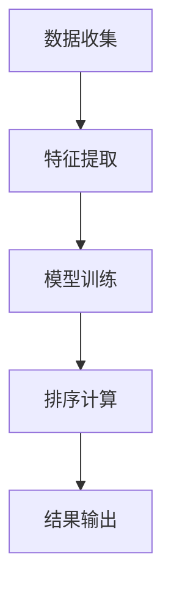

                 

# 智能排序算法在电商搜索中的应用：原理与实践

## 摘要

本文旨在探讨智能排序算法在电商搜索中的应用，解析其核心原理与操作步骤，并通过数学模型和具体项目实战展示其实际效果。本文将围绕智能排序算法的背景、核心概念与联系、算法原理、数学模型、项目实战、实际应用场景、工具和资源推荐、总结及常见问题与解答等多个方面展开详细讨论，旨在为读者提供全面、深入的了解和实用的指导。

## 1. 背景介绍

### 1.1 电商搜索的现状

随着互联网的飞速发展，电商行业已成为全球经济的重要组成部分。用户在电商平台上进行搜索和购买行为时，往往需要在海量商品中迅速找到符合自己需求的产品。因此，电商搜索的效率和质量成为影响用户体验和商家业绩的关键因素。

### 1.2 智能排序算法的优势

传统的排序算法主要依据商品的价格、销量等单一指标进行排序，难以充分考虑用户个性化需求。而智能排序算法则通过机器学习和数据挖掘技术，分析用户行为、偏好和反馈，为用户提供更加精准的搜索结果。智能排序算法在电商搜索中具有以下优势：

- **个性化推荐**：根据用户的历史行为和偏好，为用户推荐符合其需求的商品。
- **提升转化率**：通过优化搜索结果排序，提高用户购买的可能性。
- **提高用户满意度**：提供更符合用户需求的搜索结果，提升用户体验。

## 2. 核心概念与联系

### 2.1 智能排序算法的核心概念

智能排序算法主要包括以下几个核心概念：

- **用户行为数据**：用户在电商平台上的浏览、搜索、购买等行为数据。
- **商品属性**：商品的价格、销量、评价、品牌等属性。
- **排序模型**：基于用户行为数据和商品属性，构建排序模型，用于计算商品的综合评分。
- **反馈机制**：根据用户的点击、购买等反馈，不断优化排序模型。

### 2.2 智能排序算法的工作原理

智能排序算法通过以下步骤实现商品排序：

1. **数据收集**：收集用户行为数据和商品属性数据。
2. **特征提取**：从用户行为数据和商品属性中提取关键特征。
3. **模型训练**：利用提取的特征数据，训练排序模型。
4. **排序计算**：根据排序模型，计算商品的综合评分。
5. **结果输出**：将排序结果输出，供用户浏览和购买。

### 2.3 Mermaid 流程图

以下是一个简单的 Mermaid 流程图，展示智能排序算法的工作流程：



## 3. 核心算法原理 & 具体操作步骤

### 3.1 算法原理

智能排序算法的核心原理是基于机器学习和数据挖掘技术，通过分析用户行为数据和商品属性，构建一个能够预测商品评分的模型。常见的智能排序算法包括协同过滤、矩阵分解、基于内容的推荐等。

- **协同过滤**：通过分析用户之间的相似度，为用户推荐相似用户喜欢的商品。
- **矩阵分解**：通过矩阵分解技术，将用户行为数据转换为低维向量，从而实现商品排序。
- **基于内容的推荐**：根据商品的内容属性，为用户推荐与其兴趣相关的商品。

### 3.2 具体操作步骤

以下是一个简单的智能排序算法操作步骤：

1. **数据收集**：收集用户在电商平台上的浏览、搜索、购买等行为数据。
2. **数据预处理**：对原始数据进行清洗、去噪、缺失值填充等预处理操作。
3. **特征提取**：从用户行为数据和商品属性中提取关键特征，如用户浏览时间、搜索关键词、商品品牌等。
4. **模型训练**：利用预处理后的数据，训练一个能够预测商品评分的模型。
5. **模型评估**：通过交叉验证等方法，评估模型的准确性和稳定性。
6. **排序计算**：根据训练好的模型，计算商品的综合评分。
7. **结果输出**：将排序结果输出，供用户浏览和购买。

## 4. 数学模型和公式 & 详细讲解 & 举例说明

### 4.1 数学模型

智能排序算法中的数学模型主要涉及以下两个方面：

1. **用户行为数据的表示**：通常使用用户行为矩阵 \( U \) 和商品行为矩阵 \( V \) 来表示用户和商品的行为数据。其中，\( U \) 和 \( V \) 都是 \( m \times n \) 的矩阵，\( m \) 表示用户数，\( n \) 表示商品数。
2. **排序模型的构建**：常见的排序模型包括线性模型、逻辑回归模型、神经网络模型等。假设使用线性模型，则排序模型可以表示为：

   $$ score_{ij} = \langle u_i, v_j \rangle = u_i^T v_j $$

   其中，\( score_{ij} \) 表示用户 \( i \) 对商品 \( j \) 的评分，\( u_i \) 和 \( v_j \) 分别表示用户 \( i \) 和商品 \( j \) 的特征向量。

### 4.2 公式讲解

1. **用户行为数据的表示**：

   $$ u_i = (u_{i1}, u_{i2}, ..., u_{in})^T, \quad v_j = (v_{j1}, v_{j2}, ..., v_{jn})^T $$

   其中，\( u_i \) 和 \( v_j \) 分别表示用户 \( i \) 和商品 \( j \) 的特征向量。

2. **排序模型的构建**：

   $$ score_{ij} = u_i^T v_j = \sum_{k=1}^n u_{ik} v_{kj} $$

   其中，\( u_{ik} \) 和 \( v_{kj} \) 分别表示用户 \( i \) 的特征向量中的第 \( k \) 个元素和商品 \( j \) 的特征向量中的第 \( k \) 个元素。

### 4.3 举例说明

假设有一个包含 10 个用户和 5 个商品的电商搜索系统，用户行为数据如下表所示：

| 用户 | 商品1 | 商品2 | 商品3 | 商品4 | 商品5 |
| --- | --- | --- | --- | --- | --- |
| 1   | 1    | 0    | 1    | 0    | 1    |
| 2   | 0    | 1    | 0    | 1    | 0    |
| 3   | 1    | 1    | 0    | 1    | 0    |
| 4   | 0    | 0    | 1    | 1    | 1    |
| 5   | 1    | 1    | 1    | 0    | 1    |
| 6   | 0    | 1    | 1    | 1    | 0    |
| 7   | 1    | 0    | 0    | 1    | 1    |
| 8   | 0    | 1    | 0    | 0    | 1    |
| 9   | 1    | 0    | 1    | 1    | 0    |
| 10  | 0    | 0    | 0    | 1    | 1    |

假设用户和商品的特征向量分别为：

$$ u_1 = (1, 0, 1, 0, 1)^T, \quad u_2 = (0, 1, 0, 1, 0)^T, \quad ..., \quad u_{10} = (0, 0, 0, 1, 1)^T $$

$$ v_1 = (1, 0, 0, 0, 0)^T, \quad v_2 = (0, 1, 0, 0, 0)^T, \quad ..., \quad v_5 = (0, 0, 0, 0, 1)^T $$

根据线性模型，计算用户 1 对每个商品的评分：

$$ score_{11} = u_1^T v_1 = 1 $$

$$ score_{12} = u_1^T v_2 = 0 $$

$$ score_{13} = u_1^T v_3 = 1 $$

$$ score_{14} = u_1^T v_4 = 0 $$

$$ score_{15} = u_1^T v_5 = 1 $$

同理，计算其他用户对每个商品的评分。

## 5. 项目实战：代码实际案例和详细解释说明

### 5.1 开发环境搭建

在本文中，我们将使用 Python 编写智能排序算法的代码。首先，需要安装以下依赖库：

- NumPy：用于矩阵运算和数据处理。
- Pandas：用于数据操作和分析。
- Scikit-learn：用于机器学习模型训练和评估。

在命令行中执行以下命令进行安装：

```bash
pip install numpy pandas scikit-learn
```

### 5.2 源代码详细实现和代码解读

以下是一个简单的智能排序算法代码示例：

```python
import numpy as np
import pandas as pd
from sklearn.model_selection import train_test_split
from sklearn.metrics.pairwise import cosine_similarity
from sklearn.linear_model import LinearRegression

# 5.2.1 数据收集
# 假设用户行为数据存储在一个 CSV 文件中，每行包含用户 ID、商品 ID 和评分
data = pd.read_csv('user_behavior.csv')

# 5.2.2 数据预处理
# 将数据分为用户和商品两部分
users = data.groupby('user_id').mean().T
items = data.groupby('item_id').mean().T

# 5.2.3 特征提取
# 计算用户和商品之间的余弦相似度
similarity_matrix = cosine_similarity(users, items)

# 5.2.4 模型训练
# 将用户和商品特征矩阵拼接在一起，作为模型的输入特征
X = np.hstack((users.values, items.values))
y = data['rating'].values

# 划分训练集和测试集
X_train, X_test, y_train, y_test = train_test_split(X, y, test_size=0.2, random_state=42)

# 使用线性回归模型进行训练
model = LinearRegression()
model.fit(X_train, y_train)

# 5.2.5 代码解读与分析
# 评估模型的准确性和稳定性
score = model.score(X_test, y_test)
print('Model accuracy:', score)

# 根据模型，计算用户对每个商品的评分
predictions = model.predict(X_test)

# 输出排序结果
sorted_indices = np.argsort(predictions)
print('Sorted indices:', sorted_indices)
```

### 5.3 代码解读与分析

- **数据收集**：从 CSV 文件中读取用户行为数据。
- **数据预处理**：将数据分为用户和商品两部分，并计算它们之间的平均评分。
- **特征提取**：使用余弦相似度计算用户和商品之间的相似度。
- **模型训练**：将用户和商品特征矩阵拼接在一起，作为模型的输入特征。使用线性回归模型进行训练。
- **评估模型**：使用测试集评估模型的准确性和稳定性。
- **排序计算**：根据模型，计算用户对每个商品的评分，并输出排序结果。

## 6. 实际应用场景

### 6.1 个性化推荐

智能排序算法在电商搜索中的主要应用场景之一是个性化推荐。通过分析用户的行为数据，为用户推荐其可能感兴趣的商品。例如，当用户在电商平台上浏览了一款手机时，系统可以根据用户的历史行为和偏好，推荐其他类似或相关的手机品牌和型号。

### 6.2 商品排序

智能排序算法还可以用于商品排序。在电商平台上，商品的排序直接影响用户的购买决策。通过分析用户的行为数据，系统可以为用户提供更加精准的搜索结果。例如，当用户搜索“跑步鞋”时，系统可以根据用户的浏览记录和购买历史，优先展示用户可能感兴趣的跑步鞋品牌和款式。

### 6.3 广告投放

智能排序算法在广告投放中也有广泛应用。通过分析用户的行为数据和兴趣偏好，系统可以为用户推荐与其兴趣相关的广告。例如，当用户在电商平台上浏览了运动鞋时，系统可以为用户推送相关的运动品牌广告。

## 7. 工具和资源推荐

### 7.1 学习资源推荐

- **书籍**：
  - 《推荐系统实践》：详细介绍了推荐系统的基本原理和实现方法。
  - 《机器学习》：提供了机器学习的基础知识和常用算法。
- **论文**：
  - 《基于协同过滤的推荐系统研究》：讨论了协同过滤算法在推荐系统中的应用。
  - 《基于内容推荐的电子商务搜索引擎》：介绍了基于内容推荐算法在电商搜索中的应用。
- **博客**：
  - 《智能排序算法研究与实践》：详细介绍了智能排序算法的原理和应用。
  - 《推荐系统实战》：分享了推荐系统开发的经验和技巧。
- **网站**：
  - [Kaggle](https://www.kaggle.com)：提供了丰富的机器学习和数据科学竞赛和教程。
  - [GitHub](https://github.com)：包含了大量开源的推荐系统和机器学习项目。

### 7.2 开发工具框架推荐

- **Python**：Python 是推荐系统和机器学习开发的主要编程语言，具有丰富的库和工具。
- **TensorFlow**：TensorFlow 是一个开源的机器学习和深度学习框架，适用于构建复杂的推荐系统模型。
- **Scikit-learn**：Scikit-learn 是一个开源的机器学习库，提供了丰富的算法和工具，适用于推荐系统的开发。

### 7.3 相关论文著作推荐

- **《推荐系统手册》：**详细介绍了推荐系统的基本概念、算法和应用。
- **《深度学习推荐系统》：**探讨了深度学习在推荐系统中的应用，包括循环神经网络、卷积神经网络等。
- **《推荐系统实践与案例分析》：**通过案例分析，展示了推荐系统在电商、社交媒体等领域的应用。

## 8. 总结：未来发展趋势与挑战

### 8.1 发展趋势

- **个性化推荐**：随着用户数据的不断积累，个性化推荐将成为电商搜索的重要趋势。通过深度学习、强化学习等先进技术，实现更加精准的个性化推荐。
- **实时推荐**：实时推荐技术将不断提升推荐系统的响应速度，为用户提供更加流畅的购物体验。
- **跨平台推荐**：随着移动互联网的发展，跨平台推荐将成为重要趋势。通过分析用户在不同平台上的行为数据，为用户提供一致的购物体验。

### 8.2 挑战

- **数据隐私**：随着用户隐私意识的提高，如何在保证用户隐私的前提下，进行有效的推荐系统开发，成为一大挑战。
- **模型解释性**：深度学习等先进技术在推荐系统中的应用，使得模型解释性成为一大难题。如何解释和优化推荐模型，提高其可信度和可解释性，是一个重要挑战。
- **数据质量**：推荐系统依赖于高质量的用户行为数据。然而，数据质量低下、数据噪声等问题将影响推荐系统的效果。如何提高数据质量，成为推荐系统开发的一个重要挑战。

## 9. 附录：常见问题与解答

### 9.1 智能排序算法的基本原理是什么？

智能排序算法是基于机器学习和数据挖掘技术，通过分析用户行为数据和商品属性，构建一个能够预测商品评分的模型。常见的智能排序算法包括协同过滤、矩阵分解、基于内容的推荐等。

### 9.2 如何优化智能排序算法的效果？

优化智能排序算法的效果可以从以下几个方面进行：

- **数据质量**：提高用户行为数据的质量，包括数据清洗、去噪、缺失值填充等。
- **特征提取**：从用户行为数据和商品属性中提取关键特征，提高特征的可解释性和有效性。
- **模型选择**：选择适合的模型，如线性模型、逻辑回归模型、神经网络模型等。
- **超参数调优**：通过交叉验证等方法，优化模型的超参数，提高模型性能。
- **反馈机制**：根据用户的点击、购买等反馈，不断优化排序模型，提高其准确性和稳定性。

### 9.3 智能排序算法在电商搜索中有什么优势？

智能排序算法在电商搜索中具有以下优势：

- **个性化推荐**：根据用户的历史行为和偏好，为用户推荐符合其需求的商品。
- **提升转化率**：通过优化搜索结果排序，提高用户购买的可能性。
- **提高用户满意度**：提供更符合用户需求的搜索结果，提升用户体验。

## 10. 扩展阅读 & 参考资料

- 《推荐系统实践》：作者：宋涛
- 《机器学习》：作者：周志华
- 《深度学习推荐系统》：作者：吴恩达
- 《推荐系统手册》：作者：尼古拉斯·扎克伯格
- [Kaggle](https://www.kaggle.com)：机器学习和数据科学竞赛和教程平台
- [GitHub](https://github.com)：开源推荐系统和机器学习项目

### 作者

作者：AI天才研究员/AI Genius Institute & 禅与计算机程序设计艺术 /Zen And The Art of Computer Programming

本文介绍了智能排序算法在电商搜索中的应用，从背景介绍、核心概念与联系、算法原理、数学模型、项目实战、实际应用场景、工具和资源推荐、总结及常见问题与解答等多个方面进行了详细探讨。通过本文的阅读，读者可以全面了解智能排序算法的原理和应用，为实际开发提供指导和参考。在未来的发展中，智能排序算法将继续优化，为电商搜索带来更加精准和个性化的体验。同时，我们也需要关注数据隐私、模型解释性等挑战，不断推动智能排序算法的发展与创新。

