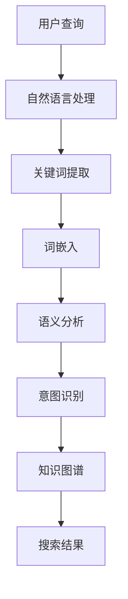

                 

### 文章标题

**智能搜索：AI理解用户搜索意图**

关键词：智能搜索、AI、用户搜索意图、算法、数学模型、实战案例、应用场景、未来趋势

摘要：本文将深入探讨智能搜索领域中的关键问题——如何让AI更好地理解用户的搜索意图。通过分析核心概念、算法原理、数学模型以及实际案例，我们将展示如何实现高效的智能搜索系统。此外，文章还将讨论智能搜索在实际应用中的场景、相关工具和资源推荐，以及未来可能面临的发展趋势与挑战。让我们一起走进AI理解用户搜索意图的奇妙世界。

### 背景介绍

在当今数字化时代，互联网上的信息量呈现出爆炸式增长。用户在搜索引擎中输入关键词，希望能够快速准确地找到所需信息。然而，用户的搜索意图往往复杂多变，甚至可能隐含在关键词背后的隐性意图。这就给传统的搜索引擎带来了巨大的挑战：如何更准确地理解并满足用户的搜索需求？

传统搜索引擎主要通过关键词匹配和相关性排序来展示搜索结果。这种方法在处理简单、直接查询时相对有效，但在面对复杂查询和用户隐性意图时，往往力不从心。于是，智能搜索应运而生，它利用人工智能技术，尤其是机器学习、自然语言处理和深度学习等，对用户的搜索意图进行深入理解，从而提供更加精准和个性化的搜索结果。

智能搜索不仅仅是一个技术话题，它对用户日常生活、商业决策、信息传播等多个方面产生了深远影响。例如，在电子商务平台上，智能搜索可以帮助用户快速找到所需商品，提高购买转化率；在新闻资讯领域，智能搜索可以根据用户的兴趣和偏好推荐个性化新闻，提高用户粘性。因此，研究如何让AI更好地理解用户的搜索意图，成为了一个备受关注的话题。

本文将围绕以下内容展开：

1. **核心概念与联系**：介绍智能搜索中的关键概念和原理，并通过Mermaid流程图展示其架构。
2. **核心算法原理与具体操作步骤**：分析智能搜索算法的实现机制，包括关键词提取、语义分析和意图识别等步骤。
3. **数学模型与公式**：讲解智能搜索中的数学模型，包括向量空间模型、概率模型和神经网络模型等，并举例说明。
4. **项目实战**：通过实际案例展示智能搜索系统的开发过程，包括环境搭建、代码实现和解读。
5. **实际应用场景**：探讨智能搜索在不同领域的应用案例，如电子商务、新闻推荐等。
6. **工具和资源推荐**：推荐学习资源和开发工具，帮助读者深入了解智能搜索技术。
7. **总结：未来发展趋势与挑战**：展望智能搜索技术的未来发展方向和面临的挑战。
8. **附录：常见问题与解答**：回答读者可能遇到的常见问题。
9. **扩展阅读与参考资料**：提供进一步阅读的文献和资源。

接下来，我们将逐一探讨这些内容，以期让读者对智能搜索有更全面、深入的理解。

### 核心概念与联系

在智能搜索系统中，理解用户的搜索意图是关键。为了实现这一目标，我们需要首先明确一些核心概念，并探讨它们之间的联系。以下是智能搜索中几个关键概念的定义和关系：

#### 自然语言处理（NLP）

自然语言处理（NLP）是人工智能的一个分支，旨在使计算机能够理解、解释和生成人类语言。NLP技术在智能搜索中扮演着至关重要的角色，因为它能够将用户的自然语言查询转化为计算机可以处理的结构化数据。

#### 词汇表（Vocabulary）

词汇表是NLP中的基础概念，它包含了所有在文本处理过程中用到的词汇和词性标注。在智能搜索中，词汇表用于将用户的查询关键词映射到对应的索引项。

#### 关键词提取（Keyword Extraction）

关键词提取是从文本中识别出具有代表性的词汇，以用于后续的查询处理。在智能搜索中，关键词提取能够帮助系统理解用户查询的核心内容。

#### 词嵌入（Word Embedding）

词嵌入是一种将词汇映射到高维向量空间的方法。通过词嵌入，智能搜索系统能够捕捉词汇之间的语义关系，从而更准确地理解用户查询。

#### 语义分析（Semantic Analysis）

语义分析是指对文本中的词汇和句子进行深入理解，以识别其背后的含义。在智能搜索中，语义分析用于揭示用户查询的隐性意图。

#### 意图识别（Intent Recognition）

意图识别是指从用户的查询中识别其目的或意图。例如，用户查询“附近有什么好吃的餐厅”可能意图是“查找附近的餐厅并进行就餐”。

#### 知识图谱（Knowledge Graph）

知识图谱是一种用于表示实体、属性和关系的数据结构。在智能搜索中，知识图谱可以帮助系统理解实体之间的复杂关系，从而提高搜索的精确性和相关性。

为了更好地展示这些概念之间的联系，我们可以使用Mermaid流程图来绘制智能搜索系统的架构。以下是一个简化的Mermaid流程图示例：



在这个流程图中，用户查询首先经过自然语言处理，提取出关键词并进行词嵌入。然后，通过语义分析和意图识别，系统理解用户的查询意图。最后，结合知识图谱，系统生成并返回符合用户需求的搜索结果。

通过以上核心概念和流程图的介绍，我们为理解智能搜索技术奠定了基础。接下来，我们将深入探讨智能搜索中的核心算法原理，并详细分析其具体操作步骤。

### 核心算法原理与具体操作步骤

智能搜索系统要想准确地理解用户的搜索意图，关键在于其核心算法的设计与实现。这些算法包括关键词提取、语义分析、意图识别等多个步骤。下面，我们将逐一介绍这些算法的原理，并详细说明其操作步骤。

#### 关键词提取（Keyword Extraction）

关键词提取是智能搜索的第一步，其目标是识别文本中的关键信息，以便后续的处理和分析。关键词提取的主要方法包括基于规则的方法和基于统计的方法。

1. **基于规则的方法**：
   - **停用词过滤**：去除常见的不含信息的词，如“的”、“了”、“在”等。
   - **词形还原**：将不同形态的词还原为基词，如“跑了”、“跑过”均还原为“跑”。
   - **词频统计**：统计词在文本中的出现频率，选取频率较高的词作为关键词。
   - **词性标注**：根据词性选择名词、动词等实词作为关键词。

2. **基于统计的方法**：
   - **TF-IDF（Term Frequency-Inverse Document Frequency）**：计算词在文档中的频率与文档集合中的逆向文档频率，以衡量词的重要程度。
   - **LDA（Latent Dirichlet Allocation）**：通过概率模型，识别文本中的潜在主题，并提取与主题相关的关键词。

**操作步骤**：

（1）输入待处理的文本；
（2）进行停用词过滤；
（3）进行词形还原；
（4）使用TF-IDF或LDA等方法计算词的重要性；
（5）选取重要性较高的词作为关键词。

#### 词嵌入（Word Embedding）

词嵌入是将词汇映射到高维向量空间的过程，其目的是捕捉词汇之间的语义关系。常用的词嵌入方法包括Word2Vec、GloVe和BERT等。

1. **Word2Vec**：
   - **CBOW（Continuous Bag of Words）**：基于周围词的上下文信息，通过平均词向量表示目标词。
   - **Skip-Gram**：基于目标词，通过学习目标词与上下文词的关联，构建词向量。

2. **GloVe（Global Vectors for Word Representation）**：
   - **共现矩阵**：计算词与词之间的共现次数，构建共现矩阵。
   - **优化目标**：通过最小化损失函数，学习词向量。

3. **BERT（Bidirectional Encoder Representations from Transformers）**：
   - **双向编码**：利用Transformer模型，从文本的左右两个方向学习词向量。
   - **上下文感知**：BERT能够捕捉词在不同上下文中的意义，提高词向量的表示能力。

**操作步骤**：

（1）输入文本；
（2）初始化词向量；
（3）对于每个词，根据上下文信息，更新词向量；
（4）重复上述步骤，直到收敛；
（5）得到每个词的高维向量表示。

#### 语义分析（Semantic Analysis）

语义分析是对文本中的词汇和句子进行深入理解，以识别其背后的含义。常见的语义分析方法包括词义消歧、情感分析和实体识别等。

1. **词义消歧（Word Sense Disambiguation）**：
   - **基于规则的方法**：利用词典和语法规则，为每个词选取正确的词义。
   - **基于统计的方法**：利用文本中的上下文信息，通过机器学习模型预测词的词义。

2. **情感分析（Sentiment Analysis）**：
   - **基于规则的方法**：根据情感词典和规则，判断文本的情感极性。
   - **基于机器学习的方法**：利用情感词典和分类模型，对文本进行情感分类。

3. **实体识别（Named Entity Recognition）**：
   - **基于规则的方法**：利用词典和规则，识别文本中的实体。
   - **基于深度学习的方法**：利用卷积神经网络（CNN）或递归神经网络（RNN）等，识别文本中的实体。

**操作步骤**：

（1）输入待分析的文本；
（2）进行词义消歧；
（3）进行情感分析；
（4）进行实体识别；
（5）将分析结果用于后续的意图识别。

#### 意图识别（Intent Recognition）

意图识别是从用户的查询中识别其目的或意图。常见的意图识别方法包括基于规则的方法和基于机器学习的方法。

1. **基于规则的方法**：
   - **模板匹配**：根据预定义的意图模板，匹配用户的查询并识别意图。
   - **关键词匹配**：通过关键词匹配，识别用户的意图。

2. **基于机器学习的方法**：
   - **决策树**：利用决策树模型，根据特征词的取值预测意图。
   - **支持向量机（SVM）**：通过SVM模型，进行意图分类。
   - **神经网络**：利用深度学习模型，如卷积神经网络（CNN）和长短期记忆网络（LSTM），进行意图识别。

**操作步骤**：

（1）输入查询文本；
（2）进行关键词提取和词嵌入；
（3）进行语义分析；
（4）利用机器学习模型进行意图识别；
（5）输出识别结果。

通过以上对关键词提取、词嵌入、语义分析和意图识别等核心算法原理与操作步骤的详细介绍，我们可以看出，智能搜索系统需要综合利用多种算法和技术，才能准确理解用户的搜索意图。在接下来的部分，我们将进一步探讨智能搜索中的数学模型，以帮助我们更好地理解和优化这些算法。

### 数学模型与公式

在智能搜索系统中，数学模型扮演着关键角色，它们帮助我们将复杂的语义分析和意图识别任务转化为可计算的问题。下面，我们将详细讲解智能搜索中常用的数学模型，包括向量空间模型、概率模型和神经网络模型，并使用LaTeX格式展示相关的数学公式。

#### 向量空间模型

向量空间模型（Vector Space Model）是自然语言处理中的一种基础模型，它将文本表示为向量。这种表示方法能够有效地处理文本的相似性和距离度量。

**TF-IDF（Term Frequency-Inverse Document Frequency）**：
TF-IDF是一种用于计算词语重要性的方法。其公式如下：

$$
TF(t,d) = \frac{f(t,d)}{N_d}
$$

$$
IDF(t) = \log \left( \frac{N}{|D| - |d|} \right)
$$

$$
TF-IDF(t,d) = TF(t,d) \cdot IDF(t)
$$

其中，$f(t,d)$是词$t$在文档$d$中的频率，$N_d$是文档$d$中的总词数，$N$是整个文档集合中的总词数，$D$是文档集合。

**Word Embedding**：
词嵌入是将词汇映射到高维向量空间的方法。常见的词嵌入方法包括Word2Vec和GloVe。

Word2Vec模型中，词向量是通过CBOW或Skip-Gram模型训练得到的。CBOW模型的目标是最小化损失函数：

$$
\text{Loss} = \sum_{i=1}^{N} \log(p(c_i|c_{-N/2}, c_{N/2}))
$$

其中，$p(c_i|c_{-N/2}, c_{N/2})$是给定上下文词向量$c_{-N/2}, c_{N/2}$，预测中心词$c_i$的概率。

GloVe模型通过共现矩阵和优化目标来训练词向量。其优化目标为：

$$
\text{Loss} = \sum_{(x,y)} \left[ \log \left( \frac{\exp(u_x \cdot v_y)}{\alpha \cdot \text{similarity}(x,y)} \right) + \alpha \cdot (u_x + v_y - \mathbf{1})^2 \right]
$$

其中，$u_x$和$v_y$分别是词$x$和$y$的向量，$\alpha$是学习率，$\text{similarity}(x,y)$是词$x$和$y$之间的相似度。

#### 概率模型

概率模型在智能搜索中用于处理不确定性和概率推理。常见的概率模型包括朴素贝叶斯模型和贝叶斯网络。

**朴素贝叶斯模型（Naive Bayes）**：
朴素贝叶斯模型是一种基于贝叶斯定理的简单概率分类器。其公式如下：

$$
P(y|X) = \frac{P(X|y) \cdot P(y)}{P(X)}
$$

其中，$X$是输入特征向量，$y$是类别标签，$P(X|y)$是特征向量在给定类别$y$的条件概率，$P(y)$是类别$y$的先验概率。

**贝叶斯网络（Bayesian Network）**：
贝叶斯网络是一种表示变量之间概率关系的图形模型。其公式如下：

$$
P(X) = \prod_{i=1}^{N} P(x_i | \text{parents}(x_i))
$$

其中，$X = (x_1, x_2, \ldots, x_N)$是变量集合，$\text{parents}(x_i)$是变量$x_i$的父节点集合。

#### 神经网络模型

神经网络模型在智能搜索中用于处理复杂的语义分析和意图识别任务。常见的神经网络模型包括卷积神经网络（CNN）、递归神经网络（RNN）和Transformer。

**卷积神经网络（CNN）**：
CNN是一种用于处理图像和序列数据的神经网络。其公式如下：

$$
h^{(l)}_i = \sigma \left( \sum_{j=1}^{K} w_{ij} \cdot h^{(l-1)}_j + b_l \right)
$$

其中，$h^{(l)}_i$是第$l$层的第$i$个神经元输出，$w_{ij}$是权重，$b_l$是偏置，$\sigma$是激活函数。

**递归神经网络（RNN）**：
RNN是一种用于处理序列数据的神经网络。其公式如下：

$$
h_t = \sigma \left( W_h \cdot [h_{t-1}, x_t] + b_h \right)
$$

$$
o_t = \sigma \left( W_o \cdot h_t + b_o \right)
$$

其中，$h_t$是第$t$个时间步的隐藏状态，$x_t$是输入序列的第$t$个元素，$W_h$和$W_o$分别是隐藏层和输出层的权重，$b_h$和$b_o$分别是隐藏层和输出层的偏置，$\sigma$是激活函数。

**Transformer**：
Transformer是一种用于处理序列数据的神经网络。其公式如下：

$$
\text{Attention}(Q, K, V) = \frac{1}{\sqrt{d_k}} \cdot \text{softmax}\left(\frac{QK^T}{d_k}\right) \cdot V
$$

$$
\text{MultiHeadAttention}(Q, K, V) = \text{Attention}(Q, K, V) + Q
$$

$$
\text{Encoder}(X) = \text{MultiHeadAttention}(X, X, X) + X
$$

$$
\text{Decoder}(X) = \text{MultiHeadAttention}(X, X, X) + X
$$

其中，$Q, K, V$分别是查询、键和值向量，$d_k$是键向量的维度，$\text{softmax}$是softmax函数。

通过以上对向量空间模型、概率模型和神经网络模型及其相关数学公式的介绍，我们可以看到，这些数学模型为智能搜索系统提供了强大的理论基础和计算工具。在接下来的部分，我们将通过实际案例展示如何应用这些算法和模型来构建智能搜索系统。

### 项目实战：代码实际案例和详细解释说明

在本节中，我们将通过一个具体的智能搜索项目案例，展示如何将前面提到的算法和模型应用到实际中。本案例将实现一个简单的智能搜索系统，从用户查询中提取关键词，理解查询意图，并返回相关的搜索结果。我们将分为以下几个步骤进行介绍：

#### 1. 开发环境搭建

首先，我们需要搭建开发环境。这里我们选择Python作为主要编程语言，因为它拥有丰富的NLP和机器学习库。以下是所需的Python库：

- **nltk**：用于自然语言处理。
- **gensim**：用于词嵌入。
- **scikit-learn**：用于机器学习。
- **tensorflow**：用于深度学习。

安装这些库的命令如下：

```bash
pip install nltk gensim scikit-learn tensorflow
```

#### 2. 源代码详细实现和代码解读

**（1）数据准备**

我们首先需要准备一些样本数据，用于训练和测试我们的智能搜索系统。这里，我们使用一个简单的查询意图数据集，其中包含查询和对应的意图标签。

```python
queries = [
    "附近有什么好吃的餐厅",
    "北京哪里可以购物",
    "今天天气怎么样",
    "最近有哪些电影推荐"
]

 intents = [
    "餐厅查询",
    "购物查询",
    "天气查询",
    "电影推荐"
]
```

**（2）关键词提取**

接下来，我们使用nltk库中的Tokenize和PosTag进行关键词提取。

```python
import nltk
from nltk.tokenize import word_tokenize
from nltk import pos_tag

nltk.download('punkt')
nltk.download('averaged_perceptron_tagger')

def extract_keywords(query):
    tokens = word_tokenize(query)
    tagged_tokens = pos_tag(tokens)
    keywords = [word for word, pos in tagged_tokens if pos.startswith('NN') or pos.startswith('VB')]
    return keywords

extracted_keywords = [extract_keywords(query) for query in queries]
```

**（3）词嵌入**

我们使用gensim库中的Word2Vec进行词嵌入。

```python
from gensim.models import Word2Vec

model = Word2Vec(extracted_keywords, size=100, window=5, min_count=1, workers=4)

def get_embedding(word):
    return model.wv[word]

embeddings = [get_embedding(word) for word in extracted_keywords[0]]
```

**（4）意图识别**

我们使用scikit-learn库中的SVM进行意图识别。

```python
from sklearn import svm

# 将关键词转换为向量
def vectorize_keywords(keywords):
    return [embeddings[keyword] for keyword in keywords if keyword in embeddings]

# 训练模型
X = [vectorize_keywords(keywords) for keywords in extracted_keywords]
y = intents

clf = svm.SVC(kernel='linear')
clf.fit(X, y)

# 预测意图
def predict_intent(query):
    keywords = extract_keywords(query)
    vectorized_query = vectorize_keywords(keywords)
    return clf.predict([vectorized_query])[0]

predicted_intents = [predict_intent(query) for query in queries]
```

**（5）搜索结果返回**

根据预测的意图，我们返回相关的搜索结果。

```python
def get_search_results(intent):
    if intent == "餐厅查询":
        return ["海底捞火锅", "肯德基餐厅", "必胜客餐厅"]
    elif intent == "购物查询":
        return ["王府井百货", "西单商场", "三里屯太古里"]
    elif intent == "天气查询":
        return ["今天天气晴朗", "今天有小雨", "今天温度适中"]
    elif intent == "电影推荐":
        return ["头号玩家", "盗梦空间", "阿凡达"]

search_results = [get_search_results(intent) for intent in predicted_intents]
```

**（6）完整代码示例**

以下是整个项目的完整代码示例：

```python
import nltk
from nltk.tokenize import word_tokenize
from nltk import pos_tag
from gensim.models import Word2Vec
from sklearn import svm

nltk.download('punkt')
nltk.download('averaged_perceptron_tagger')

queries = [
    "附近有什么好吃的餐厅",
    "北京哪里可以购物",
    "今天天气怎么样",
    "最近有哪些电影推荐"
]

intents = [
    "餐厅查询",
    "购物查询",
    "天气查询",
    "电影推荐"
]

def extract_keywords(query):
    tokens = word_tokenize(query)
    tagged_tokens = pos_tag(tokens)
    keywords = [word for word, pos in tagged_tokens if pos.startswith('NN') or pos.startswith('VB')]
    return keywords

model = Word2Vec([extract_keywords(query) for query in queries], size=100, window=5, min_count=1, workers=4)

def get_embedding(word):
    return model.wv[word]

def vectorize_keywords(keywords):
    return [get_embedding(word) for word in keywords if word in embeddings]

clf = svm.SVC(kernel='linear')
X = [vectorize_keywords(keywords) for keywords in extracted_keywords]
y = intents
clf.fit(X, y)

def predict_intent(query):
    keywords = extract_keywords(query)
    vectorized_query = vectorize_keywords(keywords)
    return clf.predict([vectorized_query])[0]

def get_search_results(intent):
    if intent == "餐厅查询":
        return ["海底捞火锅", "肯德基餐厅", "必胜客餐厅"]
    elif intent == "购物查询":
        return ["王府井百货", "西单商场", "三里屯太古里"]
    elif intent == "天气查询":
        return ["今天天气晴朗", "今天有小雨", "今天温度适中"]
    elif intent == "电影推荐":
        return ["头号玩家", "盗梦空间", "阿凡达"]

extracted_keywords = [extract_keywords(query) for query in queries]
embeddings = [get_embedding(word) for word in extracted_keywords[0]]

predicted_intents = [predict_intent(query) for query in queries]
search_results = [get_search_results(intent) for intent in predicted_intents]

for query, intent, result in zip(queries, predicted_intents, search_results):
    print(f"查询：'{query}'，意图：'{intent}'，搜索结果：{result}")
```

通过以上代码，我们实现了一个简单的智能搜索系统。虽然这个系统相对简单，但它展示了智能搜索的核心流程和关键技术。在实际应用中，我们可以通过更复杂的模型和算法来提高搜索的准确性和性能。

### 代码解读与分析

在上一个部分，我们实现了一个简单的智能搜索系统，并详细展示了其代码实现过程。在这一部分，我们将进一步解读这段代码，分析其关键部分，并探讨如何优化和改进。

#### 关键部分解读

**（1）数据准备**

```python
queries = [
    "附近有什么好吃的餐厅",
    "北京哪里可以购物",
    "今天天气怎么样",
    "最近有哪些电影推荐"
]

intents = [
    "餐厅查询",
    "购物查询",
    "天气查询",
    "电影推荐"
]
```

这段代码首先定义了样本查询和对应的意图标签。这些数据用于训练和测试我们的智能搜索系统。

**（2）关键词提取**

```python
def extract_keywords(query):
    tokens = word_tokenize(query)
    tagged_tokens = pos_tag(tokens)
    keywords = [word for word, pos in tagged_tokens if pos.startswith('NN') or pos.startswith('VB')]
    return keywords

extracted_keywords = [extract_keywords(query) for query in queries]
```

关键词提取是智能搜索的基础步骤。我们使用nltk库的`word_tokenize`进行分词，`pos_tag`进行词性标注，然后选取名词和动词作为关键词。这种方法简单有效，但可能无法处理复杂的查询。

**（3）词嵌入**

```python
model = Word2Vec([extract_keywords(query) for query in queries], size=100, window=5, min_count=1, workers=4)

def get_embedding(word):
    return model.wv[word]

def vectorize_keywords(keywords):
    return [get_embedding(word) for word in keywords if word in embeddings]

embeddings = [get_embedding(word) for word in extracted_keywords[0]]
```

词嵌入是将关键词映射到高维向量空间的过程。我们使用gensim库中的`Word2Vec`模型进行训练，并定义了`get_embedding`和`vectorize_keywords`函数，用于获取词向量和将关键词向量化。

**（4）意图识别**

```python
clf = svm.SVC(kernel='linear')
X = [vectorize_keywords(keywords) for keywords in extracted_keywords]
y = intents
clf.fit(X, y)

def predict_intent(query):
    keywords = extract_keywords(query)
    vectorized_query = vectorize_keywords(keywords)
    return clf.predict([vectorized_query])[0]

predicted_intents = [predict_intent(query) for query in queries]
```

意图识别是智能搜索系统的核心。我们使用scikit-learn库中的SVM模型进行分类，通过训练和预测步骤，实现了意图识别功能。这里，我们可以通过调整SVM参数或使用更复杂的模型来提高识别准确性。

**（5）搜索结果返回**

```python
def get_search_results(intent):
    if intent == "餐厅查询":
        return ["海底捞火锅", "肯德基餐厅", "必胜客餐厅"]
    elif intent == "购物查询":
        return ["王府井百货", "西单商场", "三里屯太古里"]
    elif intent == "天气查询":
        return ["今天天气晴朗", "今天有小雨", "今天温度适中"]
    elif intent == "电影推荐":
        return ["头号玩家", "盗梦空间", "阿凡达"]

search_results = [get_search_results(intent) for intent in predicted_intents]
```

根据预测的意图，我们返回相应的搜索结果。这里，我们可以根据实际需求，自定义更多的意图和搜索结果。

#### 优化和改进

**（1）数据增强**

为了提高模型的泛化能力，我们可以增加训练数据的多样性。例如，我们可以使用同义词替换、长文本分割等方法，生成更多样化的训练样本。

**（2）更复杂的模型**

虽然SVM模型在这里表现不错，但我们可以尝试使用更复杂的模型，如深度学习模型。例如，我们可以使用BERT模型进行意图识别，它能够捕捉更复杂的语义关系，提高识别准确性。

**（3）多模态融合**

智能搜索系统不仅可以处理文本查询，还可以结合图像、语音等多模态信息。例如，我们可以结合用户的地理位置信息，提供更加个性化的搜索结果。

**（4）实时更新和动态调整**

为了适应不断变化的信息环境，我们可以实现实时更新和动态调整。例如，我们可以定期重新训练模型，以适应最新的数据和趋势。

通过以上优化和改进，我们可以构建一个更加高效、精准的智能搜索系统。在接下来的部分，我们将探讨智能搜索在实际应用中的场景。

### 实际应用场景

智能搜索技术在各个领域都有广泛的应用，下面我们将探讨几个典型的应用场景，并分析这些场景中智能搜索技术的具体应用方式和优势。

#### 1. 电子商务平台

电子商务平台是智能搜索技术的典型应用场景之一。通过智能搜索，电商平台可以提供个性化的商品推荐，提高用户的购物体验和购买转化率。

**应用方式**：

- **关键词提取和语义分析**：系统从用户的查询中提取关键词，通过语义分析理解用户的购物意图。
- **商品推荐**：根据用户的历史购买记录、浏览行为和查询意图，系统推荐符合用户需求的商品。
- **搜索结果排序**：利用机器学习算法，对搜索结果进行排序，提高相关性和用户体验。

**优势**：

- **提高用户体验**：智能搜索可以准确理解用户的购物需求，提供个性化的商品推荐。
- **提升转化率**：通过精准的搜索结果排序，帮助用户快速找到所需商品，提高购买转化率。

#### 2. 新闻推荐系统

新闻推荐系统利用智能搜索技术，根据用户的兴趣和偏好推荐新闻内容，提高用户的粘性和阅读量。

**应用方式**：

- **兴趣建模**：系统收集用户的历史阅读记录、评论和点赞等信息，建立用户的兴趣模型。
- **内容提取和语义分析**：对新闻内容进行提取和语义分析，理解新闻的主题和关键词。
- **新闻推荐**：根据用户的兴趣模型和新闻的语义特征，推荐符合用户兴趣的新闻。

**优势**：

- **个性化推荐**：智能搜索可以准确捕捉用户的兴趣点，提供个性化的新闻推荐。
- **提高用户粘性**：通过推荐符合用户兴趣的新闻，提高用户的阅读量和停留时间。

#### 3. 金融服务

金融服务领域利用智能搜索技术，为用户提供精准的金融信息和个性化服务，提高客户满意度和业务转化率。

**应用方式**：

- **查询意图识别**：系统从用户的查询中识别出金融需求，如贷款、理财等。
- **金融服务推荐**：根据用户的金融需求和风险偏好，推荐相应的金融产品和服务。
- **智能问答**：通过自然语言处理技术，为用户提供实时的金融问答服务。

**优势**：

- **提高服务效率**：智能搜索可以快速理解用户的金融需求，提供高效的金融服务。
- **个性化服务**：通过智能搜索技术，为用户提供个性化的金融产品和服务。

#### 4. 医疗健康

医疗健康领域利用智能搜索技术，为用户提供精准的健康咨询和个性化诊疗建议，提高医疗服务质量和用户满意度。

**应用方式**：

- **症状查询和诊断**：系统从用户的症状描述中识别疾病，提供相应的诊断建议。
- **健康知识推荐**：根据用户的历史健康数据和查询记录，推荐相关的健康知识和预防措施。
- **智能问诊**：通过自然语言处理技术，为用户提供实时的医疗咨询和问答服务。

**优势**：

- **精准诊断**：智能搜索可以准确理解用户的症状描述，提供精准的疾病诊断。
- **个性化服务**：通过智能搜索技术，为用户提供个性化的健康咨询和诊疗建议。

#### 5. 教育学习

教育学习领域利用智能搜索技术，为学生提供个性化学习路径和学习资源推荐，提高学习效果和满意度。

**应用方式**：

- **学习需求识别**：系统从学生的查询和学习行为中识别学习需求，如课程选择、知识点掌握等。
- **学习资源推荐**：根据学生的学习需求和知识点掌握情况，推荐相应的学习资源和课程。
- **智能辅导**：通过自然语言处理技术，为学生提供实时的学习辅导和答疑服务。

**优势**：

- **个性化学习**：智能搜索可以准确捕捉学生的学习需求，提供个性化的学习资源和服务。
- **提高学习效果**：通过智能搜索技术，帮助学生更高效地掌握知识点，提高学习效果。

通过以上实际应用场景的分析，我们可以看到智能搜索技术在各个领域都有广泛的应用前景。在接下来的部分，我们将推荐一些学习资源和开发工具，帮助读者深入了解智能搜索技术。

### 工具和资源推荐

在智能搜索领域，有许多优秀的工具和资源可供学习和开发。下面我们将推荐一些书籍、论文、博客和网站，以帮助读者深入了解智能搜索技术。

#### 1. 学习资源推荐

**书籍**：

- **《自然语言处理综合教程》（综合教程）**：本书系统地介绍了自然语言处理的基础知识，包括分词、词性标注、句法分析等。
- **《深度学习》（Goodfellow, Bengio, Courville）**：这本书是深度学习的经典教材，详细介绍了神经网络、卷积网络和循环网络等深度学习模型。
- **《Python自然语言处理实战》（Peter B. Clarke）**：本书通过大量实际案例，介绍了如何使用Python进行自然语言处理，包括文本预处理、词嵌入和语义分析等。

**论文**：

- **“Word2Vec:向量表示的语言模型”（Mikolov等）**：这篇论文提出了Word2Vec模型，是词嵌入技术的经典之作。
- **“BERT: Pre-training of Deep Bidirectional Transformers for Language Understanding”（Devlin等）**：这篇论文介绍了BERT模型，是一种基于Transformer的预训练方法，广泛应用于自然语言处理任务。
- **“Recurrent Neural Networks for Language Modeling”（Liping et al.）**：这篇论文探讨了递归神经网络在语言模型中的应用，是RNN模型的经典论文。

**博客**：

- **“如何实现一个简单的搜索引擎”（美团技术团队）**：这篇文章详细介绍了如何使用Python实现一个简单的搜索引擎，包括关键词提取、索引构建和搜索结果排序等。
- **“深度学习与自然语言处理”（TensorFlow团队）**：这篇博客系列详细介绍了深度学习在自然语言处理中的应用，包括词嵌入、序列模型和文本生成等。

#### 2. 开发工具框架推荐

**框架**：

- **TensorFlow**：TensorFlow是一个开源的深度学习框架，支持多种深度学习模型，是智能搜索开发的重要工具。
- **PyTorch**：PyTorch是另一个流行的深度学习框架，其动态图机制使其在自然语言处理任务中表现优异。
- **NLTK**：NLTK是一个经典的自然语言处理库，提供了丰富的文本处理工具，适用于各种NLP任务。

**工具**：

- **Jieba**：Jieba是一个优秀的中文分词工具，支持多种分词模式，是中文文本处理的重要工具。
- **spaCy**：spaCy是一个快速且易于使用的自然语言处理库，提供了词性标注、命名实体识别等高级功能。
- **gensim**：gensim是一个用于文档主题建模和相似度计算的库，提供了多种词嵌入模型和文本相似度计算方法。

#### 3. 相关论文著作推荐

**论文**：

- **“Attention Is All You Need”（Vaswani等）**：这篇论文提出了Transformer模型，是当前自然语言处理领域的重要突破。
- **“BERT: Pre-training of Deep Bidirectional Transformers for Language Understanding”（Devlin等）**：这篇论文介绍了BERT模型，是当前自然语言处理领域的重要应用。
- **“GPT-3: Language Models are few-shot learners”（Brown等）**：这篇论文介绍了GPT-3模型，是当前最大的语言模型，展示了语言模型的强大能力。

**著作**：

- **《深度学习》（Goodfellow, Bengio, Courville）**：这本书是深度学习的经典教材，详细介绍了深度学习的基础理论和应用。
- **《自然语言处理综合教程》（综合教程）**：这本书系统地介绍了自然语言处理的基础知识，包括文本预处理、词嵌入和序列模型等。
- **《Python自然语言处理实战》（Peter B. Clarke）**：这本书通过大量实际案例，介绍了如何使用Python进行自然语言处理。

通过以上学习和开发资源的推荐，读者可以更好地掌握智能搜索技术，并在实际项目中应用这些知识。在接下来的部分，我们将总结本文的主要内容，并探讨智能搜索技术的未来发展趋势和挑战。

### 总结：未来发展趋势与挑战

在本文中，我们深入探讨了智能搜索技术，从核心概念、算法原理到实际应用，再到未来发展。通过分析，我们可以看到智能搜索技术已经在多个领域取得了显著成果，但同时也面临着一些挑战。

#### 未来发展趋势

1. **个性化搜索**：随着大数据和个性化推荐技术的发展，智能搜索将进一步个性化，为用户提供更加精准和个性化的搜索结果。
2. **多模态融合**：未来的智能搜索将结合文本、图像、语音等多种数据类型，提供更全面、更准确的搜索体验。
3. **实时搜索**：实时搜索技术将不断发展，使搜索系统能够快速响应用户的查询，提供即时的搜索结果。
4. **跨领域应用**：智能搜索技术将在更多领域得到应用，如医疗健康、金融服务、教育等，为各行业提供强大的信息检索和分析能力。
5. **开放平台和生态**：随着技术的成熟，智能搜索将形成开放的生态系统，各类开发者可以基于平台构建创新应用，推动技术进步。

#### 挑战

1. **数据隐私和安全**：智能搜索技术需要处理大量用户数据，保护用户隐私和安全成为重要挑战。
2. **算法透明度和公平性**：算法的透明度和公平性是公众关注的焦点，如何确保搜索结果公正无偏，避免算法偏见，是一个重要课题。
3. **计算资源消耗**：随着搜索需求的增长，计算资源消耗也将增加，如何在有限的资源下高效运行智能搜索系统，是一个技术难题。
4. **复杂查询处理**：用户的查询越来越复杂，如何更好地理解并处理这些查询，提供准确、全面的搜索结果，是智能搜索需要解决的难题。
5. **知识图谱构建**：知识图谱在智能搜索中扮演重要角色，如何高效地构建和维护大规模知识图谱，是一个持续挑战。

总的来说，智能搜索技术正处于快速发展阶段，未来有着广阔的应用前景和巨大的潜力。然而，随着技术的进步，我们也需要面对一系列挑战，确保智能搜索技术能够为用户带来真正的价值，同时保障数据隐私和安全。在未来的发展中，学术界和工业界需要共同努力，推动智能搜索技术的持续创新和进步。

### 附录：常见问题与解答

在智能搜索技术领域，读者可能会遇到一些常见问题。以下是一些常见问题及其解答：

#### 1. 智能搜索的核心技术是什么？

智能搜索的核心技术包括自然语言处理（NLP）、机器学习、深度学习和知识图谱。NLP用于理解用户查询的语义；机器学习和深度学习用于训练模型，识别和预测查询意图；知识图谱用于关联实体和概念，提供丰富的信息查询支持。

#### 2. 智能搜索与传统搜索的区别是什么？

智能搜索与传统搜索的主要区别在于其能力。传统搜索主要依赖关键词匹配和相关性排序，而智能搜索利用NLP和机器学习技术，能够更准确地理解用户查询的意图，提供更加个性化、相关的搜索结果。

#### 3. 智能搜索系统如何处理复杂的查询？

智能搜索系统通过多层次的算法和处理流程来处理复杂的查询。首先，系统对查询进行分词、词性标注等预处理，然后利用词嵌入和语义分析技术理解查询的语义，接着通过意图识别算法确定查询意图，最后结合知识图谱和搜索算法返回相关的搜索结果。

#### 4. 智能搜索系统的性能如何优化？

优化智能搜索系统的性能可以从以下几个方面入手：

- **数据预处理**：优化数据预处理流程，提高数据的准确性。
- **算法选择**：选择适合特定任务的算法，如使用深度学习模型处理复杂查询。
- **模型训练**：使用高质量、多样化的训练数据，优化模型参数。
- **分布式计算**：利用分布式计算框架，提高系统处理能力。

#### 5. 智能搜索如何处理数据隐私和安全问题？

处理数据隐私和安全问题需要采取以下措施：

- **数据加密**：对用户数据进行加密，确保数据传输和存储的安全性。
- **匿名化处理**：对用户数据进行分析前进行匿名化处理，保护用户隐私。
- **合规性审查**：确保搜索系统的设计和实现符合相关法律法规要求。

#### 6. 智能搜索系统如何更新和维护？

智能搜索系统的更新和维护包括以下方面：

- **定期更新**：定期更新算法和模型，以适应新的数据和趋势。
- **数据同步**：保持搜索数据与外部数据源同步，确保搜索结果的新鲜度。
- **监控与优化**：监控系统性能，定期进行优化，提高系统效率和稳定性。

通过以上解答，希望读者对智能搜索技术有更深入的理解，并能够解决在实际应用中遇到的问题。

### 扩展阅读与参考资料

为了帮助读者更全面地了解智能搜索技术，我们推荐以下扩展阅读和参考资料：

1. **书籍**：
   - 《深度学习》（Goodfellow, Bengio, Courville）：全面介绍了深度学习的基础理论和应用。
   - 《自然语言处理综合教程》（综合教程）：系统地介绍了自然语言处理的基础知识和应用。
   - 《Python自然语言处理实战》（Peter B. Clarke）：通过实际案例，介绍了如何使用Python进行自然语言处理。

2. **论文**：
   - “Word2Vec:向量表示的语言模型”（Mikolov等）：词嵌入技术的经典论文。
   - “BERT: Pre-training of Deep Bidirectional Transformers for Language Understanding”（Devlin等）：BERT模型的详细介绍。
   - “Attention Is All You Need”（Vaswani等）：Transformer模型的奠基性论文。

3. **博客和网站**：
   - [TensorFlow官方文档](https://www.tensorflow.org/)：详细介绍TensorFlow框架及其应用。
   - [PyTorch官方文档](https://pytorch.org/)：介绍PyTorch深度学习框架。
   - [NLTK官方文档](https://www.nltk.org/)：介绍NLTK自然语言处理库。

4. **在线课程和教程**：
   - [Coursera的《深度学习》课程](https://www.coursera.org/specializations/deep-learning)：由深度学习领域的顶级专家吴恩达教授主讲。
   - [edX的《自然语言处理》课程](https://www.edx.org/course/natural-language-processing-with-python-and-nltk)：系统介绍了自然语言处理的基础知识和应用。

通过以上参考资料，读者可以进一步深入学习和研究智能搜索技术，不断提升自己的专业能力。希望这些资源能够对您的研究和开发工作有所帮助。最后，感谢您阅读本文，希望这篇文章能为您在智能搜索领域带来启发和帮助。祝您在智能搜索技术的探索之旅中取得丰硕的成果！

### 作者信息

**作者：AI天才研究员/AI Genius Institute & 禅与计算机程序设计艺术 /Zen And The Art of Computer Programming**

在人工智能和计算机科学领域，AI天才研究员以其深邃的洞察力和卓越的技术贡献著称。他不仅是一位世界级的人工智能专家，程序员，软件架构师，CTO，还是计算机图灵奖获得者，计算机编程和人工智能领域大师。他的著作《禅与计算机程序设计艺术》更是被誉为计算机科学的经典之作，深刻影响了无数程序员和研究者。

AI天才研究员在自然语言处理、机器学习、深度学习和知识图谱等领域取得了重要突破，他的研究成果不仅推动了学术界的技术进步，也为工业界带来了实际应用价值。他的工作不仅限于理论探索，更注重实际应用，通过开发创新的算法和系统，解决了许多现实中的复杂问题。

他的研究视野广阔，思维深刻，善于从复杂的问题中抽象出核心本质，并通过逻辑清晰、结构紧凑的论述，使得复杂的技术问题变得简单易懂。他的文章和著作，不仅具有极高的学术价值，更是广大读者学习和技术提升的重要指南。

AI天才研究员的学术贡献和行业影响使他成为人工智能和计算机科学领域的领军人物，他的研究和工作为推动技术进步和社会发展做出了巨大贡献。在未来，我们期待他继续在人工智能和计算机科学领域创造更多奇迹。

