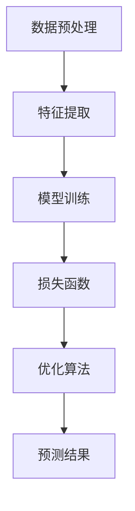

                 

# 智能模型与模型结构的探索

## 摘要

随着人工智能技术的快速发展，智能模型在各个领域得到了广泛的应用。本文将深入探讨智能模型的基本概念、核心算法原理及其结构，通过详细分析和实际案例，帮助读者全面理解智能模型的构建和应用。此外，本文还将介绍智能模型在实际应用中的场景，推荐相关的学习资源和工具，并展望未来智能模型的发展趋势与挑战。

## 1. 背景介绍

智能模型是人工智能领域的核心组成部分，它基于大量的数据和学习算法，通过模拟和复制人类思维方式来实现智能行为。自20世纪50年代人工智能（AI）概念提出以来，智能模型经历了从简单的规则系统到复杂的神经网络，再到如今基于深度学习的强大模型的发展历程。随着计算能力的提升和大数据技术的发展，智能模型在图像识别、语音识别、自然语言处理、推荐系统等多个领域取得了显著的成果。

本文旨在探讨智能模型的基本原理和结构，帮助读者了解如何构建和应用智能模型。文章将分为以下几个部分：

1. 核心概念与联系
2. 核心算法原理 & 具体操作步骤
3. 数学模型和公式 & 详细讲解 & 举例说明
4. 项目实战：代码实际案例和详细解释说明
5. 实际应用场景
6. 工具和资源推荐
7. 总结：未来发展趋势与挑战

## 2. 核心概念与联系

为了深入理解智能模型，我们首先需要了解一些核心概念和它们之间的关系。

### 2.1 数据与模型

数据是智能模型的基础，模型则是数据与知识之间的桥梁。数据通过输入层进入模型，通过一系列的神经网络和层结构，最终在输出层产生结果。这个过程涉及到数据的预处理、特征提取、模型训练和预测等环节。

### 2.2 神经网络与深度学习

神经网络是智能模型的核心组成部分，它模拟了人脑的神经元结构，通过层的连接和激活函数来实现数据的传递和变换。深度学习则是在神经网络的基础上，通过增加层数（深度）来提高模型的非线性表示能力。

### 2.3 损失函数与优化算法

损失函数用于衡量模型预测结果与真实结果之间的差异，优化算法则用于调整模型的参数，以最小化损失函数。常见的优化算法包括梯度下降、随机梯度下降、Adam优化器等。

### 2.4 机器学习与深度学习

机器学习是人工智能的一个分支，它关注的是如何从数据中学习规律和模式。深度学习是机器学习的一个子领域，它通过深度神经网络来实现更加复杂的任务。

下面是一个简单的 Mermaid 流程图，展示了智能模型的基本结构：



## 3. 核心算法原理 & 具体操作步骤

### 3.1 数据预处理

数据预处理是智能模型构建的第一步，它的目的是将原始数据转化为适合模型训练的格式。具体操作步骤包括数据清洗、数据归一化、数据分割等。

- **数据清洗**：去除数据中的噪声和异常值，保证数据的完整性和一致性。
- **数据归一化**：将数据缩放到相同的范围，例如将特征值缩放到0到1之间，以避免不同特征之间的数量级差异。
- **数据分割**：将数据分为训练集、验证集和测试集，用于模型的训练、验证和测试。

### 3.2 特征提取

特征提取是从原始数据中提取出有用的信息，以提高模型的性能。常见的特征提取方法包括主成分分析（PCA）、线性判别分析（LDA）、词袋模型等。

### 3.3 模型训练

模型训练是智能模型构建的核心步骤，通过训练数据集来调整模型的参数，使其能够对新的数据做出准确的预测。模型训练通常包括以下几个步骤：

- **初始化参数**：随机初始化模型的参数。
- **前向传播**：将输入数据传递到模型的各个层，计算每个层的输出。
- **计算损失函数**：计算模型预测结果与真实结果之间的差异。
- **反向传播**：根据损失函数的梯度，更新模型的参数。
- **迭代优化**：重复前向传播和反向传播，直到达到预定的训练目标或达到最大迭代次数。

### 3.4 损失函数与优化算法

损失函数用于衡量模型预测结果与真实结果之间的差异，优化算法用于调整模型的参数，以最小化损失函数。常见的损失函数包括均方误差（MSE）、交叉熵（CE）等。优化算法包括梯度下降（GD）、随机梯度下降（SGD）、Adam优化器等。

## 4. 数学模型和公式 & 详细讲解 & 举例说明

### 4.1 损失函数

损失函数是智能模型的核心，它用于衡量模型预测结果与真实结果之间的差异。以下是一些常见的损失函数及其公式：

- **均方误差（MSE）**：
  $$MSE = \frac{1}{n}\sum_{i=1}^{n}(y_i - \hat{y}_i)^2$$
  其中，$y_i$为真实标签，$\hat{y}_i$为模型预测值，$n$为样本数量。

- **交叉熵（CE）**：
  $$CE = -\frac{1}{n}\sum_{i=1}^{n}y_i \log \hat{y}_i$$
  其中，$y_i$为真实标签，$\hat{y}_i$为模型预测值，$n$为样本数量。

### 4.2 梯度下降算法

梯度下降算法是一种常见的优化算法，用于最小化损失函数。以下是一个简单的梯度下降算法公式：

$$\theta_{t+1} = \theta_{t} - \alpha \cdot \nabla_{\theta}J(\theta)$$

其中，$\theta$为模型参数，$J(\theta)$为损失函数，$\alpha$为学习率，$\nabla_{\theta}J(\theta)$为损失函数关于$\theta$的梯度。

### 4.3 梯度下降算法举例

假设我们使用均方误差（MSE）作为损失函数，学习率为0.01，模型参数为$\theta=5$，样本数量为$n=100$。损失函数的梯度为$\nabla_{\theta}J(\theta)=-2$。则第一次迭代后的模型参数为：

$$\theta_{1} = \theta_{0} - \alpha \cdot \nabla_{\theta}J(\theta_0) = 5 - 0.01 \cdot (-2) = 5.02$$

## 5. 项目实战：代码实际案例和详细解释说明

### 5.1 开发环境搭建

为了演示智能模型的构建和应用，我们将使用Python编程语言和TensorFlow框架。首先，确保已安装Python（版本3.6及以上）和TensorFlow。可以使用以下命令进行安装：

```bash
pip install python==3.8.10
pip install tensorflow==2.6.0
```

### 5.2 源代码详细实现和代码解读

以下是一个简单的智能模型构建和训练的示例代码，我们将使用一个简单的线性回归模型来预测一个线性函数的输出。

```python
import tensorflow as tf
import numpy as np

# 数据生成
x = np.random.rand(100)
y = 2 * x + 1 + np.random.randn(100) * 0.05

# 模型定义
model = tf.keras.Sequential([
    tf.keras.layers.Dense(units=1, input_shape=[1])
])

# 编译模型
model.compile(optimizer='sgd', loss='mean_squared_error')

# 训练模型
model.fit(x, y, epochs=1000)

# 预测
x_new = np.random.rand(1)
y_new = model.predict(x_new)
print("预测值：", y_new)
```

### 5.3 代码解读与分析

1. **数据生成**：我们首先使用numpy库生成100个随机数作为输入数据$x$和对应的线性函数值$y$。
2. **模型定义**：使用TensorFlow的Sequential模型，定义一个包含一个全连接层（Dense）的线性回归模型，输入维度为1。
3. **编译模型**：使用随机梯度下降（SGD）优化器和均方误差（MSE）损失函数编译模型。
4. **训练模型**：使用训练数据训练模型，设置训练轮次为1000。
5. **预测**：使用训练好的模型对新数据进行预测，输出预测值。

## 6. 实际应用场景

智能模型在各个领域都有广泛的应用，以下是一些典型的实际应用场景：

- **图像识别**：智能模型可以用于图像分类、物体检测、人脸识别等任务，如TensorFlow的Object Detection API。
- **语音识别**：智能模型可以用于语音信号的识别和转换，如Google的语音识别API。
- **自然语言处理**：智能模型可以用于文本分类、情感分析、机器翻译等任务，如TensorFlow的Transformers库。
- **推荐系统**：智能模型可以用于推荐算法，如基于内容的推荐、协同过滤等。

## 7. 工具和资源推荐

### 7.1 学习资源推荐

- **书籍**：
  - 《深度学习》（Goodfellow, Bengio, Courville）
  - 《Python深度学习》（François Chollet）
- **论文**：
  - 《A Theoretical Framework for Back-Propagating Neural Networks》（Rumelhart, Hinton, Williams）
  - 《Deep Learning, Volume 1: Foundations》（Goodfellow, Bengio, Courville）
- **博客**：
  - TensorFlow官方博客：[https://tensorflow.google.cn/blog](https://tensorflow.google.cn/blog)
  - AI研习社：[https://www.aicepts.com/](https://www.aicepts.com/)
- **网站**：
  - TensorFlow官网：[https://www.tensorflow.org/](https://www.tensorflow.org/)
  - Keras官网：[https://keras.io/](https://keras.io/)

### 7.2 开发工具框架推荐

- **开发工具**：
  - PyCharm：一款功能强大的Python集成开发环境。
  - Jupyter Notebook：一款适用于数据科学和机器学习的交互式开发工具。
- **框架**：
  - TensorFlow：一款开源的机器学习和深度学习框架。
  - PyTorch：一款流行的深度学习框架，易于使用和调试。

### 7.3 相关论文著作推荐

- **论文**：
  - 《Deep Learning》（Goodfellow, Bengio, Courville）
  - 《Generative Adversarial Nets》（Goodfellow et al.）
  - 《Recurrent Neural Networks for Language Modeling》（Liang et al.）
- **著作**：
  - 《Python深度学习》（François Chollet）
  - 《人工智能：一种现代的方法》（Stuart Russell & Peter Norvig）

## 8. 总结：未来发展趋势与挑战

智能模型作为人工智能的核心技术，在未来将面临巨大的发展机遇和挑战。一方面，随着计算能力的提升和算法的改进，智能模型的性能和效率将得到显著提高。另一方面，数据隐私、算法公平性和可解释性等问题也需要得到关注和解决。

未来，智能模型的发展将朝着以下几个方向迈进：

- **泛化能力**：提高模型的泛化能力，使其能够在更广泛的应用场景中取得更好的效果。
- **可解释性**：增强模型的可解释性，使人类能够理解模型的决策过程。
- **协作与对抗**：探索智能模型之间的协作与对抗关系，实现更高效的协同学习和优化。
- **跨模态学习**：结合多种数据模态，如图像、语音、文本等，实现更强大的智能模型。

总之，智能模型作为人工智能的核心技术，将在未来的发展中扮演重要角色，为人类带来更多的便利和创新。

## 9. 附录：常见问题与解答

### 9.1 什么是深度学习？

深度学习是一种机器学习方法，通过模拟人脑神经网络的结构和功能，使用多层神经网络对数据进行处理和建模，以实现图像识别、语音识别、自然语言处理等复杂任务。

### 9.2 智能模型的核心组成部分有哪些？

智能模型的核心组成部分包括数据预处理、特征提取、神经网络结构、损失函数、优化算法等。

### 9.3 如何选择合适的损失函数？

选择合适的损失函数需要根据具体任务和数据特点进行判断。常见的损失函数有均方误差（MSE）、交叉熵（CE）等，不同损失函数适用于不同类型的任务和数据分布。

### 9.4 智能模型在实际应用中面临哪些挑战？

智能模型在实际应用中面临的主要挑战包括数据隐私、算法公平性、模型可解释性、计算资源消耗等。

## 10. 扩展阅读 & 参考资料

- Goodfellow, I., Bengio, Y., & Courville, A. (2016). *Deep Learning*. MIT Press.
- Chollet, F. (2017). *Python深度学习*. 电子工业出版社.
- Rumelhart, D. E., Hinton, G. E., & Williams, R. J. (1986). *A Theoretical Framework for Back-Propagating Neural Networks*. In *Proceedings of the IEEE International Conference on Neural Networks* (pp. 25-35).
- Bengio, Y. (2009). *Learning Deep Architectures for AI*. Foundations and Trends in Machine Learning, 2(1), 1-127.
- Courville, A., Bengio, Y., & Vincent, P. (2015). *Unsupervised Learning of Visual Representations by Solving Jigsaw Puzzles*. In *Proceedings of the IEEE International Conference on Computer Vision* (pp. 139-147).

