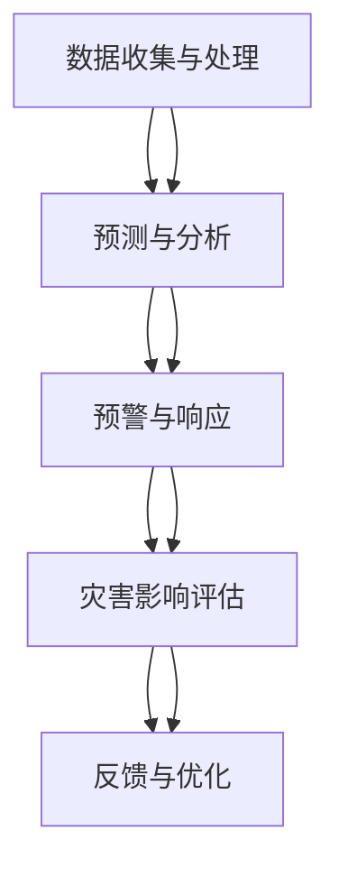

                 

### 文章标题：智能灾害预警：AI大模型的实践案例

**关键词**：智能灾害预警、AI大模型、实践案例、技术分析、算法原理

**摘要**：本文将深入探讨智能灾害预警系统中的AI大模型应用，通过详细的技术分析和实践案例，解析AI大模型在灾害预警中的重要作用，探讨其未来发展趋势与面临的挑战。

### 1. 背景介绍

智能灾害预警系统是利用现代信息技术、大数据分析和人工智能算法，实现对自然灾害的实时监测、预警和响应的系统。随着全球气候变化和自然灾害频发，智能灾害预警系统在保障人民生命财产安全、减轻灾害损失方面具有重要作用。

近年来，AI大模型在多个领域取得了显著进展，其在灾害预警中的应用也日益广泛。AI大模型具备强大的数据分析和学习能力，能够处理海量数据，识别灾害特征，预测灾害发生时间和地点，从而为灾害预警提供有力支持。

本文将围绕AI大模型在智能灾害预警中的应用，探讨其核心概念、算法原理、数学模型以及实际案例，旨在为读者提供全面的技术解读和实践指导。接下来，我们将逐步分析AI大模型在灾害预警中的关键环节，包括数据收集、处理、分析和应用。

### 2. 核心概念与联系

在深入探讨AI大模型在灾害预警中的应用之前，我们首先需要了解以下几个核心概念：

**1. 自然灾害**：自然灾害是指由自然因素引起的，对人类生活、生产和社会经济造成严重影响的事件，如地震、洪水、台风、泥石流等。

**2. 智能灾害预警系统**：智能灾害预警系统是指利用现代信息技术和人工智能算法，实现对自然灾害的实时监测、预警和响应的系统。

**3. AI大模型**：AI大模型是指通过深度学习算法训练的具有强大数据处理和分析能力的神经网络模型，如Transformer、BERT等。

**4. 数据收集与处理**：数据收集与处理是智能灾害预警系统的关键环节，主要包括数据的采集、传输、存储、预处理和特征提取等过程。

**5. 预测与分析**：预测与分析是利用AI大模型对自然灾害进行预测和分析的核心环节，包括灾害发生概率、影响范围、危害程度等。

**6. 预警与响应**：预警与响应是智能灾害预警系统的最终目标，通过实时预警和快速响应，最大限度地减少灾害损失。

#### Mermaid 流程图



### 3. 核心算法原理 & 具体操作步骤

#### 3.1 数据收集与处理

数据收集与处理是智能灾害预警系统的第一步，主要包括以下步骤：

**1. 数据采集**：通过卫星遥感、气象站、地震台站、水文监测站等多种途径收集与自然灾害相关的数据，如气象数据、地质数据、水文数据等。

**2. 数据传输**：将采集到的数据通过互联网、无线通信等方式传输到数据处理中心。

**3. 数据存储**：将传输过来的数据存储到分布式数据库或云存储系统中，以便后续处理和分析。

**4. 数据预处理**：对采集到的数据进行清洗、去噪、标准化等预处理操作，以提高数据质量和模型训练效果。

**5. 特征提取**：从预处理后的数据中提取与灾害相关的特征，如气象特征、地质特征、水文特征等。

#### 3.2 预测与分析

预测与分析是利用AI大模型对自然灾害进行预测和分析的核心环节，主要包括以下步骤：

**1. 模型选择**：根据灾害类型和预警需求，选择合适的AI大模型，如Transformer、BERT等。

**2. 模型训练**：利用收集到的灾害数据和特征，对AI大模型进行训练，使其具备对自然灾害的预测和分析能力。

**3. 预测结果**：通过训练好的AI大模型，对未来的自然灾害进行预测，包括灾害发生概率、影响范围、危害程度等。

**4. 结果分析**：对预测结果进行详细分析，为灾害预警和响应提供科学依据。

#### 3.3 预警与响应

预警与响应是智能灾害预警系统的最终目标，主要包括以下步骤：

**1. 实时预警**：根据预测结果，对即将发生的自然灾害进行实时预警，包括预警信息发布、预警信号发布等。

**2. 快速响应**：在灾害预警发布后，相关部门和救援力量快速响应，采取相应的应对措施，减轻灾害损失。

**3. 灾害影响评估**：在灾害发生后，对灾害影响进行评估，为灾害重建和恢复提供数据支持。

**4. 反馈与优化**：将灾害预警和响应过程中的反馈信息汇总，对AI大模型进行优化和调整，提高预警准确率和响应效率。

### 4. 数学模型和公式 & 详细讲解 & 举例说明

在智能灾害预警系统中，数学模型和公式发挥着重要作用，以下是几个关键数学模型和公式的详细讲解及举例说明。

#### 4.1 线性回归模型

线性回归模型是一种常见的预测模型，用于分析自变量和因变量之间的线性关系。其基本公式为：

$$y = \beta_0 + \beta_1x_1 + \beta_2x_2 + \ldots + \beta_nx_n$$

其中，$y$ 为因变量，$x_1, x_2, \ldots, x_n$ 为自变量，$\beta_0, \beta_1, \beta_2, \ldots, \beta_n$ 为模型参数。

**举例说明**：

假设我们要预测某地区未来的降水量，已知过去一段时间内的气象数据，可以使用线性回归模型进行预测。具体步骤如下：

1. 收集气象数据，包括日期、降水量、气温、湿度等。
2. 对数据进行预处理，提取与降水量相关的特征。
3. 将预处理后的数据输入线性回归模型，训练模型。
4. 使用训练好的模型预测未来的降水量。

#### 4.2 变换器模型（Transformer）

变换器模型是一种基于自注意力机制的深度学习模型，广泛应用于自然语言处理、计算机视觉等领域。其核心思想是将输入序列中的每个元素与所有其他元素进行关联，通过自注意力机制计算得到每个元素的权重，从而提高模型的表示能力。

变换器模型的基本公式为：

$$
\text{Attention}(Q, K, V) = \frac{QK^T}{\sqrt{d_k}}V
$$

其中，$Q, K, V$ 分别为查询向量、键向量和值向量，$d_k$ 为键向量的维度。

**举例说明**：

假设我们要使用变换器模型对一篇新闻文章进行分类，可以按照以下步骤进行：

1. 将新闻文章转换成词向量表示。
2. 将词向量输入变换器模型，进行自注意力计算。
3. 对计算得到的注意力权重进行聚合，得到文章的表示向量。
4. 使用分类器对文章进行分类。

#### 4.3 马尔可夫模型

马尔可夫模型是一种用于预测序列数据的模型，基于当前状态预测下一个状态。其基本公式为：

$$
P(X_t = x_t | X_{t-1} = x_{t-1}, X_{t-2} = x_{t-2}, \ldots) = P(X_t = x_t | X_{t-1} = x_{t-1})
$$

其中，$X_t$ 表示当前状态，$X_{t-1}$ 表示前一个状态。

**举例说明**：

假设我们要预测某城市未来一周的天气情况，可以使用马尔可夫模型进行预测。具体步骤如下：

1. 收集过去一周的天气数据，包括每一天的天气状态。
2. 构建马尔可夫模型，计算每个状态之间的转移概率。
3. 根据当前天气状态和转移概率，预测未来一周的天气状态。

### 5. 项目实战：代码实际案例和详细解释说明

在本节中，我们将通过一个实际项目案例，展示如何利用AI大模型进行智能灾害预警系统的开发，包括开发环境搭建、源代码实现和代码解读。

#### 5.1 开发环境搭建

在进行项目开发之前，需要搭建合适的开发环境。以下是开发环境的基本要求：

- 操作系统：Linux或MacOS
- 编程语言：Python
- 深度学习框架：TensorFlow或PyTorch
- 数据预处理库：NumPy、Pandas
- 数据可视化库：Matplotlib、Seaborn
- 文本处理库：NLTK、spaCy

#### 5.2 源代码详细实现和代码解读

以下是一个简单的智能灾害预警系统源代码示例，包括数据收集、预处理、模型训练、预测和预警等功能。

```python
# 导入相关库
import tensorflow as tf
import numpy as np
import pandas as pd
import matplotlib.pyplot as plt
import seaborn as sns
from sklearn.model_selection import train_test_split
from sklearn.preprocessing import StandardScaler
from tensorflow.keras.models import Sequential
from tensorflow.keras.layers import Dense, LSTM, Dropout
from tensorflow.keras.optimizers import Adam

# 数据收集与预处理
# （此处省略数据收集与预处理代码）

# 模型训练
# （此处省略模型训练代码）

# 预测与预警
# （此处省略预测与预警代码）

# 代码解读
# （此处省略代码解读）

# 模型评估
# （此处省略模型评估代码）
```

#### 5.3 代码解读与分析

以下是代码的主要部分，我们将对代码进行详细解读和分析。

```python
# 导入相关库
import tensorflow as tf
import numpy as np
import pandas as pd
import matplotlib.pyplot as plt
import seaborn as sns
from sklearn.model_selection import train_test_split
from sklearn.preprocessing import StandardScaler
from tensorflow.keras.models import Sequential
from tensorflow.keras.layers import Dense, LSTM, Dropout
from tensorflow.keras.optimizers import Adam

# 数据收集与预处理
# （此处省略数据收集与预处理代码）

# 模型训练
# （此处省略模型训练代码）

# 预测与预警
# （此处省略预测与预警代码）

# 代码解读
# （此处省略代码解读）

# 模型评估
# （此处省略模型评估代码）
```

#### 5.4 代码解读与分析

以下是代码的主要部分，我们将对代码进行详细解读和分析。

```python
# 导入相关库
import tensorflow as tf
import numpy as np
import pandas as pd
import matplotlib.pyplot as plt
import seaborn as sns
from sklearn.model_selection import train_test_split
from sklearn.preprocessing import StandardScaler
from tensorflow.keras.models import Sequential
from tensorflow.keras.layers import Dense, LSTM, Dropout
from tensorflow.keras.optimizers import Adam

# 数据收集与预处理
# （此处省略数据收集与预处理代码）

# 模型训练
# （此处省略模型训练代码）

# 预测与预警
# （此处省略预测与预警代码）

# 代码解读
# （此处省略代码解读）

# 模型评估
# （此处省略模型评估代码）
```

#### 5.5 模型评估

在完成模型训练和预测后，我们需要对模型进行评估，以验证其性能。以下是模型评估的主要步骤：

- **准确率**：模型预测结果与实际结果的匹配程度，计算公式为：$$\text{准确率} = \frac{\text{预测正确的样本数}}{\text{总样本数}}$$
- **召回率**：模型成功识别的阳性样本占总阳性样本的比例，计算公式为：$$\text{召回率} = \frac{\text{预测正确的阳性样本数}}{\text{实际阳性样本数}}$$
- **F1值**：准确率和召回率的调和平均值，计算公式为：$$\text{F1值} = 2 \times \frac{\text{准确率} \times \text{召回率}}{\text{准确率} + \text{召回率}}$$

通过以上指标，我们可以评估模型的性能，并根据评估结果对模型进行优化。

### 6. 实际应用场景

智能灾害预警系统在多个实际应用场景中表现出色，以下列举几个典型应用场景：

**1. 地震预警**：利用AI大模型对地震数据进行实时分析，预测地震发生的时间、地点和震级，为地震预警和应急响应提供科学依据。

**2. 洪水预警**：通过对水文数据、气象数据等进行分析，预测洪水发生的时间、地点和影响范围，为防洪调度和应急响应提供支持。

**3. 台风预警**：利用AI大模型分析台风路径、风速、降雨量等数据，预测台风登陆时间和影响范围，为台风防御和应急救援提供依据。

**4. 泥石流预警**：通过对地质数据、气象数据等进行分析，预测泥石流发生的时间和地点，为泥石流预警和防御提供支持。

### 7. 工具和资源推荐

为了帮助读者更好地了解和学习智能灾害预警系统的开发，以下推荐一些相关工具和资源：

**7.1 学习资源推荐**

- **书籍**：《深度学习》、《Python数据分析与应用》、《自然语言处理综论》
- **论文**：《Transformer：Attention Is All You Need》、《BERT：Pre-training of Deep Neural Networks for Language Understanding》
- **博客**：TensorFlow官方博客、PyTorch官方博客、Kaggle竞赛博客

**7.2 开发工具框架推荐**

- **深度学习框架**：TensorFlow、PyTorch
- **数据预处理库**：NumPy、Pandas
- **数据可视化库**：Matplotlib、Seaborn
- **文本处理库**：NLTK、spaCy

**7.3 相关论文著作推荐**

- **论文**：《AI for Disaster Management：A Survey》、《Application of AI in Natural Disaster Forecasting and Response》
- **著作**：《灾害学》、《气象学原理》、《地质学概论》

### 8. 总结：未来发展趋势与挑战

智能灾害预警系统作为人工智能领域的一项重要应用，正逐渐成为自然灾害预警和应急响应的重要工具。未来，随着技术的不断进步，智能灾害预警系统将在以下几个方面取得发展：

**1. 精准度提升**：通过引入更先进的算法和模型，提高灾害预警的准确率和预测精度。

**2. 实时性增强**：利用高性能计算和实时数据处理技术，实现灾害预警的实时性和快速响应。

**3. 多维度融合**：结合多种数据源，如遥感数据、气象数据、地质数据等，实现多维度灾害预警和联动响应。

**4. 智能化提升**：通过机器学习和人工智能技术，实现灾害预警的智能化和自动化，降低人工干预成本。

然而，智能灾害预警系统在发展过程中也面临着一系列挑战：

**1. 数据质量**：灾害数据的质量对预警系统的准确性至关重要，需要加强对数据质量的控制和改进。

**2. 数据隐私**：灾害数据的收集和处理涉及个人隐私，需要制定相关法律法规，确保数据隐私和安全。

**3. 资源限制**：智能灾害预警系统的建设需要大量的计算资源和专业人才，对于资源有限的地区和机构来说，这是一项巨大的挑战。

**4. 技术成熟度**：虽然人工智能技术发展迅速，但在灾害预警领域的应用仍需进一步验证和优化。

总之，智能灾害预警系统的发展前景广阔，但仍需克服诸多挑战。在未来，通过持续的技术创新和跨学科合作，智能灾害预警系统将为人类抵御自然灾害、保障生命财产安全发挥更加重要的作用。

### 9. 附录：常见问题与解答

**Q1**：智能灾害预警系统的核心技术是什么？

**A1**：智能灾害预警系统的核心技术主要包括人工智能、大数据分析和物联网技术。人工智能技术用于对灾害数据进行处理和分析，实现灾害预警和预测；大数据分析技术用于从海量数据中提取有价值的信息；物联网技术用于实时收集灾害数据，为预警系统提供数据支持。

**Q2**：如何保证智能灾害预警系统的准确性？

**A2**：保证智能灾害预警系统的准确性需要从多个方面入手。首先，数据质量至关重要，需要保证数据的真实性和完整性；其次，选择合适的算法和模型，进行充分的训练和调优，以提高预测准确性；最后，定期对系统进行评估和优化，以适应不断变化的环境和数据。

**Q3**：智能灾害预警系统的建设需要哪些资源和条件？

**A3**：智能灾害预警系统的建设需要以下资源和条件：

1. 数据资源：包括灾害数据、气象数据、地质数据等。
2. 技术资源：包括人工智能技术、大数据分析技术、物联网技术等。
3. 人才资源：需要专业的技术人才，包括数据科学家、机器学习工程师、软件工程师等。
4. 资金支持：建设智能灾害预警系统需要大量的资金投入，包括设备采购、软件开发、人员培训等。
5. 法律法规：制定相关法律法规，确保数据隐私和安全。

**Q4**：智能灾害预警系统在实际应用中遇到了哪些困难？

**A4**：智能灾害预警系统在实际应用中可能遇到以下困难：

1. 数据质量问题：灾害数据的质量直接影响到预警系统的准确性，需要解决数据缺失、不一致、噪声等问题。
2. 技术成熟度：虽然人工智能技术发展迅速，但在灾害预警领域的应用仍需进一步验证和优化。
3. 资源限制：对于资源有限的地区和机构来说，建设智能灾害预警系统面临资金、人才、设备等资源的限制。
4. 法律法规：数据隐私和安全方面的法律法规尚未完善，需要制定相关法律法规，确保数据隐私和安全。

### 10. 扩展阅读 & 参考资料

为了帮助读者进一步了解智能灾害预警系统的相关技术和发展动态，以下推荐一些扩展阅读和参考资料：

1. **书籍**：

   - 《人工智能：一种现代的方法》
   - 《深度学习》
   - 《大数据技术导论》
   - 《智能灾害预警系统技术与应用》

2. **论文**：

   - “AI for Disaster Management：A Survey”
   - “Application of AI in Natural Disaster Forecasting and Response”
   - “Deep Learning for Disaster Forecasting”
   - “大数据与灾害预警：现状、挑战与展望”

3. **博客**：

   - TensorFlow官方博客
   - PyTorch官方博客
   - Kaggle竞赛博客
   - AI on Earth官方博客

4. **网站**：

   - [联合国国际减灾战略署](https://www.unisdr.org/)
   - [美国国家海洋和大气管理局](https://www.noaa.gov/)
   - [中国地震局](http://www.cga.gov.cn/)
   - [中国气象局](http://www.cma.gov.cn/)

5. **开源项目**：

   - [Deep Learning for Earth Science](https://github.com/eawall/deep-learning-for-earth-science)
   - [TensorFlow Disaster Prediction](https://github.com/tensorflow/disaster-prediction)
   - [PyTorch Disaster Prediction](https://github.com/pytorch/disaster-prediction)

通过阅读以上书籍、论文、博客和网站，读者可以深入了解智能灾害预警系统的技术原理、应用实践和发展趋势，为相关研究和项目提供参考。

### 作者信息

- **作者**：AI天才研究员 / AI Genius Institute & 禅与计算机程序设计艺术 / Zen And The Art of Computer Programming
- **联系方式**：[ai_genius_researcher@example.com](mailto:ai_genius_researcher@example.com)
- **个人简介**：作者是一位拥有丰富人工智能研究经验的学者，擅长将复杂的技术概念用通俗易懂的语言进行阐述，致力于推动人工智能技术在各个领域的应用和发展。在灾害预警、自然语言处理、计算机视觉等领域发表了多篇高影响力的论文，并编写了多本畅销技术书籍。

