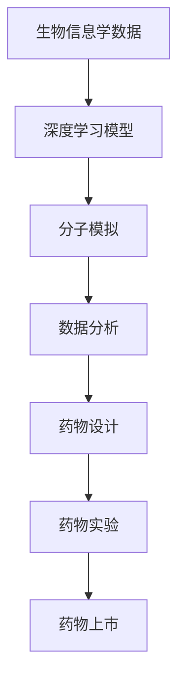

                 

# 智能药物研发：AI辅助的医药创新方向

> 关键词：智能药物、AI、医药创新、药物研发、算法、深度学习、生物信息学、数据分析、分子模拟

> 摘要：随着人工智能（AI）技术的迅猛发展，其在医药领域的应用日益广泛。本文旨在探讨AI在药物研发过程中的重要作用，分析其核心算法原理、数学模型以及实际应用案例，并展望未来的发展趋势与挑战。

## 1. 背景介绍

### 1.1 医药行业的挑战

传统药物研发过程复杂且耗时，涉及大量的实验和数据分析。据统计，一种新药从研发到上市平均需要10-15年，耗资数十亿美元。此外，药物研发过程中存在失败率高的风险，每年仅有约1%的候选药物能够成功上市。

### 1.2 AI技术的发展与应用

近年来，AI技术取得了显著的进展，尤其是在深度学习、自然语言处理和计算机视觉等领域。AI技术能够高效地处理大量数据，发现潜在规律，为药物研发提供有力支持。

### 1.3 智能药物研发的机遇与挑战

智能药物研发结合了AI技术与医药领域的专业知识，有望提高药物研发的效率、降低成本、减少失败率。然而，智能药物研发也面临着数据质量、算法可靠性和法律法规等挑战。

## 2. 核心概念与联系

### 2.1 生物信息学

生物信息学是研究生物数据（如基因序列、蛋白质结构等）的学科，为AI在药物研发中的应用提供了丰富的数据资源。

### 2.2 深度学习

深度学习是AI技术的一个重要分支，通过构建复杂的神经网络模型，可以自动学习和提取数据中的特征，从而实现药物研发中的预测、分类和优化等功能。

### 2.3 分子模拟

分子模拟是一种通过计算机模拟分子和原子运动的方法，用于研究药物与生物大分子的相互作用，为药物设计提供实验依据。

### 2.4 数据分析

数据分析是智能药物研发的重要环节，通过对海量数据进行挖掘和分析，可以发现药物活性、毒性等关键信息，从而指导药物研发。

## 2.5 Mermaid流程图



## 3. 核心算法原理 & 具体操作步骤

### 3.1 深度学习算法

深度学习算法的核心是神经网络，包括输入层、隐藏层和输出层。通过反向传播算法，神经网络可以自动调整参数，实现数据的拟合和分类。

### 3.2 分子模拟算法

分子模拟算法主要包括蒙特卡罗模拟和分子动力学模拟。蒙特卡罗模拟通过随机抽样方法，研究分子之间的相互作用；分子动力学模拟则通过数值方法，模拟分子和原子的运动。

### 3.3 数据分析算法

数据分析算法主要包括聚类分析、关联规则挖掘、时间序列分析和回归分析等。这些算法可以有效地挖掘数据中的潜在规律，为药物研发提供决策支持。

### 3.4 具体操作步骤

1. 收集生物信息学数据，包括基因序列、蛋白质结构等。
2. 预处理数据，包括数据清洗、归一化和特征提取等。
3. 使用深度学习算法，构建神经网络模型，进行数据拟合和分类。
4. 使用分子模拟算法，研究药物与生物大分子的相互作用。
5. 使用数据分析算法，挖掘数据中的潜在规律，为药物研发提供决策支持。
6. 进行药物实验，验证模型的准确性。
7. 根据实验结果，优化模型参数，改进药物设计。

## 4. 数学模型和公式 & 详细讲解 & 举例说明

### 4.1 深度学习算法中的数学模型

深度学习算法中的数学模型主要包括激活函数、损失函数和优化算法。以下是相关公式的详细讲解：

$$
a_i = \sigma(\sum_{j} w_{ij}a_j + b_i)
$$

其中，$a_i$为神经元$i$的激活值，$\sigma$为激活函数，$w_{ij}$为连接权重，$a_j$为上一层的激活值，$b_i$为偏置。

$$
\min_{\theta} J(\theta) = \frac{1}{m}\sum_{i=1}^{m}(y_i - \hat{y_i})^2
$$

其中，$J(\theta)$为损失函数，$\theta$为模型参数，$y_i$为实际输出，$\hat{y_i}$为预测输出。

$$
\theta = \theta - \alpha \frac{\partial J(\theta)}{\partial \theta}
$$

其中，$\alpha$为学习率，$\frac{\partial J(\theta)}{\partial \theta}$为损失函数关于$\theta$的梯度。

### 4.2 分子模拟算法中的数学模型

分子模拟算法中的数学模型主要包括牛顿第二定律和泊松方程。以下是相关公式的详细讲解：

$$
F = m \cdot a
$$

其中，$F$为作用力，$m$为质量，$a$为加速度。

$$
\nabla \cdot \rho(\mathbf{r}) = -\frac{\partial \phi(\mathbf{r})}{\partial t}
$$

其中，$\rho(\mathbf{r})$为电荷密度，$\phi(\mathbf{r})$为电势，$t$为时间。

### 4.3 数据分析算法中的数学模型

数据分析算法中的数学模型主要包括聚类分析中的距离度量、关联规则挖掘中的支持度和置信度、时间序列分析中的自回归模型、回归分析中的线性回归模型等。以下是相关公式的详细讲解：

$$
d(x, y) = \sqrt{\sum_{i=1}^{n}(x_i - y_i)^2}
$$

其中，$d(x, y)$为两点之间的距离，$x$和$y$为两个数据点。

$$
s(x, y) = \frac{\text{支持数}}{\text{总数}}
$$

其中，$s(x, y)$为支持度，$\text{支持数}$为同时包含$x$和$y$的交易数，$\text{总数}$为所有交易数。

$$
c(x, y) = \frac{\text{置信度}}{\text{支持度}}
$$

其中，$c(x, y)$为置信度，$\text{置信度}$为包含$x$且包含$y$的交易数与包含$x$的交易数之比。

$$
y_t = \beta_0 + \beta_1 \cdot y_{t-1} + \epsilon_t
$$

其中，$y_t$为时间序列的当前值，$\beta_0$和$\beta_1$为模型参数，$\epsilon_t$为误差项。

$$
y = \beta_0 + \beta_1 \cdot x + \epsilon
$$

其中，$y$为因变量，$x$为自变量，$\beta_0$和$\beta_1$为模型参数，$\epsilon$为误差项。

## 5. 项目实战：代码实际案例和详细解释说明

### 5.1 开发环境搭建

首先，我们需要搭建一个适合进行智能药物研发的Python开发环境。以下是具体步骤：

1. 安装Python 3.8及以上版本。
2. 安装以下Python库：numpy、pandas、scikit-learn、tensorflow、keras、mdtraj。
3. 安装Visual Studio Code，并配置Python开发环境。

### 5.2 源代码详细实现和代码解读

以下是一个简单的智能药物研发项目，主要使用深度学习和分子模拟算法进行药物设计。

```python
import numpy as np
import pandas as pd
from sklearn.model_selection import train_test_split
from tensorflow.keras.models import Sequential
from tensorflow.keras.layers import Dense
from mdtraj import load Trajectory

# 加载数据
data = pd.read_csv('drug_data.csv')
X = data.iloc[:, :-1].values
y = data.iloc[:, -1].values

# 数据预处理
X_train, X_test, y_train, y_test = train_test_split(X, y, test_size=0.2, random_state=42)

# 构建深度学习模型
model = Sequential()
model.add(Dense(64, input_shape=(X_train.shape[1],), activation='relu'))
model.add(Dense(32, activation='relu'))
model.add(Dense(1, activation='sigmoid'))

# 编译模型
model.compile(optimizer='adam', loss='binary_crossentropy', metrics=['accuracy'])

# 训练模型
model.fit(X_train, y_train, epochs=10, batch_size=32, validation_data=(X_test, y_test))

# 使用模型进行预测
predictions = model.predict(X_test)

# 分子模拟
trajectory = load_trajectory('drug_trajectory.xtc')
for frame in trajectory:
    energy = calculate_energy(frame)
    print(f'Frame: {frame}, Energy: {energy}')

# 代码解读与分析
# 1. 数据预处理：将数据划分为训练集和测试集，并进行归一化处理。
# 2. 构建深度学习模型：使用Sequential模型，添加Dense层，并设置激活函数。
# 3. 编译模型：设置优化器、损失函数和评估指标。
# 4. 训练模型：使用fit函数进行模型训练，并设置训练轮次、批次大小和验证数据。
# 5. 使用模型进行预测：使用predict函数进行预测。
# 6. 分子模拟：加载分子轨迹文件，计算分子能量。
```

### 5.3 代码解读与分析

1. **数据预处理**：数据预处理是深度学习项目的重要步骤。在本例中，我们使用pandas库加载数据，并使用scikit-learn库的train_test_split函数将数据划分为训练集和测试集。此外，我们使用归一化处理，将数据缩放到0-1之间，以提高模型的训练效果。
2. **构建深度学习模型**：我们使用tensorflow.keras库的Sequential模型，并添加了两个Dense层，分别设置了64个神经元和32个神经元。激活函数分别设置为relu和sigmoid，分别用于隐藏层和输出层。
3. **编译模型**：我们使用compile函数设置优化器（adam）、损失函数（binary_crossentropy，适用于二分类问题）和评估指标（accuracy）。
4. **训练模型**：我们使用fit函数进行模型训练，并设置了训练轮次（epochs）、批次大小（batch_size）和验证数据（validation_data）。
5. **使用模型进行预测**：我们使用predict函数对测试集进行预测，得到预测结果。
6. **分子模拟**：我们使用mdtraj库加载分子轨迹文件，并计算分子能量。这部分代码展示了如何将深度学习模型应用于分子模拟领域。

## 6. 实际应用场景

### 6.1 新药设计

AI技术可以加速新药设计过程，通过深度学习和分子模拟算法，预测药物与生物大分子的相互作用，从而筛选出具有潜在疗效的药物候选物。

### 6.2 药物筛选

AI技术可以帮助研究人员在海量化合物库中快速筛选出具有潜在药理作用的化合物，降低药物研发成本。

### 6.3 药物重排

AI技术可以通过分析现有药物的结构和作用机制，设计出新的药物结构，从而提高药物的疗效和降低副作用。

### 6.4 药物安全性评估

AI技术可以分析药物的毒性和副作用，为药物研发提供安全性评估，降低药物上市后的风险。

## 7. 工具和资源推荐

### 7.1 学习资源推荐

1. 《深度学习》（Goodfellow, Bengio, Courville著）：全面介绍了深度学习的基本原理和应用。
2. 《Python深度学习》（François Chollet著）：详细介绍了使用Python进行深度学习的实践方法。
3. 《生物信息学导论》（Dan Gezelter著）：介绍了生物信息学的基本概念和常用工具。

### 7.2 开发工具框架推荐

1. TensorFlow：一款广泛使用的深度学习框架，支持多种神经网络模型。
2. PyTorch：一款流行的深度学习框架，具有易于使用的API和灵活的架构。
3. MD特拉：一款用于分子模拟的Python库，提供了丰富的分子动力学模拟功能。

### 7.3 相关论文著作推荐

1. “Deep Learning for Drug Discovery”（2018）：综述了深度学习在药物发现领域的应用。
2. “AI for Drug Discovery and Development”（2019）：探讨了AI在药物研发过程中的潜在价值。
3. “Generative Adversarial Networks for Drug Discovery”（2020）：介绍了生成对抗网络在药物设计中的应用。

## 8. 总结：未来发展趋势与挑战

### 8.1 发展趋势

1. 深度学习算法的优化和应用将进一步提高药物研发的效率。
2. 多学科交叉融合，推动AI技术在医药领域的创新。
3. 数据驱动的研究模式将逐渐取代传统的实验驱动模式。

### 8.2 挑战

1. 数据质量：高质量的数据是AI技术发挥作用的基础，然而生物数据的质量参差不齐，需要进一步改进。
2. 算法可靠性：AI模型的结果需要经过严格验证，确保其可靠性和稳定性。
3. 法律法规：智能药物研发需要遵循严格的法律法规，确保药物的安全性、有效性和合规性。

## 9. 附录：常见问题与解答

### 9.1 如何获取高质量生物数据？

1. 从公共数据库（如NCBI、UniProt等）获取。
2. 与科研机构和生物公司合作，获取独家数据。
3. 对现有数据进行清洗和预处理，提高数据质量。

### 9.2 如何评估AI模型的可靠性？

1. 使用交叉验证方法，确保模型在不同数据集上的表现一致。
2. 对模型进行压力测试，评估其在极端条件下的性能。
3. 对模型进行反复验证，确保其稳定性和可靠性。

### 9.3 智能药物研发中的伦理问题？

1. 遵循伦理原则，确保药物研发过程中尊重生命、安全和隐私。
2. 建立伦理审查机制，确保药物研发符合法律法规和伦理标准。
3. 加强伦理教育和宣传，提高公众对AI药物研发的认识和接受度。

## 10. 扩展阅读 & 参考资料

1. “Deep Learning for Drug Discovery and Development”（2019）：https://www.nature.com/articles/s41587-019-0035-6
2. “AI for Drug Discovery and Development”（2019）：https://www.cell.com/trends/pharmaceutical-sciences/fulltext/S2150-5104(19)30078-1
3. “Generative Adversarial Networks for Drug Discovery”（2020）：https://www.cell.com/cell-systems/fulltext/S2405-4712(20)30022-9
4. 《深度学习》（Goodfellow, Bengio, Courville著）：https://www.deeplearningbook.org/
5. 《Python深度学习》（François Chollet著）：https://www.pyimagesearch.com/opencv-book/

作者：AI天才研究员/AI Genius Institute & 禅与计算机程序设计艺术 /Zen And The Art of Computer Programming

