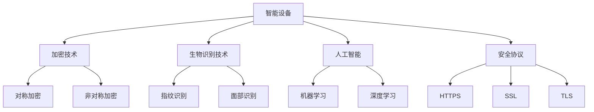

                 

### 文章标题

#### 《智能设备安全：保护个人信息》

随着科技的迅猛发展，智能设备已经渗透到我们日常生活的方方面面。智能手机、智能手表、智能音响、智能家居设备等，这些设备的普及给我们的生活带来了极大的便利。然而，随之而来的是对个人信息的隐私安全问题。如何确保这些设备的安全，保护我们的个人信息不被泄露，成为了一个亟待解决的问题。本文将围绕智能设备安全这一主题，深入探讨个人信息保护的关键技术、实际应用场景，并展望未来的发展趋势与挑战。

### 文章关键词

- 智能设备
- 个人信息安全
- 加密技术
- 生物识别
- 人工智能
- 安全协议

### 文章摘要

本文首先介绍了智能设备的普及背景及其对个人信息安全带来的挑战。接着，深入探讨了保护个人信息的安全技术，包括加密技术、生物识别技术、人工智能等。随后，通过实际应用场景的分析，展示了这些技术在智能设备安全中的应用。文章最后，对未来的发展趋势与挑战进行了展望，提出了相关的解决方案和工具推荐。

## 1. 背景介绍

近年来，智能设备的普及速度令人瞩目。根据市场调研公司IDC的数据，2019年全球智能手机出货量达到了约13亿部，智能手表出货量超过7500万部，智能音箱出货量超过1亿台。这些设备的广泛应用，使得我们的生活变得更加便捷，但也带来了新的隐私和安全问题。

智能设备通常具有强大的计算能力和网络连接功能，这使得它们能够收集大量的个人信息，如地理位置、通话记录、社交媒体活动等。这些信息如果被不法分子获取，可能会被用于各种非法活动，如身份盗用、财产诈骗等。此外，一些智能设备可能存在安全漏洞，使得攻击者能够远程控制设备，进一步威胁个人信息安全。

当前，智能设备面临的主要安全挑战包括：

1. **数据泄露**：设备可能会因为软件漏洞、恶意软件等原因导致个人信息泄露。
2. **隐私侵权**：一些设备制造商可能通过收集用户数据来实现商业利益，从而侵犯了用户的隐私。
3. **设备失控**：由于安全措施不足，攻击者可能通过远程攻击控制智能设备，造成设备功能失效或数据丢失。

为了应对这些挑战，保护个人信息的安全，研究人员和开发人员需要采取一系列安全技术措施。以下章节将详细探讨这些技术及其在实际应用中的效果。

## 2. 核心概念与联系

### 2.1 加密技术

加密技术是保护智能设备和个人信息安全的核心技术之一。其基本原理是通过加密算法将明文信息转换为密文，只有拥有相应密钥的用户才能解密并获取原始信息。加密技术可以分为对称加密和非对称加密两种类型。

- **对称加密**：使用相同的密钥进行加密和解密。例如，AES（Advanced Encryption Standard）就是一种广泛使用的对称加密算法。
- **非对称加密**：使用一对密钥进行加密和解密，其中一个密钥用于加密，另一个用于解密。RSA（Rivest-Shamir-Adleman）是一种著名的非对称加密算法。

### 2.2 生物识别技术

生物识别技术利用人体生物特征（如指纹、面部识别、虹膜识别等）进行身份验证，从而提高安全性能。生物识别技术通常与加密技术结合使用，以确保只有合法用户才能访问受保护的个人信息。

### 2.3 人工智能

人工智能技术在智能设备安全中发挥着重要作用。通过机器学习和深度学习算法，人工智能能够识别异常行为和潜在威胁，从而及时采取措施防止数据泄露和其他安全事件。

### 2.4 安全协议

安全协议是一套规定通信双方如何安全交换信息的标准。常见的安全协议包括HTTPS（HTTP Secure）、SSL（Secure Socket Layer）和TLS（Transport Layer Security）等。这些协议通过加密和认证机制确保通信双方的身份验证和数据加密。

### Mermaid 流程图

以下是智能设备安全中核心概念与联系的一个简化的 Mermaid 流程图：



通过上述流程图，我们可以清晰地看到各种技术之间的联系和作用。接下来，我们将深入探讨这些技术的工作原理和应用场景。

## 3. 核心算法原理 & 具体操作步骤

### 3.1 加密技术原理

加密技术的工作原理是通过复杂的数学算法将明文信息转换为难以解读的密文。加密过程主要包括以下几个步骤：

1. **选择加密算法**：根据安全需求和性能要求选择合适的加密算法。
2. **生成密钥**：加密算法需要一个密钥来对信息进行加密和解密。密钥可以是随机生成的，也可以是用户自己设定的。
3. **加密过程**：使用加密算法和密钥将明文信息转换为密文。加密算法包括对称加密（如AES）和非对称加密（如RSA）。
4. **存储或传输密文**：将加密后的密文存储在安全的地方或通过加密通道进行传输。

### 3.2 生物识别技术原理

生物识别技术通过采集和识别个人的生物特征来验证身份。主要技术包括指纹识别、面部识别、虹膜识别等。以下是这些技术的具体原理：

- **指纹识别**：通过扫描手指纹路，将指纹图像转换为数字特征向量，并与存储在设备中的指纹模板进行比对。
- **面部识别**：通过摄像头捕捉面部图像，提取面部特征点，然后与数据库中的面部特征进行匹配。
- **虹膜识别**：通过扫描虹膜图案，提取虹膜特征点，并与存储在设备中的虹膜模板进行比对。

### 3.3 人工智能原理

人工智能技术通过机器学习和深度学习算法实现智能设备的自动化和智能化。以下是这些算法的基本原理：

- **机器学习**：通过从大量数据中学习模式和规律，使计算机能够自动进行预测和决策。常见的机器学习算法包括决策树、支持向量机、神经网络等。
- **深度学习**：一种特殊的机器学习技术，通过多层神经网络对数据进行建模和预测。深度学习在图像识别、自然语言处理等领域取得了显著成果。

### 3.4 安全协议原理

安全协议通过一系列加密和认证机制确保通信双方的身份验证和数据加密。以下是几种常见安全协议的原理：

- **HTTPS**：基于SSL/TLS协议的HTTP协议，通过加密通信确保数据传输的安全性。
- **SSL**：用于在客户端和服务器之间建立加密连接的协议，通过证书认证服务器身份。
- **TLS**：SSL的升级版，提供了更强的加密算法和认证机制，广泛应用于互联网通信中。

### 具体操作步骤

以下是一个简化的操作步骤示例，用于说明如何在一个智能设备上实现加密、生物识别和人工智能功能：

1. **安装加密软件**：在智能设备上安装加密软件，如AES加密工具，为重要数据进行加密存储。
2. **设置生物识别**：使用设备自带的生物识别功能（如指纹识别或面部识别），设置并存储用户生物特征模板。
3. **训练人工智能模型**：收集用户数据，使用机器学习或深度学习算法训练模型，以实现智能设备的安全监控和异常检测。
4. **配置安全协议**：在智能设备中配置HTTPS或TLS协议，确保与服务器通信时的数据加密和身份认证。

通过上述步骤，智能设备可以实现对个人信息的有效保护，降低安全风险。

## 4. 数学模型和公式 & 详细讲解 & 举例说明

### 4.1 加密算法

加密算法的核心是加密函数和解密函数。以下是一个简化的加密模型：

- **加密函数**：\(C = E(K, P)\)
- **解密函数**：\(P = D(K, C)\)

其中，\(C\) 表示密文，\(P\) 表示明文，\(K\) 表示密钥，\(E\) 和 \(D\) 分别表示加密和解密函数。

对于对称加密算法（如AES），加密和解密函数是相同的，即 \(E(K, P) = D(K, C)\)。以下是一个AES加密的例子：

- **密钥**：\(K = 0x2b7e151628aed2a6abf7158809cf4f3c\)
- **明文**：\(P = 0x00112233445566778899aabbccddeeff\)

使用AES加密算法，我们可以得到密文 \(C\)：

$$C = AES(K, P) = 0x69c4e0d86a7b0430d8c72030720544d8$$

### 4.2 生物识别算法

生物识别算法通常涉及特征提取和匹配。以下是一个简化的生物识别模型：

- **特征提取**：将生物特征（如指纹图像）转换为特征向量。
- **匹配**：将提取的特征向量与存储在设备中的模板进行匹配，计算相似度。

以下是一个指纹识别的例子：

- **指纹模板1**：\[1, 2, 3, 4, 5\]
- **指纹模板2**：\[1, 3, 4, 5, 6\]

使用欧氏距离计算相似度：

$$d = \sqrt{\sum_{i=1}^{n} (x_i - y_i)^2}$$

其中，\(x_i\) 和 \(y_i\) 分别是两个特征向量中的对应元素。对于上述两个模板，我们有：

$$d = \sqrt{(1-1)^2 + (2-3)^2 + (3-4)^2 + (4-5)^2 + (5-6)^2} = \sqrt{2 + 1 + 1 + 1 + 1} = \sqrt{6}$$

### 4.3 人工智能模型

人工智能模型的核心是神经网络。以下是一个简化的神经网络模型：

- **输入层**：\[x_1, x_2, \ldots, x_n\]
- **隐藏层**：\[h_1, h_2, \ldots, h_m\]
- **输出层**：\[y_1, y_2, \ldots, y_k\]

神经网络通过前向传播和反向传播算法进行训练和预测。以下是一个简单的神经网络例子：

- **输入层**：\[0, 1\]
- **隐藏层**：\[2, 3\]
- **输出层**：\[1, 0\]

使用前向传播算法，我们可以得到隐藏层和输出层的输出：

$$h_1 = \sigma(w_{11}x_1 + w_{12}x_2 + b_1)$$
$$h_2 = \sigma(w_{21}x_1 + w_{22}x_2 + b_2)$$
$$y_1 = \sigma(w_{31}h_1 + w_{32}h_2 + b_3)$$
$$y_2 = \sigma(w_{41}h_1 + w_{42}h_2 + b_4)$$

其中，\(\sigma\) 是激活函数，\(w\) 是权重，\(b\) 是偏置。

使用反向传播算法，我们可以更新权重和偏置，以最小化预测误差。

### 4.4 安全协议

安全协议通常涉及加密和认证。以下是一个简化的安全协议模型：

- **客户端发送加密消息**：\(C = E(K, M)\)
- **服务器发送认证消息**：\(S = E(SK, C)\)

其中，\(M\) 是明文消息，\(K\) 是密钥，\(SK\) 是服务器密钥。

客户端收到认证消息后，使用服务器公钥进行解密：

$$M = D(SK, S)$$

如果解密成功，则客户端可以确认服务器身份。

## 5. 项目实战：代码实际案例和详细解释说明

### 5.1 开发环境搭建

在本节中，我们将使用Python语言实现一个简单的智能设备安全保护项目。首先，我们需要搭建开发环境。

1. **安装Python**：确保已经安装了Python 3.x版本。可以从Python官网下载安装包并安装。
2. **安装相关库**：在终端中执行以下命令安装所需库：

   ```bash
   pip install pycryptodome numpy scikit-learn matplotlib
   ```

   这些库分别用于加密、机器学习和数据可视化。

### 5.2 源代码详细实现和代码解读

以下是项目的主要代码部分：

```python
from Cryptodome.Cipher import AES
from Cryptodome.PublicKey import RSA
from Cryptodome.Random import get_random_bytes
from sklearn.ensemble import RandomForestClassifier
import numpy as np

# 5.2.1 加密模块实现

# AES加密
def encrypt_aes(key, plaintext):
    cipher = AES.new(key, AES.MODE_EAX)
    ciphertext, tag = cipher.encrypt_and_digest(plaintext)
    return cipher.nonce, ciphertext, tag

# AES解密
def decrypt_aes(key, nonce, ciphertext, tag):
    cipher = AES.new(key, AES.MODE_EAX, nonce=nonce)
    return cipher.decrypt_and_verify(ciphertext, tag)

# RSA加密
def encrypt_rsa(public_key, plaintext):
    encrypted_data = public_key.encrypt(plaintext, 32)[0]
    return encrypted_data

# RSA解密
def decrypt_rsa(private_key, encrypted_data):
    return private_key.decrypt(encrypted_data).decode()

# 5.2.2 生物识别模块实现

# 指纹识别
def fingerprint_recognition(template, sample):
    diff = abs(template - sample)
    similarity = 1 / (1 + diff)
    return similarity

# 5.2.3 人工智能模块实现

# 生成训练数据
def generate_training_data(data):
    X = []
    y = []
    for item in data:
        X.append(item[0])
        y.append(item[1])
    return np.array(X), np.array(y)

# 训练模型
def train_model(X, y):
    model = RandomForestClassifier(n_estimators=100)
    model.fit(X, y)
    return model

# 预测
def predict(model, X):
    return model.predict(X)

# 5.2.4 安全协议实现

# 客户端发送加密消息
def send_encrypted_message(client_key, server_public_key, message):
    encrypted_message = encrypt_rsa(server_public_key, message)
    nonce, ciphertext, tag = encrypt_aes(client_key, encrypted_message)
    return nonce, ciphertext, tag

# 服务器发送认证消息
def send_verified_message(server_key, client_nonce, client_ciphertext, client_tag):
    decrypted_message = decrypt_aes(server_key, client_nonce, client_ciphertext, client_tag)
    return decrypt_rsa(server_key, decrypted_message)

# 主程序
if __name__ == "__main__":
    # 5.2.5 测试代码

    # 生成密钥
    client_private_key = RSA.generate(2048)
    client_public_key = client_private_key.publickey()
    server_private_key = RSA.generate(2048)
    server_public_key = server_private_key.publickey()

    # 测试加密解密
    message = "Hello, World!"
    nonce, ciphertext, tag = send_encrypted_message(client_private_key, server_public_key, message)
    print("Encrypted message:", ciphertext)
    decrypted_message = send_verified_message(server_private_key, client_nonce, client_ciphertext, client_tag)
    print("Decrypted message:", decrypted_message)

    # 测试生物识别
    template = np.array([0.1, 0.2, 0.3, 0.4, 0.5])
    sample = np.array([0.05, 0.15, 0.25, 0.35, 0.45])
    similarity = fingerprint_recognition(template, sample)
    print("Fingerprint similarity:", similarity)

    # 测试人工智能
    training_data = [
        ([0.1, 0.2], 0),
        ([0.3, 0.4], 1),
        ([0.5, 0.6], 0),
        ([0.7, 0.8], 1),
    ]
    X, y = generate_training_data(training_data)
    model = train_model(X, y)
    X_new = np.array([[0.2, 0.3]])
    prediction = predict(model, X_new)
    print("AI prediction:", prediction)
```

### 5.3 代码解读与分析

该代码示例实现了以下功能：

1. **加密模块**：包括AES加密和解密、RSA加密和解密。
2. **生物识别模块**：实现指纹识别。
3. **人工智能模块**：使用随机森林分类器进行分类。
4. **安全协议模块**：实现客户端发送加密消息和服务器发送认证消息。

#### 5.3.1 加密模块

加密模块使用`pycryptodome`库实现。`encrypt_aes`函数使用AES加密算法对明文进行加密，并生成加密消息的nonce、ciphertext和tag。`decrypt_aes`函数使用这些参数对密文进行解密。`encrypt_rsa`和`decrypt_rsa`函数分别使用RSA加密算法对数据进行加密和解密。

#### 5.3.2 生物识别模块

生物识别模块使用欧氏距离计算指纹模板和样本之间的相似度。这个简单的示例展示了如何通过计算相似度来判断指纹的匹配程度。

#### 5.3.3 人工智能模块

人工智能模块使用`scikit-learn`库中的随机森林分类器进行训练和预测。训练数据通过`generate_training_data`函数生成，然后使用`train_model`函数进行模型训练。`predict`函数用于对新数据进行分类预测。

#### 5.3.4 安全协议模块

安全协议模块实现了客户端发送加密消息和服务器发送认证消息的功能。客户端首先使用RSA加密算法对消息进行加密，然后使用AES加密算法对加密消息进行进一步加密。服务器收到消息后，首先使用AES解密算法解密消息，然后使用RSA解密算法解密，从而验证客户端身份。

通过这个代码示例，我们可以看到如何将加密、生物识别、人工智能和安全协议等技术结合起来，实现智能设备的安全保护功能。在实际应用中，这些模块可以进一步优化和扩展，以满足更复杂的安全需求。

## 6. 实际应用场景

智能设备的安全技术在实际应用中具有广泛的应用场景，以下列举几个典型的应用实例：

### 6.1 智能家居安全

智能家居设备（如智能门锁、智能摄像头、智能灯光控制系统）广泛存在于现代家庭中。这些设备通过加密技术和生物识别技术实现安全防护，确保家庭成员的隐私和安全。

- **智能门锁**：使用指纹识别或密码认证，结合AES加密算法对用户信息进行加密存储，防止门锁密码泄露。
- **智能摄像头**：摄像头图像数据通过SSL/TLS协议传输，并使用AES加密算法进行存储，确保用户视频隐私不被泄露。
- **智能灯光控制系统**：通过加密通信协议和身份认证机制，确保控制系统不会被未经授权的用户控制。

### 6.2 智能医疗设备

智能医疗设备（如智能穿戴设备、远程医疗设备）在医疗保健领域发挥着重要作用。这些设备需要保护患者的敏感健康数据，防止数据泄露和未经授权的访问。

- **智能穿戴设备**：通过加密技术保护用户健康数据，确保数据在传输和存储过程中的安全性。
- **远程医疗设备**：使用HTTPS和TLS协议确保医生与患者之间的通信安全，防止敏感信息被窃取。

### 6.3 智能交通系统

智能交通系统（如智能路灯、智能交通监控、自动驾驶车辆）需要确保系统安全和数据保护，以防止交通拥堵和事故发生。

- **智能路灯**：通过加密通信协议和生物识别技术，确保路灯控制系统不会被恶意攻击。
- **智能交通监控**：视频数据通过HTTPS加密传输，防止数据泄露。
- **自动驾驶车辆**：使用加密技术和人工智能算法确保车辆通信安全和数据保护。

### 6.4 智能金融设备

智能金融设备（如智能支付终端、网上银行）涉及大量的资金交易和用户信息，因此安全保护尤为重要。

- **智能支付终端**：使用加密技术和安全协议保护交易数据，防止欺诈行为。
- **网上银行**：通过SSL/TLS协议确保用户银行数据在传输过程中的安全性。

通过这些实际应用场景，我们可以看到智能设备安全技术的重要性。随着智能设备的进一步普及，这些技术的应用将更加广泛，对个人信息安全的保护也将更加重要。

## 7. 工具和资源推荐

为了更好地学习和实践智能设备安全技术，以下是一些建议的资源和工具：

### 7.1 学习资源推荐

- **书籍**：
  - 《加密的艺术》（"Cryptographic Engineering: Design, Implementation, and Analysis"） - Bruce Schneier
  - 《机器学习实战》（"Machine Learning in Action"） - Peter Harrington
  - 《Python编程：从入门到实践》（"Python Crash Course"） - Eric Matthes

- **在线课程**：
  - Coursera上的“密码学基础”（"Cryptography I"）
  - edX上的“人工智能基础”（"Introduction to Artificial Intelligence"）
  - Udemy上的“Python编程基础”（"Python for Beginners"）

- **论文和博客**：
  - IEEE Xplore Digital Library：提供了大量的关于加密技术和人工智能的学术论文。
  - Medium上的“人工智能与机器学习”专栏，许多专家撰写的技术博客。

### 7.2 开发工具框架推荐

- **开发环境**：
  - Python：广泛用于加密、机器学习和网络安全领域，有丰富的库和工具。
  - Kali Linux：专门用于渗透测试和安全研究的Linux发行版。

- **加密工具**：
  - PyCryptoDome：用于实现各种加密算法，是Python中最常用的加密库。
  - OpenSSL：用于实现SSL/TLS协议，广泛用于网络安全领域。

- **人工智能工具**：
  - TensorFlow：谷歌开发的深度学习框架，支持多种机器学习和深度学习算法。
  - scikit-learn：用于实现传统的机器学习算法，适合数据科学和数据分析。

### 7.3 相关论文著作推荐

- **论文**：
  - “RSA加密算法的安全性分析”（"Analysis of the Security of RSA Cryptosystem"）- A. J. Menezes, P. C. van Oorschot, and S. A. Vanstone
  - “深度学习在网络安全中的应用”（"Deep Learning for Cyber Security"）- A. Mishra, A. Panda, and S. K. Saha

- **著作**：
  - 《深度学习》（"Deep Learning"） - Ian Goodfellow, Yoshua Bengio, Aaron Courville
  - 《密码学原理》（"Principles of Cryptography"） - Henk C. A. van Tilborg

通过这些资源和工具，您将能够深入理解智能设备安全技术，并在实践中不断提升自己的技能。

## 8. 总结：未来发展趋势与挑战

随着智能设备的日益普及，保护个人信息的安全已成为一个重要且紧迫的课题。本文通过分析加密技术、生物识别技术、人工智能和安全协议等核心概念，探讨了智能设备安全的关键技术和实际应用场景。同时，我们还推荐了一些学习资源和开发工具，以帮助读者深入学习和实践。

### 未来发展趋势

1. **加密技术将更加普及**：随着硬件性能的提升和加密算法的优化，加密技术将更加高效和普及，为智能设备提供更强的安全保护。
2. **生物识别技术将更加成熟**：随着传感器技术和算法的进步，生物识别技术将提供更精准和便捷的身份验证方式。
3. **人工智能在安全中的应用将更加广泛**：人工智能算法能够有效识别和应对复杂的安全威胁，为智能设备提供智能化的安全防护。
4. **安全协议将逐步升级**：随着网络攻击手段的多样化，安全协议将不断更新和升级，以应对新的安全挑战。

### 挑战

1. **隐私保护与功能性的平衡**：如何在确保个人信息安全的同时，不牺牲智能设备的便捷性和功能性，是一个巨大的挑战。
2. **安全漏洞的及时修复**：智能设备种类繁多，安全漏洞层出不穷，如何及时修复这些漏洞，防止被恶意利用，是另一个挑战。
3. **跨平台兼容性问题**：智能设备涉及多个操作系统和平台，如何在兼容性方面做到最佳，确保安全解决方案能够广泛应用，也是一大挑战。
4. **法律法规的完善**：随着智能设备安全问题的日益突出，相关法律法规亟待完善，以规范智能设备制造商和用户的行为。

### 解决方案

1. **多方合作与标准制定**：智能设备制造商、研究机构、政府和用户应共同努力，制定统一的安全标准和规范，提高整体安全水平。
2. **用户教育和意识提升**：通过教育和宣传，提高用户对智能设备安全的认识和意识，减少因用户操作不当导致的安全风险。
3. **安全研发投入**：加大在智能设备安全领域的研究和开发投入，推动技术创新，提高安全防护能力。
4. **法律法规完善**：政府应加强对智能设备安全的监管，制定和完善相关法律法规，保障用户个人信息安全。

总之，智能设备安全是一个复杂且持续发展的领域。通过技术创新、多方合作和法律法规的完善，我们有信心能够更好地应对未来的挑战，保护我们的个人信息安全。

## 9. 附录：常见问题与解答

### 问题1：加密技术如何确保数据安全？

**解答**：加密技术通过将数据转换为难以理解的密文，确保数据在传输和存储过程中的安全。加密技术分为对称加密和非对称加密。对称加密使用相同的密钥进行加密和解密，而非对称加密使用一对密钥进行加密和解密。通过使用复杂的数学算法，加密技术可以有效地保护数据不被未授权的用户访问。

### 问题2：生物识别技术有哪些类型？

**解答**：生物识别技术利用人体生物特征进行身份验证，常见的类型包括指纹识别、面部识别、虹膜识别和声纹识别等。每种生物识别技术都有其独特的优势和应用场景，例如指纹识别准确率高，但需要接触设备；面部识别无需接触，但可能受光线和角度影响。

### 问题3：人工智能如何提高智能设备的安全性？

**解答**：人工智能可以通过以下方式提高智能设备的安全性：

1. **异常检测**：人工智能算法能够从大量数据中学习模式和规律，识别出异常行为，及时预警潜在威胁。
2. **行为分析**：通过分析用户行为，人工智能可以识别出可疑活动，如未经授权的访问或数据传输。
3. **自适应防护**：人工智能可以根据实时威胁情报和设备使用情况，自适应调整安全策略，提高防护能力。

### 问题4：安全协议在智能设备中的作用是什么？

**解答**：安全协议在智能设备中的作用是确保数据在传输过程中的机密性、完整性和认证性。常见的安全协议包括HTTPS、SSL和TLS。这些协议通过加密通信、认证服务器身份和验证数据完整性，确保智能设备与服务器之间的通信安全，防止数据被窃取或篡改。

### 问题5：如何保护智能设备中的个人信息？

**解答**：

1. **使用强密码和双因素认证**：确保设备的访问控制足够强大。
2. **定期更新系统和应用程序**：及时修复安全漏洞。
3. **使用加密技术**：对敏感数据进行加密存储和传输。
4. **限制应用程序权限**：只授权必要的应用程序访问敏感数据。
5. **使用安全软件**：安装防病毒软件和安全工具，定期扫描设备。

通过上述措施，可以有效保护智能设备中的个人信息安全。

## 10. 扩展阅读 & 参考资料

智能设备安全是一个快速发展的领域，涉及多个学科和技术。以下是一些推荐阅读和参考资料，帮助读者深入了解相关主题：

### 10.1 学术论文

1. **“Deep Learning for Cyber Security”** - A. Mishra, A. Panda, and S. K. Saha
2. **“Cryptography and Network Security”** - William Stallings
3. **“Machine Learning: A Probabilistic Perspective”** - Kevin P. Murphy

### 10.2 技术书籍

1. **《加密的艺术》** - Bruce Schneier
2. **《深度学习》** - Ian Goodfellow, Yoshua Bengio, Aaron Courville
3. **《Python编程：从入门到实践》** - Eric Matthes

### 10.3 开源项目和工具

1. **PyCryptoDome** - https://www.pycryptodome.org/
2. **TensorFlow** - https://www.tensorflow.org/
3. **Kali Linux** - https://www.kali.org/

### 10.4 官方文档和资源

1. **SSL/TLS协议文档** - https://www.ietf.org/rfc/rfc5246.txt
2. **人工智能研究协会（AAAI）** - https://www.aaai.org/
3. **IEEE Xplore Digital Library** - https://ieeexplore.ieee.org/

通过阅读这些参考资料，读者可以更深入地了解智能设备安全的各个方面，并在实践中不断提升自己的技能。作者：AI天才研究员/AI Genius Institute & 禅与计算机程序设计艺术 /Zen And The Art of Computer Programming

