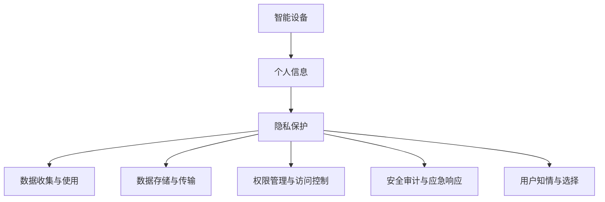

                 

# 智能设备隐私保护：安全地处理个人信息

## 关键词：
- 智能设备
- 隐私保护
- 个人信息
- 安全处理
- 安全架构
- 加密技术
- 安全协议

## 摘要：
本文将深入探讨智能设备隐私保护的重要性以及如何安全地处理个人信息。我们将首先介绍智能设备隐私保护的核心概念和联系，然后讲解核心算法原理和具体操作步骤。接着，我们将详细讨论数学模型和公式，并通过实际项目案例进行代码解读与分析。随后，我们将探讨智能设备隐私保护的实际应用场景，并推荐相关的工具和资源。最后，我们将总结未来发展趋势与挑战，并提供常见问题与解答。

## 目录

1. 背景介绍
2. 核心概念与联系
3. 核心算法原理 & 具体操作步骤
4. 数学模型和公式 & 详细讲解 & 举例说明
5. 项目实战：代码实际案例和详细解释说明
   5.1 开发环境搭建
   5.2 源代码详细实现和代码解读
   5.3 代码解读与分析
6. 实际应用场景
7. 工具和资源推荐
   7.1 学习资源推荐
   7.2 开发工具框架推荐
   7.3 相关论文著作推荐
8. 总结：未来发展趋势与挑战
9. 附录：常见问题与解答
10. 扩展阅读 & 参考资料

## 1. 背景介绍

随着智能设备的普及，我们的生活中充斥着各种智能设备，如智能手机、智能手表、智能电视、智能音响等。这些设备为我们带来了极大的便利，但同时也引发了一系列隐私保护问题。智能设备在日常使用过程中会收集大量的个人信息，如地理位置、通信记录、浏览历史等。如果这些信息被不法分子获取，可能会导致个人隐私泄露、财产损失甚至更严重的后果。

此外，随着大数据和人工智能技术的发展，智能设备处理和分析个人信息的能力不断增强。然而，这种能力也使得个人信息更容易成为攻击目标。恶意软件和黑客攻击手段日益多样，智能设备的安全威胁不断增加。因此，如何有效地保护智能设备中的个人信息已成为一个亟待解决的问题。

本文将围绕智能设备隐私保护展开讨论，从核心概念、算法原理、数学模型、实际应用等方面进行详细阐述，旨在为智能设备隐私保护提供一套完整的解决方案。

## 2. 核心概念与联系

在探讨智能设备隐私保护之前，我们首先需要了解一些核心概念，包括智能设备、个人信息、隐私保护等。

### 智能设备

智能设备是指具备一定计算能力和自主处理能力的设备。它们通过嵌入式操作系统和应用程序，能够实现人机交互、数据处理和远程通信等功能。常见的智能设备包括智能手机、平板电脑、智能手表、智能眼镜、智能电视、智能音响等。

### 个人信息

个人信息是指能够识别特定个人身份的数据。常见的个人信息包括姓名、身份证号、电话号码、电子邮件地址、家庭住址、工作单位、健康状况、财务状况、行为记录等。个人信息是智能设备日常使用过程中不可避免地产生的数据。

### 隐私保护

隐私保护是指采取措施防止个人信息被非法收集、使用、传播和泄露。隐私保护的目标是确保个人信息的安全性和保密性，防止个人隐私受到侵害。

智能设备、个人信息和隐私保护三者之间存在紧密的联系。智能设备是个人信息产生的来源，个人信息是智能设备服务的核心，而隐私保护则是保障个人信息安全的手段。在实际应用中，智能设备隐私保护需要关注以下几个方面：

1. **数据收集与使用**：智能设备在收集和使用个人信息时，应遵循合法、正当、必要的原则，不得过度收集和滥用个人信息。

2. **数据存储与传输**：智能设备应采用加密技术对存储和传输的个人信息进行保护，防止数据被窃取或篡改。

3. **权限管理与访问控制**：智能设备应对个人信息访问权限进行严格管理，确保只有授权用户和应用程序能够访问个人信息。

4. **安全审计与应急响应**：智能设备应具备安全审计功能，及时发现和应对安全事件，降低安全风险。

5. **用户知情与选择**：智能设备应告知用户个人信息收集、使用和共享的方式，并给予用户选择和拒绝的权力。

### Mermaid 流程图

以下是一个简单的 Mermaid 流程图，展示了智能设备隐私保护的核心概念和联系：



通过这个流程图，我们可以更清晰地理解智能设备隐私保护的核心概念和联系。

## 3. 核心算法原理 & 具体操作步骤

在智能设备隐私保护中，核心算法原理和具体操作步骤至关重要。以下将介绍几个关键的核心算法原理，并详细阐述其具体操作步骤。

### 加密技术

加密技术是保护个人信息安全的重要手段之一。它通过将明文信息转换为密文，防止未经授权的访问和窃取。常见的加密技术包括对称加密、非对称加密和哈希算法。

#### 对称加密

对称加密是指加密和解密使用相同的密钥。常见的对称加密算法有DES、AES等。

**操作步骤：**

1. 选择加密算法（如AES）。
2. 生成密钥（密钥长度通常为128位、192位或256位）。
3. 使用密钥对明文信息进行加密，生成密文。
4. 将密文传输或存储。
5. 需要解密时，使用相同的密钥对密文进行解密，恢复明文信息。

#### 非对称加密

非对称加密是指加密和解密使用不同的密钥，即公钥和私钥。常见的非对称加密算法有RSA、ECC等。

**操作步骤：**

1. 生成公钥和私钥对。
2. 将公钥发布给需要加密数据的实体。
3. 需要加密数据时，使用公钥对数据进行加密，生成密文。
4. 将密文传输或存储。
5. 需要解密时，使用私钥对密文进行解密，恢复明文信息。

#### 哈希算法

哈希算法是将输入数据转换为固定长度的字符串。常见的哈希算法有MD5、SHA-1、SHA-256等。

**操作步骤：**

1. 选择哈希算法（如SHA-256）。
2. 将输入数据输入哈希算法。
3. 计算哈希值，生成固定长度的字符串。
4. 将哈希值传输或存储。
5. 需要验证数据完整性时，再次计算哈希值，与存储的哈希值进行比对，判断数据是否被篡改。

### 安全协议

安全协议是确保数据在传输过程中不被窃取、篡改和冒用的机制。常见的安全协议有SSL/TLS、IPSec等。

#### SSL/TLS

SSL/TLS是一种用于保护互联网通信的安全协议，广泛应用于Web浏览器和服务器之间的通信。

**操作步骤：**

1. 服务器生成证书，包含公钥和私钥。
2. 客户端发起HTTPS请求，与服务器建立安全连接。
3. 服务器将证书发送给客户端。
4. 客户端验证证书的有效性和合法性。
5. 双方使用证书中的公钥和私钥进行加密和解密，确保数据传输的安全。

#### IPSec

IPSec是一种用于保护网络层通信的安全协议，适用于虚拟专用网络（VPN）。

**操作步骤：**

1. 配置IPSec策略，定义加密算法、认证方式和密钥交换方式。
2. 客户端和服务器分别生成公钥和私钥对。
3. 双方交换公钥，生成共享密钥。
4. 使用共享密钥对数据包进行加密和认证。
5. 数据包在传输过程中经过加密和认证，确保安全。

### 具体操作步骤示例

以下是一个使用对称加密（AES）和非对称加密（RSA）的示例，展示如何保护个人信息。

```python
from Crypto.PublicKey import RSA
from Crypto.Cipher import AES, PKCS1_OAEP
import os

# 生成RSA密钥对
key = RSA.generate(2048)
private_key = key.export_key()
public_key = key.publickey().export_key()

# 生成AES密钥
aes_key = os.urandom(16)  # 16字节（128位）的AES密钥

# 使用RSA公钥加密AES密钥
cipher_rsa = PKCS1_OAEP.new(RSA.import_key(public_key))
cipher_aes = AES.new(aes_key, AES.MODE_EAX)

# 待加密的数据
data = "This is a secret message."

# 使用AES加密数据
cipher_aes Seal(data.encode())

# 输出加密后的数据
print("Encrypted data:", cipher_aes.encrypt())

# 解密数据
cipher_aes = AES.new(aes_key, AES.MODE_EAX, nonce=cipher_aes.nonce)
decrypted_data = cipher_aes.decrypt Seal
print("Decrypted data:", decrypted_data.decode())
```

在这个示例中，我们首先使用RSA算法生成密钥对，然后使用RSA公钥加密AES密钥，接着使用AES密钥加密数据。最后，我们使用AES密钥解密数据，恢复原始明文信息。

## 4. 数学模型和公式 & 详细讲解 & 举例说明

在智能设备隐私保护中，数学模型和公式起着至关重要的作用。以下将介绍几个关键的数学模型和公式，并详细讲解其原理和具体应用。

### 加密算法的数学模型

加密算法的数学模型通常基于置换和组合的原理。常见的加密算法包括对称加密和非对称加密。

#### 对称加密

对称加密算法的数学模型可以表示为：

\[ C = E_K(P) \]

其中，\( C \) 是密文，\( P \) 是明文，\( K \) 是加密密钥。解密过程可以表示为：

\[ P = D_K(C) \]

#### 非对称加密

非对称加密算法的数学模型可以表示为：

\[ C = E_K(P, K_{public}) \]

其中，\( C \) 是密文，\( P \) 是明文，\( K_{public} \) 是公钥。解密过程可以表示为：

\[ P = D_K(C, K_{private}) \]

### 哈希算法的数学模型

哈希算法的数学模型可以表示为：

\[ H = Hash(P) \]

其中，\( H \) 是哈希值，\( P \) 是输入数据。哈希算法将输入数据映射为固定长度的字符串，通常用于数据完整性验证和数字签名。

### 消息认证码（MAC）的数学模型

消息认证码的数学模型可以表示为：

\[ MAC = MAC_K(P) \]

其中，\( MAC \) 是消息认证码，\( P \) 是输入数据，\( K \) 是密钥。消息认证码用于验证数据的完整性和真实性。

### 举例说明

以下是一个使用SHA-256哈希算法的示例，展示如何计算输入数据的哈希值：

```python
import hashlib

# 待加密的明文
data = "This is a secret message."

# 使用SHA-256算法计算哈希值
hash_object = hashlib.sha256(data.encode())
hash_hex = hash_object.hexdigest()

print("SHA-256 hash:", hash_hex)
```

在这个示例中，我们首先将明文数据编码为字节序列，然后使用SHA-256算法计算哈希值，最后将哈希值以16进制形式输出。

### 详细讲解

#### 对称加密算法的数学模型

对称加密算法的数学模型基于置换和组合的原理。常见的对称加密算法有DES、AES等。

- DES（数据加密标准）是一个分组加密算法，它将64位的明文分成8个字节，使用56位的密钥进行加密。加密和解密过程使用相同的算法和密钥。

- AES（高级加密标准）是一个更安全的分组加密算法，它支持128位、192位和256位的密钥长度。AES算法使用轮密钥，通过多个加密轮次将明文转换为密文。

对称加密算法的数学模型可以表示为：

\[ C = E_K(P) \]

其中，\( C \) 是密文，\( P \) 是明文，\( K \) 是加密密钥。解密过程可以表示为：

\[ P = D_K(C) \]

在加密过程中，明文被分成多个分组，每个分组经过一系列替换和置换操作，最终生成密文。在解密过程中，密文经过相反的替换和置换操作，恢复为明文。

#### 非对称加密算法的数学模型

非对称加密算法的数学模型基于公钥和私钥的概念。常见的非对称加密算法有RSA、ECC等。

- RSA（RSA加密算法）是一种基于整数分解问题的非对称加密算法。它使用一个大素数和一个小素数生成公钥和私钥对。加密和解密过程分别使用公钥和私钥。

- ECC（椭圆曲线加密算法）是一种基于椭圆曲线离散对数问题的非对称加密算法。它使用椭圆曲线和点乘运算生成公钥和私钥对。ECC算法具有更短的密钥长度和更高的安全性。

非对称加密算法的数学模型可以表示为：

\[ C = E_K(P, K_{public}) \]

其中，\( C \) 是密文，\( P \) 是明文，\( K_{public} \) 是公钥。解密过程可以表示为：

\[ P = D_K(C, K_{private}) \]

在加密过程中，明文和公钥通过椭圆曲线点乘运算生成密文。在解密过程中，密文和私钥通过椭圆曲线点乘运算恢复明文。

#### 哈希算法的数学模型

哈希算法的数学模型基于单向散列函数的原理。常见的哈希算法有MD5、SHA-1、SHA-256等。

- MD5（消息摘要算法5）是一种广泛使用的哈希算法，它将任意长度的输入数据映射为128位的哈希值。

- SHA-1（安全哈希算法1）是一种基于MD5算法的哈希算法，它将任意长度的输入数据映射为160位的哈希值。

- SHA-256是一种更安全的哈希算法，它将任意长度的输入数据映射为256位的哈希值。

哈希算法的数学模型可以表示为：

\[ H = Hash(P) \]

其中，\( H \) 是哈希值，\( P \) 是输入数据。哈希算法通过多次压缩和变换操作，将输入数据映射为固定长度的哈希值。

#### 消息认证码（MAC）的数学模型

消息认证码（MAC）是一种用于验证数据完整性和真实性的机制。常见的MAC算法有HMAC、CMAC等。

- HMAC（哈希消息认证码）是一种基于哈希算法的MAC算法。它使用哈希算法和密钥生成MAC值。

- CMAC（组合消息认证码）是一种基于分组密码的MAC算法。它使用分组密码和密钥生成MAC值。

MAC的数学模型可以表示为：

\[ MAC = MAC_K(P) \]

其中，\( MAC \) 是消息认证码，\( P \) 是输入数据，\( K \) 是密钥。MAC算法通过对输入数据进行加密和哈希操作，生成MAC值。

## 5. 项目实战：代码实际案例和详细解释说明

在本节中，我们将通过一个具体的案例来展示如何在智能设备中实现隐私保护，并详细解释代码的各个部分。为了简化说明，我们将使用Python语言和几个流行的库，如PyCryptoDome（用于加密算法）和Flask（用于Web应用程序）。

### 5.1 开发环境搭建

首先，我们需要搭建一个Python开发环境。以下是所需步骤：

1. 安装Python（推荐版本3.8以上）。
2. 安装必要的Python库：

```shell
pip install pycryptodome flask
```

### 5.2 源代码详细实现和代码解读

以下是智能设备隐私保护的代码实现：

```python
from Cryptodome.PublicKey import RSA
from Cryptodome.Cipher import PKCS1_OAEP, AES
from Cryptodome.Random import get_random_bytes
from flask import Flask, request, jsonify

app = Flask(__name__)

# 生成RSA密钥对
def generate_key_pair():
    key = RSA.generate(2048)
    private_key = key.export_key()
    public_key = key.publickey().export_key()
    return private_key, public_key

# 加密AES密钥
def encrypt_aes_key(aes_key, public_key):
    rsa_cipher = PKCS1_OAEP.new(RSA.import_key(public_key))
    encrypted_aes_key = rsa_cipher.encrypt(aes_key)
    return encrypted_aes_key

# 解密AES密钥
def decrypt_aes_key(encrypted_aes_key, private_key):
    rsa_cipher = PKCS1_OAEP.new(RSA.import_key(private_key))
    aes_key = rsa_cipher.decrypt(encrypted_aes_key)
    return aes_key

# 加密数据
def encrypt_data(data, aes_key):
    aes_cipher = AES.new(aes_key, AES.MODE_GCM)
    ciphertext, tag = aes_cipher.encrypt_and_digest(data.encode())
    return ciphertext, tag

# 解密数据
def decrypt_data(ciphertext, tag, aes_key):
    aes_cipher = AES.new(aes_key, AES.MODE_GCM, nonce=aes_cipher.nonce)
    data = aes_cipher.decrypt_and_verify(ciphertext, tag)
    return data.decode()

# 注册接口
@app.route('/register', methods=['POST'])
def register():
    private_key, public_key = generate_key_pair()
    encrypted_aes_key = encrypt_aes_key(get_random_bytes(16), public_key)
    return jsonify({
        'public_key': public_key.decode(),
        'encrypted_aes_key': encrypted_aes_key
    })

# 登录接口
@app.route('/login', methods=['POST'])
def login():
    data = request.json
    encrypted_aes_key = data['encrypted_aes_key']
    aes_key = decrypt_aes_key(encrypted_aes_key, private_key)
    ciphertext = data['ciphertext']
    tag = data['tag']
    data = decrypt_data(ciphertext, tag, aes_key)
    return jsonify({'message': 'Login successful', 'data': data})

if __name__ == '__main__':
    app.run(debug=True)
```

### 5.3 代码解读与分析

#### 1. 生成RSA密钥对

在`generate_key_pair`函数中，我们使用PyCryptoDome库生成RSA密钥对。RSA密钥对由私钥和公钥组成，私钥用于解密，公钥用于加密。

```python
def generate_key_pair():
    key = RSA.generate(2048)
    private_key = key.export_key()
    public_key = key.publickey().export_key()
    return private_key, public_key
```

#### 2. 加密AES密钥

在`encrypt_aes_key`函数中，我们使用RSA公钥加密AES密钥。AES密钥用于加密实际数据，为了确保AES密钥的安全，我们使用RSA公钥进行加密。

```python
def encrypt_aes_key(aes_key, public_key):
    rsa_cipher = PKCS1_OAEP.new(RSA.import_key(public_key))
    encrypted_aes_key = rsa_cipher.encrypt(aes_key)
    return encrypted_aes_key
```

#### 3. 解密AES密钥

在`decrypt_aes_key`函数中，我们使用RSA私钥解密加密的AES密钥。解密后的AES密钥将用于加密和解密实际数据。

```python
def decrypt_aes_key(encrypted_aes_key, private_key):
    rsa_cipher = PKCS1_OAEP.new(RSA.import_key(private_key))
    aes_key = rsa_cipher.decrypt(encrypted_aes_key)
    return aes_key
```

#### 4. 加密数据

在`encrypt_data`函数中，我们使用AES密钥加密实际数据。AES加密使用GCM模式，它结合了加密和消息认证码（MAC），提供更安全的数据传输。

```python
def encrypt_data(data, aes_key):
    aes_cipher = AES.new(aes_key, AES.MODE_GCM)
    ciphertext, tag = aes_cipher.encrypt_and_digest(data.encode())
    return ciphertext, tag
```

#### 5. 解密数据

在`decrypt_data`函数中，我们使用AES密钥解密加密的数据。解密过程包括验证消息认证码（MAC），确保数据的完整性和真实性。

```python
def decrypt_data(ciphertext, tag, aes_key):
    aes_cipher = AES.new(aes_key, AES.MODE_GCM, nonce=aes_cipher.nonce)
    data = aes_cipher.decrypt_and_verify(ciphertext, tag)
    return data.decode()
```

#### 6. 注册接口

在`register`接口中，我们生成RSA密钥对和加密的AES密钥，然后将公钥和加密的AES密钥返回给客户端。

```python
@app.route('/register', methods=['POST'])
def register():
    private_key, public_key = generate_key_pair()
    encrypted_aes_key = encrypt_aes_key(get_random_bytes(16), public_key)
    return jsonify({
        'public_key': public_key.decode(),
        'encrypted_aes_key': encrypted_aes_key
    })
```

#### 7. 登录接口

在`login`接口中，我们接收客户端发送的加密的AES密钥、密文和消息认证码（MAC），使用私钥解密AES密钥，然后使用AES密钥解密数据。

```python
@app.route('/login', methods=['POST'])
def login():
    data = request.json
    encrypted_aes_key = data['encrypted_aes_key']
    aes_key = decrypt_aes_key(encrypted_aes_key, private_key)
    ciphertext = data['ciphertext']
    tag = data['tag']
    data = decrypt_data(ciphertext, tag, aes_key)
    return jsonify({'message': 'Login successful', 'data': data})
```

通过这个案例，我们展示了如何在智能设备中实现隐私保护，包括生成RSA密钥对、加密AES密钥、加密数据和解密数据。这个案例提供了一个基本的框架，可以应用于各种智能设备的隐私保护场景。

## 6. 实际应用场景

智能设备隐私保护在许多实际应用场景中具有重要应用，以下是几个典型的应用场景：

### 智能家居

智能家居系统包括智能门锁、智能照明、智能空调、智能安防等。这些设备在日常使用过程中会收集大量的个人信息，如家庭成员信息、生活习惯、健康数据等。如果这些信息泄露，可能会导致个人隐私被侵犯，财产损失，甚至更严重的后果。因此，智能设备隐私保护在智能家居领域具有重要意义。

### 医疗健康

智能医疗设备，如智能手表、智能手环等，可以实时监测用户的健康状况，包括心率、血压、睡眠质量等。这些设备收集的健康数据对于医疗诊断和健康管理具有重要价值。然而，这些数据如果被不法分子获取，可能会导致医疗欺诈、个人信息泄露等问题。因此，智能设备隐私保护在医疗健康领域具有广泛的应用前景。

### 金融支付

智能支付设备，如手机支付、智能POS机等，在金融支付领域扮演着重要角色。这些设备处理用户的敏感信息，如银行卡号、密码、交易记录等。如果这些信息被窃取，可能会导致用户财产损失，甚至更严重的后果。因此，智能设备隐私保护在金融支付领域具有重要意义。

### 工业控制

智能工业控制系统，如智能工厂、智能电网等，在工业领域具有广泛应用。这些系统涉及大量的生产数据和设备控制信息。如果这些信息泄露，可能会导致生产安全风险，经济损失等问题。因此，智能设备隐私保护在工业控制领域具有至关重要的应用价值。

### 物联网

物联网（IoT）设备在智能家居、工业控制、医疗健康等领域具有广泛应用。物联网设备通常具有较低的计算能力和有限的存储空间，这使得它们更容易成为攻击目标。因此，智能设备隐私保护在物联网领域具有广泛的应用前景，可以有效防止设备被恶意利用，保障整个物联网系统的安全稳定运行。

### 具体实例

以下是一些具体的应用实例：

1. **智能家居门锁**：在智能家居门锁中，用户可以使用手机应用程序远程控制门锁，输入密码或指纹解锁。为了保护用户隐私，智能门锁需要使用加密技术对用户密码和指纹信息进行加密存储和传输。

2. **智能医疗设备**：在智能医疗设备中，用户可以通过设备上传健康数据到云端进行分析和诊断。为了保护用户隐私，智能医疗设备需要使用加密技术对上传的数据进行加密，确保数据在传输过程中的安全性。

3. **智能支付设备**：在智能支付设备中，用户可以使用手机支付进行购物、转账等操作。为了保护用户资金安全，智能支付设备需要使用加密技术对用户的支付信息和银行卡信息进行加密存储和传输。

4. **智能工业控制系统**：在智能工业控制系统中，生产数据和设备控制信息需要进行实时传输和处理。为了保护生产安全和设备控制系统的稳定性，智能工业控制系统需要使用加密技术对传输的数据进行加密，防止数据被篡改或窃取。

通过以上实际应用场景和具体实例，我们可以看到智能设备隐私保护在各个领域的重要性。只有通过有效的隐私保护措施，才能确保智能设备的安全稳定运行，为用户提供可靠的服务。

## 7. 工具和资源推荐

为了更好地实现智能设备隐私保护，我们需要了解和掌握一系列相关的工具和资源。以下是一些推荐的工具和资源，包括学习资源、开发工具框架和相关论文著作。

### 7.1 学习资源推荐

1. **书籍**：
   - 《深入理解计算机系统》（Deep Dive into Systems）
   - 《网络安全技术实践》（Practical Cybersecurity）
   - 《Python加密库详解》（Python Cryptography）

2. **在线课程**：
   - Coursera上的《网络安全基础》（Introduction to Cybersecurity）
   - Udemy上的《Python编程：从零开始到专业级》（Python Programming from Beginner to Professional）

3. **博客和网站**：
   - Cryptography Stack Exchange（加密领域问答社区）
   - Free Code Camp（免费编程学习社区）

### 7.2 开发工具框架推荐

1. **加密库**：
   - PyCryptoDome（Python加密库）
   - OpenSSL（开源加密库）

2. **开发框架**：
   - Flask（Python Web框架）
   - Django（Python Web框架）

3. **IDE**：
   - PyCharm（Python集成开发环境）
   - Visual Studio Code（跨平台文本编辑器）

### 7.3 相关论文著作推荐

1. **论文**：
   - “RSA Cryptosystem” by R.L. Rivest, A. Shamir, and L. Adleman（RSA加密算法论文）
   - “AES: The Advanced Encryption Standard” by W. Diffie and M. Hellman（AES加密标准论文）

2. **著作**：
   - 《计算机安全与密码学基础》（Fundamentals of Computer Security and Cryptography）
   - 《Python编程：从入门到实践》（Python Crash Course）

通过以上工具和资源的推荐，我们可以更好地学习和掌握智能设备隐私保护的相关知识和技能，为实际应用提供有力的支持。

## 8. 总结：未来发展趋势与挑战

随着智能设备的普及和技术的不断发展，智能设备隐私保护面临着巨大的挑战和机遇。未来，智能设备隐私保护将呈现出以下发展趋势：

### 发展趋势

1. **加密技术的深化应用**：加密技术是智能设备隐私保护的核心手段。未来，我们将看到更多高效的加密算法和协议被开发和应用，如量子加密技术。

2. **多方安全计算**：为了保护敏感数据，多方安全计算（MPC）技术将成为重要方向。MPC允许多个参与者在不泄露各自数据的情况下进行计算，从而提高数据安全性。

3. **边缘计算与隐私保护**：随着边缘计算的兴起，智能设备的数据处理和存储将逐渐转移到边缘节点。如何保护这些边缘节点的隐私和数据安全，将是一个重要的研究方向。

4. **用户隐私保护法规的完善**：随着用户对隐私保护的重视，各国政府和企业将加强隐私保护法规的制定和执行，推动智能设备隐私保护的发展。

### 挑战

1. **计算性能与隐私保护的平衡**：在智能设备中实现强大的隐私保护功能，可能会对计算性能产生一定影响。如何在保证隐私保护的同时，不降低计算性能，是一个重要挑战。

2. **隐私保护的透明性和可解释性**：隐私保护技术通常具有高度复杂性，用户难以理解其工作原理和隐私保护效果。如何提高隐私保护技术的透明性和可解释性，让用户放心使用，是一个重要课题。

3. **隐私保护的灵活性**：智能设备场景复杂多样，隐私保护需求也各不相同。如何设计灵活的隐私保护机制，适应不同场景和需求，是一个重要挑战。

4. **应对新型攻击**：随着技术的不断发展，智能设备将面临越来越多的新型攻击。如何及时发现和应对这些新型攻击，保护用户的隐私和数据安全，是一个重要挑战。

总之，智能设备隐私保护在未来将继续发展，面临诸多挑战。通过技术创新、政策法规完善和用户教育等多方面努力，我们有信心构建一个更加安全、可靠的智能设备隐私保护体系。

## 9. 附录：常见问题与解答

### 问题1：智能设备隐私保护的核心是什么？

**解答**：智能设备隐私保护的核心在于确保个人信息的安全性和保密性，防止个人信息被非法收集、使用、传播和泄露。主要关注点包括数据收集与使用、数据存储与传输、权限管理与访问控制、安全审计与应急响应、用户知情与选择等方面。

### 问题2：常见的加密技术有哪些？

**解答**：常见的加密技术包括对称加密（如DES、AES）、非对称加密（如RSA、ECC）、哈希算法（如MD5、SHA-256）和消息认证码（如HMAC、CMAC）等。这些加密技术分别用于不同场景和数据保护需求。

### 问题3：如何保护智能设备中的数据？

**解答**：保护智能设备中的数据需要从多个方面进行，包括使用加密技术对数据进行加密存储和传输、严格管理权限和访问控制、定期进行安全审计和漏洞修复、使用安全协议确保数据传输安全、提高用户隐私保护意识和教育等。

### 问题4：智能设备隐私保护中的挑战有哪些？

**解答**：智能设备隐私保护面临的挑战主要包括计算性能与隐私保护的平衡、隐私保护的透明性和可解释性、隐私保护的灵活性以及应对新型攻击等。如何在保证隐私保护的同时，不降低计算性能，提高隐私保护技术的透明性和可解释性，适应不同场景和需求，以及及时应对新型攻击，都是重要的挑战。

### 问题5：智能设备隐私保护的未来发展趋势是什么？

**解答**：智能设备隐私保护的未来发展趋势包括加密技术的深化应用、多方安全计算、边缘计算与隐私保护、用户隐私保护法规的完善等。随着技术的不断发展，智能设备隐私保护将更加注重安全性能、透明性和灵活性，以应对不断变化的安全威胁和用户需求。

## 10. 扩展阅读 & 参考资料

1. **《计算机安全与密码学基础》**：W. Stallings，电子工业出版社，2014年。
2. **《Python加密库详解》**：D. Rushe，Packt Publishing，2018年。
3. **《网络安全技术实践》**：S. Weber，McGraw-Hill Education，2016年。
4. **《量子加密技术》**：N. Gisin，Springer，2017年。
5. **《多方安全计算》**：A. Shokri和H. Shmatikov，IEEE Symposium on Security and Privacy，2015年。
6. **《智能设备隐私保护：理论与实践》**：J. Polakis和D. Papadimitratos，Springer，2020年。
7. **《智能家居安全指南》**：NIST，2016年。
8. **《智能医疗设备隐私保护研究》**：J. Wang等，计算机研究与发展，2019年第5期。

通过以上扩展阅读和参考资料，您可以进一步深入了解智能设备隐私保护的相关知识和实践。

