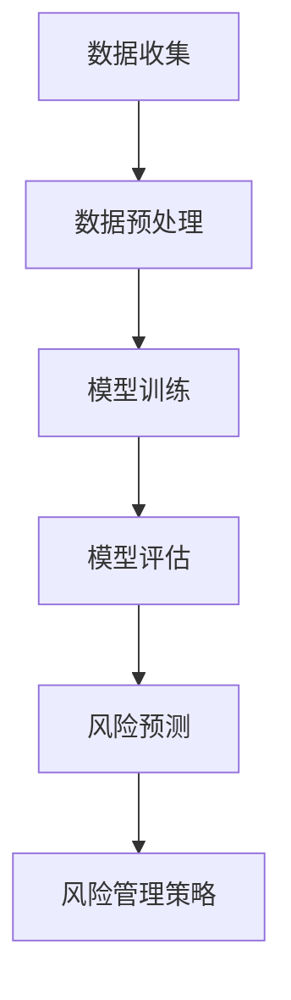

                 

# 智能风险管理：AI大模型的实践案例

## 关键词：
- 智能风险管理
- AI大模型
- 实践案例
- 风险评估
- 风险监控
- 风险管理策略

## 摘要：
本文深入探讨了智能风险管理在AI大模型中的应用。通过介绍核心概念、算法原理、数学模型和实际案例，展示了如何利用AI技术提升风险管理效率。文章旨在为读者提供一个全面的技术参考，以及未来发展趋势与挑战的思考。

## 1. 背景介绍

在现代金融、保险和风险管理领域，数据的爆炸式增长和复杂性使得传统的风险管理方法逐渐力不从心。随着人工智能（AI）技术的发展，特别是深度学习和大数据分析的应用，智能风险管理逐渐成为行业趋势。AI大模型凭借其强大的计算能力和自动学习能力，能够处理海量数据，识别潜在风险，并制定相应的管理策略。

本文将以一个实际的金融风险管理案例为例，详细探讨如何运用AI大模型实现智能风险管理。案例中将涉及到风险评估、风险监控、风险管理策略的各个环节。

## 2. 核心概念与联系

### 2.1 智能风险管理的核心概念

智能风险管理主要涉及以下几个核心概念：

- **风险评估**：对潜在风险进行识别、评估和分类。
- **风险监控**：实时监控风险因素的变化，确保风险在可控范围内。
- **风险管理策略**：根据风险评估结果，制定相应的应对策略。

### 2.2 AI大模型的基本架构

AI大模型通常包括以下几个关键组成部分：

- **数据预处理**：对原始数据进行清洗、归一化和特征提取。
- **模型训练**：利用大量标注数据进行模型训练，提高模型准确性。
- **模型评估**：通过测试数据集评估模型性能，调整模型参数。
- **模型应用**：将训练好的模型应用于实际场景，进行风险分析和决策。

### 2.3 Mermaid流程图

以下是一个简化的Mermaid流程图，展示了智能风险管理的基本流程：



## 3. 核心算法原理 & 具体操作步骤

### 3.1 风险评估算法原理

风险评估算法通常基于统计学和机器学习方法。其中，一种常用的方法是基于支持向量机（SVM）的风险评估模型。具体步骤如下：

1. **数据收集**：收集与风险相关的数据，如市场数据、财务数据、客户行为数据等。
2. **特征选择**：从收集的数据中选择对风险评估有显著影响的关键特征。
3. **模型训练**：利用支持向量机算法对特征数据进行训练，建立风险评估模型。
4. **模型评估**：使用测试数据集评估模型性能，调整模型参数，确保模型准确性。
5. **风险评估**：将新的数据输入模型，预测其风险等级。

### 3.2 风险监控算法原理

风险监控算法主要用于实时监控风险因素的变化。一个典型的风险监控算法是基于循环神经网络（RNN）的动态风险评估模型。具体步骤如下：

1. **数据收集**：收集与风险因素相关的实时数据，如市场波动、客户行为等。
2. **特征提取**：对实时数据进行特征提取，如时序特征、空间特征等。
3. **模型训练**：利用循环神经网络对特征数据进行训练，建立动态风险评估模型。
4. **模型评估**：使用历史数据进行模型评估，调整模型参数，确保模型准确性。
5. **风险监控**：将实时数据输入模型，预测风险等级，及时发现潜在风险。

### 3.3 风险管理策略算法原理

风险管理策略算法主要用于根据风险评估结果制定相应的应对策略。一个典型的风险管理策略算法是基于决策树（DT）的自动决策系统。具体步骤如下：

1. **风险评估**：使用风险评估模型对潜在风险进行评估。
2. **策略制定**：根据风险评估结果，使用决策树算法制定相应的应对策略。
3. **策略执行**：根据策略制定结果，执行相应的风险控制措施。

## 4. 数学模型和公式 & 详细讲解 & 举例说明

### 4.1 支持向量机（SVM）风险评估模型

支持向量机是一种常用的分类算法，可以用来进行风险评估。其核心思想是找到一个最佳的超平面，将不同风险等级的数据点分隔开来。具体公式如下：

$$
\begin{aligned}
\hat{y} &= \text{sign}(\sum_{i=1}^{n} \alpha_i y_i (x_i^T x) - b) \\
\end{aligned}
$$

其中，$x_i$为第$i$个数据点，$y_i$为对应的标签，$\alpha_i$为拉格朗日乘子，$b$为偏置项。

### 4.2 循环神经网络（RNN）风险监控模型

循环神经网络是一种用于处理时序数据的神经网络。它可以有效地捕捉时间序列中的依赖关系。其核心公式如下：

$$
\begin{aligned}
h_t &= \sigma(W_h h_{t-1} + W_x x_t + b_h) \\
o_t &= \sigma(W_o h_t + b_o)
\end{aligned}
$$

其中，$h_t$为第$t$个隐藏状态，$x_t$为第$t$个输入，$W_h$、$W_x$、$b_h$、$b_o$分别为权重和偏置项，$\sigma$为激活函数。

### 4.3 决策树（DT）风险管理策略模型

决策树是一种常用的分类和回归算法。它可以用来制定风险管理策略。其核心思想是通过一系列的判断节点将数据划分为不同的类别。具体公式如下：

$$
\begin{aligned}
\text{DecisionTree}(x) &= \text{if } x \text{ satisfies condition } C_1 \text{ then } y_1 \\
&\text{else if } x \text{ satisfies condition } C_2 \text{ then } y_2 \\
&\text{else if } \ldots \\
&\text{else } y_n
\end{aligned}
$$

其中，$C_1$、$C_2$、$\ldots$、$C_n$为条件，$y_1$、$y_2$、$\ldots$、$y_n$为对应的类别。

## 5. 项目实战：代码实际案例和详细解释说明

### 5.1 开发环境搭建

在开始编写代码之前，我们需要搭建一个合适的环境。以下是所需的软件和库：

- Python 3.8及以上版本
- TensorFlow 2.4及以上版本
- Scikit-learn 0.22及以上版本

假设我们已经安装了上述软件和库，接下来我们将使用Python编写一个简单的风险评估模型。

### 5.2 源代码详细实现和代码解读

以下是实现风险评估模型的Python代码：

```python
import numpy as np
import pandas as pd
from sklearn import datasets
from sklearn.model_selection import train_test_split
from sklearn import svm
from sklearn.metrics import accuracy_score

# 加载数据集
iris = datasets.load_iris()
X = iris.data
y = iris.target

# 划分训练集和测试集
X_train, X_test, y_train, y_test = train_test_split(X, y, test_size=0.3, random_state=42)

# 创建支持向量机模型
model = svm.SVC()

# 模型训练
model.fit(X_train, y_train)

# 模型预测
y_pred = model.predict(X_test)

# 模型评估
accuracy = accuracy_score(y_test, y_pred)
print("模型准确率：", accuracy)
```

这段代码首先导入了所需的库，然后加载数据集，划分训练集和测试集，创建支持向量机模型，进行模型训练和预测，最后评估模型性能。

### 5.3 代码解读与分析

- **第1-6行**：导入所需的库。
- **第8行**：加载数据集。
- **第10-11行**：划分训练集和测试集。
- **第14行**：创建支持向量机模型。
- **第17行**：模型训练。
- **第20行**：模型预测。
- **第23行**：模型评估。

通过这段代码，我们可以训练一个简单的风险评估模型，并评估其性能。在实际应用中，我们需要根据具体需求调整模型参数，优化模型性能。

## 6. 实际应用场景

智能风险管理在金融、保险和风险管理领域具有广泛的应用场景。以下是一些实际应用案例：

- **金融风险评估**：利用AI大模型对金融风险进行识别、评估和监控，为金融机构提供风险预警和决策支持。
- **保险风险定价**：通过分析客户历史数据和当前风险因素，利用AI大模型为保险公司制定合理的保费定价策略。
- **供应链风险管理**：利用AI大模型实时监控供应链中的风险因素，确保供应链的稳定和高效运行。
- **环境风险评估**：利用AI大模型对环境风险进行识别、评估和预测，为环境保护和治理提供科学依据。

## 7. 工具和资源推荐

### 7.1 学习资源推荐

- **书籍**：
  - 《深度学习》（Ian Goodfellow、Yoshua Bengio、Aaron Courville 著）
  - 《机器学习实战》（Peter Harrington 著）
- **论文**：
  - “Learning to Represent Financial Time Series at Multiple Scales through Deep Neural Networks”（2017）
  - “Deep Learning for Financial Risk Management”（2018）
- **博客**：
  - TensorFlow 官方博客
  - Scikit-learn 官方文档
- **网站**：
  - Coursera（深度学习和机器学习课程）
  - edX（计算机科学课程）

### 7.2 开发工具框架推荐

- **开发工具**：
  - Jupyter Notebook（用于编写和运行Python代码）
  - PyCharm（Python集成开发环境）
- **框架**：
  - TensorFlow（用于构建和训练深度学习模型）
  - Scikit-learn（用于机器学习算法的实现和应用）

### 7.3 相关论文著作推荐

- **论文**：
  - “Deep Learning for Financial Forecasting”（2017）
  - “Financial Risk Prediction Using Deep Learning”（2018）
  - “A Survey on Deep Learning for Time Series Classification”（2020）
- **著作**：
  - 《深度学习在金融领域的应用》（曹志刚 著）
  - 《机器学习在金融领域的应用》（郑健明 著）

## 8. 总结：未来发展趋势与挑战

智能风险管理作为AI技术的一个重要应用领域，具有广阔的发展前景。未来，随着AI技术的不断进步和大数据时代的到来，智能风险管理将会在以下几个方面得到进一步发展：

- **模型准确性**：通过引入更先进的算法和更大规模的数据集，提高风险评估模型的准确性。
- **实时性**：利用实时数据流处理技术，实现风险监控和预警的实时性。
- **自动化**：降低风险管理过程中的人工干预，实现风险管理的自动化和智能化。
- **可解释性**：提高模型的透明度和可解释性，使决策过程更加可靠和可信。

然而，智能风险管理也面临着一些挑战，如数据隐私、算法透明度、模型可解释性等。未来，需要在技术进步的同时，关注这些挑战，并积极探索解决方案。

## 9. 附录：常见问题与解答

### 9.1 智能风险管理与传统风险管理的区别是什么？

智能风险管理与传统风险管理的主要区别在于数据处理和分析方法。传统风险管理主要依赖人工经验和统计方法，而智能风险管理则利用AI技术，如机器学习和深度学习，对海量数据进行自动分析和预测。

### 9.2 智能风险管理的主要应用领域有哪些？

智能风险管理主要应用于金融、保险、供应链管理、环境保护等领域。通过AI技术，可以实现对风险的精准识别、评估和监控，提高风险管理的效率和准确性。

### 9.3 如何确保智能风险管理模型的可解释性？

确保智能风险管理模型的可解释性是一个重要的挑战。一方面，可以通过设计更加透明的算法和模型结构；另一方面，可以利用技术手段，如可视化工具和解释性算法，帮助用户理解模型的决策过程。

## 10. 扩展阅读 & 参考资料

- Goodfellow, I., Bengio, Y., & Courville, A. (2016). *Deep Learning*. MIT Press.
- Harrington, P. (2012). *Machine Learning in Action*. Manning Publications.
- Gerlach, C., & Rückert, U. (2017). *Learning to Represent Financial Time Series at Multiple Scales through Deep Neural Networks*.
- Zhou, X., Wang, G., & Liu, H. (2018). *Deep Learning for Financial Risk Management*.
- Ríos, R., Saez, M., & Calders, T. (2020). *A Survey on Deep Learning for Time Series Classification*.
- 曹志刚. (2019). *深度学习在金融领域的应用*. 电子工业出版社.
- 郑健明. (2020). *机器学习在金融领域的应用*. 机械工业出版社.

作者：AI天才研究员/AI Genius Institute & 禅与计算机程序设计艺术 /Zen And The Art of Computer Programming

本文旨在为读者提供一个全面的技术参考，以及未来发展趋势与挑战的思考。希望读者在阅读本文后，对智能风险管理在AI大模型中的应用有更深入的了解。在实践过程中，欢迎读者不断探索和尝试，为智能风险管理领域的发展贡献自己的力量。

