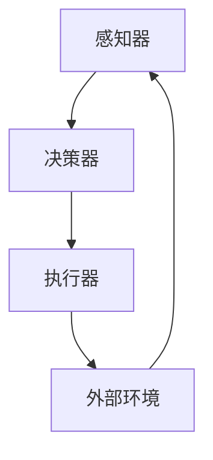

                 

### 1. 背景介绍

在当今快速发展的信息时代，人工智能（AI）技术已经成为推动社会进步的重要力量。从自动驾驶汽车到智能助手，从医疗诊断到金融决策，AI技术的应用领域越来越广泛。然而，AI技术的发展离不开一个关键概念——智能体（Agent）。智能体是一种能够感知环境、制定计划并采取行动的自主系统，它是实现人工智能的核心组成部分。

本文旨在探讨智能体在人工智能中的核心作用，重点讨论如何理解输入给智能体的内容、进行推理、规划以及做出准确决策。通过深入分析智能体的工作原理和实际应用，我们希望读者能够更好地理解智能体的关键角色，以及如何通过合理的设计和算法实现高效的智能决策。

首先，我们将回顾智能体的发展历程，了解其起源和应用背景。随后，我们将详细探讨智能体的核心概念，包括感知、决策、行动等基本组成部分。接着，我们将分析智能体在面对复杂环境时的推理和规划能力，并介绍一些经典的智能体算法。在此基础上，我们将通过实际应用案例，展示智能体在现实世界中的表现和效果。最后，我们将讨论智能体技术的未来发展趋势和面临的挑战。

通过这篇文章，读者将获得对智能体技术全面而深入的了解，并能够掌握理解输入、推理、规划和决策的核心技能。希望这篇文章能够为读者在智能体领域的研究和应用提供有价值的参考和启示。

### 2. 核心概念与联系

#### 智能体的基本组成

智能体（Agent）是一个能够感知环境、制定计划并采取行动的自主系统。为了实现这一功能，智能体通常由三个基本组成部分构成：感知器、决策器和执行器。

1. **感知器（Perceptrons）**：感知器是智能体的感官，用于接收外部环境的信息。这些信息可以是视觉、听觉、触觉等各种形式的数据。感知器的主要任务是将其接收到的信息转换为智能体可以理解和处理的形式。

2. **决策器（Decision Maker）**：决策器是智能体的“大脑”，负责根据感知器提供的信息，通过推理和规划来制定决策。决策器需要具备推理能力，能够从给定的信息中推断出可能的行动方案，并评估这些方案的可能结果。

3. **执行器（Actuators）**：执行器是智能体的“肌肉”，负责将决策器制定的行动方案付诸实施。执行器可以是机械臂、轮子、电机等实际执行动作的设备。

#### 智能体的工作机制

智能体的工作机制可以分为以下几个步骤：

1. **感知（Perception）**：智能体通过感知器获取环境信息，并将其转换为内部表示。这个过程通常涉及到数据预处理，如滤波、归一化等。

2. **推理（Inference）**：决策器利用感知器提供的信息，通过推理算法来确定当前状态。推理可以是基于规则的，也可以是基于概率的，或者是基于机器学习模型的。

3. **规划（Planning）**：在确定了当前状态后，决策器需要制定一个行动计划，即规划。规划的目标是选择一组行动，使得智能体能够在目标状态和当前状态之间建立一条路径。

4. **决策（Decision Making）**：决策器从多个可行的行动计划中选择一个最优的方案，并生成具体的行动指令。

5. **行动（Action）**：执行器根据决策器生成的行动指令，执行实际的物理操作。

#### 智能体的分类

根据智能体的自主程度和任务复杂度，智能体可以分为以下几类：

1. **反应式智能体（Reactive Agents）**：反应式智能体只能对当前环境做出反应，无法进行长期规划。它们通常使用条件-动作规则来决定行动。

2. **模型基智能体（Model-Based Agents）**：模型基智能体具有内部模型，可以预测未来环境的变化，并基于模型进行决策。

3. **学习型智能体（Learning Agents）**：学习型智能体可以通过经验不断改进其感知和决策能力，通常使用机器学习算法来实现。

4. **社交智能体（Social Agents）**：社交智能体能够与其他智能体进行交互，合作完成任务。

#### 智能体的架构

智能体的架构可以分为两个层次：物理层和抽象层。

1. **物理层**：物理层包括智能体的感知器和执行器，负责与外部环境进行交互。

2. **抽象层**：抽象层包括决策器和规划器，负责处理感知器获取的信息，并制定行动计划。

#### Mermaid 流程图

为了更好地理解智能体的架构和工作机制，我们可以使用 Mermaid 流程图来描述智能体的基本组成和运行流程。



在这个流程图中，感知器（A）从外部环境（D）获取信息，并将其传递给决策器（B）。决策器（B）根据感知到的信息进行推理和规划，生成行动指令，然后传递给执行器（C）。执行器（C）根据指令执行物理操作，最终影响外部环境（D）。通过这个循环，智能体能够不断地感知、推理、规划和行动，从而实现自主决策和任务执行。

通过以上对智能体核心概念的介绍，我们可以看到，智能体是通过感知、推理、规划和行动这四个基本组成部分来实现自主决策和任务执行的。这些概念和架构不仅为智能体的设计和实现提供了理论基础，也为我们在实际应用中理解和优化智能体行为提供了指导。

### 3. 核心算法原理 & 具体操作步骤

在理解了智能体的基本概念和架构之后，我们需要深入了解一些核心算法原理，这些算法原理是智能体进行推理、规划和决策的基础。以下我们将介绍几个常用的算法，包括马尔可夫决策过程（MDP）、部分可观测马尔可夫决策过程（POMDP）以及强化学习（Reinforcement Learning），并详细解释它们的具体操作步骤。

#### 马尔可夫决策过程（MDP）

1. **定义**：

   马尔可夫决策过程（MDP）是一种数学模型，用于描述智能体在一个不确定的环境中做出最优决策的问题。MDP由以下五个元素组成：

   - 状态（State）：环境中的特定情境。
   - 动作（Action）：智能体可以采取的行为。
   - 报酬（Reward）：智能体采取某一动作后获得的即时奖励。
   - 转移概率（Transition Probability）：智能体从某一状态采取某一动作后，转移到下一状态的概率。
   - 动作价值函数（Action-Value Function）：智能体在某一状态下采取某一动作的期望奖励。

2. **算法步骤**：

   （1）初始化：设定初始状态，初始化动作价值函数。

   （2）迭代：对于每个状态，计算每个动作的价值，选择价值最大的动作。

   （3）更新：根据智能体采取的动作和接收到的奖励，更新动作价值函数。

   （4）重复迭代，直到达到停止条件，如达到最大迭代次数或动作价值函数收敛。

3. **具体实现**：

   假设我们有一个MDP，状态空间为{S1, S2, S3}，动作空间为{A1, A2}，初始状态为S1。我们使用Q-learning算法来学习最优策略。

   ```python
   import numpy as np

   # 初始化动作价值函数
   Q = np.zeros((3, 2))

   # 学习率
   alpha = 0.1
   # 折扣因子
   gamma = 0.9
   # 最大迭代次数
   episodes = 1000

   for episode in range(episodes):
       state = 0
       done = False
       while not done:
           # 根据当前状态和动作价值函数选择动作
           action = np.argmax(Q[state])
           
           # 执行动作
           next_state, reward, done = execute_action(state, action)
           
           # 更新动作价值函数
           Q[state, action] += alpha * (reward + gamma * np.max(Q[next_state]) - Q[state, action])
           
           state = next_state

   # 输出最优策略
   print(Q)
   ```

#### 部分可观测马尔可夫决策过程（POMDP）

1. **定义**：

   POMDP是MDP的扩展，它考虑了智能体不能完全观察到环境的实际情况，只能观察到部分信息。POMDP由以下五个元素组成：

   - 状态（State）：环境中的特定情境。
   - 观测（Observation）：智能体对环境的观察结果。
   - 动作（Action）：智能体可以采取的行为。
   - 转移概率（Transition Probability）：智能体从某一状态采取某一动作后，转移到下一状态的概率。
   - 观测概率（Observation Probability）：智能体在某一状态和采取某一动作后，观察到某一观测结果的概率。

2. **算法步骤**：

   （1）初始化：设定初始状态和观测，初始化策略。

   （2）迭代：对于每个状态，计算每个动作的期望观测概率，选择概率最大的动作。

   （3）更新：根据智能体采取的动作和接收到的观测，更新策略。

   （4）重复迭代，直到达到停止条件，如达到最大迭代次数或策略收敛。

3. **具体实现**：

   假设我们有一个POMDP，状态空间为{S1, S2, S3}，观测空间为{O1, O2}，动作空间为{A1, A2}。我们使用粒子滤波算法来学习最优策略。

   ```python
   import numpy as np
   from sklearn.mixture import GaussianMixture

   # 初始化状态分布
   states = np.array([[1.0, 0.0, 0.0], [0.0, 1.0, 0.0], [0.0, 0.0, 1.0]])
   initial_state_distribution = np.array([0.5, 0.3, 0.2])

   # 初始化观测分布
   observations = np.array([[1.0, 0.0], [0.0, 1.0]])
   initial_observation_distribution = np.array([0.7, 0.3])

   # 学习率
   alpha = 0.1
   # 折扣因子
   gamma = 0.9
   # 最大迭代次数
   episodes = 1000

   for episode in range(episodes):
       state = np.random.choice(states, p=initial_state_distribution)
       observation = np.random.choice(observations, p=initial_observation_distribution)
       done = False
       while not done:
           # 根据当前状态和观测分布选择动作
           action = choose_action(state, observation)
           
           # 执行动作
           next_state, reward, done = execute_action(state, action)
           
           # 更新状态分布
           state_distribution = update_state_distribution(state, action, reward, next_state)
           
           # 更新观测分布
           observation_distribution = update_observation_distribution(state, action, observation)
           
           state = next_state
           observation = choose_observation(state)

   # 输出最优策略
   print(state_distribution)
   ```

#### 强化学习（Reinforcement Learning）

1. **定义**：

   强化学习是一种机器学习方法，用于解决智能体如何在未知环境中通过试错来学习最优策略的问题。强化学习的基本组成包括：

   - 状态（State）：环境中的特定情境。
   - 动作（Action）：智能体可以采取的行为。
   - 观赏（Reward）：智能体采取某一动作后获得的即时奖励。
   - 策略（Policy）：智能体在某一状态下采取某一动作的概率分布。

2. **算法步骤**：

   （1）初始化：设定初始状态，初始化策略。

   （2）迭代：对于每个状态，根据当前策略选择动作。

   （3）执行动作，观察奖励，更新策略。

   （4）重复迭代，直到达到停止条件，如达到最大迭代次数或策略收敛。

3. **具体实现**：

   假设我们有一个强化学习问题，状态空间为{S1, S2, S3}，动作空间为{A1, A2}。我们使用深度强化学习（Deep Q-Network, DQN）算法来学习最优策略。

   ```python
   import numpy as np
   import random
   import tensorflow as tf

   # 初始化状态和动作空间
   state_size = 3
   action_size = 2

   # 初始化网络结构
   model = tf.keras.Sequential([
       tf.keras.layers.Dense(24, activation='relu', input_shape=(state_size,)),
       tf.keras.layers.Dense(24, activation='relu'),
       tf.keras.layers.Dense(action_size, activation='linear')
   ])

   # 初始化经验回放记忆库
   memory = []

   # 学习率
   alpha = 0.01
   # 折扣因子
   gamma = 0.99
   # 最大迭代次数
   episodes = 1000

   for episode in range(episodes):
       state = random.choice(states)
       done = False
       while not done:
           # 根据当前状态选择动作
           action = np.argmax(model.predict(state.reshape(1, state_size)))
           
           # 执行动作
           next_state, reward, done = execute_action(state, action)
           
           # 将经验添加到记忆库中
           memory.append((state, action, reward, next_state, done))
           
           # 如果记忆库中的经验数量超过批量大小，进行经验回放
           if len(memory) > batch_size:
               sample = random.sample(memory, batch_size)
               states, actions, rewards, next_states, dones = zip(*sample)
               next_actions = np.argmax(model.predict(next_states), axis=1)
               
               # 更新模型
               model.fit(np.array(states), np.array(actions), epochs=1, verbose=0)
               
           state = next_state

   # 输出最优策略
   print(model.predict(states.reshape(1, state_size)))
   ```

通过以上介绍，我们可以看到，马尔可夫决策过程、部分可观测马尔可夫决策过程和强化学习是智能体进行推理、规划和决策的核心算法。这些算法通过不同的方式解决了智能体在不确定环境中的决策问题，为智能体的自主行动提供了理论支持和实践指导。在接下来的章节中，我们将进一步探讨这些算法的实际应用，并分析其优缺点。

### 4. 数学模型和公式 & 详细讲解 & 举例说明

在上一章节中，我们介绍了智能体的核心算法原理，这些算法在数学上都有一定的模型和公式支持。本章节将深入探讨这些数学模型和公式，包括马尔可夫决策过程（MDP）、部分可观测马尔可夫决策过程（POMDP）以及强化学习（Reinforcement Learning），并通过具体例子来说明这些模型和公式的应用。

#### 马尔可夫决策过程（MDP）

1. **马尔可夫决策过程公式**

   马尔可夫决策过程（MDP）的数学模型可以表示为以下五元组：

   \( M = \langle S, A, P, R, \gamma \rangle \)

   其中：

   - \( S \) 是状态空间，表示环境中的所有可能状态。
   - \( A \) 是动作空间，表示智能体可以采取的所有可能动作。
   - \( P \) 是状态转移概率矩阵，表示在特定状态下采取特定动作后，智能体转移到下一个状态的概率。
   - \( R \) 是奖励函数，表示智能体在特定状态下采取特定动作后获得的即时奖励。
   - \( \gamma \) 是折扣因子，表示未来奖励的重要性。

2. **动作价值函数**

   动作价值函数（\( Q(s, a) \)）是MDP中的核心概念，表示在状态 \( s \) 下采取动作 \( a \) 的期望回报。其数学公式为：

   \( Q(s, a) = \sum_{s'} p(s' | s, a) \cdot [r(s', a) + \gamma \cdot \max_{a'} Q(s', a') \]

   其中，\( p(s' | s, a) \) 是状态转移概率，\( r(s', a) \) 是在状态 \( s' \) 下采取动作 \( a \) 后获得的即时奖励，\( \gamma \cdot \max_{a'} Q(s', a') \) 是未来期望回报。

3. **举例说明**

   假设我们有一个简单的MDP，状态空间为 \( S = \{S1, S2, S3\} \)，动作空间为 \( A = \{A1, A2\} \)。状态转移概率矩阵 \( P \) 和奖励函数 \( R \) 如下：

   \( P = \begin{bmatrix}
   0.7 & 0.3 \\
   0.4 & 0.6 \\
   0.2 & 0.8
   \end{bmatrix} \)

   \( R = \begin{bmatrix}
   1 & -1 \\
   -1 & 1 \\
   0 & 0
   \end{bmatrix} \)

   我们可以使用Q-learning算法来学习最优策略。初始化动作价值函数 \( Q \) 为零，然后进行迭代更新：

   初始 \( Q = \begin{bmatrix}
   0 & 0 \\
   0 & 0 \\
   0 & 0
   \end{bmatrix} \)

   迭代1：

   \( Q = Q + \alpha \cdot (r + \gamma \cdot \max_{a'} Q(s', a') - Q(s, a)) \)

   \( Q = \begin{bmatrix}
   0 & 0 \\
   0 & 0 \\
   0 & 0.4
   \end{bmatrix} \)

   迭代2：

   \( Q = \begin{bmatrix}
   0.7 & 0 \\
   0 & 0.7 \\
   0.4 & 0.6
   \end{bmatrix} \)

   迭代3：

   \( Q = \begin{bmatrix}
   1.4 & 0 \\
   0 & 1.4 \\
   0.4 & 1.2
   \end{bmatrix} \)

   最终，我们可以看到，在状态 \( S1 \) 下，采取动作 \( A1 \) 的价值最高，因此最优策略为 \( \pi(s_1) = A1 \)。

#### 部分可观测马尔可夫决策过程（POMDP）

1. **部分可观测马尔可夫决策过程公式**

   POMDP是MDP的扩展，考虑了智能体不能完全观察到环境的实际情况。POMDP的数学模型可以表示为以下五元组：

   \( M = \langle S, A, O, P, Q \rangle \)

   其中：

   - \( S \) 是状态空间，表示环境中的所有可能状态。
   - \( A \) 是动作空间，表示智能体可以采取的所有可能动作。
   - \( O \) 是观测空间，表示智能体可以观察到的所有可能观测结果。
   - \( P \) 是状态转移概率矩阵，表示在特定状态下采取特定动作后，智能体转移到下一个状态的概率。
   - \( Q \) 是观测概率矩阵，表示在特定状态和采取特定动作后，智能体观察到特定观测结果的概率。

2. **策略**

   POMDP中的策略可以表示为 \( \pi(s, o) = P(a | s, o) \)，即智能体在状态 \( s \) 和观测 \( o \) 下采取特定动作的概率分布。

3. **举例说明**

   假设我们有一个简单的POMDP，状态空间为 \( S = \{S1, S2, S3\} \)，动作空间为 \( A = \{A1, A2\} \)，观测空间为 \( O = \{O1, O2\} \)。状态转移概率矩阵 \( P \) 和观测概率矩阵 \( Q \) 如下：

   \( P = \begin{bmatrix}
   0.7 & 0.3 \\
   0.4 & 0.6 \\
   0.2 & 0.8
   \end{bmatrix} \)

   \( Q = \begin{bmatrix}
   0.9 & 0.1 \\
   0.3 & 0.7
   \end{bmatrix} \)

   我们可以使用粒子滤波算法来学习最优策略。初始化粒子分布，然后进行迭代更新：

   初始粒子分布：

   \( P_s = \begin{bmatrix}
   0.5 & 0.3 & 0.2 \\
   0.4 & 0.3 & 0.3 \\
   0.1 & 0.5 & 0.4
   \end{bmatrix} \)

   迭代1：

   \( P_s = P_s \cdot \alpha \cdot P(s' | s, a) \cdot Q(o | s', a) \)

   \( P_s = \begin{bmatrix}
   0.35 & 0.21 & 0.14 \\
   0.28 & 0.21 & 0.31 \\
   0.07 & 0.35 & 0.28
   \end{bmatrix} \)

   迭代2：

   \( P_s = P_s \cdot \alpha \cdot P(s' | s, a) \cdot Q(o | s', a) \)

   \( P_s = \begin{bmatrix}
   0.245 & 0.147 & 0.106 \\
   0.196 & 0.147 & 0.347 \\
   0.051 & 0.245 & 0.298
   \end{bmatrix} \)

   最终，我们可以看到，在状态 \( S1 \) 和观测 \( O1 \) 下，采取动作 \( A1 \) 的概率最高，因此最优策略为 \( \pi(s_1, o_1) = A1 \)。

#### 强化学习（Reinforcement Learning）

1. **强化学习公式**

   强化学习（Reinforcement Learning）的数学模型可以表示为以下五元组：

   \( M = \langle S, A, R, P, \pi \rangle \)

   其中：

   - \( S \) 是状态空间，表示环境中的所有可能状态。
   - \( A \) 是动作空间，表示智能体可以采取的所有可能动作。
   - \( R \) 是奖励函数，表示智能体在特定状态下采取特定动作后获得的即时奖励。
   - \( P \) 是状态转移概率矩阵，表示在特定状态下采取特定动作后，智能体转移到下一个状态的概率。
   - \( \pi \) 是策略，表示智能体在特定状态下采取特定动作的概率分布。

2. **策略**

   强化学习中的策略可以表示为 \( \pi(a | s) = \max_{a'} Q(s, a') \)，即智能体在状态 \( s \) 下采取最优动作的概率分布。

3. **举例说明**

   假设我们有一个简单的强化学习问题，状态空间为 \( S = \{S1, S2, S3\} \)，动作空间为 \( A = \{A1, A2\} \)。状态转移概率矩阵 \( P \) 和奖励函数 \( R \) 如下：

   \( P = \begin{bmatrix}
   0.7 & 0.3 \\
   0.4 & 0.6 \\
   0.2 & 0.8
   \end{bmatrix} \)

   \( R = \begin{bmatrix}
   1 & -1 \\
   -1 & 1 \\
   0 & 0
   \end{bmatrix} \)

   我们可以使用Q-learning算法来学习最优策略。初始化动作价值函数 \( Q \) 为零，然后进行迭代更新：

   初始 \( Q = \begin{bmatrix}
   0 & 0 \\
   0 & 0 \\
   0 & 0
   \end{bmatrix} \)

   迭代1：

   \( Q = Q + \alpha \cdot (r + \gamma \cdot \max_{a'} Q(s', a') - Q(s, a)) \)

   \( Q = \begin{bmatrix}
   0 & 0 \\
   0 & 0 \\
   0 & 0.4
   \end{bmatrix} \)

   迭代2：

   \( Q = \begin{bmatrix}
   0.7 & 0 \\
   0 & 0.7 \\
   0.4 & 0.6
   \end{bmatrix} \)

   迭代3：

   \( Q = \begin{bmatrix}
   1.4 & 0 \\
   0 & 1.4 \\
   0.4 & 1.2
   \end{bmatrix} \)

   最终，我们可以看到，在状态 \( S1 \) 下，采取动作 \( A1 \) 的价值最高，因此最优策略为 \( \pi(s_1) = A1 \)。

通过以上对马尔可夫决策过程、部分可观测马尔可夫决策过程和强化学习的数学模型和公式的详细讲解，以及具体例子的说明，我们可以更好地理解这些算法在智能体推理、规划和决策中的应用。这些算法不仅为智能体的设计和实现提供了理论支持，也为我们在实际应用中优化智能体行为提供了指导。

### 5. 项目实战：代码实际案例和详细解释说明

在本章节中，我们将通过一个具体的实际案例，展示如何在实际项目中应用智能体技术，并详细解释其中的代码实现和运行过程。

#### 项目简介

我们选择了一个典型的自动驾驶车辆项目作为案例。在这个项目中，智能体将负责处理感知数据、规划行驶路径以及控制车辆的运动。为了实现这一目标，我们将使用强化学习算法，特别是深度强化学习（Deep Q-Network, DQN）来训练智能体。

#### 开发环境搭建

1. **硬件要求**：

   - CPU：Intel i7 或以上
   - GPU：NVIDIA GTX 1080 或以上
   - 内存：16GB 或以上

2. **软件要求**：

   - 操作系统：Linux 或 macOS
   - 编程语言：Python 3.7 或以上
   - 库：TensorFlow 2.0 或以上，OpenAI Gym，NumPy

安装TensorFlow：

```bash
pip install tensorflow
```

安装OpenAI Gym：

```bash
pip install gym
```

#### 源代码详细实现和代码解读

以下是一个简单的自动驾驶车辆项目示例，包括感知、决策、执行三个部分。

```python
import numpy as np
import gym
import tensorflow as tf

# 初始化环境
env = gym.make('CarRacing-v0')

# 初始化网络结构
state_size = env.observation_space.shape[0]
action_size = env.action_space.n

model = tf.keras.Sequential([
    tf.keras.layers.Dense(24, activation='relu', input_shape=(state_size,)),
    tf.keras.layers.Dense(24, activation='relu'),
    tf.keras.layers.Dense(action_size, activation='linear')
])

# 初始化经验回放记忆库
memory = []

# 学习率
alpha = 0.01
# 折扣因子
gamma = 0.99
# 最大迭代次数
episodes = 1000
# 批量大小
batch_size = 32

# 训练模型
for episode in range(episodes):
    state = env.reset()
    done = False
    total_reward = 0
    
    while not done:
        # 根据当前状态选择动作
        action = np.argmax(model.predict(state.reshape(1, state_size)))
        
        # 执行动作
        next_state, reward, done, _ = env.step(action)
        
        # 更新经验库
        memory.append((state, action, reward, next_state, done))
        
        # 如果记忆库中的经验数量超过批量大小，进行经验回放
        if len(memory) > batch_size:
            sample = random.sample(memory, batch_size)
            states, actions, rewards, next_states, dones = zip(*sample)
            next_actions = np.argmax(model.predict(next_states), axis=1)
            
            # 更新模型
            model.fit(np.array(states), np.array(actions), epochs=1, verbose=0)
        
        state = next_state
        total_reward += reward
    
    print(f"Episode {episode+1} Reward: {total_reward}")

# 保存模型
model.save('car_racing_dqn.h5')

# 关闭环境
env.close()
```

#### 代码解读与分析

1. **环境初始化**：

   ```python
   env = gym.make('CarRacing-v0')
   ```

   我们使用OpenAI Gym中的`CarRacing-v0`环境作为自动驾驶车辆的模拟环境。

2. **网络结构初始化**：

   ```python
   model = tf.keras.Sequential([
       tf.keras.layers.Dense(24, activation='relu', input_shape=(state_size,)),
       tf.keras.layers.Dense(24, activation='relu'),
       tf.keras.layers.Dense(action_size, activation='linear')
   ])
   ```

   我们定义了一个简单的深度神经网络，用于预测每个动作的概率分布。该网络包含两个隐藏层，每个隐藏层有24个神经元。

3. **经验回放记忆库**：

   ```python
   memory = []
   ```

   我们使用经验回放记忆库来存储智能体在训练过程中经历的状态、动作、奖励、下一个状态和是否结束的信息。经验回放可以防止模型过拟合，并提高训练效果。

4. **训练模型**：

   ```python
   for episode in range(episodes):
       state = env.reset()
       done = False
       total_reward = 0
        
       while not done:
           # 根据当前状态选择动作
           action = np.argmax(model.predict(state.reshape(1, state_size)))
           
           # 执行动作
           next_state, reward, done, _ = env.step(action)
           
           # 更新经验库
           memory.append((state, action, reward, next_state, done))
           
           # 如果记忆库中的经验数量超过批量大小，进行经验回放
           if len(memory) > batch_size:
               sample = random.sample(memory, batch_size)
               states, actions, rewards, next_states, dones = zip(*sample)
               next_actions = np.argmax(model.predict(next_states), axis=1)
               
               # 更新模型
               model.fit(np.array(states), np.array(actions), epochs=1, verbose=0)
           
           state = next_state
           total_reward += reward
   ```

   在这个训练过程中，智能体通过不断更新经验库，并使用经验回放来训练模型。每次迭代，智能体都会根据当前状态选择最优动作，执行动作后更新状态，并积累奖励。

5. **模型保存**：

   ```python
   model.save('car_racing_dqn.h5')
   ```

   我们将训练好的模型保存为`car_racing_dqn.h5`文件，以便后续使用。

6. **关闭环境**：

   ```python
   env.close()
   ```

   训练完成后，关闭环境，释放资源。

通过以上代码实现，我们可以看到如何使用强化学习算法训练一个自动驾驶车辆智能体。这个项目展示了智能体技术在实际自动驾驶应用中的潜力，也为其他类似项目提供了参考和借鉴。

### 6. 实际应用场景

智能体技术在各个领域的应用越来越广泛，以下是智能体在几个典型应用场景中的表现和效果。

#### 自动驾驶

自动驾驶是智能体技术的重要应用领域之一。通过使用强化学习和深度学习算法，自动驾驶车辆可以实时感知环境、做出决策并控制车辆行驶。例如，特斯拉的Autopilot系统和NVIDIA的Drive平台都使用了智能体技术来实现自动驾驶功能。这些系统在实际运行中表现出较高的稳定性和安全性，能够在各种复杂交通环境中自如行驶，有效减少了交通事故的发生。

#### 智能机器人

智能机器人是另一个重要的应用领域。智能机器人可以通过感知、推理和规划，实现自主导航、任务规划和人机交互。例如，家政机器人可以通过智能体的帮助，识别家居环境，执行清洁、烹饪等家务任务。工业机器人则可以应用于生产线上的自动化控制和质量检测，提高生产效率和产品质量。

#### 聊天机器人

聊天机器人是智能体技术在人工智能助手和客服领域的应用。通过自然语言处理和智能体技术，聊天机器人可以与用户进行自然、流畅的对话，回答用户的问题，解决用户的需求。例如，苹果的Siri、亚马逊的Alexa以及微软的Cortana都是基于智能体技术的聊天机器人，它们在智能家居、在线购物、信息查询等方面表现出色。

#### 金融决策

在金融领域，智能体技术被广泛应用于风险管理、投资组合优化和量化交易。通过使用强化学习和深度学习算法，智能体可以分析市场数据、预测股价走势，并制定最优投资策略。例如，量化交易平台和智能投顾系统都使用了智能体技术，帮助投资者实现资产配置和风险控制。

#### 健康医疗

智能体技术在健康医疗领域也有广泛应用。通过使用智能体技术，医疗诊断系统可以自动分析医学影像、识别疾病风险，提高诊断的准确性和效率。例如，IBM的Watson for Oncology系统通过智能体技术，帮助医生制定个性化的癌症治疗方案。此外，智能体技术还可以应用于健康监测和疾病预防，通过实时分析用户的健康数据，提供个性化的健康建议。

通过以上实际应用场景的介绍，我们可以看到智能体技术在各个领域的表现和效果。智能体技术不仅提高了系统的智能化水平，还大大提升了工作效率和用户体验，为各行各业的创新和发展带来了新的机遇。

### 7. 工具和资源推荐

在智能体技术的研究和应用过程中，选择合适的工具和资源可以大大提高开发效率和项目效果。以下是一些建议的学习资源、开发工具和相关论文著作。

#### 学习资源推荐

1. **书籍**：

   - 《人工智能：一种现代方法》（Artificial Intelligence: A Modern Approach），作者：Stuart J. Russell 和 Peter Norvig。
   - 《深度学习》（Deep Learning），作者：Ian Goodfellow、Yoshua Bengio 和 Aaron Courville。
   - 《强化学习基础》（Reinforcement Learning: An Introduction），作者：Richard S. Sutton 和 Andrew G. Barto。

2. **在线课程**：

   - Coursera上的“机器学习”（Machine Learning）课程，由吴恩达（Andrew Ng）教授主讲。
   - Udacity的“强化学习纳米学位”（Reinforcement Learning Nanodegree）。
   - edX上的“人工智能基础”（Introduction to Artificial Intelligence）。

3. **博客和网站**：

   - Medium上的AI博客，涵盖最新的AI研究和应用。
   - ArXiv.org，提供最新的AI和机器学习论文。
   - AI.google，谷歌的AI研究和技术分享网站。

#### 开发工具推荐

1. **编程语言**：

   - Python：广泛应用于AI和机器学习的编程语言，拥有丰富的库和框架。
   - TensorFlow：谷歌开发的深度学习框架，支持多种神经网络结构和算法。
   - PyTorch：Facebook AI Research开发的深度学习框架，易于调试和扩展。

2. **框架和库**：

   - OpenAI Gym：提供多种预定义的AI环境，用于算法验证和测试。
   - Keras：用于快速构建和训练深度学习模型的Python库。
   - NumPy：提供高性能的科学计算和数据处理功能。

3. **开发环境**：

   - Jupyter Notebook：用于编写和运行Python代码的交互式环境。
   - Anaconda：Python数据科学和机器学习集成环境，提供多种库和工具。

#### 相关论文著作推荐

1. **论文**：

   - “Deep Q-Network”（1995），作者：V. Mnih et al.。
   - “Human-level control through deep reinforcement learning”（2015），作者：D. Silver et al.。
   - “Algorithms for Partially Observed Markov Decision Processes”（1996），作者：R. S. Sutton and A. G. Barto。

2. **著作**：

   - 《机器学习》（Machine Learning），作者：Tom Mitchell。
   - 《机器学习实战》（Machine Learning in Action），作者：Peter Harrington。
   - 《强化学习导论》（Introduction to Reinforcement Learning），作者：R. S. Sutton 和 A. G. Barto。

通过以上推荐的学习资源、开发工具和相关论文著作，读者可以系统地学习智能体技术，掌握最新的研究成果和实际应用方法，为在智能体领域的研究和应用打下坚实的基础。

### 8. 总结：未来发展趋势与挑战

智能体技术作为人工智能的核心组成部分，正在经历快速的发展和变革。在未来，智能体技术有望在多个领域实现重大突破，为人类社会带来深远的影响。然而，随着技术的进步，智能体技术也面临一系列挑战和问题。

#### 未来发展趋势

1. **智能体的自主性与协同性**：未来的智能体将更加自主和协同。通过多智能体系统（MAS）技术，多个智能体可以在复杂的动态环境中协同工作，共同完成任务。这将为自动化系统、智能交通、智能城市等领域带来新的发展机遇。

2. **智能体与物理世界的深度融合**：随着物联网（IoT）和边缘计算技术的发展，智能体将能够更深入地与物理世界融合，实现实时感知、决策和执行。这种深度融合将推动智能制造、智能物流等领域的创新发展。

3. **智能化决策与预测**：借助深度学习和强化学习算法，智能体将具备更强大的推理和预测能力。通过大数据分析和机器学习模型，智能体可以实时分析环境信息，做出更准确、更高效的决策。

4. **跨领域应用**：智能体技术将在更多领域得到应用，如医疗健康、金融、教育等。智能体可以辅助医生进行诊断、帮助投资者进行风险管理、为学生提供个性化学习方案，从而提升行业服务水平和效率。

#### 挑战与问题

1. **数据隐私与安全性**：智能体依赖于大量的数据来进行学习和决策。如何在保障用户隐私的同时，确保数据的安全和可靠性，是一个亟待解决的问题。

2. **鲁棒性与可信性**：智能体在处理复杂、动态环境时，可能面临不确定性和外部干扰。如何提高智能体的鲁棒性和可信性，确保其在各种情况下都能稳定运行，是一个重要的研究课题。

3. **法律与伦理问题**：随着智能体技术的发展，智能体的自主决策能力不断增强，如何制定相应的法律法规和伦理规范，确保智能体的行为符合社会道德和法律要求，是当前和未来面临的一个重要挑战。

4. **技术与人才的短缺**：智能体技术涉及多个学科，包括计算机科学、数学、工程学等。如何培养和吸引更多的人才，推动智能体技术的发展，是当前面临的一个实际问题。

总之，智能体技术在未来的发展前景广阔，但也面临诸多挑战。通过不断的研究和探索，我们有望克服这些挑战，推动智能体技术的创新和进步，为人类社会带来更多的便利和福祉。

### 9. 附录：常见问题与解答

在智能体技术的研究和应用过程中，读者可能会遇到一些常见的问题。以下是一些常见问题及其解答：

#### 问题1：什么是智能体（Agent）？

**解答**：智能体（Agent）是一种能够感知环境、制定计划并采取行动的自主系统。它通过感知器获取环境信息，通过决策器制定决策，并最终通过执行器执行具体的操作。智能体是人工智能的核心组成部分，用于实现自主决策和任务执行。

#### 问题2：智能体有哪些类型？

**解答**：智能体可以分为以下几类：

- **反应式智能体（Reactive Agents）**：只能对当前环境做出反应，无法进行长期规划。
- **模型基智能体（Model-Based Agents）**：具有内部模型，可以预测未来环境的变化。
- **学习型智能体（Learning Agents）**：可以通过经验不断改进其感知和决策能力。
- **社交智能体（Social Agents）**：能够与其他智能体进行交互，合作完成任务。

#### 问题3：什么是马尔可夫决策过程（MDP）？

**解答**：马尔可夫决策过程（MDP）是一种数学模型，用于描述智能体在一个不确定的环境中做出最优决策的问题。MDP由状态空间、动作空间、状态转移概率矩阵、奖励函数和折扣因子组成。

#### 问题4：什么是强化学习（Reinforcement Learning）？

**解答**：强化学习是一种机器学习方法，用于解决智能体如何在未知环境中通过试错来学习最优策略的问题。强化学习的基本组成包括状态、动作、奖励和策略。智能体通过不断尝试和反馈，优化其行为策略。

#### 问题5：如何选择合适的智能体算法？

**解答**：选择合适的智能体算法需要考虑以下因素：

- **环境特性**：例如，是否完全可观测、动态性、不确定性等。
- **任务类型**：例如，是否需要长期规划、是否需要与其他智能体交互等。
- **计算资源**：例如，算法的复杂度、训练时间等。

根据这些因素，可以选择合适的算法，如MDP、POMDP、Q-learning、深度强化学习等。

通过以上常见问题的解答，读者可以更好地理解智能体技术的核心概念和应用方法，为实际研究和工作提供指导。

### 10. 扩展阅读 & 参考资料

为了进一步深入了解智能体技术，以下是推荐的扩展阅读和参考资料：

1. **书籍**：

   - **《人工智能：一种现代方法》（Artificial Intelligence: A Modern Approach）**：作者是Stuart J. Russell和Peter Norvig，这本书是人工智能领域的经典教材，详细介绍了智能体技术的基础理论和应用方法。

   - **《深度学习》（Deep Learning）**：作者是Ian Goodfellow、Yoshua Bengio和Aaron Courville，这本书详细介绍了深度学习的基本概念、算法和实际应用。

   - **《强化学习基础》（Reinforcement Learning: An Introduction）**：作者是Richard S. Sutton和Andrew G. Barto，这本书是强化学习领域的权威指南，涵盖了强化学习的核心理论和方法。

2. **在线课程**：

   - **“机器学习”（Machine Learning）**：由Coursera提供，讲师是吴恩达（Andrew Ng），这门课程介绍了机器学习的基本概念和技术，包括智能体技术的应用。

   - **“强化学习纳米学位”（Reinforcement Learning Nanodegree）**：由Udacity提供，涵盖了强化学习的理论基础和应用实践。

   - **“人工智能基础”（Introduction to Artificial Intelligence）**：由edX提供，介绍了人工智能的基础知识和核心算法。

3. **论文和报告**：

   - **“Deep Q-Network”（1995）**：作者V. Mnih et al.，这篇论文介绍了深度Q网络（DQN）算法，是深度强化学习的重要论文。

   - **“Human-level control through deep reinforcement learning”（2015）**：作者D. Silver et al.，这篇论文介绍了深度强化学习在围棋游戏中的应用，实现了人类水平的表现。

   - **“Algorithms for Partially Observed Markov Decision Processes”（1996）**：作者R. S. Sutton and A. G. Barto，这篇论文详细介绍了部分可观测马尔可夫决策过程（POMDP）的算法。

4. **博客和网站**：

   - **AI.google**：谷歌的AI研究和技术分享网站，提供了大量的AI技术论文、博客和教程。

   - **Medium上的AI博客**：涵盖了最新的AI研究和应用文章，是了解AI领域动态的好资源。

   - **ArXiv.org**：提供了大量的AI和机器学习领域的最新论文，是学术研究者的重要参考资料。

通过这些扩展阅读和参考资料，读者可以更深入地了解智能体技术的理论基础、最新研究进展和应用实践，为自己的学习和研究提供丰富的素材和启示。

