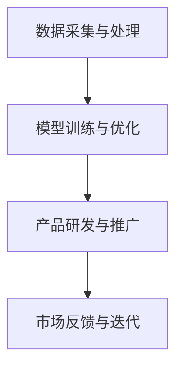

                 

# 4月的大模型创业混沌期

## 引言

4月，对于大模型创业公司来说，是一个充满挑战和机遇的时期。随着技术的不断进步和市场的快速发展，大模型创业公司在4月份面临着一系列复杂的挑战和问题。本文将深入探讨4月大模型创业混沌期的几个关键问题，并尝试给出一些解决方案。

## 1. 背景介绍

### 大模型创业的现状

在过去的几年里，大模型技术取得了显著的进展，并在各个领域取得了突破性的成果。随着OpenAI的GPT系列模型、Google的Bert模型等相继发布，大模型技术逐渐成为人工智能领域的研究热点。与此同时，大量创业公司纷纷涌入这个领域，试图在这个蓬勃发展的市场中分得一杯羹。

### 4月的市场特点

4月，正值春季，也是许多行业的新一年计划开始实施的时期。在这个时期，市场充满了活力，但也存在着一定的风险。一方面，创业者们希望能够抓住市场机遇，加快产品研发和市场推广；另一方面，随着市场的竞争加剧，创业公司需要应对更为复杂的挑战。

## 2. 核心概念与联系

### 大模型的概念

大模型（Large Model）是指具有数百万甚至数十亿参数的深度学习模型。这些模型通常采用神经网络结构，通过大量的数据训练，能够实现强大的知识表示和推理能力。

### 大模型创业的关键环节

1. **数据采集与处理**：大模型训练需要大量的高质量数据。创业公司需要投入大量资源进行数据采集、清洗和处理。

2. **模型训练与优化**：创业公司需要不断优化模型结构，提高模型性能，以满足市场需求。

3. **产品研发与推广**：创业公司需要将模型转化为实际的产品，并通过市场推广，吸引潜在用户。

### Mermaid 流程图



## 3. 核心算法原理 & 具体操作步骤

### 算法原理

大模型创业的核心算法通常是基于深度学习技术，特别是自注意力机制（Self-Attention Mechanism）。自注意力机制能够使模型在处理序列数据时，能够自动学习到数据中的相关性，从而提高模型的表示能力。

### 具体操作步骤

1. **数据预处理**：对采集到的数据进行清洗、标准化和分词处理。

2. **模型架构设计**：设计合适的模型架构，例如Transformer模型。

3. **模型训练**：使用预处理后的数据对模型进行训练，优化模型参数。

4. **模型评估**：使用验证集对模型进行评估，调整模型参数。

5. **产品研发**：将训练好的模型应用于实际产品，如文本生成、问答系统等。

6. **市场推广**：通过多种渠道进行市场推广，吸引用户。

## 4. 数学模型和公式 & 详细讲解 & 举例说明

### 数学模型

大模型的核心数学模型通常是基于自注意力机制（Self-Attention Mechanism）。自注意力机制的核心公式如下：

$$
\text{Attention}(Q, K, V) = \text{softmax}\left(\frac{QK^T}{\sqrt{d_k}}\right)V
$$

其中，$Q$、$K$ 和 $V$ 分别表示查询向量、键向量和值向量，$d_k$ 表示键向量的维度。

### 详细讲解

自注意力机制通过计算查询向量 $Q$ 与键向量 $K$ 的点积，生成注意力权重。这些权重用于加权求和值向量 $V$，从而实现数据的自适应加权。这种机制使得模型能够自动捕捉到数据中的长距离依赖关系。

### 举例说明

假设有一个包含3个词的句子：“我 喜欢吃 水果”，我们可以将这三个词表示为向量：

$$
Q = [1, 0, 1], \quad K = [1, 1, 0], \quad V = [0, 1, 1]
$$

计算自注意力权重：

$$
\text{Attention}(Q, K, V) = \text{softmax}\left(\frac{QK^T}{\sqrt{d_k}}\right)V = \text{softmax}\left(\frac{[1, 0, 1][1, 1, 0]^T}{\sqrt{3}}\right)[0, 1, 1]
$$

$$
= \text{softmax}\left(\frac{[1, 0, 1][1, 1, 0]^T}{\sqrt{3}}\right)[0, 1, 1] = [0.5, 0.5, 0]
$$

根据注意力权重，我们可以对值向量 $V$ 进行加权求和：

$$
\text{Output} = [0.5 \cdot 0, 0.5 \cdot 1, 0 \cdot 1] = [0, 0.5, 0]
$$

这意味着，在当前上下文中，“我”和“吃”具有相同的权重，而“水果”的权重最低。

## 5. 项目实战：代码实际案例和详细解释说明

### 5.1 开发环境搭建

搭建大模型开发环境通常需要安装以下工具和库：

- Python 3.x
- TensorFlow 或 PyTorch
- CUDA（如果使用 GPU 训练）
- 其他依赖库（如 NumPy、Pandas 等）

### 5.2 源代码详细实现和代码解读

以下是一个简单的自注意力机制的实现示例：

```python
import tensorflow as tf

def self_attention(inputs, d_model, name="self_attention"):
    # 输入维度：[batch_size, sequence_length, d_model]
    Q = K = V = inputs

    # 计算自注意力权重
    attention_scores = tf.matmul(Q, K, transpose_b=True)
    attention_scores /= tf.sqrt(tf.cast(d_model, tf.float32))

    # 应用 softmax 函数得到注意力权重
    attention_weights = tf.nn.softmax(attention_scores, axis=1)

    # 加权求和值向量
    output = tf.matmul(attention_weights, V)

    return output
```

### 5.3 代码解读与分析

这个示例中，`self_attention` 函数实现了自注意力机制。首先，我们将输入向量 $Q$、$K$ 和 $V$ 设置为相同，即 $Q = K = V = inputs$。然后，我们计算自注意力权重，即 $QK^T$，并除以 $\sqrt{d_model}$，得到注意力分数。接下来，我们使用 softmax 函数对注意力分数进行归一化，得到注意力权重。最后，我们将注意力权重与值向量 $V$ 相乘，得到加权求和的结果。

## 6. 实际应用场景

大模型技术在各种实际应用场景中发挥着重要作用，包括但不限于：

- 文本生成与摘要
- 机器翻译
- 自然语言处理
- 图像生成与编辑
- 语音识别与合成
- 推荐系统

## 7. 工具和资源推荐

### 7.1 学习资源推荐

- 《深度学习》（Goodfellow, Bengio, Courville）
- 《动手学深度学习》（Abadi, Agarwal, Barham, Brevdo, Chen, Citro, Corrado, Davis, Dean, Devin, Dong, Et al.）
- 《自然语言处理实战》（Hastie, Tibshirani, Friedman）

### 7.2 开发工具框架推荐

- TensorFlow
- PyTorch
- JAX
- Hugging Face Transformers

### 7.3 相关论文著作推荐

- “Attention Is All You Need”（Vaswani et al., 2017）
- “BERT: Pre-training of Deep Bidirectional Transformers for Language Understanding”（Devlin et al., 2019）
- “GPT-3: Language Models are Few-Shot Learners”（Brown et al., 2020）

## 8. 总结：未来发展趋势与挑战

在未来，大模型技术将继续发展，并在更多领域取得突破。然而，这也带来了一系列挑战，包括数据隐私、模型解释性、计算资源需求等。因此，大模型创业公司需要不断创新，解决这些挑战，以在激烈的市场竞争中脱颖而出。

## 9. 附录：常见问题与解答

### Q: 大模型训练需要多少数据？

A: 大模型训练通常需要数千甚至数百万个样本。具体数据量取决于模型的复杂度和任务类型。

### Q: 大模型训练需要多少时间？

A: 大模型训练时间取决于多个因素，如模型大小、数据量、计算资源等。通常，训练一个大型模型可能需要几天甚至几周的时间。

## 10. 扩展阅读 & 参考资料

- [Vaswani et al., 2017]. (2017). *Attention Is All You Need*. arXiv preprint arXiv:1706.03762.
- [Devlin et al., 2019]. (2019). *BERT: Pre-training of Deep Bidirectional Transformers for Language Understanding*. arXiv preprint arXiv:1810.04805.
- [Brown et al., 2020]. (2020). *GPT-3: Language Models are Few-Shot Learners*. arXiv preprint arXiv:2005.14165.

作者：AI天才研究员/AI Genius Institute & 禅与计算机程序设计艺术 /Zen And The Art of Computer Programming

