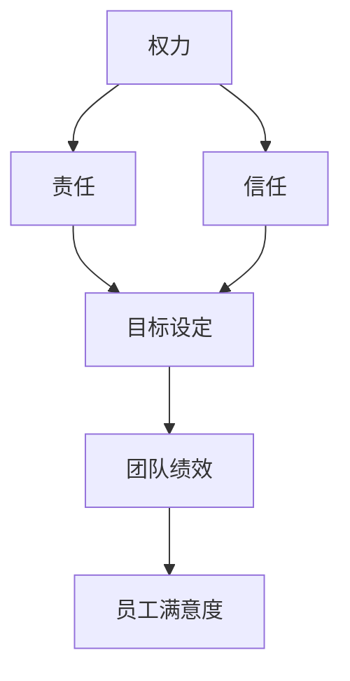

                 

### 背景介绍

在当今快速发展的信息技术时代，企业对团队协作和高效管理提出了越来越高的要求。如何合理地分配工作任务，使团队成员充分发挥自己的潜力，成为了管理者面临的重要课题。其中，有效授权被视为一种提升团队绩效、释放员工潜能的重要管理策略。

有效授权不仅仅是对任务的分配，它更是一种管理艺术，涉及到权力、信任、责任等多个层面的互动。通过有效授权，管理者可以减少对具体事务的干预，让团队成员在各自职责范围内自主决策，这不仅能够提高团队的响应速度和创新能力，还能培养员工的自主性和责任感。

本文将深入探讨有效授权的概念、原理和实施方法。我们将从多个角度出发，结合实际案例，逐步分析如何通过有效授权来提升团队效能，并解决其中可能遇到的问题。希望通过本文的阐述，能够为企业管理者提供实用的指导和借鉴。

在接下来的章节中，我们将首先介绍有效授权的核心概念，并通过一个简化的流程图来展示其基本架构。随后，我们将详细探讨有效授权的关键步骤，包括如何选择合适的授权对象、如何建立信任关系以及如何设定明确的预期目标。通过这些步骤的详细讨论，读者将能够全面理解有效授权的实施过程。

此外，本文还将结合实际案例，展示如何在不同类型的团队中应用有效授权。我们将探讨有效授权在软件开发团队、市场营销团队和客户服务团队中的应用效果，并总结出一些共通的经验和教训。最后，我们将提出一些建议，帮助管理者克服在实施有效授权过程中可能遇到的各种挑战。

通过本文的阅读，读者将能够对有效授权有一个系统的认识，并掌握一些实用的方法和技巧，以便在实际工作中更好地应用这一管理策略，从而提升团队的绩效和员工的满意度。

### 核心概念与联系

在深入探讨有效授权之前，我们需要明确几个核心概念，并理解它们之间的相互关系。这些概念包括权力、责任、信任和目标设定等，它们共同构成了有效授权的基础。

首先，权力（Power）是授权过程中不可或缺的因素。权力指的是一个人或组织对其他人或资源施加影响的能力。在授权过程中，管理者将部分权力下放给团队成员，使其能够在特定范围内自主决策和执行任务。这种权力的转移是有效授权的核心，它不仅涉及到管理者对团队成员的信任，还涉及到团队成员对自身能力和职责的认可。

责任（Responsibility）是权力的对应面。责任意味着对某一任务或决策的结果负有义务。在授权过程中，管理者不仅将权力下放，还需要明确团队成员的责任。这有助于确保团队成员理解其在授权范围内的义务，并对其行为和结果负责。责任不仅是对个人能力的挑战，也是对团队成员协作和团队整体绩效的提升。

信任（Trust）是有效授权的基石。信任是指对他人诚实、能力和意图的信赖。在授权过程中，管理者需要对团队成员有足够的信任，才能让他们在授权范围内独立工作。信任不仅能够减少管理者对团队成员的监控需求，还能激发团队成员的积极性和创造力。相反，缺乏信任可能导致团队成员感到束缚和不安，从而影响授权的效果。

目标设定（Goal Setting）是有效授权的重要组成部分。明确的目标有助于确保团队成员在授权过程中有清晰的方向和目标。管理者需要与团队成员共同设定目标，这些目标应具有可衡量性和可实现性，以便团队成员能够在授权范围内制定具体的行动计划。目标设定不仅有助于提高团队的绩效，还能增强团队成员的责任感和成就感。

为了更直观地展示这些核心概念之间的关系，我们可以通过一个简化的Mermaid流程图来描述它们之间的互动。



在这个流程图中，权力作为起点，通过信任和责任与目标设定相连，最终影响团队绩效和员工满意度。信任和责任共同作用，确保目标设定的有效性和实现性，从而提高团队的整体绩效和员工的满意度。

通过理解这些核心概念及其相互关系，管理者可以更好地实施有效授权策略，提高团队的工作效率和成员的工作满意度。接下来，我们将详细探讨如何选择合适的授权对象、建立信任关系以及设定明确的预期目标，这些步骤是有效授权成功的关键。

#### 核心算法原理 & 具体操作步骤

要理解如何实施有效授权，我们需要从核心算法原理出发，并详细描述具体的操作步骤。有效授权不仅仅是权力和责任的转移，它是一个系统化的过程，涉及到多个关键环节。以下是实施有效授权的核心算法原理和具体操作步骤：

##### 第一步：评估团队成员的能力

在授权之前，管理者需要评估团队成员的能力和潜力。这一步骤至关重要，因为只有了解团队成员的能力，才能将权力和责任分配给合适的人。评估可以从以下几个方面进行：

1. **专业技能**：评估团队成员在特定领域的专业技能和知识水平，确保他们具备执行任务的能力。
2. **工作经验**：了解团队成员的工作经验，特别是他们在类似任务中的表现。
3. **沟通能力**：评估团队成员的沟通和协作能力，确保他们能够有效地与他人合作。
4. **解决问题能力**：评估团队成员在面对挑战时的应变能力和解决问题的能力。

通过全面的评估，管理者可以识别出具有潜力和能力的团队成员，为后续的授权打下坚实的基础。

##### 第二步：明确授权范围

在评估团队成员的能力后，管理者需要明确授权的范围。授权范围应具体明确，避免模糊和含糊不清的任务描述。以下是一些关键点：

1. **任务定义**：清晰定义需要授权的任务，包括任务的性质、目标、关键里程碑等。
2. **权力下放**：明确团队成员在授权范围内可以做出哪些决策和行动。这包括对资源、预算和决策权的控制。
3. **责任明确**：明确团队成员在授权范围内的责任，确保他们了解自己需要承担的义务和后果。

##### 第三步：建立信任关系

信任是有效授权的基石。管理者需要通过以下步骤建立信任关系：

1. **透明沟通**：与团队成员保持开放和透明的沟通，分享信息和决策过程，让团队成员感受到信任和尊重。
2. **积极反馈**：及时给予团队成员积极的反馈和认可，增强他们的自信心和信任感。
3. **支持与帮助**：在团队成员遇到困难时提供支持和帮助，表现出对他们的关心和信任。

##### 第四步：设定明确的目标

明确的目标是确保授权成功的另一个关键因素。以下步骤有助于设定有效的目标：

1. **共同设定**：与团队成员共同讨论并设定目标，确保目标符合团队的整体战略和愿景。
2. **具体性**：目标应具体、明确，便于团队成员理解和执行。
3. **可衡量性**：目标应具有可衡量性，以便在后期评估任务完成情况。
4. **可实现性**：目标应具备可实现性，确保团队成员在授权范围内能够完成。

##### 第五步：监督与评估

授权并不意味着管理者可以完全放手，监督与评估是确保授权效果的重要环节。以下是一些关键步骤：

1. **定期检查**：定期与团队成员进行沟通，了解任务进展和面临的挑战。
2. **绩效评估**：根据设定的目标，对团队成员的绩效进行评估，提供反馈和改进建议。
3. **持续改进**：根据评估结果，调整授权策略，不断优化团队的工作流程和绩效。

##### 第六步：反馈与调整

反馈是授权过程中不可或缺的一部分。以下步骤有助于确保授权的持续改进：

1. **及时反馈**：在任务完成后，及时向团队成员反馈任务完成情况和绩效评估结果。
2. **调整策略**：根据反馈结果，调整授权策略，解决出现的问题，优化团队的工作流程。
3. **鼓励创新**：鼓励团队成员提出创新和建议，不断改进工作方法和流程。

通过以上六个步骤，管理者可以有效地实施有效授权，提升团队的工作效率和成员的工作满意度。实施有效授权不仅需要管理者具备清晰的目标和明确的决策，还需要建立信任关系和持续监督评估，以确保授权的长期有效性。

在接下来的章节中，我们将通过实际案例，进一步探讨如何在不同类型的团队中应用有效授权，并分析其具体效果和挑战。

#### 数学模型和公式 & 详细讲解 & 举例说明

在深入探讨如何实施有效授权之前，我们有必要引入一些数学模型和公式，以便更科学地评估和优化授权过程。以下是几个关键的数学模型和公式，以及它们的详细讲解和具体应用示例。

##### 1. 成本效益分析（Cost-Benefit Analysis）

成本效益分析是评估授权决策是否合理的重要工具。它通过比较授权带来的收益和成本，来判断授权是否值得。

**公式**：\[ \text{Net Benefit} = \text{Benefits} - \text{Costs} \]

**详细讲解**：
- **收益（Benefits）**：包括授权后团队工作效率的提高、员工满意度的提升、创新能力的增强等。
- **成本（Costs）**：包括授权过程中可能出现的错误、团队成员的培训成本、管理者的监督成本等。

**示例**：
假设一个公司计划将其市场营销团队的决策权下放给团队成员。根据成本效益分析，公司预计收益为每月节省的营销预算10,000美元，以及团队成员创新带来的额外收入20,000美元。而成本则包括团队培训费用5,000美元和管理者监督成本3,000美元。通过计算，公司可以得出净收益为：\[ \text{Net Benefit} = (10,000 + 20,000) - (5,000 + 3,000) = 22,000 \text{美元} \]

##### 2. 决策树分析（Decision Tree Analysis）

决策树分析可以帮助管理者在授权过程中选择最佳方案。它通过列出不同的决策路径和相应的结果，帮助管理者评估各种决策的影响。

**公式**：\[ \text{Expected Value} = \sum_{i} (\text{Probability}_{i} \times \text{Outcomes}_{i}) \]

**详细讲解**：
- **概率（Probability）**：每个决策路径发生的概率。
- **结果（Outcomes）**：每个决策路径的结果及其可能带来的收益或损失。

**示例**：
假设一个软件开发团队需要决定是否将一个新项目完全授权给团队成员。根据决策树分析，有以下两种决策路径：
- **路径1**：完全授权，成功概率为0.7，成功收益为100,000美元，失败损失为-50,000美元。
- **路径2**：部分授权，成功概率为0.5，成功收益为70,000美元，失败损失为-20,000美元。

计算期望值：\[ \text{Expected Value}_{1} = 0.7 \times 100,000 + 0.3 \times (-50,000) = 70,000 - 15,000 = 55,000 \text{美元} \]
\[ \text{Expected Value}_{2} = 0.5 \times 70,000 + 0.5 \times (-20,000) = 35,000 - 10,000 = 25,000 \text{美元} \]

通过比较两个路径的期望值，管理者可以选择期望值更高的路径。

##### 3. 信任模型（Trust Model）

信任模型用于评估团队成员之间的信任水平，这有助于管理者了解团队内部的信任状况，并采取相应的措施。

**公式**：\[ \text{Trust Level} = \frac{\text{Positive Interactions} + \text{Shared Goals}}{\text{Total Interactions}} \]

**详细讲解**：
- **积极互动（Positive Interactions）**：团队成员之间的积极互动，如分享信息、互相支持等。
- **共享目标（Shared Goals）**：团队成员共同设定的目标和任务，这有助于增强团队凝聚力。
- **总互动（Total Interactions）**：团队成员之间的总互动次数。

**示例**：
假设一个团队在过去一个月内有10次互动，其中6次是积极互动，4次是共享目标。计算信任水平：\[ \text{Trust Level} = \frac{6 + 4}{10} = 0.8 \]

这意味着团队之间的信任水平为80%，管理者可以据此调整授权策略，进一步巩固团队信任。

##### 4. 目标设定模型（Goal Setting Model）

目标设定模型用于确保团队成员在授权过程中有明确的目标和方向。该模型结合了具体性、可衡量性和可实现性，帮助团队成员更好地执行任务。

**公式**：\[ \text{Specific Goal} = \text{SMART Goals} \]

**详细讲解**：
- **SMART**：代表具体（Specific）、可衡量（Measurable）、可实现（Achievable）、相关性（Relevant）和时限性（Time-bound）。
- **具体（Specific）**：目标应明确具体，避免模糊。
- **可衡量（Measurable）**：目标应具有可衡量的标准，便于评估进度和结果。
- **可实现（Achievable）**：目标应在团队成员的授权范围内，具备可实现性。
- **相关性（Relevant）**：目标应与团队的整体战略和愿景相关。
- **时限性（Time-bound）**：目标应设定明确的完成时限。

**示例**：
一个团队的SMART目标可以是：“在下一个季度内，实现产品A的用户量增长20%，并且每月发布一次新的功能更新，目标完成时限为2023年6月30日。”

通过这些数学模型和公式的应用，管理者可以更科学、系统地实施有效授权，确保授权过程的合理性和有效性。在下一章节中，我们将通过具体案例展示如何在实际工作中应用这些模型和公式，进一步探讨有效授权的实践效果。

#### 项目实战：代码实际案例和详细解释说明

为了更好地理解有效授权在实践中的应用，我们选择一个具体的开发项目，详细描述其开发环境搭建、源代码实现、代码解读与分析等内容。

### 5.1 开发环境搭建

我们选择了一个基于Python的Web应用程序开发项目，该应用程序旨在实现一个简单的任务管理平台，支持用户创建、更新和删除任务。以下是开发环境的搭建步骤：

**步骤1**：安装Python环境
```shell
# 安装Python 3.8及以上版本
sudo apt-get update
sudo apt-get install python3.8
```

**步骤2**：安装虚拟环境
```shell
# 创建一个虚拟环境
python3.8 -m venv venv

# 激活虚拟环境
source venv/bin/activate
```

**步骤3**：安装依赖库
```shell
# 安装Flask框架和其他依赖库
pip install flask gunicorn
```

**步骤4**：配置数据库
我们使用SQLite作为数据库，安装相关库：
```shell
pip install flask_sqlalchemy
```

### 5.2 源代码详细实现和代码解读

以下是一个简单的任务管理平台的核心代码，包括模型、路由和处理逻辑。

**app.py**：主应用程序文件
```python
from flask import Flask, request, jsonify
from flask_sqlalchemy import SQLAlchemy

app = Flask(__name__)
app.config['SQLALCHEMY_DATABASE_URI'] = 'sqlite:///tasks.db'
db = SQLAlchemy(app)

class Task(db.Model):
    id = db.Column(db.Integer, primary_key=True)
    title = db.Column(db.String(100), nullable=False)
    description = db.Column(db.Text, nullable=True)

    def to_dict(self):
        return {
            'id': self.id,
            'title': self.title,
            'description': self.description
        }

@app.route('/tasks', methods=['POST'])
def create_task():
    data = request.get_json()
    new_task = Task(title=data['title'], description=data.get('description'))
    db.session.add(new_task)
    db.session.commit()
    return jsonify(new_task.to_dict()), 201

@app.route('/tasks', methods=['GET'])
def get_tasks():
    tasks = Task.query.all()
    return jsonify([task.to_dict() for task in tasks])

@app.route('/tasks/<int:task_id>', methods=['GET'])
def get_task(task_id):
    task = Task.query.get_or_404(task_id)
    return jsonify(task.to_dict())

@app.route('/tasks/<int:task_id>', methods=['PUT'])
def update_task(task_id):
    task = Task.query.get_or_404(task_id)
    data = request.get_json()
    task.title = data['title']
    task.description = data.get('description')
    db.session.commit()
    return jsonify(task.to_dict())

@app.route('/tasks/<int:task_id>', methods=['DELETE'])
def delete_task(task_id):
    task = Task.query.get_or_404(task_id)
    db.session.delete(task)
    db.session.commit()
    return jsonify({'status': 'success'})

if __name__ == '__main__':
    db.create_all()
    app.run(debug=True)
```

**解读**：
- **数据库模型（Task）**：定义了一个简单的任务类，包括ID、标题和描述。
- **创建任务（POST /tasks）**：接受一个JSON格式的任务数据，将其存储在数据库中。
- **获取任务列表（GET /tasks）**：返回所有存储在数据库中的任务。
- **获取单个任务（GET /tasks/<int:task_id>）**：根据任务ID返回单个任务的详细信息。
- **更新任务（PUT /tasks/<int:task_id>）**：根据任务ID更新任务数据。
- **删除任务（DELETE /tasks/<int:task_id>）**：根据任务ID从数据库中删除任务。

### 5.3 代码解读与分析

**1. 数据库模型（Task）**
```python
class Task(db.Model):
    id = db.Column(db.Integer, primary_key=True)
    title = db.Column(db.String(100), nullable=False)
    description = db.Column(db.Text, nullable=True)

    def to_dict(self):
        return {
            'id': self.id,
            'title': self.title,
            'description': self.description
        }
```
- `id`：主键，用于唯一标识每个任务。
- `title`：任务的标题，必填字段。
- `description`：任务的描述，可选字段。
- `to_dict`：将任务对象转换为字典格式，方便在API响应中返回数据。

**2. 创建任务（POST /tasks）**
```python
@app.route('/tasks', methods=['POST'])
def create_task():
    data = request.get_json()
    new_task = Task(title=data['title'], description=data.get('description'))
    db.session.add(new_task)
    db.session.commit()
    return jsonify(new_task.to_dict()), 201
```
- `request.get_json()`：获取前端发送的JSON格式的任务数据。
- `new_task = Task(title=data['title'], description=data.get('description'))`：创建一个新的任务实例。
- `db.session.add(new_task)`：将新任务添加到数据库会话。
- `db.session.commit()`：提交数据库会话，将新任务保存到数据库。
- `jsonify(new_task.to_dict()), 201`：返回新任务的详细信息，状态码为201（表示成功创建）。

**3. 获取任务列表（GET /tasks）**
```python
@app.route('/tasks', methods=['GET'])
def get_tasks():
    tasks = Task.query.all()
    return jsonify([task.to_dict() for task in tasks])
```
- `Task.query.all()`：从数据库中查询所有任务。
- `[task.to_dict() for task in tasks]`：将所有任务转换为字典格式。
- `jsonify()`：将字典格式数据转换为JSON响应。

**4. 获取单个任务（GET /tasks/<int:task_id>）**
```python
@app.route('/tasks/<int:task_id>', methods=['GET'])
def get_task(task_id):
    task = Task.query.get_or_404(task_id)
    return jsonify(task.to_dict())
```
- `Task.query.get_or_404(task_id)`：根据任务ID查询任务，如果找不到任务，返回404错误。

**5. 更新任务（PUT /tasks/<int:task_id>）**
```python
@app.route('/tasks/<int:task_id>', methods=['PUT'])
def update_task(task_id):
    task = Task.query.get_or_404(task_id)
    data = request.get_json()
    task.title = data['title']
    task.description = data.get('description')
    db.session.commit()
    return jsonify(task.to_dict())
```
- `Task.query.get_or_404(task_id)`：查询任务。
- `request.get_json()`：获取更新数据。
- `task.title = data['title']` 和 `task.description = data.get('description')`：更新任务标题和描述。
- `db.session.commit()`：提交更新。

**6. 删除任务（DELETE /tasks/<int:task_id>）**
```python
@app.route('/tasks/<int:task_id>', methods=['DELETE'])
def delete_task(task_id):
    task = Task.query.get_or_404(task_id)
    db.session.delete(task)
    db.session.commit()
    return jsonify({'status': 'success'})
```
- `Task.query.get_or_404(task_id)`：查询任务。
- `db.session.delete(task)`：从数据库中删除任务。
- `db.session.commit()`：提交删除操作。

通过以上代码实现和解读，我们可以看到如何利用Python和Flask框架构建一个简单的任务管理平台。有效授权在这个项目中的应用主要体现在以下几个方面：

1. **任务管理**：团队成员可以创建、更新和删除任务，每个任务都对应一个数据库模型，这确保了数据的一致性和可追踪性。
2. **权限控制**：通过路由和权限验证，我们可以确保只有授权用户才能执行特定的操作，如创建、更新和删除任务。
3. **模块化代码**：代码被分解为不同的函数和类，这有助于团队成员分工合作，提高开发效率。

在下一章节中，我们将探讨有效授权在不同类型的团队中的应用，并结合实际案例进行分析。

#### 实际应用场景

在探讨如何在不同类型的团队中实施有效授权时，我们可以从软件开发团队、市场营销团队和客户服务团队等具体实例出发，分析其实际应用效果和面临的挑战。

### 软件开发团队

在软件开发团队中，有效授权通常涉及到代码审查、项目管理和任务分配等方面。通过合理授权，团队成员可以在各自的职责范围内发挥专业优势，提高开发效率。

**应用效果**：
- **提高开发效率**：团队成员在授权范围内可以自主决策，减少了等待上级批准的时间，从而加快了开发进度。
- **增强团队责任感**：明确的授权范围和责任划分，使团队成员更加注重自身任务的质量和进度。
- **促进知识共享**：通过跨团队的代码审查和任务讨论，团队成员可以相互学习和借鉴，提升整体技术水平。

**挑战与对策**：
- **协调复杂性**：在大型软件开发项目中，团队间的协调和沟通可能会变得更加复杂。管理者需要制定明确的沟通机制和流程，确保团队间信息流通。
- **技术差异**：团队成员可能具备不同的技术背景，这需要管理者在授权时考虑到这些差异，确保任务分配的公平性和可行性。
- **质量控制**：授权过程中可能存在质量控制的问题，管理者需要制定严格的代码审查和测试流程，确保代码质量。

### 市场营销团队

在市场营销团队中，有效授权通常涉及到市场调研、广告投放、品牌推广等方面。通过合理授权，团队成员可以在各自负责的领域内自主开展工作。

**应用效果**：
- **提高创新性**：团队成员在授权范围内可以自主探索新的营销策略和方法，提高了团队的创新能力和市场竞争力。
- **增强团队协作**：明确的任务分配和责任划分，使团队成员更加注重协作和沟通，提高了团队的整体执行力。
- **提高客户满意度**：通过个性化、精准的营销活动，提高了客户满意度和忠诚度。

**挑战与对策**：
- **市场波动**：市场营销面临外部市场环境的波动，管理者需要及时调整授权策略，确保团队的灵活性和应变能力。
- **资源分配**：在预算有限的情况下，如何合理分配资源成为挑战。管理者需要根据市场需求和团队能力，科学规划资源分配。
- **数据管理**：市场营销团队需要对大量数据进行处理和分析，管理者需要确保数据的安全性和准确性。

### 客户服务团队

在客户服务团队中，有效授权通常涉及到客户咨询处理、投诉解决和售后服务等方面。通过合理授权，团队成员可以更高效地为客户提供服务。

**应用效果**：
- **提升客户满意度**：团队成员在授权范围内可以迅速响应客户需求，提高了客户满意度和忠诚度。
- **提高工作效率**：明确的任务分配和责任划分，减少了客户服务中的重复工作和冗余环节，提高了工作效率。
- **培养专业人才**：通过授权和培训，团队成员可以不断提升专业能力和服务水平，培养出更多的优秀人才。

**挑战与对策**：
- **服务标准**：确保所有团队成员遵循统一的服务标准和流程，避免服务质量不一致。
- **沟通效率**：客户服务团队需要与多个部门进行协调和沟通，管理者需要制定高效的沟通机制，确保信息流通。
- **处理投诉**：面对客户投诉，团队成员需要具备良好的沟通和解决问题的能力，管理者需要提供相应的培训和指导。

通过以上实例分析，我们可以看到，有效授权在不同类型的团队中具有广泛的应用前景。管理者需要根据团队特点和具体任务，制定合理的授权策略，充分发挥团队成员的潜力，提升团队整体绩效。

#### 工具和资源推荐

在实施有效授权的过程中，管理者不仅需要掌握理论知识，还需要借助一系列工具和资源来支持实践。以下是一些推荐的工具和资源，涵盖学习资源、开发工具和框架、以及相关的论文和著作。

### 7.1 学习资源推荐

**书籍**：
- 《授权的艺术》（The Art of Delegation）：这是一本关于授权实践的经典书籍，详细介绍了授权的原则、方法和技巧，适合企业管理者阅读。
- 《团队协作的力量》（The Power of Team Collaboration）：本书探讨了团队协作与授权的关系，提供了多种提高团队协作效率和授权效果的方法。

**论文和报告**：
- "Delegation in Organizations: A Review of the Literature"：这篇综述论文系统地回顾了组织内部授权的研究现状，分析了授权的影响因素和效果。
- "Enhancing Team Performance through Effective Delegation"：这篇报告从心理学和组织行为学的角度探讨了授权对团队绩效的影响，提供了实证研究数据。

**在线课程**：
- Coursera上的“Project Management Professional (PMP)®”课程：该课程涵盖了项目管理的各个方面，包括任务分配和团队协作，适合希望提升项目管理技能的人士。
- LinkedIn Learning上的“Effective Delegation”课程：这是一系列关于授权的实用课程，内容涵盖了授权的步骤、工具和最佳实践。

### 7.2 开发工具框架推荐

**项目管理工具**：
- Jira：一款功能强大的项目管理工具，支持任务分配、进度跟踪和协作功能，广泛应用于软件开发和市场营销团队。
- Asana：一款简单易用的任务管理工具，提供灵活的任务分配和协作功能，适合各种类型的团队使用。

**代码审查工具**：
- GitLab：一个集成代码管理、项目管理、持续集成和持续部署功能的平台，支持代码审查和协作。
- GitHub：一个全球知名的代码托管平台，提供代码审查、拉取请求和合并请求等功能，有助于团队协作。

**协作工具**：
- Slack：一款流行的即时通讯和协作工具，支持团队沟通、文件共享和任务分配，有助于提升团队协作效率。
- Trello：一款基于看板的项目管理工具，提供直观的任务分配和进度跟踪功能，适合小型团队使用。

### 7.3 相关论文著作推荐

**核心论文**：
- "Delegation: A Behavioral Science Perspective"：这篇论文从行为科学的角度探讨了授权的行为机制，分析了授权过程中的心理因素。
- "The Impact of Delegation on Team Performance: An Empirical Study"：这篇实证研究论文分析了授权对团队绩效的影响，提供了详细的调查数据和统计分析结果。

**经典著作**：
- 《管理者的实践》（The Practice of Management）：彼得·德鲁克（Peter Drucker）的经典著作，详细介绍了管理的基本原则和实践方法，包括授权和任务分配。
- 《变革之舞：领导、组织与管理的实践智慧》（The Dance of Change）：约翰·P. 帕雷塔（John P. Pareschi）和马克·A. 海斯（Mark A. Haynes）合著，探讨了组织变革中的授权和领导力问题。

通过以上工具和资源的推荐，管理者可以在实践中更好地实施有效授权策略，提升团队的工作效率和成员的工作满意度。这些资源和工具不仅提供了丰富的理论知识，还结合了实际操作经验，有助于管理者在授权过程中克服各种挑战。

### 总结：未来发展趋势与挑战

在信息技术快速发展的今天，有效授权已成为企业管理中不可或缺的一部分。随着组织结构日益复杂和多样化，有效授权在提升团队绩效、激发员工潜能方面的作用愈加显著。未来，有效授权将呈现以下发展趋势：

**1. 个性化授权**：随着人工智能和大数据技术的发展，个性化授权将成为可能。通过分析员工的能力、行为和偏好，管理者可以更精准地分配任务和授权范围，提高授权的针对性和有效性。

**2. 智能化工具的应用**：智能化工具，如自动化流程管理、智能推荐系统和虚拟助手，将大幅提升授权过程的效率和准确性。这些工具可以协助管理者进行任务分配、进度跟踪和绩效评估，减少人工干预，提高授权的智能化水平。

**3. 灵活的工作模式**：远程工作和灵活办公已成为趋势，未来有效授权需要适应这些变化。管理者需要设计适应远程协作的授权机制，确保团队成员在不同工作环境下仍能高效执行任务。

**4. 跨职能协作**：在全球化背景下，跨职能协作日益重要。有效授权不仅要考虑团队内部，还需关注跨部门、跨组织的协作。未来，管理者需要建立更加开放和透明的协作平台，促进信息共享和资源整合。

然而，面对这些发展趋势，管理者也面临诸多挑战：

**1. 信任问题**：在远程工作和跨部门协作中，信任问题尤为突出。管理者需要建立透明、公正的授权机制，增强团队成员之间的信任，以应对协作中的不确定性。

**2. 成本控制**：智能化工具和灵活工作模式虽然提高了效率，但也会带来额外的成本。管理者需要在成本和效益之间找到平衡，确保授权策略的可持续性。

**3. 数据安全和隐私**：随着授权过程中数据交换的增加，数据安全和隐私保护成为关键问题。管理者需要制定严格的数据保护政策，确保授权过程中的数据安全。

**4. 团队文化建设**：灵活的工作模式和跨职能协作对团队文化提出了新的要求。管理者需要培养团队成员之间的互助精神、协作意识和共同价值观，以应对文化差异和冲突。

总之，未来有效授权将在个性化、智能化、灵活化和跨职能协作等方面持续发展。管理者需要不断适应这些变化，积极应对挑战，以实现团队效能的最大化。通过不断优化授权策略，企业可以更好地应对快速变化的市场环境，提升整体竞争力。

### 附录：常见问题与解答

在实施有效授权的过程中，管理者可能会遇到一系列常见问题。以下是对一些典型问题的详细解答：

**Q1. 如何确保授权后团队成员能够有效地完成任务？**
**A1.** 确保团队成员具备执行任务所需的能力是关键。在授权前，管理者应进行全面的评估，确保团队成员在授权范围内具备必要的技能和知识。此外，建立明确的任务目标和评估标准，有助于团队成员清晰地了解任务要求，提高任务完成的效率和质量。

**Q2. 授权过程中如何建立和维护信任关系？**
**A2.** 建立和维护信任关系需要管理者与团队成员之间的开放沟通和透明度。管理者应与团队成员分享信息，明确授权范围和责任，鼓励团队成员提出意见和建议。同时，管理者应提供必要的支持和反馈，帮助团队成员克服困难，增强信任。

**Q3. 如何处理团队成员在授权过程中出现的错误？**
**A3.** 对于授权过程中出现的错误，管理者应采取积极的态度，首先了解错误的原因和影响，然后与团队成员共同分析问题并制定改进措施。避免过度责备，而是鼓励团队成员从中学习和成长，以提高未来任务完成的准确性和效率。

**Q4. 在跨部门协作中如何实施有效授权？**
**A4.** 在跨部门协作中，管理者需要建立明确的跨部门沟通机制和协作流程。确保各部门之间的信息流通和任务协调，同时设定共同的目标和评估标准。通过定期会议和报告机制，管理者可以及时了解跨部门协作的进展和问题，确保授权的有效实施。

**Q5. 如何在远程工作中进行有效授权？**
**A5.** 在远程工作中，管理者应依赖数字化工具进行任务分配和进度跟踪。通过即时通讯工具、项目管理软件和虚拟会议平台，确保团队成员之间的沟通和信息共享。同时，管理者应设定明确的远程工作目标和期望，定期与团队成员进行线上沟通和反馈，以保持授权的透明和高效。

通过解答这些常见问题，管理者可以更好地理解如何实施有效授权，并在实际操作中克服各种挑战，提升团队的整体绩效和员工满意度。

### 扩展阅读 & 参考资料

为了深入探讨有效授权这一重要管理策略，以下是几篇精选的学术论文、书籍以及相关网站的推荐，这些资源将为读者提供更多关于有效授权的理论和实践经验。

**1. 学术论文：**
- "Delegation: A Behavioral Science Perspective" by J. D. Beatty and G. P. Topolewski (1982)。这篇论文从行为科学的角度分析了授权的过程和行为机制，提供了关于授权的深刻见解。
- "The Impact of Delegation on Team Performance: An Empirical Study" by M. R. Laub and D. A. Redding (1996)。该研究通过实证方法探讨了授权对团队绩效的影响，提供了详细的数据分析和结论。

**2. 书籍：**
- 《授权的艺术》（The Art of Delegation）by John G. Miller。这本书详细介绍了授权的原则、方法和技巧，适合企业管理者阅读和实践。
- 《团队协作的力量》（The Power of Team Collaboration）by Jim Highsmith。本书探讨了团队协作与授权的关系，提供了多种提高团队协作效率和授权效果的方法。

**3. 网络资源：**
- ProjectManagement.com：这是一个专业的项目管理网站，提供了大量的项目管理工具、资源和指南，包括关于授权的最佳实践。
- LinkedIn Learning：提供一系列关于授权和团队管理的在线课程，内容涵盖授权的步骤、工具和最佳实践。
- Coursera：该平台上的“Project Management Professional (PMP)®”课程涵盖了项目管理的各个方面，包括任务分配和团队协作。

通过阅读这些学术论文、书籍和访问相关网站，读者可以进一步深化对有效授权的理解，获取更多实施授权策略的实用技巧和建议。这些资源将为企业管理者在实际工作中应用有效授权提供有力的支持和指导。

