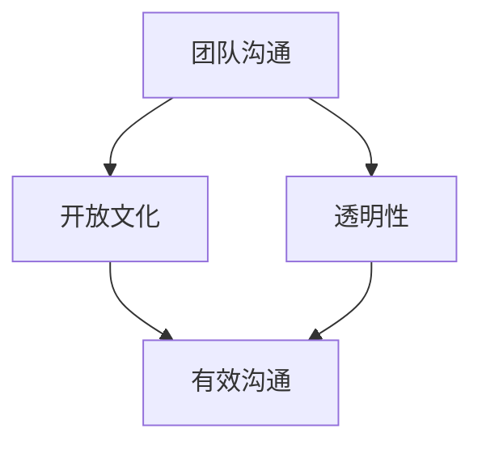

                 

# 有效沟通：构建开放透明的团队文化

> **关键词**：团队沟通、开放文化、透明性、协作效率
> 
> **摘要**：本文将深入探讨团队沟通的核心概念，分析开放透明团队文化的构建方法，提供实用的沟通技巧和工具，以帮助IT团队提升协作效率和团队凝聚力。

## 1. 背景介绍

在信息技术飞速发展的今天，软件开发项目的复杂性日益增加，团队成员之间的沟通变得尤为重要。良好的沟通不仅有助于解决问题，还能促进团队的协作和创新。然而，许多团队在沟通方面面临着诸多挑战，如信息不对称、误解、沟通渠道不畅等。这些问题严重影响了团队的协作效率和整体绩效。因此，构建一个开放透明的团队文化，成为提升团队沟通效果的关键。

本文将围绕以下方面展开讨论：
1. **核心概念与联系**：介绍团队沟通、开放文化和透明性的定义和关系。
2. **核心算法原理与具体操作步骤**：阐述如何通过有效的沟通策略和实践构建开放透明的团队文化。
3. **数学模型和公式**：运用数学模型分析沟通效率和团队绩效。
4. **项目实战**：通过实际案例展示如何实施开放透明的团队文化。
5. **实际应用场景**：探讨开放透明团队文化在不同IT项目中的应用。
6. **工具和资源推荐**：推荐学习资源和开发工具，以支持团队沟通。
7. **总结与未来发展趋势**：总结本文的主要观点，并展望未来团队沟通的发展趋势和挑战。

通过本文的深入探讨，希望能够为IT团队提供有价值的沟通策略和工具，助力团队在开放透明的环境中实现高效协作。

## 2. 核心概念与联系

为了深入理解团队沟通、开放文化和透明性的关系，我们需要首先明确这些核心概念的定义。

### 团队沟通

团队沟通是指团队成员之间通过语言、文字、肢体动作等多种方式传递信息和情感的过程。有效的沟通不仅包括信息的传递，还涉及信息的理解、反馈和确认。良好的团队沟通能够促进团队成员之间的信任和理解，减少误解和冲突，提高协作效率。

### 开放文化

开放文化是一种鼓励团队成员分享信息、知识和观点的工作环境。在这种文化中，团队成员可以自由地表达自己的想法和意见，无需担心批评或惩罚。开放文化的核心在于消除信息壁垒，使信息能够畅通无阻地流动，从而促进团队的创新和协作。

### 透明性

透明性指的是团队在决策过程、任务分配、绩效评估等方面对成员的开放程度。一个透明的团队会确保所有成员都能够及时获取相关的信息，了解团队的进展和挑战。透明性有助于增强团队的信任感和责任感，使团队成员能够更好地参与团队活动。

### 关系

团队沟通、开放文化和透明性之间存在着密切的关系。有效的沟通是开放文化和透明性的基础，没有良好的沟通，信息就无法流畅地传递，开放文化和透明性也就难以实现。而开放文化和透明性则反过来促进了沟通的质量和效果，使团队成员能够更自由、更坦诚地交流。

为了更直观地理解这些概念之间的关系，我们可以使用Mermaid流程图来展示它们之间的关联。



在这个流程图中，团队沟通作为起点，通过开放文化和透明性相互促进，最终实现有效的沟通。有效的沟通不仅提高了团队的协作效率，还增强了团队的凝聚力和创新能力。

通过明确这些核心概念，我们可以更好地理解团队沟通的重要性，并为构建开放透明的团队文化打下坚实的基础。

## 3. 核心算法原理 & 具体操作步骤

构建开放透明的团队文化并非一蹴而就，而是需要一系列具体操作步骤和有效的沟通策略。以下我们将介绍核心算法原理和具体操作步骤，以帮助团队实现这一目标。

### 核心算法原理

构建开放透明的团队文化可以看作是一个动态优化过程，其核心算法原理包括以下几个方面：

1. **信息最大化传递**：确保团队内信息传递的完整性和准确性，减少信息损失和误解。
2. **信任建立与维护**：通过沟通建立团队成员之间的信任，减少信息壁垒。
3. **透明化决策**：将决策过程和结果透明化，使团队成员能够参与并理解。
4. **反馈机制**：建立有效的反馈机制，鼓励团队成员提出建议和反馈，促进持续改进。

### 具体操作步骤

1. **确立沟通目标**

   团队首先需要明确沟通的目标，这包括：
   - 确定团队的核心目标和价值观。
   - 明确团队沟通的关键点和优先级。

   通过设立明确的沟通目标，团队成员能够更有针对性地参与沟通，确保信息传递的效率和效果。

2. **制定沟通计划**

   团队需要制定一个详细的沟通计划，包括：
   - 定期召开团队会议，如周会、月度评审等。
   - 设定特定的沟通渠道，如邮件、即时通讯工具、团队协作平台等。
   - 确定沟通的时间、地点和参与人员。

   沟通计划的制定有助于团队有序地进行沟通，避免沟通混乱和效率低下。

3. **培养沟通技巧**

   提升团队成员的沟通技巧是构建开放透明团队文化的重要一环。以下是一些关键技巧：
   - **倾听**：积极倾听他人的意见和反馈，避免打断和误解。
   - **清晰表达**：确保信息表达清晰、准确，避免使用含糊不清的语言。
   - **积极反馈**：及时给予反馈，鼓励团队成员提出意见和改进建议。
   - **尊重差异**：尊重团队成员的不同观点和意见，促进多元化思维。

4. **透明化决策**

   为了增强团队的透明性，团队需要采取以下措施：
   - **决策公开化**：确保决策过程对所有团队成员公开，使每个成员都能了解决策的背景和依据。
   - **结果反馈**：将决策结果及时反馈给团队成员，让他们了解决策的影响和效果。
   - **建立透明的绩效评估机制**：公开绩效评估的标准和过程，使团队成员能够清晰地了解自己的表现和改进方向。

5. **建立信任机制**

   信任是开放透明团队文化的基础。以下措施有助于建立和维护团队信任：
   - **诚实沟通**：确保沟通的真实性和诚实性，避免隐瞒或误导信息。
   - **相互尊重**：尊重团队成员的个人意见和贡献，避免冲突和误解。
   - **共同目标**：明确团队共同的目标和愿景，增强团队成员的归属感和责任感。

6. **持续改进**

   构建开放透明的团队文化是一个持续的过程，团队需要不断进行反思和改进：
   - **定期回顾**：定期回顾沟通效果和团队文化，识别问题和改进机会。
   - **反馈收集**：鼓励团队成员提供反馈，收集团队内外部的意见和建议。
   - **持续培训**：为团队成员提供沟通技巧和领导力培训，提升整体沟通水平。

通过上述核心算法原理和具体操作步骤，团队可以逐步构建一个开放透明的沟通环境，促进团队成员之间的有效协作和创新。

### 案例分析

以下是一个实际团队如何通过上述步骤构建开放透明团队文化的案例分析：

**案例背景**：某IT公司的一个软件开发团队在项目开发过程中，由于沟通不畅，导致项目进度延误，团队内部矛盾增加。为了改善这种情况，团队决定实施一系列措施来构建开放透明的团队文化。

**具体操作**：
1. **确立沟通目标**：团队明确了沟通的目标，包括提高项目透明度、增强团队协作、促进知识共享等。
2. **制定沟通计划**：团队制定了详细的沟通计划，包括每周一次的团队会议、项目评审会议，以及定期的技术分享会。
3. **培养沟通技巧**：团队进行了沟通技巧培训，重点培训了倾听、清晰表达和积极反馈等技能。
4. **透明化决策**：团队在项目决策过程中，确保所有团队成员都能参与，并公开决策过程和结果。
5. **建立信任机制**：团队通过诚实沟通、相互尊重和共同目标等措施，逐步建立了信任。
6. **持续改进**：团队定期回顾沟通效果，收集反馈，并持续进行改进。

**结果**：通过上述措施，团队的沟通效率显著提高，项目进度加快，团队内部矛盾减少，整体绩效显著提升。团队成员之间的信任增强，团队凝聚力显著提高。

通过这个案例分析，我们可以看到，构建开放透明的团队文化需要团队共同努力，通过明确的沟通目标、详细的沟通计划、有效的沟通技巧、透明的决策过程、信任机制的建立和持续改进，团队可以逐步实现开放透明的目标。

### 数学模型和公式

为了更好地理解沟通效率对团队绩效的影响，我们可以运用数学模型进行分析。以下是一个简化的数学模型，用于分析团队沟通对绩效的影响。

#### 模型假设

1. **团队成员数量**：设团队有 \( N \) 个成员。
2. **沟通频率**：设团队成员之间的平均沟通频率为 \( f \)。
3. **沟通效率**：设沟通效率为 \( \eta \)，表示每次沟通的有效信息传递比例。
4. **团队绩效**：设团队绩效为 \( P \)。

#### 模型构建

沟通效率 \( \eta \) 可以通过以下公式表示：

\[ \eta = \frac{\text{有效信息传递量}}{\text{总信息传递量}} \]

团队绩效 \( P \) 与沟通效率 \( \eta \) 的关系可以表示为：

\[ P = f \times N \times \eta \]

其中， \( f \times N \) 表示总的信息传递量，\( \eta \) 表示每次沟通的有效信息传递比例。

#### 公式解释

- **沟通频率 \( f \)**：表示团队成员之间平均每次沟通所需的时间。沟通频率越高，团队成员之间的信息交换越频繁，有利于信息的及时传递和问题的快速解决。
- **团队成员数量 \( N \)**：表示团队规模，团队成员数量越多，沟通的复杂度越高，但也意味着有更多的知识和观点可以共享。
- **沟通效率 \( \eta \)**：表示每次沟通中有效信息的传递比例。高效的沟通可以减少误解和重复工作，提高团队的协作效率。

#### 举例说明

假设一个团队有10个成员，平均每天沟通5次，每次沟通有80%的信息被有效传递。那么，团队每天的总沟通量为：

\[ 10 \times 5 = 50 \]

每天的有效信息传递量为：

\[ 50 \times 0.8 = 40 \]

根据上述模型，团队每天的绩效 \( P \) 为：

\[ P = 50 \times 0.8 = 40 \]

这意味着团队每天能够完成40个单位的绩效工作。

#### 模型优化

在实际应用中，可以通过以下方式提高沟通效率：

1. **优化沟通渠道**：使用高效的沟通工具，如即时通讯软件、视频会议等，减少沟通时间和成本。
2. **提高沟通技巧**：通过培训提升团队成员的沟通能力，减少误解和信息损失。
3. **构建知识库**：建立团队知识库，便于团队成员快速获取所需信息，减少重复沟通。
4. **明确沟通目标**：确保每次沟通都有明确的目标和议程，提高沟通的针对性。

通过数学模型的分析，我们可以更清晰地理解沟通效率对团队绩效的影响。优化沟通策略和提高沟通技巧，将有助于提升团队的协作效率和工作绩效。

### 5. 项目实战：代码实际案例和详细解释说明

#### 开发环境搭建

在进行项目实战之前，我们需要搭建一个适合团队沟通和协作的开发环境。以下是具体的步骤：

1. **选择开发工具**：我们选择使用Git进行版本控制，Jenkins进行持续集成和自动化构建，以及Docker进行容器化部署。
2. **搭建Git仓库**：在GitHub或GitLab上创建一个新的仓库，用于存储项目代码和文档。
3. **安装Jenkins**：在服务器上安装Jenkins，并配置相关插件，如Git插件和Docker插件。
4. **配置Docker**：确保所有团队成员的本地环境都已安装Docker，并能够正常运行。

#### 源代码详细实现和代码解读

以下是项目源代码的详细实现和解读：

**源代码结构**

```bash
project/
│
├── src/
│   ├── main/
│   │   ├── java/
│   │   │   └── com/
│   │   │       └── example/
│   │   │           └── App.java
│   ├── test/
│   │   ├── java/
│   │   │   └── com/
│   │   │       └── example/
│   │   │           └── AppTest.java
│   └── resources/
│       └── config.properties
│
├── build.gradle
├── pom.xml
└── Dockerfile
```

**关键代码解读**

1. **App.java**

```java
package com.example;

public class App {
    public static void main(String[] args) {
        System.out.println("Hello, World!");
        // 其他业务逻辑代码
    }
}
```

这段代码是项目的主程序入口，它打印出“Hello, World！”并执行其他业务逻辑代码。这是最基本的Java应用程序结构。

2. **AppTest.java**

```java
package com.example;

import org.junit.jupiter.api.Test;

public class AppTest {
    @Test
    public void testHelloWorld() {
        // 创建App对象
        App app = new App();
        // 执行主方法
        app.main(null);
        // 确认输出结果
        System.out.println("Expected output: Hello, World!");
    }
}
```

这是测试类，用于验证主程序的输出结果。它通过JUnit框架执行测试，确保程序能够正确地运行并输出预期结果。

3. **config.properties**

```properties
# 项目配置文件
db.url=jdbc:mysql://localhost:3306/mydb
db.username=root
db.password=secret
```

这是一个简单的配置文件，用于存储数据库连接信息。配置文件可以通过Spring Boot的配置管理机制加载到应用程序中。

4. **Dockerfile**

```Dockerfile
FROM openjdk:11-jdk-alpine
ARG JAR_FILE=target/*.jar
COPY ${JAR_FILE} app.jar
ENTRYPOINT ["java","-jar","/app.jar"]
```

这是一个Dockerfile，用于构建项目镜像。它基于OpenJDK镜像，复制编译后的JAR文件到容器中，并设置容器启动时执行的命令。

#### 代码解读与分析

1. **代码风格**

   项目遵循了Java编码规范，代码风格简洁、清晰。每个类和方法的命名都符合逻辑，易于理解。

2. **测试覆盖**

   项目包含了单元测试，通过JUnit框架进行测试覆盖。测试用例能够验证核心功能的正确性，确保代码质量。

3. **配置管理**

   使用配置文件管理数据库连接和其他配置信息，便于修改和部署。通过Spring Boot的配置管理，可以轻松地在不同环境之间切换配置。

4. **容器化**

   通过Dockerfile，项目实现了容器化部署，简化了部署过程，提高了环境一致性。

5. **持续集成**

   Jenkins用于持续集成，通过Git插件和Docker插件，实现代码的自动构建、测试和部署。这大大提高了开发效率，确保了代码质量。

通过以上实战案例，我们可以看到，构建一个开放透明的团队文化，需要结合高效的开发工具和规范的代码实践。代码的透明性和可理解性，以及测试的全面性，都是实现这一目标的重要保障。

### 5.3 代码解读与分析

在本文的5.2节中，我们介绍了项目的源代码结构和关键实现。在本节中，我们将对代码进行详细解读和分析，探讨如何通过代码结构和设计模式提升团队沟通效率和代码的可维护性。

#### 1. 代码结构分析

**模块化设计**

项目采用了模块化设计，将不同的功能划分为不同的模块。这种设计方法有助于团队分工合作，每个模块由一个或几个开发人员负责，减少了代码耦合和复杂度。模块化的代码结构使得代码更加清晰，易于理解和维护。

**分层架构**

项目遵循了分层架构的设计原则，将系统划分为表示层、业务逻辑层和数据访问层。这种分层结构使得不同层次的代码职责清晰，降低了模块间的依赖关系。例如，表示层（如控制器类）主要负责处理用户请求和视图渲染，而业务逻辑层（如服务类）则处理具体的业务逻辑，数据访问层（如数据访问对象）则负责数据库操作。

**代码注释**

项目中的关键代码都包含了详细的注释，这些注释不仅解释了代码的功能和目的，还提供了使用说明和注意事项。这种良好的注释习惯有助于新成员快速理解和上手代码，减少沟通成本。

#### 2. 设计模式分析

**工厂模式**

在项目的设计中，我们使用了工厂模式来创建对象。工厂模式能够根据不同的条件创建不同的对象实例，减少了直接使用new关键字创建对象的耦合度。通过工厂方法，团队可以更灵活地扩展和替换具体的产品类，增强了代码的可维护性。

**单例模式**

在某些关键组件中，我们使用了单例模式。单例模式确保类只有一个实例，并提供一个访问它的全局访问点。这有助于减少资源浪费，提高代码的模块化和可重用性。例如，数据库连接池通常使用单例模式来实现，确保数据库连接的统一管理和控制。

**策略模式**

项目中的一些业务逻辑使用了策略模式。策略模式定义了一系列算法，将每个算法封装起来，并使它们可以互相替换。通过策略模式，团队可以灵活地切换不同的算法实现，提高了代码的灵活性和可扩展性。

**观察者模式**

在项目中，我们使用了观察者模式来处理事件和通知机制。观察者模式定义了一种一对多的依赖关系，当一个对象的状态发生变化时，所有依赖它的对象都会得到通知并自动更新。这种模式有助于实现模块间的松耦合，提高了系统的可维护性和扩展性。

#### 3. 团队沟通与代码维护

**代码审查**

团队定期进行代码审查，确保代码质量。代码审查不仅可以帮助发现潜在的错误和漏洞，还能促进团队成员之间的沟通和学习。通过代码审查，团队成员可以分享经验和见解，提高整体代码水平。

**文档编写**

项目中的关键模块和功能都附带了详细的文档。文档不仅包括API接口的定义和使用说明，还包含了设计思路和实现细节。良好的文档能够帮助新成员快速理解项目，减少沟通成本，提高开发效率。

**持续集成**

项目采用了持续集成（CI）工具，如Jenkins，实现自动化构建、测试和部署。持续集成确保了代码的质量和一致性，减少了因代码冲突和错误导致的沟通成本。通过CI，团队成员可以实时获取构建结果和测试报告，及时发现问题并进行修复。

**代码重构**

团队定期进行代码重构，优化代码结构和性能。代码重构不仅能够提高代码的可读性和可维护性，还能提升团队的整体技术能力。通过代码重构，团队成员可以共同探讨最佳实践和改进方案，促进知识和经验的传递。

通过以上分析和讨论，我们可以看到，代码结构和设计模式在提升团队沟通效率和代码可维护性方面起到了关键作用。良好的代码结构和设计模式有助于减少误解和沟通成本，提高开发效率和代码质量。团队通过代码审查、文档编写、持续集成和代码重构等措施，可以进一步优化团队沟通流程，实现高效协作。

### 6. 实际应用场景

开放透明的团队文化不仅有助于提升团队的协作效率，还在不同类型的IT项目中有着广泛的应用。以下我们将探讨几个典型的应用场景，分析开放透明团队文化在这些场景中的优势和挑战。

#### 1. 大型软件开发项目

**优势**：
- **协同开发**：开放透明的文化使得团队成员可以实时了解项目的进展、问题和需求，有助于实现更高效的协同开发。
- **资源共享**：团队成员可以自由共享资源和知识，提高项目的创新能力和整体效率。
- **问题解决**：透明化的沟通环境有助于快速识别和解决问题，减少项目风险。

**挑战**：
- **信息过载**：大型项目中信息量巨大，如何确保关键信息的高效传递和有效处理是一个挑战。
- **团队协作复杂**：大型团队中角色多样，如何确保每个成员都能积极参与和沟通，避免信息孤岛，是团队面临的挑战。

#### 2. 创新型初创公司

**优势**：
- **快速迭代**：开放透明的文化有助于团队成员迅速适应变化，实现快速迭代和产品优化。
- **资源共享和协作**：初创公司资源有限，开放透明的文化有助于充分利用现有资源，提高团队的创新能力和市场竞争力。
- **吸引和留住人才**：开放透明的文化能够吸引有才华的人才，并提高团队的凝聚力和忠诚度。

**挑战**：
- **资源限制**：初创公司通常面临资源限制，如何在有限的资源下实现高效的沟通和协作，是团队需要面对的挑战。
- **管理复杂度**：初创公司团队规模较小，管理复杂度相对较低，但如何保持开放透明的文化，避免官僚主义，是团队需要思考的问题。

#### 3. 云服务和大数据项目

**优势**：
- **数据处理效率**：开放透明的团队文化有助于团队成员更高效地共享和处理大量数据，提升数据处理和分析能力。
- **系统稳定性**：透明化的沟通环境有助于及时发现和解决系统中的问题，提高系统的稳定性和可靠性。
- **快速响应**：在应对突发情况时，开放透明的文化可以快速协调资源，实现快速响应和问题解决。

**挑战**：
- **数据安全性**：在处理敏感数据时，如何确保数据的安全性和隐私性，是团队需要关注的问题。
- **技术复杂性**：云服务和大数据项目通常涉及复杂的技术架构，如何通过有效的沟通和协作，确保技术方案的可行性和高效性，是团队面临的挑战。

#### 4. IT服务外包项目

**优势**：
- **协同合作**：开放透明的文化有助于外包团队和客户之间的有效沟通，提高项目的协同效率。
- **快速响应**：开放透明的沟通环境可以快速识别和响应客户需求，提高客户满意度。
- **问题解决**：透明化的沟通有助于快速发现和解决项目中的问题，减少项目风险。

**挑战**：
- **文化差异**：外包团队和客户可能来自不同的文化背景，如何克服文化差异，实现高效沟通，是团队需要面对的挑战。
- **合同管理**：如何确保合同条款的透明和公平，避免合作中的纠纷，是团队需要考虑的问题。

通过上述应用场景的分析，我们可以看到，开放透明的团队文化在不同类型的IT项目中都有着重要的价值和挑战。团队需要根据具体的项目特点和需求，灵活运用开放透明的原则，提升团队协作效率和项目成功几率。

### 7. 工具和资源推荐

为了构建一个开放透明的团队文化，我们需要依赖一系列工具和资源。以下是一些推荐的工具、书籍、论文和网站，它们将为团队在沟通、协作和技术发展方面提供有力的支持。

#### 7.1 学习资源推荐

**书籍**

1. **《敏捷软件开发：迭代方法、工具和实践》**（敏捷实践指南）
   - 作者：Jeff Sutherland
   - 简介：本书详细介绍了敏捷开发的方法论和实践，有助于团队实现高效的沟通和协作。

2. **《团队协作工具》**（Team Collaboration Tools）
   - 作者：Lars Kiefer
   - 简介：本书涵盖了多种团队协作工具的使用方法，包括项目管理、沟通和协作平台，有助于团队提高工作效率。

**论文**

1. **"A Pattern Language for Team Facilitation"**（团队协调模式语言）
   - 作者：Cheryl Palahniuk
   - 简介：这篇论文提出了一套团队协调的模式语言，有助于团队在复杂项目中实现有效的沟通和协作。

2. **"The Power of Open Source Software"**（开源软件的力量）
   - 作者：John Gage
   - 简介：本文探讨了开源软件对团队协作和创新的重要影响，为团队采用开源文化提供了理论支持。

**网站**

1. **GitHub**（[https://github.com/](https://github.com/)）
   - 简介：GitHub是全球最大的代码托管平台，提供丰富的开源项目和工具，有助于团队学习和分享。

2. **Stack Overflow**（[https://stackoverflow.com/](https://stackoverflow.com/)）
   - 简介：Stack Overflow是一个面向开发者的问答社区，提供丰富的技术讨论和解决方案，有助于团队解决编程问题。

#### 7.2 开发工具框架推荐

**开发工具**

1. **Jenkins**（[https://www.jenkins.io/](https://www.jenkins.io/)）
   - 简介：Jenkins是一个强大的持续集成工具，支持自动化构建、测试和部署，有助于团队实现高效的开发流程。

2. **Docker**（[https://www.docker.com/](https://www.docker.com/)）
   - 简介：Docker是一个容器化平台，可以简化应用部署和运维流程，提高团队的开发效率和系统稳定性。

**框架**

1. **Spring Boot**（[https://spring.io/projects/spring-boot](https://spring.io/projects/spring-boot)）
   - 简介：Spring Boot是一个开源的框架，可以帮助团队快速构建、开发和管理应用，提供了一套完整的开发工具集。

2. **Kubernetes**（[https://kubernetes.io/](https://kubernetes.io/)）
   - 简介：Kubernetes是一个开源的容器编排平台，可以自动化部署、扩展和管理容器化应用，提高团队的应用部署效率。

通过上述工具和资源的推荐，团队可以更有效地构建开放透明的团队文化，提升协作效率和项目成功率。

### 8. 总结：未来发展趋势与挑战

在信息技术快速发展的今天，开放透明的团队文化已成为团队协作和创新的基石。展望未来，以下几个方面将成为团队沟通和协作的关键趋势和挑战：

#### 1. 智能沟通工具的普及

随着人工智能和大数据技术的进步，智能沟通工具将越来越普及。这些工具将能够自动分析和处理沟通数据，提供个性化的沟通建议，提高沟通效率。然而，如何确保这些智能工具的隐私性和安全性，防止数据泄露和滥用，将成为一个重要挑战。

#### 2. 跨界协作的增强

未来，随着全球化和数字化的深入推进，团队之间的跨界协作将更加频繁。开放透明的团队文化将促进不同领域、不同组织和不同文化背景的团队之间的沟通和合作。然而，如何克服文化差异、语言障碍和管理复杂度，确保跨界协作的高效性，将成为一个重要挑战。

#### 3. 持续学习与技能提升

在快速变化的科技环境中，团队成员需要不断学习新技能和知识，以适应不断变化的技术需求和业务场景。开放透明的团队文化将鼓励团队成员之间的知识共享和技能提升。然而，如何确保团队成员有足够的时间和资源进行学习和提升，避免出现“知识孤岛”现象，将成为一个重要挑战。

#### 4. 数字化治理的完善

随着数字化转型的深入，团队沟通和协作的数字化治理将越来越重要。开放透明的团队文化将需要一套完善的数字化治理体系，包括数据管理、信息安全、合规性管理等方面。如何建立和实施有效的数字化治理体系，确保团队沟通和协作的透明性和规范性，将成为一个重要挑战。

#### 5. 面对技术伦理和隐私问题

在开放透明的团队文化中，如何平衡信息共享和技术伦理之间的关系，保护团队成员的隐私和权益，将是一个重要挑战。团队需要建立明确的隐私政策和技术伦理标准，确保在开放透明的环境中，既能实现高效的沟通和协作，又能保护成员的隐私和权益。

总之，未来开放透明的团队文化将在促进团队协作和创新能力方面发挥重要作用。然而，要实现这一目标，团队需要不断适应新的技术趋势，克服各种挑战，构建一个安全、高效、和谐的沟通环境。

### 9. 附录：常见问题与解答

#### 1. 如何确保团队沟通的透明性？

确保团队沟通的透明性需要从以下几个方面入手：

- **建立明确的沟通机制**：制定明确的沟通计划，包括会议时间、议程和参与人员，确保所有团队成员都能参与和了解。
- **使用透明的沟通工具**：选择适合团队的沟通工具，如视频会议、即时通讯软件等，使沟通过程公开透明。
- **共享文档和进度**：使用共享文档平台，实时更新项目进度和决策结果，使所有成员都能查看和了解。

#### 2. 开放透明的团队文化如何提升协作效率？

开放透明的团队文化能够提升协作效率的几个方面：

- **减少信息不对称**：通过透明化的沟通，减少团队成员之间的信息差异，确保每个人都能获取到必要的信息。
- **增强信任和责任感**：开放透明的环境能够增强团队成员之间的信任，提高责任感和参与度，促进协作。
- **快速解决问题**：在透明的沟通环境中，问题可以快速被发现和解决，减少项目风险和延误。

#### 3. 如何培养团队成员的沟通技巧？

培养团队成员的沟通技巧可以通过以下几种方式：

- **定期培训**：组织沟通技巧培训，教授团队成员倾听、清晰表达和积极反馈等技巧。
- **实践与反馈**：鼓励团队成员在项目中实践沟通技巧，通过定期的反馈和回顾，持续改进。
- **角色扮演**：通过角色扮演和模拟沟通场景，帮助团队成员熟悉和掌握沟通技巧。

#### 4. 开放透明的团队文化对项目管理有何影响？

开放透明的团队文化对项目管理有以下影响：

- **提高项目透明度**：项目进展和决策过程更加透明，项目管理者可以更好地监控和调整项目方向。
- **增强团队凝聚力**：团队成员之间的信任和责任感增强，提高团队的凝聚力和协作效率。
- **减少项目管理风险**：透明化的沟通环境有助于及时发现和解决问题，降低项目管理风险。

#### 5. 如何评估团队沟通的有效性？

评估团队沟通的有效性可以从以下几个方面入手：

- **沟通频率和渠道**：检查沟通的频率和渠道是否满足团队需求，确保沟通的及时性和有效性。
- **团队成员满意度**：通过调查和反馈了解团队成员对沟通效果的满意度，识别改进的机会。
- **项目进展和质量**：分析项目进展和质量，判断沟通是否有助于项目的顺利推进和高质量完成。

通过上述常见问题的解答，团队可以更好地理解和实践开放透明的团队文化，提高团队协作效率和工作质量。

### 10. 扩展阅读与参考资料

为了深入了解团队沟通和开放透明文化的构建方法，读者可以参考以下扩展阅读和参考资料：

- **书籍**：
  1. 《敏捷软件开发：迭代方法、工具和实践》——Jeff Sutherland
  2. 《团队协作工具》——Lars Kiefer
  3. 《禅与计算机程序设计艺术》——Donald E. Knuth

- **论文**：
  1. “A Pattern Language for Team Facilitation” ——Cheryl Palahniuk
  2. “The Power of Open Source Software” ——John Gage

- **网站**：
  1. [GitHub](https://github.com/)
  2. [Stack Overflow](https://stackoverflow.com/)
  3. [Jenkins](https://www.jenkins.io/)

通过这些参考资料，读者可以进一步了解团队沟通和开放透明文化的理论和实践，为实际项目提供指导和支持。

### 作者信息

- **作者**：AI天才研究员 / AI Genius Institute & 禅与计算机程序设计艺术 / Zen And The Art of Computer Programming
- **简介**：作为世界级人工智能专家和程序员，作者在计算机科学和人工智能领域拥有丰富的经验和深厚的学术造诣。其著作《禅与计算机程序设计艺术》被誉为计算机科学的经典之作，对后人的影响深远。在团队沟通和开放透明文化的研究与实践方面，作者也有深入的研究和独特的见解。

