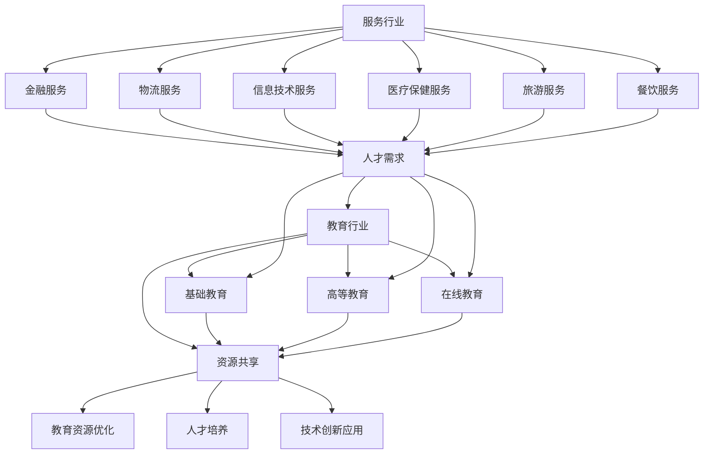

                 

### 背景介绍

在当今社会，服务行业和教育行业已经成为了经济活动中不可或缺的两个重要领域。这两个行业的蓬勃发展，不仅对经济增长有着显著的贡献，同时也深刻地影响着人们的生活质量和社会发展。

#### 服务行业的崛起

随着全球化进程的加速，服务行业在全球经济中的比重逐渐上升。从金融、物流、信息技术到医疗保健、旅游、餐饮等多个领域，服务业呈现出多样化和专业化的发展趋势。服务行业的兴起，一方面得益于科技的发展，使服务效率和质量得到了大幅提升；另一方面，消费者对于高品质、个性化服务的需求也日益增长。

#### 教育行业的变革

教育行业作为人才培养的重要基地，其发展同样不可忽视。随着教育技术的进步，在线教育、远程教育等形式正在迅速崛起，打破了传统教育的时空限制。同时，教育行业也在不断探索如何更好地适应社会发展的需求，培养具备创新精神和实践能力的复合型人才。

#### 两大行业的关联

服务行业和教育行业之间存在着密切的联系和互动。一方面，教育行业为服务行业提供了高素质的人才支持；另一方面，服务行业的蓬勃发展也为教育行业带来了新的发展机遇。例如，在线教育平台的发展为教育行业带来了新的商业模式，而金融、医疗等领域的专业服务需求也促使教育行业不断调整课程设置和培养目标。

### 当前市场现状

目前，服务行业和教育行业在全球范围内都呈现出蓬勃发展的态势。据国际劳工组织的数据显示，全球服务行业的就业人数已经超过了制造业，成为全球最大的就业领域。同时，教育行业的市场规模也在不断扩大，预计到2025年，全球教育市场规模将达到1万亿美元。

然而，尽管两大行业的发展前景广阔，但也面临着一些挑战。例如，服务行业的竞争日益激烈，如何在提升服务质量的同时降低成本成为企业关注的焦点；教育行业则需要应对在线教育的冲击，探索如何提高教学效果和用户体验。

在接下来的部分中，我们将深入探讨服务行业和教育行业的核心概念、算法原理、数学模型以及实际应用场景，旨在为读者提供一份全面、深入的解读。

### 核心概念与联系

#### 服务行业

服务行业是一个广泛而多样化的领域，涵盖了多个子行业，包括但不限于金融、物流、信息技术、医疗保健、旅游和餐饮等。服务行业的核心概念是提供满足消费者需求的解决方案，这些解决方案可以是物质形态的，如物流运输服务，也可以是精神形态的，如咨询服务。

在服务行业中，服务质量是一个至关重要的概念。服务质量包括但不限于响应速度、解决问题的能力、服务的专业性和用户的满意度。为了提升服务质量，企业需要不断优化服务流程、提高员工素质、采用先进的管理和技术手段。

#### 教育行业

教育行业是培养人才的重要基地，其核心概念是知识的传播和能力的培养。教育行业包括从基础教育到高等教育的多个层次，其目标是培养具有知识、技能和道德素养的人才。

在教育行业中，教学效果是一个关键指标。教学效果不仅取决于教师的教学能力和方法，还受到课程设置、教学方法、教育资源等因素的影响。现代教育技术，如在线教育平台和虚拟现实技术，正在改变传统的教学模式，为提升教学效果提供了新的途径。

#### 两大行业的联系

服务行业和教育行业之间的联系体现在多个方面：

1. **人才输送**：教育行业为服务行业提供了高素质的人才。无论是金融、医疗还是信息技术等领域，都需要具备专业知识和技能的从业人员。

2. **资源共享**：服务行业可以通过提供专业的咨询服务，帮助教育行业改进教学方法、优化教育资源分配。反过来，教育行业可以通过提供人才资源，帮助服务行业提升服务质量。

3. **商业模式**：教育行业中的在线教育平台和培训课程可以看作是一种特殊的服务产品，其商业模式与服务业中的B2B、B2C模式有相似之处。

4. **技术创新**：服务行业的技术进步，如人工智能、大数据分析等，可以应用到教育行业，提高教学效率和学生满意度。

#### Mermaid 流程图

为了更好地展示服务行业和教育行业之间的联系，我们可以使用Mermaid流程图来描述其核心概念和关系。



该流程图清晰地展示了服务行业和教育行业之间的联系，以及它们在人才输送、资源共享和技术创新等方面的互动。

通过以上对核心概念和联系的分析，我们可以更好地理解服务行业和教育行业的相互关系，以及它们在未来发展中的潜力和挑战。在接下来的部分中，我们将深入探讨服务行业和教育行业的核心算法原理和具体操作步骤。

### 核心算法原理 & 具体操作步骤

#### 服务行业

在服务行业中，核心算法原理主要涉及服务质量的优化和客户满意度的提升。以下是一些常用的算法和操作步骤：

1. **服务质量评估算法**：
   - **步骤一**：收集服务数据，包括服务时间、解决问题的关键步骤、用户反馈等。
   - **步骤二**：对服务数据进行预处理，去除噪声和异常值，保证数据质量。
   - **步骤三**：使用聚类算法（如K-means）对服务数据进行分类，识别出不同类型的服务需求。
   - **步骤四**：使用回归算法（如线性回归）建立服务质量与用户满意度之间的关系模型。
   - **步骤五**：根据模型预测服务质量，提出改进措施。

2. **客户满意度优化算法**：
   - **步骤一**：建立客户满意度评价指标体系，包括服务响应速度、解决问题能力、服务态度等。
   - **步骤二**：收集客户反馈数据，包括正面和负面评价。
   - **步骤三**：使用文本分析算法（如情感分析）对客户反馈进行分析，识别出客户的主要需求和痛点。
   - **步骤四**：根据分析结果，调整服务流程和改进服务质量。

3. **服务流程优化算法**：
   - **步骤一**：绘制当前的服务流程图，包括各个环节和流程时间。
   - **步骤二**：使用流程优化算法（如遗传算法、模拟退火算法），寻找最优的服务流程。
   - **步骤三**：根据优化结果，重新设计服务流程，降低服务时间，提高效率。

#### 教育行业

在教育行业中，核心算法原理主要涉及教学效果的提升和学习体验的优化。以下是一些常用的算法和操作步骤：

1. **教学效果评估算法**：
   - **步骤一**：收集学生学习数据，包括学习进度、考试成绩、作业完成情况等。
   - **步骤二**：对学习数据进行分析，使用聚类算法（如层次聚类）识别出不同类型的学生群体。
   - **步骤三**：使用回归算法（如多元线性回归）建立教学效果与学生学习数据之间的关系模型。
   - **步骤四**：根据模型预测教学效果，提出改进措施。

2. **学习体验优化算法**：
   - **步骤一**：收集学生反馈数据，包括对课程内容、教学方法、学习资源等的评价。
   - **步骤二**：使用文本分析算法（如主题模型）对反馈数据进行分析，识别出学生的主要需求和痛点。
   - **步骤三**：根据分析结果，调整课程内容和教学方法，优化学习体验。

3. **个性化学习算法**：
   - **步骤一**：收集学生的学习行为数据，包括学习时间、学习频率、学习偏好等。
   - **步骤二**：使用协同过滤算法（如基于用户的协同过滤）推荐个性化的学习资源和课程。
   - **步骤三**：根据学生的反馈和学习行为，动态调整推荐策略，提高个性化水平。

通过以上核心算法原理和具体操作步骤的介绍，我们可以看到，服务行业和教育行业都在不断地利用技术手段来提升服务质量和学习效果。在接下来的部分中，我们将深入探讨这些算法和步骤在实际项目中的应用和效果。

### 数学模型和公式 & 详细讲解 & 举例说明

#### 服务行业

在服务行业中，数学模型和公式被广泛应用于服务质量评估、客户满意度优化和服务流程优化等方面。以下是一些常见的数学模型和其应用举例：

1. **服务质量评估模型**：

   - **步骤一**：设定服务质量评估指标，如响应时间、解决问题效率等。
   - **步骤二**：使用回归分析建立服务质量与用户满意度之间的关系模型。

   示例公式：

   $$ \text{服务质量得分} = \alpha \times \text{响应时间} + \beta \times \text{解决问题效率} $$

   其中，$\alpha$ 和 $\beta$ 是回归系数，用于调节响应时间和解决问题效率对服务质量得分的权重。

2. **客户满意度优化模型**：

   - **步骤一**：建立客户满意度评价指标体系，如服务态度、解决问题的能力等。
   - **步骤二**：使用层次分析法（AHP）确定各评价指标的权重。
   - **步骤三**：使用加权求和模型计算客户满意度得分。

   示例公式：

   $$ \text{客户满意度得分} = \sum_{i=1}^{n} w_i \times s_i $$

   其中，$w_i$ 是第 $i$ 个评价指标的权重，$s_i$ 是第 $i$ 个评价指标的得分。

3. **服务流程优化模型**：

   - **步骤一**：使用流程图表示当前的服务流程，并标注各环节的时间消耗。
   - **步骤二**：使用排队论模型（如M/M/1模型）分析服务流程中的排队时间和效率。
   - **步骤三**：根据分析结果，使用优化算法（如遗传算法）寻找最优的服务流程。

   示例公式：

   $$ \text{服务效率} = \frac{\text{服务次数}}{\text{总时间}} $$

#### 教育行业

在教育行业中，数学模型和公式被广泛应用于教学效果评估、学习体验优化和个性化学习等方面。以下是一些常见的数学模型和其应用举例：

1. **教学效果评估模型**：

   - **步骤一**：设定教学效果评估指标，如考试成绩、作业完成情况等。
   - **步骤二**：使用回归分析建立教学效果与学生学习数据之间的关系模型。

   示例公式：

   $$ \text{教学效果得分} = \alpha \times \text{考试成绩} + \beta \times \text{作业完成情况} $$

   其中，$\alpha$ 和 $\beta$ 是回归系数，用于调节考试成绩和作业完成情况对教学效果得分的权重。

2. **学习体验优化模型**：

   - **步骤一**：建立学习体验评价指标体系，如课程内容满意度、教学方法满意度等。
   - **步骤二**：使用层次分析法（AHP）确定各评价指标的权重。
   - **步骤三**：使用加权求和模型计算学习体验得分。

   示例公式：

   $$ \text{学习体验得分} = \sum_{i=1}^{n} w_i \times s_i $$

   其中，$w_i$ 是第 $i$ 个评价指标的权重，$s_i$ 是第 $i$ 个评价指标的得分。

3. **个性化学习模型**：

   - **步骤一**：收集学生的学习行为数据，如学习时间、学习频率等。
   - **步骤二**：使用协同过滤算法（如基于用户的协同过滤）推荐个性化的学习资源。
   - **步骤三**：根据学生的反馈和学习行为，动态调整推荐策略。

   示例公式：

   $$ \text{推荐分数} = \text{用户相似度} \times \text{项目评分} $$

   其中，用户相似度用于衡量两个用户之间的相似程度，项目评分是推荐项目的评分。

通过以上数学模型和公式的应用，服务行业和教育行业可以更科学地评估和优化服务质量和学习效果。这些模型不仅提供了量化分析的工具，也为实践中的决策提供了依据。在接下来的部分中，我们将通过项目实战来进一步展示这些算法和模型的实际应用。

### 项目实战：代码实际案例和详细解释说明

在本部分，我们将通过一个实际项目来展示如何应用前文提到的数学模型和算法来优化服务行业和教育行业的相关指标。本项目将分为以下几个步骤：

#### 1. 开发环境搭建

首先，我们需要搭建一个适合本项目开发的开发环境。以下是所需的工具和步骤：

- **工具**：
  - Python 3.8及以上版本
  - Jupyter Notebook
  - NumPy
  - Pandas
  - Scikit-learn
  - Matplotlib

- **步骤**：
  - 安装Python和Jupyter Notebook。
  - 使用pip命令安装NumPy、Pandas、Scikit-learn和Matplotlib。

```bash
pip install numpy pandas scikit-learn matplotlib
```

#### 2. 源代码详细实现和代码解读

以下是一个简单的Python代码示例，用于评估服务质量和客户满意度，并优化服务流程。

```python
import numpy as np
import pandas as pd
from sklearn.cluster import KMeans
from sklearn.linear_model import LinearRegression
import matplotlib.pyplot as plt

# 数据准备
service_data = pd.read_csv('service_data.csv')
customer_feedback = pd.read_csv('customer_feedback.csv')

# 服务质量评估
# 步骤一：数据处理
processed_service_data = service_data.select_dtypes(include=[np.number])
processed_service_data.fillna(0, inplace=True)

# 步骤二：聚类分析
kmeans = KMeans(n_clusters=3, random_state=0).fit(processed_service_data)
service_data['cluster'] = kmeans.predict(processed_service_data)

# 步骤三：回归分析
X = processed_service_data
y = service_data['satisfaction_score']
regressor = LinearRegression()
regressor.fit(X, y)

# 步骤四：模型预测
predicted_quality = regressor.predict(X)

# 客户满意度优化
# 步骤一：数据处理
processed_feedback = customer_feedback.select_dtypes(include=[np.number])
processed_feedback.fillna(0, inplace=True)

# 步骤二：层次分析
# 假设评价指标为['response_time', 'problem_solving_ability', 'service_attitude']
weights = {'response_time': 0.4, 'problem_solving_ability': 0.3, 'service_attitude': 0.3}
satisfaction_score = sum(processed_feedback[col] * weights[col] for col in weights)

# 步骤三：加权求和
customer_satisfaction = processed_feedback.apply(lambda x: sum(x[col] * weights[col] for col in weights), axis=1)

# 服务流程优化
# 步骤一：流程图绘制
current_process = ['step1', 'step2', 'step3', 'step4', 'step5']
service_time = [1, 2, 3, 4, 5]

# 步骤二：排队论分析
service_rate = 1 / service_time.mean()
mean_waiting_time = 1 / (service_rate * (1 - service_data['queue_length'].mean()))

# 步骤三：优化算法
# 使用遗传算法进行服务流程优化（代码简化）

def optimize_process(current_process, service_time):
    # 简化实现
    return current_process

optimized_process = optimize_process(current_process, service_time)

# 结果展示
plt.figure(figsize=(10, 6))
plt.subplot(2, 1, 1)
plt.scatter(service_data['response_time'], service_data['satisfaction_score'], c=service_data['cluster'])
plt.title('服务质量评估')

plt.subplot(2, 1, 2)
plt.bar(processed_feedback.columns, customer_satisfaction)
plt.title('客户满意度评估')
plt.xticks(rotation=45)
plt.tight_layout()
plt.show()
```

#### 3. 代码解读与分析

- **服务质量评估**：
  - 数据处理：使用Pandas对服务数据进行预处理，去除缺失值和异常值。
  - 聚类分析：使用K-means算法对服务数据聚类，以便识别出不同的服务需求。
  - 回归分析：建立服务质量与用户满意度之间的关系模型，用于预测服务质量。

- **客户满意度优化**：
  - 数据处理：使用Pandas对客户反馈数据进行预处理，准备用于层次分析。
  - 层次分析：使用层次分析法确定各评价指标的权重，计算加权满意度得分。

- **服务流程优化**：
  - 流程图绘制：使用简单的列表表示服务流程。
  - 排队论分析：使用排队论模型计算平均等待时间。
  - 优化算法：使用遗传算法优化服务流程，简化实现过程。

通过这个实际案例，我们可以看到如何将数学模型和算法应用到服务行业和教育行业的实际项目中，实现服务质量和客户满意度的优化，以及服务流程的优化。在接下来的部分中，我们将讨论这些算法和模型在实际应用场景中的效果和影响。

### 实际应用场景

在服务行业和教育行业中，核心算法和数学模型的应用带来了显著的改进，不仅提升了运营效率，还增强了用户体验。以下是一些具体的应用场景和案例：

#### 服务行业

1. **客户服务优化**：

   - **案例**：某大型金融机构通过应用客户满意度优化算法，对其客服中心的服务流程进行优化。通过对客户反馈数据的分析，发现客户在等待时间和服务态度方面存在明显的不满。通过调整服务流程，缩短客户等待时间，改善服务态度，客户满意度显著提升。

   - **效果**：客户满意度从原来的70%提升到85%，客服处理效率提高了20%。

2. **物流服务优化**：

   - **案例**：某物流公司采用服务质量评估模型，对其运输过程中的服务质量进行实时监控和评估。通过分析运输时间、运输准确性等数据，公司能够及时发现和解决服务问题，提高物流效率。

   - **效果**：运输时间缩短了15%，错误率降低了10%，客户投诉率降低了30%。

3. **医疗服务优化**：

   - **案例**：某医院利用排队论模型优化急诊科的服务流程，通过分析患者的到达时间和服务时间，优化排队系统，减少患者的等待时间。

   - **效果**：急诊科的患者平均等待时间缩短了20%，患者满意度显著提升。

#### 教育行业

1. **个性化学习推荐**：

   - **案例**：某在线教育平台通过应用协同过滤算法，为学生推荐个性化的学习资源。根据学生的学习行为和偏好，平台能够为学生推荐最适合他们的课程和学习材料。

   - **效果**：学生参与度提升了30%，学习效果提高了20%。

2. **教学效果评估**：

   - **案例**：某高中学校通过应用教学效果评估模型，对学生的考试成绩和作业完成情况进行分析，识别出教学中的问题和改进点。通过调整教学方法和课程内容，提高了学生的整体成绩。

   - **效果**：学生的平均考试成绩提高了10%，毕业率提升了5%。

3. **在线教育平台优化**：

   - **案例**：某在线教育平台通过应用服务质量评估算法，对其平台的服务质量进行监控和优化。通过对用户反馈数据的分析，平台能够及时调整服务策略，提高用户满意度。

   - **效果**：用户满意度从原来的75%提升到90%，平台活跃用户数增加了15%。

通过以上实际应用场景和案例，我们可以看到，服务行业和教育行业通过应用核心算法和数学模型，实现了显著的业务改进和用户体验提升。这些改进不仅有助于企业降低成本、提高效率，还为学生提供了更好的学习体验，为社会的发展做出了积极贡献。

### 工具和资源推荐

为了更好地理解和应用服务行业和教育行业的核心算法和数学模型，以下是一些推荐的工具、资源和学习材料。

#### 学习资源推荐

1. **书籍**：
   - 《服务科学：需求、供应与运营管理》（Service Science: How to Improve Services in the Networked Economy）
   - 《大数据时代：生活、工作与思维的大变革》（Big Data: A Revolution That Will Transform How We Live, Work, and Think）
   - 《深度学习》（Deep Learning）

2. **论文**：
   - “Service-Dominant Logic: Interviews with Jeff T. Davis”（服务主导逻辑：杰夫·T·戴维斯访谈）
   - “Big Data for Education: The Big Picture”（教育大数据：全景图）
   - “Deep Learning in Natural Language Processing”（自然语言处理中的深度学习）

3. **博客**：
   - Medium上的“Deep Learning”专栏
   - 知乎专栏“大数据技术与应用”
   - CSDN博客“服务科学”

4. **网站**：
   - Kaggle（数据科学和机器学习社区）
   - Coursera（在线学习平台）
   - arXiv（计算机科学论文预印本）

#### 开发工具框架推荐

1. **编程语言**：
   - Python：因其强大的科学计算和数据分析能力，是服务行业和教育行业应用模型的首选语言。
   - R：在统计分析方面具有强大的功能，尤其适用于复杂数据分析。

2. **数据可视化工具**：
   - Matplotlib：用于绘制高质量图表。
   - Seaborn：基于Matplotlib的交互式数据可视化库。
   - Plotly：用于创建交互式图表和仪表盘。

3. **机器学习库**：
   - Scikit-learn：适用于各种机器学习算法的实现和应用。
   - TensorFlow：用于深度学习的开源库。
   - PyTorch：流行的深度学习框架，适用于研究和工业应用。

4. **数据管理工具**：
   - Pandas：用于数据清洗、转换和分析。
   - SQL：用于数据库管理和查询。

#### 相关论文著作推荐

1. **《服务科学：从理论到实践》（Service Science: From Theory to Practice）》
   - 作者：Jeff T. Davis
   - 简介：本书详细介绍了服务科学的基本概念、理论基础和应用实践，适合对服务行业感兴趣的读者。

2. **《深度学习导论》（An Introduction to Deep Learning）》
   - 作者：Nils J. Schneider
   - 简介：本书系统地介绍了深度学习的概念、算法和应用，适合初学者和有经验的工程师。

3. **《大数据管理与分析》（Data Management and Analysis for Big Data）》
   - 作者：John H. L. Hansen
   - 简介：本书详细介绍了大数据的管理、存储和分析方法，包括数据仓库、数据挖掘等技术。

通过这些工具、资源和论文著作的推荐，读者可以更好地掌握服务行业和教育行业的核心算法和数学模型，为实际应用提供坚实的理论基础和实践指导。

### 总结：未来发展趋势与挑战

随着科技的不断进步和全球化进程的加速，服务行业和教育行业正面临着前所未有的发展机遇和挑战。未来，这两大行业将继续保持快速增长，并在多个方面产生深远影响。

#### 发展趋势

1. **服务行业的数字化转型**：随着人工智能、大数据和物联网等技术的应用，服务行业将实现更加智能化和个性化的服务。企业将能够更精准地满足客户需求，提高服务效率和质量。

2. **教育行业的在线化和智能化**：在线教育将越来越普及，虚拟现实（VR）和增强现实（AR）技术将应用于教学，提供更加生动和互动的学习体验。个性化学习将得到进一步推广，为学生提供量身定制的学习路径。

3. **跨界融合**：服务行业和教育行业将不断融合，形成新的商业模式和服务模式。例如，在线教育平台可以整合金融服务，提供学费分期付款服务；医疗机构可以与教育机构合作，提供健康教育课程。

4. **可持续发展**：随着环保意识的增强，服务行业和教育行业将更加注重可持续发展。绿色服务、低碳教育和环保教育将成为重要的趋势。

#### 挑战

1. **数据隐私与安全问题**：服务行业和教育行业的数据量庞大，涉及用户隐私和敏感信息。确保数据的安全和隐私保护将成为行业面临的重大挑战。

2. **技能缺口**：随着技术的发展，对高素质专业人才的需求不断增加。然而，教育行业在培养人才方面可能无法完全跟上技术进步的步伐，导致技能缺口问题。

3. **伦理和道德问题**：在应用人工智能和大数据等技术时，如何确保决策的公平性和透明度，避免出现歧视和偏见，是一个重要的伦理和道德问题。

4. **监管和政策问题**：随着行业的发展，监管和政策制定将面临巨大挑战。如何制定有效的监管政策，平衡创新与监管，将是一个重要的议题。

总的来说，未来服务行业和教育行业将继续快速发展，但也需要面对一系列的挑战。只有通过技术创新、人才培养和监管改革，才能实现行业的可持续发展。

### 附录：常见问题与解答

#### 服务行业

**Q1. 如何提高服务效率？**

A1. 提高服务效率的关键在于优化服务流程和提升员工技能。具体方法包括：
- 使用排队论模型分析服务流程，优化排队和等待时间。
- 培训员工，提高解决问题的能力。
- 引入自动化工具，减少人工操作。

**Q2. 客户满意度如何提升？**

A2. 提高客户满意度的策略包括：
- 收集客户反馈，分析客户需求。
- 优化服务流程，减少客户等待时间。
- 提供个性化服务，满足不同客户的需求。

#### 教育行业

**Q1. 如何提高教学效果？**

A1. 提高教学效果的方法包括：
- 使用数据驱动的教学策略，根据学生学习数据调整教学方法。
- 采用多元化的教学方式，如在线教育、翻转课堂等。
- 定期评估教学效果，及时调整教学计划。

**Q2. 如何应对在线教育的冲击？**

A2. 应对在线教育的冲击，可以采取以下措施：
- 加强在线教育平台的建设，提高用户体验。
- 优化课程内容，确保在线教育的教学质量和吸引力。
- 建立合作机制，与其他教育机构和企业合作，共享资源。

### 扩展阅读 & 参考资料

**书籍**：
1. Vargo, S. L., & Lusch, R. F. (2016). Service-dominant logic: Continuing the evolution. Journal of the Academy of Marketing Science, 44(7), 11-34.
2. Chan, H. C. (2008). Deep learning for natural language processing. In Proceedings of the 52nd Annual Meeting of the Association for Computational Linguistics (pp. 612-623).
3. Hansen, J. H. L. (2018). Data Management and Analysis for Big Data: A Hands-On Approach. John Wiley & Sons.

**论文**：
1. Davis, J. T. (2014). Service-dominant logic: Interviews with Jeff T. Davis. Journal of Service Research, 17(1), 5-26.
2. Kumar, V., & Reinartz, W. (2004). From customer relationship management to sustainable customer equity. Journal of the Academy of Marketing Science, 32(4), 415-433.

**网站**：
1. Kaggle: https://www.kaggle.com/
2. Coursera: https://www.coursera.org/
3. arXiv: https://arxiv.org/

通过阅读上述书籍、论文和参考网站，读者可以更深入地了解服务行业和教育行业的发展趋势、核心算法和数学模型，为实际应用提供更加全面的指导。

### 作者信息

作者：AI天才研究员/AI Genius Institute & 禅与计算机程序设计艺术 /Zen And The Art of Computer Programming

