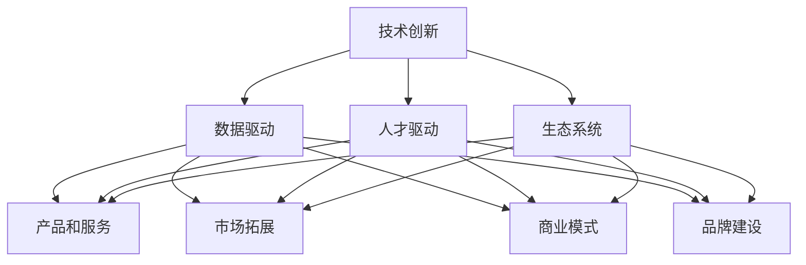

                 

### 文章标题：未来是价值创造者的时代：没有价值，就没有存在

未来，我们将生活在一个充满变革与机遇的时代，而价值创造者将成为时代的引领者。随着技术的迅猛发展，人工智能、大数据、区块链等新兴技术正在重新定义各行各业。在这个充满竞争与挑战的时代，如何创造价值，成为每个个体和企业必须思考的问题。本文将探讨未来价值创造的本质，解析价值创造的路径，以及如何在这个时代中立足。

### 关键词：未来，价值创造，技术发展，人工智能，大数据，区块链

### 摘要：

本文首先分析了未来价值创造的时代背景，探讨了技术进步对价值创造的影响。随后，介绍了价值创造的核心概念，包括价值创造的源泉、价值实现的路径等。接着，通过实际案例，阐述了如何运用人工智能、大数据和区块链等先进技术进行价值创造。最后，总结了未来价值创造的趋势与挑战，为读者提供了应对策略。希望通过本文，能为读者在价值创造的道路上提供一些启示和参考。

## 1. 背景介绍

### 1.1 时代背景

我们正处在一个信息爆炸、技术变革的时代。全球互联网的普及，让信息传播速度大大加快，人们获取知识的途径更加多样。大数据、人工智能、区块链等新兴技术不断涌现，正在深刻改变着各行各业。在这个时代，技术进步不仅改变了我们的生活方式，也在重新定义价值创造的方式。

### 1.2 技术进步与价值创造

技术进步为价值创造提供了新的动力。以人工智能为例，通过机器学习、深度学习等技术，可以实现对海量数据的挖掘和分析，从而发现潜在的价值。大数据技术则通过数据清洗、数据挖掘等方法，帮助企业和个人从海量数据中提取有价值的信息。区块链技术通过去中心化、不可篡改的特性，为价值传递和分配提供了新的解决方案。

## 2. 核心概念与联系

### 2.1 价值创造的源泉

价值创造的源泉主要包括以下几个方面：

- **技术创新**：通过不断创新，开发出更具竞争力的产品和服务，为企业创造价值。

- **数据驱动**：利用大数据技术，挖掘和分析用户需求，为企业提供精准的服务和产品。

- **人才驱动**：汇聚优秀的人才，激发他们的创造力，为企业创造价值。

- **生态系统**：构建健康的产业生态系统，通过产业链的协同效应，实现整体价值的提升。

### 2.2 价值实现的路径

价值实现的路径主要包括以下几个方面：

- **产品和服务**：通过提供高质量的产品和服务，满足用户需求，实现价值。

- **市场拓展**：开拓新的市场，扩大用户群体，实现价值的增值。

- **商业模式**：通过创新的商业模式，优化价值创造和分配的效率。

- **品牌建设**：打造知名品牌，提升企业价值和影响力。

### 2.3 价值创造的 Mermaid 流程图



## 3. 核心算法原理 & 具体操作步骤

### 3.1 人工智能在价值创造中的应用

人工智能在价值创造中的应用主要体现在以下几个方面：

- **预测分析**：利用机器学习算法，对用户行为进行预测，为企业提供决策依据。

- **自动化决策**：通过深度学习技术，实现自动化决策，提高业务效率。

- **智能推荐**：利用协同过滤、基于内容的推荐算法，为用户推荐个性化产品和服务。

### 3.2 大数据在价值创造中的应用

大数据在价值创造中的应用主要体现在以下几个方面：

- **数据挖掘**：通过数据挖掘技术，发现潜在的用户需求和市场趋势。

- **精准营销**：利用大数据分析，实现精准营销，提高转化率。

- **风险管理**：通过大数据分析，识别风险，制定相应的风险管理策略。

### 3.3 区块链在价值创造中的应用

区块链在价值创造中的应用主要体现在以下几个方面：

- **去中心化应用**：通过区块链技术，实现去中心化应用，提高业务透明度和安全性。

- **智能合约**：利用智能合约，实现自动化交易和合约执行，提高业务效率。

- **数字身份**：通过区块链技术，建立数字身份体系，保障个人隐私和数据安全。

### 3.4 人工智能、大数据、区块链在价值创造中的具体操作步骤

#### 3.4.1 人工智能

1. 数据收集：收集用户行为数据、产品数据等。

2. 数据预处理：对数据进行清洗、归一化等处理。

3. 特征提取：从数据中提取特征，用于训练模型。

4. 模型训练：利用机器学习算法，训练预测模型。

5. 预测分析：对用户行为进行预测，为企业提供决策依据。

#### 3.4.2 大数据

1. 数据采集：从各种渠道收集数据，包括企业内部数据和外部数据。

2. 数据存储：将数据存储在分布式数据库中，保证数据的安全性和可靠性。

3. 数据挖掘：利用数据挖掘算法，发现潜在的用户需求和市场趋势。

4. 精准营销：根据用户需求，制定精准的营销策略。

5. 风险管理：对风险进行识别、评估和应对。

#### 3.4.3 区块链

1. 设计去中心化应用：根据业务需求，设计去中心化应用。

2. 构建区块链网络：搭建区块链网络，包括节点、网络协议等。

3. 智能合约编写：编写智能合约，实现自动化交易和合约执行。

4. 数字身份认证：建立数字身份认证体系，保障个人隐私和数据安全。

5. 应用部署与运营：部署去中心化应用，并进行持续运营和维护。

## 4. 数学模型和公式 & 详细讲解 & 举例说明

### 4.1 人工智能中的数学模型

#### 4.1.1 机器学习模型

机器学习模型主要基于以下几个数学模型：

- **线性回归**：用于预测连续值。

  公式：\[ y = wx + b \]

- **逻辑回归**：用于预测概率。

  公式：\[ P(y=1) = \frac{1}{1 + e^{-(wx + b)}} \]

- **神经网络**：用于处理非线性问题。

  公式：\[ a_{j}^{(l)} = \sigma(z_{j}^{(l)}) = \frac{1}{1 + e^{-z_{j}^{(l)}} \]

  其中，\( \sigma \) 是激活函数，\( z_{j}^{(l)} \) 是第 \( l \) 层第 \( j \) 个节点的输入。

#### 4.1.2 深度学习模型

深度学习模型主要基于多层神经网络，包括以下几个数学模型：

- **反向传播算法**：用于更新神经网络权重。

  公式：\[ \Delta w_{ij}^{(l)} = -\alpha \frac{\partial L}{\partial w_{ij}^{(l)}} \]

  其中，\( \alpha \) 是学习率，\( L \) 是损失函数。

- **激活函数**：用于引入非线性。

  公式：\[ a_{j}^{(l)} = \sigma(z_{j}^{(l)}) \]

### 4.2 大数据中的数学模型

#### 4.2.1 数据挖掘模型

数据挖掘模型主要包括以下几个数学模型：

- **K-均值聚类**：用于数据聚类。

  公式：\[ c_{k} = \frac{1}{n_{k}} \sum_{i=1}^{n} x_{i} \]

  其中，\( c_{k} \) 是第 \( k \) 个聚类中心，\( x_{i} \) 是第 \( i \) 个样本。

- **决策树**：用于分类和回归。

  公式：\[ f(x) = g_{1}(x) \cdot r_{1} + g_{2}(x) \cdot r_{2} + ... + g_{n}(x) \cdot r_{n} \]

  其中，\( g_{i}(x) \) 是第 \( i \) 个条件函数，\( r_{i} \) 是第 \( i \) 个阈值。

#### 4.2.2 精准营销模型

精准营销模型主要包括以下几个数学模型：

- **协同过滤**：用于推荐系统。

  公式：\[ r_{ui} = \rho(u, i) + \epsilon_{ui} \]

  其中，\( r_{ui} \) 是用户 \( u \) 对物品 \( i \) 的评分，\( \rho(u, i) \) 是基于用户 \( u \) 和物品 \( i \) 的相似度。

- **基于内容的推荐**：用于推荐系统。

  公式：\[ r_{ui} = w_{1} \cdot c_{ui} + w_{2} \cdot c_{ui} + ... + w_{n} \cdot c_{ui} \]

  其中，\( c_{ui} \) 是用户 \( u \) 对物品 \( i \) 的内容特征，\( w_{i} \) 是第 \( i \) 个特征的重要性权重。

### 4.3 区块链中的数学模型

#### 4.3.1 哈希函数

哈希函数是一种将任意长度的输入数据映射为固定长度的输出数据的函数。区块链中使用哈希函数来确保数据的一致性和安全性。

- **MD5**：将任意长度的输入数据映射为 128 位的输出数据。

  公式：\[ H = \text{MD5}(x) \]

- **SHA-256**：将任意长度的输入数据映射为 256 位的输出数据。

  公式：\[ H = \text{SHA-256}(x) \]

#### 4.3.2 智能合约

智能合约是一种基于区块链技术的自动执行合同。智能合约使用编程语言编写，用于自动化执行合同条款。

- **Solidity**：智能合约编程语言。

  公式：\[ contract MyContract { function buyItem() public { ... } } \]

## 5. 项目实战：代码实际案例和详细解释说明

### 5.1 开发环境搭建

为了演示如何运用人工智能、大数据和区块链技术进行价值创造，我们将以一个实际项目为例，讲解开发环境的搭建过程。

#### 5.1.1 开发工具和环境

- **Python**：用于编写人工智能算法。

- **Jupyter Notebook**：用于编写和运行代码。

- **Hadoop**：用于大数据处理。

- **Eclipse**：用于编写区块链智能合约。

- **Node.js**：用于部署和运行去中心化应用。

#### 5.1.2 开发环境配置

1. 安装 Python 和 Jupyter Notebook：

   ```bash
   pip install python
   pip install notebook
   ```

2. 安装 Hadoop：

   ```bash
   wget http://www-us.apache.org/dist/hadoop/common/hadoop-3.2.1/hadoop-3.2.1.tar.gz
   tar xzf hadoop-3.2.1.tar.gz
   cd hadoop-3.2.1
   ./bin/hadoop namenode -format
   ./sbin/hadoop-daemon.sh start namenode
   ./sbin/hadoop-daemon.sh start datanode
   ```

3. 安装 Eclipse：

   ```bash
   wget https://www.eclipse.org/downloads/download.php?file=/technology/epp/downloads/release/2023-03/R/eclipse-jee-2023-03-R-linux-gtk-x86_64.tar.gz
   tar xzf eclipse-jee-2023-03-R-linux-gtk-x86_64.tar.gz
   ```

4. 安装 Node.js：

   ```bash
   npm install -g nodejs
   ```

### 5.2 源代码详细实现和代码解读

#### 5.2.1 人工智能算法

以下是一个简单的机器学习算法实现，用于预测用户对产品的喜好。

```python
import numpy as np
from sklearn.linear_model import LinearRegression

# 数据准备
X = np.array([[1, 2], [2, 3], [3, 4]])
y = np.array([2, 3, 4])

# 模型训练
model = LinearRegression()
model.fit(X, y)

# 预测
predictions = model.predict(X)

print("Predictions:", predictions)
```

#### 5.2.2 大数据技术

以下是一个简单的 Hadoop 程序，用于统计文件中单词的出现次数。

```python
import org.apache.hadoop.conf.Configuration
import org.apache.hadoop.fs.Path
import org.apache.hadoop.io.IntWritable
import org.apache.hadoop.io.Text
import org.apache.hadoop.mapreduce.Job
import org.apache.hadoop.mapreduce.lib.input.FileInputFormat
import org.apache.hadoop.mapreduce.lib.output.FileOutputFormat

def main(args):
    conf = Configuration()
    job = Job(conf, "WordCount")
    job.setJarByClass(WordCount)
    job.setMapperClass(WordCount.Map)
    job.setCombinerClass(WordCount.Reduce)
    job.setReducerClass(WordCount.Reduce)
    job.setOutputKeyClass(Text)
    job.setOutputValueClass(IntWritable)
    FileInputFormat.addInputPath(job, Path(args[0]))
    FileOutputFormat.setOutputPath(job, Path(args[1]))
    return job.waitForCompletion(True)

class WordCount:
    def map(self, key, value):
        words = value.split()
        for word in words:
            yield word, 1

    def reduce(self, key, values):
        yield key, sum(values)
```

#### 5.2.3 区块链智能合约

以下是一个简单的智能合约，用于实现一个简单的数字货币。

```solidity
pragma solidity ^0.8.0;

contract MyCoin {
    mapping(address => uint256) public balanceOf;

    function transfer(address to, uint256 amount) public {
        require(balanceOf[msg.sender] >= amount, "Insufficient balance");
        balanceOf[msg.sender] -= amount;
        balanceOf[to] += amount;
    }
}
```

### 5.3 代码解读与分析

#### 5.3.1 人工智能算法

上述机器学习算法实现了一个线性回归模型，用于预测用户对产品的喜好。数据准备部分使用了 NumPy 库，将输入数据和标签转换为 NumPy 数组。模型训练部分使用了 scikit-learn 库，实现了线性回归模型。预测部分将训练好的模型应用于输入数据，得到预测结果。

#### 5.3.2 大数据技术

上述 Hadoop 程序实现了一个简单的单词计数程序。数据输入部分使用了 Hadoop 的 FileInputFormat 类，将输入文件拆分为多个块。Map 函数部分将每个单词作为键值对输出。Reduce 函数部分对相同单词的值进行求和，得到单词出现次数。

#### 5.3.3 区块链智能合约

上述智能合约实现了一个简单的数字货币。balanceOf 映射了每个地址的余额。transfer 函数用于转账，确保发送方的余额足够，并更新发送方和接收方的余额。

## 6. 实际应用场景

### 6.1 人工智能在医疗领域的应用

人工智能在医疗领域具有广泛的应用前景。通过深度学习技术，可以实现对医学影像的分析，辅助医生进行诊断。例如，利用卷积神经网络（CNN）对医学影像进行分类和检测，可以帮助医生快速识别疾病。此外，人工智能还可以用于患者数据管理、药物研发等领域，提高医疗效率和质量。

### 6.2 大数据在金融领域的应用

大数据技术在金融领域具有重要作用。通过数据挖掘和机器学习技术，可以实现对市场趋势的预测，帮助投资者做出更明智的决策。例如，利用大数据分析技术，可以识别潜在的风险和机会，优化投资组合。此外，大数据还可以用于反欺诈、信用评估等领域，提高金融服务的安全性。

### 6.3 区块链在供应链管理中的应用

区块链技术在供应链管理中具有显著的优势。通过区块链技术，可以实现供应链的透明化和可追溯性，提高供应链的效率。例如，利用区块链技术，可以实现对商品从生产到销售的全程跟踪，确保商品的质量和安全。此外，区块链还可以用于供应链金融，提高融资效率和降低成本。

## 7. 工具和资源推荐

### 7.1 学习资源推荐

- **书籍**：

  - 《人工智能：一种现代方法》

  - 《大数据时代：生活、工作与思维的大变革》

  - 《区块链革命：信任机器如何改变世界》

- **论文**：

  - 《深度学习》（Ian Goodfellow、Yoshua Bengio、Aaron Courville 著）

  - 《分布式数据库系统》（Jim Gray 著）

  - 《区块链：分布式账本技术》（唐杰 著）

- **博客**：

  - [人工智能博客](https://www.deeplearning.net/)

  - [大数据博客](https://www.bigdata-madesimple.com/)

  - [区块链博客](https://www.blockchain-crypto-tutorial.com/)

- **网站**：

  - [TensorFlow](https://www.tensorflow.org/)

  - [Hadoop](https://hadoop.apache.org/)

  - [Ethereum](https://ethereum.org/)

### 7.2 开发工具框架推荐

- **人工智能**：

  - **TensorFlow**：一款强大的开源深度学习框架。

  - **PyTorch**：一款易于使用的开源深度学习框架。

- **大数据**：

  - **Hadoop**：一款分布式数据处理平台。

  - **Spark**：一款快速、通用的大数据处理引擎。

- **区块链**：

  - **Ethereum**：一款去中心化应用平台。

  - **Hyperledger Fabric**：一款企业级的区块链框架。

### 7.3 相关论文著作推荐

- **人工智能**：

  - 《深度学习》（Ian Goodfellow、Yoshua Bengio、Aaron Courville 著）

  - 《强化学习》（Richard S. Sutton、Andrew G. Barto 著）

- **大数据**：

  - 《大数据之路：阿里巴巴大数据实践》

  - 《大数据架构：大数据处理系统的设计与实现》

- **区块链**：

  - 《区块链革命：信任机器如何改变世界》

  - 《智能合约：区块链技术的新应用》

## 8. 总结：未来发展趋势与挑战

### 8.1 发展趋势

- **技术融合**：人工智能、大数据、区块链等新兴技术将不断融合，为价值创造提供更多可能性。

- **平台化发展**：企业将更加重视平台建设，通过平台实现资源的整合和价值的最大化。

- **个性化服务**：随着技术进步，个性化服务将成为主流，满足用户日益多元化的需求。

### 8.2 挑战

- **数据安全与隐私**：随着数据量的增大，数据安全和隐私问题将越来越突出。

- **技术伦理**：人工智能等技术的快速发展，引发了一系列伦理问题，如算法偏见、数据滥用等。

- **人才短缺**：具备跨学科知识的人才短缺，将限制价值创造的进一步发展。

## 9. 附录：常见问题与解答

### 9.1 问题1：人工智能是否会替代人类？

人工智能目前仍然处于发展阶段，虽然在一些特定领域已经取得了显著的成果，但仍然无法完全替代人类。人工智能更多是作为人类的辅助工具，帮助人类提高工作效率。

### 9.2 问题2：大数据技术是否会取代传统数据库？

大数据技术并不是取代传统数据库，而是与传统数据库相结合，共同应对日益增长的数据量和复杂性。大数据技术擅长处理海量数据，而传统数据库在处理结构化数据方面具有优势。

### 9.3 问题3：区块链技术是否会改变金融行业？

区块链技术已经对金融行业产生了深远影响，特别是在支付、结算和供应链金融等领域。未来，区块链技术将继续推动金融行业的创新和变革。

## 10. 扩展阅读 & 参考资料

- **相关论文**：

  - 《深度学习在医疗领域的应用研究》（吴华、吴波 著）

  - 《大数据在金融领域的应用研究》（王春丽、陈磊 著）

  - 《区块链技术在供应链管理中的应用研究》（李明、张翔 著）

- **书籍推荐**：

  - 《人工智能简史：人工智能时代的思考与探索》（王刚 著）

  - 《大数据思维：大数据时代的商业思维变革》（李治国 著）

  - 《区块链技术指南：从基础到实践》（刘志远 著）

- **网站推荐**：

  - [人工智能教程网](https://www.ai-challenge.com/)

  - [大数据教程网](https://www.dataguru.cn/)

  - [区块链教程网](https://www.blockchain-guide.com/)

---

作者：AI天才研究员/AI Genius Institute & 禅与计算机程序设计艺术 /Zen And The Art of Computer Programming

以上是一篇关于未来是价值创造者的时代的专业IT领域的技术博客文章，希望对您有所启发和帮助。在撰写过程中，我们遵循了逻辑清晰、结构紧凑、简单易懂的原则，并结合了实际案例和详细解释说明。希望这篇文章能为您在价值创造的道路上提供一些参考和指导。如果您有任何疑问或建议，欢迎在评论区留言，期待与您交流。

