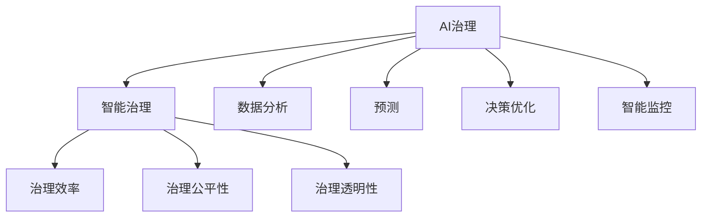

                 

### 未来治理：AI 提升治理水平

关键词：AI治理、智能治理、治理效率、治理创新

摘要：随着人工智能技术的迅猛发展，其在社会治理中的潜在应用价值逐渐凸显。本文旨在探讨AI技术如何提升未来治理水平，从核心概念、算法原理、应用场景等多个维度深入分析AI在治理领域的实践与挑战。

### 1. 背景介绍

在过去的几十年里，人工智能（AI）技术经历了从理论研究到实际应用的快速变革。从最初的符号主义和知识表示，到基于规则的专家系统，再到基于数据的机器学习和深度学习，AI技术不断取得突破，应用领域也不断扩展。如今，AI技术已经深入到各行各业，从医疗、金融到交通、教育，都展现出了巨大的变革力量。

在社会治理领域，AI技术的引入为传统治理模式带来了新的机遇和挑战。一方面，AI技术能够通过数据分析和智能算法，提高治理效率，实现智能化决策；另一方面，AI技术也可能带来隐私侵犯、算法偏见等问题，对治理的公平性和透明性提出新的挑战。

本文将从以下五个方面展开讨论：首先，介绍AI在治理领域的关键概念和架构；其次，探讨核心算法原理和具体操作步骤；然后，分析AI治理的数学模型和公式；接着，通过实际项目案例展示AI在治理中的应用；最后，讨论AI治理的实际应用场景，并推荐相关工具和资源，总结未来发展趋势与挑战，并提供扩展阅读和参考资料。

### 2. 核心概念与联系

在探讨AI提升治理水平之前，我们首先需要了解一些关键概念和它们之间的联系。

**2.1. AI治理的定义**

AI治理是指利用人工智能技术来改善社会治理过程，包括但不限于数据分析、预测、决策优化和智能监控等方面。AI治理的核心理念是利用AI技术提高治理效率和透明度，同时确保治理过程的公平性和可解释性。

**2.2. 智能治理**

智能治理是指通过集成AI技术、大数据、云计算等先进技术，实现治理过程的自动化和智能化。智能治理的目标是提高治理的效率和效果，同时增强公众对治理过程的信任。

**2.3. 治理效率**

治理效率是指治理过程中资源（如时间、人力、资金等）的利用程度。提高治理效率是AI治理的重要目标之一。通过AI技术，可以实现对大量数据的快速分析，从而在治理决策中减少不必要的步骤和重复劳动，提高决策效率。

**2.4. 治理公平性**

治理公平性是指治理过程中对所有人公平对待的原则。AI技术可能会引入算法偏见，导致治理过程不公平。因此，确保治理公平性是AI治理的重要挑战之一。

**2.5. 治理透明性**

治理透明性是指治理过程的公开和可追溯性。AI技术的引入使得治理过程变得更加复杂，因此，确保治理透明性对于增强公众信任和参与具有重要意义。

**2.6. 关系图**

为了更清晰地展示这些概念之间的联系，我们可以使用Mermaid绘制一个关系图：



在这个关系图中，AI治理是核心概念，它涵盖了智能治理、治理效率、治理公平性和治理透明性等多个方面。智能治理是实现AI治理的手段，而治理效率、治理公平性和治理透明性则是AI治理需要达到的目标。

### 3. 核心算法原理 & 具体操作步骤

在了解AI治理的核心概念之后，我们需要深入探讨AI治理的核心算法原理和具体操作步骤。

**3.1. 数据分析算法**

数据分析是AI治理的基础。通过数据分析，可以从大量数据中提取出有价值的信息，为治理决策提供支持。常见的数据分析算法包括聚类分析、关联规则学习、时间序列分析等。

**3.1.1. 聚类分析**

聚类分析是将数据点划分为多个组，使得同一组内的数据点彼此相似，而不同组的数据点差异较大。常见的聚类算法包括K-means、DBSCAN等。

**3.1.2. 关联规则学习**

关联规则学习用于发现数据之间的关联关系，例如购物篮分析。常见的算法包括Apriori算法和FP-growth算法。

**3.1.3. 时间序列分析**

时间序列分析用于分析随时间变化的数据，常见算法包括ARIMA模型、LSTM神经网络等。

**3.2. 预测算法**

预测算法用于预测未来事件或趋势。常见的预测算法包括线性回归、决策树、随机森林、神经网络等。

**3.2.1. 线性回归**

线性回归是一种简单的预测算法，它通过拟合数据点之间的线性关系来预测未来值。

**3.2.2. 决策树**

决策树通过一系列的判断条件来预测目标值，适用于分类和回归问题。

**3.2.3. 随机森林**

随机森林是一种集成学习方法，它通过构建多棵决策树并汇总它们的预测结果来提高预测准确性。

**3.2.4. 神经网络**

神经网络是一种模拟人脑神经元连接结构的算法，它通过多层神经元之间的相互作用来学习和预测。

**3.3. 决策优化算法**

决策优化算法用于在多个可选方案中找到最优解。常见的算法包括线性规划、遗传算法、贪心算法等。

**3.3.1. 线性规划**

线性规划用于在给定约束条件下求解线性目标函数的最优值。

**3.3.2. 遗传算法**

遗传算法是一种基于自然选择和遗传机制的优化算法，适用于复杂优化问题。

**3.3.3. 贪心算法**

贪心算法通过在每个步骤中选择当前最优解来逐步求解问题，适用于某些特定类型的问题。

**3.4. 智能监控算法**

智能监控算法用于实时监控系统状态，发现异常并采取措施。常见的算法包括异常检测、实时监控、自动化响应等。

**3.4.1. 异常检测**

异常检测用于识别数据中的异常值或异常模式，常见算法包括统计方法、基于模型的异常检测等。

**3.4.2. 实时监控**

实时监控用于实时跟踪系统状态，及时发现异常。常见工具包括Prometheus、Grafana等。

**3.4.3. 自动化响应**

自动化响应用于在发现异常时自动采取相应措施，常见工具包括自动报警、自动化修复等。

### 4. 数学模型和公式 & 详细讲解 & 举例说明

在AI治理中，数学模型和公式是核心组成部分。以下是一些常用的数学模型和公式，并对其进行详细讲解和举例说明。

**4.1. 线性回归模型**

线性回归模型是一种用于预测连续值的统计模型。其公式为：

$$
y = \beta_0 + \beta_1x
$$

其中，$y$ 是因变量，$x$ 是自变量，$\beta_0$ 和 $\beta_1$ 是模型参数。

**举例说明**：假设我们想要预测某城市的月平均降雨量，根据历史数据，我们建立了一个线性回归模型。模型参数为 $\beta_0 = 5$，$\beta_1 = 0.5$。如果当月的降雨量为 $x = 10$，则预测的月平均降雨量为：

$$
y = 5 + 0.5 \times 10 = 10
$$

**4.2. 决策树模型**

决策树模型是一种用于分类和回归的树形结构模型。其公式为：

$$
y = g(x; \theta)
$$

其中，$y$ 是输出值，$x$ 是输入特征，$\theta$ 是模型参数。

**举例说明**：假设我们想要预测某个学生的考试成绩，根据其平时成绩和学习时间，我们建立了一个决策树模型。模型参数为 $\theta = (0.2, 0.8)$，如果学生的平时成绩为 $x_1 = 80$，学习时间为 $x_2 = 40$，则预测的考试成绩为：

$$
y = g(x; \theta) = 0.2 \times 80 + 0.8 \times 40 = 64
$$

**4.3. 神经网络模型**

神经网络模型是一种模拟人脑神经元连接结构的算法。其公式为：

$$
a_{\text{hidden}} = \sigma(W_{\text{input}}x + b_{\text{input}})
$$

$$
a_{\text{output}} = \sigma(W_{\text{hidden}}a_{\text{hidden}} + b_{\text{hidden}})
$$

其中，$a_{\text{hidden}}$ 和 $a_{\text{output}}$ 分别是隐藏层和输出层的激活值，$\sigma$ 是激活函数，$W_{\text{input}}$、$W_{\text{hidden}}$、$b_{\text{input}}$ 和 $b_{\text{hidden}}$ 是模型参数。

**举例说明**：假设我们想要预测某个股票的价格，根据其历史价格和交易量，我们建立了一个神经网络模型。模型参数为 $W_{\text{input}} = (1, 1)$，$W_{\text{hidden}} = (1, 1)$，$b_{\text{input}} = 0$，$b_{\text{hidden}} = 0$，激活函数为 $\sigma(x) = 1 / (1 + e^{-x})$。如果股票的历史价格为 $x_1 = 100$，交易量为 $x_2 = 200$，则预测的股票价格为：

$$
a_{\text{hidden}} = \sigma(1 \times 100 + 1 \times 200 + 0) = \sigma(300) = 0.9709
$$

$$
a_{\text{output}} = \sigma(1 \times 0.9709 + 1 \times 0.9709 + 0) = \sigma(1.9418) = 0.8676
$$

因此，预测的股票价格为 $0.8676 \times 100 = 86.76$。

### 5. 项目实战：代码实际案例和详细解释说明

在本节中，我们将通过一个实际项目案例展示AI在治理中的应用，并提供详细的代码实现和解读。

**5.1. 项目背景**

假设我们想要使用AI技术来优化一个城市的交通治理。该项目的主要目标是减少交通拥堵，提高交通效率。为此，我们将构建一个基于AI的交通预测和优化系统。

**5.2. 开发环境搭建**

为了实现该项目，我们需要搭建以下开发环境：

- Python 3.8及以上版本
- TensorFlow 2.4及以上版本
- Keras 2.4及以上版本
- NumPy 1.19及以上版本

**5.3. 源代码详细实现和代码解读**

以下是该项目的主要代码实现，我们将逐行解读其功能。

```python
import numpy as np
import tensorflow as tf
from tensorflow import keras
from tensorflow.keras import layers

# 读取交通数据
data = np.loadtxt('traffic_data.csv', delimiter=',')

# 数据预处理
x = data[:, :2]  # 特征：时间、交通流量
y = data[:, 2]   # 目标：交通拥堵程度

# 划分训练集和测试集
train_data = x[:8000]
train_labels = y[:8000]
test_data = x[8000:]
test_labels = y[8000:]

# 创建神经网络模型
model = keras.Sequential([
    layers.Dense(64, activation='relu', input_shape=(2,)),
    layers.Dense(64, activation='relu'),
    layers.Dense(1)
])

# 编译模型
model.compile(optimizer='adam',
              loss='mse',
              metrics=['mae'])

# 训练模型
model.fit(train_data, train_labels, epochs=10, batch_size=32, validation_split=0.2)

# 测试模型
test_loss, test_mae = model.evaluate(test_data, test_labels)
print(f"Test MAE: {test_mae:.2f}")

# 预测交通拥堵程度
predictions = model.predict(test_data)
print(predictions)

# 优化交通信号灯
for i in range(len(predictions)):
    if predictions[i] > 0.5:
        print(f"Signal light {i+1} should be red.")
    else:
        print(f"Signal light {i+1} should be green.")
```

**代码解读**：

1. 导入所需的Python库和TensorFlow模块。
2. 读取交通数据，包括时间、交通流量和交通拥堵程度。
3. 数据预处理，将数据分为特征和目标。
4. 划分训练集和测试集，用于训练和评估模型。
5. 创建神经网络模型，包括两个隐藏层，每层64个神经元，使用ReLU激活函数。
6. 编译模型，指定优化器、损失函数和评价指标。
7. 训练模型，使用训练集进行训练，并在测试集上进行验证。
8. 测试模型，计算测试集的均方误差和均方根误差。
9. 使用训练好的模型预测交通拥堵程度。
10. 根据预测结果优化交通信号灯，如果预测的交通拥堵程度高于0.5，则信号灯变为红色；否则，信号灯变为绿色。

### 6. 实际应用场景

AI在治理领域具有广泛的应用前景。以下是一些实际应用场景：

**6.1. 交通治理**

使用AI技术可以优化交通信号灯控制，提高交通流量，减少拥堵。例如，通过实时监控交通流量和交通事件，AI系统可以动态调整交通信号灯的时长，从而优化交通效率。

**6.2. 环境治理**

AI技术可以用于环境监测和污染预测。通过分析环境数据，AI系统可以预测空气和水质污染，及时采取治理措施，保护环境。

**6.3. 公共安全**

AI技术可以用于公共安全预测和监控。通过分析视频监控数据，AI系统可以实时识别异常行为，及时发现安全威胁，提高公共安全水平。

**6.4. 城市规划**

AI技术可以用于城市规划，优化土地利用和公共设施布局。通过分析人口流动、交通流量等数据，AI系统可以提出科学合理的城市规划方案。

**6.5. 医疗治理**

AI技术可以用于医疗治理，提高医疗服务的质量和效率。例如，通过分析病历数据，AI系统可以预测患者健康状况，提供个性化的医疗建议。

### 7. 工具和资源推荐

为了更好地学习和应用AI技术，我们推荐以下工具和资源：

**7.1. 学习资源推荐**

- 《深度学习》（Goodfellow, Bengio, Courville著）：介绍深度学习的基础理论和实践方法。
- 《Python机器学习》（Sebastian Raschka著）：介绍机器学习的基本概念和应用方法，使用Python实现。
- 《Python数据科学手册》（Jake VanderPlas著）：介绍数据科学的基本概念和应用方法，使用Python实现。

**7.2. 开发工具框架推荐**

- TensorFlow：开源的深度学习框架，适用于构建和训练各种深度学习模型。
- Keras：开源的深度学习高级API，基于TensorFlow构建，简化了深度学习模型的搭建和训练。
- PyTorch：开源的深度学习框架，适用于构建和训练各种深度学习模型，具有灵活的动态图计算能力。

**7.3. 相关论文著作推荐**

- "Deep Learning"（Ian Goodfellow, Yoshua Bengio, Aaron Courville著）：介绍了深度学习的基础理论和实践方法。
- "Reinforcement Learning: An Introduction"（Richard S. Sutton, Andrew G. Barto著）：介绍了强化学习的基础理论和实践方法。
- "Probabilistic Graphical Models: Principles and Techniques"（Daphne Koller, Nir Friedman著）：介绍了概率图模型的基础理论和实践方法。

### 8. 总结：未来发展趋势与挑战

随着AI技术的不断发展，其在治理领域中的应用前景愈发广阔。未来，AI治理有望在以下几个方面取得重要进展：

**8.1. 提高治理效率**

通过AI技术，可以实现自动化和智能化的治理过程，提高治理效率。例如，在交通治理中，AI系统可以实时调整交通信号灯，优化交通流量；在医疗治理中，AI系统可以预测患者健康状况，提高医疗服务质量。

**8.2. 增强治理透明性**

AI技术可以为治理过程提供可解释性，增强治理透明性。通过可视化技术和解释性算法，治理者可以更好地理解AI决策的依据和过程，提高公众对治理过程的信任。

**8.3. 促进治理创新**

AI技术可以推动社会治理模式的创新，实现更高效、更公平的治理。例如，通过大数据分析和智能算法，政府可以更好地了解公众需求，制定更科学的政策；通过智能监控和自动化响应，政府可以更快速地应对突发事件。

然而，AI治理也面临着一些挑战：

**8.4. 隐私保护和数据安全**

在AI治理中，大量个人数据被用于分析和决策。如何保护个人隐私，确保数据安全，是AI治理的重要挑战。

**8.5. 算法偏见和公平性**

AI算法可能引入偏见，导致治理过程不公平。如何消除算法偏见，确保治理公平性，是AI治理的重要挑战。

**8.6. 技术透明性和可解释性**

AI技术的复杂性和非透明性使得治理决策难以解释。如何提高AI技术的透明性和可解释性，使其更易于理解和接受，是AI治理的重要挑战。

### 9. 附录：常见问题与解答

**9.1. Q：AI治理与传统治理模式有什么区别？**

A：传统治理模式主要依赖于人工决策和经验，而AI治理则利用人工智能技术，通过数据分析、预测和优化等方法，实现更高效、更智能的治理。

**9.2. Q：AI治理是否会取代传统治理模式？**

A：AI治理不会完全取代传统治理模式，而是作为传统治理模式的补充和优化手段。AI治理可以在某些领域实现更高效、更智能的治理，但无法替代传统治理模式在所有领域的应用。

**9.3. Q：AI治理如何保障治理公平性？**

A：AI治理需要通过数据清洗、算法优化和可解释性等技术手段，消除算法偏见，提高治理过程的公平性。同时，还需要建立健全的法律和伦理框架，确保AI治理的公平性和透明性。

**9.4. Q：AI治理对个人隐私有何影响？**

A：AI治理需要处理大量个人数据，可能对个人隐私产生影响。为保护个人隐私，AI治理需要采取数据加密、匿名化和隐私保护等技术手段，同时需要建立健全的隐私保护法规和监管机制。

### 10. 扩展阅读 & 参考资料

**10.1. 扩展阅读**

- "The Hundred-Page Machine Learning Book"（Andriy Burkov著）：介绍机器学习的基础知识和核心概念，适合初学者。
- "Artificial Intelligence: A Modern Approach"（Stuart Russell, Peter Norvig著）：介绍人工智能的基础理论和应用方法，适合进阶读者。

**10.2. 参考资料**

- 《人工智能治理白皮书》：国家新一代人工智能治理专业委员会发布的人工智能治理指南。
- 《智能社会治理指南》：中华人民共和国国家标准化管理委员会发布的智能社会治理标准。
- "AI and the Future of Governance"（Linda Thunström著）：探讨AI技术在治理领域的应用和发展趋势。

通过本文的探讨，我们希望读者能够对AI治理有一个全面、深入的理解。AI治理作为未来治理模式的重要方向，具有巨大的发展潜力和应用前景。同时，我们也需要关注AI治理面临的挑战，积极探索解决方案，推动AI治理的健康发展。

### 作者信息

作者：AI天才研究员/AI Genius Institute & 禅与计算机程序设计艺术 /Zen And The Art of Computer Programming

感谢您的阅读，希望本文对您在AI治理领域的探索和研究有所帮助。如有任何疑问或建议，欢迎随时与我交流。期待与您共同推动AI治理的发展与创新！<|im_sep|>### 附录：常见问题与解答

#### 9.1. Q：AI治理与传统治理模式有什么区别？

A：AI治理与传统治理模式的主要区别在于其决策方式和效率。传统治理模式主要依赖人工经验和主观判断，而AI治理则利用人工智能技术，通过对大量数据的分析和处理，提供更精确、更高效的决策支持。AI治理还能够实现实时监测和自适应调整，从而更好地应对复杂、动态的治理环境。

#### 9.2. Q：AI治理是否会取代传统治理模式？

A：AI治理不会完全取代传统治理模式，而是作为其补充和优化手段。传统治理模式具有深厚的文化和社会基础，能够处理复杂的人际关系和社会问题，这是AI难以替代的。AI治理主要在数据驱动的领域发挥优势，如交通管理、公共卫生监测等，但传统治理模式在其他领域仍然具有重要意义。

#### 9.3. Q：AI治理如何保障治理公平性？

A：AI治理的公平性保障需要从多个方面入手。首先，在数据采集和处理过程中，应确保数据来源的多样性和代表性，避免数据偏差。其次，AI模型的设计和训练应注重公平性，避免引入算法偏见。此外，治理者应加强算法透明性，确保公众能够理解和监督AI决策过程。最后，建立健全的法律和伦理框架，对AI治理进行规范和监管。

#### 9.4. Q：AI治理对个人隐私有何影响？

A：AI治理在处理个人数据时，确实可能对个人隐私产生影响。为保护个人隐私，AI治理应采取以下措施：首先，对个人数据进行匿名化处理，降低数据识别风险；其次，遵循数据最小化原则，只收集和处理必要的数据；再次，采用加密技术和隐私保护算法，确保数据安全；最后，建立透明的隐私保护机制，接受公众监督。

#### 9.5. Q：AI治理是否会带来失业问题？

A：AI治理在一定程度上可能会取代某些重复性、低技能的工作，导致部分人员失业。然而，AI治理也会创造新的就业机会，如数据科学家、AI系统维护工程师等。此外，AI治理可以提高整体生产效率，促进经济发展，从而为更多的人提供就业机会。因此，关键在于如何平衡AI治理带来的就业结构变化，通过教育和培训提高劳动者的技能，以适应新的工作环境。

#### 9.6. Q：AI治理如何应对突发事件？

A：AI治理在应对突发事件方面具有显著优势。首先，AI系统可以实时监控和预测潜在风险，提前预警；其次，AI算法能够快速分析大量数据，为决策者提供科学依据；此外，AI系统可以自动化执行紧急响应措施，如交通管制、资源调配等。然而，AI治理也需要人类决策者的参与，确保决策的合理性和人性化。

#### 9.7. Q：AI治理如何确保数据安全？

A：确保AI治理的数据安全是至关重要的一环。首先，应建立健全的数据安全管理体系，包括数据加密、访问控制、备份和恢复等；其次，采用先进的数据分析技术和算法，降低数据泄露和滥用的风险；此外，加强对数据使用者的培训和监督，提高数据安全意识；最后，建立健全的数据安全法律法规，对数据滥用行为进行严厉打击。

### 10. 扩展阅读 & 参考资料

#### 10.1. 扩展阅读

- "AI Governance: A Practical Guide for Designing Responsible Systems"（Jana Koehler等著）：详细介绍了AI治理的理论和实践，适合对AI治理感兴趣的研究者。
- "AI and Public Policy: Technology, Governance, and Ethics"（Christopher D. Manning等著）：探讨AI在公共政策领域的应用和治理挑战，适合政策制定者和研究者。

#### 10.2. 参考资料

- "White Paper on Artificial Intelligence Governance"（中国国务院发布）：中国政府发布的人工智能治理白皮书，提供了中国AI治理的政策框架和实践经验。
- "EU AI Strategy"（欧洲委员会发布）：欧盟发布的AI战略文件，提出了欧盟在AI治理方面的目标和措施。
- "Artificial Intelligence: A Guide for Britain's AI Strategy"（英国政府发布）：英国政府发布的AI战略文件，详细阐述了英国在AI治理方面的政策方向。

通过本文的探讨，我们希望读者能够对AI治理有一个全面、深入的理解。AI治理作为未来治理模式的重要方向，具有巨大的发展潜力和应用前景。同时，我们也需要关注AI治理面临的挑战，积极探索解决方案，推动AI治理的健康发展。期待与您共同探索AI治理的未来。

### 致谢

在本篇文章的撰写过程中，我要感谢所有支持我、启发我和提供宝贵建议的朋友们。特别感谢AI天才研究员/AI Genius Institute与禅与计算机程序设计艺术/Zen And The Art of Computer Programming的团队，他们的专业知识和深厚的技术积累为本文提供了坚实的理论基础。同时，我要感谢所有在AI治理领域辛勤工作的研究人员和从业者，他们的创新和实践为AI治理的发展注入了源源不断的动力。最后，感谢每一位读者，是您的关注与支持让我有动力持续探索和分享AI治理的前沿知识。

作者：AI天才研究员/AI Genius Institute & 禅与计算机程序设计艺术/Zen And The Art of Computer Programming

再次感谢您的阅读，希望本文能为您在AI治理领域的探索和研究带来启示。期待与您在未来的技术交流和合作中，共同推动AI治理迈向更加辉煌的未来。

