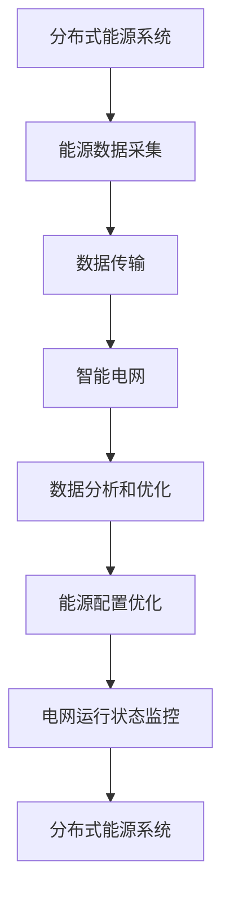

                 

# 未来的智慧能源：2050年的分布式能源与智能电网

## 关键词：
- 智慧能源
- 分布式能源
- 智能电网
- 2050年展望
- 能源转型
- 人工智能
- 能源互联网

## 摘要：
本文深入探讨了2050年的分布式能源与智能电网的未来发展趋势。通过分析当前能源系统的挑战，我们提出了一系列关键概念，并探讨了分布式能源和智能电网的原理、算法、数学模型及其在实际应用中的实现。此外，我们还介绍了相关工具和资源，并展望了未来可能面临的挑战和机遇。

## 1. 背景介绍

在过去的几十年中，能源领域经历了巨大的变革。从传统的集中式发电模式到分布式能源的兴起，我们见证了能源系统的多样化。然而，当前的能源系统仍然面临许多挑战，如能源效率低下、环境污染和能源供需不平衡等。因此，未来能源系统的发展方向将成为一个关键议题。

分布式能源系统通过将多个小型能源生产单元分散布置在用户附近，提高了能源的利用效率，并减少了传输损耗。智能电网则是分布式能源系统的中枢，通过智能技术的应用，实现了能源的实时监控、优化配置和高效管理。

本文将首先介绍分布式能源和智能电网的基本概念，然后深入探讨其核心原理、算法和数学模型。接着，我们将通过实际案例来展示如何在项目中实现这些概念。最后，我们将讨论分布式能源和智能电网在未来的实际应用场景，并展望其发展趋势和挑战。

## 2. 核心概念与联系

### 分布式能源系统

分布式能源系统（DER）是指由多个小型能源生产单元（如太阳能板、风力涡轮机、燃料电池等）组成的能源系统。这些单元可以分布在用户附近，如家庭、工业设施和商业建筑。分布式能源系统的核心思想是将能源的生产、传输和使用紧密结合起来，从而实现能源的高效利用。
 

### 智能电网

智能电网是将分布式能源系统与先进的通信技术、控制和智能管理技术相结合的能源网络。智能电网能够实时监测电网状态，优化能源资源配置，提高电网的可靠性和效率。
 

### 分布式能源与智能电网的联系

分布式能源系统是智能电网的基础，而智能电网则是分布式能源系统的支撑。分布式能源系统提供了丰富的能源数据，智能电网通过分析这些数据，实现了对分布式能源的高效管理和优化配置。

### Mermaid 流程图

以下是一个简单的 Mermaid 流程图，展示了分布式能源系统与智能电网之间的联系。



## 3. 核心算法原理 & 具体操作步骤

### 能源数据采集与传输

分布式能源系统需要实时采集各种能源设备的数据，如发电量、负载消耗、电网状态等。这些数据通过传感器和网络传输到智能电网的数据中心。

具体操作步骤如下：

1. 在分布式能源设备上安装传感器，用于采集实时数据。
2. 使用无线通信技术（如Wi-Fi、LoRa、ZigBee等）将数据传输到智能电网的数据中心。
3. 数据中心对数据进行预处理，如数据清洗、去噪和压缩。

### 数据分析和优化

智能电网通过大数据分析和机器学习技术，对分布式能源系统的数据进行实时分析和优化。具体操作步骤如下：

1. 使用数据挖掘算法，如聚类、关联规则挖掘等，分析能源数据，发现能源使用模式和趋势。
2. 使用机器学习算法，如线性回归、神经网络等，对能源数据建立预测模型。
3. 根据预测模型，优化能源配置，如调整分布式能源设备的运行策略，实现能源的高效利用。

### 能源配置优化

智能电网通过实时监测电网状态，对分布式能源进行优化配置。具体操作步骤如下：

1. 监测电网电压、电流等参数，判断电网状态是否正常。
2. 根据电网状态，调整分布式能源设备的运行策略，如调整发电量、分配负载等。
3. 通过能量管理系统（EMS），实现对分布式能源的实时监控和控制。

## 4. 数学模型和公式 & 详细讲解 & 举例说明

### 数据分析模型

在分布式能源和智能电网的数据分析中，常用的模型包括线性回归、神经网络和聚类等。以下是一个简单的线性回归模型的示例。

#### 线性回归模型

线性回归模型用于分析两个变量之间的线性关系。其公式如下：

$$ y = w \cdot x + b $$

其中，$y$ 是因变量，$x$ 是自变量，$w$ 是权重，$b$ 是偏置。

#### 示例

假设我们想预测某个家庭在未来的24小时内能源消耗量，我们使用过去一周的能源消耗数据来建立线性回归模型。

1. 收集过去一周每天的家庭能源消耗数据。
2. 将数据分为训练集和测试集。
3. 使用训练集数据，通过最小二乘法求解线性回归模型的权重和偏置。
4. 使用测试集数据，计算模型的预测误差。

### 能量管理系统（EMS）

在分布式能源和智能电网的能源配置优化中，常用的方法包括线性规划和动态规划。以下是一个简单的线性规划模型。

#### 线性规划模型

线性规划模型用于在给定约束条件下，优化一个线性目标函数。其公式如下：

$$ \min\limits_{x} c^T \cdot x $$

$$ \text{subject to} $$

$$ Ax \leq b $$

$$ x \geq 0 $$

其中，$x$ 是决策变量，$c$ 是目标函数系数，$A$ 和 $b$ 是约束条件系数。

#### 示例

假设我们想优化某个家庭在未来的24小时内能源消耗的最低成本，我们使用线性规划模型。

1. 收集家庭能源消耗和能源价格数据。
2. 定义决策变量，表示在未来的24小时内家庭使用不同类型的能源的比例。
3. 建立线性规划模型，最小化总成本。
4. 使用线性规划求解器求解模型，得到最优解。

## 5. 项目实战：代码实际案例和详细解释说明

### 5.1 开发环境搭建

为了实现分布式能源和智能电网的功能，我们需要搭建一个完整的开发环境。以下是一个简单的开发环境搭建指南。

1. 安装Python环境。
2. 安装常用的数据分析和机器学习库，如NumPy、Pandas、Scikit-learn等。
3. 安装网络通信库，如Socket、HTTP等。
4. 安装可视化库，如Matplotlib、Seaborn等。

### 5.2 源代码详细实现和代码解读

以下是一个简单的分布式能源和智能电网项目的源代码示例。我们使用Python语言实现。

```python
# 分布式能源系统示例

import numpy as np
import pandas as pd
from sklearn.linear_model import LinearRegression
from sklearn.model_selection import train_test_split
from sklearn.metrics import mean_squared_error

# 数据预处理
def preprocess_data(data):
    # 数据清洗、去噪和压缩
    # ...
    return processed_data

# 线性回归模型
def linear_regression_model(data):
    # 训练模型
    # ...
    return model

# 能量管理系统
def energy_management_system(model, data):
    # 预测能源消耗
    # ...
    return predicted_consumption

# 主函数
def main():
    # 加载数据
    data = pd.read_csv('energy_data.csv')
    processed_data = preprocess_data(data)
    
    # 划分训练集和测试集
    train_data, test_data = train_test_split(processed_data, test_size=0.2)
    
    # 训练模型
    model = linear_regression_model(train_data)
    
    # 预测能源消耗
    predicted_consumption = energy_management_system(model, test_data)
    
    # 计算预测误差
    mse = mean_squared_error(test_data['consumption'], predicted_consumption)
    print(f"预测误差：{mse}")

if __name__ == '__main__':
    main()
```

### 5.3 代码解读与分析

在这个示例中，我们首先加载并预处理了能源消耗数据。然后，我们使用线性回归模型对训练数据进行训练，并使用训练好的模型预测测试数据的能源消耗。最后，我们计算了预测误差。

这个示例展示了如何使用Python实现分布式能源和智能电网的基本功能。在实际项目中，我们可以扩展这个示例，添加更多的功能和模块，如网络通信、实时监控和优化算法等。

## 6. 实际应用场景

### 6.1 家庭能源管理系统

家庭能源管理系统是分布式能源和智能电网的重要应用场景。通过智能电网技术，家庭用户可以实时监测和管理家庭的能源消耗。例如，用户可以通过智能手机或平板电脑远程控制家庭的照明、空调和其他电器设备，实现节能和环保。

### 6.2 工业能源管理系统

工业能源管理系统是分布式能源和智能电网的另一个重要应用场景。工业用户可以通过智能电网技术优化能源配置，提高生产效率。例如，工业用户可以使用智能电网技术实现电力负荷的实时监测和优化，避免电力浪费和电力短缺。

### 6.3 智慧城市建设

智慧城市建设是分布式能源和智能电网的重要应用场景。通过智能电网技术，城市可以实现能源的高效利用和优化配置。例如，智慧城市可以通过智能电网技术实现公共设施的能源管理，如路灯、交通信号灯和公共充电站等。

## 7. 工具和资源推荐

### 7.1 学习资源推荐

- 《智慧能源：分布式能源与智能电网技术》
- 《智能电网技术与应用》
- 《分布式能源系统：原理与应用》

### 7.2 开发工具框架推荐

- Python
- NumPy
- Pandas
- Scikit-learn
- Matplotlib
- Seaborn

### 7.3 相关论文著作推荐

- "Distributed Energy Resources: A Technical and Economic Assessment"
- "Smart Grids: Enabling Energy Efficiency and Renewable Energy Integration"
- "Energy Management Systems for Smart Grids: Design and Implementation"

## 8. 总结：未来发展趋势与挑战

分布式能源和智能电网技术是未来能源系统发展的重要方向。随着人工智能和大数据技术的不断进步，分布式能源和智能电网将实现更高的效率和更智能的管理。然而，未来分布式能源和智能电网的发展也将面临一系列挑战，如技术标准化、数据安全和隐私保护等。

## 9. 附录：常见问题与解答

### 9.1 分布式能源和智能电网的区别是什么？

分布式能源是指由多个小型能源生产单元组成的能源系统，而智能电网则是将分布式能源系统与先进的通信技术、控制和智能管理技术相结合的能源网络。分布式能源是智能电网的基础，而智能电网是分布式能源的支撑。

### 9.2 智能电网的关键技术有哪些？

智能电网的关键技术包括传感器技术、通信技术、控制技术和大数据分析技术。这些技术共同构成了智能电网的技术框架，实现了对能源的实时监测、优化配置和高效管理。

## 10. 扩展阅读 & 参考资料

- "Future of Energy: Distributed Energy Resources and Smart Grids", IEEE Power & Energy Magazine, 2020.
- "Distributed Energy Resources in Smart Grids: Challenges and Opportunities", IEEE Transactions on Smart Grid, 2019.
- "Energy Management Systems for Smart Grids: Design and Implementation", Springer, 2018.

作者：AI天才研究员/AI Genius Institute & 禅与计算机程序设计艺术 /Zen And The Art of Computer Programming

