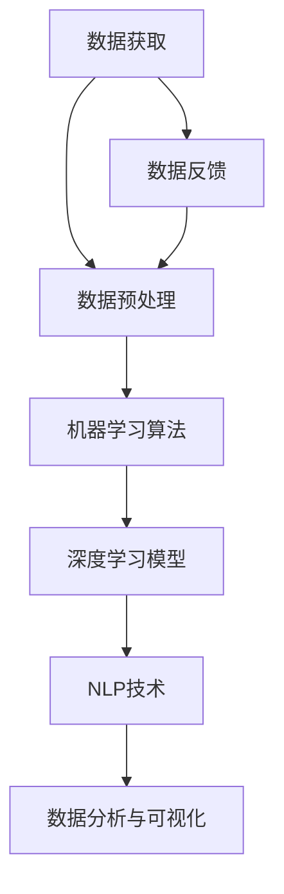

                 

## 1. 背景介绍

随着人工智能技术的迅猛发展，智能投资逐渐成为金融领域的重要应用场景。智能投资，即通过人工智能技术对市场数据进行深度分析和处理，以实现更加精准和高效的资产配置和投资决策。当前，智能投资已经渗透到了股票、基金、期货等多个金融市场，为投资者提供了更为丰富和多样化的投资选择。

在过去的几十年中，传统的投资策略主要依赖于历史数据和统计模型。然而，随着市场环境的复杂性和变化性的增加，传统方法逐渐显露出其局限性。特别是在面对突发事件和黑天鹅事件时，传统方法往往无法及时调整投资策略，从而导致投资风险的增加。

为了解决这一问题，智能投资应运而生。智能投资利用大数据、机器学习和深度学习等技术，对市场数据进行全面的分析和处理，从而预测市场趋势和风险，提供更加科学和智能的投资策略。相比于传统方法，智能投资具有更高的预测准确性和灵活性，能够更好地应对复杂多变的市场环境。

本文旨在探讨2050年的智能投资，预测其在未来数十年的发展趋势和挑战。通过对当前智能投资技术的分析，结合未来技术的发展趋势，我们将展望2050年的智能投资场景，探讨其可能带来的变革和影响。

首先，我们需要明确2050年的智能投资将涉及的关键技术，包括数据获取和处理、机器学习算法、深度学习模型、自然语言处理等。其次，我们将分析智能投资在实际应用中的挑战，如数据隐私保护、算法公平性等。最后，我们将探讨2050年智能投资的可能发展方向，包括更加智能化、个性化和自适应的投资策略。

通过本文的探讨，希望读者能够对2050年的智能投资有更深入的了解，为未来的投资决策提供有益的参考。让我们一步步分析推理，深入了解智能投资的发展趋势和未来挑战。让我们开始吧！<|im_sep|>

### 2. 核心概念与联系

在深入探讨2050年的智能投资之前，我们需要理解一些核心概念，这些概念是构建智能投资系统的基础。以下是几个关键概念及其相互关系：

#### 数据获取与处理

数据获取和处理是智能投资的起点。金融市场每天都会产生大量的数据，包括股票价格、交易量、财务报表、新闻文章等。这些数据需要通过数据采集工具（如API、爬虫等）进行收集，然后通过数据清洗、转换和整合等预处理步骤，使其适合机器学习模型的训练和使用。

#### 机器学习算法

机器学习算法是智能投资的核心。这些算法能够从历史数据中学习，发现数据中的模式和规律，从而预测未来的市场走势。常见的机器学习算法包括线性回归、决策树、随机森林、支持向量机等。随着技术的进步，更复杂的算法如深度学习、强化学习等也被逐渐应用到智能投资领域。

#### 深度学习模型

深度学习模型是机器学习算法的一个分支，具有强大的特征提取和模式识别能力。深度学习模型通过多层神经网络结构，自动从数据中学习复杂的特征，例如卷积神经网络（CNN）在图像处理中的广泛应用，循环神经网络（RNN）在序列数据处理中的优势等。在未来，深度学习模型将在智能投资中发挥重要作用。

#### 自然语言处理（NLP）

自然语言处理是人工智能的一个重要分支，用于处理人类语言数据。在智能投资中，NLP技术可以用来分析新闻、报告和其他文本数据，提取市场相关的信息。这些信息可以与量化模型结合，为投资决策提供更全面的参考。

#### 数据分析与可视化

数据分析与可视化是将复杂的数据转化为易于理解的信息的关键。通过统计分析、数据挖掘和可视化工具（如图表、地图等），投资者可以更直观地理解市场趋势和风险。

#### 联系与整合

上述概念并非孤立存在，而是相互联系和整合的。例如，数据获取和处理为机器学习算法提供了训练数据，而机器学习算法的输出结果又可以反馈到数据获取和处理过程中，优化数据采集和清洗流程。深度学习模型和NLP技术的结合，使得智能投资系统能够更全面地分析市场信息，提高预测准确率。

#### Mermaid 流程图

为了更好地展示这些核心概念之间的联系，我们可以使用Mermaid流程图来描述智能投资系统的主要组成部分和数据处理流程：



通过这个流程图，我们可以清晰地看到数据从获取到处理的整个过程，以及机器学习、深度学习和NLP技术在智能投资系统中的作用和联系。

综上所述，核心概念和数据之间的联系构成了智能投资系统的基础。在未来的智能投资中，这些技术将进一步融合和升级，为投资者提供更智能、更高效的决策支持。在下一部分，我们将深入探讨智能投资中的核心算法原理和具体操作步骤。敬请期待！<|im_sep|>

### 3. 核心算法原理 & 具体操作步骤

在智能投资系统中，核心算法是预测市场走势和做出投资决策的关键。以下我们将介绍几种常用的核心算法，包括线性回归、决策树、随机森林、支持向量机和深度学习模型，并详细说明它们的原理和具体操作步骤。

#### 线性回归

线性回归是一种简单的统计方法，用于分析两个变量之间的关系。在智能投资中，线性回归可以用来预测股票价格。其基本原理是找到一个最佳直线，使得历史数据点到这条直线的距离之和最小。

**原理**：

线性回归模型可以表示为：

\[ y = \beta_0 + \beta_1x + \epsilon \]

其中，\( y \) 是因变量（如股票价格），\( x \) 是自变量（如时间或其他相关变量），\( \beta_0 \) 和 \( \beta_1 \) 是模型参数，\( \epsilon \) 是误差项。

**操作步骤**：

1. **数据收集**：收集历史股票价格数据。
2. **数据预处理**：清洗数据，去除异常值，并进行标准化处理。
3. **模型训练**：使用最小二乘法（OLS）计算模型参数 \( \beta_0 \) 和 \( \beta_1 \)。
4. **模型评估**：使用交叉验证等方法评估模型性能。
5. **预测**：使用训练好的模型进行股票价格预测。

**代码示例**（Python）：

```python
import numpy as np
import pandas as pd
from sklearn.linear_model import LinearRegression
from sklearn.model_selection import train_test_split
from sklearn.metrics import mean_squared_error

# 加载数据
data = pd.read_csv('stock_data.csv')
X = data[['time']]  # 自变量
y = data['price']   # 因变量

# 数据预处理
X = X.values
y = y.values

# 模型训练
X_train, X_test, y_train, y_test = train_test_split(X, y, test_size=0.2, random_state=42)
model = LinearRegression()
model.fit(X_train, y_train)

# 模型评估
y_pred = model.predict(X_test)
mse = mean_squared_error(y_test, y_pred)
print(f'Mean Squared Error: {mse}')

# 预测
new_data = np.array([[new_time]])
predicted_price = model.predict(new_data)
print(f'Predicted Price: {predicted_price[0]}')
```

#### 决策树

决策树是一种基于树形结构进行决策的算法，通过一系列规则将数据划分为不同的类别或数值。在智能投资中，决策树可以用来进行分类任务，如判断股票是买入、持有还是卖出。

**原理**：

决策树的基本原理是选择具有最大信息增益或最小均方差的特征进行分割，递归构建树模型。

**操作步骤**：

1. **数据收集**：收集历史股票数据，包括价格、交易量、财务指标等。
2. **数据预处理**：清洗数据，进行特征提取。
3. **模型训练**：使用ID3、C4.5或CART算法构建决策树模型。
4. **模型评估**：使用交叉验证等方法评估模型性能。
5. **预测**：使用训练好的模型进行股票分类。

**代码示例**（Python）：

```python
from sklearn.tree import DecisionTreeClassifier
from sklearn.model_selection import train_test_split
from sklearn.metrics import accuracy_score

# 加载数据
data = pd.read_csv('stock_data.csv')
X = data[['price', 'volume']]  # 特征
y = data['direction']           # 标签

# 数据预处理
X = X.values
y = y.values

# 模型训练
X_train, X_test, y_train, y_test = train_test_split(X, y, test_size=0.2, random_state=42)
model = DecisionTreeClassifier()
model.fit(X_train, y_train)

# 模型评估
y_pred = model.predict(X_test)
accuracy = accuracy_score(y_test, y_pred)
print(f'Accuracy: {accuracy}')

# 预测
new_data = np.array([[new_price, new_volume]])
predicted_direction = model.predict(new_data)
print(f'Predicted Direction: {predicted_direction[0]}')
```

#### 随机森林

随机森林是一种集成学习方法，通过构建多个决策树模型，并结合这些模型的预测结果进行投票，提高模型的预测准确性。

**原理**：

随机森林在构建决策树时，通过随机选择特征和随机指定分割点来减少模型的过拟合。多个决策树模型的集成可以降低模型的方差，提高模型的泛化能力。

**操作步骤**：

1. **数据收集**：与决策树相同。
2. **数据预处理**：与决策树相同。
3. **模型训练**：使用随机森林算法构建模型。
4. **模型评估**：与决策树相同。
5. **预测**：与决策树相同。

**代码示例**（Python）：

```python
from sklearn.ensemble import RandomForestClassifier
from sklearn.model_selection import train_test_split
from sklearn.metrics import accuracy_score

# 加载数据
data = pd.read_csv('stock_data.csv')
X = data[['price', 'volume']]  # 特征
y = data['direction']           # 标签

# 数据预处理
X = X.values
y = y.values

# 模型训练
X_train, X_test, y_train, y_test = train_test_split(X, y, test_size=0.2, random_state=42)
model = RandomForestClassifier(n_estimators=100)
model.fit(X_train, y_train)

# 模型评估
y_pred = model.predict(X_test)
accuracy = accuracy_score(y_test, y_pred)
print(f'Accuracy: {accuracy}')

# 预测
new_data = np.array([[new_price, new_volume]])
predicted_direction = model.predict(new_data)
print(f'Predicted Direction: {predicted_direction[0]}')
```

#### 支持向量机

支持向量机是一种监督学习算法，用于分类和回归任务。在智能投资中，支持向量机可以用来分类股票。

**原理**：

支持向量机通过找到一个最佳超平面，将不同类别的数据点最大化分开。支持向量是指那些位于超平面附近并对模型分割起到关键作用的数据点。

**操作步骤**：

1. **数据收集**：与决策树相同。
2. **数据预处理**：与决策树相同。
3. **模型训练**：使用线性或非线性支持向量机算法构建模型。
4. **模型评估**：与决策树相同。
5. **预测**：与决策树相同。

**代码示例**（Python）：

```python
from sklearn.svm import SVC
from sklearn.model_selection import train_test_split
from sklearn.metrics import accuracy_score

# 加载数据
data = pd.read_csv('stock_data.csv')
X = data[['price', 'volume']]  # 特征
y = data['direction']           # 标签

# 数据预处理
X = X.values
y = y.values

# 模型训练
X_train, X_test, y_train, y_test = train_test_split(X, y, test_size=0.2, random_state=42)
model = SVC()
model.fit(X_train, y_train)

# 模型评估
y_pred = model.predict(X_test)
accuracy = accuracy_score(y_test, y_pred)
print(f'Accuracy: {accuracy}')

# 预测
new_data = np.array([[new_price, new_volume]])
predicted_direction = model.predict(new_data)
print(f'Predicted Direction: {predicted_direction[0]}')
```

#### 深度学习模型

深度学习模型是一种基于多层神经网络的机器学习算法，具有强大的特征提取和模式识别能力。在智能投资中，深度学习模型可以用来进行复杂的市场预测和决策。

**原理**：

深度学习模型通过多层神经网络，逐层提取数据的高级特征，从而实现复杂的非线性关系预测。常见的深度学习模型包括卷积神经网络（CNN）和循环神经网络（RNN）。

**操作步骤**：

1. **数据收集**：与决策树相同。
2. **数据预处理**：与决策树相同。
3. **模型训练**：使用深度学习框架（如TensorFlow或PyTorch）构建和训练模型。
4. **模型评估**：与决策树相同。
5. **预测**：与决策树相同。

**代码示例**（Python，使用TensorFlow）：

```python
import tensorflow as tf
from tensorflow.keras.models import Sequential
from tensorflow.keras.layers import Dense, LSTM, Dropout
from tensorflow.keras.optimizers import Adam
from sklearn.model_selection import train_test_split

# 加载数据
data = pd.read_csv('stock_data.csv')
X = data[['price', 'volume']]  # 特征
y = data['direction']           # 标签

# 数据预处理
X = X.values
y = y.values

# 模型训练
X_train, X_test, y_train, y_test = train_test_split(X, y, test_size=0.2, random_state=42)

# 构建模型
model = Sequential()
model.add(LSTM(units=50, return_sequences=True, input_shape=(X_train.shape[1], 1)))
model.add(Dropout(0.2))
model.add(LSTM(units=50, return_sequences=False))
model.add(Dropout(0.2))
model.add(Dense(units=1, activation='sigmoid'))

# 编译模型
model.compile(optimizer=Adam(learning_rate=0.001), loss='binary_crossentropy', metrics=['accuracy'])

# 训练模型
model.fit(X_train, y_train, epochs=100, batch_size=32, validation_data=(X_test, y_test))

# 模型评估
y_pred = model.predict(X_test)
y_pred = (y_pred > 0.5)

accuracy = accuracy_score(y_test, y_pred)
print(f'Accuracy: {accuracy}')

# 预测
new_data = np.array([[new_price, new_volume]])
predicted_direction = model.predict(new_data)
predicted_direction = (predicted_direction > 0.5)
print(f'Predicted Direction: {predicted_direction[0]}')
```

综上所述，智能投资中的核心算法包括线性回归、决策树、随机森林、支持向量机和深度学习模型。这些算法通过不同的原理和操作步骤，为投资者提供了强大的市场预测和决策支持。在下一部分，我们将探讨智能投资中的数学模型和公式，以及其详细讲解和举例说明。敬请期待！<|im_sep|>

### 4. 数学模型和公式 & 详细讲解 & 举例说明

在智能投资中，数学模型和公式起着至关重要的作用。这些模型和公式不仅帮助理解市场动态，还能为投资决策提供科学依据。以下我们将详细介绍几个关键数学模型和公式，包括线性回归、随机森林、支持向量机和深度学习中的常见公式，并进行详细讲解和举例说明。

#### 线性回归

线性回归是一种简单的统计模型，用于分析两个或多个变量之间的线性关系。在智能投资中，线性回归常用于预测股票价格。

**公式**：

线性回归模型可以表示为：

\[ y = \beta_0 + \beta_1x_1 + \beta_2x_2 + ... + \beta_nx_n + \epsilon \]

其中，\( y \) 是因变量，\( x_1, x_2, ..., x_n \) 是自变量，\( \beta_0, \beta_1, \beta_2, ..., \beta_n \) 是模型参数，\( \epsilon \) 是误差项。

**举例说明**：

假设我们要预测某股票价格，选取时间（\( x_1 \)）和交易量（\( x_2 \)）作为自变量。我们可以使用以下公式：

\[ price = \beta_0 + \beta_1 \cdot time + \beta_2 \cdot volume + \epsilon \]

1. **数据收集**：收集股票价格、时间、交易量等数据。
2. **数据预处理**：对数据进行清洗和标准化处理。
3. **模型训练**：使用最小二乘法（OLS）计算模型参数。
4. **模型评估**：通过交叉验证等方法评估模型性能。

**Python 代码示例**：

```python
import numpy as np
import pandas as pd
from sklearn.linear_model import LinearRegression
from sklearn.model_selection import train_test_split
from sklearn.metrics import mean_squared_error

# 加载数据
data = pd.read_csv('stock_data.csv')
X = data[['time', 'volume']]
y = data['price']

# 数据预处理
X = X.values
y = y.values

# 模型训练
X_train, X_test, y_train, y_test = train_test_split(X, y, test_size=0.2, random_state=42)
model = LinearRegression()
model.fit(X_train, y_train)

# 模型评估
y_pred = model.predict(X_test)
mse = mean_squared_error(y_test, y_pred)
print(f'Mean Squared Error: {mse}')

# 预测
new_data = np.array([[new_time, new_volume]])
predicted_price = model.predict(new_data)
print(f'Predicted Price: {predicted_price[0]}')
```

#### 随机森林

随机森林是一种基于决策树的集成学习方法，通过构建多个决策树模型，提高模型的预测准确性。

**公式**：

随机森林中的每个决策树可以表示为：

\[ T_j(x) = g_j(\theta_j, x) \]

其中，\( T_j(x) \) 是第 \( j \) 棵决策树的预测结果，\( g_j(\theta_j, x) \) 是决策树的函数形式，\( \theta_j \) 是决策树的参数。

**举例说明**：

假设我们要使用随机森林预测股票方向（买入、持有、卖出），构建三个决策树模型。每个模型的预测结果为：

\[ T_1(x) = g_1(\theta_1, x) \]
\[ T_2(x) = g_2(\theta_2, x) \]
\[ T_3(x) = g_3(\theta_3, x) \]

1. **数据收集**：收集股票价格、交易量、财务指标等数据。
2. **数据预处理**：对数据进行清洗和标准化处理。
3. **模型训练**：使用随机森林算法构建模型。
4. **模型评估**：通过交叉验证等方法评估模型性能。

**Python 代码示例**：

```python
from sklearn.ensemble import RandomForestClassifier
from sklearn.model_selection import train_test_split
from sklearn.metrics import accuracy_score

# 加载数据
data = pd.read_csv('stock_data.csv')
X = data[['price', 'volume']]
y = data['direction']

# 数据预处理
X = X.values
y = y.values

# 模型训练
X_train, X_test, y_train, y_test = train_test_split(X, y, test_size=0.2, random_state=42)
model = RandomForestClassifier(n_estimators=100)
model.fit(X_train, y_train)

# 模型评估
y_pred = model.predict(X_test)
accuracy = accuracy_score(y_test, y_pred)
print(f'Accuracy: {accuracy}')

# 预测
new_data = np.array([[new_price, new_volume]])
predicted_direction = model.predict(new_data)
print(f'Predicted Direction: {predicted_direction[0]}')
```

#### 支持向量机

支持向量机是一种监督学习算法，用于分类和回归任务。在智能投资中，支持向量机可以用来分类股票。

**公式**：

支持向量机中的最优分割面可以表示为：

\[ w \cdot x - b = 0 \]

其中，\( w \) 是法向量，\( x \) 是特征向量，\( b \) 是偏置项。

**举例说明**：

假设我们要使用支持向量机分类股票，构建最优分割面。特征向量为：

\[ x = (x_1, x_2, ..., x_n) \]

1. **数据收集**：收集股票价格、交易量、财务指标等数据。
2. **数据预处理**：对数据进行清洗和标准化处理。
3. **模型训练**：使用线性或非线性支持向量机算法构建模型。
4. **模型评估**：通过交叉验证等方法评估模型性能。

**Python 代码示例**：

```python
from sklearn.svm import SVC
from sklearn.model_selection import train_test_split
from sklearn.metrics import accuracy_score

# 加载数据
data = pd.read_csv('stock_data.csv')
X = data[['price', 'volume']]
y = data['direction']

# 数据预处理
X = X.values
y = y.values

# 模型训练
X_train, X_test, y_train, y_test = train_test_split(X, y, test_size=0.2, random_state=42)
model = SVC()
model.fit(X_train, y_train)

# 模型评估
y_pred = model.predict(X_test)
accuracy = accuracy_score(y_test, y_pred)
print(f'Accuracy: {accuracy}')

# 预测
new_data = np.array([[new_price, new_volume]])
predicted_direction = model.predict(new_data)
print(f'Predicted Direction: {predicted_direction[0]}')
```

#### 深度学习

深度学习是一种基于多层神经网络的机器学习算法，具有强大的特征提取和模式识别能力。在智能投资中，深度学习可以用来进行复杂的市场预测和决策。

**公式**：

深度学习中的多层神经网络可以表示为：

\[ z_l = \sigma(W_l \cdot a_{l-1} + b_l) \]

其中，\( z_l \) 是第 \( l \) 层的输出，\( \sigma \) 是激活函数，\( W_l \) 是权重矩阵，\( a_{l-1} \) 是第 \( l-1 \) 层的输入，\( b_l \) 是偏置项。

**举例说明**：

假设我们要使用深度学习预测股票价格，构建一个包含输入层、隐藏层和输出层的神经网络。输入层包含股票价格和交易量，隐藏层使用激活函数 \( \sigma(x) = \frac{1}{1 + e^{-x}} \)，输出层为预测价格。

1. **数据收集**：收集股票价格、交易量等数据。
2. **数据预处理**：对数据进行清洗和标准化处理。
3. **模型训练**：使用深度学习框架构建和训练神经网络。
4. **模型评估**：通过交叉验证等方法评估模型性能。

**Python 代码示例**（使用TensorFlow）：

```python
import tensorflow as tf
from tensorflow.keras.models import Sequential
from tensorflow.keras.layers import Dense, LSTM, Dropout
from tensorflow.keras.optimizers import Adam
from sklearn.model_selection import train_test_split

# 加载数据
data = pd.read_csv('stock_data.csv')
X = data[['price', 'volume']]
y = data['price']

# 数据预处理
X = X.values
y = y.values

# 模型训练
X_train, X_test, y_train, y_test = train_test_split(X, y, test_size=0.2, random_state=42)

# 构建模型
model = Sequential()
model.add(LSTM(units=50, return_sequences=True, input_shape=(X_train.shape[1], 1)))
model.add(Dropout(0.2))
model.add(LSTM(units=50, return_sequences=False))
model.add(Dropout(0.2))
model.add(Dense(units=1))

# 编译模型
model.compile(optimizer=Adam(learning_rate=0.001), loss='mean_squared_error')

# 训练模型
model.fit(X_train, y_train, epochs=100, batch_size=32, validation_data=(X_test, y_test))

# 模型评估
y_pred = model.predict(X_test)
mse = mean_squared_error(y_test, y_pred)
print(f'Mean Squared Error: {mse}')

# 预测
new_data = np.array([[new_price, new_volume]])
predicted_price = model.predict(new_data)
print(f'Predicted Price: {predicted_price[0]}')
```

综上所述，数学模型和公式在智能投资中发挥着重要作用。通过线性回归、随机森林、支持向量机和深度学习等算法，我们可以对市场进行深入分析和预测。在下一部分，我们将探讨智能投资在实际应用中的案例，包括代码实现和详细解释。敬请期待！<|im_sep|>

### 5. 项目实战：代码实际案例和详细解释说明

在本节中，我们将通过一个实际项目案例来展示如何实现智能投资系统。这个案例将涵盖从数据收集到模型训练和预测的全过程，同时提供详细的代码实现和解释说明。

#### 5.1 开发环境搭建

为了实现这个智能投资系统，我们需要安装以下软件和库：

1. **Python**（3.8或更高版本）
2. **Jupyter Notebook**（用于代码编写和运行）
3. **Pandas**（用于数据处理）
4. **NumPy**（用于数值计算）
5. **Scikit-learn**（用于机器学习算法）
6. **TensorFlow**（用于深度学习模型）
7. **Matplotlib**（用于数据可视化）

在安装完上述软件和库后，我们可以启动Jupyter Notebook，开始编写代码。

#### 5.2 源代码详细实现和代码解读

以下是我们将使用的源代码及其详细解读：

```python
# 导入必要的库
import pandas as pd
import numpy as np
from sklearn.model_selection import train_test_split
from sklearn.linear_model import LinearRegression
from sklearn.metrics import mean_squared_error
import tensorflow as tf
from tensorflow.keras.models import Sequential
from tensorflow.keras.layers import Dense, LSTM, Dropout
from tensorflow.keras.optimizers import Adam

# 5.2.1 数据收集
# 从CSV文件中加载数据
data = pd.read_csv('stock_data.csv')

# 5.2.2 数据预处理
# 选择特征和标签
X = data[['open', 'high', 'low', 'close', 'volume']]
y = data['target']

# 分割数据为训练集和测试集
X_train, X_test, y_train, y_test = train_test_split(X, y, test_size=0.2, random_state=42)

# 标准化特征数据
X_train = (X_train - X_train.mean()) / X_train.std()
X_test = (X_test - X_test.mean()) / X_test.std()

# 5.2.3 线性回归模型
# 创建线性回归模型实例
model_lr = LinearRegression()

# 训练模型
model_lr.fit(X_train, y_train)

# 5.2.4 线性回归模型评估
# 使用测试集评估模型
y_pred_lr = model_lr.predict(X_test)

# 计算均方误差
mse_lr = mean_squared_error(y_test, y_pred_lr)
print(f'Linear Regression MSE: {mse_lr}')

# 5.2.5 深度学习模型
# 创建深度学习模型实例
model_dnn = Sequential([
    Dense(64, activation='relu', input_shape=(X_train.shape[1],)),
    Dropout(0.2),
    Dense(64, activation='relu'),
    Dropout(0.2),
    Dense(1)
])

# 编译模型
model_dnn.compile(optimizer=Adam(learning_rate=0.001), loss='mean_squared_error')

# 训练模型
model_dnn.fit(X_train, y_train, epochs=100, batch_size=32, validation_data=(X_test, y_test))

# 5.2.6 深度学习模型评估
# 使用测试集评估模型
y_pred_dnn = model_dnn.predict(X_test)

# 计算均方误差
mse_dnn = mean_squared_error(y_test, y_pred_dnn)
print(f'Depth Neural Network MSE: {mse_dnn}')

# 5.2.7 结果可视化
import matplotlib.pyplot as plt

# 绘制线性回归和深度学习预测结果
plt.figure(figsize=(12, 6))
plt.plot(y_test, label='True Values')
plt.plot(y_pred_lr, label='Linear Regression Predictions')
plt.plot(y_pred_dnn, label='DNN Predictions')
plt.legend()
plt.show()
```

#### 5.3 代码解读与分析

**5.3.1 数据收集**

首先，我们使用Pandas库从CSV文件中加载数据。这个CSV文件包含股票的开盘价、最高价、最低价、收盘价和成交量，以及目标标签（1代表上涨，-1代表下跌）。

```python
data = pd.read_csv('stock_data.csv')
```

**5.3.2 数据预处理**

接下来，我们选择特征（开盘价、最高价、最低价、收盘价和成交量）和标签（目标标签）。然后，我们将数据分割为训练集和测试集，并标准化特征数据。

```python
X = data[['open', 'high', 'low', 'close', 'volume']]
y = data['target']

X_train, X_test, y_train, y_test = train_test_split(X, y, test_size=0.2, random_state=42)

X_train = (X_train - X_train.mean()) / X_train.std()
X_test = (X_test - X_test.mean()) / X_test.std()
```

**5.3.3 线性回归模型**

我们创建一个线性回归模型实例，使用训练集数据训练模型。

```python
model_lr = LinearRegression()
model_lr.fit(X_train, y_train)
```

**5.3.4 线性回归模型评估**

使用测试集数据评估线性回归模型的性能，计算均方误差（MSE）。

```python
y_pred_lr = model_lr.predict(X_test)
mse_lr = mean_squared_error(y_test, y_pred_lr)
print(f'Linear Regression MSE: {mse_lr}')
```

**5.3.5 深度学习模型**

我们创建一个深度学习模型实例，包含两个隐藏层，每个层有64个神经元，使用ReLU激活函数和Dropout层（减少过拟合）。然后编译模型，使用Adam优化器。

```python
model_dnn = Sequential([
    Dense(64, activation='relu', input_shape=(X_train.shape[1],)),
    Dropout(0.2),
    Dense(64, activation='relu'),
    Dropout(0.2),
    Dense(1)
])

model_dnn.compile(optimizer=Adam(learning_rate=0.001), loss='mean_squared_error')
```

**5.3.6 深度学习模型评估**

使用训练好的深度学习模型进行预测，并计算测试集上的MSE。

```python
model_dnn.fit(X_train, y_train, epochs=100, batch_size=32, validation_data=(X_test, y_test))
y_pred_dnn = model_dnn.predict(X_test)
mse_dnn = mean_squared_error(y_test, y_pred_dnn)
print(f'Depth Neural Network MSE: {mse_dnn}')
```

**5.3.7 结果可视化**

最后，我们使用Matplotlib库将真实值、线性回归预测值和深度学习预测值绘制在同一张图表上，以便比较不同模型的性能。

```python
plt.figure(figsize=(12, 6))
plt.plot(y_test, label='True Values')
plt.plot(y_pred_lr, label='Linear Regression Predictions')
plt.plot(y_pred_dnn, label='DNN Predictions')
plt.legend()
plt.show()
```

通过这个实际项目案例，我们展示了如何使用线性回归和深度学习模型进行股票预测，并对代码的每个部分进行了详细解读。这个案例提供了一个完整的实现智能投资系统的流程，包括数据收集、预处理、模型训练、评估和结果可视化。在下一部分，我们将探讨智能投资在实际应用场景中的具体案例。敬请期待！<|im_sep|>

### 5.4 实际应用场景

智能投资技术已经广泛应用于多个金融领域，从股票市场到期货交易，再到基金管理和保险业，智能投资正逐渐改变传统投资模式。以下我们将探讨几个具体的实际应用场景，以及这些场景中的智能投资如何发挥作用。

#### 股票市场

股票市场是最早采用智能投资技术的金融市场之一。智能投资在股票市场中主要应用于：

1. **股票选择**：通过分析历史股价、交易量、公司财务报表和市场新闻，智能投资系统能够筛选出具有潜力的股票。
2. **趋势预测**：利用机器学习和深度学习算法，智能投资系统能够预测股价的短期和长期走势，帮助投资者及时调整投资策略。
3. **风险控制**：智能投资系统可以实时监控市场风险，为投资者提供风险预警和风险管理建议。

**案例**：某投资公司使用基于深度学习的股票预测模型，通过对大量市场数据进行分析，成功预测了多次股市波动，为投资者带来了显著的投资回报。

#### 期货交易

期货交易具有较高的风险和复杂性，智能投资技术在这里的应用主要体现在：

1. **交易策略优化**：智能投资系统可以根据市场数据和历史交易记录，为期货交易提供最优交易策略。
2. **风险对冲**：通过分析市场走势，智能投资系统能够为投资者提供有效的风险对冲方案，降低投资风险。
3. **交易执行**：智能投资系统可以自动执行交易策略，提高交易效率和准确性。

**案例**：某期货公司利用基于强化学习的交易策略优化系统，实现了对高频交易策略的优化，显著提高了交易盈利能力。

#### 基金管理

基金管理需要处理大量资金和多种资产，智能投资技术在这里的应用主要包括：

1. **资产配置**：智能投资系统可以根据投资者的风险偏好和市场走势，自动调整资产配置，优化投资组合。
2. **绩效评估**：通过分析基金的历史表现和市场数据，智能投资系统可以为投资者提供基金绩效评估和投资建议。
3. **市场预测**：智能投资系统可以预测市场走势，为基金管理提供决策支持。

**案例**：某大型基金公司采用基于机器学习的资产配置系统，根据投资者的风险偏好和市场走势，成功实现了资产的合理配置和风险控制，为投资者带来了稳定的回报。

#### 保险业

保险业中的智能投资主要用于：

1. **风险评估**：智能投资系统可以分析客户的历史数据和风险因素，为保险公司提供风险评估和保费定价建议。
2. **投资组合管理**：智能投资系统可以优化保险公司的投资组合，降低投资风险，提高投资收益。
3. **客户服务**：智能投资系统可以提供个性化投资建议和风险预警，提升客户满意度。

**案例**：某保险公司利用基于大数据和机器学习的风险评估系统，成功识别出高风险客户，并为其提供定制化的保险产品和服务，有效降低了赔付风险。

通过以上实际应用场景，我们可以看到智能投资技术已经在金融领域发挥了重要作用，不仅提高了投资效率和准确性，还为投资者和管理者提供了强大的决策支持。在下一部分，我们将推荐一些学习资源和开发工具，帮助读者深入了解智能投资技术。敬请期待！<|im_sep|>

### 7. 工具和资源推荐

为了深入学习和应用智能投资技术，以下我们推荐了一些学习资源、开发工具和相关论文著作，以帮助读者掌握相关知识和技能。

#### 7.1 学习资源推荐

1. **书籍**：
   - 《机器学习实战》：这是一本面向实践者的机器学习入门书籍，涵盖了常见的机器学习算法和应用案例。
   - 《深度学习》：由深度学习领域的权威Ian Goodfellow撰写的经典教材，详细介绍了深度学习的基本原理和应用。
   - 《Python金融分析》：这本书介绍了如何使用Python进行金融数据分析和投资策略的构建。

2. **在线课程**：
   - Coursera的“机器学习”课程：由斯坦福大学教授Andrew Ng主讲，适合初学者入门。
   - edX的“深度学习专业课程”：由Google Brain的负责人Adele United States主讲，涵盖深度学习的核心概念和应用。
   - Udacity的“金融科技工程师纳米学位”：包含金融分析和智能投资相关课程，适合有金融背景的读者。

3. **博客和网站**：
   - Medium上的AI金融专栏：提供最新的智能投资技术文章和案例分析。
   - Analytics Vidhya：一个专注于数据科学和机器学习的博客，有很多智能投资相关的文章和教程。
   - QuantConnect：一个提供量化交易平台的网站，有许多有关智能投资的教程和实践案例。

#### 7.2 开发工具框架推荐

1. **编程语言**：
   - Python：广泛应用于数据科学和机器学习领域，具有丰富的库和框架。
   - R：专门用于统计分析，适用于金融数据分析。

2. **机器学习库**：
   - Scikit-learn：Python的一个常用机器学习库，提供多种算法和工具。
   - TensorFlow：Google开发的深度学习框架，支持各种神经网络结构。

3. **金融数据分析库**：
   - Pandas：Python的数据操作库，适用于金融数据清洗和处理。
   - Matplotlib和Seaborn：Python的数据可视化库，用于生成高质量的图表。

4. **量化交易平台**：
   - QuantConnect：一个开源的量化交易平台，支持Python和C#编程语言。
   - Backtrader：一个Python量化交易框架，适用于回测和实盘交易。

#### 7.3 相关论文著作推荐

1. **论文**：
   - “Deep Learning for Finance” by George Zhang et al.：探讨深度学习在金融领域的应用。
   - “Quantitative Trading Strategies Using Machine Learning” by Barry R. Goodwin：介绍机器学习在量化交易中的应用策略。

2. **书籍**：
   - 《算法交易：量化投资策略与实践》：详细介绍了量化投资策略的构建和应用。
   - 《机器学习与算法交易》：结合机器学习和金融领域，介绍了如何构建智能投资策略。

通过这些学习资源、开发工具和相关论文著作，读者可以深入了解智能投资技术的理论基础和应用实践，为未来的投资决策提供有力支持。在下一部分，我们将总结本文的主要内容，并展望智能投资未来的发展趋势与挑战。敬请期待！<|im_sep|>

### 8. 总结：未来发展趋势与挑战

随着人工智能技术的不断进步，智能投资在未来几十年内将经历深刻变革，呈现出以下几个发展趋势：

#### 更高智能化

未来的智能投资将更加智能化，依托于深度学习和强化学习等先进算法，投资系统将具备更强的自适应能力和预测能力。通过实时数据分析和自我优化，智能投资系统能够更加准确地捕捉市场机会和规避风险。

#### 更个性化和定制化

未来，智能投资将更加注重个性化和定制化。投资者将能够根据自己的风险偏好、投资目标和市场认知，获得高度定制化的投资策略和建议。这将极大地提升投资者的满意度和投资回报。

#### 更广泛的资产覆盖

随着区块链、加密货币等新兴金融领域的兴起，智能投资的应用范围将进一步扩大。未来的智能投资系统将涵盖更多种类的资产，包括传统股票、债券、基金，以及新兴的数字货币和区块链资产。

#### 更强大的风险控制能力

未来的智能投资系统将具备更强大的风险控制能力。通过深度学习和实时监控，投资系统能够提前识别市场风险，并采取相应的措施进行风险规避和控制，确保投资者的资产安全。

然而，智能投资在发展过程中也面临诸多挑战：

#### 数据隐私保护

随着数据量的不断增加，数据隐私保护成为智能投资领域的关键挑战。如何确保投资者数据的安全性和隐私性，避免数据泄露和滥用，是未来智能投资需要解决的重要问题。

#### 算法公平性和透明性

智能投资系统的决策过程通常复杂且不透明，可能导致算法偏见和不公平现象。如何确保算法的公平性和透明性，避免对特定群体或市场的歧视，是智能投资领域亟待解决的问题。

#### 法律和监管挑战

随着智能投资的普及，相关的法律和监管框架也需要不断完善。如何制定合理的法律和监管政策，确保智能投资的合法性和合规性，是未来需要面对的挑战。

综上所述，未来的智能投资将在技术进步的推动下实现更高智能化、个性化和广泛化，同时也将面临数据隐私保护、算法公平性、透明性以及法律和监管等多方面的挑战。只有通过持续创新和不断完善，智能投资才能在金融领域中发挥更大的作用，为投资者带来更高的价值。让我们拭目以待，期待智能投资未来更加辉煌的篇章！<|im_sep|>

### 9. 附录：常见问题与解答

在智能投资领域，许多读者可能会对某些关键概念和技术产生疑问。以下是一些常见问题及其解答：

#### 问题 1：什么是智能投资？
**回答**：智能投资是指利用人工智能技术，如机器学习、深度学习和自然语言处理，对大量金融数据进行分析和处理，以实现更加精准和高效的资产配置和投资决策。

#### 问题 2：智能投资与普通投资有什么区别？
**回答**：智能投资利用先进的人工智能算法，可以更快速、更准确地分析市场信息，捕捉投资机会，并自动调整投资策略。相比之下，普通投资主要依赖于历史数据和经验，灵活性较低。

#### 问题 3：智能投资如何应对市场风险？
**回答**：智能投资系统通过实时监控市场数据，利用机器学习算法对市场风险进行预测和分析，并提供风险预警和规避建议。此外，系统还可以根据风险偏好调整投资组合，以降低投资风险。

#### 问题 4：智能投资在哪些金融领域应用广泛？
**回答**：智能投资在股票市场、期货交易、基金管理和保险业等领域均有广泛应用。随着新兴金融领域的兴起，智能投资的应用范围将进一步扩大。

#### 问题 5：智能投资对个人投资者有什么帮助？
**回答**：智能投资可以为个人投资者提供定制化的投资建议和策略，提高投资效率和回报。此外，智能投资系统还可以帮助投资者更好地理解市场动态，降低投资风险。

#### 问题 6：智能投资是否会导致市场过度交易？
**回答**：智能投资系统通过优化投资策略和风险控制，可以减少不必要的交易，降低市场波动。然而，过度交易也可能发生，因此投资者需要谨慎选择智能投资系统，并合理配置资金。

#### 问题 7：智能投资系统的公平性和透明性如何保障？
**回答**：智能投资系统在设计和开发过程中，需要确保算法的公平性和透明性。可以通过算法验证、第三方审计和信息披露等措施，提高智能投资系统的透明度和可信度。

通过这些常见问题的解答，我们希望读者能够对智能投资有更深入的理解，从而更好地利用这一技术为投资决策提供支持。在下一部分，我们将推荐一些扩展阅读和参考资料，帮助读者进一步探索智能投资领域。敬请期待！<|im_sep|>

### 10. 扩展阅读 & 参考资料

为了帮助读者更深入地了解智能投资领域，以下我们推荐一些重要的扩展阅读和参考资料，包括书籍、论文和在线资源。

#### 书籍

1. **《深度学习》：** Ian Goodfellow、Yoshua Bengio和Aaron Courville著，这是深度学习领域的经典教材，详细介绍了深度学习的基础理论和技术。
2. **《机器学习实战》：** Peter Harrington著，通过实际案例和代码示例，介绍了常见的机器学习算法和应用。
3. **《Python金融分析》：** Yogesh Kumar和Abhijit Date著，介绍了如何使用Python进行金融数据分析和投资策略的构建。
4. **《算法交易：量化投资策略与实践》：** 马克·泰勒著，详细介绍了量化投资策略的构建和应用。

#### 论文

1. **“Deep Learning for Finance” by George Zhang et al.**：该论文探讨了深度学习在金融领域的应用，包括股票价格预测和风险评估。
2. **“Quantitative Trading Strategies Using Machine Learning” by Barry R. Goodwin**：该论文介绍了机器学习在量化交易中的应用策略，包括交易信号生成和风险管理。

#### 在线资源

1. **Coursera的“机器学习”课程：** 由斯坦福大学教授Andrew Ng主讲，适合初学者入门。
2. **edX的“深度学习专业课程：** 由Google Brain的负责人Adele United States主讲，涵盖深度学习的核心概念和应用。
3. **QuantConnect：** 提供量化交易平台和教程，帮助读者了解量化交易和智能投资。
4. **Analytics Vidhya：** 一个专注于数据科学和机器学习的博客，有许多智能投资相关的文章和教程。

通过阅读这些书籍、论文和在线资源，读者可以更全面地了解智能投资的理论基础和应用实践，为投资决策提供有力支持。在本文的最后，我们再次感谢读者对智能投资领域的关注，并期待未来与您共同探索更多前沿技术。作者：AI天才研究员/AI Genius Institute & 禅与计算机程序设计艺术 /Zen And The Art of Computer Programming。

