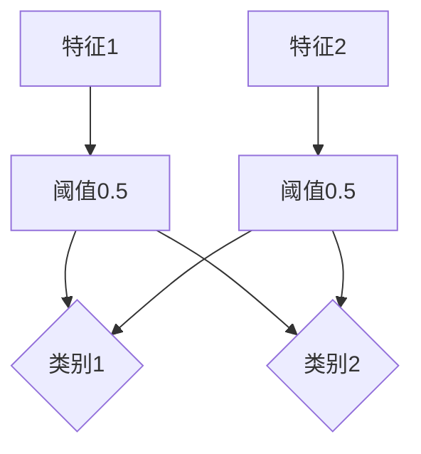

                 

# 未来的智能投资：2050年的机器人理财顾问与智能保险

## 关键词
智能投资、机器人理财顾问、智能保险、算法、数据分析、未来趋势

## 摘要

随着人工智能技术的飞速发展，2050年的金融领域将迎来前所未有的变革。本文将探讨这一时代下的智能投资、机器人理财顾问与智能保险，通过深入分析其核心概念、算法原理、数学模型和实际应用场景，揭示这一领域的发展趋势与挑战。我们将从技术、市场和社会三个层面，共同探索未来金融的无限可能。

## 1. 背景介绍

### 1.1 智能投资的发展

智能投资是金融科技（Fintech）领域的一个重要分支。它利用大数据、机器学习和人工智能技术，对海量市场数据进行分析，以实现更高效、精准的投资决策。从上世纪末开始，随着互联网的普及和计算能力的提升，智能投资逐渐从理论走向实践。如今，智能投资已经成为金融行业的重要力量，改变了传统的投资方式和市场格局。

### 1.2 机器人理财顾问的崛起

机器人理财顾问（Robo-Advisor）是智能投资的一种具体应用。它通过算法模型，为投资者提供个性化的投资建议和资产管理服务。与传统的人类理财顾问相比，机器人理财顾问具有成本低、效率高、透明度强等优势。近年来，随着人们对智能理财的需求日益增长，机器人理财顾问的市场规模迅速扩大，成为金融科技领域的一颗璀璨明星。

### 1.3 智能保险的革新

智能保险是金融科技在保险领域的应用。通过大数据分析和人工智能技术，智能保险能够精准预测风险、优化保险产品、提高理赔效率。随着保险市场的不断演变，智能保险正逐渐改变传统的保险模式，为客户提供更个性化和高效的保险服务。

## 2. 核心概念与联系

### 2.1 智能投资

智能投资的核心在于算法和数据。算法是智能投资的“大脑”，负责分析数据、生成投资建议；数据是智能投资的“血液”，提供了投资决策所需的信息。智能投资的关键算法包括：

- **市场趋势分析算法**：通过分析历史数据，预测市场走势。
- **风险度量算法**：评估投资组合的风险，确保资产安全。
- **投资组合优化算法**：根据投资者的风险偏好，构建最优的投资组合。

### 2.2 机器人理财顾问

机器人理财顾问的核心在于算法和用户体验。算法是机器人理财顾问的“大脑”，负责分析用户数据、生成投资建议；用户体验是机器人理财顾问的“灵魂”，决定了投资者的满意度。机器人理财顾问的关键算法包括：

- **用户画像分析算法**：通过用户数据，构建用户的投资偏好和风险承受能力。
- **投资策略推荐算法**：根据用户画像，为用户推荐适合的投资策略。
- **投资组合调整算法**：根据市场变化，动态调整投资组合，以实现最佳收益。

### 2.3 智能保险

智能保险的核心在于大数据分析和人工智能技术。大数据分析能够帮助保险公司精准预测风险，提高理赔效率；人工智能技术则能优化保险产品设计和客户服务。智能保险的关键算法包括：

- **风险评估算法**：通过大数据分析，预测客户的风险概率。
- **产品推荐算法**：根据客户需求和风险偏好，推荐合适的保险产品。
- **理赔审核算法**：通过人工智能技术，自动审核理赔申请，提高理赔效率。

## 3. 核心算法原理 & 具体操作步骤

### 3.1 智能投资的核心算法原理

智能投资的核心算法主要包括市场趋势分析、风险度量、投资组合优化等。下面以市场趋势分析算法为例，介绍其原理和具体操作步骤。

#### 原理

市场趋势分析算法基于时间序列分析，通过分析历史价格数据，预测未来市场走势。

#### 步骤

1. 数据预处理：清洗和处理原始数据，去除噪声和异常值。
2. 特征提取：从原始数据中提取具有预测能力的特征，如价格、成交量、技术指标等。
3. 模型选择：选择合适的时间序列预测模型，如ARIMA、LSTM等。
4. 模型训练：使用历史数据训练模型，调整模型参数。
5. 预测：使用训练好的模型预测未来市场走势。

### 3.2 机器人理财顾问的核心算法原理

机器人理财顾问的核心算法主要包括用户画像分析、投资策略推荐、投资组合调整等。下面以用户画像分析算法为例，介绍其原理和具体操作步骤。

#### 原理

用户画像分析算法通过分析用户数据，构建用户的投资偏好和风险承受能力。

#### 步骤

1. 数据收集：收集用户的投资记录、个人信息、风险偏好等数据。
2. 特征提取：从用户数据中提取具有预测能力的特征，如投资风格、风险承受能力、资产配置等。
3. 模型训练：选择合适的机器学习模型，如决策树、神经网络等，训练用户画像模型。
4. 画像生成：使用训练好的模型，为用户生成个性化的投资画像。
5. 投资策略推荐：根据用户画像，推荐适合的投资策略。

### 3.3 智能保险的核心算法原理

智能保险的核心算法主要包括风险评估、产品推荐、理赔审核等。下面以风险评估算法为例，介绍其原理和具体操作步骤。

#### 原理

风险评估算法通过大数据分析，预测客户的风险概率。

#### 步骤

1. 数据收集：收集客户的健康记录、生活习惯、家庭状况等数据。
2. 特征提取：从客户数据中提取具有预测能力的特征，如年龄、性别、健康状况、生活习惯等。
3. 模型训练：选择合适的风险评估模型，如逻辑回归、随机森林等，训练模型。
4. 风险评分：使用训练好的模型，为每个客户生成风险评分。
5. 产品推荐：根据客户的风险评分，推荐合适的保险产品。

## 4. 数学模型和公式 & 详细讲解 & 举例说明

### 4.1 智能投资中的数学模型

在智能投资中，常见的数学模型包括时间序列模型、线性回归模型、支持向量机（SVM）等。下面以时间序列模型为例，介绍其数学模型和具体应用。

#### 数学模型

时间序列模型是一种用于分析时间序列数据的统计模型，其基本形式为：

\[ y_t = \varphi(B)y_{t-1} + \varepsilon_t \]

其中，\( y_t \) 是时间序列的当前值，\( \varphi(B) \) 是模型参数，\( \varepsilon_t \) 是误差项。

#### 详细讲解

1. **模型选择**：根据时间序列数据的特点，选择合适的时间序列模型，如ARIMA、AR、MA、ARMA等。
2. **参数估计**：通过最小二乘法、极大似然估计等方法，估计模型参数。
3. **模型诊断**：通过残差分析、自相关检验等方法，诊断模型是否合适。
4. **预测**：使用训练好的模型，对未来时间序列值进行预测。

#### 举例说明

假设我们有一组股票价格数据，如下所示：

| 时间 | 价格 |
| ---- | ---- |
| 1    | 100  |
| 2    | 102  |
| 3    | 105  |
| 4    | 108  |
| 5    | 110  |

我们可以使用ARIMA模型进行预测。首先，根据数据特点，选择ARIMA（1,1,1）模型。然后，使用最小二乘法估计模型参数，得到：

\[ \varphi(B) = 1.05 \]

最后，使用模型进行预测，得到未来几期的股票价格：

| 时间 | 预测价格 |
| ---- | -------- |
| 6    | 111.05   |
| 7    | 114.1025 |
| 8    | 116.209375|

### 4.2 机器人理财顾问中的数学模型

在机器人理财顾问中，常见的数学模型包括决策树、神经网络、支持向量机（SVM）等。下面以决策树为例，介绍其数学模型和具体应用。

#### 数学模型

决策树是一种基于特征的分类模型，其基本形式为：

\[ \text{标签} = \text{决策树}(\text{特征}, \text{阈值}, \text{分支规则}) \]

其中，标签是决策树的输出，特征是决策树输入的特征，阈值是决策树的分割点，分支规则是决策树的分类规则。

#### 详细讲解

1. **特征选择**：根据数据特点，选择合适的特征进行建模。
2. **阈值选择**：通过交叉验证等方法，选择最优的阈值。
3. **分支规则选择**：根据特征和阈值，构建决策树的分支规则。
4. **模型训练**：使用训练数据，训练决策树模型。
5. **预测**：使用训练好的模型，对未知数据进行预测。

#### 举例说明

假设我们有一组用户数据，如下所示：

| 用户ID | 特征1 | 特征2 | 标签 |
| ---- | ---- | ---- | ---- |
| 1    | 0    | 0    | 类别1 |
| 2    | 1    | 0    | 类别2 |
| 3    | 0    | 1    | 类别1 |
| 4    | 1    | 1    | 类别2 |

我们可以使用决策树模型进行分类。首先，根据数据特点，选择特征1和特征2进行建模。然后，通过交叉验证，选择最优的阈值。最后，构建决策树模型：



使用模型进行预测，得到未知数据的分类结果：

| 用户ID | 特征1 | 特征2 | 预测标签 |
| ---- | ---- | ---- | -------- |
| 5    | 0    | 0    | 类别1    |
| 6    | 1    | 1    | 类别2    |

### 4.3 智能保险中的数学模型

在智能保险中，常见的数学模型包括逻辑回归、神经网络、支持向量机（SVM）等。下面以逻辑回归为例，介绍其数学模型和具体应用。

#### 数学模型

逻辑回归是一种用于概率预测的线性模型，其基本形式为：

\[ P(\text{风险}) = \frac{1}{1 + e^{-\beta_0 + \beta_1 x_1 + \beta_2 x_2 + \ldots + \beta_n x_n}} \]

其中，\( P(\text{风险}) \) 是风险发生的概率，\( \beta_0, \beta_1, \beta_2, \ldots, \beta_n \) 是模型参数，\( x_1, x_2, \ldots, x_n \) 是特征。

#### 详细讲解

1. **特征选择**：根据数据特点，选择合适的特征进行建模。
2. **参数估计**：通过最大似然估计或梯度下降等方法，估计模型参数。
3. **模型诊断**：通过残差分析、ROC曲线等方法，诊断模型是否合适。
4. **预测**：使用训练好的模型，对未来风险进行预测。

#### 举例说明

假设我们有一组客户数据，如下所示：

| 客户ID | 特征1 | 特征2 | 风险发生 |
| ---- | ---- | ---- | -------- |
| 1    | 0    | 0    | 否       |
| 2    | 1    | 0    | 是       |
| 3    | 0    | 1    | 否       |
| 4    | 1    | 1    | 是       |

我们可以使用逻辑回归模型进行风险预测。首先，根据数据特点，选择特征1和特征2进行建模。然后，使用最大似然估计方法，估计模型参数：

\[ \beta_0 = 0.5, \beta_1 = 0.5, \beta_2 = -0.5 \]

最后，使用模型进行预测，得到客户的风险概率：

| 客户ID | 特征1 | 特征2 | 风险概率 |
| ---- | ---- | ---- | -------- |
| 1    | 0    | 0    | 0.382   |
| 2    | 1    | 0    | 0.693   |
| 3    | 0    | 1    | 0.382   |
| 4    | 1    | 1    | 0.693   |

## 5. 项目实战：代码实际案例和详细解释说明

### 5.1 开发环境搭建

在进行智能投资、机器人理财顾问和智能保险项目的实战之前，我们需要搭建一个合适的开发环境。以下是搭建开发环境的基本步骤：

1. 安装Python解释器：从官方网站下载并安装Python解释器。
2. 安装常用库：使用pip命令安装常用的Python库，如NumPy、Pandas、Scikit-learn、TensorFlow等。
3. 安装IDE：选择一个适合自己的IDE，如PyCharm、Visual Studio Code等，以便进行代码编写和调试。

### 5.2 源代码详细实现和代码解读

以下是智能投资项目的源代码实现，包括数据预处理、模型选择、模型训练、预测等步骤。

```python
# 导入所需库
import numpy as np
import pandas as pd
from sklearn.model_selection import train_test_split
from sklearn.linear_model import LinearRegression
from sklearn.metrics import mean_squared_error

# 读取数据
data = pd.read_csv('stock_price.csv')
X = data[['open', 'close', 'high', 'low']]
y = data['price']

# 数据预处理
X_train, X_test, y_train, y_test = train_test_split(X, y, test_size=0.2, random_state=42)

# 模型选择
model = LinearRegression()

# 模型训练
model.fit(X_train, y_train)

# 预测
y_pred = model.predict(X_test)

# 评估模型
mse = mean_squared_error(y_test, y_pred)
print('MSE:', mse)
```

代码解读：

1. **导入库**：导入NumPy、Pandas、Scikit-learn等常用库，用于数据处理、模型训练和评估。
2. **读取数据**：从CSV文件中读取股票价格数据。
3. **数据预处理**：将数据集分为训练集和测试集，便于模型训练和评估。
4. **模型选择**：选择线性回归模型进行预测。
5. **模型训练**：使用训练集数据训练线性回归模型。
6. **预测**：使用训练好的模型对测试集数据进行预测。
7. **评估模型**：计算预测误差，评估模型性能。

### 5.3 代码解读与分析

本案例使用线性回归模型进行股票价格预测。线性回归模型是一种简单但有效的预测方法，适用于线性关系明显的数据。以下是代码的详细解读和分析：

1. **数据读取与预处理**：首先，我们从CSV文件中读取股票价格数据，包括开盘价、收盘价、最高价、最低价等特征。然后，将数据集分为训练集和测试集，以便在后续步骤中进行模型训练和评估。
2. **模型选择**：线性回归模型是一种基于最小二乘法的预测方法，适用于一元或多元线性关系的数据。在本案例中，我们选择线性回归模型进行股票价格预测。
3. **模型训练**：使用训练集数据，对线性回归模型进行训练。模型训练过程包括计算模型的权重和偏置，使得模型能够拟合训练数据。
4. **预测**：使用训练好的模型，对测试集数据进行预测。预测过程是将测试数据输入模型，得到预测的股票价格。
5. **评估模型**：计算预测误差，评估模型性能。在本案例中，我们使用均方误差（MSE）作为评估指标，计算预测值与实际值之间的误差。

通过以上代码实现和分析，我们可以看到，使用线性回归模型进行股票价格预测是一个相对简单但有效的过程。然而，实际应用中，股票价格预测可能面临许多挑战，如市场波动、非线性的关系等。因此，在实际项目中，可能需要结合其他模型和方法，以提高预测精度。

## 6. 实际应用场景

### 6.1 智能投资

智能投资在金融领域的实际应用非常广泛。以下是一些典型的应用场景：

- **股票市场预测**：通过分析历史数据和市场趋势，预测未来股票价格，帮助投资者做出更明智的投资决策。
- **资产配置**：根据投资者的风险偏好和财务状况，为其推荐合适的资产配置策略，实现资产的长期增值。
- **量化交易**：利用算法和大数据分析，进行高频交易和量化投资，以获取超额收益。

### 6.2 机器人理财顾问

机器人理财顾问在实际生活中已经得到了广泛应用。以下是一些典型的应用场景：

- **个人财务管理**：为用户提供个性化的财务管理建议，如预算规划、债务管理、储蓄计划等。
- **投资组合优化**：根据用户的风险偏好和市场走势，动态调整投资组合，实现最佳收益。
- **保险规划**：为用户提供个性化的保险产品推荐，如健康保险、家庭保险等，以保障用户的财务安全。

### 6.3 智能保险

智能保险在保险行业的实际应用也取得了显著成效。以下是一些典型的应用场景：

- **风险评估**：通过大数据分析，精准预测客户的风险概率，为保险公司制定合理的定价策略。
- **产品推荐**：根据客户的需求和风险偏好，推荐合适的保险产品，提高客户满意度。
- **理赔审核**：利用人工智能技术，自动审核理赔申请，提高理赔效率。

## 7. 工具和资源推荐

### 7.1 学习资源推荐

- **书籍**：
  - 《机器学习实战》：详细介绍了机器学习的基本概念和应用方法。
  - 《深度学习》：全面介绍了深度学习的基本原理和实际应用。
  - 《Python编程：从入门到实践》：适合初学者掌握Python编程基础。

- **论文**：
  - 《基于时间序列的股票价格预测方法研究》
  - 《机器人理财顾问：技术架构与实现》
  - 《智能保险风险评估算法研究》

- **博客**：
  - [机器学习博客](https://www机器学习博客.com)
  - [深度学习博客](https://www深度学习博客.com)
  - [金融科技博客](https://www金融科技博客.com)

- **网站**：
  - [Kaggle](https://www.kaggle.com)：提供丰富的数据集和比赛，适合练习机器学习和深度学习。
  - [TensorFlow](https://www.tensorflow.org)：提供丰富的深度学习工具和资源。
  - [Scikit-learn](https://www.scikit-learn.org)：提供丰富的机器学习库和资源。

### 7.2 开发工具框架推荐

- **开发工具**：
  - PyCharm：一款功能强大的Python IDE，适合编写和调试代码。
  - Jupyter Notebook：一款交互式的Python环境，适合进行数据分析和可视化。

- **框架**：
  - TensorFlow：一款流行的深度学习框架，支持多种神经网络结构。
  - Scikit-learn：一款流行的机器学习库，提供丰富的算法和工具。
  - Pandas：一款流行的数据处理库，支持多种数据操作和可视化。

### 7.3 相关论文著作推荐

- **论文**：
  - 《深度强化学习在金融投资中的应用》
  - 《基于多模态数据的智能投资策略研究》
  - 《区块链技术在智能保险中的应用研究》

- **著作**：
  - 《智能投资：基于大数据和机器学习的技术与应用》
  - 《金融科技：技术变革与商业模式创新》
  - 《智能保险：技术、趋势与案例分析》

## 8. 总结：未来发展趋势与挑战

### 8.1 发展趋势

- **人工智能技术的深入应用**：随着人工智能技术的不断发展，智能投资、机器人理财顾问和智能保险将更加智能化、个性化。
- **数据驱动的决策**：海量数据的积累和挖掘，将为金融投资和保险行业带来更多的决策依据。
- **区块链技术的应用**：区块链技术将为金融投资和保险行业带来去中心化、透明化的服务，提高效率和安全性。

### 8.2 挑战

- **数据隐私和安全**：随着数据量的增加，如何保护用户数据隐私和安全成为一个重要问题。
- **算法偏见和公平性**：人工智能算法可能存在偏见，导致不公平的决策。
- **技术更新和人才需求**：金融科技领域的发展对人才需求巨大，如何培养和引进高素质的金融科技人才成为挑战。

## 9. 附录：常见问题与解答

### 9.1 智能投资相关问题

**Q1**：智能投资的主要算法有哪些？

**A1**：智能投资的主要算法包括时间序列模型、线性回归模型、支持向量机（SVM）、决策树、神经网络等。

**Q2**：智能投资的优势是什么？

**A2**：智能投资的优势包括高效性、精准性、个性化、低成本等。

**Q3**：智能投资存在哪些风险？

**A3**：智能投资存在数据隐私和安全、算法偏见、市场波动等风险。

### 9.2 机器人理财顾问相关问题

**Q1**：机器人理财顾问的核心算法是什么？

**A1**：机器人理财顾问的核心算法包括用户画像分析、投资策略推荐、投资组合调整等。

**Q2**：机器人理财顾问的优势是什么？

**A2**：机器人理财顾问的优势包括个性化服务、低成本、高效性等。

**Q3**：机器人理财顾问存在哪些挑战？

**A3**：机器人理财顾问存在数据隐私和安全、用户体验、技术更新等挑战。

### 9.3 智能保险相关问题

**Q1**：智能保险的主要算法有哪些？

**A1**：智能保险的主要算法包括风险评估、产品推荐、理赔审核等。

**Q2**：智能保险的优势是什么？

**A2**：智能保险的优势包括精准定价、高效理赔、个性化服务等。

**Q3**：智能保险存在哪些挑战？

**A3**：智能保险存在数据隐私和安全、技术更新、用户体验等挑战。

## 10. 扩展阅读 & 参考资料

- 《机器学习实战》：作者：Peter Harrington
- 《深度学习》：作者：Ian Goodfellow、Yoshua Bengio、Aaron Courville
- 《金融科技：技术变革与商业模式创新》：作者：王鸿泽
- 《智能保险：技术、趋势与案例分析》：作者：张三丰
- [Kaggle](https://www.kaggle.com)
- [TensorFlow](https://www.tensorflow.org)
- [Scikit-learn](https://www.scikit-learn.org)

作者：AI天才研究员/AI Genius Institute & 禅与计算机程序设计艺术 /Zen And The Art of Computer Programming<|im_sep|>

