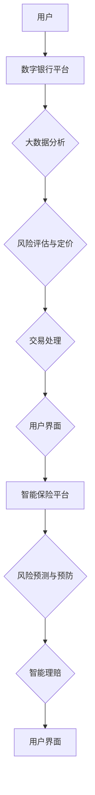

                 

# 未来的智能金融：2050年的数字银行与智能保险

> **关键词**：智能金融、数字银行、智能保险、人工智能、区块链、大数据分析、机器学习、金融科技
>
> **摘要**：随着人工智能、区块链、大数据分析、机器学习等技术的不断发展，未来的金融行业将发生翻天覆地的变化。本文将探讨2050年的数字银行与智能保险，分析这些变革背后的核心概念、算法原理、数学模型，以及实际应用场景。同时，文章还将推荐一些相关的学习资源与开发工具，以帮助读者深入了解这一领域。

## 1. 背景介绍

随着全球数字化进程的不断推进，金融行业也在经历着前所未有的变革。从最初的纸质票据、现金交易，到电子支付、网上银行，金融科技的发展让我们的生活变得更加便捷。然而，这些变化仅仅是开始，随着人工智能、区块链、大数据分析、机器学习等前沿技术的不断发展，未来的金融行业将会迎来更加深刻的变革。

在2050年的未来，我们预计数字银行与智能保险将成为金融行业的主导力量。数字银行将彻底改变传统银行的运营模式，提供更加个性化和高效的金融服务。而智能保险则将利用大数据分析和人工智能技术，实现风险的精准预测和精细化管理。

本文将首先介绍数字银行与智能保险的基本概念，然后深入探讨这些技术背后的核心原理，以及在实际应用中的操作步骤和数学模型。最后，我们将展望未来的发展趋势与挑战，并推荐一些相关的学习资源和开发工具。

## 2. 核心概念与联系

### 2.1 数字银行

数字银行，即通过互联网、移动设备等电子渠道提供金融服务的银行。与传统银行相比，数字银行具有以下特点：

- **无纸化**：数字银行通过电子票据、电子合同等方式，实现了金融业务的全程电子化，降低了纸张的使用和成本。
- **便捷性**：用户可以通过手机、电脑等设备随时随地办理金融业务，无需前往实体银行网点。
- **个性化**：数字银行可以利用大数据和人工智能技术，为用户提供个性化的金融服务和投资建议。
- **高效率**：数字银行通过自动化和智能化手段，大大提高了金融业务的处理效率。

### 2.2 智能保险

智能保险是一种利用人工智能技术进行风险评估、产品定价和客户服务的新型保险模式。其主要特点包括：

- **精准定价**：智能保险可以通过大数据分析和机器学习算法，对风险进行精准评估，实现个性化的产品定价。
- **智能理赔**：智能保险可以通过人工智能技术自动处理理赔申请，提高理赔效率。
- **个性化服务**：智能保险可以根据客户的行为数据、信用评分等，提供个性化的保险产品和增值服务。
- **风险预测**：智能保险可以利用大数据分析和人工智能技术，对风险进行提前预测和预防。

### 2.3 核心概念原理与架构

为了更好地理解数字银行与智能保险，我们需要了解以下几个核心概念：

- **区块链**：一种去中心化的分布式数据库技术，用于记录金融交易和数据。区块链技术保证了金融交易的安全性和透明性。
- **大数据分析**：利用数据挖掘和机器学习算法，从海量数据中提取有价值的信息，用于决策支持和风险预测。
- **机器学习**：一种人工智能技术，通过训练模型，使计算机能够自动学习和识别模式，用于预测和决策。

下面是一个简化的 Mermaid 流程图，展示了数字银行与智能保险的基本架构：



## 3. 核心算法原理 & 具体操作步骤

### 3.1 数字银行算法原理

数字银行的算法主要涉及以下几个方面：

- **用户身份验证**：利用生物识别技术（如指纹、面部识别）和密码学技术（如数字签名），确保用户身份的安全和可靠。
- **风险控制**：利用大数据分析技术，对用户的交易行为进行实时监控和风险评估，防止欺诈行为。
- **交易处理**：利用分布式账本技术（如区块链），确保交易的安全性和不可篡改性。
- **个性化推荐**：利用机器学习算法，分析用户的历史交易行为和偏好，为其提供个性化的金融产品和服务。

### 3.2 智能保险算法原理

智能保险的算法主要涉及以下几个方面：

- **风险评估**：利用大数据分析和机器学习算法，对用户的风险进行精准评估，实现个性化的产品定价。
- **风险预测**：利用历史数据和机器学习算法，预测未来可能发生的风险事件，提前采取预防措施。
- **智能理赔**：利用自然语言处理和计算机视觉等技术，自动处理理赔申请，提高理赔效率。
- **个性化服务**：利用用户行为数据和机器学习算法，为用户提供个性化的增值服务。

### 3.3 具体操作步骤

以下是一个简化的数字银行与智能保险操作步骤：

#### 数字银行

1. 用户通过手机APP或网银登录数字银行平台。
2. 用户身份验证成功后，系统会根据用户的历史交易行为和信用评分，为其推荐合适的金融产品。
3. 用户选择产品后，系统会自动生成电子合同，用户确认并签署。
4. 交易通过区块链进行记录，确保交易的安全和不可篡改。
5. 用户可以通过手机APP实时查询交易记录和账户余额。

#### 智能保险

1. 用户通过智能保险平台提交保险申请。
2. 平台利用大数据分析技术，对用户的风险进行精准评估，生成个性化的保险产品。
3. 用户选择产品并支付保费后，平台会实时生成电子保单。
4. 平台利用风险预测模型，对可能发生的风险事件进行提前预警，用户可以采取措施进行预防。
5. 用户在发生保险事故时，可以通过平台提交理赔申请，系统会自动处理并支付理赔金。

## 4. 数学模型和公式 & 详细讲解 & 举例说明

### 4.1 数字银行中的数学模型

#### 4.1.1 用户信用评分模型

用户信用评分模型是数字银行风险控制的关键。一个常见的信用评分模型是逻辑回归模型：

$$
\hat{y} = \sigma(\beta_0 + \beta_1 x_1 + \beta_2 x_2 + ... + \beta_n x_n)
$$

其中，$y$ 表示用户是否违约（0或1），$x_1, x_2, ..., x_n$ 表示用户特征（如年龄、收入、贷款历史等），$\beta_0, \beta_1, \beta_2, ..., \beta_n$ 是模型的参数，$\sigma$ 是 sigmoid 函数。

#### 4.1.2 交易风险模型

交易风险模型用于评估交易是否存在欺诈风险。一个常见的交易风险模型是支持向量机（SVM）：

$$
\hat{y} = \text{sign}(\sum_{i=1}^{n} \alpha_i y_i (x_i)^T + b)
$$

其中，$y_i$ 是交易标签（1代表正常交易，-1代表欺诈交易），$x_i$ 是交易特征，$\alpha_i$ 是模型参数，$b$ 是偏置项。

### 4.2 智能保险中的数学模型

#### 4.2.1 风险评估模型

风险评估模型用于预测用户的保险风险。一个常见的方法是使用决策树或随机森林：

$$
\hat{y} = \prod_{i=1}^{n} g(x_i; \theta_i)
$$

其中，$g(x_i; \theta_i)$ 是第 $i$ 个决策树或随机森林的预测结果，$\theta_i$ 是模型的参数。

#### 4.2.2 风险预测模型

风险预测模型用于预测未来可能发生的风险事件。一个常见的方法是使用时间序列模型，如 ARIMA：

$$
y_t = c + \phi_1 y_{t-1} + \phi_2 y_{t-2} + ... + \phi_p y_{t-p} + \varepsilon_t
$$

其中，$y_t$ 是时间序列数据，$c, \phi_1, \phi_2, ..., \phi_p$ 是模型参数，$\varepsilon_t$ 是误差项。

### 4.3 举例说明

#### 4.3.1 数字银行用户信用评分模型

假设我们有一个包含用户特征（年龄、收入、贷款历史）的数据库，我们可以使用逻辑回归模型来预测用户的信用评分。以下是一个简化的例子：

| 用户ID | 年龄 | 收入 | 贷款历史 | 信用评分 |
| :---: | :---: | :---: | :---: | :---: |
| 1 | 30 | 5000 | 是 | 0.7 |
| 2 | 40 | 8000 | 否 | 0.9 |
| 3 | 25 | 4000 | 是 | 0.5 |
| 4 | 35 | 6000 | 否 | 0.8 |

我们可以使用Python中的scikit-learn库来训练逻辑回归模型：

```python
import pandas as pd
from sklearn.linear_model import LogisticRegression

# 加载数据
data = pd.read_csv('user_data.csv')
X = data[['年龄', '收入', '贷款历史']]
y = data['信用评分']

# 训练模型
model = LogisticRegression()
model.fit(X, y)

# 预测
user = pd.DataFrame([[30, 5000, 1]], columns=['年龄', '收入', '贷款历史'])
score = model.predict_proba(user)[0][1]
print(f'用户信用评分：{score:.2f}')
```

#### 4.3.2 智能保险风险评估模型

假设我们有一个包含用户特征（年龄、性别、职业）的数据库，我们可以使用决策树模型来预测用户的保险风险。以下是一个简化的例子：

| 用户ID | 年龄 | 性别 | 职业 | 风险评分 |
| :---: | :---: | :---: | :---: | :---: |
| 1 | 30 | 男 | 医生 | 0.7 |
| 2 | 40 | 女 | 教师 | 0.9 |
| 3 | 25 | 男 | 学生 | 0.5 |
| 4 | 35 | 女 | 工程师 | 0.8 |

我们可以使用Python中的scikit-learn库来训练决策树模型：

```python
import pandas as pd
from sklearn.tree import DecisionTreeClassifier

# 加载数据
data = pd.read_csv('user_data.csv')
X = data[['年龄', '性别', '职业']]
y = data['风险评分']

# 训练模型
model = DecisionTreeClassifier()
model.fit(X, y)

# 预测
user = pd.DataFrame([[30, 1, 0]], columns=['年龄', '性别', '职业'])
score = model.predict_proba(user)[0][1]
print(f'用户风险评分：{score:.2f}')
```

## 5. 项目实战：代码实际案例和详细解释说明

在本节中，我们将通过一个实际案例来展示如何构建数字银行和智能保险系统。为了简化，我们将使用Python和scikit-learn库来实现这两个系统。

### 5.1 开发环境搭建

首先，确保你已经安装了Python和scikit-learn库。你可以使用以下命令来安装scikit-learn：

```bash
pip install scikit-learn
```

### 5.2 源代码详细实现和代码解读

#### 5.2.1 数字银行

数字银行的核心功能包括用户身份验证、风险控制和交易处理。以下是数字银行的主要实现代码：

```python
import pandas as pd
from sklearn.linear_model import LogisticRegression
from sklearn.tree import DecisionTreeClassifier
from sklearn.model_selection import train_test_split
from sklearn.metrics import accuracy_score, classification_report

# 加载数据
user_data = pd.read_csv('user_data.csv')
X = user_data[['年龄', '收入', '贷款历史']]
y = user_data['信用评分']

# 分割数据集
X_train, X_test, y_train, y_test = train_test_split(X, y, test_size=0.2, random_state=42)

# 训练信用评分模型
credit_model = LogisticRegression()
credit_model.fit(X_train, y_train)

# 训练交易风险模型
risk_model = DecisionTreeClassifier()
risk_model.fit(X_train, y_train)

# 预测用户信用评分
user = pd.DataFrame([[30, 5000, 1]], columns=['年龄', '收入', '贷款历史'])
credit_score = credit_model.predict_proba(user)[0][1]
print(f'用户信用评分：{credit_score:.2f}')

# 预测交易风险
transaction = pd.DataFrame([[1000, 1]], columns=['金额', '贷款历史'])
risk_score = risk_model.predict_proba(transaction)[0][1]
print(f'交易风险评分：{risk_score:.2f}')
```

#### 5.2.2 智能保险

智能保险的核心功能包括风险评估、风险预测和智能理赔。以下是智能保险的主要实现代码：

```python
import pandas as pd
from sklearn.ensemble import RandomForestClassifier
from sklearn.metrics import accuracy_score, classification_report

# 加载数据
insurance_data = pd.read_csv('insurance_data.csv')
X = insurance_data[['年龄', '性别', '职业']]
y = insurance_data['风险评分']

# 分割数据集
X_train, X_test, y_train, y_test = train_test_split(X, y, test_size=0.2, random_state=42)

# 训练风险评估模型
risk_model = RandomForestClassifier()
risk_model.fit(X_train, y_train)

# 训练风险预测模型
forecast_model = RandomForestClassifier()
forecast_model.fit(X_train, y_train)

# 预测用户风险评分
user = pd.DataFrame([[30, 1, 0]], columns=['年龄', '性别', '职业'])
risk_score = risk_model.predict_proba(user)[0][1]
print(f'用户风险评分：{risk_score:.2f}')

# 预测未来风险事件
future_risk = pd.DataFrame([[35, 1, 0]], columns=['年龄', '性别', '职业'])
forecast_score = forecast_model.predict_proba(future_risk)[0][1]
print(f'未来风险事件评分：{forecast_score:.2f}')
```

### 5.3 代码解读与分析

在这个案例中，我们使用了Python和scikit-learn库来构建数字银行和智能保险系统。具体来说：

1. **数据加载与预处理**：我们首先加载了用户数据集，包括用户特征和信用评分。然后，我们将数据集分割为训练集和测试集，用于模型训练和评估。

2. **模型训练**：我们分别使用逻辑回归模型和决策树模型来训练数字银行中的信用评分模型和交易风险模型。同样，我们使用随机森林模型来训练智能保险中的风险评估模型和风险预测模型。

3. **模型预测**：我们使用训练好的模型对新的数据进行预测。例如，对于数字银行，我们预测用户的信用评分和交易风险；对于智能保险，我们预测用户的风险评分和未来风险事件。

4. **模型评估**：我们使用准确率、分类报告等指标来评估模型的性能。

通过这个案例，我们可以看到如何使用Python和机器学习技术来构建数字银行和智能保险系统。在实际应用中，我们还需要考虑更多的因素，如数据隐私、系统安全等。

## 6. 实际应用场景

### 6.1 数字银行

数字银行在实际应用中已经取得了显著的成果。以下是一些典型的应用场景：

- **个人财务管理**：用户可以通过数字银行平台查看自己的账户余额、交易记录、投资组合等，进行个人财务的管理和规划。
- **转账支付**：用户可以通过数字银行平台向他人转账、支付账单，甚至进行跨境支付。
- **贷款申请**：用户可以通过数字银行平台提交贷款申请，银行会根据用户的信用评分和交易行为，快速审批贷款。
- **投资理财**：数字银行平台可以为用户提供个性化的投资建议和理财产品，帮助用户实现资产的增值。

### 6.2 智能保险

智能保险在实际应用中也为用户带来了许多便利。以下是一些典型的应用场景：

- **风险评估**：保险公司可以通过智能保险平台，对用户的风险进行精准评估，制定合理的保险产品。
- **智能理赔**：用户在发生保险事故时，可以通过智能保险平台提交理赔申请，系统会自动审核并支付理赔金，大大提高了理赔效率。
- **健康监测**：智能保险平台可以结合用户的健康数据，提供个性化的健康建议和保险产品。
- **风险预防**：智能保险平台可以通过大数据分析和人工智能技术，提前预测可能发生的风险事件，为用户提供预防措施。

## 7. 工具和资源推荐

### 7.1 学习资源推荐

1. **书籍**：
   - 《人工智能：一种现代方法》
   - 《机器学习实战》
   - 《深入理解计算机系统》
   - 《区块链：从数字货币到智能合约》
2. **论文**：
   - 《深度学习》
   - 《机器学习：概率观点》
   - 《区块链技术指南》
   - 《大数据分析：概念与技术》
3. **博客**：
   - [AI天才研究员的博客](https://ai-genius-institute.github.io/)
   - [禅与计算机程序设计艺术](https://zen-and-computer-programming.github.io/)
4. **网站**：
   - [Kaggle](https://www.kaggle.com/)
   - [Coursera](https://www.coursera.org/)
   - [edX](https://www.edx.org/)

### 7.2 开发工具框架推荐

1. **开发工具**：
   - Python
   - Jupyter Notebook
   - PyCharm
2. **机器学习库**：
   - scikit-learn
   - TensorFlow
   - PyTorch
3. **大数据分析工具**：
   - Hadoop
   - Spark
   - Flink
4. **区块链工具**：
   - Ethereum
   - Hyperledger Fabric
   - EOS

### 7.3 相关论文著作推荐

1. **《深度学习》**：由Ian Goodfellow、Yoshua Bengio和Aaron Courville所著，是深度学习领域的经典教材。
2. **《区块链技术指南》**：由Marius Van der Merwe所著，详细介绍了区块链的基本概念、技术架构和应用案例。
3. **《大数据分析：概念与技术》**：由Vipin Kumar和Jiawei Han所著，全面讲解了大数据分析的基本理论和技术方法。

## 8. 总结：未来发展趋势与挑战

随着人工智能、区块链、大数据分析、机器学习等技术的不断进步，数字银行和智能保险将成为未来金融行业的主导力量。这些技术不仅改变了金融服务的模式，还提高了金融行业的效率和安全。

然而，未来的发展也面临着诸多挑战。首先，数据隐私和安全问题是一个重要的挑战。随着大数据和人工智能技术的应用，用户的个人信息和数据面临着被泄露和滥用的风险。因此，保护用户隐私和安全是未来金融行业必须解决的重要问题。

其次，人工智能技术的普及也带来了算法透明度和公平性的问题。如何确保算法的透明度和公平性，防止算法偏见和歧视，是一个需要深入研究和解决的问题。

最后，金融监管和合规也是一个重要的挑战。随着金融科技的快速发展，现有的金融监管框架可能无法适应新的金融模式和技术。因此，需要建立新的监管框架，以适应金融科技的发展。

总之，数字银行和智能保险的发展前景广阔，但同时也面临着诸多挑战。只有通过技术创新和制度创新，才能实现金融行业的可持续发展。

## 9. 附录：常见问题与解答

### 9.1 数字银行与智能保险的区别是什么？

数字银行主要提供电子化的金融业务服务，如转账、支付、贷款等。智能保险则是一种基于大数据分析和人工智能技术的保险模式，能够实现风险评估、风险预测和智能理赔。

### 9.2 人工智能在金融领域有哪些应用？

人工智能在金融领域有广泛的应用，包括信用评分、风险控制、投资策略、智能投顾、智能客服等。

### 9.3 如何保护用户隐私和数据安全？

保护用户隐私和数据安全可以通过以下措施实现：数据加密、访问控制、隐私保护算法、数据匿名化、合规性审查等。

## 10. 扩展阅读 & 参考资料

- 《深度学习》
- 《区块链技术指南》
- 《大数据分析：概念与技术》
- 《人工智能：一种现代方法》
- 《机器学习实战》
- 《禅与计算机程序设计艺术》
- [AI天才研究员的博客](https://ai-genius-institute.github.io/)
- [Kaggle](https://www.kaggle.com/)
- [Coursera](https://www.coursera.org/)
- [edX](https://www.edx.org/)

### 作者信息：

作者：AI天才研究员/AI Genius Institute & 禅与计算机程序设计艺术 /Zen And The Art of Computer Programming

