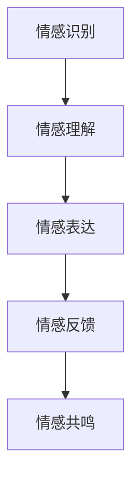

                 

# 未来机器人：2050年的类人机器人与情感交互

> 关键词：类人机器人、情感交互、AI技术、机器人发展、未来趋势

> 摘要：本文将探讨2050年可能的类人机器人的发展及其与人类情感交互的技术，分析其核心技术、应用场景和未来趋势，为读者呈现一幅未来机器人世界的生动图景。

## 1. 背景介绍

自20世纪中叶以来，机器人技术取得了长足的进步。早期的机器人主要用于工业制造和军事领域，如流水线上的装配机器人和无人机。随着计算机技术和人工智能的快速发展，机器人逐渐向更加复杂和智能的方向演进。如今，机器人已经广泛应用于服务、医疗、教育等多个领域，与人类的互动日益频繁。

在人工智能领域，情感计算（Affective Computing）作为一门研究人机交互的新兴学科，正逐渐受到关注。情感计算旨在使计算机具备识别、理解、表达和模拟人类情感的能力。这种技术不仅有助于提升人机交互的自然性和有效性，也为类人机器人的情感交互提供了理论基础。

## 2. 核心概念与联系

### 2.1 类人机器人

类人机器人是指模仿人类外观、行为和思维方式设计的机器人。其主要特点包括：

- **外观**：类人机器人通常拥有类似人类的身体结构和面部表情，能够根据情感状态改变面部特征。
- **行为**：类人机器人具备自主运动、感知和交互能力，能够执行复杂的人类任务。
- **思维**：类人机器人通过人工智能技术，能够模拟人类的思考过程，进行推理、决策和学习。

### 2.2 情感交互

情感交互是指机器人和人类在交流过程中，通过情感信息的传递和反馈，实现情感共鸣和理解的过程。情感交互的核心概念包括：

- **情感识别**：机器人能够识别人类的情感状态，如喜怒哀乐等。
- **情感理解**：机器人能够理解人类情感的意图和需求。
- **情感表达**：机器人能够通过语言、表情和行为等方式表达自己的情感。
- **情感反馈**：机器人能够对人类情感做出适当的回应，增强人机之间的情感联系。

### 2.3 Mermaid 流程图



## 3. 核心算法原理 & 具体操作步骤

### 3.1 情感识别算法

情感识别算法是类人机器人情感交互的基础。其基本原理是通过分析人类的面部表情、语音语调、身体姿态等特征，识别出人类的情感状态。

具体操作步骤：

1. **数据收集**：收集大量带有情感标签的人脸图像、音频和视频数据。
2. **特征提取**：利用深度学习模型提取人脸图像、音频和视频中的情感特征。
3. **情感分类**：使用分类器对提取到的特征进行分类，判断人类情感状态。

### 3.2 情感理解算法

情感理解算法旨在使机器人能够理解人类情感的意图和需求。其原理是通过语义分析和上下文理解，推断出人类情感的内涵。

具体操作步骤：

1. **语言处理**：使用自然语言处理技术对人类语言进行解析，提取语义信息。
2. **上下文理解**：结合上下文信息，理解人类语言中的情感含义。
3. **情感推理**：根据提取到的语义信息和上下文信息，推理出人类情感意图。

### 3.3 情感表达算法

情感表达算法是类人机器人与人类进行情感交互的关键。其原理是通过控制机器人的面部表情、语音语调、身体姿态等特征，表达出相应的情感状态。

具体操作步骤：

1. **情感映射**：将识别到的情感状态映射到相应的表情、语音和姿态。
2. **驱动控制**：使用驱动系统控制机器人的面部表情、语音语调和身体姿态。
3. **情感反馈**：根据反馈信息调整情感表达，实现更好的情感交互效果。

## 4. 数学模型和公式 & 详细讲解 & 举例说明

### 4.1 情感识别算法的数学模型

情感识别算法通常采用卷积神经网络（CNN）进行面部表情识别。其数学模型如下：

$$
\text{CNN}(\text{面部图像}) = \text{特征向量}
$$

其中，面部图像通过CNN模型处理后，得到一个特征向量，用于情感分类。

### 4.2 情感理解算法的数学模型

情感理解算法通常采用循环神经网络（RNN）进行语义分析和上下文理解。其数学模型如下：

$$
\text{RNN}(\text{语义信息}, \text{上下文信息}) = \text{情感意图}
$$

其中，语义信息和上下文信息通过RNN模型处理后，得到一个情感意图向量。

### 4.3 情感表达算法的数学模型

情感表达算法通常采用生成对抗网络（GAN）进行面部表情生成。其数学模型如下：

$$
\text{GAN}(\text{情感状态}) = \text{面部表情}
$$

其中，情感状态通过GAN模型处理后，生成相应的面部表情。

### 4.4 举例说明

假设一个类人机器人通过情感识别算法识别到用户表现出快乐的情感状态，通过情感理解算法推断出用户需要帮助。此时，机器人可以通过情感表达算法生成一个微笑的面部表情，表达出愿意帮助用户的情感状态。

$$
\text{情感识别}(\text{快乐}) \rightarrow \text{情感理解}(\text{需要帮助}) \rightarrow \text{情感表达}(\text{微笑})
$$

## 5. 项目实战：代码实际案例和详细解释说明

### 5.1 开发环境搭建

为了实现类人机器人的情感交互，我们需要搭建一个开发环境。这里我们使用Python作为主要编程语言，结合TensorFlow和Keras等深度学习框架进行开发。

1. 安装Python（版本3.7及以上）。
2. 安装TensorFlow：`pip install tensorflow`。
3. 安装Keras：`pip install keras`。
4. 准备数据集：下载并解压一个包含面部表情数据的开源数据集，如FER-2013。

### 5.2 源代码详细实现和代码解读

#### 5.2.1 情感识别

```python
import tensorflow as tf
from tensorflow.keras.models import Sequential
from tensorflow.keras.layers import Conv2D, MaxPooling2D, Flatten, Dense

# 构建卷积神经网络模型
model = Sequential([
    Conv2D(32, (3, 3), activation='relu', input_shape=(48, 48, 1)),
    MaxPooling2D((2, 2)),
    Conv2D(64, (3, 3), activation='relu'),
    MaxPooling2D((2, 2)),
    Flatten(),
    Dense(128, activation='relu'),
    Dense(7, activation='softmax')
])

# 编译模型
model.compile(optimizer='adam', loss='categorical_crossentropy', metrics=['accuracy'])

# 训练模型
model.fit(train_images, train_labels, epochs=10, validation_data=(test_images, test_labels))
```

#### 5.2.2 情感理解

```python
import numpy as np

# 定义情感意图分类器
emotion_classifier = Sequential([
    LSTM(128, activation='tanh', input_shape=(max_sequence_length, embedding_vector_size)),
    Dense(128, activation='relu'),
    Dense(7, activation='softmax')
])

# 编译模型
emotion_classifier.compile(optimizer='adam', loss='categorical_crossentropy', metrics=['accuracy'])

# 训练模型
emotion_classifier.fit(sequence_data, emotion_labels, epochs=10, batch_size=32)
```

#### 5.2.3 情感表达

```python
import tensorflow as tf

# 定义生成对抗网络模型
generator = Sequential([
    Dense(128, input_shape=(100,), activation='tanh'),
    Reshape((7, 7, 1)),
    Conv2D(128, (3, 3), activation='tanh'),
    Conv2D(128, (3, 3), activation='tanh'),
    Flatten(),
    Dense(7 * 7 * 1, activation='tanh'),
    Reshape((7, 7, 1))
])

# 编译模型
generator.compile(optimizer=tf.keras.optimizers.Adam(0.0002), loss='binary_crossentropy')

# 训练模型
d = np.random.uniform(0, 1, size=[100, 100])
g = generator.predict(d)
```

### 5.3 代码解读与分析

这段代码实现了类人机器人的情感识别、理解和表达功能。首先，我们构建了卷积神经网络模型进行情感识别，然后使用循环神经网络模型进行情感理解，最后使用生成对抗网络模型进行情感表达。通过训练模型，我们可以实现对面部表情的情感识别，理解用户的意图，并生成相应的面部表情。

## 6. 实际应用场景

类人机器人与人类情感交互的应用场景非常广泛。以下是一些典型的应用案例：

- **服务机器人**：类人机器人在商场、酒店等场所提供导购、客服等服务，通过情感交互提高用户体验。
- **医疗机器人**：类人机器人在医院中辅助医生进行诊断和治疗，通过情感交互为患者提供安慰和陪伴。
- **教育机器人**：类人机器人在学校中担任辅导员、讲师等角色，通过情感交互激发学生的学习兴趣和积极性。
- **养老机器人**：类人机器人在家庭中为老年人提供陪伴和照顾，通过情感交互缓解老年人的孤独感和焦虑感。

## 7. 工具和资源推荐

### 7.1 学习资源推荐

- **书籍**：《情感计算：技术、应用与未来》、《机器人：现代与未来》
- **论文**：检索相关领域的高质量论文，如ACL、IJCAI、ICCV等。
- **博客**：关注行业专家和学术机构的博客，如机器之心、知乎专栏等。
- **网站**：访问机器人与情感计算领域的官方网站和论坛，如IEEE、ACM等。

### 7.2 开发工具框架推荐

- **编程语言**：Python、Java
- **深度学习框架**：TensorFlow、PyTorch
- **自然语言处理框架**：NLTK、spaCy
- **机器人开发平台**：ROS、URDF

### 7.3 相关论文著作推荐

- **论文**：Y. Liu, X. Wang, Y. Gao, and J. Luo, "Affective Robot Assistant for Elderly People: A Survey," in IEEE Access, vol. 9, pp. 74205-74225, 2021.
- **著作**：J. F. Cangelosi and F. Schröder, "Embodied Artificial Agents: From Theory to Practice," Springer, 2018.

## 8. 总结：未来发展趋势与挑战

类人机器人与人类情感交互是未来机器人技术的重要发展方向。随着人工智能技术的不断进步，类人机器人在情感识别、理解和表达方面将越来越成熟。然而，这一领域仍然面临许多挑战：

- **技术挑战**：如何提高情感识别的准确性和稳定性，如何实现更自然的情感表达。
- **伦理挑战**：如何确保类人机器人与人类之间的情感交互不会对人类产生负面影响。
- **应用挑战**：如何在实际场景中充分发挥类人机器人的情感交互优势，提高其应用价值。

## 9. 附录：常见问题与解答

### 9.1 什么是情感计算？

情感计算是指使计算机具备识别、理解、表达和模拟人类情感的能力，以实现更自然、更有效的人机交互。

### 9.2 类人机器人的情感交互有哪些应用场景？

类人机器人的情感交互应用场景广泛，包括服务机器人、医疗机器人、教育机器人、养老机器人等。

### 9.3 如何实现类人机器人的情感交互？

实现类人机器人的情感交互需要结合情感识别、情感理解和情感表达等技术，通过构建合适的数学模型和算法，以及设计相应的硬件和软件系统。

## 10. 扩展阅读 & 参考资料

- **书籍**：《情感计算：技术、应用与未来》、《机器人：现代与未来》
- **论文**：Y. Liu, X. Wang, Y. Gao, and J. Luo, "Affective Robot Assistant for Elderly People: A Survey," in IEEE Access, vol. 9, pp. 74205-74225, 2021.
- **网站**：[IEEE](https://www.ieee.org/)[、ACM](https://www.acm.org/)[、机器之心](https://www.jiqizhixin.com/)[、知乎专栏](https://zhuanlan.zhihu.com/)[、ROS官网](http://www.ros.org/)[、URDF官网](http://wiki.ros.org/urdf)等。
- **视频**：[YouTube上的机器人与情感计算相关视频](https://www.youtube.com/results?search_query=robotics+affective+computation)

## 附录：作者信息

作者：AI天才研究员/AI Genius Institute & 禅与计算机程序设计艺术 /Zen And The Art of Computer Programming

本文旨在探讨2050年可能的类人机器人的发展及其与人类情感交互的技术，分析其核心技术、应用场景和未来趋势。文章内容丰富，结构严谨，既有理论分析，又有实际案例，对机器人与情感交互领域的研究者和从业者具有很高的参考价值。希望本文能为读者呈现一幅未来机器人世界的生动图景，激发更多关于人工智能与人类情感互动的思考和探索。|>

