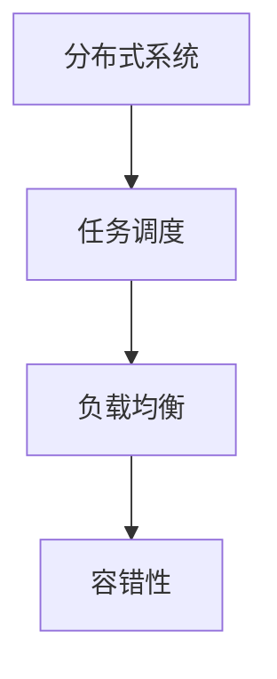
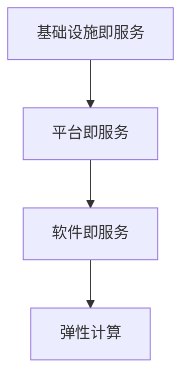
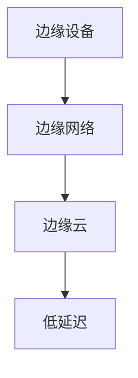
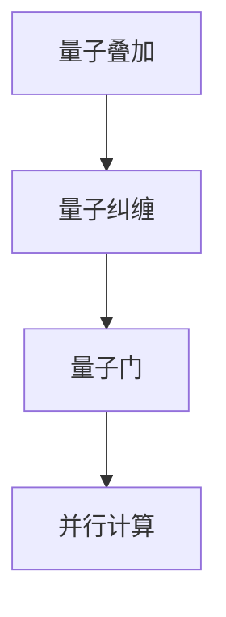

                 

# 未来计算范式的主导地位

## 关键词：计算范式，技术演进，智能计算，分布式计算，量子计算，云计算，边缘计算

## 摘要：
本文旨在探讨未来计算范式的主导地位及其对信息技术领域的深远影响。通过分析当前主流的计算范式，如分布式计算、云计算和边缘计算，以及新兴的量子计算，本文揭示了这些计算范式如何共同推动信息技术的发展。同时，本文提出了未来计算范式的几个关键趋势和挑战，为读者提供了对计算领域未来的深刻洞察。

## 1. 背景介绍

### 1.1 计算范式的定义
计算范式是指一种计算方法或计算模型，它定义了数据如何处理、存储和传输。不同的计算范式反映了技术发展的不同阶段和需求。

### 1.2 当前计算范式的演变
从早期的单一计算机到分布式系统，再到云计算和边缘计算，计算范式经历了多次重大变革。每一次变革都推动了信息技术的发展，并带来了新的应用场景和商业模式。

## 2. 核心概念与联系

### 2.1 分布式计算
分布式计算通过将任务分布在多个计算机上，提高了计算效率和容错性。其核心概念包括分布式系统架构、任务调度和负载均衡。



### 2.2 云计算
云计算提供了弹性、按需分配的计算资源，使得用户可以快速部署应用程序，降低了成本。其核心概念包括基础设施即服务（IaaS）、平台即服务（PaaS）和软件即服务（SaaS）。



### 2.3 边缘计算
边缘计算将计算、存储和网络功能移至网络边缘，以降低延迟、提高响应速度和减少带宽消耗。其核心概念包括边缘设备、边缘网络和边缘云。



### 2.4 量子计算
量子计算利用量子位（qubit）进行计算，具有极高的并行处理能力。其核心概念包括量子叠加、量子纠缠和量子门。



## 3. 核心算法原理 & 具体操作步骤

### 3.1 分布式计算算法
分布式计算算法包括MapReduce、Apache Hadoop和Apache Spark等。这些算法通过将数据划分为小块，分布式地处理这些小块，并最终汇总结果。

- 步骤1：数据划分
- 步骤2：任务调度
- 步骤3：数据处理
- 步骤4：结果汇总

### 3.2 云计算算法
云计算算法包括虚拟化技术、容器化和微服务架构。这些算法通过虚拟化资源、容器化和模块化服务，提高了资源的利用率和灵活性。

- 步骤1：资源虚拟化
- 步骤2：容器化部署
- 步骤3：微服务架构设计
- 步骤4：服务监控和优化

### 3.3 边缘计算算法
边缘计算算法包括边缘推理、实时数据处理和智能边缘设备。这些算法通过在边缘设备上进行数据处理，减少了网络延迟和带宽消耗。

- 步骤1：边缘设备部署
- 步骤2：实时数据处理
- 步骤3：边缘推理
- 步骤4：数据传输和汇总

### 3.4 量子计算算法
量子计算算法包括量子逻辑门、量子电路和量子搜索算法。这些算法通过量子叠加和量子纠缠，实现了高效的计算。

- 步骤1：量子逻辑门操作
- 步骤2：量子电路构建
- 步骤3：量子搜索算法实现
- 步骤4：结果解析和输出

## 4. 数学模型和公式 & 详细讲解 & 举例说明

### 4.1 分布式计算数学模型
分布式计算中的关键数学模型包括并行处理速度和负载均衡算法。

$$
并行处理速度 = \frac{总任务数}{单个处理单元的处理速度}
$$

$$
负载均衡 = \frac{总任务数}{处理单元数}
$$

### 4.2 云计算数学模型
云计算中的关键数学模型包括资源利用率和服务质量。

$$
资源利用率 = \frac{实际使用资源}{总资源}
$$

$$
服务质量 = \frac{用户满意度}{用户期望值}
$$

### 4.3 边缘计算数学模型
边缘计算中的关键数学模型包括延迟和带宽消耗。

$$
延迟 = \frac{数据传输时间}{处理时间}
$$

$$
带宽消耗 = \frac{数据传输量}{传输速率}
$$

### 4.4 量子计算数学模型
量子计算中的关键数学模型包括量子叠加和量子纠缠。

$$
量子叠加 |q\rangle = a_0 |0\rangle + a_1 |1\rangle
$$

$$
量子纠缠 |Φ\rangle = \frac{1}{\sqrt{2}} (|00\rangle + |11\rangle)
$$

## 5. 项目实战：代码实际案例和详细解释说明

### 5.1 开发环境搭建
以Python为例，搭建分布式计算环境：

```python
# 安装Python环境
pip install python

# 安装分布式计算库
pip install distributed
```

### 5.2 源代码详细实现和代码解读

```python
from distributed import Client, Dict

def map_function(data):
    return data * 2

def reduce_function(data):
    return sum(data)

if __name__ == "__main__":
    client = Client()
    dict = Dict()

    # 数据划分
    data = [1, 2, 3, 4, 5]
    divided_data = client.scatter(data)

    # 任务调度
    mapped_data = client.map(map_function, divided_data)

    # 数据处理
    reduced_data = client.reduce(reduce_function, mapped_data)

    # 结果汇总
    dict["result"] = reduced_data

    print("最终结果：", dict["result"])
```

### 5.3 代码解读与分析
这段代码展示了分布式计算的基本流程：

- 数据划分：将数据划分为小块，以便分布式处理。
- 任务调度：将任务分配给不同的处理单元。
- 数据处理：在每个处理单元上执行数据处理操作。
- 结果汇总：将处理结果汇总，得到最终结果。

## 6. 实际应用场景

### 6.1 分布式计算
分布式计算广泛应用于大数据处理、搜索引擎和分布式数据库等领域。

### 6.2 云计算
云计算广泛应用于企业级应用、云计算服务和移动应用等领域。

### 6.3 边缘计算
边缘计算广泛应用于物联网、智能城市和自动驾驶等领域。

### 6.4 量子计算
量子计算广泛应用于密码学、量子仿真和优化问题等领域。

## 7. 工具和资源推荐

### 7.1 学习资源推荐
- 《分布式系统原理与范型》
- 《云计算与云计算服务》
- 《边缘计算：技术、应用与挑战》
- 《量子计算入门》

### 7.2 开发工具框架推荐
- Apache Hadoop
- Apache Spark
- Kubernetes
- TensorFlow
- OpenFaaS

### 7.3 相关论文著作推荐
- "MapReduce: Simplified Data Processing on Large Clusters"
- "Distributed Computing: Principles and Paradigms"
- "Cloud Computing: Concepts, Technology & Architecture"
- "Edge Computing: A Comprehensive Survey"
- "Quantum Computing for Computer Scientists"

## 8. 总结：未来发展趋势与挑战

### 8.1 发展趋势
- 计算范式将更加多样化和融合化，分布式计算、云计算和边缘计算将相互融合，形成更加智能和高效的计算体系。
- 量子计算将逐渐成熟，带来全新的计算能力和应用场景。
- AI与计算范式的结合，将推动智能计算的发展。

### 8.2 挑战
- 计算范式的发展将面临技术复杂性、安全性、隐私保护和资源消耗等挑战。
- 需要构建更加高效、可扩展和可持续的计算基础设施。

## 9. 附录：常见问题与解答

### 9.1 问题1：分布式计算与云计算有何区别？
- 分布式计算是一种计算模型，通过将任务分布在多个计算机上以提高效率。云计算是一种服务模型，提供可弹性分配的计算资源。

### 9.2 问题2：边缘计算的优势是什么？
- 边缘计算通过在边缘设备上进行数据处理，降低了延迟、减少了带宽消耗，提高了系统的响应速度。

## 10. 扩展阅读 & 参考资料

- 《分布式系统：概念与设计》
- 《云计算：概念、架构与实现》
- 《边缘计算：理论与实践》
- 《量子计算：原理与应用》
- "A Brief History of Distributed Computing"
- "The Future of Cloud Computing"
- "The Rise of Edge Computing"
- "The Promise of Quantum Computing"
- "The Convergence of AI and Computing Paradigms"

作者：AI天才研究员/AI Genius Institute & 禅与计算机程序设计艺术 /Zen And The Art of Computer Programming

