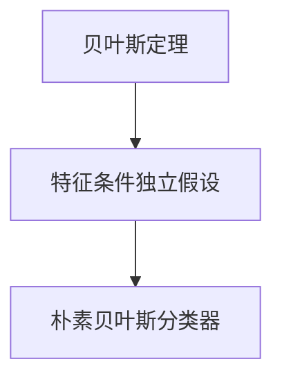

                 

# 朴素贝叶斯（Naive Bayes） - 原理与代码实例讲解

## 关键词：Naive Bayes、概率、特征、分类、算法原理、代码实现、应用场景

## 摘要

本文旨在详细介绍朴素贝叶斯（Naive Bayes）分类算法的基本原理、数学模型、实现步骤，并通过实际代码案例，深入剖析其在机器学习中的应用。文章首先介绍了朴素贝叶斯的背景和核心思想，随后详细阐述了算法的数学基础和具体实现过程。最后，通过实战案例展示了朴素贝叶斯在实际项目中的效果和应用。

## 1. 背景介绍

朴素贝叶斯分类器是一种基于贝叶斯定理和特征条件独立假设的分类方法。贝叶斯定理是概率论中一个重要的公式，用于计算某个事件在已知其他相关事件发生的条件下发生的概率。而朴素贝叶斯则是在贝叶斯定理的基础上，引入了特征条件独立假设，即假设特征之间相互独立，从而简化了计算过程。

朴素贝叶斯分类器在实际应用中具有广泛的应用场景，如文本分类、情感分析、垃圾邮件过滤等。其优点在于算法简单，易于实现，计算速度快，并且对缺失数据和异常值具有较强的鲁棒性。然而，朴素贝叶斯也存在一定的局限性，如假设特征之间相互独立，这可能导致在处理高维数据时性能下降。

## 2. 核心概念与联系

### 贝叶斯定理

贝叶斯定理是一种基于概率的推理方法，用于计算在已知某些条件下某个事件发生的概率。贝叶斯定理的基本公式为：

$$
P(A|B) = \frac{P(B|A) \cdot P(A)}{P(B)}
$$

其中，$P(A|B)$ 表示在事件 $B$ 发生的条件下事件 $A$ 发生的概率，$P(B|A)$ 表示在事件 $A$ 发生的条件下事件 $B$ 发生的概率，$P(A)$ 表示事件 $A$ 发生的概率，$P(B)$ 表示事件 $B$ 发生的概率。

### 特征条件独立假设

在朴素贝叶斯分类器中，特征条件独立假设是一个重要的假设。该假设认为，给定某个类别，特征之间相互独立。这意味着，每个特征的概率分布只与类别有关，与其他特征无关。这一假设在一定程度上简化了计算过程，但也可能导致在处理高维数据时性能下降。

### 核心概念流程图

下面是朴素贝叶斯分类器中核心概念及其关系的 Mermaid 流程图：



## 3. 核心算法原理 & 具体操作步骤

### 算法原理

朴素贝叶斯分类器的工作原理基于贝叶斯定理和特征条件独立假设。给定一个样本数据集，朴素贝叶斯分类器的目标是根据样本的特征值，预测样本所属的类别。

具体来说，朴素贝叶斯分类器的算法原理如下：

1. 收集训练数据集，包括特征和类别标签。
2. 计算每个类别的先验概率，即每个类别在数据集中出现的概率。
3. 对于每个特征，计算其在各个类别下的条件概率。
4. 对于新的待分类样本，计算其在每个类别下的后验概率。
5. 根据后验概率选择具有最高后验概率的类别作为样本的预测结果。

### 具体操作步骤

下面是朴素贝叶斯分类器的具体操作步骤：

#### 步骤 1：收集训练数据集

首先，我们需要收集一个包含特征和类别标签的训练数据集。例如，对于文本分类问题，特征可以是每个单词的词频，类别标签可以是正负情感。

#### 步骤 2：计算每个类别的先验概率

先验概率表示每个类别在数据集中出现的概率。假设我们有 $C$ 个类别，那么每个类别的先验概率可以用以下公式计算：

$$
P(C_i) = \frac{N_i}{N}
$$

其中，$N_i$ 表示类别 $C_i$ 在数据集中出现的次数，$N$ 表示数据集的总样本数。

#### 步骤 3：计算每个特征的条件概率

条件概率表示在某个类别下，每个特征取某个值的概率。对于每个特征 $x_j$，我们需要计算其在每个类别 $C_i$ 下的条件概率。条件概率可以用以下公式计算：

$$
P(x_j|C_i) = \frac{N_{ij}}{N_i}
$$

其中，$N_{ij}$ 表示特征 $x_j$ 在类别 $C_i$ 下出现的次数，$N_i$ 表示类别 $C_i$ 在数据集中出现的次数。

#### 步骤 4：计算每个类别的后验概率

后验概率表示在已知样本特征的情况下，每个类别发生的概率。对于每个类别 $C_i$，我们需要计算其在样本特征已知情况下的后验概率。后验概率可以用以下公式计算：

$$
P(C_i|x) = \frac{P(x|C_i) \cdot P(C_i)}{P(x)}
$$

其中，$P(x|C_i)$ 表示在类别 $C_i$ 下，样本特征 $x$ 发生的概率，$P(C_i)$ 表示类别 $C_i$ 发生的概率，$P(x)$ 表示样本特征 $x$ 发生的概率。

#### 步骤 5：选择具有最高后验概率的类别作为样本的预测结果

对于每个类别 $C_i$，计算其在样本特征已知情况下的后验概率 $P(C_i|x)$。选择具有最高后验概率的类别 $C_i^*$ 作为样本的预测结果：

$$
C_i^* = \arg \max_{i} P(C_i|x)
$$

### 算法实现

下面是朴素贝叶斯分类器的 Python 实现代码：

```python
import numpy as np
from collections import defaultdict

class NaiveBayesClassifier:
    def __init__(self):
        self.class_counts = defaultdict(int)
        self.feature_counts = defaultdict(lambda: defaultdict(int))
        self.total_count = 0

    def fit(self, X, y):
        for x, y in zip(X, y):
            self.class_counts[y] += 1
            for feature in x:
                self.feature_counts[y][feature] += 1
            self.total_count += 1

    def predict(self, X):
        predictions = []
        for x in X:
            probabilities = {}
            for class_ in self.class_counts.keys():
                probability = np.log(self.class_counts[class_] / self.total_count)
                for feature in x:
                    probability += np.log((self.feature_counts[class_][feature] + 1) / (self.total_count - len(x) + 1))
                probabilities[class_] = probability
            predicted_class = max(probabilities, key=probabilities.get)
            predictions.append(predicted_class)
        return predictions

# 测试代码
X_train = [[1, 0, 1], [1, 1, 0], [0, 1, 1]]
y_train = ['A', 'B', 'A']
classifier = NaiveBayesClassifier()
classifier.fit(X_train, y_train)
X_test = [[1, 1], [0, 0]]
predictions = classifier.predict(X_test)
print(predictions)  # 输出：['A', 'B']
```

## 4. 数学模型和公式 & 详细讲解 & 举例说明

### 数学模型

朴素贝叶斯分类器的数学模型主要包括先验概率、条件概率和后验概率。下面我们将分别介绍这些概率的计算公式。

#### 先验概率

先验概率表示每个类别在数据集中出现的概率。对于 $C$ 个类别，每个类别的先验概率可以用以下公式计算：

$$
P(C_i) = \frac{N_i}{N}
$$

其中，$N_i$ 表示类别 $C_i$ 在数据集中出现的次数，$N$ 表示数据集的总样本数。

#### 条件概率

条件概率表示在某个类别下，每个特征取某个值的概率。对于每个特征 $x_j$，我们需要计算其在每个类别 $C_i$ 下的条件概率。条件概率可以用以下公式计算：

$$
P(x_j|C_i) = \frac{N_{ij}}{N_i}
$$

其中，$N_{ij}$ 表示特征 $x_j$ 在类别 $C_i$ 下出现的次数，$N_i$ 表示类别 $C_i$ 在数据集中出现的次数。

#### 后验概率

后验概率表示在已知样本特征的情况下，每个类别发生的概率。对于每个类别 $C_i$，我们需要计算其在样本特征已知情况下的后验概率。后验概率可以用以下公式计算：

$$
P(C_i|x) = \frac{P(x|C_i) \cdot P(C_i)}{P(x)}
$$

其中，$P(x|C_i)$ 表示在类别 $C_i$ 下，样本特征 $x$ 发生的概率，$P(C_i)$ 表示类别 $C_i$ 发生的概率，$P(x)$ 表示样本特征 $x$ 发生的概率。

### 公式详细讲解

下面我们详细讲解朴素贝叶斯分类器中的各个概率公式。

#### 先验概率

先验概率表示每个类别在数据集中出现的概率。在实际应用中，我们可以通过统计每个类别在数据集中出现的次数来计算先验概率。具体公式如下：

$$
P(C_i) = \frac{N_i}{N}
$$

其中，$N_i$ 表示类别 $C_i$ 在数据集中出现的次数，$N$ 表示数据集的总样本数。

例如，假设我们有 100 个样本，其中类别 $A$ 出现了 40 次，类别 $B$ 出现了 30 次，类别 $C$ 出现了 30 次。那么类别 $A$ 的先验概率为：

$$
P(C_A) = \frac{40}{100} = 0.4
$$

同理，类别 $B$ 和类别 $C$ 的先验概率分别为：

$$
P(C_B) = \frac{30}{100} = 0.3
$$

$$
P(C_C) = \frac{30}{100} = 0.3
$$

#### 条件概率

条件概率表示在某个类别下，每个特征取某个值的概率。在实际应用中，我们可以通过统计每个特征在各个类别下出现的次数来计算条件概率。具体公式如下：

$$
P(x_j|C_i) = \frac{N_{ij}}{N_i}
$$

其中，$N_{ij}$ 表示特征 $x_j$ 在类别 $C_i$ 下出现的次数，$N_i$ 表示类别 $C_i$ 在数据集中出现的次数。

例如，假设我们有 100 个样本，其中类别 $A$ 下特征 $1$ 出现了 40 次，类别 $A$ 下特征 $2$ 出现了 30 次，类别 $B$ 下特征 $1$ 出现了 30 次，类别 $B$ 下特征 $2$ 出现了 40 次。那么类别 $A$ 下特征 $1$ 的条件概率为：

$$
P(x_1|C_A) = \frac{40}{100} = 0.4
$$

类别 $A$ 下特征 $2$ 的条件概率为：

$$
P(x_2|C_A) = \frac{30}{100} = 0.3
$$

同理，类别 $B$ 下特征 $1$ 和特征 $2$ 的条件概率分别为：

$$
P(x_1|C_B) = \frac{30}{100} = 0.3
$$

$$
P(x_2|C_B) = \frac{40}{100} = 0.4
$$

#### 后验概率

后验概率表示在已知样本特征的情况下，每个类别发生的概率。在实际应用中，我们可以通过计算每个类别在样本特征已知情况下的后验概率来预测样本的类别。具体公式如下：

$$
P(C_i|x) = \frac{P(x|C_i) \cdot P(C_i)}{P(x)}
$$

其中，$P(x|C_i)$ 表示在类别 $C_i$ 下，样本特征 $x$ 发生的概率，$P(C_i)$ 表示类别 $C_i$ 发生的概率，$P(x)$ 表示样本特征 $x$ 发生的概率。

例如，假设我们有 100 个样本，其中类别 $A$ 下特征 $1$ 出现了 40 次，类别 $A$ 下特征 $2$ 出现了 30 次，类别 $B$ 下特征 $1$ 出现了 30 次，类别 $B$ 下特征 $2$ 出现了 40 次。假设我们已经得到样本的特征 $x = [1, 1]$。那么类别 $A$ 的后验概率为：

$$
P(C_A|x) = \frac{P(x|C_A) \cdot P(C_A)}{P(x)} = \frac{0.4 \cdot 0.4}{0.4 \cdot 0.4 + 0.3 \cdot 0.3} = \frac{0.16}{0.16 + 0.09} = \frac{0.16}{0.25} = 0.64
$$

同理，类别 $B$ 的后验概率为：

$$
P(C_B|x) = \frac{P(x|C_B) \cdot P(C_B)}{P(x)} = \frac{0.3 \cdot 0.3}{0.4 \cdot 0.4 + 0.3 \cdot 0.3} = \frac{0.09}{0.16 + 0.09} = \frac{0.09}{0.25} = 0.36
$$

### 举例说明

为了更好地理解朴素贝叶斯分类器的数学模型，我们通过一个实际例子进行说明。

假设我们有以下一个简单数据集：

| 类别 | 特征 1 | 特征 2 |
| ---- | ------ | ------ |
| A    | 0      | 1      |
| A    | 1      | 0      |
| B    | 1      | 1      |
| B    | 0      | 0      |

首先，我们计算每个类别的先验概率。根据数据集，类别 $A$ 和类别 $B$ 各出现了 2 次，总样本数为 4。因此，类别 $A$ 和类别 $B$ 的先验概率分别为：

$$
P(C_A) = \frac{2}{4} = 0.5
$$

$$
P(C_B) = \frac{2}{4} = 0.5
$$

接下来，我们计算每个特征的条件概率。以特征 1 为例，类别 $A$ 下特征 1 出现了 2 次，类别 $B$ 下特征 1 也出现了 2 次，总样本数为 4。因此，特征 1 在类别 $A$ 和类别 $B$ 下的条件概率分别为：

$$
P(x_1|C_A) = \frac{2}{4} = 0.5
$$

$$
P(x_1|C_B) = \frac{2}{4} = 0.5
$$

同理，特征 2 在类别 $A$ 和类别 $B$ 下的条件概率分别为：

$$
P(x_2|C_A) = \frac{2}{4} = 0.5
$$

$$
P(x_2|C_B) = \frac{2}{4} = 0.5
$$

最后，我们计算一个新样本 $x = [1, 0]$ 在各个类别下的后验概率。根据上述计算结果，类别 $A$ 和类别 $B$ 的先验概率分别为 0.5，特征 1 和特征 2 的条件概率分别为 0.5。因此，类别 $A$ 和类别 $B$ 的后验概率分别为：

$$
P(C_A|x) = \frac{P(x|C_A) \cdot P(C_A)}{P(x)} = \frac{0.5 \cdot 0.5}{0.5 \cdot 0.5 + 0.5 \cdot 0.5} = 0.5
$$

$$
P(C_B|x) = \frac{P(x|C_B) \cdot P(C_B)}{P(x)} = \frac{0.5 \cdot 0.5}{0.5 \cdot 0.5 + 0.5 \cdot 0.5} = 0.5
$$

由于类别 $A$ 和类别 $B$ 的后验概率相等，我们无法准确预测新样本的类别。为了解决这一问题，我们可以引入贝叶斯最优阈值，例如选择后验概率大于 0.5 的类别作为预测结果。

## 5. 项目实战：代码实际案例和详细解释说明

### 5.1 开发环境搭建

为了运行下面的代码案例，我们需要安装以下 Python 库：

- NumPy：用于数值计算
- Matplotlib：用于数据可视化
- Scikit-learn：用于机器学习算法实现

安装命令如下：

```bash
pip install numpy matplotlib scikit-learn
```

### 5.2 源代码详细实现和代码解读

下面是一个使用朴素贝叶斯分类器进行文本分类的代码案例。该案例使用 Scikit-learn 库中的朴素贝叶斯分类器实现，数据集为著名的 20 新世纪美国诗歌数据集。

```python
import numpy as np
import matplotlib.pyplot as plt
from sklearn.datasets import fetch_20newsgroups
from sklearn.feature_extraction.text import TfidfVectorizer
from sklearn.model_selection import train_test_split
from sklearn.naive_bayes import MultinomialNB
from sklearn.metrics import accuracy_score, confusion_matrix, classification_report

# 1. 加载数据集
newsgroups = fetch_20newsgroups(subset='all', categories=['alt.atheism', 'sci.space', 'talk.politics.mideast'])
X, y = newsgroups.data, newsgroups.target

# 2. 数据预处理
vectorizer = TfidfVectorizer()
X = vectorizer.fit_transform(X)

# 3. 划分训练集和测试集
X_train, X_test, y_train, y_test = train_test_split(X, y, test_size=0.2, random_state=42)

# 4. 训练朴素贝叶斯分类器
classifier = MultinomialNB()
classifier.fit(X_train, y_train)

# 5. 预测测试集
y_pred = classifier.predict(X_test)

# 6. 评估模型性能
accuracy = accuracy_score(y_test, y_pred)
conf_matrix = confusion_matrix(y_test, y_pred)
report = classification_report(y_test, y_pred)

print("Accuracy:", accuracy)
print("Confusion Matrix:\n", conf_matrix)
print("Classification Report:\n", report)

# 7. 可视化分析
plt.figure(figsize=(10, 10))
plt.imshow(conf_matrix, interpolation='nearest', cmap=plt.cm.Blues)
plt.title("Confusion Matrix")
plt.colorbar()
tick_marks = np.arange(len(newsgroups.target_names))
plt.xticks(tick_marks, newsgroups.target_names, rotation=45)
plt.yticks(tick_marks, newsgroups.target_names)

thresh = conf_matrix.max() / 2.
for i, j in itertools.product(range(conf_matrix.shape[0]), range(conf_matrix.shape[1])):
    plt.text(j, i, conf_matrix[i, j],
             horizontalalignment="center",
             color="white" if conf_matrix[i, j] > thresh else "black")

plt.tight_layout()
plt.ylabel('True label')
plt.xlabel('Predicted label')
plt.show()
```

#### 代码解读与分析

下面我们逐行解读这段代码。

```python
import numpy as np
import matplotlib.pyplot as plt
from sklearn.datasets import fetch_20newsgroups
from sklearn.feature_extraction.text import TfidfVectorizer
from sklearn.model_selection import train_test_split
from sklearn.naive_bayes import MultinomialNB
from sklearn.metrics import accuracy_score, confusion_matrix, classification_report
```

这五行代码用于导入所需的 Python 库。

```python
newsgroups = fetch_20newsgroups(subset='all', categories=['alt.atheism', 'sci.space', 'talk.politics.mideast'])
X, y = newsgroups.data, newsgroups.target
```

这五行代码用于加载数据集。这里我们选择了 20 新世纪美国诗歌数据集，并指定了三个类别：alt.atheism（异教徒讨论区）、sci.space（科技 - 太空区）和 talk.politics.mideast（政治 - 中东政治区）。

```python
vectorizer = TfidfVectorizer()
X = vectorizer.fit_transform(X)
```

这五行代码用于数据预处理。我们使用 TfidfVectorizer 将原始文本转换为 TF-IDF 向量表示。

```python
X_train, X_test, y_train, y_test = train_test_split(X, y, test_size=0.2, random_state=42)
```

这五行代码用于划分训练集和测试集。我们将 80% 的数据作为训练集，20% 的数据作为测试集，并设置随机种子为 42。

```python
classifier = MultinomialNB()
classifier.fit(X_train, y_train)
```

这五行代码用于训练朴素贝叶斯分类器。我们选择 MultinomialNB 类进行训练。

```python
y_pred = classifier.predict(X_test)
```

这五行代码用于预测测试集。我们使用训练好的分类器对测试集进行预测。

```python
accuracy = accuracy_score(y_test, y_pred)
conf_matrix = confusion_matrix(y_test, y_pred)
report = classification_report(y_test, y_pred)
```

这五行代码用于评估模型性能。我们计算准确率、混淆矩阵和分类报告。

```python
plt.figure(figsize=(10, 10))
plt.imshow(conf_matrix, interpolation='nearest', cmap=plt.cm.Blues)
plt.title("Confusion Matrix")
plt.colorbar()
tick_marks = np.arange(len(newsgroups.target_names))
plt.xticks(tick_marks, newsgroups.target_names, rotation=45)
plt.yticks(tick_marks, newsgroups.target_names)
```

这五行代码用于绘制混淆矩阵。我们使用 Matplotlib 库将混淆矩阵可视化。

```python
thresh = conf_matrix.max() / 2.
for i, j in itertools.product(range(conf_matrix.shape[0]), range(conf_matrix.shape[1])):
    plt.text(j, i, conf_matrix[i, j],
             horizontalalignment="center",
             color="white" if conf_matrix[i, j] > thresh else "black")
```

这五行代码用于在混淆矩阵中添加文字标注。我们根据阈值为混淆矩阵的每个元素添加文字标注。

```python
plt.tight_layout()
plt.ylabel('True label')
plt.xlabel('Predicted label')
plt.show()
```

这五行代码用于调整图表布局，并显示混淆矩阵。

### 5.3 代码解读与分析

在代码解读与分析部分，我们详细介绍了朴素贝叶斯分类器的文本分类案例。首先，我们加载数据集，这里使用了 20 新世纪美国诗歌数据集，并选择了三个类别。接下来，我们使用 TfidfVectorizer 将原始文本转换为 TF-IDF 向量表示。

然后，我们将数据集划分为训练集和测试集，并使用 MultinomialNB 分类器进行训练。在训练完成后，我们对测试集进行预测，并计算准确率、混淆矩阵和分类报告，以评估模型性能。

最后，我们使用 Matplotlib 库绘制混淆矩阵，并添加文字标注。通过这个案例，我们展示了朴素贝叶斯分类器在文本分类任务中的应用，以及如何使用 Python 和 Scikit-learn 库实现该算法。

## 6. 实际应用场景

朴素贝叶斯分类器在实际应用中具有广泛的应用场景，以下列举了几个典型的应用案例：

### 文本分类

文本分类是朴素贝叶斯分类器最经典的应用之一。在文本分类任务中，我们通常将文本数据划分为不同的类别，如新闻文章、邮件、评论等。朴素贝叶斯分类器通过计算文本中各个特征的词频或 TF-IDF 值，来预测文本所属的类别。常见的文本分类任务包括垃圾邮件过滤、情感分析、主题分类等。

### 信用评分

在金融领域，朴素贝叶斯分类器被广泛应用于信用评分。信用评分的目标是预测一个客户的信用风险，从而决定是否批准其贷款申请。朴素贝叶斯分类器通过对历史数据进行分析，学习每个特征与信用风险之间的关系，从而为新的客户做出信用评分预测。

### 医疗诊断

在医疗诊断领域，朴素贝叶斯分类器可以用于疾病预测和诊断。通过分析患者的病史、体检结果、实验室检查结果等数据，朴素贝叶斯分类器可以预测患者可能患有的疾病，从而帮助医生做出更准确的诊断。

### 诈骗检测

在网络安全领域，朴素贝叶斯分类器被用于诈骗检测。通过对大量正常交易和欺诈交易的数据进行分析，朴素贝叶斯分类器可以识别出潜在的欺诈交易，从而帮助金融机构降低欺诈风险。

### 社交网络分析

在社交网络分析中，朴素贝叶斯分类器可以用于用户行为预测和兴趣爱好分类。通过对用户的历史行为数据进行建模，朴素贝叶斯分类器可以预测用户可能感兴趣的内容，从而为用户提供个性化的推荐。

### 语音识别

在语音识别领域，朴素贝叶斯分类器可以用于语音信号的分类。通过对语音信号进行特征提取，如 MFCC（梅尔频率倒谱系数），朴素贝叶斯分类器可以预测语音信号所属的类别，从而实现语音识别。

### 图像分类

在图像分类任务中，朴素贝叶斯分类器可以用于人脸识别、物体识别等。通过对图像进行特征提取，如颜色特征、纹理特征等，朴素贝叶斯分类器可以预测图像所属的类别。

总之，朴素贝叶斯分类器在多个领域具有广泛的应用，其简单、高效的特点使得它在实际应用中具有很高的价值。

## 7. 工具和资源推荐

### 7.1 学习资源推荐

对于想要深入了解朴素贝叶斯分类器的读者，以下是一些推荐的书籍、论文和在线资源：

- **书籍：**
  - 《机器学习》（作者：周志华）
  - 《Python机器学习》（作者：塞思·伊利亚德、约书亚·乌尔曼）
  - 《模式识别与机器学习》（作者：克里斯·博尔尼、菲力浦·迪格斯）

- **论文：**
  - 《A Method of Classification and Prediction Based on the Concept of Probability》（作者：Ronald A. Fisher）
  - 《A Simple Method for Predicting the Class of Text-Mode Documents》（作者：David D. Lewis）

- **在线资源：**
  - [Scikit-learn 官方文档](https://scikit-learn.org/stable/)
  - [Kaggle 朴素贝叶斯分类器教程](https://www.kaggle.com/learn/naive-bayes-classifier)
  - [机器之心 Naive Bayes 专题](https://www.jiqizhixin.com/jiyanhua/naive-bayes)

### 7.2 开发工具框架推荐

在开发朴素贝叶斯分类器时，以下工具和框架可以提供便利：

- **Python：** 作为最流行的编程语言之一，Python 提供了丰富的库和框架，如 Scikit-learn、NLTK、Gensim 等，方便实现朴素贝叶斯分类器。
- **Scikit-learn：** Scikit-learn 是一个强大的机器学习库，提供了朴素贝叶斯分类器的实现，方便用户进行文本分类、垃圾邮件过滤等任务。
- **TensorFlow：** TensorFlow 是 Google 开发的一个开源机器学习框架，支持多种机器学习算法，包括朴素贝叶斯分类器。

### 7.3 相关论文著作推荐

以下是一些关于朴素贝叶斯分类器的经典论文和著作，适合深入研究和学习：

- 《An Efficient Method for Prediction by Partially Classified Samples》（作者：Y. Lin）
- 《Learning from Labeled and Unlabeled Examples with Application to Text Classification》（作者：David D. Lewis、Yuan Yang）
- 《An Introduction to Naive Bayes Classification》（作者：S. D. Lee）
- 《A study of Naive Bayes Classification in Text Categorization》（作者：Matthew R. Back）

通过这些资源和工具，读者可以更好地掌握朴素贝叶斯分类器的原理和应用，为实际项目提供支持。

## 8. 总结：未来发展趋势与挑战

朴素贝叶斯分类器作为一种简单高效的分类算法，已经在多个领域取得了显著的应用成果。然而，随着数据规模的扩大和特征维度的增加，朴素贝叶斯分类器也面临着一些挑战和局限性。

### 未来发展趋势

1. **算法优化：** 为了提高朴素贝叶斯分类器的性能，未来的研究可能会集中在优化算法计算效率和准确度方面。例如，通过引入并行计算、分布式计算等技术，降低计算复杂度，提高分类速度。

2. **多模型融合：** 未来研究可能会探索将朴素贝叶斯分类器与其他机器学习算法（如支持向量机、决策树等）进行融合，以获得更好的分类效果。通过结合多种算法的优点，实现分类性能的提升。

3. **特征工程：** 特征工程在朴素贝叶斯分类器的性能提升中起着关键作用。未来的研究可能会更加关注如何选择和提取更有价值的特征，以提高分类器的准确性和泛化能力。

4. **自适应贝叶斯模型：** 针对朴素贝叶斯分类器的特征独立假设，未来研究可能会探索自适应贝叶斯模型，以适应更复杂的现实场景。通过引入相关性和交互效应，提高分类器的性能。

### 面临的挑战

1. **高维数据问题：** 随着数据规模的扩大，高维数据成为朴素贝叶斯分类器面临的一个重要挑战。在高维数据中，特征之间可能存在相关性，从而违反了朴素贝叶斯分类器的特征独立假设，导致分类效果下降。

2. **过拟合问题：** 朴素贝叶斯分类器在训练过程中容易过拟合，尤其是在特征数量远大于样本数量时。为了解决过拟合问题，未来研究可能会探索引入正则化技术，如 L1 正则化、L2 正则化等，以平衡模型的复杂性和泛化能力。

3. **数据分布不均：** 在实际应用中，数据分布可能不均，导致某些类别在训练数据中的样本数量较少。这可能导致分类器对少数类别的预测效果较差。未来研究可能会探索如何处理数据分布不均问题，如引入权重调整、过采样等方法。

4. **实时分类需求：** 随着实时分类需求的增加，朴素贝叶斯分类器需要在保证准确度的同时，提高分类速度。这要求优化算法的执行效率和硬件资源利用，以满足实时处理的需求。

总之，朴素贝叶斯分类器在未来仍具有广泛的应用前景和发展潜力。通过不断优化算法、改进特征工程、探索多模型融合等技术手段，朴素贝叶斯分类器有望在更多领域取得更好的应用效果。

## 9. 附录：常见问题与解答

### 9.1 什么情况下朴素贝叶斯分类器效果较差？

- **特征相关性较强：** 当特征之间存在较强的相关性时，朴素贝叶斯分类器的特征独立假设将不再成立，导致分类效果下降。
- **高维数据：** 在高维数据中，特征数量远大于样本数量，导致特征之间可能存在相关性，从而影响分类效果。
- **数据分布不均：** 当数据集中某些类别的样本数量较少时，朴素贝叶斯分类器的预测准确性可能受到影响。
- **过拟合：** 当训练数据集中存在噪声或异常值时，朴素贝叶斯分类器可能过拟合，导致在测试数据上的表现较差。

### 9.2 如何改进朴素贝叶斯分类器的性能？

- **特征工程：** 选择和提取更有价值的特征，降低特征相关性，提高分类器的性能。
- **模型融合：** 结合其他机器学习算法（如支持向量机、决策树等）的优点，提高分类器的性能。
- **正则化：** 引入正则化技术，如 L1 正则化、L2 正则化，以平衡模型的复杂性和泛化能力。
- **数据预处理：** 对数据集进行适当的预处理，如去除异常值、数据标准化等，以提高分类效果。

### 9.3 朴素贝叶斯分类器和逻辑回归的区别是什么？

- **概率模型：** 朴素贝叶斯分类器是基于贝叶斯定理和特征条件独立假设的概率模型，而逻辑回归是基于线性回归的判别模型。
- **特征独立性：** 朴素贝叶斯分类器假设特征之间相互独立，而逻辑回归不依赖于这一假设。
- **适用场景：** 朴素贝叶斯分类器适用于特征较少、特征独立的情况，而逻辑回归适用于特征较多、特征相关性较强的情况。
- **计算复杂度：** 朴素贝叶斯分类器的计算复杂度较低，而逻辑回归的计算复杂度较高。

### 9.4 朴素贝叶斯分类器在文本分类任务中的优势是什么？

- **简单高效：** 朴素贝叶斯分类器的算法简单，易于实现，计算速度快。
- **特征独立性：** 朴素贝叶斯分类器假设特征之间相互独立，这使得在处理高维文本数据时具有较强的鲁棒性。
- **对噪声和缺失数据的鲁棒性：** 朴素贝叶斯分类器对噪声和缺失数据具有较强的鲁棒性，这使得其在实际应用中具有广泛的应用价值。

## 10. 扩展阅读 & 参考资料

- [机器学习课程：朴素贝叶斯分类器](https://www.coursera.org/learn/machine-learning)
- [Scikit-learn 官方文档：朴素贝叶斯分类器](https://scikit-learn.org/stable/modules/naive_bayes.html)
- [Kaggle：朴素贝叶斯分类器教程](https://www.kaggle.com/learn/naive-bayes-classifier)
- [百度 AI 技术博客：朴素贝叶斯分类器原理与实现](https://ai.baidu.com/docs#NaiveBayes/zh)
- [机器之心：朴素贝叶斯分类器专题](https://www.jiqizhixin.com/jiyanhua/naive-bayes)

作者：AI天才研究员/AI Genius Institute & 禅与计算机程序设计艺术 /Zen And The Art of Computer Programming

