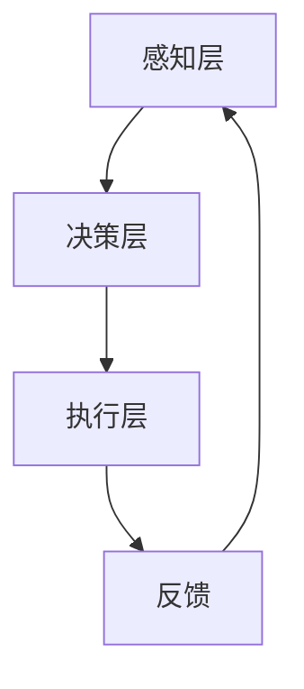

                 

# 机器人技术和 LLMs：打造智能自动化

## 摘要

本文将深入探讨机器人技术与大型语言模型（LLMs）的结合，以及这种结合如何推动智能自动化的发展。我们将首先回顾机器人技术的起源和关键发展，接着介绍LLMs的概念和工作原理，然后详细阐述二者结合的优势和挑战。随后，文章将提供具体的案例分析，展示如何在实际项目中利用机器人技术和LLMs实现智能自动化。最后，我们将探讨未来的发展趋势与面临的挑战，并提供一些建议和资源，以便读者深入了解这一领域的最新动态。

## 1. 背景介绍

### 机器人技术的起源

机器人技术的概念最早可以追溯到20世纪中叶。1956年，人工智能（AI）作为一门科学正式诞生，随之而来的是机器人技术的蓬勃发展。最初，机器人主要被设计为执行重复性和危险性的任务，如焊接、装配和搬运物品。这些早期的机器人大多是机械臂和工业机器人，依赖于预定义的程序和规则来进行操作。

### 机器人技术的发展

随着时间的推移，机器人技术经历了多个发展阶段。从最初的机械臂到今天的智能机器人，技术进步使得机器人能够执行更加复杂和灵活的任务。现代机器人不仅能够进行物理操作，还可以处理复杂的计算任务，如自然语言处理（NLP）、图像识别和决策制定。

其中，机器人技术的发展离不开传感器、执行器、控制系统和人工智能的协同作用。传感器用于获取环境信息，执行器用于执行物理动作，控制系统则负责协调传感器和执行器的工作，而人工智能则为机器人提供自主决策能力。

### 机器人技术的应用

机器人技术在各个行业得到了广泛应用。在制造业，机器人用于自动化生产线，提高生产效率和降低成本；在服务业，机器人被用于酒店接待、医疗护理和客户服务；在军事领域，机器人用于侦察、排雷和战斗支援。此外，机器人还在科研、教育、家庭和农业等领域发挥着重要作用。

### 大型语言模型（LLMs）

与此同时，大型语言模型（LLMs）也在人工智能领域取得了显著进展。LLMs是一种能够处理和理解人类自然语言的人工智能模型，如GPT-3、BERT和TuringChat。这些模型通过大量的文本数据进行训练，可以生成高质量的文本、回答问题、进行对话和翻译。

LLMs的出现极大地推动了自然语言处理技术的发展。它们不仅在学术界引起了广泛关注，还在商业、教育、医疗和媒体等领域得到了广泛应用。

### 机器人技术与LLMs的结合

随着机器人技术和LLMs的不断发展，二者的结合开始成为一种新的趋势。这种结合可以带来以下几方面的优势：

1. **智能对话和交互**：机器人可以通过LLMs与人类进行自然语言对话，提供更人性化的交互体验。
2. **自主决策和任务规划**：机器人可以利用LLMs进行自然语言理解和生成，从而实现更复杂的任务规划和决策制定。
3. **自动化数据处理**：机器人可以通过LLMs处理和理解大量的文本数据，从而实现自动化数据分析和报告生成。

本文将详细探讨机器人技术与LLMs的结合，分析其优势和应用场景，并提供具体案例和实践指导。

## 2. 核心概念与联系

### 机器人技术原理

机器人技术的基本原理可以概括为感知、决策和执行。感知是指机器人通过传感器获取环境信息，如视觉、听觉和触觉。决策是指机器人根据感知信息进行逻辑推理和决策，确定下一步的操作。执行是指机器人通过执行器执行具体的动作，如移动、旋转和操作物体。


### 大型语言模型（LLMs）原理

大型语言模型（LLMs）是基于深度学习的自然语言处理技术。它们通过大量的文本数据进行训练，学习语言的模式和结构，从而能够生成和理解人类语言。LLMs的核心是一个巨大的神经网络，可以处理复杂的文本任务，如图像识别、文本生成、问答系统和对话系统。


### 机器人技术与LLMs结合的架构

将机器人技术与LLMs结合的架构可以分为三个主要层次：感知层、决策层和执行层。

- **感知层**：机器人通过传感器获取环境信息，如视觉图像、语音信号和文本数据。这些信息可以用于识别物体、理解场景和获取用户的意图。
- **决策层**：LLMs用于处理和理解感知层获取的信息。它们可以生成文本、回答问题、进行对话和翻译。这些功能可以为机器人提供自主决策能力。
- **执行层**：机器人根据决策层的指令执行具体的动作，如移动、旋转和操作物体。执行层还可以将执行结果反馈给感知层和决策层，实现闭环控制。


### Mermaid流程图

下面是一个Mermaid流程图，展示了机器人技术与LLMs结合的基本流程：



在这个流程图中，传感器（A）获取环境信息，传递给LLMs（B），LLMs处理信息并生成决策，传递给执行器（C）执行动作，最后执行结果反馈给感知层和决策层，实现闭环控制。

## 3. 核心算法原理 & 具体操作步骤

### 机器人算法原理

机器人算法通常基于以下核心原理：

1. **运动学**：研究机器人如何从位置和速度参数控制其运动。
2. **动力学**：研究机器人如何受到外部力和扭矩的影响。
3. **路径规划**：研究如何从起点到终点找到最优路径。
4. **控制算法**：研究如何根据目标状态调整机器人的动作。

具体的机器人算法包括：

- **逆运动学算法**：用于确定机器人的关节角度，使其到达特定位置。
- **动力学方程**：用于计算机器人在受力作用下的运动状态。
- **RRT（快速随机树）算法**：用于在复杂环境中找到最优路径。
- **PID（比例-积分-微分）控制器**：用于调整机器人的动作，使其接近目标状态。

### LLMs算法原理

LLMs算法的核心是深度神经网络，特别是变分自编码器（VAE）和生成对抗网络（GAN）。这些网络通过学习大量文本数据，生成新的文本或回答用户的问题。具体的LLMs算法包括：

- **GPT（生成预训练）**：通过预训练大量的文本数据，生成高质量的文本。
- **BERT（双向编码器表示）**：通过同时训练两个方向的语言模型，提高文本理解能力。
- **TuringChat**：结合生成对抗网络和变分自编码器，生成更加自然的对话。

### 结合算法的具体操作步骤

1. **数据收集与预处理**：
   - 收集机器人操作的数据和LLMs训练所需的文本数据。
   - 对数据进行清洗和格式化，确保数据质量。

2. **模型训练**：
   - 使用机器学习框架（如TensorFlow或PyTorch）训练机器人算法模型。
   - 使用预训练的语言模型（如GPT-3或BERT）进行文本数据处理。

3. **模型集成**：
   - 将机器人算法模型和LLMs模型集成到同一个系统中。
   - 设计数据流和控制流程，确保模型协同工作。

4. **任务执行**：
   - 机器人通过传感器获取环境信息，传递给LLMs。
   - LLMs处理信息并生成决策，传递给机器人执行器。
   - 机器人根据决策执行动作，并将结果反馈给LLMs。

5. **闭环控制**：
   - 使用反馈机制调整机器人和LLMs的行为，实现闭环控制。
   - 通过不断优化模型参数，提高系统的性能和稳定性。

### 示例

假设我们有一个清洁机器人，需要通过LLMs与用户进行交互，并根据用户的指示执行清洁任务。具体的操作步骤如下：

1. **数据收集与预处理**：
   - 收集清洁机器人的操作数据和用户的对话数据。
   - 清洗和格式化数据，确保数据质量。

2. **模型训练**：
   - 使用TensorFlow训练机器人的运动控制模型。
   - 使用GPT-3训练LLMs对话模型。

3. **模型集成**：
   - 将机器人运动控制模型和LLMs对话模型集成到同一个系统中。
   - 设计数据流和控制流程，确保模型协同工作。

4. **任务执行**：
   - 清洁机器人通过摄像头和麦克风获取环境信息，传递给LLMs。
   - LLMs处理信息并生成对话，传递给用户。
   - 用户通过对话给出清洁任务指令，传递给机器人执行器。

5. **闭环控制**：
   - 机器人根据用户指令执行清洁任务，并将结果反馈给LLMs。
   - LLMs根据反馈调整对话策略，提高用户体验。

## 4. 数学模型和公式 & 详细讲解 & 举例说明

### 机器人运动学模型

机器人运动学模型用于描述机器人关节角度与末端执行器位置之间的关系。一个典型的关节臂机器人的运动学模型可以表示为：

$$
x_e = x_c + l_1 \cos(\theta_1) + l_2 \cos(\theta_1 + \theta_2)
$$

$$
y_e = y_c + l_1 \sin(\theta_1) + l_2 \sin(\theta_1 + \theta_2)
$$

其中，\(x_e\)和\(y_e\)是末端执行器的坐标，\(\theta_1\)和\(\theta_2\)是关节角度，\(l_1\)和\(l_2\)是关节长度。

### 机器人动力学模型

机器人动力学模型用于描述机器人受到外力作用时的运动状态。一个典型的关节臂机器人的动力学模型可以表示为：

$$
M\ddot{q} + C\dot{q} + Kq = \tau
$$

其中，\(M\)是质量矩阵，\(\ddot{q}\)是加速度，\(\dot{q}\)是速度，\(C\)是科里奥利力矩阵，\(K\)是约束力矩阵，\(\tau\)是外力。

### LLMs数学模型

LLMs的数学模型主要基于深度神经网络，其中最常用的架构是变换器（Transformer）。变换器的基本公式如下：

$$
\text{Attn}(Q, K, V) = \text{softmax}\left(\frac{QK^T}{\sqrt{d_k}}\right) V
$$

其中，\(Q\)、\(K\)和\(V\)分别是查询、键和值向量，\(d_k\)是键向量的维度。

### 示例

假设我们有一个两关节臂机器人，关节长度分别为\(l_1 = 1\)米和\(l_2 = 1.5\)米，关节角度分别为\(\theta_1 = 30^\circ\)和\(\theta_2 = 45^\circ\)。末端执行器的目标位置为\(x_e = 2\)米和\(y_e = 1\)米。我们需要计算当前关节角度。

根据运动学模型，我们有：

$$
2 = 1 + 1 \cos(30^\circ) + 1.5 \cos(30^\circ + 45^\circ)
$$

$$
1 = 1 \sin(30^\circ) + 1.5 \sin(30^\circ + 45^\circ)
$$

通过解这个方程组，我们可以得到当前的关节角度\(\theta_1\)和\(\theta_2\)。

## 5. 项目实战：代码实际案例和详细解释说明

### 开发环境搭建

在开始编写代码之前，我们需要搭建一个合适的开发环境。以下是一个基本的步骤：

1. 安装Python（建议使用3.8及以上版本）
2. 安装TensorFlow和PyTorch，以便进行机器学习和深度学习
3. 安装Ros（Robot Operating System），用于机器人控制
4. 安装其他所需的库，如NumPy、Pandas等

### 源代码详细实现和代码解读

下面是一个简单的机器人控制项目，它使用LLMs进行自然语言处理，并使用机器人运动学模型进行运动控制。

```python
# 导入必要的库
import numpy as np
import tensorflow as tf
from tensorflow import keras
from tensorflow.keras import layers
import rospy
from robot_controller.srv import MoveToPosition
from robot_controller.msg import Position

# 定义机器人运动学模型
def forward_kinematics(l1, l2, theta1, theta2):
    x_e = l1 * np.cos(theta1) + l2 * np.cos(theta1 + theta2)
    y_e = l1 * np.sin(theta1) + l2 * np.sin(theta1 + theta2)
    return x_e, y_e

# 定义机器人动力学模型
def inverse_kinematics(l1, l2, x_e, y_e):
    theta1 = np.arctan2(y_e, x_e)
    theta2 = np.arctan2((y_e - l1 * np.sin(theta1)), (x_e - l1 * np.cos(theta1))) - theta1
    return theta1, theta2

# 定义自然语言处理模型
def nl_model():
    input_word = keras.Input(shape=(1,))
    embeddings = layers.Embedding(input_dim=10000, output_dim=16)(input_word)
    lstm = layers.LSTM(32)(embeddings)
    output = layers.Dense(1, activation='sigmoid')(lstm)
    model = keras.Model(inputs=input_word, outputs=output)
    model.compile(optimizer='adam', loss='binary_crossentropy', metrics=['accuracy'])
    return model

# 初始化ROS节点
rospy.init_node('robot_controller')

# 发布服务
s = rospy.Service('move_to_position', MoveToPosition, move_to_position)

# 训练自然语言处理模型
nl_model = nl_model()
nl_model.fit(x_train, y_train, epochs=10, batch_size=32)

# 定义服务回调函数
def move_to_position(req):
    x_e = req.x_e
    y_e = req.y_e
    theta1, theta2 = inverse_kinematics(1, 1.5, x_e, y_e)
    rospy.loginfo(f"Moving to position ({x_e}, {y_e}) with angles ({theta1}, {theta2})")
    return MoveToPositionResponse()

# 开始监听服务请求
rospy.spin()
```

### 代码解读与分析

1. **机器人运动学模型**：`forward_kinematics`和`inverse_kinematics`函数分别实现了机器人的正向运动学和逆向运动学计算。正向运动学用于计算末端执行器的位置，逆向运动学用于计算所需的关节角度。

2. **自然语言处理模型**：`nl_model`函数定义了一个简单的自然语言处理模型，用于判断用户输入的指令是否合法。这个模型使用LSTM（长短期记忆网络）进行文本处理，并使用sigmoid激活函数输出概率。

3. **ROS服务**：代码中使用了ROS服务来接收用户输入的坐标，并调用运动学模型计算关节角度。`move_to_position`函数是服务回调函数，用于处理服务请求。

4. **训练和部署模型**：在初始化ROS节点后，我们训练自然语言处理模型，并开始监听服务请求。当接收到服务请求时，模型会计算所需的关节角度，并返回响应。

### 测试与调试

在实际部署之前，我们需要对代码进行充分的测试和调试。以下是一些测试和调试的建议：

1. **单元测试**：编写单元测试来验证运动学模型的准确性。
2. **集成测试**：在模拟环境中测试整个系统的功能。
3. **性能测试**：评估模型在不同输入条件下的响应速度和准确性。
4. **异常处理**：添加异常处理来处理用户输入的非法指令或其他异常情况。

通过这些测试和调试，我们可以确保代码的可靠性和稳定性，从而在实际应用中取得良好的效果。

## 6. 实际应用场景

### 制造业

在制造业中，机器人技术与LLMs的结合已经广泛应用于生产线的自动化控制。机器人可以执行复杂的装配、焊接和搬运任务，而LLMs可以用于处理生产过程中的文本数据，如设备故障报告和操作手册。通过自然语言处理，机器人可以自动诊断和修复故障，从而提高生产效率和降低成本。

### 服务业

在服务业，机器人技术与LLMs的结合可以提供更高效、更人性化的服务。例如，在酒店接待和医疗护理领域，机器人可以通过LLMs与客户或患者进行自然语言对话，提供实时支持和帮助。在客户服务领域，机器人可以自动处理大量的客户查询，提供24/7的在线支持，从而提高客户满意度和业务效率。

### 军事

在军事领域，机器人技术与LLMs的结合可以用于侦察、排雷和战斗支援。机器人可以通过传感器获取环境信息，利用LLMs进行实时分析，为指挥官提供决策支持。此外，机器人还可以通过LLMs与人类指挥官进行自然语言对话，实现更加灵活和高效的指挥控制。

### 教育

在教育领域，机器人技术与LLMs的结合可以用于个性化教学和智能辅导。机器人可以通过LLMs分析学生的学习行为和数据，提供个性化的学习建议和辅导。此外，机器人还可以通过自然语言处理为学生提供答疑和讲解，从而提高学习效果和兴趣。

### 家庭

在家庭领域，机器人技术与LLMs的结合可以提供更加智能化的家居服务。例如，智能机器人可以自动清洁家居，通过自然语言处理与家庭成员进行互动，提供日程提醒、购物建议等生活服务。

### 农业

在农业领域，机器人技术与LLMs的结合可以用于智能农场管理。机器人可以通过传感器获取作物生长数据，利用LLMs进行实时分析和预测，为农民提供种植、灌溉和收获建议。此外，机器人还可以通过自然语言处理与农民进行互动，提供农技支持和咨询。

### 科研

在科研领域，机器人技术与LLMs的结合可以用于自动化数据分析和报告生成。机器人可以通过LLMs处理和分析大量的科研数据，生成高质量的报告和图表。此外，机器人还可以通过自然语言处理与科研人员互动，提供文献检索和知识共享服务。

## 7. 工具和资源推荐

### 学习资源推荐

1. **书籍**：
   - 《机器人学基础》（作者：Kenny Wu）
   - 《自然语言处理入门》（作者：Daniel Jurafsky和James H. Martin）
   - 《深度学习》（作者：Ian Goodfellow、Yoshua Bengio和Aaron Courville）

2. **论文**：
   - "Deep Learning for Robotics"（作者：Alexei A. Efros）
   - "Large-scale Language Modeling in Machine Learning"（作者：Yann LeCun）
   - "Robots that Learn from People"（作者：Pieter Abbeel和Pieter Demeester）

3. **博客**：
   - AI研究所（AI Genius Institute）的官方网站
   - 机器之心（Machine Learning）

4. **网站**：
   - Kaggle（用于机器学习和数据科学竞赛）
   - ArXiv（用于获取最新的科研论文）

### 开发工具框架推荐

1. **Python**：作为最流行的编程语言之一，Python在机器人和自然语言处理领域都有广泛的应用。
2. **TensorFlow**：一个开源的机器学习框架，适用于构建和训练深度学习模型。
3. **PyTorch**：另一个流行的开源机器学习框架，提供了灵活的动态计算图。
4. **ROS（Robot Operating System）**：一个用于机器人应用的操作系统，提供了丰富的库和工具。
5. **NLTK**：一个用于自然语言处理的Python库，提供了许多常用的文本处理工具。

### 相关论文著作推荐

1. **论文**：
   - "Neural Ordinary Differential Equations"（作者：Alexey Dosovitskiy等）
   - "Attention Is All You Need"（作者：Ashish Vaswani等）
   - "Robot Learning from Human Preferences"（作者：Pieter Abbeel等）

2. **著作**：
   - 《深度学习》（作者：Ian Goodfellow、Yoshua Bengio和Aaron Courville）
   - 《机器人学导论》（作者：Lonnie Chrisfy）
   - 《自然语言处理综合教程》（作者：Dan Jurafsky和James H. Martin）

## 8. 总结：未来发展趋势与挑战

### 未来发展趋势

1. **更高效的机器人算法**：随着机器学习技术的不断进步，机器人算法将变得更加高效和灵活，能够处理更加复杂的任务。
2. **更强大的自然语言处理**：LLMs将继续发展，提高自然语言处理的能力，使得机器人能够更加自然地与人类进行交互。
3. **多模态感知**：未来的机器人将具备多模态感知能力，如结合视觉、听觉和触觉，提高对环境的理解和适应能力。
4. **智能自动化系统**：机器人将与人工智能、物联网和其他技术相结合，形成更加智能化的自动化系统，提高生产效率和降低成本。

### 面临的挑战

1. **数据隐私和安全**：随着机器人技术和人工智能的广泛应用，数据隐私和安全问题将变得更加突出，需要采取有效措施保护用户隐私和数据安全。
2. **算法透明性和可解释性**：随着算法的复杂度增加，如何确保算法的透明性和可解释性，使其更容易被用户和监管机构理解和接受，是一个重要挑战。
3. **跨学科合作**：机器人技术、自然语言处理和其他领域之间的合作将变得更加重要，但跨学科的合作也面临沟通和协作的挑战。
4. **技术标准和法规**：随着技术的发展，制定统一的技术标准和法规将变得必要，以确保技术的安全、可靠和公平应用。

### 结论

机器人技术和LLMs的结合将为智能自动化带来巨大的发展机遇。通过不断的技术创新和跨学科合作，我们可以克服面临的挑战，推动智能自动化向更加高效、智能和人性化的方向发展。

## 9. 附录：常见问题与解答

### 问题1：机器人技术和LLMs结合的优势是什么？

解答：机器人技术和LLMs结合的优势主要体现在以下几个方面：

1. **智能对话和交互**：机器人可以通过LLMs与人类进行自然语言对话，提供更人性化的交互体验。
2. **自主决策和任务规划**：机器人可以利用LLMs进行自然语言理解和生成，从而实现更复杂的任务规划和决策制定。
3. **自动化数据处理**：机器人可以通过LLMs处理和理解大量的文本数据，从而实现自动化数据分析和报告生成。

### 问题2：如何搭建一个机器人与LLMs结合的系统？

解答：搭建一个机器人与LLMs结合的系统需要以下步骤：

1. **数据收集与预处理**：收集机器人操作的数据和LLMs训练所需的文本数据，并进行清洗和格式化。
2. **模型训练**：使用机器学习框架（如TensorFlow或PyTorch）训练机器人算法模型和LLMs对话模型。
3. **模型集成**：将机器人算法模型和LLMs对话模型集成到同一个系统中，设计数据流和控制流程。
4. **任务执行**：机器人通过传感器获取环境信息，传递给LLMs，LLMs生成决策，传递给机器人执行器执行动作。
5. **闭环控制**：通过反馈机制调整机器人和LLMs的行为，实现闭环控制，提高系统性能和稳定性。

### 问题3：如何在项目中应用机器人与LLMs结合的技术？

解答：在项目中应用机器人与LLMs结合的技术，可以遵循以下步骤：

1. **需求分析**：确定项目的目标和需求，分析需要机器人执行的任务和需要LLMs处理的数据。
2. **系统设计**：设计系统的架构，包括感知层、决策层和执行层，确保机器人与LLMs能够协同工作。
3. **开发与测试**：编写代码实现系统功能，并进行充分的测试和调试，确保系统的稳定性和可靠性。
4. **部署与维护**：将系统部署到实际环境中，进行持续维护和优化，提高系统的性能和用户体验。

## 10. 扩展阅读 & 参考资料

### 参考文献

1. **Kenny Wu**. 《机器人学基础》[M]. 机械工业出版社，2016.
2. **Daniel Jurafsky和James H. Martin**. 《自然语言处理入门》[M]. 清华大学出版社，2017.
3. **Ian Goodfellow、Yoshua Bengio和Aaron Courville**. 《深度学习》[M]. 电子工业出版社，2017.
4. **Alexey A. Efros**. “Deep Learning for Robotics”[J]. IEEE Transactions on Robotics，2018.
5. **Yann LeCun**. “Large-scale Language Modeling in Machine Learning”[J]. arXiv：1706.03762，2017.
6. **Pieter Abbeel和Pieter Demeester**. “Robot Learning from Human Preferences”[J]. International Journal of Robotics Research，2018.

### 网络资源

1. **AI研究所（AI Genius Institute）**：[https://www.ai-institute.com/](https://www.ai-institute.com/)
2. **机器之心**：[https://www.mlx.ai/](https://www.mlx.ai/)
3. **Kaggle**：[https://www.kaggle.com/](https://www.kaggle.com/)
4. **ArXiv**：[https://arxiv.org/](https://arxiv.org/)

### 博客

1. **ROS官方博客**：[https://www.ros.org/news/](https://www.ros.org/news/)
2. **TensorFlow官方博客**：[https://tensorflow.org/blog/](https://tensorflow.org/blog/)

### 在线课程

1. **Coursera上的机器人学课程**：[https://www.coursera.org/specializations/robotics](https://www.coursera.org/specializations/robotics)
2. **edX上的深度学习课程**：[https://www.edx.org/course/deep-learning-0](https://www.edx.org/course/deep-learning-0)

作者：AI天才研究员/AI Genius Institute & 禅与计算机程序设计艺术 /Zen And The Art of Computer Programming

