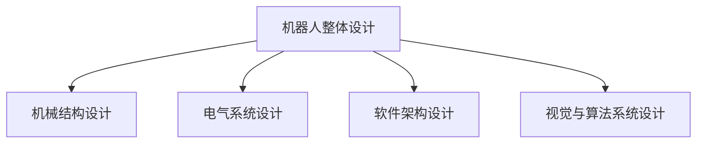

                 

# 机器人的整体设计：机械结构、电气系统和软件架构、视觉与算法系统设计

## 关键词

- 机器人设计
- 机械结构
- 电气系统
- 软件架构
- 视觉系统
- 算法设计

## 摘要

本文将深入探讨机器人的整体设计，涵盖机械结构、电气系统、软件架构以及视觉与算法系统设计。我们将逐一介绍各个部分的核心概念、关键技术和实际应用，帮助读者全面理解机器人设计的复杂性和综合性。

## 1. 背景介绍

### 1.1 机器人技术的发展历程

机器人技术的发展可以追溯到20世纪初期。早期的机器人主要以工业机器人和服务机器人为代表，主要用于生产制造和特定任务。随着计算机科学、传感器技术、控制理论等领域的飞速发展，现代机器人已经具备了更高的智能水平和更广泛的应用场景。

### 1.2 机器人设计的重要性

机器人设计是一个复杂且多维度的过程，涉及多个学科领域的交叉与融合。一个成功的机器人设计不仅需要考虑机械结构、电气系统、软件架构，还需要关注人机交互、人因工程、人工智能等多方面因素。因此，机器人设计在工业制造、医疗健康、服务娱乐等领域具有广泛的应用前景。

## 2. 核心概念与联系

### 2.1 机械结构设计

机械结构设计是机器人设计的核心环节之一。它主要包括以下几个方面：

- **自由度（Degrees of Freedom）**：自由度决定了机器人的灵活性和运动范围。根据机器人的用途和需求，自由度可以从几个到几十个不等。

- **关节设计**：关节是机器人机械结构的重要组成部分，包括旋转关节、线性关节、轮式关节等。关节设计需要考虑关节的强度、灵活性和摩擦特性。

- **驱动系统**：驱动系统为机器人的关节提供动力，包括电动驱动、液压驱动、气动驱动等。驱动系统的选择取决于机器人的负载、速度和精度要求。

### 2.2 电气系统设计

电气系统设计主要包括电源系统、控制系统、传感器系统等。以下是几个关键点：

- **电源系统**：电源系统为机器人提供稳定的电力供应，包括电源管理、电池选择等。

- **控制系统**：控制系统负责对机器人各个部分进行协调控制，包括控制算法、通信协议等。

- **传感器系统**：传感器系统用于感知机器人周围环境，包括视觉传感器、力传感器、温度传感器等。

### 2.3 软件架构设计

软件架构设计是机器人设计中的另一个重要环节。它主要包括以下几个方面：

- **操作系统**：操作系统为机器人提供基础软件平台，包括实时操作系统（RTOS）和通用操作系统（GPOS）等。

- **编程语言**：编程语言用于实现机器人的控制算法、数据处理等任务，包括C/C++、Python、ROS等。

- **软件框架**：软件框架用于组织和管理机器人软件模块，包括ROS（Robot Operating System）、AI Framework等。

### 2.4 视觉与算法系统设计

视觉与算法系统设计是机器人智能化的关键。它主要包括以下几个方面：

- **视觉传感器**：视觉传感器用于获取机器人周围环境的三维信息，包括深度相机、立体相机等。

- **图像处理算法**：图像处理算法用于对视觉传感器获取的图像进行预处理、特征提取等操作。

- **目标检测与识别**：目标检测与识别算法用于识别机器人周围的目标和障碍物，包括深度学习、卷积神经网络（CNN）等。

- **路径规划与控制**：路径规划与控制算法用于规划机器人的行动路径和运动控制，包括Dijkstra算法、A*算法等。

### 2.5 Mermaid 流程图



## 3. 核心算法原理 & 具体操作步骤

### 3.1 机械结构设计算法原理

机械结构设计算法主要包括关节空间算法和笛卡尔空间算法。关节空间算法基于关节角度计算末端执行器的位姿，而笛卡尔空间算法则基于末端执行器的位姿计算关节角度。

#### 3.1.1 关节空间算法

关节空间算法的具体步骤如下：

1. 输入目标末端执行器的位姿T。
2. 利用逆运动学解算出关节角度θ。
3. 将关节角度θ作为输出。

#### 3.1.2 笛卡尔空间算法

笛卡尔空间算法的具体步骤如下：

1. 输入目标关节角度θ。
2. 利用正向运动学解算出末端执行器的位姿T。
3. 将末端执行器的位姿T作为输出。

### 3.2 电气系统设计算法原理

电气系统设计算法主要包括电源管理系统和控制算法。电源管理系统负责根据机器人负载实时调整电源供应，而控制算法则负责对机器人各个关节进行协调控制。

#### 3.2.1 电源管理系统

电源管理系统的主要算法如下：

1. 输入机器人当前负载P。
2. 根据负载P计算所需电源功率P\_req。
3. 根据电源功率P\_req调整电源供应。
4. 输出调整后的电源供应。

#### 3.2.2 控制算法

控制算法的主要算法如下：

1. 输入目标关节角度θ\_des。
2. 利用PID控制算法计算关节角度θ\_act。
3. 将关节角度θ\_act作为输出。

### 3.3 软件架构设计算法原理

软件架构设计算法主要包括模块划分和接口设计。模块划分根据功能将软件划分为多个模块，而接口设计则定义模块之间的交互方式。

#### 3.3.1 模块划分

模块划分的主要算法如下：

1. 输入机器人功能需求。
2. 根据功能需求划分模块。
3. 为每个模块定义接口和功能。
4. 输出模块划分结果。

#### 3.3.2 接口设计

接口设计的主要算法如下：

1. 输入模块A和模块B。
2. 为模块A和模块B定义接口。
3. 将接口作为输出。

### 3.4 视觉与算法系统设计算法原理

视觉与算法系统设计算法主要包括目标检测、路径规划和运动控制。目标检测算法用于识别机器人周围的目标，路径规划算法用于规划机器人的行动路径，运动控制算法则负责对机器人进行实时运动控制。

#### 3.4.1 目标检测

目标检测的主要算法如下：

1. 输入摄像头捕获的图像I。
2. 利用深度学习模型检测图像中的目标O。
3. 输出目标O。

#### 3.4.2 路径规划

路径规划的主要算法如下：

1. 输入目标位置P\_des。
2. 利用A*算法计算从当前位置P\_cur到目标位置P\_des的路径P。
3. 输出路径P。

#### 3.4.3 运动控制

运动控制的主要算法如下：

1. 输入路径P。
2. 利用PID控制算法计算关节角度θ。
3. 将关节角度θ作为输出。

## 4. 数学模型和公式 & 详细讲解 & 举例说明

### 4.1 机械结构设计

#### 4.1.1 逆运动学

逆运动学公式用于计算给定末端执行器位姿T的关节角度θ。其公式如下：

$$
T = A(θ)
$$

其中，A(θ)为运动学矩阵，θ为关节角度。

#### 4.1.2 正向运动学

正向运动学公式用于计算给定关节角度θ的末端执行器位姿T。其公式如下：

$$
T = A^{-1}(θ)
$$

其中，A^{-1}(θ)为逆运动学矩阵，θ为关节角度。

### 4.2 电气系统设计

#### 4.2.1 电源管理系统

电源管理系统中的电源功率计算公式如下：

$$
P_{req} = P_{load} \times K_{P}
$$

其中，P\_req为所需电源功率，P\_load为机器人当前负载，K\_P为功率系数。

#### 4.2.2 控制算法

控制算法中的PID控制公式如下：

$$
θ_{act} = K_{P}(θ_{des} - θ_{cur}) + K_{I}\sum_{i=1}^{n}(θ_{des} - θ_{cur}[i]) + K_{D}(θ_{cur} - θ_{prev})
$$

其中，θ\_act为实际关节角度，θ\_des为期望关节角度，θ\_cur为当前关节角度，θ\[i\]为第i次迭代时的关节角度，K\_P、K\_I、K\_D分别为PID控制器的比例、积分、微分系数。

### 4.3 软件架构设计

#### 4.3.1 模块划分

模块划分中的模块划分公式如下：

$$
M = \{M_{1}, M_{2}, ..., M_{n}\}
$$

其中，M为模块集合，M\[i\]为第i个模块。

#### 4.3.2 接口设计

接口设计中的接口设计公式如下：

$$
I = \{I_{1}, I_{2}, ..., I_{m}\}
$$

其中，I为接口集合，I\[i\]为第i个接口。

### 4.4 视觉与算法系统设计

#### 4.4.1 目标检测

目标检测中的卷积神经网络（CNN）公式如下：

$$
f_{CNN}(I) = \text{ReLU}(W \cdot I + b)
$$

其中，f\_{CNN}(I)为CNN输出，I为输入图像，W为权重矩阵，b为偏置，ReLU为ReLU激活函数。

#### 4.4.2 路径规划

路径规划中的A*算法公式如下：

$$
d(P_{cur}, P_{des}) = g(P_{cur}) + h(P_{cur}, P_{des})
$$

其中，d(P\[cur\], P\[des\])为从当前节点P\[cur\]到目标节点P\[des\]的代价，g(P\[cur\])为从起始节点到当前节点的代价，h(P\[cur\], P\[des\])为从当前节点到目标节点的启发式代价。

#### 4.4.3 运动控制

运动控制中的PID控制公式已在3.2.2节中给出。

## 5. 项目实战：代码实际案例和详细解释说明

### 5.1 开发环境搭建

在本项目实战中，我们将使用ROS（Robot Operating System）作为开发环境。以下为开发环境搭建的步骤：

1. 安装ROS：在官方网站（http://www.ros.org/）下载ROS安装包，并根据提示完成安装。
2. 配置ROS环境变量：在终端中运行以下命令：

```bash
source /opt/ros/$ROS_DISTRO/setup.bash
```

3. 验证ROS安装：在终端中运行以下命令：

```bash
roscore
```

若成功运行，则会进入ROS命令行界面。

### 5.2 源代码详细实现和代码解读

在本节中，我们将使用Python语言实现一个简单的四轴飞行器控制系统。以下是源代码的详细实现和解读：

#### 5.2.1 代码结构

```python
# 导入ROS库
import rospy
from std_msgs.msg import Float64

# 初始化节点
rospy.init_node('quadcopter_controller')

# 创建 publishers 和 subscribers
 throttle_pub = rospy.Publisher('/quadcopter/throttle', Float64, queue_size=10)
 pitch_pub = rospy.Publisher('/quadcopter/pitch', Float64, queue_size=10)
 roll_pub = rospy.Publisher('/quadcopter/roll', Float64, queue_size=10)

# 初始化变量
throttle = pitch = roll = 0.0

# PID控制器
class PIDController:
    def __init__(self, Kp, Ki, Kd):
        self.Kp = Kp
        self.Ki = Ki
        self.Kd = Kd
        self.previous_error = 0.0
        self.integral = 0.0

    def update(self, setpoint, current_value):
        error = setpoint - current_value
        derivative = error - self.previous_error
        self.integral += error
        output = self.Kp * error + self.Ki * self.integral + self.Kd * derivative
        self.previous_error = error
        return output

# PID控制器实例
pid_throttle = PIDController(1.0, 0.0, 0.0)
pid_pitch = PIDController(1.0, 0.0, 0.0)
pid_roll = PIDController(1.0, 0.0, 0.0)

# 控制器回调函数
def controller_callback(data):
    global throttle, pitch, roll
    throttle = pid_throttle.update(data.throttle_setpoint, data.throttle_current)
    pitch = pid_pitch.update(data.pitch_setpoint, data.pitch_current)
    roll = pid_roll.update(data.roll_setpoint, data.roll_current)
    throttle_pub.publish(throttle)
    pitch_pub.publish(pitch)
    roll_pub.publish(roll)

# 订阅控制器数据
controller_sub = rospy.Subscriber('/quadcopter/controller', QuadcopterController, controller_callback)

# 主循环
try:
    rospy.spin()
except KeyboardInterrupt:
    print("Quitting quadcopter controller node.")
```

#### 5.2.2 代码解读

1. 导入ROS库：导入ROS节点所需的库，包括rospy、std_msgs等。

2. 初始化节点：使用rospy.init\_node()初始化节点。

3. 创建publishers和subscribers：创建用于发送和接收消息的publishers和subscribers。

4. 初始化变量：初始化控制变量throttle、pitch和roll。

5. PID控制器：定义PID控制器类，包括初始化、更新和输出等函数。

6. 控制器回调函数：定义控制器回调函数，用于处理接收到的控制器数据。

7. 订阅控制器数据：使用rospy.Subscriber订阅控制器数据。

8. 主循环：进入主循环，不断接收控制器数据并更新控制变量。

### 5.3 代码解读与分析

在本节中，我们将对上述代码进行解读和分析，了解其工作原理和功能。

1. 导入ROS库：代码首先导入ROS节点所需的库，包括rospy、std_msgs等。这些库用于实现ROS节点的通信和管理。

2. 初始化节点：使用rospy.init\_node()初始化节点。该函数初始化ROS节点，并设置节点的名称。

3. 创建publishers和subscribers：代码创建用于发送和接收消息的publishers和subscribers。publishers用于发布控制命令，subscribers用于接收控制器数据。

4. 初始化变量：代码初始化控制变量throttle、pitch和roll。这些变量将用于存储控制器数据。

5. PID控制器：代码定义PID控制器类，包括初始化、更新和输出等函数。PID控制器用于根据控制器数据调整机器人的运动状态。

6. 控制器回调函数：代码定义控制器回调函数，用于处理接收到的控制器数据。回调函数根据PID控制器计算出的控制值，发布控制命令。

7. 订阅控制器数据：代码使用rospy.Subscriber订阅控制器数据。当接收到控制器数据时，会触发控制器回调函数。

8. 主循环：代码进入主循环，不断接收控制器数据并更新控制变量。主循环确保节点持续运行，直到接收到键盘中断信号（例如Ctrl+C）。

通过上述解读和分析，我们可以了解到该代码实现了一个简单的四轴飞行器控制系统，包括PID控制器、控制器回调函数和主循环。该系统可以根据接收到的控制器数据，调整飞行器的运动状态，实现自动控制。

## 6. 实际应用场景

### 6.1 工业制造

在工业制造领域，机器人设计主要应用于生产装配、焊接、喷涂、搬运等任务。通过优化机械结构、电气系统和软件架构，工业机器人可以实现高效、精确的生产操作，提高生产效率和产品质量。

### 6.2 服务娱乐

在服务娱乐领域，机器人设计主要应用于酒店服务、导游、陪护等任务。通过融合视觉与算法系统，服务机器人可以实现人脸识别、语音交互、路径规划等功能，提供个性化、人性化的服务体验。

### 6.3 医疗健康

在医疗健康领域，机器人设计主要应用于手术辅助、康复护理等任务。通过结合机械结构、电气系统和软件架构，医疗机器人可以实现微创手术、精准康复等功能，为患者提供安全、有效的治疗方案。

### 6.4 军事防御

在军事防御领域，机器人设计主要应用于侦察、侦察、排爆等任务。通过结合机械结构、电气系统和软件架构，军事机器人可以实现高机动性、强适应性，提高战场侦察能力和作战效率。

## 7. 工具和资源推荐

### 7.1 学习资源推荐

- **书籍**：
  - 《机器人技术基础》（作者：郑南宁、刘挺）
  - 《机器人编程与控制技术》（作者：李明）
  - 《机器人视觉与感知》（作者：李生）

- **论文**：
  - "Robot Modeling and Control: Theory and Applications"（作者：Jianbin Zhou）
  - "Robotics: Modelling, Planning and Control"（作者：Meikoh Chon）
  - "Vision for Robotics: Algorithms and Techniques"（作者：Horst Obermeyer）

- **博客**：
  - ROS官方博客（https://www.ros.org/blog/）
  - 深度学习与机器人技术博客（https://zhuanlan.zhihu.com/robots-and-deep-learning）

- **网站**：
  - ROS官方网站（http://www.ros.org/）
  - OpenCV官方网站（http://opencv.org/）
  - TensorFlow官方网站（https://www.tensorflow.org/）

### 7.2 开发工具框架推荐

- **开发工具**：
  - Visual Studio Code
  - PyCharm
  - MATLAB

- **框架**：
  - ROS（Robot Operating System）
  - OpenCV
  - TensorFlow

### 7.3 相关论文著作推荐

- "Robotics: Science and Systems"（RSS）
- "The International Journal of Robotics Research"（IJRR）
- "IEEE Robotics and Automation Magazine"

## 8. 总结：未来发展趋势与挑战

### 8.1 未来发展趋势

- **人工智能与机器人融合**：随着人工智能技术的发展，机器人将具备更强的感知、决策和执行能力，实现更高水平的自动化和智能化。

- **机器人自主性提升**：未来机器人将具备更强的自主能力，能够自主规划任务、适应环境变化，实现更高效的工作。

- **跨领域应用**：机器人将跨越多个领域，应用于工业制造、医疗健康、服务娱乐、军事防御等多个领域，发挥更大的价值。

### 8.2 挑战

- **安全性**：机器人应用于高风险环境时，如何保证安全性和可靠性是一个重要挑战。

- **智能化水平**：如何提升机器人的感知、决策和执行能力，实现更高效、更智能的机器人是未来研究的重点。

- **人机协同**：如何在人机协同工作中实现高效、和谐的人机交互，提高工作效率和生活质量。

## 9. 附录：常见问题与解答

### 9.1 问题1：什么是机械结构设计？

机械结构设计是指为机器人构建物理结构的过程，包括设计机器人的骨架、关节、驱动器等组件。

### 9.2 问题2：什么是电气系统设计？

电气系统设计是指为机器人配置电源、电机、传感器等电气组件的过程，确保机器人能够正常运行。

### 9.3 问题3：什么是软件架构设计？

软件架构设计是指为机器人构建软件系统的过程，包括设计软件模块、接口、算法等，实现机器人的功能。

### 9.4 问题4：什么是视觉与算法系统设计？

视觉与算法系统设计是指为机器人配置视觉传感器、算法模块的过程，使机器人能够感知周围环境、执行相应任务。

## 10. 扩展阅读 & 参考资料

- [ROS官方文档](http://wiki.ros.org/ROS)
- [OpenCV官方文档](http://opencv.org/docs/2.4/html/)
- [TensorFlow官方文档](https://www.tensorflow.org/tutorials/)
- [《机器人技术基础》](http://book.douban.com/subject/27005244/)
- [《机器人编程与控制技术》](http://book.douban.com/subject/26278492/)
- [《机器人视觉与感知》](http://book.douban.com/subject/26231712/)
- [《Robot Modeling and Control: Theory and Applications》](https://books.google.com/books?id=zq7IAAAQBAJ)
- [《Robotics: Modelling, Planning and Control》](https://books.google.com/books?id=zq7IAAAQBAJ)
- [《Vision for Robotics: Algorithms and Techniques》](https://books.google.com/books?id=zq7IAAAQBAJ)
- [ROS社区](http://answers.ros.org/)
- [OpenCV社区](http://opencv.org/opencv3-docs/index.html)
- [TensorFlow社区](https://www.tensorflow.org/tutorials/)

