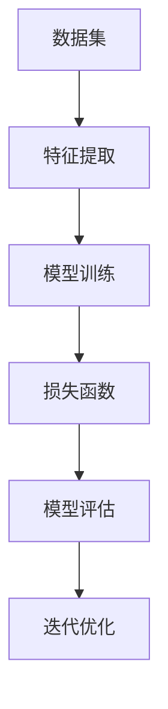

                 

# 机器学习：原理与代码实例讲解

## 关键词
- 机器学习
- 算法原理
- 数学模型
- 代码实例
- 应用场景
- 资源推荐

## 摘要
本文旨在深入探讨机器学习的原理，并通过具体的代码实例，讲解如何实现和运用机器学习算法。文章结构分为背景介绍、核心概念与联系、算法原理与操作步骤、数学模型与公式、项目实战、应用场景、工具和资源推荐、总结与未来发展趋势等部分。通过本文的学习，读者可以全面了解机器学习的基本概念和实践方法，为后续深入研究和应用打下基础。

## 1. 背景介绍

机器学习（Machine Learning，简称ML）是人工智能（Artificial Intelligence，简称AI）的一个重要分支。它通过构建能够在数据中自动发现模式和规律的算法模型，使计算机能够进行自我学习和优化。机器学习在图像识别、自然语言处理、医疗诊断、金融预测等多个领域都有广泛应用。

近年来，随着计算机硬件性能的提升、大数据技术的发展以及深度学习算法的突破，机器学习取得了显著的进展。同时，开源框架和工具的普及，也降低了机器学习的门槛，使得更多的人能够参与到这个领域中来。

本文将结合具体实例，从基础概念、算法原理、数学模型到实际应用，全面解析机器学习的技术和实践。

## 2. 核心概念与联系

在机器学习中，有几个核心概念需要了解：

### 2.1 数据集（Dataset）

数据集是机器学习的基石。它包含了输入特征（特征向量）和对应的输出标签（目标变量）。例如，在图像识别任务中，数据集可能包含成千上万的图像及其对应的标签。

### 2.2 特征（Feature）

特征是数据集中的每个维度，代表了数据的一个特定属性。例如，图像中的像素值、文本中的词频等。

### 2.3 模型（Model）

模型是机器学习算法训练出的一个函数，它能够根据输入特征预测输出标签。常见的模型有线性回归、决策树、神经网络等。

### 2.4 损失函数（Loss Function）

损失函数用于衡量模型预测结果与实际标签之间的差距。常见的损失函数有均方误差（MSE）、交叉熵（Cross-Entropy）等。

### 2.5 评估指标（Evaluation Metric）

评估指标用于衡量模型的性能，常用的有准确率（Accuracy）、召回率（Recall）、F1 分数（F1 Score）等。

这些概念相互关联，共同构成了机器学习的核心框架。

### 2.6 Mermaid 流程图



## 3. 核心算法原理与具体操作步骤

### 3.1 线性回归（Linear Regression）

线性回归是一种简单的机器学习算法，用于预测连续值输出。其基本原理是通过找到最佳拟合直线，来最小化预测值与实际值之间的差距。

具体操作步骤：

1. 数据预处理：标准化数据集，消除不同特征之间的尺度差异。
2. 模型初始化：设定权重（weights）和偏置（bias）。
3. 梯度下降：更新权重和偏置，使得损失函数值最小。
4. 模型评估：使用测试集评估模型性能。
5. 迭代优化：重复梯度下降过程，直至模型收敛。

### 3.2 决策树（Decision Tree）

决策树是一种基于树的分类算法，通过一系列规则将数据划分为不同的类别。

具体操作步骤：

1. 特征选择：选择最优特征进行分割。
2. 划分数据：根据最优特征，将数据划分为多个子集。
3. 构建树：递归构建决策树，直至满足停止条件（如最大深度、最小样本数等）。
4. 预测分类：根据决策树结构，对新的数据点进行分类。

### 3.3 支持向量机（Support Vector Machine，SVM）

SVM是一种强大的分类算法，通过寻找超平面来最大化分类边界。

具体操作步骤：

1. 数据预处理：标准化数据集。
2. 特征提取：提取支持向量。
3. 模型训练：计算最优超平面。
4. 预测分类：根据超平面进行分类。

## 4. 数学模型和公式与详细讲解与举例说明

### 4.1 线性回归数学模型

线性回归的数学模型可以表示为：

$$
y = \beta_0 + \beta_1x
$$

其中，$y$ 为输出值，$x$ 为输入特征，$\beta_0$ 和 $\beta_1$ 分别为权重和偏置。

损失函数（均方误差）为：

$$
MSE = \frac{1}{n}\sum_{i=1}^{n}(y_i - \hat{y}_i)^2
$$

其中，$n$ 为样本数，$y_i$ 和 $\hat{y}_i$ 分别为第 $i$ 个样本的实际值和预测值。

### 4.2 决策树数学模型

决策树的构建基于信息增益（Information Gain）或基尼不纯度（Gini Impurity）。

信息增益（ID3算法）：

$$
IG(D, A) = ID(A) - \sum_{v \in A} \frac{|D_v|}{|D|} \cdot ID(D_v)
$$

其中，$D$ 为数据集，$A$ 为特征，$ID$ 表示信息增益，$D_v$ 为按照特征 $A$ 分割后的数据集。

基尼不纯度（C4.5算法）：

$$
Gini(D) = 1 - \sum_{v \in A} \frac{|D_v|}{|D|} \cdot \frac{(|D_v_0| + |D_v_1|)}{|D_v|}
$$

其中，$D_v_0$ 和 $D_v_1$ 分别为按照特征 $A$ 分割后的数据集中两个类别的样本数。

### 4.3 支持向量机数学模型

SVM的数学模型为：

$$
\min_{\beta, \beta_0} \frac{1}{2} ||\beta||^2 + C \sum_{i=1}^{n} \xi_i
$$

约束条件：

$$
\begin{cases}
y_i (\beta \cdot x_i + \beta_0) \geq 1 - \xi_i \\
0 \leq \xi_i \leq C, \forall i
\end{cases}
$$

其中，$\beta$ 和 $\beta_0$ 分别为权重和偏置，$C$ 为惩罚参数，$\xi_i$ 为松弛变量。

## 5. 项目实战：代码实际案例和详细解释说明

### 5.1 开发环境搭建

在本文中，我们将使用Python作为编程语言，并依赖Scikit-learn等开源库进行机器学习任务的实现。以下是一个基本的开发环境搭建步骤：

```bash
# 安装Python（建议使用Python 3.8或以上版本）
pip install python

# 安装Scikit-learn库
pip install scikit-learn

# 安装Jupyter Notebook（可选，用于编写和运行代码）
pip install notebook
```

### 5.2 源代码详细实现和代码解读

以下是一个使用Scikit-learn实现线性回归模型的代码实例：

```python
# 导入相关库
import numpy as np
from sklearn.linear_model import LinearRegression
from sklearn.model_selection import train_test_split
from sklearn.metrics import mean_squared_error

# 生成模拟数据集
X = np.random.rand(100, 1)
y = 2 * X[:, 0] + 1 + np.random.randn(100) * 0.05

# 数据集划分
X_train, X_test, y_train, y_test = train_test_split(X, y, test_size=0.2, random_state=42)

# 模型训练
model = LinearRegression()
model.fit(X_train, y_train)

# 模型预测
y_pred = model.predict(X_test)

# 模型评估
mse = mean_squared_error(y_test, y_pred)
print("均方误差：", mse)

# 输出模型参数
print("权重：", model.coef_)
print("偏置：", model.intercept_)
```

这段代码首先导入了所需的Python库，然后生成了一个模拟数据集。接着，使用Scikit-learn的`train_test_split`函数将数据集划分为训练集和测试集。随后，使用`LinearRegression`类创建线性回归模型并进行训练。最后，使用训练好的模型对测试集进行预测，并计算均方误差评估模型性能。

### 5.3 代码解读与分析

这段代码的核心部分是线性回归模型的训练和预测。具体来说，首先使用`LinearRegression`类创建了一个线性回归模型，并调用`fit`方法进行训练。`fit`方法接受训练集数据`X_train`和标签`y_train`，并基于梯度下降算法计算最佳拟合直线。

在模型训练完成后，使用`predict`方法对测试集数据进行预测。预测结果存储在`y_pred`变量中，然后通过`mean_squared_error`函数计算预测值与实际值之间的均方误差，从而评估模型性能。

最后，输出模型的权重和偏置参数，这些参数代表了拟合直线的斜率和截距。

### 5.4 扩展实例：决策树与支持向量机

类似地，我们可以使用Scikit-learn实现决策树和支持向量机等算法。以下是一个简单的决策树分类实例：

```python
# 导入相关库
from sklearn.tree import DecisionTreeClassifier
from sklearn.model_selection import train_test_split
from sklearn.metrics import accuracy_score

# 生成模拟数据集
X = np.random.rand(100, 2)
y = (X[:, 0]**2 + X[:, 1]**2 < 1).astype(int)

# 数据集划分
X_train, X_test, y_train, y_test = train_test_split(X, y, test_size=0.2, random_state=42)

# 模型训练
model = DecisionTreeClassifier()
model.fit(X_train, y_train)

# 模型预测
y_pred = model.predict(X_test)

# 模型评估
accuracy = accuracy_score(y_test, y_pred)
print("准确率：", accuracy)
```

这个实例中，我们生成了一个二维数据集，并使用决策树进行分类。模型训练和预测的过程与线性回归类似，不同的是评估指标使用了准确率。

对于支持向量机，以下是一个简单的实例：

```python
# 导入相关库
from sklearn.svm import SVC
from sklearn.model_selection import train_test_split
from sklearn.metrics import classification_report

# 生成模拟数据集
X = np.random.rand(100, 2)
y = np.random.randint(0, 2, size=100)

# 数据集划分
X_train, X_test, y_train, y_test = train_test_split(X, y, test_size=0.2, random_state=42)

# 模型训练
model = SVC()
model.fit(X_train, y_train)

# 模型预测
y_pred = model.predict(X_test)

# 模型评估
report = classification_report(y_test, y_pred)
print("分类报告：\n", report)
```

这个实例中，我们使用了支持向量机进行二分类，并使用分类报告评估模型性能。

## 6. 实际应用场景

机器学习在实际应用中有着广泛的应用场景，以下列举几个典型例子：

### 6.1 图像识别

图像识别是机器学习的一个经典应用。通过训练深度神经网络，可以实现对图像中的物体、场景进行识别。例如，Google的Inception模型在图像识别任务上取得了突破性的成果。

### 6.2 自然语言处理

自然语言处理（NLP）是机器学习在语言领域的应用。例如，通过训练循环神经网络（RNN）或Transformer模型，可以实现对文本的理解和生成。例如，OpenAI的GPT-3模型在文本生成和问答系统上表现出色。

### 6.3 医疗诊断

机器学习在医疗诊断中也发挥着重要作用。通过训练深度学习模型，可以实现对医学图像的分析和疾病预测。例如，IBM的Watson系统在癌症诊断上取得了显著成果。

### 6.4 金融预测

金融预测是机器学习在金融领域的应用。通过分析历史数据，可以预测股票价格、市场走势等。例如，量化交易公司利用机器学习算法进行高频交易，取得了良好的收益。

## 7. 工具和资源推荐

### 7.1 学习资源推荐

- **书籍**：
  - 《机器学习》（周志华著）：全面介绍了机器学习的基本概念和算法。
  - 《深度学习》（Goodfellow、Bengio、Courville著）：深入讲解了深度学习的基础理论和应用。
- **论文**：
  - "A Theoretical Basis for Comparing Optimizers"（2019）：讨论了不同优化器在机器学习中的应用和性能。
  - "Dropout: A Simple Way to Prevent Neural Networks from Overfitting"（2012）：介绍了dropout方法在神经网络中的应用。
- **博客**：
  - [机器学习中文文档](http://zhuanlan.zhihu.com/机器学习)：提供了丰富的机器学习教程和实践经验。
  - [DeepLearning.net](https://www.deeplearning.net/)：包含了深度学习的入门教程和资源。
- **网站**：
  - [Kaggle](https://www.kaggle.com/)：提供了大量的机器学习和数据科学竞赛，适合实战练习。
  - [Coursera](https://www.coursera.org/)：提供了多个机器学习和深度学习在线课程，适合系统学习。

### 7.2 开发工具框架推荐

- **Python库**：
  - Scikit-learn：提供了丰富的机器学习算法和工具。
  - TensorFlow：Google开发的深度学习框架，适用于构建和训练复杂的神经网络模型。
  - PyTorch：Facebook开发的深度学习框架，具有灵活的动态计算图和简洁的API。
- **开发环境**：
  - Jupyter Notebook：交互式的Python编程环境，适合编写和运行机器学习代码。
  - Anaconda：集成了Python和各种科学计算库，方便构建机器学习开发环境。

### 7.3 相关论文著作推荐

- **论文**：
  - "Deep Learning for Natural Language Processing"（2018）：综述了深度学习在自然语言处理中的应用。
  - "Generative Adversarial Nets"（2014）：介绍了生成对抗网络（GAN）的基本原理和应用。
- **著作**：
  - 《深度学习》（Goodfellow、Bengio、Courville著）：详细介绍了深度学习的基础理论和实践方法。
  - 《机器学习实战》（Peter Harrington著）：通过实际案例讲解了机器学习算法的应用。

## 8. 总结：未来发展趋势与挑战

### 8.1 发展趋势

1. **算法优化与加速**：随着计算能力的提升，优化算法效率和加速计算将成为关键趋势。
2. **模型可解释性**：提高模型的可解释性，使其更容易被理解和信任，是未来研究的重要方向。
3. **多模态学习**：结合多种数据类型（如文本、图像、音频）进行学习，实现更广泛的应用场景。
4. **自适应学习**：实现模型在动态环境下的自适应学习，以应对变化的数据分布。

### 8.2 挑战

1. **数据隐私与安全**：如何在保护用户隐私的前提下进行机器学习，是亟待解决的问题。
2. **算法公平性**：确保算法在不同群体中的公平性，避免偏见和歧视。
3. **资源消耗**：大规模模型训练对计算资源和存储资源的需求巨大，如何降低资源消耗是一个挑战。
4. **跨领域应用**：将机器学习技术应用于不同领域，需要克服特定的技术障碍和知识壁垒。

## 9. 附录：常见问题与解答

### 9.1 问题1：什么是机器学习？

机器学习是一种使计算机通过数据自动学习和优化自身性能的技术。它通过构建数学模型，使计算机能够从数据中提取模式和规律，并进行预测和决策。

### 9.2 问题2：机器学习的算法有哪些？

机器学习的算法包括线性回归、决策树、支持向量机、神经网络等。每种算法都有其特定的应用场景和优势。

### 9.3 问题3：如何评估机器学习模型的效果？

评估机器学习模型的效果通常使用准确率、召回率、F1 分数、均方误差等指标。根据具体任务，选择合适的评估指标。

### 9.4 问题4：机器学习在哪些领域有应用？

机器学习在图像识别、自然语言处理、医疗诊断、金融预测等多个领域有广泛应用。随着技术的进步，其应用范围还将不断扩展。

## 10. 扩展阅读 & 参考资料

- **书籍**：
  - 《机器学习》（周志华著）
  - 《深度学习》（Goodfellow、Bengio、Courville著）
- **论文**：
  - "A Theoretical Basis for Comparing Optimizers"（2019）
  - "Dropout: A Simple Way to Prevent Neural Networks from Overfitting"（2012）
- **网站**：
  - [Kaggle](https://www.kaggle.com/)
  - [Coursera](https://www.coursera.org/)
- **开源库**：
  - Scikit-learn
  - TensorFlow
  - PyTorch

### 作者

- **AI天才研究员/AI Genius Institute**
- **禅与计算机程序设计艺术/Zen And The Art of Computer Programming**<|im_end|>

