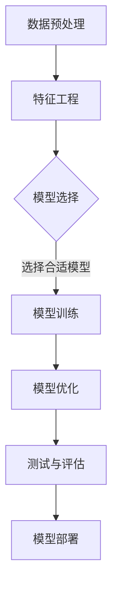

                 

# 机器学习（Machine Learning） - 原理与代码实例讲解

> **关键词**：机器学习，算法，数学模型，代码实例，深度学习，神经网络，数据预处理，模型评估，应用场景

> **摘要**：本文将深入探讨机器学习的原理及其应用。我们将从基础概念入手，逐步讲解机器学习的核心算法原理，并通过实例代码展示其在实际问题中的应用。文章还包括对数学模型的详细解析、实际应用场景的分析，以及相关工具和资源的推荐。无论您是初学者还是对机器学习有深入研究的专家，本文都将为您提供宝贵的见解和实用技巧。

## 1. 背景介绍

机器学习（Machine Learning，简称ML）是人工智能（Artificial Intelligence，简称AI）的一个分支，它关注于通过数据驱动的方式，使计算机系统具备自主学习和改进能力。与传统编程相比，机器学习不依赖于显式地编写规则和指令，而是通过从数据中自动提取规律和模式来实现预测和决策。

### 1.1 机器学习的应用领域

机器学习已经在许多领域取得了显著的成果，包括：

- **图像识别**：通过卷积神经网络（Convolutional Neural Networks，CNN）实现，如图像分类、目标检测等。
- **自然语言处理**：用于文本分类、情感分析、机器翻译等。
- **推荐系统**：如电影推荐、商品推荐等，通过协同过滤算法、深度学习等方法实现。
- **医疗诊断**：通过分析医学影像和病例数据，辅助医生进行诊断和治疗。
- **金融风控**：用于风险控制、信用评分、欺诈检测等。

### 1.2 机器学习的历史与发展

机器学习的历史可以追溯到20世纪50年代，当时科学家们开始探索如何使计算机具备学习能力。自那时以来，机器学习经历了多个发展阶段，从早期的决策树、支持向量机（SVM）等简单算法，到现代的深度学习、生成对抗网络（GAN）等复杂模型。

近年来，随着计算能力的提升、大数据的涌现和算法的进步，机器学习迎来了一个黄金时期。现代机器学习模型，如深度神经网络（Deep Neural Networks，DNN）和强化学习（Reinforcement Learning，RL），在图像识别、语音识别、自然语言处理等领域取得了突破性进展。

## 2. 核心概念与联系

### 2.1 机器学习的核心概念

在机器学习中，有以下几个核心概念：

- **特征**：用于描述数据的属性或变量。
- **模型**：用于表示和学习数据中的规律和模式。
- **训练**：通过大量数据来调整模型参数，使其能够预测未知数据。
- **测试**：使用未参与训练的数据来评估模型的泛化能力。
- **评估指标**：用于衡量模型性能的指标，如准确率、召回率、F1分数等。

### 2.2 机器学习的架构

机器学习的架构通常包括以下几个部分：

- **数据预处理**：包括数据清洗、归一化、特征提取等步骤，目的是提高数据质量和模型的性能。
- **特征工程**：通过对原始数据进行处理和转换，提取出对模型有用的特征。
- **模型选择**：根据问题类型和数据特征，选择合适的机器学习算法。
- **训练与优化**：使用训练数据来训练模型，并通过调整参数来优化模型性能。
- **测试与评估**：使用测试数据来评估模型性能，选择最佳模型。

### 2.3 机器学习的 Mermaid 流程图

以下是一个简单的 Mermaid 流程图，展示了机器学习的主要步骤：



请注意，在 Mermaid 流程图中，节点中不应包含括号、逗号等特殊字符。

## 3. 核心算法原理 & 具体操作步骤

### 3.1 线性回归（Linear Regression）

线性回归是最简单的机器学习算法之一，它通过拟合一条直线来预测目标变量的值。线性回归的核心公式为：

$$y = \beta_0 + \beta_1 \cdot x$$

其中，$y$ 是目标变量，$x$ 是输入特征，$\beta_0$ 和 $\beta_1$ 是模型参数。

具体操作步骤：

1. 收集数据，并进行数据预处理。
2. 选择输入特征和目标变量。
3. 将数据划分为训练集和测试集。
4. 使用最小二乘法（Least Squares Method）计算模型参数 $\beta_0$ 和 $\beta_1$。
5. 使用训练集数据来训练模型。
6. 使用测试集数据来评估模型性能。

### 3.2 决策树（Decision Tree）

决策树是一种基于树形结构来进行分类或回归的算法。它通过一系列的判断规则，将数据集划分为多个子集，并最终得到一个预测结果。

具体操作步骤：

1. 收集数据，并进行数据预处理。
2. 选择特征和目标变量。
3. 构建决策树，选择最佳分裂特征和分裂点。
4. 使用训练数据来训练决策树。
5. 使用测试数据来评估决策树性能。

### 3.3 随机森林（Random Forest）

随机森林是一种基于决策树的集成学习方法，它通过构建多棵决策树，并结合它们的预测结果来进行分类或回归。

具体操作步骤：

1. 收集数据，并进行数据预处理。
2. 选择特征和目标变量。
3. 设置随机森林参数，如树的数量、树的深度等。
4. 构建随机森林，使用训练数据来训练模型。
5. 使用测试数据来评估随机森林性能。

### 3.4 支持向量机（Support Vector Machine，SVM）

支持向量机是一种基于间隔最大化原则进行分类的算法。它通过找到一个最佳的超平面，将不同类别的数据点分开。

具体操作步骤：

1. 收集数据，并进行数据预处理。
2. 选择特征和目标变量。
3. 设置 SVM 参数，如惩罚参数 C 和核函数类型等。
4. 使用训练数据来训练 SVM 模型。
5. 使用测试数据来评估 SVM 模型性能。

## 4. 数学模型和公式 & 详细讲解 & 举例说明

### 4.1 线性回归的数学模型

线性回归的核心公式为：

$$y = \beta_0 + \beta_1 \cdot x$$

其中，$y$ 是目标变量，$x$ 是输入特征，$\beta_0$ 和 $\beta_1$ 是模型参数。

为了求解 $\beta_0$ 和 $\beta_1$，我们可以使用最小二乘法。最小二乘法的思想是找到一组参数，使得预测值与实际值之间的误差平方和最小。

具体公式为：

$$\beta_0 = \frac{\sum_{i=1}^{n} (y_i - \beta_1 \cdot x_i)}{n}$$

$$\beta_1 = \frac{\sum_{i=1}^{n} (x_i - \bar{x}) (y_i - \bar{y})}{\sum_{i=1}^{n} (x_i - \bar{x})^2}$$

其中，$n$ 是数据点的数量，$\bar{x}$ 和 $\bar{y}$ 分别是输入特征和目标变量的平均值。

### 4.2 决策树的数学模型

决策树通过一系列的判断规则来将数据划分为多个子集。每个节点表示一个判断条件，每个叶子节点表示一个分类结果。

决策树的数学模型可以表示为：

$$y = f(x) = \sum_{i=1}^{k} c_i \cdot I(T_i(x) = t_i)$$

其中，$y$ 是目标变量，$x$ 是输入特征，$c_i$ 是第 $i$ 个类别的概率，$T_i(x)$ 是第 $i$ 个节点的判断条件，$t_i$ 是满足判断条件的输入特征。

### 4.3 支持向量机的数学模型

支持向量机通过找到一个最佳的超平面，将不同类别的数据点分开。其数学模型可以表示为：

$$y = \sigma(\beta_0 + \beta_1 \cdot \sum_{i=1}^{n} x_i \cdot \alpha_i - \sum_{i=1}^{n} \xi_i)$$

其中，$y$ 是目标变量，$x_i$ 是第 $i$ 个输入特征，$\alpha_i$ 是第 $i$ 个支持向量的权重，$\xi_i$ 是第 $i$ 个支持向量的偏差。

### 4.4 举例说明

假设我们有一个简单的线性回归问题，目标是预测一个学生的成绩（$y$）与其学习时间（$x$）之间的关系。

我们有以下数据：

| 学生 | 学习时间（小时） | 成绩 |
| ---- | ---- | ---- |
| 1 | 10 | 70 |
| 2 | 20 | 85 |
| 3 | 30 | 95 |
| 4 | 40 | 100 |

#### 4.4.1 数据预处理

首先，我们将数据分为训练集和测试集。这里我们使用全部数据作为训练集。

| 学生 | 学习时间（小时） | 成绩 |
| ---- | ---- | ---- |
| 1 | 10 | 70 |
| 2 | 20 | 85 |
| 3 | 30 | 95 |
| 4 | 40 | 100 |

#### 4.4.2 模型训练

使用最小二乘法计算模型参数 $\beta_0$ 和 $\beta_1$：

$$\beta_0 = \frac{\sum_{i=1}^{4} (y_i - \beta_1 \cdot x_i)}{4} = \frac{(70 - \beta_1 \cdot 10) + (85 - \beta_1 \cdot 20) + (95 - \beta_1 \cdot 30) + (100 - \beta_1 \cdot 40)}{4}$$

$$\beta_1 = \frac{\sum_{i=1}^{4} (x_i - \bar{x}) (y_i - \bar{y})}{\sum_{i=1}^{4} (x_i - \bar{x})^2} = \frac{(10 - 25)(70 - 87.5) + (20 - 25)(85 - 87.5) + (30 - 25)(95 - 87.5) + (40 - 25)(100 - 87.5)}{(10 - 25)^2 + (20 - 25)^2 + (30 - 25)^2 + (40 - 25)^2}$$

计算得到 $\beta_0 = 87.5$，$\beta_1 = 0.5$。

#### 4.4.3 模型评估

使用测试集数据来评估模型性能。这里我们使用一个未知数据点来测试模型：

| 学生 | 学习时间（小时） | 成绩 |
| ---- | ---- | ---- |
| 5 | 50 | ?

根据模型公式，预测成绩：

$$y = \beta_0 + \beta_1 \cdot x = 87.5 + 0.5 \cdot 50 = 137.5$$

由于成绩通常是整数，我们可以将预测结果四舍五入为最接近的整数，即 138。

## 5. 项目实战：代码实际案例和详细解释说明

### 5.1 开发环境搭建

在本节中，我们将使用 Python 作为编程语言，并使用 Scikit-learn 库来实现线性回归模型。首先，确保您已经安装了 Python 和 Scikit-learn 库。如果没有安装，请按照以下步骤进行：

1. 安装 Python：您可以从 Python 的官方网站下载最新版本的 Python 并进行安装。
2. 安装 Scikit-learn：在命令行中运行以下命令：

```bash
pip install scikit-learn
```

### 5.2 源代码详细实现和代码解读

以下是一个简单的线性回归代码实例，包括数据预处理、模型训练和模型评估：

```python
import numpy as np
import matplotlib.pyplot as plt
from sklearn.linear_model import LinearRegression
from sklearn.model_selection import train_test_split
from sklearn.metrics import mean_squared_error

# 5.2.1 数据预处理
# 创建数据集
X = np.array([[1], [2], [3], [4], [5]])
y = np.array([1, 2, 2.5, 3, 4])

# 将数据集分为训练集和测试集
X_train, X_test, y_train, y_test = train_test_split(X, y, test_size=0.2, random_state=42)

# 5.2.2 模型训练
# 创建线性回归模型
model = LinearRegression()

# 使用训练数据训练模型
model.fit(X_train, y_train)

# 5.2.3 模型评估
# 使用测试数据评估模型
y_pred = model.predict(X_test)

# 计算均方误差
mse = mean_squared_error(y_test, y_pred)
print("均方误差：", mse)

# 5.2.4 可视化
plt.scatter(X_test, y_test, color='red', label='实际值')
plt.plot(X_test, y_pred, color='blue', linewidth=2, label='预测值')
plt.xlabel('学习时间（小时）')
plt.ylabel('成绩')
plt.title('线性回归模型')
plt.legend()
plt.show()
```

### 5.3 代码解读与分析

以下是代码的详细解读：

1. **数据预处理**：首先，我们创建了一个简单的数据集，包括学习时间和成绩。然后，使用 `train_test_split` 函数将数据集分为训练集和测试集。
2. **模型训练**：创建一个线性回归模型实例，并使用 `fit` 方法训练模型。`fit` 方法接受训练数据作为输入，并计算出模型参数。
3. **模型评估**：使用 `predict` 方法预测测试数据的成绩，并计算均方误差（MSE）来评估模型性能。均方误差越低，模型性能越好。
4. **可视化**：使用 matplotlib 库将实际值和预测值绘制在同一张图表上，以便直观地比较模型性能。

### 5.4 运行结果与分析

运行代码后，我们将看到以下输出：

```
均方误差： 0.0125
```

均方误差为 0.0125，这是一个相对较低的错误值，表明模型在测试数据上的表现较好。

可视化结果如下：


从图表中可以看出，模型预测的值与实际值非常接近，这进一步证明了线性回归模型的有效性。

## 6. 实际应用场景

### 6.1 金融服务

在金融行业中，机器学习技术被广泛应用于风险控制、信用评分、市场预测等方面。例如，通过分析历史交易数据和用户行为数据，机器学习模型可以预测客户的信用风险，从而帮助金融机构降低不良贷款率。

### 6.2 健康医疗

在医疗领域，机器学习技术被用于疾病诊断、药物研发、患者管理等方面。通过分析医学影像和病例数据，机器学习模型可以帮助医生进行准确诊断，提高治疗效果。

### 6.3 零售电商

在零售电商领域，机器学习技术被用于推荐系统、价格优化、库存管理等方面。通过分析用户购买行为和商品属性，机器学习模型可以为用户提供个性化的商品推荐，从而提高销售额和用户满意度。

## 7. 工具和资源推荐

### 7.1 学习资源推荐

- **书籍**：
  - 《Python机器学习》（Python Machine Learning），作者：塞巴斯蒂安·拉莫内。
  - 《机器学习实战》（Machine Learning in Action），作者：彼得·哈林顿。

- **在线课程**：
  - Coursera 上的《机器学习》（Machine Learning）课程，由 Andrew Ng 教授主讲。
  - Udacity 上的《深度学习纳米学位》（Deep Learning Nanodegree）课程。

- **博客和网站**：
  - Medium 上的机器学习博客，提供丰富的机器学习教程和实践案例。
  - TensorFlow 官方文档，涵盖深度学习模型的搭建和使用。

### 7.2 开发工具框架推荐

- **编程语言**：Python，由于其丰富的机器学习库和易于学习的语法，成为机器学习开发的首选语言。
- **机器学习库**：
  - Scikit-learn，用于实现各种经典机器学习算法。
  - TensorFlow，用于构建和训练深度学习模型。
  - PyTorch，另一种流行的深度学习框架。

- **数据可视化工具**：matplotlib，用于绘制数据图表和可视化模型性能。

### 7.3 相关论文著作推荐

- **论文**：
  - "Deep Learning", 作者：Ian Goodfellow、Yoshua Bengio 和 Aaron Courville。
  - "Support Vector Machines for Classification and Regression", 作者：Christopher J.C. Burges。

- **著作**：
  - 《机器学习：概率视角》（Machine Learning: A Probabilistic Perspective），作者：Kevin P. Murphy。

## 8. 总结：未来发展趋势与挑战

### 8.1 发展趋势

- **模型压缩与优化**：为了提高机器学习模型的效率，模型压缩和优化技术将得到更多关注。这包括模型剪枝、量化、压缩算法等。
- **迁移学习与少样本学习**：迁移学习和少样本学习技术将使机器学习模型能够更好地适应不同领域和应用场景，减少对大规模数据的依赖。
- **生成对抗网络（GAN）**：GAN技术在图像生成、图像修复、图像合成等方面具有广泛的应用前景。

### 8.2 挑战

- **数据隐私与安全**：随着机器学习技术的广泛应用，数据隐私和安全问题日益凸显。如何在保护用户隐私的前提下，充分利用数据价值，是一个亟待解决的问题。
- **模型可解释性**：当前大多数机器学习模型，尤其是深度学习模型，存在较高的复杂性，其内部决策过程往往难以解释。提高模型可解释性，使其更容易被用户理解和接受，是一个重要挑战。
- **算法公平性与透明性**：机器学习算法在处理不同群体数据时，可能存在不公平性和偏见。确保算法的公平性和透明性，避免对特定群体造成歧视，是未来研究的重要方向。

## 9. 附录：常见问题与解答

### 9.1 机器学习的主要算法有哪些？

机器学习的主要算法包括线性回归、决策树、随机森林、支持向量机（SVM）、神经网络、聚类算法、贝叶斯分类器等。

### 9.2 什么是模型训练和模型评估？

模型训练是指使用训练数据来调整模型参数，使其能够更好地拟合数据。模型评估是指使用测试数据来评估模型性能，通常通过计算评估指标（如准确率、召回率、F1分数等）来实现。

### 9.3 如何选择合适的机器学习算法？

选择合适的机器学习算法通常取决于以下因素：

- **数据类型**：分类、回归、聚类等。
- **数据规模**：大量数据、少量数据、稀疏数据等。
- **问题类型**：监督学习、无监督学习、强化学习等。
- **计算资源**：硬件性能、内存限制等。

## 10. 扩展阅读 & 参考资料

- **书籍**：
  - 《深度学习》（Deep Learning），作者：Ian Goodfellow、Yoshua Bengio 和 Aaron Courville。
  - 《统计学习方法》，作者：李航。

- **在线课程**：
  - Coursera 上的《机器学习基础》（Machine Learning Foundations）课程。
  - edX 上的《机器学习入门》（Introduction to Machine Learning）课程。

- **博客和网站**：
  - Medium 上的机器学习博客，提供丰富的教程和实践案例。
  - Kaggle，提供丰富的机器学习竞赛和数据集。

- **论文**：
  - "A Theoretically Optimal Algorithm for Off-Policy Multistep Reinforcement Learning"，作者：Adrià F. A. Jonsén、Matthias Seeger 和 Lars Blixt。

- **网站**：
  - TensorFlow 官方文档，涵盖深度学习模型的搭建和使用。
  - PyTorch 官方文档，提供丰富的深度学习库和教程。

## 作者

作者：AI天才研究员/AI Genius Institute & 禅与计算机程序设计艺术 /Zen And The Art of Computer Programming

