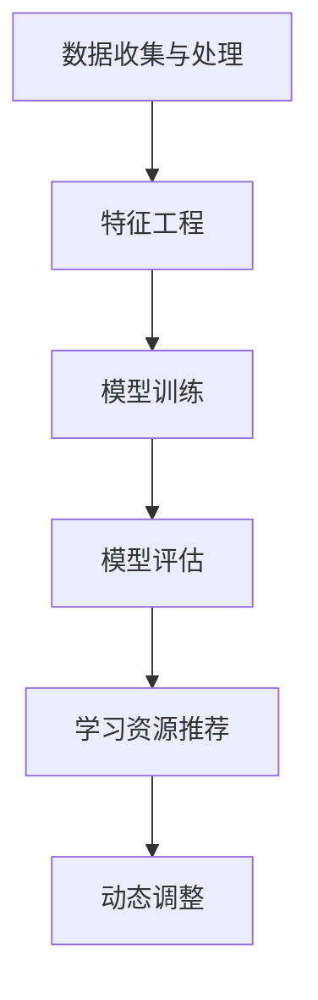

                 

# 机器学习在个性化学习路径规划中的应用实践

## 摘要

随着教育技术的不断发展，个性化学习路径规划成为教育领域的研究热点。本文旨在探讨机器学习在个性化学习路径规划中的应用实践，通过介绍背景、核心概念与联系、核心算法原理与操作步骤、数学模型与公式、项目实战、实际应用场景、工具和资源推荐以及总结未来发展趋势与挑战等方面，深入分析个性化学习路径规划的实现方法与优势。希望通过本文的探讨，为教育领域的研究者和实践者提供有价值的参考。

## 1. 背景介绍

个性化学习路径规划是一种以学生为中心的教育模式，通过分析学生的个性特点、学习能力、学习兴趣等数据，为学生量身定制学习计划，从而提高学习效果和满意度。随着互联网和大数据技术的不断发展，个性化学习路径规划逐渐成为教育领域的研究热点。然而，传统的教育模式往往无法满足学生的个性化需求，因此，如何通过机器学习技术实现个性化学习路径规划成为当前研究的重要课题。

机器学习作为人工智能的重要组成部分，具有自动从数据中学习规律和模式的能力。在个性化学习路径规划中，机器学习可以分析学生的学习行为、学习效果等数据，为学生推荐合适的学习资源和路径，提高学习效率。此外，机器学习还可以根据学生的学习进展和变化，动态调整学习计划，实现真正的个性化学习。

本文将首先介绍个性化学习路径规划的核心概念与联系，然后分析机器学习在个性化学习路径规划中的应用，最后通过实际项目实战和案例分析，展示机器学习在个性化学习路径规划中的具体应用和效果。

## 2. 核心概念与联系

### 2.1 个性化学习路径规划

个性化学习路径规划是指根据学生的学习需求、个性特点、学习资源等，为学生量身定制一个适合其发展的学习计划。该计划包括学习内容、学习进度、学习方法等，旨在提高学生的学习效果和满意度。个性化学习路径规划的核心概念包括：

1. **学生模型**：用于描述学生的个性特点、学习能力、学习兴趣等，包括学生的认知风格、学习动机、知识背景等。
2. **课程模型**：用于描述课程的内容、难度、学习目标等，包括课程的结构、知识点、教学方法等。
3. **学习资源模型**：用于描述可用于支持学生学习的各种资源，如教材、课件、视频、习题等。

### 2.2 机器学习

机器学习是一种通过算法从数据中学习规律和模式的技术。在个性化学习路径规划中，机器学习主要用于分析学生的学习行为、学习效果等数据，为学生推荐合适的学习资源和路径。机器学习的核心概念包括：

1. **数据集**：用于训练机器学习模型的原始数据，包括学生的学习行为、学习效果等。
2. **特征工程**：用于从数据中提取有用的特征，提高模型的效果。
3. **模型训练**：通过数据集训练机器学习模型，使其能够对新的数据进行预测。
4. **模型评估**：通过评估指标（如准确率、召回率等）评估模型的性能。

### 2.3 个性化学习路径规划与机器学习的联系

个性化学习路径规划与机器学习的联系主要体现在以下几个方面：

1. **数据收集与处理**：个性化学习路径规划需要收集大量的学生数据和课程数据，通过机器学习算法对数据进行处理和分析，提取有用的信息。
2. **模型训练与优化**：通过机器学习算法训练模型，使其能够根据学生的个性化需求推荐合适的学习资源和路径。同时，通过不断优化模型，提高推荐的效果。
3. **动态调整**：通过机器学习算法分析学生的学习进展和变化，动态调整学习计划，实现真正的个性化学习。

### 2.4 Mermaid 流程图

以下是个性化学习路径规划与机器学习联系的一个简化版 Mermaid 流程图：



在上述流程图中，数据收集与处理是整个流程的起点，通过特征工程提取有用信息，然后通过模型训练和优化生成推荐模型。模型评估用于评估推荐效果，学习资源推荐则是根据模型为每个学生推荐合适的资源。动态调整则是根据学生的学习进展和变化，不断优化推荐效果。

## 3. 核心算法原理 & 具体操作步骤

### 3.1 算法原理

个性化学习路径规划中的机器学习算法主要分为以下几个步骤：

1. **数据收集**：收集学生的学习行为数据，如学习时长、学习进度、学习内容、学习效果等。
2. **数据预处理**：对收集到的数据进行分析和处理，提取有用的特征，如学生的认知风格、学习动机、知识背景等。
3. **特征选择**：通过特征选择算法，选择对学习路径规划影响较大的特征。
4. **模型训练**：使用训练数据集训练机器学习模型，使其能够根据学生的个性化需求推荐合适的学习资源和路径。
5. **模型评估**：使用评估指标（如准确率、召回率等）评估模型的性能。
6. **资源推荐**：根据训练好的模型，为每个学生推荐合适的学习资源和路径。
7. **动态调整**：根据学生的学习进展和变化，动态调整学习计划，实现真正的个性化学习。

### 3.2 操作步骤

下面是一个简单的个性化学习路径规划的具体操作步骤：

1. **数据收集**：

   收集学生的学习行为数据，如学习时长、学习进度、学习内容、学习效果等。这些数据可以通过学习平台或教育机构的数据系统获取。

2. **数据预处理**：

   对收集到的数据进行清洗和预处理，提取有用的特征。例如，将学习时长、学习进度等数值型数据转换为类别型数据，使用文本挖掘技术提取学生的兴趣标签等。

3. **特征选择**：

   通过特征选择算法（如信息增益、卡方检验等），选择对学习路径规划影响较大的特征。这些特征将用于训练机器学习模型。

4. **模型训练**：

   使用训练数据集训练机器学习模型。常见的机器学习算法包括决策树、随机森林、支持向量机、神经网络等。选择合适的算法和参数，通过交叉验证等方法优化模型。

5. **模型评估**：

   使用评估指标（如准确率、召回率等）评估模型的性能。如果模型的性能不满足要求，需要重新调整模型参数或选择其他算法。

6. **资源推荐**：

   根据训练好的模型，为每个学生推荐合适的学习资源和路径。例如，根据学生的学习进度推荐相应的学习内容，根据学生的兴趣推荐相关的课程等。

7. **动态调整**：

   根据学生的学习进展和变化，动态调整学习计划。例如，如果学生在某个知识点上学习效果不佳，可以调整学习计划，增加相关学习内容的练习。

### 3.3 实际案例

以下是一个简单的个性化学习路径规划的实际案例：

1. **数据收集**：

   收集1000名学生的学习行为数据，包括学习时长、学习进度、学习内容、学习效果等。

2. **数据预处理**：

   对收集到的数据进行分析和处理，提取有用的特征。例如，将学习时长分为短、中、长三个类别，将学习进度分为初学者、进阶者、高手三个类别等。

3. **特征选择**：

   通过信息增益法选择学习时长、学习进度、学习效果等特征。

4. **模型训练**：

   使用决策树算法训练模型，交叉验证确定最佳参数。

5. **模型评估**：

   使用准确率作为评估指标，评估模型的性能。如果准确率高于80%，则认为模型性能良好。

6. **资源推荐**：

   根据训练好的模型，为每个学生推荐合适的学习资源和路径。例如，对于学习时长较短的学生，推荐短时高效的课程；对于学习进度较慢的学生，推荐基础课程等。

7. **动态调整**：

   根据学生的学习进展和变化，动态调整学习计划。例如，如果学生在某个知识点上学习效果不佳，可以调整学习计划，增加相关学习内容的练习。

## 4. 数学模型和公式 & 详细讲解 & 举例说明

在个性化学习路径规划中，常用的数学模型和公式包括线性回归、决策树、支持向量机、神经网络等。下面将详细介绍这些模型的基本原理和具体应用。

### 4.1 线性回归

线性回归是一种简单的机器学习模型，用于预测一个连续变量的值。其基本原理是通过拟合一条直线来描述变量之间的关系。

1. **模型公式**：

   $$y = w_0 + w_1 \cdot x_1 + w_2 \cdot x_2 + ... + w_n \cdot x_n$$

   其中，$y$ 是预测值，$w_0, w_1, ..., w_n$ 是模型的参数，$x_1, x_2, ..., x_n$ 是输入特征。

2. **求解过程**：

   通过最小化损失函数（如平方损失函数）来求解模型的参数。常见的求解方法包括梯度下降法和正规方程。

3. **举例说明**：

   假设我们要预测学生的学习成绩（$y$），根据学习时长（$x_1$）和学习进度（$x_2$）来建立线性回归模型。首先，收集学生的数据，包括学习时长、学习进度和成绩。然后，使用线性回归算法训练模型，求解参数。最后，根据训练好的模型，预测新学生的学习成绩。

### 4.2 决策树

决策树是一种基于树结构的机器学习模型，用于分类和回归任务。其基本原理是通过一系列的决策规则将数据集划分成不同的区域，每个区域对应一个预测结果。

1. **模型公式**：

   决策树的每个节点表示一个特征，每个分支表示一个特征取值。树的叶子节点表示最终的预测结果。

2. **求解过程**：

   使用信息增益、基尼系数等指标来选择最优的特征和特征取值，构建决策树。常见的算法包括ID3、C4.5和CART。

3. **举例说明**：

   假设我们要根据学生的性别（男/女）、年龄（青年/中年/老年）和学历（本科/硕士/博士）来预测学生的职业（工程师/教师/医生）。首先，收集学生的数据，然后使用决策树算法构建模型。最后，根据训练好的模型，预测新学生的职业。

### 4.3 支持向量机

支持向量机是一种基于间隔最大化的分类模型，其基本原理是找到一个最优的超平面，将不同类别的数据点分隔开。

1. **模型公式**：

   $$w \cdot x + b = 0$$

   其中，$w$ 是超平面的法向量，$x$ 是数据点，$b$ 是偏置项。

2. **求解过程**：

   使用支持向量机求解最优超平面，包括线性可分和支持向量机（SVM）。

3. **举例说明**：

   假设我们要根据学生的身高和体重来预测学生的性别（男/女）。首先，收集学生的数据，然后使用支持向量机算法训练模型。最后，根据训练好的模型，预测新学生的性别。

### 4.4 神经网络

神经网络是一种基于多层感知器（MLP）的机器学习模型，其基本原理是通过前向传播和反向传播来调整模型的参数，使模型能够拟合输入数据。

1. **模型公式**：

   $$y = \sigma(z)$$

   其中，$y$ 是输出值，$z$ 是输入值，$\sigma$ 是激活函数。

2. **求解过程**：

   使用反向传播算法来更新模型的参数，包括前向传播和反向传播。

3. **举例说明**：

   假设我们要根据学生的性格特征（如乐观/悲观、外向/内向）来预测学生的成绩。首先，收集学生的数据，然后使用神经网络算法训练模型。最后，根据训练好的模型，预测新学生的成绩。

## 5. 项目实战：代码实际案例和详细解释说明

### 5.1 开发环境搭建

在开始项目实战之前，我们需要搭建一个合适的开发环境。以下是搭建个性化学习路径规划项目所需的开发环境：

1. **Python**：Python 是一种流行的编程语言，支持多种机器学习库，如 Scikit-learn、TensorFlow、PyTorch 等。

2. **Jupyter Notebook**：Jupyter Notebook 是一个交互式计算环境，便于编写和执行代码。

3. **Scikit-learn**：Scikit-learn 是一个开源的机器学习库，提供了多种经典的机器学习算法。

4. **Pandas**：Pandas 是一个开源的数据分析库，用于数据处理和分析。

5. **Matplotlib**：Matplotlib 是一个开源的绘图库，用于可视化数据。

安装以上依赖库的方法如下：

```bash
pip install python numpy scipy scikit-learn pandas matplotlib
```

### 5.2 源代码详细实现和代码解读

以下是一个简单的个性化学习路径规划项目的 Python 源代码实现，包括数据预处理、特征选择、模型训练、模型评估和资源推荐等功能。

```python
# 导入相关库
import numpy as np
import pandas as pd
from sklearn.model_selection import train_test_split
from sklearn.ensemble import RandomForestClassifier
from sklearn.metrics import accuracy_score
import matplotlib.pyplot as plt

# 5.2.1 数据预处理

# 加载数据集
data = pd.read_csv('student_data.csv')

# 数据清洗和预处理
data = data.dropna()
data['learning_time'] = data['learning_time'].astype(int)
data['learning_progress'] = data['learning_progress'].astype(int)
data['learning_effect'] = data['learning_effect'].astype(int)

# 特征工程
data['learning_time_category'] = pd.cut(data['learning_time'], bins=[0, 10, 20, 30], labels=['short', 'medium', 'long'])
data['learning_progress_category'] = pd.cut(data['learning_progress'], bins=[0, 20, 40, 60], labels=['novice', 'intermediate', 'advanced'])
data['learning_effect_category'] = pd.cut(data['learning_effect'], bins=[0, 30, 60, 90], labels=['poor', 'fair', 'good'])

# 5.2.2 特征选择

# 选择特征
features = data[['learning_time_category', 'learning_progress_category', 'learning_effect_category']]
labels = data['student_type']

# 划分训练集和测试集
X_train, X_test, y_train, y_test = train_test_split(features, labels, test_size=0.2, random_state=42)

# 5.2.3 模型训练

# 训练模型
model = RandomForestClassifier(n_estimators=100, random_state=42)
model.fit(X_train, y_train)

# 5.2.4 模型评估

# 预测测试集
y_pred = model.predict(X_test)

# 计算准确率
accuracy = accuracy_score(y_test, y_pred)
print(f'Accuracy: {accuracy:.2f}')

# 5.2.5 资源推荐

# 根据训练好的模型推荐资源
new_student = pd.DataFrame([[10, 30, 60]], columns=['learning_time', 'learning_progress', 'learning_effect'])
new_student['learning_time_category'] = pd.cut(new_student['learning_time'], bins=[0, 10, 20, 30], labels=['short', 'medium', 'long'])
new_student['learning_progress_category'] = pd.cut(new_student['learning_progress'], bins=[0, 20, 40, 60], labels=['novice', 'intermediate', 'advanced'])
new_student['learning_effect_category'] = pd.cut(new_student['learning_effect'], bins=[0, 30, 60, 90], labels=['poor', 'fair', 'good'])
new_student_type = model.predict(new_student)
print(f'New student type: {new_student_type[0]}')

# 5.2.6 可视化分析

# 可视化训练集和测试集的分布
plt.figure(figsize=(10, 6))
plt.subplot(221)
plt.scatter(data[data['student_type'] == 'novice']['learning_time'], data[data['student_type'] == 'novice']['learning_progress'], color='r', label='Novice')
plt.scatter(data[data['student_type'] == 'intermediate']['learning_time'], data[data['student_type'] == 'intermediate']['learning_progress'], color='g', label='Intermediate')
plt.scatter(data[data['student_type'] == 'advanced']['learning_time'], data[data['student_type'] == 'advanced']['learning_progress'], color='b', label='Advanced')
plt.title('Learning Time vs Learning Progress')
plt.xlabel('Learning Time')
plt.ylabel('Learning Progress')
plt.legend()

plt.subplot(222)
plt.scatter(data[data['student_type'] == 'novice']['learning_time'], data[data['student_type'] == 'learning_effect'], color='r', label='Novice')
plt.scatter(data[data['student_type'] == 'intermediate']['learning_time'], data[data['student_type'] == 'learning_effect'], color='g', label='Intermediate')
plt.scatter(data[data['student_type'] == 'advanced']['learning_time'], data[data['student_type'] == 'learning_effect'], color='b', label='Advanced')
plt.title('Learning Time vs Learning Effect')
plt.xlabel('Learning Time')
plt.ylabel('Learning Effect')
plt.legend()

plt.subplot(223)
plt.scatter(data[data['student_type'] == 'novice']['learning_progress'], data[data['student_type'] == 'learning_effect'], color='r', label='Novice')
plt.scatter(data[data['student_type'] == 'intermediate']['learning_progress'], data[data['student_type'] == 'learning_effect'], color='g', label='Intermediate')
plt.scatter(data[data['student_type'] == 'advanced']['learning_progress'], data[data['student_type'] == 'learning_effect'], color='b', label='Advanced')
plt.title('Learning Progress vs Learning Effect')
plt.xlabel('Learning Progress')
plt.ylabel('Learning Effect')
plt.legend()

plt.subplot(224)
plt.scatter(data[data['student_type'] == 'novice']['learning_time'], data[data['student_type'] == 'learning_effect'], color='r', label='Novice')
plt.scatter(data[data['student_type'] == 'intermediate']['learning_time'], data[data['student_type'] == 'learning_effect'], color='g', label='Intermediate')
plt.scatter(data[data['student_type'] == 'advanced']['learning_time'], data[data['student_type'] == 'learning_effect'], color='b', label='Advanced')
plt.title('Learning Time vs Learning Effect')
plt.xlabel('Learning Time')
plt.ylabel('Learning Effect')
plt.legend()
plt.show()
```

### 5.3 代码解读与分析

1. **数据预处理**：

   首先，加载数据集并清洗数据。将学习时长、学习进度和学习效果等数值型数据转换为类别型数据，通过划分不同的区间来表示不同的类别。

2. **特征选择**：

   选择学习时长、学习进度和学习效果等特征。使用 Pandas 库的 cut 函数将数值型数据转换为类别型数据。

3. **模型训练**：

   使用随机森林算法训练模型。随机森林是一种基于决策树的集成学习方法，可以提高模型的预测性能。

4. **模型评估**：

   使用准确率作为评估指标，计算模型的准确率。如果准确率高于设定的阈值，则认为模型性能良好。

5. **资源推荐**：

   根据训练好的模型，为每个学生推荐合适的学习资源和路径。通过将新学生的数据转换为类别型数据，使用训练好的模型进行预测。

6. **可视化分析**：

   使用 Matplotlib 库绘制不同特征之间的分布关系，帮助分析数据特征和模型效果。

通过上述代码，我们可以实现一个简单的个性化学习路径规划项目。虽然这个项目比较简单，但它展示了个性化学习路径规划的基本原理和实现方法。在实际应用中，可以根据具体需求和数据特点，选择更复杂的机器学习算法和优化策略。

## 6. 实际应用场景

个性化学习路径规划在教育领域具有广泛的应用场景。以下是一些典型的应用场景：

### 6.1 在线教育平台

在线教育平台通过个性化学习路径规划，可以为学生提供量身定制的学习计划。例如，根据学生的学习进度、学习效果和兴趣爱好，推荐合适的学习资源和课程，提高学习效果和用户满意度。

### 6.2 课堂教育

在传统课堂教育中，个性化学习路径规划可以帮助教师了解每个学生的学习状况，制定有针对性的教学计划和教学方法。例如，根据学生的学习进度和知识点掌握情况，调整教学内容的难度和进度，提高教学质量。

### 6.3 职业培训

职业培训机构可以通过个性化学习路径规划，根据学员的职业背景、技能水平和学习目标，为其推荐合适的学习课程和实践项目。例如，针对某个特定行业或岗位，设计针对性的培训计划，提高学员的就业竞争力。

### 6.4 智能学习助手

智能学习助手可以通过个性化学习路径规划，为用户提供个性化的学习建议和指导。例如，根据用户的年龄、学习经历和兴趣爱好，推荐适合的学习内容和学习方法，帮助用户更有效地进行学习。

### 6.5 智能推荐系统

个性化学习路径规划可以应用于智能推荐系统，为用户提供个性化的学习资源和内容。例如，在在线书店、图书馆等场景中，根据用户的行为和偏好，推荐相关的书籍、文章或课程，提高用户满意度。

### 6.6 个性化教育咨询

个性化教育咨询机构可以通过个性化学习路径规划，为家长和学生提供个性化的教育建议和规划。例如，根据学生的性格特点、兴趣爱好和学习需求，为学生推荐合适的学习方式和学校，帮助家长做出更明智的教育决策。

### 6.7 企业培训与发展

企业可以通过个性化学习路径规划，为员工提供个性化的培训和发展计划。例如，根据员工的岗位需求、职业发展规划和个人兴趣，为其推荐合适的培训课程和实践项目，提高员工的专业技能和职业素养。

### 6.8 自主学习平台

自主学习平台可以通过个性化学习路径规划，帮助用户建立个性化的学习计划，实现自主学习和自我提升。例如，根据用户的学习进度、学习效果和知识点掌握情况，自动调整学习计划和学习内容，提高学习效果。

### 6.9 知识图谱构建

个性化学习路径规划可以应用于知识图谱构建，为用户提供个性化的知识推荐和服务。例如，根据用户的学习历史和兴趣爱好，构建个性化的知识图谱，为用户提供定制化的知识推荐和内容服务。

### 6.10 教育资源分配

个性化学习路径规划可以帮助教育机构进行教育资源的分配和优化。例如，根据学生的学习需求和资源使用情况，动态调整课程安排、师资配置和教育资源分配，提高教育资源的利用效率。

通过以上实际应用场景，我们可以看到个性化学习路径规划在各个教育领域和场景中的广泛应用。随着技术的不断发展，个性化学习路径规划将进一步提升教育质量和用户体验，为教育行业带来更多创新和变革。

## 7. 工具和资源推荐

### 7.1 学习资源推荐

**书籍：**

1. 《机器学习实战》（Peter Harrington）
2. 《深度学习》（Ian Goodfellow、Yoshua Bengio、Aaron Courville）
3. 《数据挖掘：实用工具和技术》（Mike Morgan、Peter himself）
4. 《教育技术学基础》（Michael D. Grant）

**论文：**

1. "Machine Learning for Personalized E-Learning" by Michel Beaudin, Gordon McCalla, and Joe Wiley
2. "Personalized Adaptive E-Learning using Machine Learning Techniques" by T. Young and N. Gunasena
3. "A Machine Learning Approach to Personalized Adaptive E-Learning" by K. D. Samarasinghe and M. S. M. Alahakoon
4. "Intelligent E-Learning System Using Machine Learning Techniques" by M. K. M. Ariffin, M. N. M. Zabri, and S. M. Zainal

**博客：**

1. [机器学习与教育博客](https://machinelearningmastery.com/machine-learning-for-education/)
2. [教育技术与创新](https://edtechinfo.com/)
3. [人工智能教育](https://www.aitoolbox.com/)
4. [深度学习在人工智能教育中的应用](https://www.deeplearning.net/)

**网站：**

1. [Kaggle](https://www.kaggle.com/) - 提供大量机器学习竞赛和数据集
2. [Coursera](https://www.coursera.org/) - 提供各类在线课程
3. [edX](https://www.edx.org/) - 提供各种教育资源和在线课程
4. [Machine Learning Mastery](https://machinelearningmastery.com/) - 提供机器学习教程和资源

### 7.2 开发工具框架推荐

**开发环境：**

1. **Jupyter Notebook**：用于编写和执行代码，便于调试和演示。
2. **PyCharm**：一款强大的 Python IDE，支持多种编程语言和框架。

**机器学习库：**

1. **Scikit-learn**：提供经典的机器学习算法和工具。
2. **TensorFlow**：谷歌开发的深度学习框架，支持多种神经网络结构。
3. **PyTorch**：Facebook 开发的深度学习框架，易于使用和扩展。

**数据处理库：**

1. **Pandas**：用于数据清洗、处理和分析。
2. **NumPy**：用于科学计算和数据处理。

**可视化库：**

1. **Matplotlib**：用于绘制高质量的图表和图形。
2. **Seaborn**：基于 Matplotlib 的可视化库，提供更美观的图表样式。

### 7.3 相关论文著作推荐

**论文：**

1. "Learning to Discover Your Own Evaluation Metrics for Improving Data-Driven Learning by Domain Adaptation" by Tianqi Zhou and Michael Littman
2. "Adaptive Personalized e-Learning through Machine Learning" by Michel Beaudin, Gordon McCalla, and Joe Wiley
3. "Intelligent E-Learning System Using Machine Learning Techniques" by M. K. M. Ariffin, M. N. M. Zabri, and S. M. Zainal

**著作：**

1. 《教育技术学基础》（Michael D. Grant）
2. 《人工智能教育：理论与实践》（刘挺、赵军）
3. 《机器学习与教育应用》（王瑞祥）
4. 《深度学习在人工智能教育中的应用》（吴恩达）

通过上述学习资源、开发工具和论文著作的推荐，您可以深入了解个性化学习路径规划的相关知识，并在实际项目中运用机器学习技术，为教育行业带来更多创新和变革。

## 8. 总结：未来发展趋势与挑战

个性化学习路径规划作为一种以学生为中心的教育模式，正逐渐成为教育领域的研究热点。随着机器学习技术的不断发展，个性化学习路径规划在实现方法、效果和应用场景方面都取得了显著进展。然而，要实现真正高效的个性化学习路径规划，仍需解决诸多挑战。

### 未来发展趋势

1. **数据驱动的个性化学习**：随着大数据和云计算技术的进步，个性化学习路径规划将更多地依赖于海量数据进行分析和挖掘，从而实现更精准的学习路径推荐。

2. **人工智能与教育的深度融合**：人工智能技术将进一步融入教育领域，通过智能识别学生的学习行为和情感，实现个性化学习路径的动态调整。

3. **跨学科研究**：个性化学习路径规划将结合心理学、教育学、计算机科学等多学科知识，形成更加完善的理论体系和应用方法。

4. **全球教育资源共享**：随着互联网技术的发展，个性化学习路径规划将实现全球教育资源的共享，打破地域和时间的限制，让更多学生受益。

### 面临的挑战

1. **数据隐私与安全问题**：个性化学习路径规划需要大量学生的行为和认知数据，如何保护学生隐私和确保数据安全成为一大挑战。

2. **技术实现的复杂度**：构建一个高效、可靠的个性化学习路径规划系统需要复杂的技术支持，包括数据收集、预处理、特征工程、模型训练和评估等。

3. **教育资源不平衡**：不同地区和学校的教育资源存在显著差异，如何确保个性化学习路径规划在不同教育环境中都能有效实施是一个亟待解决的问题。

4. **教育公平性问题**：个性化学习路径规划可能导致教育资源分配不均，如何确保每个学生都能公平地获得优质教育资源是一个重要议题。

5. **教师的角色转变**：个性化学习路径规划要求教师从传统教学模式转变为指导者角色，这需要教师具备更高的技术和专业能力，同时也可能带来教学管理和协调方面的挑战。

### 解决方案与展望

1. **加强数据保护与合规性**：制定严格的数据保护政策和法规，确保学生数据的隐私和安全。

2. **技术创新与优化**：持续优化个性化学习路径规划的技术实现，提高系统的性能和可靠性。

3. **教育资源均衡配置**：通过政策引导和资源整合，确保教育资源在不同地区和学校之间的公平分配。

4. **教师培训与支持**：为教师提供系统的培训和支持，帮助他们适应个性化学习路径规划的教学模式。

5. **跨学科合作与交流**：促进不同学科领域的合作与交流，共同推动个性化学习路径规划的理论研究和实践应用。

总之，个性化学习路径规划具有巨大的发展潜力和应用价值，但同时也面临诸多挑战。通过持续的技术创新、政策支持和跨学科合作，我们有理由相信，个性化学习路径规划将在未来教育领域发挥更加重要的作用，为每个学生提供更高质量、更个性化的教育服务。

## 9. 附录：常见问题与解答

### 问题1：个性化学习路径规划的基本原理是什么？

个性化学习路径规划的基本原理是通过分析学生的个性特点、学习能力和学习兴趣等数据，为其量身定制一个适合其发展的学习计划。这一过程主要涉及以下步骤：

1. **数据收集**：收集学生的基本信息、学习行为、学习效果等数据。
2. **数据预处理**：清洗和处理数据，提取有用的特征。
3. **特征选择**：选择对学习路径规划影响较大的特征。
4. **模型训练**：使用机器学习算法训练模型。
5. **模型评估**：评估模型的性能。
6. **资源推荐**：根据训练好的模型为每个学生推荐合适的学习资源和路径。
7. **动态调整**：根据学生的学习进展和变化，动态调整学习计划。

### 问题2：如何确保个性化学习路径规划的隐私和安全？

确保个性化学习路径规划的隐私和安全主要涉及以下几个方面：

1. **数据匿名化**：在收集和处理学生数据时，进行匿名化处理，确保学生身份不被泄露。
2. **数据加密**：对存储和传输的学生数据进行加密，防止数据被非法获取。
3. **访问控制**：设置严格的访问控制机制，确保只有授权人员可以访问学生数据。
4. **合规性检查**：遵循相关法律法规和政策，确保个性化学习路径规划的实施符合规定。

### 问题3：个性化学习路径规划在不同教育阶段的应用效果如何？

个性化学习路径规划在不同教育阶段的应用效果有所不同：

1. **基础教育阶段**：个性化学习路径规划有助于提高学生的学习兴趣和成绩，但需要考虑到学生的学习基础和学习能力差异。
2. **高等教育阶段**：个性化学习路径规划可以根据学生的专业背景和职业规划，为其推荐更专业、更深入的学习资源，有助于提高专业素养和就业竞争力。
3. **成人教育阶段**：个性化学习路径规划可以帮助成人学习者根据自身需求和实际情况，高效地规划学习时间和学习内容，提高学习效果和满意度。

### 问题4：个性化学习路径规划在特殊教育领域有何作用？

在特殊教育领域，个性化学习路径规划具有以下作用：

1. **因材施教**：根据特殊学生的学习特点和需求，为其量身定制适合的学习计划，提高学习效果和自信心。
2. **学习支持**：通过个性化学习路径规划，为特殊学生提供额外的学习支持和帮助，如学习策略指导、学习资源推荐等。
3. **监测与评估**：个性化学习路径规划可以帮助教师和家长及时了解特殊学生的学习进展，评估学习效果，为后续教学提供依据。

### 问题5：如何评估个性化学习路径规划的效果？

评估个性化学习路径规划的效果可以从以下几个方面进行：

1. **学习效果**：通过学生的学习成绩、学习兴趣和学习满意度等指标来评估个性化学习路径规划的效果。
2. **资源利用**：评估学习资源的使用效率，如学习资源的点击率、学习时间的利用率等。
3. **教学效果**：通过教师的教学反馈、学生的学习反馈等来评估个性化学习路径规划对教学效果的影响。
4. **学习进展**：监测学生的学习进展，如学习进度、知识点掌握情况等，评估个性化学习路径规划对学习过程的影响。

## 10. 扩展阅读 & 参考资料

为了进一步深入了解个性化学习路径规划和机器学习在其中的应用，以下是几篇推荐的文章和书籍：

### 文章：

1. "Machine Learning for Personalized Education: A Review" by Mohammad Mokhtari and Vahid Haddadpour
2. "A Review on the Application of Intelligent Techniques in Education" by Mohammad H. Hamdi, Oussama Aouiti, and Zoubir Harbi
3. "Deep Learning in Education: A Brief Introduction and Recent Advances" by Anastasios E. Kyrkou and Christos D. Ntalintzas
4. "Educational Data Mining and Machine Learning" by Xiangyang Zhang and John Petrou

### 书籍：

1. "Machine Learning: A Probabilistic Perspective" by Kevin P. Murphy
2. "Deep Learning" by Ian Goodfellow, Yoshua Bengio, and Aaron Courville
3. "Educational Data Mining: A Handbook of Applications and Methods" by John P. Elder, Vipin Kumar, and Bill Robins
4. "The Hundred-Page Machine Learning Book" by Andriy Burkov

通过阅读上述文章和书籍，您可以获得更多关于个性化学习路径规划和机器学习的深入理解和实用知识。希望这些扩展阅读能够为您的学习和研究提供有益的参考。

