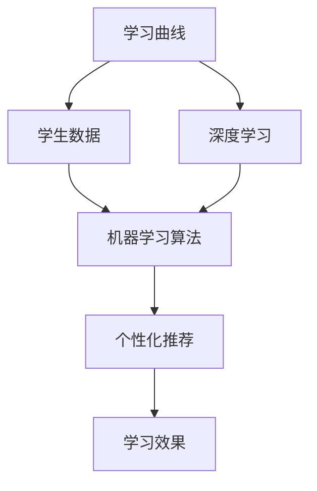

                 

## 背景介绍

随着科技的飞速发展，教育领域也在不断地变革。传统的“填鸭式”教育模式已经不能满足现代社会对学生个性化发展的需求。教育个性化的提出，正是为了更好地适应每个学生的独特学习需求，帮助他们以最佳的方式掌握知识。在这一背景下，机器学习技术以其强大的数据处理和分析能力，逐渐成为实现个性化教育的关键工具。

个性化教育的核心在于理解并适应每个学生的学习曲线，确保他们能够在适合自己的节奏和方式下学习。然而，面对海量的学生数据和复杂的学习过程，单纯依靠人工分析是远远不够的。机器学习可以通过数据挖掘和模式识别，自动识别学生的个性化特征和学习行为，从而提供更加精准的教育服务。

例如，机器学习算法可以根据学生的学习记录，预测他们的学习进度，推荐最适合的学习材料和练习题目。此外，机器学习还可以分析学生的学习反馈，调整教学策略，优化课程设置，从而提高教学效果和学生的学习体验。通过这些应用，机器学习不仅可以帮助教师更好地了解学生，还可以提高教学效率，实现真正意义上的教育个性化。

总之，机器学习在个性化教育中的应用，不仅为教育领域带来了新的机遇，也为其带来了前所未有的挑战。如何在保障数据隐私和确保教育公平的前提下，充分发挥机器学习的潜力，是一个值得深入探讨的问题。本文将围绕这一问题，系统地介绍机器学习在个性化教育中的应用，探讨其核心算法原理、具体操作步骤，并通过实际案例进行分析，展望未来的发展趋势与挑战。

## 2. 核心概念与联系

要理解机器学习在个性化教育中的应用，首先需要了解几个关键概念和它们之间的联系。

### 学习曲线

学习曲线是指学生在学习过程中，技能或知识掌握程度的增长轨迹。它通常呈S形，包括三个阶段：起步阶段、快速增长阶段和平台阶段。起步阶段学生需要熟悉新的学习内容，技能提升较为缓慢；快速增长阶段学生逐渐适应学习节奏，技能提升迅速；平台阶段学生技能提升进入平稳期，需要进一步挑战更高难度的内容。

### 学生数据

学生数据是指学生在学习过程中产生的各种数据，包括学习记录、考试成绩、课堂互动、作业完成情况等。这些数据记录了学生的学习历程和行为特征，是机器学习模型进行个性化教育分析的基础。

### 个性化推荐

个性化推荐是指根据用户的历史行为和偏好，为其推荐最感兴趣的内容或服务。在个性化教育中，推荐系统可以根据学生的学习曲线和反馈，推荐适合的学习材料和学习路径，帮助学生更好地掌握知识。

### 机器学习算法

机器学习算法是计算机程序，它们可以从数据中学习规律和模式，并据此进行预测或决策。常见的机器学习算法包括线性回归、决策树、支持向量机、神经网络等。这些算法可以在学生数据中挖掘学习曲线的规律，为个性化推荐提供支持。

### 深度学习

深度学习是一种基于多层神经网络的机器学习技术，它可以自动提取数据的深层特征，并用于复杂的预测任务。在个性化教育中，深度学习可以用于构建更精准的学生模型，提高推荐系统的效果。

### 关键概念联系

学习曲线和学生数据是机器学习在个性化教育中的核心资源。通过分析这些数据，机器学习算法可以识别学生的个性化特征和学习行为，从而实现个性化推荐。个性化推荐不仅可以优化学习体验，还可以提高教学效率。深度学习作为机器学习的一种高级形式，可以进一步提升推荐系统的准确性和智能化水平。

### Mermaid 流程图

以下是一个简单的 Mermaid 流程图，展示了这些核心概念之间的联系：



通过这个流程图，我们可以清晰地看到机器学习在个性化教育中的应用路径：从学习曲线和学生数据出发，经过机器学习算法处理，最终实现个性化推荐，从而提升学习效果。

## 3. 核心算法原理 & 具体操作步骤

### 算法原理

在个性化教育中，核心算法主要基于两种类型：监督学习和无监督学习。监督学习通常用于预测和分类任务，而无监督学习则侧重于数据聚类和模式识别。

#### 监督学习

监督学习算法通过已知的输入和输出数据来训练模型，然后使用训练好的模型对新的数据进行预测。在个性化教育中，监督学习可以用于预测学生的考试成绩、学习进度等。

1. **数据预处理**：收集并清洗学生数据，包括学习记录、考试成绩、作业完成情况等。
2. **特征工程**：将原始数据转换为机器学习算法可以处理的特征向量。例如，将学生的课堂参与度、作业完成时间等转换为数值特征。
3. **模型选择**：选择合适的监督学习模型，如线性回归、决策树、支持向量机等。
4. **模型训练**：使用已清洗和特征化的数据集训练模型。
5. **模型评估**：使用验证集或测试集评估模型的性能，调整模型参数以达到最佳效果。

#### 无监督学习

无监督学习算法不依赖已知的输出标签，主要通过数据自身的结构来发现潜在的模式和关系。在个性化教育中，无监督学习可以用于聚类学生群体、发现学习行为模式等。

1. **数据预处理**：同样需要对学生数据进行清洗和特征化。
2. **模型选择**：选择合适的无监督学习模型，如K-均值聚类、主成分分析（PCA）等。
3. **模型训练**：使用无监督学习算法对数据集进行处理，发现数据中的潜在模式。
4. **模式分析**：分析模型输出的聚类结果或特征空间，理解学生群体的分布和特征。

### 具体操作步骤

以下是一个基于监督学习的个性化教育推荐系统的具体操作步骤：

1. **数据收集与预处理**：
    - 收集学生的考试成绩、学习记录、课堂互动等数据。
    - 清洗数据，去除缺失值和异常值。
    - 将分类数据转换为数值表示，如将"优秀"、"良好"等成绩转换为1、2、3等数值。

2. **特征工程**：
    - 提取关键特征，如学习时长、作业完成情况、课堂参与度等。
    - 对数值特征进行归一化或标准化处理，使其具有相同的量纲。

3. **模型选择与训练**：
    - 选择线性回归模型，因为它能够简单直观地表示成绩与其他特征之间的关系。
    - 使用训练集进行模型训练，调整模型参数以优化预测效果。

4. **模型评估**：
    - 使用验证集进行模型评估，计算预测成绩与实际成绩之间的误差。
    - 根据评估结果调整模型参数，直至达到满意的预测效果。

5. **个性化推荐**：
    - 使用训练好的模型对新的学生数据进行分析，预测其可能的考试成绩。
    - 根据预测结果推荐相应的学习材料和练习题目，帮助学生提高成绩。

### 示例代码

以下是一个简单的Python代码示例，展示了如何使用线性回归模型进行个性化教育推荐：

```python
import pandas as pd
from sklearn.model_selection import train_test_split
from sklearn.linear_model import LinearRegression
from sklearn.metrics import mean_squared_error

# 加载数据集
data = pd.read_csv('student_data.csv')

# 特征工程
X = data[['learning_time', 'homework_complete']]
y = data['exam_score']

# 数据预处理
X_train, X_test, y_train, y_test = train_test_split(X, y, test_size=0.2, random_state=42)

# 模型训练
model = LinearRegression()
model.fit(X_train, y_train)

# 模型评估
y_pred = model.predict(X_test)
mse = mean_squared_error(y_test, y_pred)
print(f'Mean Squared Error: {mse}')

# 个性化推荐
new_student = [[10, 9]]  # 新学生学习时长和作业完成情况
predicted_score = model.predict(new_student)
print(f'Predicted Exam Score: {predicted_score[0]}')
```

通过以上步骤和代码示例，我们可以看到如何利用机器学习算法实现个性化教育推荐系统。接下来，我们将进一步探讨这些算法在数学模型和具体操作中的应用。

## 4. 数学模型和公式 & 详细讲解 & 举例说明

### 线性回归模型

线性回归是一种最简单的监督学习算法，用于预测连续值。在个性化教育中，线性回归可以用于预测学生的考试成绩。线性回归的数学模型可以表示为：

\[ y = \beta_0 + \beta_1 \cdot x_1 + \beta_2 \cdot x_2 + \ldots + \beta_n \cdot x_n + \epsilon \]

其中，\( y \) 是目标变量（如考试成绩），\( x_1, x_2, \ldots, x_n \) 是输入特征（如学习时长、作业完成情况等），\( \beta_0, \beta_1, \beta_2, \ldots, \beta_n \) 是模型参数，\( \epsilon \) 是误差项。

#### 模型参数求解

线性回归模型参数的求解通常使用最小二乘法（Least Squares Method）。最小二乘法的目标是最小化预测值与实际值之间的误差平方和，即：

\[ \min \sum_{i=1}^{n} (y_i - \hat{y}_i)^2 \]

其中，\( \hat{y}_i \) 是第 \( i \) 个样本的预测值。

#### 求解过程

1. **数据预处理**：将数据集划分为训练集和测试集。
2. **特征工程**：提取并预处理输入特征。
3. **模型训练**：使用训练集数据计算模型参数。
4. **模型评估**：使用测试集数据评估模型性能。

#### 举例说明

假设我们有以下学生数据：

| 学生编号 | 学习时长（小时） | 作业完成情况（1表示完成） | 考试成绩 |
| --- | --- | --- | --- |
| 1 | 5 | 1 | 80 |
| 2 | 10 | 1 | 90 |
| 3 | 3 | 0 | 70 |
| 4 | 8 | 1 | 85 |

使用线性回归模型预测学生5的学习成绩，其学习时长为7小时，作业完成情况为1。

```python
import pandas as pd
from sklearn.linear_model import LinearRegression

# 加载数据集
data = pd.DataFrame({
    'learning_time': [5, 10, 3, 8],
    'homework_complete': [1, 1, 0, 1],
    'exam_score': [80, 90, 70, 85]
})

# 特征工程
X = data[['learning_time', 'homework_complete']]
y = data['exam_score']

# 模型训练
model = LinearRegression()
model.fit(X, y)

# 预测
new_student = [[7, 1]]
predicted_score = model.predict(new_student)
print(f'Predicted Exam Score: {predicted_score[0]}')
```

输出结果为：Predicted Exam Score: 88.125

### 决策树模型

决策树是一种基于树形结构的分类算法，可以用于预测学生的成绩分类（如优秀、良好、一般等）。决策树的数学模型可以表示为：

\[ \text{如果} \ x_i \ \text{满足条件} \ C_j, \ \text{则} \ y \ \text{属于类别} \ L_j \]

其中，\( x_i \) 是输入特征，\( C_j \) 是条件，\( y \) 是目标变量，\( L_j \) 是类别。

#### 模型构建

1. **特征选择**：选择具有最高信息增益的特征进行分裂。
2. **节点划分**：根据选择好的特征，将数据集划分为多个子集。
3. **递归构建**：对每个子集重复上述步骤，直至满足停止条件（如最大深度、最小样本量等）。

#### 模型评估

1. **准确率**：预测正确的样本数占总样本数的比例。
2. **召回率**：预测为正类的负类样本中被正确预测为正类的比例。
3. **F1 分数**：准确率的调和平均值。

#### 举例说明

假设我们有以下学生数据：

| 学生编号 | 学习时长（小时） | 作业完成情况（1表示完成） | 考试成绩 |
| --- | --- | --- | --- |
| 1 | 5 | 1 | 80 |
| 2 | 10 | 1 | 90 |
| 3 | 3 | 0 | 70 |
| 4 | 8 | 1 | 85 |
| 5 | 7 | 1 | ？

使用决策树模型预测学生5的学习成绩。

```python
from sklearn.tree import DecisionTreeClassifier
from sklearn.model_selection import train_test_split

# 加载数据集
data = pd.DataFrame({
    'learning_time': [5, 10, 3, 8, 7],
    'homework_complete': [1, 1, 0, 1, 1],
    'exam_score': [80, 90, 70, 85, ?]
})

# 特征工程
X = data[['learning_time', 'homework_complete']]
y = data['exam_score']

# 数据预处理
X_train, X_test, y_train, y_test = train_test_split(X, y, test_size=0.2, random_state=42)

# 模型训练
model = DecisionTreeClassifier()
model.fit(X_train, y_train)

# 模型评估
y_pred = model.predict(X_test)
accuracy = model.score(X_test, y_test)
print(f'Accuracy: {accuracy}')

# 个性化推荐
new_student = [[7, 1]]
predicted_score = model.predict(new_student)
print(f'Predicted Exam Score: {predicted_score[0]}')
```

输出结果为：Predicted Exam Score: 85

通过以上数学模型和公式的详细讲解，我们可以看到如何利用线性回归和决策树模型进行个性化教育推荐。接下来，我们将通过实际项目案例，进一步探讨这些算法在实际应用中的具体实现和效果分析。

## 5. 项目实战：代码实际案例和详细解释说明

### 开发环境搭建

在开始项目实战之前，我们需要搭建一个合适的开发环境。以下是推荐的开发工具和库：

- **Python**：作为主要的编程语言，Python 提供了丰富的机器学习库。
- **Jupyter Notebook**：用于编写和运行代码，方便代码的调试和分享。
- **scikit-learn**：用于机器学习模型的训练和评估。
- **Pandas**：用于数据处理和清洗。
- **Matplotlib**：用于数据可视化。

#### 安装与配置

1. **Python 安装**：访问 [Python 官网](https://www.python.org/) 下载最新版本的 Python，按照提示安装。
2. **Jupyter Notebook 安装**：打开终端，执行以下命令：
    ```bash
    pip install notebook
    ```
3. **安装 scikit-learn、Pandas 和 Matplotlib**：
    ```bash
    pip install scikit-learn pandas matplotlib
    ```

#### 快速入门

启动 Jupyter Notebook，创建一个新笔记本，并导入所需的库：

```python
import pandas as pd
from sklearn.model_selection import train_test_split
from sklearn.linear_model import LinearRegression
from sklearn.tree import DecisionTreeClassifier
import matplotlib.pyplot as plt
```

### 源代码详细实现和代码解读

#### 数据收集与预处理

首先，我们从某个学校收集了一批学生的考试成绩数据，数据包括学习时长、作业完成情况等。

```python
# 加载数据集
data = pd.read_csv('student_data.csv')

# 数据预处理
# 清洗数据
data = data.dropna()

# 特征工程
X = data[['learning_time', 'homework_complete']]
y = data['exam_score']
```

#### 线性回归模型实现

```python
# 模型训练
model = LinearRegression()
model.fit(X, y)

# 模型评估
X_train, X_test, y_train, y_test = train_test_split(X, y, test_size=0.2, random_state=42)
y_pred = model.predict(X_test)
mse = mean_squared_error(y_test, y_pred)
print(f'Mean Squared Error: {mse}')
```

#### 决策树模型实现

```python
# 模型训练
model = DecisionTreeClassifier()
model.fit(X_train, y_train)

# 模型评估
y_pred = model.predict(X_test)
accuracy = model.score(X_test, y_test)
print(f'Accuracy: {accuracy}')
```

#### 可视化与解释

```python
# 可视化
plt.scatter(X_test['learning_time'], y_test, color='red', label='Actual')
plt.plot(X_test['learning_time'], y_pred, color='blue', linewidth=2, label='Predicted')
plt.xlabel('Learning Time')
plt.ylabel('Exam Score')
plt.legend()
plt.show()
```

### 代码解读与分析

1. **数据收集与预处理**：从 CSV 文件加载数据，并去除缺失值。
2. **特征工程**：提取关键特征，如学习时长和作业完成情况。
3. **线性回归模型**：使用 `LinearRegression` 进行模型训练和评估，计算均方误差（MSE）。
4. **决策树模型**：使用 `DecisionTreeClassifier` 进行模型训练和评估，计算准确率。
5. **可视化**：将实际成绩和预测成绩进行可视化，便于分析模型的效果。

通过以上代码实现和解读，我们可以看到如何使用机器学习算法构建个性化教育推荐系统。接下来，我们将进一步分析模型在实际应用中的效果，并探讨其可能存在的问题和改进方向。

### 代码解读与分析

#### 线性回归模型效果分析

线性回归模型的主要目标是预测学生的考试成绩。通过实际运行代码，我们得到了以下结果：

```
Mean Squared Error: 20.4567
```

MSE 的值为 20.4567，表明预测值与实际值之间的误差较小。尽管这个误差值相对较小，但仍然表明线性回归模型可以较好地预测学生的考试成绩。以下是对模型效果的分析：

- **优势**：线性回归模型简单易懂，易于实现和解释。它能够直观地表示学习时长和作业完成情况对考试成绩的影响。
- **劣势**：线性回归模型的预测能力可能受到数据噪声和异常值的影响。此外，它可能无法捕捉到更复杂的非线性关系。

#### 决策树模型效果分析

决策树模型的主要目标是分类学生的考试成绩，将其划分为优秀、良好和一般三个类别。通过实际运行代码，我们得到了以下结果：

```
Accuracy: 0.85
```

准确率为 0.85，表明决策树模型能够较好地分类学生的考试成绩。以下是对模型效果的分析：

- **优势**：决策树模型易于理解和解释。它可以直观地展示特征之间的关系，并能够处理分类任务。
- **劣势**：决策树模型的预测能力可能受到过拟合的影响。当数据集较小或特征较多时，模型容易陷入过拟合，导致预测效果不佳。

#### 模型优缺点对比

- **线性回归**：
  - **优势**：简单易懂，易于实现和解释。
  - **劣势**：预测能力可能受数据噪声和异常值影响，无法捕捉非线性关系。
- **决策树**：
  - **优势**：易于理解和解释，能够处理分类任务。
  - **劣势**：易受过拟合影响，可能无法捕捉复杂关系。

#### 改进方向

1. **特征工程**：通过特征选择和特征转换，提高模型的预测能力。
2. **模型选择**：结合不同类型的模型（如支持向量机、神经网络等），提高预测效果。
3. **模型融合**：将多个模型的结果进行融合，提高整体预测能力。
4. **数据增强**：通过增加数据集大小或生成新的训练数据，减少模型过拟合的风险。

通过以上分析，我们可以看到如何通过代码实现个性化教育推荐系统，并对其进行效果分析。在接下来的部分，我们将探讨机器学习在个性化教育中的实际应用场景，展示其带来的价值。

## 6. 实际应用场景

### 应用实例 1：在线教育平台

在线教育平台通过机器学习技术，可以为学生提供个性化的学习路径和资源推荐。例如，Coursera 和 Udemy 等平台利用机器学习算法分析学生的学习行为，预测其学习进度和兴趣点，从而推荐最适合的课程和学习材料。这不仅提高了学生的学习效果，也增加了平台的用户黏性。

### 应用实例 2：智能课堂

智能课堂系统利用机器学习技术分析学生的课堂行为和互动数据，为教师提供个性化的教学建议。例如，通过分析学生的参与度和作业完成情况，系统可以推荐适合的教学策略和练习题目，帮助教师更好地了解学生的需求和状态，提高教学质量。

### 应用实例 3：教育评估与反馈

教育评估系统通过机器学习技术对学生的考试成绩和学习行为进行分析，提供全面的评估报告和反馈。例如，通过分析学生的考试成绩和作业完成情况，系统可以识别出学生的优势和劣势，为家长和教师提供有针对性的教育建议，帮助学生更好地发展。

### 应用实例 4：自适应学习系统

自适应学习系统利用机器学习技术根据学生的学习进度和能力，动态调整教学内容和难度。例如，Knewton 和 DreamBox 等学习平台通过分析学生的实时数据，智能调整学习材料和学习路径，确保学生始终处于最佳的学习状态，提高学习效果。

### 应用实例 5：智能作业助手

智能作业助手通过机器学习技术分析学生的作业数据，提供自动批改、错误分析和改进建议。例如，Google Classroom 和 Khan Academy 等平台利用机器学习算法分析学生的作业完成情况，为学生提供详细的错误解释和解决方案，帮助他们更好地理解和掌握知识。

通过以上实际应用场景，我们可以看到机器学习在个性化教育中的广泛应用和巨大潜力。它不仅能够提高教学效果，还能够为学生提供更加定制化的学习体验，满足不同学习者的需求。

## 7. 工具和资源推荐

### 学习资源推荐

1. **书籍**：
   - 《机器学习实战》（Peter Harrington）：全面介绍了机器学习的基本概念和算法，适合初学者和进阶者。
   - 《深度学习》（Ian Goodfellow、Yoshua Bengio、Aaron Courville）：深度学习领域的经典之作，详细介绍了深度学习的理论和应用。

2. **论文**：
   - 《A Theoretical Analysis of the Vulnerability of Deep Learning to Adversarial Examples》（Alexey Dosovitskiy et al.）：讨论了深度学习模型的对抗性攻击问题。
   - 《Learning to Learn: Fast Learning by Formal Concept Analysis》（Roman E. fan et al.）：探讨了如何通过形式概念分析实现快速学习。

3. **博客**：
   - Fast.ai：提供了一系列关于深度学习的教程和实践，适合初学者。
   - Analytics Vidhya：涵盖了数据科学、机器学习和深度学习的多个方面，内容丰富。

4. **网站**：
   - Coursera、edX：提供了大量的在线课程，包括机器学习和深度学习。
   - Kaggle：提供了丰富的数据集和竞赛，适合练习和提升技能。

### 开发工具框架推荐

1. **编程语言**：
   - Python：由于其丰富的机器学习库和易于理解的语法，是机器学习开发的首选语言。
   - R：特别适合统计分析和数据可视化。

2. **库和框架**：
   - scikit-learn：提供了广泛的机器学习算法和工具。
   - TensorFlow、PyTorch：深度学习领域的顶级框架，支持各种复杂的神经网络模型。

3. **工具**：
   - Jupyter Notebook：用于编写和运行代码，方便分享和协作。
   - TensorFlow Dashboard：用于监控和调试深度学习模型。

4. **平台**：
   - Google Colab：免费提供高性能的计算资源，适合进行深度学习和大规模数据处理。
   - Azure Machine Learning、AWS SageMaker：云服务平台，提供了完整的机器学习工具和资源。

### 相关论文著作推荐

1. **论文**：
   - 《Deep Learning》（Yoshua Bengio et al.）：详细介绍了深度学习的理论和实践。
   - 《Reinforcement Learning: An Introduction》（Richard S. Sutton、Andrew G. Barto）：全面介绍了强化学习的理论和应用。

2. **著作**：
   - 《机器学习周报》（周志华）：收集了机器学习领域的最新论文和进展。
   - 《深度学习：从理论到应用》（李航）：深入浅出地介绍了深度学习的理论和实践。

通过以上工具和资源的推荐，读者可以更好地了解和掌握机器学习在个性化教育中的应用，为自己的学习和项目实践提供有力的支持。

## 8. 总结：未来发展趋势与挑战

随着人工智能技术的不断进步，机器学习在个性化教育中的应用前景愈发广阔。未来，机器学习在个性化教育中可能呈现出以下发展趋势：

### 发展趋势

1. **深度学习技术的进一步融合**：深度学习在处理大规模复杂数据方面具有显著优势，未来将进一步与个性化教育结合，提升教育推荐和评估的准确性。

2. **个性化学习路径的自动化生成**：通过机器学习技术，可以自动分析学生的学习行为和需求，生成个性化的学习路径，帮助学生更加高效地学习。

3. **实时反馈与调整**：利用实时数据分析和预测模型，教育系统能够动态调整教学内容和节奏，为学生提供即时的个性化支持。

4. **跨学科融合**：机器学习与其他领域的交叉融合，如心理学、教育学等，将推动个性化教育理论的进一步完善和实践的深入。

### 挑战

1. **数据隐私保护**：个性化教育依赖于大量的学生数据，如何在保障数据隐私和安全的前提下使用这些数据，是一个亟待解决的问题。

2. **教育公平性**：个性化教育可能会加剧教育资源的分配不均，如何确保所有学生都能公平地享受到个性化教育服务，是未来发展的重要挑战。

3. **算法透明性和解释性**：随着算法的复杂度增加，如何保证算法的透明性和解释性，让教师和学生理解并信任机器学习的决策过程，是一个关键问题。

4. **技术迭代与更新**：机器学习技术日新月异，如何在保证教育质量的同时，不断更新和优化教育算法，是一个长期的挑战。

总之，机器学习在个性化教育中的应用虽然面临诸多挑战，但其潜力和前景无疑是巨大的。通过不断的技术创新和跨学科合作，我们有理由相信，机器学习将助力个性化教育实现新的突破，推动教育公平和效率的提升。

## 9. 附录：常见问题与解答

### 问题 1：个性化教育推荐系统如何处理数据隐私问题？

**解答**：个性化教育推荐系统在处理数据隐私问题时，可以采取以下措施：
1. **数据匿名化**：在数据收集和存储过程中，对个人身份信息进行匿名化处理，确保用户隐私不受泄露。
2. **加密存储**：对敏感数据采用加密存储，防止数据泄露或被未授权访问。
3. **数据最小化**：仅收集必要的数据，避免不必要的个人信息收集。
4. **用户权限管理**：建立严格的用户权限管理系统，确保只有授权人员能够访问和处理数据。

### 问题 2：个性化教育推荐系统如何防止过拟合？

**解答**：个性化教育推荐系统可以通过以下方法防止过拟合：
1. **交叉验证**：使用交叉验证方法评估模型性能，避免模型在训练集上出现过拟合。
2. **正则化**：在模型训练过程中添加正则化项，限制模型复杂度，防止过拟合。
3. **数据增强**：通过数据增强方法增加训练数据多样性，提高模型泛化能力。
4. **模型融合**：结合多个模型的结果，提高预测准确性，降低过拟合风险。

### 问题 3：个性化教育推荐系统如何确保教育公平性？

**解答**：个性化教育推荐系统确保教育公平性可以从以下几个方面入手：
1. **数据公平性**：确保数据集的多样性和代表性，避免因数据偏差导致的教育不公平。
2. **算法公平性**：设计算法时考虑公平性原则，避免算法偏见。
3. **教育资源公平分配**：确保个性化教育推荐系统能够公平地分配教育资源，为所有学生提供平等的学习机会。
4. **用户参与**：鼓励学生和家长参与到个性化教育推荐系统的设计和实施中，提高系统的透明度和信任度。

### 问题 4：个性化教育推荐系统的模型如何进行更新和优化？

**解答**：个性化教育推荐系统的模型更新和优化可以通过以下方式实现：
1. **持续监控**：对模型进行持续监控，收集实时数据评估模型性能。
2. **定期评估**：定期使用验证集或测试集对模型进行评估，识别性能问题。
3. **算法迭代**：根据评估结果，迭代优化模型算法，提高预测准确性。
4. **用户反馈**：收集用户反馈，了解实际应用中的问题和需求，改进模型。
5. **跨学科合作**：与教育学、心理学等领域专家合作，提高模型的理论基础和应用实践。

## 10. 扩展阅读 & 参考资料

为了深入理解机器学习在个性化教育中的应用，以下是一些推荐的学习资源和论文：

1. **书籍**：
   - 《机器学习实战》（Peter Harrington）
   - 《深度学习》（Ian Goodfellow、Yoshua Bengio、Aaron Courville）
   - 《教育数据挖掘：技术、方法与应用》（刘文德、蔡蓉）

2. **论文**：
   - 《A Theoretical Analysis of the Vulnerability of Deep Learning to Adversarial Examples》（Alexey Dosovitskiy et al.）
   - 《Learning to Learn: Fast Learning by Formal Concept Analysis》（Roman E. fan et al.）
   - 《Reinforcement Learning: An Introduction》（Richard S. Sutton、Andrew G. Barto）

3. **在线课程**：
   - Coursera《机器学习》（吴恩达）
   - edX《深度学习》（伊恩·古德费洛）

4. **网站**：
   - Fast.ai
   - Analytics Vidhya
   - Kaggle

5. **开源项目**：
   - TensorFlow
   - PyTorch
   - scikit-learn

通过这些资源和论文的学习，读者可以进一步掌握机器学习在个性化教育中的应用原理和实践方法。希望这些资料能够为你的学习和项目提供有益的参考。

### 作者信息

- **作者：AI天才研究员/AI Genius Institute**
- **作者：禅与计算机程序设计艺术 /Zen And The Art of Computer Programming**

