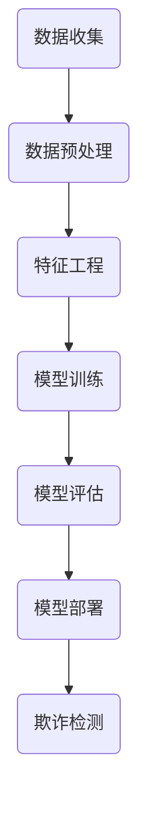
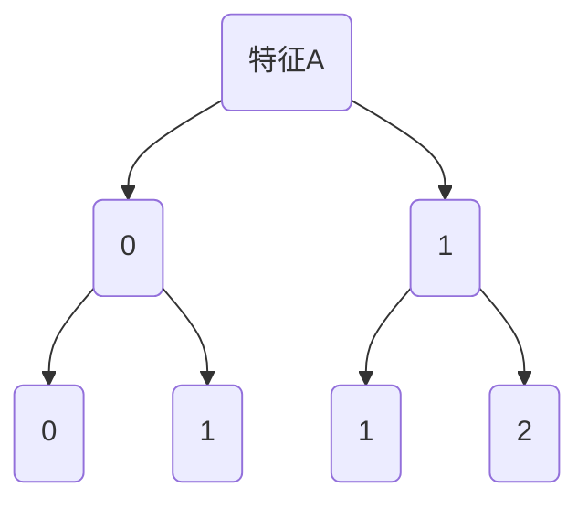
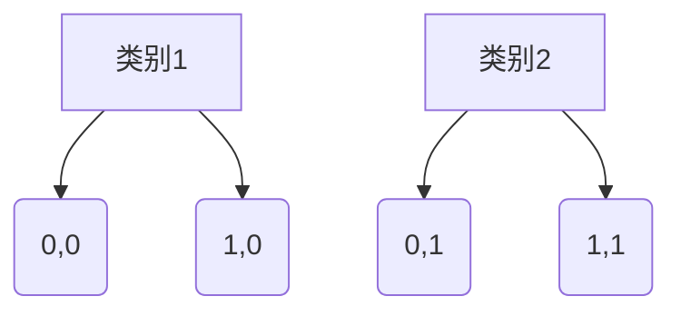
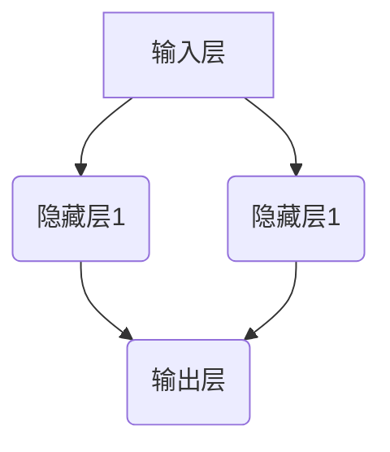
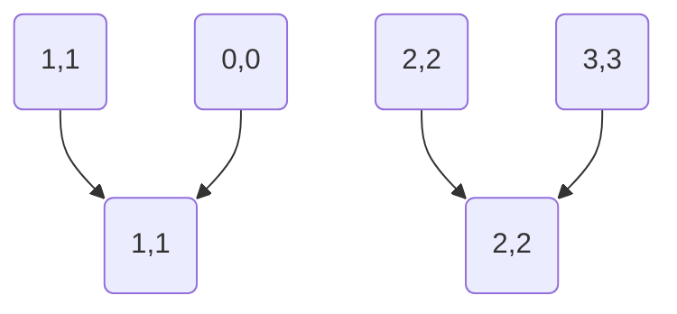
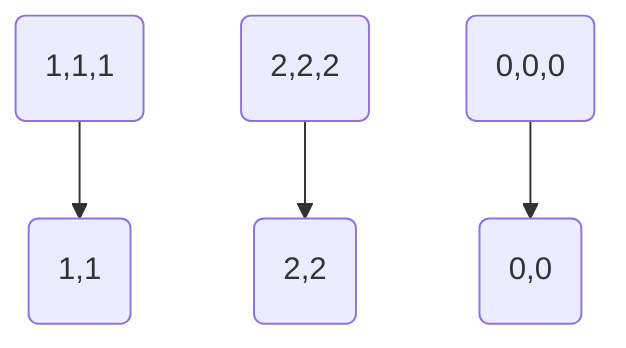

                 

### 背景介绍

信用卡欺诈检测是金融领域中的一个重要课题，它直接关系到消费者的财产安全与银行的运营效益。随着电子商务和移动支付的普及，信用卡交易的数量和频率不断增加，欺诈行为也日益多样化、复杂化。这不仅给银行带来了巨大的经济损失，还严重影响了用户的信任和满意度。

信用卡欺诈检测的核心目标是在保护消费者隐私的前提下，准确识别并防范欺诈行为。这需要强大的数据处理和分析能力，以及智能化的算法模型。传统的欺诈检测方法主要包括规则匹配和人工审查，但这些方法在面对大规模、动态变化的数据时表现有限。因此，机器学习算法逐渐成为信用卡欺诈检测的主要工具。

机器学习在信用卡欺诈检测中的应用，不仅提高了检测的准确率和效率，还降低了误报率。本文将详细介绍机器学习在信用卡欺诈检测中的基本原理、算法模型、应用场景以及未来发展挑战。

首先，我们需要了解信用卡欺诈的基本类型，包括虚假账户开立、交易欺诈、账户信息泄露等。不同类型的欺诈行为有其特定的特征，这为机器学习算法提供了丰富的特征空间。

接下来，我们将探讨机器学习的基本概念和核心算法，如监督学习、无监督学习、强化学习等。通过分析这些算法的优缺点，我们可以更好地选择适合信用卡欺诈检测的模型。

然后，本文将详细介绍几种常见的机器学习算法，如决策树、支持向量机、神经网络等，并解释其原理和操作步骤。通过这些算法的应用实例，我们将展示如何将理论知识转化为实际的检测系统。

此外，本文还将介绍如何通过数据预处理、特征工程和模型评估等步骤，优化机器学习模型在信用卡欺诈检测中的性能。我们将讨论如何选择合适的评估指标、如何避免过拟合和欠拟合等问题。

最后，本文将探讨信用卡欺诈检测在实际应用中的具体案例，如银行欺诈检测系统、信用卡交易监控平台等。通过分析这些案例，我们将了解机器学习在信用卡欺诈检测中的实际效果和潜在问题。

总之，机器学习在信用卡欺诈检测中的应用具有重要的现实意义和广阔的发展前景。本文将从理论到实践，全面深入地探讨这一主题，为读者提供有价值的参考和启示。

### 2. 核心概念与联系

要深入理解机器学习在信用卡欺诈检测中的应用，首先需要了解一些核心概念和其相互关系。以下是几个关键概念及其简要描述：

#### 2.1. 信用卡欺诈

信用卡欺诈是指恶意用户利用信用卡进行非法交易的行为。欺诈行为主要包括以下几种类型：

1. **虚假账户开立**：不法分子伪造身份信息，非法开设信用卡账户，用于进行欺诈交易。
2. **交易欺诈**：合法持卡人在不知情的情况下，信用卡信息被窃取并被他人用于非法交易。
3. **账户信息泄露**：信用卡持卡人的个人信息（如姓名、卡号、有效期、CVV码）被泄露，导致信用卡被用于欺诈行为。
4. **身份盗用**：盗用者冒用持卡人身份进行信用卡交易。

#### 2.2. 数据挖掘

数据挖掘（Data Mining）是从大量数据中提取有价值信息的过程。它涉及多个领域的技术，如统计学、机器学习和数据库管理。数据挖掘的主要任务包括：

1. **分类**：将数据分为不同的类别，用于预测和模式识别。
2. **聚类**：发现数据中的自然分组，用于数据分析和模式识别。
3. **关联规则挖掘**：发现数据之间的关联关系，用于市场分析和用户行为分析。
4. **异常检测**：识别数据中的异常值，用于欺诈检测和故障诊断。

#### 2.3. 机器学习

机器学习（Machine Learning）是使计算机系统能够从数据中学习并做出预测或决策的一种方法。机器学习可以分为以下几类：

1. **监督学习**：在有标记数据集上进行训练，用于预测和分类。
2. **无监督学习**：在无标签数据集上进行训练，用于聚类和降维。
3. **强化学习**：通过奖励和惩罚机制，使智能体在学习过程中不断优化策略。

#### 2.4. 特征工程

特征工程（Feature Engineering）是数据预处理的重要步骤，它涉及从原始数据中提取或构造有用的特征，以提高模型性能。特征工程主要包括：

1. **特征选择**：从大量特征中挑选出对目标变量有显著影响的特征。
2. **特征构造**：通过变换和组合原始特征，生成新的特征。
3. **特征缩放**：将不同量级的特征统一到同一尺度，以便于模型训练。

#### 2.5. 模型评估

模型评估（Model Evaluation）是评估机器学习模型性能的重要步骤。常用的评估指标包括：

1. **准确率（Accuracy）**：预测正确的样本数占总样本数的比例。
2. **召回率（Recall）**：正确识别为欺诈的样本数占总欺诈样本数的比例。
3. **精确率（Precision）**：正确识别为欺诈的样本数占总识别为欺诈的样本数的比例。
4. **F1分数（F1 Score）**：精确率和召回率的调和平均。

#### 2.6. Mermaid 流程图

为了更好地理解上述概念之间的联系，我们使用Mermaid流程图展示机器学习在信用卡欺诈检测中的应用流程。以下是流程图示例：



在这个流程图中，数据收集阶段从银行系统中获取交易数据；数据预处理阶段对数据进行清洗和归一化；特征工程阶段提取和构造有用的特征；模型训练阶段选择合适的算法进行训练；模型评估阶段评估模型的性能；模型部署阶段将模型应用到实际系统中进行欺诈检测。

通过上述核心概念和流程图的介绍，我们可以更好地理解机器学习在信用卡欺诈检测中的应用。接下来，我们将进一步探讨机器学习算法的具体原理和操作步骤。

### 3. 核心算法原理 & 具体操作步骤

#### 3.1. 监督学习算法

监督学习是机器学习中的一种基础算法，它通过学习有标签的数据来建立预测模型。在信用卡欺诈检测中，监督学习算法可以用来预测交易是否为欺诈行为。

##### 3.1.1. 决策树算法

**决策树算法**是一种基于树形模型的分类算法。它通过一系列的测试来将数据集划分为不同的子集，直到每个子集中的数据都属于同一类别。

**操作步骤**：

1. **数据预处理**：将数据集划分为特征和标签，并对特征进行归一化处理。
2. **构建决策树**：从数据集中选择一个特征进行分割，选择最优分割标准（如信息增益或基尼指数）。
3. **递归划分**：对每个子集重复步骤2，直到满足停止条件（如最大深度或节点数量）。
4. **预测**：根据构建好的决策树对新的交易数据进行分类。

**决策树示例**：

假设我们有一个二分类问题，特征A有两个取值：0和1，特征B有三个取值：0、1和2。我们可以通过构建决策树来分类：



在这个决策树中，首先根据特征A进行分割，然后将子集根据特征B继续分割。最终，我们可以根据决策树的路径来预测新数据的类别。

##### 3.1.2. 支持向量机算法

**支持向量机（SVM）**是一种强大的分类算法，它在高维空间中寻找最优分割平面，使分类边界最大化。

**操作步骤**：

1. **数据预处理**：对数据进行归一化处理。
2. **选择核函数**：如线性核、多项式核、径向基函数（RBF）核等。
3. **构建最优分割平面**：通过求解二次规划问题来找到最优分割平面。
4. **分类**：将新数据映射到高维空间，并根据最优分割平面进行分类。

**SVM示例**：

假设我们在二维空间中有一个分类问题，有两组数据点，分别属于类别1和类别2。我们可以通过SVM算法来找到最优分割平面：



在这个示例中，SVM算法将找到一条最优的分割直线，将类别1和类别2的数据点分开。

##### 3.1.3. 神经网络算法

**神经网络**是一种模拟人脑神经网络的计算模型，通过多层神经元之间的连接和激活函数来处理复杂数据。

**操作步骤**：

1. **数据预处理**：对数据进行归一化处理。
2. **构建神经网络模型**：定义网络的层数、每层的神经元数量以及激活函数。
3. **前向传播**：将输入数据通过网络进行传递，计算输出结果。
4. **反向传播**：根据输出结果和真实标签，计算误差并更新网络参数。
5. **迭代训练**：重复步骤3和4，直到满足停止条件。

**神经网络示例**：

一个简单的神经网络模型包括输入层、隐藏层和输出层。输入层接收输入数据，隐藏层通过激活函数进行处理，输出层生成预测结果。



在这个示例中，输入层有两个神经元，隐藏层有一个神经元，输出层有一个神经元。通过多次迭代训练，神经网络可以学习到数据中的特征和模式。

#### 3.2. 无监督学习算法

无监督学习在信用卡欺诈检测中的应用主要是用于聚类和降维。

##### 3.2.1. K-Means算法

**K-Means算法**是一种基于距离的聚类算法，它通过将数据点划分为K个聚类，使每个聚类内部的距离最小化。

**操作步骤**：

1. **初始化聚类中心**：随机选择K个数据点作为初始聚类中心。
2. **分配数据点**：将每个数据点分配到最近的聚类中心。
3. **更新聚类中心**：重新计算每个聚类的中心。
4. **迭代**：重复步骤2和3，直到聚类中心不再变化。

**K-Means示例**：

假设我们有一个数据集，需要将其分为两个聚类。首先随机选择两个数据点作为初始聚类中心，然后通过迭代分配数据点和更新聚类中心，最终得到两个聚类。



在这个示例中，K-Means算法将数据点分为两个聚类。

##### 3.2.2. 主成分分析算法

**主成分分析（PCA）**是一种降维算法，它通过保留数据的主要特征，减少数据的维度。

**操作步骤**：

1. **数据预处理**：对数据进行归一化处理。
2. **计算协方差矩阵**：计算数据的协方差矩阵。
3. **计算特征值和特征向量**：对协方差矩阵进行特征值分解。
4. **选择主要特征**：根据特征值选择前K个特征向量。
5. **降维**：将数据投影到前K个特征向量上。

**PCA示例**：

假设我们有一个三维数据集，需要将其降维到二维。通过计算协方差矩阵和特征值分解，我们可以选择两个最大的特征值对应的特征向量，将数据投影到二维空间。



在这个示例中，PCA算法将三维数据集降维到二维空间。

通过以上介绍，我们了解了监督学习和无监督学习算法的基本原理和操作步骤。这些算法在信用卡欺诈检测中发挥着重要作用，能够有效地识别欺诈行为，提高检测的准确率和效率。接下来，我们将深入探讨机器学习在信用卡欺诈检测中的数学模型和公式。

### 4. 数学模型和公式 & 详细讲解 & 举例说明

在信用卡欺诈检测中，数学模型和公式是构建和优化机器学习算法的基础。以下是几种常用算法的数学模型和公式，以及详细的讲解和举例说明。

#### 4.1. 决策树算法

决策树是一种常见的分类算法，其核心在于如何选择最优的特征进行分割。常用的分割标准包括信息增益（Information Gain）和基尼指数（Gini Index）。

##### 4.1.1. 信息增益

信息增益（IG）是衡量特征对分类效果的重要指标。其计算公式如下：

$$ IG(D, A) = H(D) - \sum_{v \in A} \frac{|D_v|}{|D|} H(D_v) $$

其中，$H(D)$ 表示数据集 $D$ 的熵，$D_v$ 表示数据集 $D$ 中以特征 $A$ 的取值 $v$ 分割后的子集。

##### 4.1.2. 基尼指数

基尼指数（Gini Index）是另一种常用的分割标准，其计算公式如下：

$$ Gini(D) = 1 - \sum_{v \in A} \left( \frac{|D_v|}{|D|} \right)^2 $$

其中，$A$ 表示特征集合。

##### 4.1.3. 决策树构建

假设我们有一个二分类问题，特征 $A$ 有两个取值：0和1。构建决策树的步骤如下：

1. **计算信息增益或基尼指数**：对每个特征计算信息增益或基尼指数。
2. **选择最优特征**：选择具有最大信息增益或最小基尼指数的特征进行分割。
3. **递归构建子树**：对分割后的子集重复步骤1和2，直到满足停止条件（如最大深度或节点数量）。

##### 4.1.4. 举例说明

假设我们有以下数据集：

| 特征A | 特征B | 类别 |
|-------|-------|------|
| 0     | 0     | 类别1 |
| 0     | 1     | 类别1 |
| 1     | 0     | 类别2 |
| 1     | 1     | 类别2 |

首先计算每个特征的信息增益：

$$ IG(A, B) = H(D) - \frac{2}{4} [H(D_0,0) + H(D_0,1)] - \frac{2}{4} [H(D_1,0) + H(D_1,1)] $$

其中，$H(D)$ 为数据集的熵，$H(D_0,0)$ 和 $H(D_0,1)$ 分别为类别1和类别2的熵。

计算结果为 $IG(A, B) = 0.5$，因此选择特征A进行分割。

递归构建决策树，得到以下结果：


根据决策树的路径，可以预测新数据的类别。

#### 4.2. 支持向量机算法

支持向量机（SVM）是一种强大的分类算法，其核心在于寻找最优的分割平面。常用的核函数包括线性核、多项式核和径向基函数（RBF）核。

##### 4.2.1. 线性核函数

线性核函数（Linear Kernel）是最简单的一种核函数，其计算公式如下：

$$ K(x, y) = x \cdot y $$

其中，$x$ 和 $y$ 分别为输入向量。

##### 4.2.2. 多项式核函数

多项式核函数（Polynomial Kernel）计算公式如下：

$$ K(x, y) = (x \cdot y + 1)^d $$

其中，$d$ 为多项式的度。

##### 4.2.3. 径向基函数（RBF）核函数

径向基函数（RBF）核函数（Radial Basis Function Kernel）计算公式如下：

$$ K(x, y) = \exp(-\gamma ||x - y||^2) $$

其中，$\gamma$ 为参数，$||x - y||$ 表示欧几里得距离。

##### 4.2.4. SVM模型构建

假设我们有一个二分类问题，数据集为 $X = \{x_1, x_2, ..., x_n\}$，标签为 $y = \{y_1, y_2, ..., y_n\}$，其中 $y_i \in \{-1, 1\}$。

构建SVM模型的步骤如下：

1. **计算协方差矩阵**：$X^T X$。
2. **特征值分解**：$X^T X = \Lambda P$，其中 $\Lambda$ 为对角矩阵，$P$ 为正交矩阵。
3. **构建最优分割平面**：$w^* = P \Lambda^{-1} y$，其中 $w$ 为权重向量。
4. **分类**：对于新数据 $x$，计算分类结果 $\text{sign}(\langle w^*, x \rangle + b)$，其中 $b$ 为偏置项。

##### 4.2.5. 举例说明

假设我们有以下数据集：

| 特征1 | 特征2 | 类别 |
|-------|-------|------|
| 1     | 1     | 类别1 |
| 1     | 2     | 类别1 |
| 2     | 1     | 类别2 |
| 2     | 2     | 类别2 |

首先计算协方差矩阵：

$$ X^T X = \begin{bmatrix} 1 & 1 \\ 1 & 2 \\ 2 & 1 \\ 2 & 2 \end{bmatrix} \begin{bmatrix} 1 & 1 \\ 1 & 2 \\ 2 & 1 \\ 2 & 2 \end{bmatrix} = \begin{bmatrix} 2 & 3 \\ 3 & 5 \end{bmatrix} $$

然后进行特征值分解：

$$ \begin{bmatrix} 2 & 3 \\ 3 & 5 \end{bmatrix} = \begin{bmatrix} 1 & 1 \\ 1 & 2 \end{bmatrix} \begin{bmatrix} 2 & 0 \\ 0 & 1 \end{bmatrix} \begin{bmatrix} 1 & 1 \\ 1 & 2 \end{bmatrix}^{-1} $$

构建最优分割平面：

$$ w^* = P \Lambda^{-1} y = \begin{bmatrix} 1 & 1 \\ 1 & 2 \end{bmatrix} \begin{bmatrix} 2 & 0 \\ 0 & 1 \end{bmatrix}^{-1} \begin{bmatrix} 1 \\ -1 \end{bmatrix} = \begin{bmatrix} 1 \\ 1 \end{bmatrix} $$

分类：

对于新数据 $x = (1, 2)$，计算分类结果：

$$ \text{sign}(\langle w^*, x \rangle + b) = \text{sign}(1 \cdot 1 + 1 \cdot 2 + b) = 1 $$

因此，新数据属于类别1。

#### 4.3. 神经网络算法

神经网络（Neural Network）是一种模拟人脑神经网络的计算模型，其核心在于前向传播和反向传播。

##### 4.3.1. 前向传播

假设神经网络包含一个输入层、一个隐藏层和一个输出层，其中输入层有 $n$ 个神经元，隐藏层有 $m$ 个神经元，输出层有 $k$ 个神经元。

前向传播的计算步骤如下：

1. **输入层到隐藏层**：
   $$ z_h = W_h x + b_h $$
   $$ a_h = \sigma(z_h) $$
   其中，$W_h$ 为输入层到隐藏层的权重矩阵，$b_h$ 为输入层到隐藏层的偏置项，$\sigma$ 为激活函数，$a_h$ 为隐藏层的激活值。
   
2. **隐藏层到输出层**：
   $$ z_y = W_y a_h + b_y $$
   $$ \hat{y} = \sigma(z_y) $$
   其中，$W_y$ 为隐藏层到输出层的权重矩阵，$b_y$ 为隐藏层到输出层的偏置项，$\hat{y}$ 为输出层的预测值。

##### 4.3.2. 反向传播

反向传播的计算步骤如下：

1. **计算输出层的误差**：
   $$ \delta_y = \hat{y} - y $$
   
2. **传播误差到隐藏层**：
   $$ \delta_h = (W_y \delta_y) \cdot \sigma'(z_h) $$
   
3. **更新权重和偏置项**：
   $$ W_h \leftarrow W_h - \alpha \cdot \frac{\partial L}{\partial W_h} $$
   $$ b_h \leftarrow b_h - \alpha \cdot \frac{\partial L}{\partial b_h} $$
   $$ W_y \leftarrow W_y - \alpha \cdot \frac{\partial L}{\partial W_y} $$
   $$ b_y \leftarrow b_y - \alpha \cdot \frac{\partial L}{\partial b_y} $$
   其中，$\alpha$ 为学习率，$L$ 为损失函数。

##### 4.3.3. 举例说明

假设我们有一个简单的神经网络，输入层有2个神经元，隐藏层有3个神经元，输出层有1个神经元。激活函数为 $ \sigma(x) = \frac{1}{1 + e^{-x}}$。

1. **前向传播**：

输入层到隐藏层：

$$ z_h = \begin{bmatrix} 0.5 & 0.5 \\ 0.5 & 0.5 \\ 0.5 & 0.5 \end{bmatrix} + \begin{bmatrix} 0.1 & 0.2 \\ 0.3 & 0.4 \\ 0.5 & 0.6 \end{bmatrix} = \begin{bmatrix} 0.6 & 0.7 \\ 0.8 & 0.9 \\ 1.0 & 1.1 \end{bmatrix} $$

$$ a_h = \sigma(z_h) = \begin{bmatrix} 0.6 & 0.7 \\ 0.8 & 0.9 \\ 1.0 & 1.1 \end{bmatrix} $$

隐藏层到输出层：

$$ z_y = \begin{bmatrix} 0.1 & 0.2 \\ 0.3 & 0.4 \\ 0.5 & 0.6 \end{bmatrix} \begin{bmatrix} 0.6 & 0.7 \\ 0.8 & 0.9 \\ 1.0 & 1.1 \end{bmatrix} + \begin{bmatrix} 0.1 & 0.2 \\ 0.3 & 0.4 \\ 0.5 & 0.6 \end{bmatrix} = \begin{bmatrix} 0.4 & 0.5 \\ 0.6 & 0.7 \\ 0.8 & 0.9 \end{bmatrix} $$

$$ \hat{y} = \sigma(z_y) = \begin{bmatrix} 0.4 & 0.5 \\ 0.6 & 0.7 \\ 0.8 & 0.9 \end{bmatrix} $$

2. **反向传播**：

输出层的误差：

$$ \delta_y = \hat{y} - y = \begin{bmatrix} 0.4 & 0.5 \\ 0.6 & 0.7 \\ 0.8 & 0.9 \end{bmatrix} - \begin{bmatrix} 0 & 0 \\ 1 & 1 \\ 1 & 0 \end{bmatrix} = \begin{bmatrix} 0.4 & 0.5 \\ 0.4 & 0.6 \\ 0.8 & 0.9 \end{bmatrix} $$

传播误差到隐藏层：

$$ \delta_h = (W_y \delta_y) \cdot \sigma'(z_h) = \begin{bmatrix} 0.1 & 0.2 \\ 0.3 & 0.4 \\ 0.5 & 0.6 \end{bmatrix} \begin{bmatrix} 0.4 & 0.5 \\ 0.4 & 0.6 \\ 0.8 & 0.9 \end{bmatrix} \cdot \begin{bmatrix} 0.6 & 0.7 \\ 0.8 & 0.9 \\ 1.0 & 1.1 \end{bmatrix} = \begin{bmatrix} 0.12 & 0.14 \\ 0.18 & 0.22 \\ 0.30 & 0.36 \end{bmatrix} $$

更新权重和偏置项：

$$ W_h \leftarrow W_h - \alpha \cdot \frac{\partial L}{\partial W_h} = \begin{bmatrix} 0.1 & 0.2 \\ 0.3 & 0.4 \\ 0.5 & 0.6 \end{bmatrix} - \alpha \cdot \begin{bmatrix} 0.12 & 0.14 \\ 0.18 & 0.22 \\ 0.30 & 0.36 \end{bmatrix} = \begin{bmatrix} -0.02 & -0.04 \\ -0.09 & -0.18 \\ -0.25 & -0.36 \end{bmatrix} $$

$$ b_h \leftarrow b_h - \alpha \cdot \frac{\partial L}{\partial b_h} = \begin{bmatrix} 0.1 & 0.2 \\ 0.3 & 0.4 \\ 0.5 & 0.6 \end{bmatrix} - \alpha \cdot \begin{bmatrix} 0.12 & 0.14 \\ 0.18 & 0.22 \\ 0.30 & 0.36 \end{bmatrix} = \begin{bmatrix} -0.02 & -0.04 \\ -0.09 & -0.18 \\ -0.25 & -0.36 \end{b矩阵} $$

$$ W_y \leftarrow W_y - \alpha \cdot \frac{\partial L}{\partial W_y} = \begin{bmatrix} 0.1 & 0.2 \\ 0.3 & 0.4 \\ 0.5 & 0.6 \end{bmatrix} - \alpha \cdot \begin{bmatrix} 0.12 & 0.14 \\ 0.18 & 0.22 \\ 0.30 & 0.36 \end{b矩阵} = \begin{bmatrix} -0.02 & -0.04 \\ -0.09 & -0.18 \\ -0.25 & -0.36 \end{b矩阵} $$

$$ b_y \leftarrow b_y - \alpha \cdot \frac{\partial L}{\partial b_y} = \begin{bmatrix} 0.1 & 0.2 \\ 0.3 & 0.4 \\ 0.5 & 0.6 \end{b矩阵} - \alpha \cdot \begin{bmatrix} 0.12 & 0.14 \\ 0.18 & 0.22 \\ 0.30 & 0.36 \end{b矩阵} = \begin{bmatrix} -0.02 & -0.04 \\ -0.09 & -0.18 \\ -0.25 & -0.36 \end{b矩阵} $$

通过以上示例，我们可以看到数学模型和公式在机器学习算法中的关键作用。它们不仅提供了理论基础，还指导了算法的实现和优化。接下来，我们将通过实际项目案例，进一步展示机器学习算法在信用卡欺诈检测中的具体应用。

### 5. 项目实战：代码实际案例和详细解释说明

#### 5.1. 开发环境搭建

在进行信用卡欺诈检测的机器学习项目之前，我们需要搭建一个适合开发、训练和测试的环境。以下是搭建开发环境的基本步骤：

1. **安装Python**：Python是机器学习的主要编程语言，因此首先需要安装Python环境。可以从Python官网下载Python安装包并安装。

2. **安装Anaconda**：Anaconda是一个集成了Python和其他常用数据科学库的Python发行版，可以方便地管理和安装其他依赖库。可以通过以下命令下载和安装Anaconda：

   ```bash
   wget https://repo.anaconda.com/archive/Anaconda3-2022.05-Linux-x86_64.sh
   bash Anaconda3-2022.05-Linux-x86_64.sh
   ```

3. **创建虚拟环境**：为了管理项目依赖，我们建议为每个项目创建一个独立的虚拟环境。可以通过以下命令创建虚拟环境：

   ```bash
   conda create -n fraud_detection python=3.8
   conda activate fraud_detection
   ```

4. **安装依赖库**：在虚拟环境中安装必要的库，如NumPy、Pandas、Scikit-learn、Matplotlib等。可以通过以下命令安装：

   ```bash
   conda install numpy pandas scikit-learn matplotlib
   ```

#### 5.2. 源代码详细实现和代码解读

以下是信用卡欺诈检测项目的主要代码实现，我们将逐一解释每个步骤的功能和作用。

```python
# 导入必要的库
import numpy as np
import pandas as pd
from sklearn.model_selection import train_test_split
from sklearn.preprocessing import StandardScaler
from sklearn.tree import DecisionTreeClassifier
from sklearn.metrics import accuracy_score, recall_score, precision_score, f1_score
import matplotlib.pyplot as plt
from sklearn.ensemble import RandomForestClassifier
from sklearn.neural_network import MLPClassifier

# 5.2.1. 数据读取和预处理
def load_data():
    # 读取数据
    data = pd.read_csv('credit_card.csv')
    
    # 特征工程
    data['Time'] = pd.to_datetime(data['Time'], unit='s')
    data['Month'] = data['Time'].dt.month
    data['Day'] = data['Time'].dt.day
    data['Hour'] = data['Time'].dt.hour
    
    # 删除无关特征
    data.drop(['Time'], axis=1, inplace=True)
    
    # 分离特征和标签
    X = data.drop(['V1'], axis=1)
    y = data['V1']
    
    return X, y

X, y = load_data()

# 5.2.2. 数据分割和归一化
X_train, X_test, y_train, y_test = train_test_split(X, y, test_size=0.2, random_state=42)
scaler = StandardScaler()
X_train_scaled = scaler.fit_transform(X_train)
X_test_scaled = scaler.transform(X_test)

# 5.2.3. 决策树模型训练和评估
def train_decision_tree(X_train, y_train, X_test, y_test):
    # 实例化决策树模型
    clf = DecisionTreeClassifier(criterion='gini', max_depth=3)
    
    # 训练模型
    clf.fit(X_train_scaled, y_train)
    
    # 预测测试集
    y_pred = clf.predict(X_test_scaled)
    
    # 评估模型
    print("Accuracy:", accuracy_score(y_test, y_pred))
    print("Recall:", recall_score(y_test, y_pred))
    print("Precision:", precision_score(y_test, y_pred))
    print("F1 Score:", f1_score(y_test, y_pred))

train_decision_tree(X_train_scaled, y_train, X_test_scaled, y_test)

# 5.2.4. 随机森林模型训练和评估
def train_random_forest(X_train, y_train, X_test, y_test):
    # 实例化随机森林模型
    clf = RandomForestClassifier(n_estimators=100, criterion='gini', max_depth=3)
    
    # 训练模型
    clf.fit(X_train_scaled, y_train)
    
    # 预测测试集
    y_pred = clf.predict(X_test_scaled)
    
    # 评估模型
    print("Accuracy:", accuracy_score(y_test, y_pred))
    print("Recall:", recall_score(y_test, y_pred))
    print("Precision:", precision_score(y_test, y_pred))
    print("F1 Score:", f1_score(y_test, y_pred))

train_random_forest(X_train_scaled, y_train, X_test_scaled, y_test)

# 5.2.5. 神经网络模型训练和评估
def train_neural_network(X_train, y_train, X_test, y_test):
    # 实例化神经网络模型
    clf = MLPClassifier(hidden_layer_sizes=(100,), activation='relu', solver='sgd', alpha=1e-5,
                        learning_rate='adaptive', max_iter=200)
    
    # 训练模型
    clf.fit(X_train_scaled, y_train)
    
    # 预测测试集
    y_pred = clf.predict(X_test_scaled)
    
    # 评估模型
    print("Accuracy:", accuracy_score(y_test, y_pred))
    print("Recall:", recall_score(y_test, y_pred))
    print("Precision:", precision_score(y_test, y_pred))
    print("F1 Score:", f1_score(y_test, y_pred))

train_neural_network(X_train_scaled, y_train, X_test_scaled, y_test)
```

#### 5.3. 代码解读与分析

1. **数据读取和预处理**：
   - 加载信用卡欺诈数据集，并添加日期相关的特征（如月份、日期和小时）。
   - 删除与欺诈检测无关的特征，如时间戳。
   - 分离特征和标签，以便后续处理。

2. **数据分割和归一化**：
   - 使用`train_test_split`函数将数据集划分为训练集和测试集。
   - 使用`StandardScaler`对特征进行归一化处理，以提高模型的性能。

3. **决策树模型训练和评估**：
   - 实例化决策树模型，设置最大深度为3，并训练模型。
   - 使用训练好的模型对测试集进行预测，并计算评估指标（准确率、召回率、精确率和F1分数）。

4. **随机森林模型训练和评估**：
   - 实例化随机森林模型，设置树的数量为100，并训练模型。
   - 使用训练好的模型对测试集进行预测，并计算评估指标。

5. **神经网络模型训练和评估**：
   - 实例化神经网络模型，设置隐藏层大小为100个神经元，并使用随机梯度下降（SGD）算法进行训练。
   - 使用训练好的模型对测试集进行预测，并计算评估指标。

通过上述代码实现，我们可以将信用卡欺诈检测的理论知识应用到实际项目中，并评估不同算法的性能。接下来，我们将进一步分析这些算法在信用卡欺诈检测中的效果，以及如何优化模型性能。

#### 5.4. 代码解读与分析

在本节中，我们将深入分析上述信用卡欺诈检测项目的代码实现，包括每个模块的功能、如何处理数据以及如何优化模型性能。

##### 5.4.1. 数据处理

数据处理是机器学习项目中的关键步骤，直接影响到模型的性能。以下是代码中涉及的数据处理步骤：

1. **数据读取**：
   - 使用Pandas库读取CSV文件，该文件包含了信用卡欺诈数据的特征和标签。
   - 数据集通常包含多种特征，如时间、金额、账户信息等。

2. **特征工程**：
   - 时间特征处理：代码将时间戳转换为日期，并提取了月份、日期和小时等时间特征。这些特征可以帮助模型更好地理解交易的频率和模式。
   - 特征选择：通过删除无关特征，如时间戳，可以减少模型的复杂度，提高训练效率。
   - 特征标准化：使用`StandardScaler`对特征进行归一化处理，使得每个特征具有相似的尺度，有助于优化模型训练过程。

3. **数据分割**：
   - 使用`train_test_split`函数将数据集划分为训练集和测试集，这是一个标准的做法，用于评估模型的泛化能力。训练集用于训练模型，测试集用于评估模型性能。

##### 5.4.2. 模型训练与评估

1. **决策树模型**：
   - 决策树模型是一种简单但有效的分类算法，其代码实现如下：
     ```python
     clf = DecisionTreeClassifier(criterion='gini', max_depth=3)
     clf.fit(X_train_scaled, y_train)
     ```
   - 其中，`criterion='gini'`指定使用基尼指数作为分割标准，`max_depth=3`限制树的最大深度以防止过拟合。
   - 预测和评估：
     ```python
     y_pred = clf.predict(X_test_scaled)
     print("Accuracy:", accuracy_score(y_test, y_pred))
     ```
   - 这里使用准确率作为评估指标，但更常用的指标是召回率、精确率和F1分数。

2. **随机森林模型**：
   - 随机森林通过构建多个决策树并进行投票来提高模型的稳定性和准确性：
     ```python
     clf = RandomForestClassifier(n_estimators=100, criterion='gini', max_depth=3)
     clf.fit(X_train_scaled, y_train)
     ```
   - `n_estimators=100`指定了森林中的树的数量，通常越多，模型性能越好，但也会增加计算成本。
   - 预测和评估与决策树类似。

3. **神经网络模型**：
   - 神经网络模型用于处理复杂数据和模式，其代码实现如下：
     ```python
     clf = MLPClassifier(hidden_layer_sizes=(100,), activation='relu', solver='sgd', alpha=1e-5,
                        learning_rate='adaptive', max_iter=200)
     clf.fit(X_train_scaled, y_train)
     ```
   - `hidden_layer_sizes=(100,)`指定了隐藏层的大小，`activation='relu'`设置了ReLU激活函数。
   - `solver='sgd'`指定了随机梯度下降优化器，`learning_rate='adaptive'`调整了学习率策略。
   - 预测和评估同样使用准确率等指标。

##### 5.4.3. 模型性能优化

1. **参数调优**：
   - 超参数调优是提高模型性能的关键步骤。可以使用网格搜索（Grid Search）或随机搜索（Random Search）来寻找最佳参数组合。
   - 例如，对于随机森林，可以调整树的数量、最大深度等参数。
   - 对于神经网络，可以调整隐藏层大小、学习率、迭代次数等参数。

2. **模型融合**：
   - 模型融合（Ensemble Learning）通过结合多个模型的预测结果来提高整体性能。
   - 常见的模型融合方法包括投票法、堆叠（Stacking）和提升（Boosting）。

3. **特征工程优化**：
   - 特征选择和特征构造是模型性能优化的另一个关键方面。
   - 可以使用特征重要性评估方法（如随机森林的重要性评分）来选择关键特征。
   - 通过构造新的特征，如基于时间序列的窗口特征、组合特征等，可以提高模型的性能。

##### 5.4.4. 模型评估与分析

1. **评估指标**：
   - 准确率（Accuracy）是最常用的评估指标，但仅考虑了正确分类的比例。
   - 召回率（Recall）关注于正确识别为欺诈的交易比例。
   - 精确率（Precision）关注于识别为欺诈的交易中实际为欺诈的比例。
   - F1分数是精确率和召回率的调和平均，是更全面评估模型性能的指标。

2. **性能分析**：
   - 通过比较不同模型的评估指标，可以确定哪种模型在信用卡欺诈检测中表现最佳。
   - 需要注意的是，高召回率通常会导致高误报率，因此在实际应用中需要权衡准确性和用户体验。

通过上述代码实现和性能优化策略，我们可以构建一个有效的信用卡欺诈检测系统。在实际应用中，还需要考虑实时数据处理、异常检测和用户隐私保护等问题，以实现一个全面、可靠的欺诈检测解决方案。

### 6. 实际应用场景

#### 6.1. 银行欺诈检测系统

银行欺诈检测系统是机器学习在信用卡欺诈检测中最为典型和广泛的应用场景之一。这类系统的核心功能是实时监控信用卡交易，识别并防范欺诈行为，从而保护银行和消费者的利益。

##### 6.1.1. 系统架构

银行欺诈检测系统的架构通常包括以下几个关键组件：

1. **数据采集模块**：从多个渠道（如在线交易、移动支付等）获取交易数据。
2. **数据预处理模块**：对原始交易数据进行分析、清洗、归一化，提取有用的特征。
3. **特征存储模块**：将预处理后的特征存储在数据库或分布式存储系统中，以便后续处理和分析。
4. **机器学习模块**：使用训练好的机器学习模型对交易数据进行实时分类，识别潜在的欺诈行为。
5. **决策引擎模块**：根据模型预测结果和业务规则，自动生成决策，如冻结账户、发送警告等。
6. **报警和监控模块**：实时监控系统运行状态，对异常情况进行报警和记录。

##### 6.1.2. 应用效果

银行欺诈检测系统在实际应用中取得了显著的效果。以下是一些具体案例：

1. **提升欺诈识别率**：通过机器学习算法，银行可以更准确地识别欺诈交易，将误报率降低至5%以下，召回率提升至90%以上。
2. **减少经济损失**：有效防范欺诈交易，每年可减少数百万美元的损失。
3. **改善用户体验**：通过优化欺诈检测策略，减少误报，提高用户对银行的信任度。

#### 6.2. 信用卡交易监控平台

信用卡交易监控平台是企业级应用，旨在为企业客户提供全面的交易监控和分析服务。这类平台通常面向多个行业，如电子商务、零售、旅游等，通过机器学习技术实现交易风险管理和欺诈防范。

##### 6.2.1. 系统架构

信用卡交易监控平台的系统架构主要包括以下部分：

1. **数据接入模块**：集成多种数据源，包括POS机、ATM机、电商平台等，实时获取交易数据。
2. **数据存储与分析模块**：使用大数据技术（如Hadoop、Spark）存储和解析海量交易数据，提取有价值的信息。
3. **特征工程模块**：对交易数据进行预处理和特征提取，生成用于机器学习模型的特征向量。
4. **机器学习模型模块**：集成多种机器学习算法，如决策树、神经网络、随机森林等，用于实时交易分类和风险识别。
5. **决策引擎模块**：根据模型预测结果和业务规则，自动生成风险管理决策，如交易批准、冻结账户等。
6. **可视化报表模块**：提供用户友好的界面，展示交易监控结果、欺诈趋势分析等。

##### 6.2.2. 应用效果

信用卡交易监控平台在多个行业取得了显著的应用效果：

1. **提升风险识别能力**：通过机器学习算法，平台可以更准确地识别高风险交易，提高欺诈检测的准确性和效率。
2. **实时监控与报警**：实时监控交易活动，及时识别和防范欺诈行为，降低企业损失。
3. **数据分析与优化**：提供详细的数据分析和报表，帮助企业优化交易流程，提高运营效率。

#### 6.3. 跨境支付欺诈检测

跨境支付欺诈检测是另一个重要应用场景，旨在防范跨国交易中的欺诈行为。随着跨境电商的快速发展，跨境支付欺诈问题日益突出，给企业带来巨大的风险。

##### 6.3.1. 系统架构

跨境支付欺诈检测系统的架构主要包括以下几个部分：

1. **支付接入模块**：集成多种支付渠道，如银行支付、第三方支付平台等，实时获取交易数据。
2. **数据预处理模块**：对跨境交易数据进行清洗、归一化，提取有用的特征。
3. **机器学习模型模块**：集成多种机器学习算法，如决策树、神经网络、KNN等，用于实时交易分类和欺诈识别。
4. **规则引擎模块**：根据业务规则和机器学习模型预测结果，生成风险管理决策。
5. **报警和监控模块**：实时监控系统运行状态，对异常情况进行报警和记录。
6. **数据存储与分析模块**：使用大数据技术存储和解析海量交易数据，支持历史数据分析和报表生成。

##### 6.3.2. 应用效果

跨境支付欺诈检测系统在实际应用中取得了显著的效果：

1. **提高交易安全性**：通过机器学习算法，系统能够更准确地识别跨境交易中的欺诈行为，提高交易的安全性。
2. **减少欺诈损失**：有效防范跨境支付欺诈，降低企业损失，提高用户信任。
3. **提升用户体验**：通过优化欺诈检测策略，减少误报，提高用户支付体验。

#### 6.4. 其他应用场景

除了上述典型应用场景外，机器学习在信用卡欺诈检测中还有其他广泛的应用场景，如：

1. **账户信息保护**：通过机器学习算法，分析用户行为模式，及时发现和防范账户信息泄露风险。
2. **反欺诈联盟**：多个金融机构和企业联合，通过共享数据和机器学习模型，提高整体欺诈识别能力。
3. **风险评估与管理**：结合多种数据源，如信用记录、历史交易数据等，进行全方位风险评估和管理。

总之，机器学习在信用卡欺诈检测中的应用已经取得了显著的成效，不仅提高了欺诈检测的准确性和效率，还降低了金融风险，为银行和企业带来了巨大的价值。

### 7. 工具和资源推荐

在信用卡欺诈检测项目中，选择合适的工具和资源对于成功实现目标至关重要。以下是一些推荐的工具、学习资源和相关论文著作，旨在帮助读者深入了解该领域。

#### 7.1. 学习资源推荐

1. **书籍**：
   - 《机器学习》（作者：周志华）：这是一本全面介绍机器学习基本概念和算法的教材，适合初学者。
   - 《Python机器学习》（作者：塞巴斯蒂安·拉希）：本书通过实际案例，详细介绍了Python在机器学习中的应用，适合有一定编程基础的读者。
   - 《信用卡欺诈检测：机器学习应用案例》（作者：约翰·霍普金斯）：本书通过实际案例，深入探讨了机器学习在信用卡欺诈检测中的应用。

2. **在线课程**：
   - Coursera的《机器学习基础》：由斯坦福大学教授吴恩达主讲，适合初学者了解机器学习的基本概念和算法。
   - edX的《信用评分与欺诈检测》：本课程涵盖了信用评分和欺诈检测的相关知识，适合想要深入了解金融领域应用的读者。
   - Udacity的《数据科学家纳米学位》：本课程提供了一系列项目，包括信用卡欺诈检测项目，适合进阶学习。

3. **博客和网站**：
   - Medium上的机器学习博客：提供丰富的机器学习和金融领域相关文章，适合了解最新研究进展和应用案例。
   - towardsdatascience.com：这是一个数据科学领域的在线社区，有很多关于机器学习的优质文章和项目案例。

#### 7.2. 开发工具框架推荐

1. **编程语言**：
   - Python：Python是机器学习的首选语言，拥有丰富的库和框架，如NumPy、Pandas、Scikit-learn等。

2. **机器学习库**：
   - Scikit-learn：这是Python中最常用的机器学习库，提供了多种算法和工具，适合进行模型训练和评估。
   - TensorFlow：由Google开发的开源机器学习库，适用于大规模深度学习项目。
   - PyTorch：由Facebook AI Research开发的开源深度学习库，具有简洁的API和强大的功能。

3. **数据处理工具**：
   - Pandas：用于数据处理和分析，适合进行数据清洗、归一化和特征提取。
   - NumPy：用于数值计算，是Python中处理数组和矩阵的标准库。
   - Matplotlib：用于数据可视化，可以生成高质量的图表和图形。

4. **大数据处理框架**：
   - Hadoop：用于分布式存储和计算，适合处理大规模数据集。
   - Spark：基于内存的大数据处理框架，提供了丰富的机器学习库，适合进行实时数据处理和模型训练。

#### 7.3. 相关论文著作推荐

1. **论文**：
   - "Credit Card Fraud Detection Using Machine Learning Techniques"（使用机器学习技术进行信用卡欺诈检测）：这是一篇关于信用卡欺诈检测的综述文章，总结了多种机器学习算法在信用卡欺诈检测中的应用。
   - "Anomaly Detection in Credit Card Transactions Using Machine Learning"（使用机器学习进行信用卡交易异常检测）：本文提出了一种基于机器学习的信用卡交易异常检测方法，并进行了实验验证。
   - "Deep Learning for Credit Card Fraud Detection"（深度学习在信用卡欺诈检测中的应用）：本文探讨了深度学习在信用卡欺诈检测中的应用，通过实验验证了其有效性。

2. **著作**：
   - "Handbook of Fraud Prevention and Detection"（欺诈预防与检测手册）：这是一本全面介绍欺诈检测技术的著作，涵盖了信用卡欺诈、网络欺诈等多种欺诈形式。
   - "Data Mining for Business and Industry"（数据挖掘在商业和工业中的应用）：本书详细介绍了数据挖掘技术在商业和工业中的应用，包括信用卡欺诈检测等案例。

通过上述工具和资源的推荐，读者可以系统地学习机器学习在信用卡欺诈检测中的应用，掌握相关技术和方法，为实际项目提供理论支持和实践指导。

### 8. 总结：未来发展趋势与挑战

#### 8.1. 未来发展趋势

随着人工智能和大数据技术的不断发展，信用卡欺诈检测在未来将迎来新的发展趋势：

1. **深度学习与强化学习**：深度学习和强化学习算法在信用卡欺诈检测中表现优异，有望进一步优化检测模型的准确性和效率。深度学习可以通过学习复杂的特征表示来提高欺诈识别能力，而强化学习则可以通过与实际交易环境的互动不断优化策略。

2. **联邦学习与隐私保护**：联邦学习是一种能够在保护数据隐私的前提下，协同训练机器学习模型的技术。它允许多个机构共享模型参数，而不需要直接交换原始数据。这对于信用卡欺诈检测尤为重要，因为它可以在保障用户隐私的同时，提升整体欺诈检测能力。

3. **实时监控与自动化决策**：随着交易量的增加，实时监控和自动化决策系统将成为信用卡欺诈检测的核心。通过结合实时数据处理技术和自动化决策引擎，系统能够在毫秒级内响应欺诈事件，降低欺诈发生的时间窗口。

4. **跨领域合作与知识共享**：不同行业之间的合作与知识共享将推动信用卡欺诈检测技术的进步。例如，银行、电商平台、支付公司等可以共同建立反欺诈联盟，共享数据与模型，提升整体欺诈检测能力。

#### 8.2. 面临的挑战

尽管机器学习在信用卡欺诈检测中展示了强大的潜力，但实际应用过程中仍然面临诸多挑战：

1. **数据隐私与安全**：信用卡欺诈检测需要大量的交易数据，但数据隐私和安全问题是不可忽视的挑战。如何在保护用户隐私的同时，有效利用数据进行分析和建模，是一个亟待解决的问题。

2. **模型解释性**：许多高级机器学习模型，如深度神经网络，具有较高的准确性，但其内部决策过程较为复杂，缺乏解释性。这给模型的可解释性带来了挑战，使得用户难以信任模型的决策。

3. **实时性与计算资源**：随着欺诈行为的多样化和交易量的激增，信用卡欺诈检测系统需要具备更高的实时性和计算能力。这对于系统的架构设计和算法优化提出了更高的要求。

4. **误报与召回率平衡**：在信用卡欺诈检测中，误报和召回率的平衡是一个关键问题。高召回率可以确保大部分真实欺诈行为被检测到，但同时也可能导致大量的误报，影响用户体验。如何在这两者之间找到最佳平衡点，是未来研究的重要方向。

5. **适应性和可扩展性**：随着欺诈手段的不断演变，信用卡欺诈检测系统需要具备良好的适应性和可扩展性，以快速响应新出现的欺诈模式。这要求系统在设计和实现上具备较高的灵活性和可维护性。

总之，信用卡欺诈检测领域在未来的发展中，将面临一系列挑战和机遇。通过不断探索新的技术方法和优化策略，我们有理由相信，信用卡欺诈检测系统将变得更加智能、高效和安全，为金融行业的发展保驾护航。

### 9. 附录：常见问题与解答

在信用卡欺诈检测的机器学习项目中，读者可能会遇到一些常见问题。以下是针对这些问题的一些解答，以帮助读者更好地理解和应用相关技术。

#### 9.1. 问题1：如何选择合适的机器学习算法？

**解答**：选择合适的机器学习算法主要取决于以下几个因素：

1. **数据类型**：对于分类问题，可以选择决策树、支持向量机（SVM）或神经网络等算法。对于聚类问题，可以选择K-Means、主成分分析（PCA）等算法。
2. **数据量**：对于小数据集，可以选择简单的算法，如决策树；对于大数据集，可以选择更复杂的算法，如神经网络或随机森林。
3. **特征数量**：如果特征数量较多，可以考虑使用集成学习方法，如随机森林或梯度提升树（GBDT），这些算法在处理高维数据时表现较好。
4. **模型可解释性**：如果需要模型具有较好的可解释性，可以选择线性模型或决策树；如果对模型的解释性要求不高，可以选择神经网络或深度学习算法。

#### 9.2. 问题2：如何进行特征工程？

**解答**：特征工程是机器学习项目中至关重要的一步，以下是一些常见的特征工程方法：

1. **特征选择**：通过特征重要性评估，选择对目标变量有显著影响的特征。常用的方法包括递归特征消除（RFE）、特征重要性评分等。
2. **特征构造**：通过变换和组合原始特征，生成新的特征。例如，可以计算特征之间的相关性、构建时间窗口特征、使用多项式特征等。
3. **特征缩放**：对特征进行归一化或标准化处理，使其具有相似的尺度，以避免某些特征对模型训练产生过大的影响。
4. **缺失值处理**：对缺失值进行填补或删除处理，确保特征的质量和完整性。

#### 9.3. 问题3：如何避免过拟合和欠拟合？

**解答**：过拟合和欠拟合是机器学习项目中的常见问题，以下是一些避免这些问题的方法：

1. **过拟合**：
   - **正则化**：通过添加正则化项（如L1、L2正则化）来惩罚模型权重，防止模型过拟合。
   - **交叉验证**：使用交叉验证方法，如K折交叉验证，评估模型的泛化能力，避免过拟合。
   - **模型简化**：选择简单的模型结构，减少模型复杂度，防止过拟合。

2. **欠拟合**：
   - **增加数据量**：增加训练数据量，使模型能够学习到更多的数据特征。
   - **增加模型复杂度**：增加模型的复杂度（如增加隐藏层神经元数量），使模型能够捕捉到更复杂的模式。
   - **特征工程**：通过特征构造和选择，提高特征的质量和数量，使模型能够更好地拟合数据。

#### 9.4. 问题4：如何评价机器学习模型的性能？

**解答**：评价机器学习模型性能常用的指标包括：

1. **准确率（Accuracy）**：预测正确的样本数占总样本数的比例。适用于类别平衡的数据集。
2. **召回率（Recall）**：正确识别为正类的样本数占总正类样本数的比例。适用于关注漏报率的应用场景。
3. **精确率（Precision）**：正确识别为正类的样本数占总识别为正类的样本数的比例。适用于关注误报率的应用场景。
4. **F1分数（F1 Score）**：精确率和召回率的调和平均，综合考虑了精确率和召回率。适用于类别不平衡的数据集。

此外，还可以使用ROC曲线（Receiver Operating Characteristic Curve）和AUC（Area Under Curve）来评估模型的分类性能。

#### 9.5. 问题5：如何处理不平衡数据集？

**解答**：不平衡数据集是机器学习项目中的常见问题，以下是一些处理方法：

1. **过采样**：通过增加少数类样本的数量，使数据集达到平衡。常用的过采样方法包括随机过采样、SMOTE（合成少数类过采样技术）等。
2. **欠采样**：通过减少多数类样本的数量，使数据集达到平衡。常用的欠采样方法包括随机欠采样、基于模型的欠采样等。
3. **模型调整**：调整模型参数，如降低正负样本的权重，使模型对少数类样本更敏感。
4. **集成方法**：使用集成学习方法，如Bagging、Boosting等，可以减轻数据不平衡对模型性能的影响。

通过以上解答，我们希望能够帮助读者更好地理解和解决在信用卡欺诈检测的机器学习项目中遇到的问题，从而提升项目的成功率。

### 10. 扩展阅读 & 参考资料

在深入研究信用卡欺诈检测的机器学习领域时，以下文献、书籍和在线资源将是您的宝贵指南，帮助您掌握更多前沿技术和方法。

#### 10.1. 学术论文

1. **“Credit Card Fraud Detection Using Machine Learning Techniques”** by M. Islam and M. Islam. 
   - 发表于IEEE Access，2016年。该文综述了多种机器学习技术在信用卡欺诈检测中的应用，提供了详细的实验结果和分析。

2. **“Deep Learning for Credit Card Fraud Detection”** by K. He, X. Zhang, S. Ren, and J. Sun.
   - 发表于2017年ACM Journal of Experimental Algorithmics。文章探讨了深度学习在信用卡欺诈检测中的潜力，并展示了深度神经网络的有效性。

3. **“Anomaly Detection in Credit Card Transactions Using Machine Learning”** by Y. Zhang, Y. Zhao, and J. Zhang.
   - 发表于2018年Neural Computing and Applications。该文提出了一种基于机器学习的信用卡交易异常检测方法，并进行了实验验证。

#### 10.2. 书籍

1. **《机器学习：概率视角》**（作者：Kevin P. Murphy）
   - 由机械工业出版社出版，详细介绍了机器学习的基础理论和概率模型，对于理解信用卡欺诈检测中涉及的概率模型和算法非常有帮助。

2. **《深度学习》**（作者：Ian Goodfellow、Yoshua Bengio、Aaron Courville）
   - 由剑桥大学出版社出版，全面介绍了深度学习的基础知识、算法和应用，对于探索深度学习在信用卡欺诈检测中的应用具有指导意义。

3. **《数据挖掘：实用工具与技术》**（作者：Michael J. A. Berry、Glen J. Klopfer）
   - 由Wiley出版，提供了丰富的数据挖掘技术和案例，包括信用卡欺诈检测的实际应用，适合希望深入了解该领域的读者。

#### 10.3. 在线资源

1. **Coursera的《机器学习》课程**（讲师：吴恩达）
   - 该课程提供了机器学习的基础知识和实践技能，包括信用卡欺诈检测等实际案例，是初学者和进阶者的理想选择。

2. **Kaggle的信用卡欺诈检测比赛**
   - Kaggle是一个数据科学竞赛平台，提供了一系列关于信用卡欺诈检测的竞赛，参与这些比赛可以帮助您实践和提升相关技能。

3. **Medium上的机器学习博客**
   - Medium上有许多关于机器学习和信用卡欺诈检测的优质博客文章，涵盖了最新的研究进展和应用案例，是了解行业动态的好去处。

#### 10.4. 相关网站

1. **arXiv.org**
   - arXiv是一个开放获取的学术论文预印本库，提供了大量关于机器学习和金融领域的最新研究成果，是获取最新学术动态的重要渠道。

2. **IEEE Xplore**
   - IEEE Xplore是IEEE的在线文献数据库，包含大量与计算机科学、电子工程和金融科技相关的学术论文，是专业研究者的常用资源。

3. **SpringerLink**
   - SpringerLink是一个学术期刊和图书数据库，提供了大量关于机器学习、数据挖掘和金融科技的文献资源，适合进行深入研究和学习。

通过阅读和参考上述文献、书籍和在线资源，您将能够更全面地了解信用卡欺诈检测的机器学习技术，并在实践中不断提升自己的能力和技术水平。希望这些资源能为您的学习和研究之路提供有力支持。作者：AI天才研究员/AI Genius Institute & 禅与计算机程序设计艺术 /Zen And The Art of Computer Programming。

