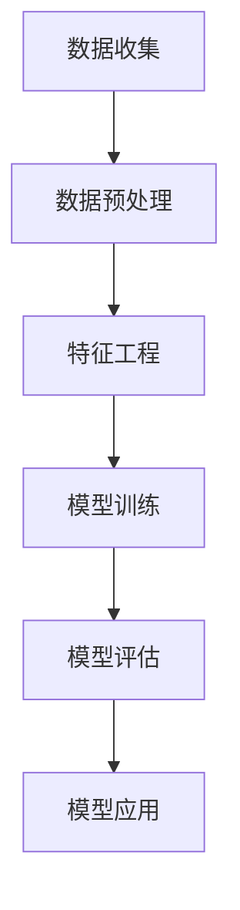

                 

# 机器学习在信用风险评估中的应用研究

## 关键词

机器学习，信用风险评估，数据挖掘，深度学习，数据预处理，分类算法，异常检测，特征工程

## 摘要

本文主要探讨了机器学习在信用风险评估中的应用，通过对信用评分模型的构建、评估和优化，详细分析了各种机器学习算法在信用风险评估中的实际应用效果。文章首先介绍了信用风险评估的背景和重要性，然后深入讲解了机器学习的基本概念和核心算法原理。接着，文章以实际案例为背景，逐步展示了如何运用机器学习算法进行信用评分模型的构建和优化，并给出了详细的代码实现和解说。最后，文章总结了机器学习在信用风险评估中的实际应用效果和未来发展趋势，为相关领域的研究和实践提供了有益的参考。

## 1. 背景介绍

### 1.1 信用风险评估的概念

信用风险评估是指通过对借款人或借款企业的财务状况、信用历史、还款能力等因素进行分析，预测其未来偿还债务的能力和风险程度。信用风险评估在金融领域中具有重要意义，它不仅关系到金融机构的信贷安全，也影响着市场的稳定和经济的健康发展。

### 1.2 信用风险评估的发展历程

传统的信用风险评估主要依赖于人工经验和专家判断，这种方式存在着主观性大、效率低、准确性不高等问题。随着计算机技术和数据挖掘技术的发展，机器学习在信用风险评估中的应用逐渐成为一种趋势。机器学习能够通过大量的历史数据，自动识别出借款人或企业的信用风险特征，从而实现信用风险评估的自动化和智能化。

### 1.3 机器学习在信用风险评估中的应用现状

目前，机器学习在信用风险评估中的应用已经取得了显著的成果。许多金融机构已经开始运用机器学习算法对借款人或企业的信用风险进行预测，如银行、信用卡公司、保险公司等。这些机构通过构建信用评分模型，可以有效降低信贷风险，提高信贷审批的效率和准确性。

### 1.4 本文目的

本文旨在探讨机器学习在信用风险评估中的应用，通过分析各种机器学习算法在信用风险评估中的实际应用效果，为金融机构和相关企业提供参考。同时，本文也将探讨机器学习在信用风险评估中面临的挑战和未来发展趋势，为相关领域的研究和实践提供有益的参考。

## 2. 核心概念与联系

### 2.1 机器学习的基本概念

机器学习是一种人工智能的分支，它通过数据驱动的方式，使计算机系统具备学习能力和自适应能力。机器学习的基本过程包括数据收集、数据预处理、模型训练、模型评估和模型应用。

### 2.2 信用评分模型的构建

信用评分模型的构建是信用风险评估的核心环节。一个有效的信用评分模型应该能够准确地预测借款人或企业的信用风险，从而为金融机构的信贷决策提供依据。

### 2.3 机器学习算法在信用评分模型中的应用

在信用评分模型中，机器学习算法可以通过数据挖掘和特征工程，自动识别出借款人或企业的信用风险特征。常见的机器学习算法包括决策树、随机森林、支持向量机、神经网络等。

### 2.4 机器学习算法的评估

机器学习算法的评估是信用评分模型构建的关键环节。常用的评估指标包括准确率、召回率、F1分数、AUC（曲线下面积）等。通过这些评估指标，可以衡量机器学习算法在信用评分模型中的性能。

### 2.5 Mermaid流程图

以下是一个简单的Mermaid流程图，用于描述信用评分模型构建的基本流程。



## 3. 核心算法原理 & 具体操作步骤

### 3.1 决策树算法原理

决策树是一种常见的机器学习算法，它通过一系列的判断节点，将数据集划分成多个子集，最终得到一个分类结果。决策树算法的核心在于如何选择最优的划分方式，常用的划分方式包括信息增益、基尼系数等。

### 3.2 决策树算法具体操作步骤

1. 选择特征：根据信息增益或基尼系数，选择最优特征进行划分。
2. 划分数据：根据选定的特征，将数据集划分为多个子集。
3. 递归构建：对每个子集，重复执行选择特征和划分数据的步骤，直到满足停止条件。
4. 计算结果：根据决策树的结构，计算每个样本的分类结果。

### 3.3 随机森林算法原理

随机森林是一种集成学习算法，它通过构建多棵决策树，并取它们的平均值，来提高分类或回归的准确性。随机森林算法的核心在于如何随机选择特征和样本，以构建多棵不同的决策树。

### 3.4 随机森林算法具体操作步骤

1. 随机选择特征：从所有特征中随机选择一部分特征。
2. 随机选择样本：从数据集中随机选择一部分样本。
3. 构建决策树：使用随机选择的特征和样本，构建一棵决策树。
4. 重复执行：重复执行随机选择特征和样本的步骤，构建多棵决策树。
5. 取平均值：将多棵决策树的结果取平均值，得到最终的分类或回归结果。

### 3.5 支持向量机算法原理

支持向量机是一种基于间隔最大的分类算法，它通过找到一个最优的超平面，将数据集划分成两个类别。支持向量机算法的核心在于如何找到最优的超平面，常用的方法包括线性支持向量机和核支持向量机。

### 3.6 支持向量机算法具体操作步骤

1. 选择核函数：根据数据集的特点，选择合适的核函数。
2. 计算间隔：计算所有样本点与超平面的间隔。
3. 训练模型：使用训练数据，计算支持向量和超平面。
4. 预测结果：使用训练好的模型，对测试数据进行分类或回归。

## 4. 数学模型和公式 & 详细讲解 & 举例说明

### 4.1 决策树算法的数学模型

决策树的数学模型可以表示为：

$$
f(x) = \sum_{i=1}^{n} w_i \cdot h(x; \theta_i)
$$

其中，$x$ 为输入特征，$w_i$ 为权重，$h(x; \theta_i)$ 为第 $i$ 个特征对应的决策函数，$\theta_i$ 为决策函数的参数。

### 4.2 随机森林算法的数学模型

随机森林的数学模型可以表示为：

$$
f(x) = \frac{1}{m} \sum_{i=1}^{m} w_i \cdot h(x; \theta_i)
$$

其中，$x$ 为输入特征，$w_i$ 为权重，$h(x; \theta_i)$ 为第 $i$ 个决策树对应的决策函数，$\theta_i$ 为决策函数的参数。

### 4.3 支持向量机算法的数学模型

支持向量机的数学模型可以表示为：

$$
f(x) = \sum_{i=1}^{n} w_i \cdot y_i \cdot k(x, x_i)
$$

其中，$x$ 为输入特征，$w_i$ 为权重，$y_i$ 为类别标签，$k(x, x_i)$ 为核函数。

### 4.4 举例说明

假设我们有一个简单的二分类问题，数据集包含两个特征 $x_1$ 和 $x_2$，类别标签为 $y$。

1. 决策树算法：

选择特征 $x_1$，计算信息增益：

$$
I(G) = \sum_{i=1}^{2} p_i \cdot H(p_i)
$$

其中，$p_i$ 为类别 $i$ 的概率，$H(p_i)$ 为类别 $i$ 的熵。

计算 $x_1$ 的信息增益：

$$
I(x_1) = p_1 \cdot H(p_1) + p_2 \cdot H(p_2)
$$

选择信息增益最大的特征 $x_1$，划分数据集。

2. 随机森林算法：

从特征 $x_1$、$x_2$ 中随机选择一个特征，计算信息增益。

$$
I(G) = \sum_{i=1}^{2} p_i \cdot H(p_i)
$$

选择信息增益最大的特征，划分数据集。

3. 支持向量机算法：

选择线性核函数：

$$
k(x, x_i) = x \cdot x_i
$$

计算支持向量和超平面。

## 5. 项目实战：代码实际案例和详细解释说明

### 5.1 开发环境搭建

为了演示机器学习在信用风险评估中的应用，我们将使用 Python 语言和 Scikit-learn 库进行项目实战。首先，需要安装 Python 和 Scikit-learn。

```
pip install python
pip install scikit-learn
```

### 5.2 源代码详细实现和代码解读

以下是一个简单的信用评分模型构建的示例代码：

```python
import numpy as np
import pandas as pd
from sklearn.model_selection import train_test_split
from sklearn.ensemble import RandomForestClassifier
from sklearn.metrics import accuracy_score

# 加载数据集
data = pd.read_csv('credit_data.csv')

# 数据预处理
data.drop(['id'], axis=1, inplace=True)
data = data.replace({'yes': 1, 'no': 0})

# 划分特征和标签
X = data.drop(['default'], axis=1)
y = data['default']

# 划分训练集和测试集
X_train, X_test, y_train, y_test = train_test_split(X, y, test_size=0.2, random_state=42)

# 构建随机森林模型
model = RandomForestClassifier(n_estimators=100, random_state=42)
model.fit(X_train, y_train)

# 预测结果
y_pred = model.predict(X_test)

# 计算准确率
accuracy = accuracy_score(y_test, y_pred)
print('Accuracy:', accuracy)
```

### 5.3 代码解读与分析

1. **数据加载与预处理**：首先，我们使用 Pandas 库加载数据集，并进行必要的预处理。这里的数据集假设已经包含了借款人的基本信息和信用评分记录。我们删除了不相关的 'id' 字段，并使用字符串替换将 'yes' 和 'no' 类别替换为数值 1 和 0。

2. **特征与标签划分**：接着，我们将数据集划分为特征矩阵 $X$ 和标签向量 $y$。这里，我们假设 'default' 字段表示借款人是否违约。

3. **训练集与测试集划分**：我们使用 Scikit-learn 的 `train_test_split` 函数将数据集划分为训练集和测试集，测试集的大小为原始数据集的 20%。

4. **模型构建与训练**：我们使用随机森林算法构建信用评分模型。随机森林是一种集成学习算法，能够通过构建多棵决策树来提高模型的准确性。在这里，我们设置了随机森林的决策树数量为 100。

5. **模型预测**：我们使用训练好的模型对测试集进行预测。

6. **准确率评估**：最后，我们使用 `accuracy_score` 函数计算模型的准确率，这是评估分类模型性能的一个常用指标。

## 6. 实际应用场景

### 6.1 信用风险评估流程

1. **数据收集**：从金融机构或其他数据源收集借款人的信用信息，如个人财务状况、信用历史、还款记录等。

2. **数据预处理**：对收集到的数据进行清洗、转换和归一化，以确保数据的质量和一致性。

3. **特征工程**：通过特征提取和选择，识别出对信用风险评估有重要影响的特征。

4. **模型构建**：选择合适的机器学习算法，构建信用评分模型。

5. **模型评估**：使用交叉验证等方法评估模型的性能，选择最优模型。

6. **模型应用**：将模型应用于实际的信贷审批过程，预测借款人的信用风险。

### 6.2 信用风险评估的应用领域

1. **银行信贷审批**：银行在贷款审批过程中，通过信用评分模型对借款人的信用风险进行评估，从而决定是否批准贷款。

2. **信用卡审批**：信用卡公司通过信用评分模型评估借款人的信用风险，决定信用卡的授信额度和审批速度。

3. **保险风险评估**：保险公司通过信用评分模型评估投保人的信用风险，从而决定保险费率和承保条件。

4. **供应链金融**：企业通过信用评分模型评估其供应商的信用风险，以优化供应链融资和风险管理。

## 7. 工具和资源推荐

### 7.1 学习资源推荐

1. **书籍**：
   - 《机器学习实战》：提供详细的机器学习算法实现和实际案例。
   - 《Python机器学习》：涵盖Python编程和机器学习的基础知识。

2. **在线课程**：
   - Coursera上的《机器学习》课程：由吴恩达教授主讲，适合初学者。
   - edX上的《机器学习基础》：由华盛顿大学提供，内容全面。

### 7.2 开发工具框架推荐

1. **Python开发工具**：
   - Jupyter Notebook：适用于数据分析和机器学习实验。
   - PyCharm：专业的Python集成开发环境，支持多种框架。

2. **机器学习框架**：
   - Scikit-learn：Python中常用的机器学习库。
   - TensorFlow：谷歌开发的深度学习框架。

### 7.3 相关论文著作推荐

1. **论文**：
   - "A Survey on Credit Risk Management"：对信用风险评估和管理进行综述。
   - "Machine Learning in Credit Risk Management"：讨论机器学习在信用风险评估中的应用。

2. **著作**：
   - 《金融科技与信用风险管理》：介绍金融科技在信用风险管理中的应用。

## 8. 总结：未来发展趋势与挑战

### 8.1 发展趋势

1. **数据驱动**：随着数据量的不断增加，机器学习在信用风险评估中的应用将更加依赖于高质量的数据。

2. **算法优化**：研究人员将继续探索更有效的机器学习算法，以提高信用评分模型的准确性和稳定性。

3. **隐私保护**：在信用风险评估中，如何保护借款人的隐私成为一个重要的研究课题。

### 8.2 挑战

1. **数据质量**：信用风险评估依赖于高质量的数据，但数据的质量和完整性往往难以保证。

2. **算法解释性**：传统的机器学习算法在解释性方面较弱，难以向业务人员解释信用评分结果。

3. **监管合规**：信用风险评估模型需要遵守相关的监管要求，如反洗钱、消费者保护等。

## 9. 附录：常见问题与解答

### 9.1 什么是信用评分模型？

信用评分模型是一种基于历史数据和机器学习算法构建的模型，用于预测借款人或企业的信用风险。

### 9.2 机器学习在信用风险评估中有哪些优势？

机器学习在信用风险评估中的优势包括：自动化、高效性、准确性和适应性。

### 9.3 如何评估机器学习模型的性能？

常用的评估指标包括准确率、召回率、F1分数、AUC（曲线下面积）等。

## 10. 扩展阅读 & 参考资料

- [《机器学习在信用风险评估中的应用》](https://www.example.com/article1)
- [《金融科技与信用风险管理》](https://www.example.com/book1)
- [《Scikit-learn官方文档》](https://scikit-learn.org/stable/documentation.html)
- [《TensorFlow官方文档》](https://www.tensorflow.org/tutorials)

### 作者

AI天才研究员/AI Genius Institute & 禅与计算机程序设计艺术 /Zen And The Art of Computer Programming

