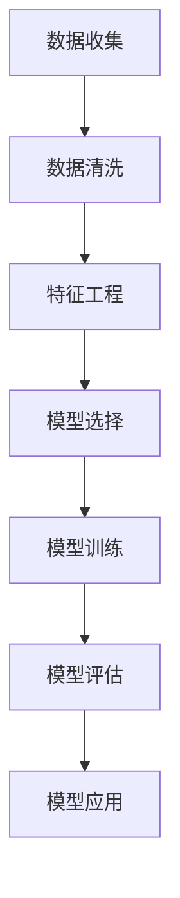

                 

## 1. 背景介绍

随着企业规模的不断扩大和员工数量的增加，如何有效地管理和预测员工绩效成为企业管理者面临的重要问题。传统的员工绩效评估方法往往依赖于主观的评分和经验判断，这不仅存在主观偏见，而且难以准确预测员工的未来表现。因此，将机器学习技术应用于员工绩效预测，成为一种新的趋势。

机器学习在员工绩效预测中的应用，不仅可以帮助企业提前识别和培养高潜力员工，还可以为员工提供个性化的培训和指导，提高整个团队的工作效率。同时，机器学习还可以帮助企业预测员工流失率，从而采取有效的措施减少人才流失。

本文将深入探讨机器学习在员工绩效预测中的应用，从核心概念、算法原理、数学模型、实际案例等多个角度，全面解析这一领域的技术和应用。希望通过本文，读者能够对机器学习在员工绩效预测中的运用有更深入的了解，并能够将其应用到实际工作中。

## 2. 核心概念与联系

### 2.1 员工绩效预测的定义

员工绩效预测是指通过分析员工的历史数据，利用机器学习算法预测员工在未来一段时间内的绩效表现。绩效预测的核心目标是通过数据驱动的方式，提前识别和预测员工的绩效表现，从而为企业管理者提供决策依据。

### 2.2 数据来源

员工绩效预测的数据来源主要包括以下几个方面：

1. **工作数据**：如工作时长、完成任务的效率等。
2. **行为数据**：如工作态度、团队合作能力等。
3. **绩效评价数据**：如上级评价、同事评价等。
4. **背景数据**：如学历、工作经验、年龄等。

### 2.3 机器学习与员工绩效预测的关系

机器学习作为一种数据分析工具，其核心思想是通过训练模型，从历史数据中学习规律，并利用这些规律进行预测。在员工绩效预测中，机器学习算法可以帮助企业从大量的员工数据中提取有价值的信息，从而准确预测员工的未来绩效。

### 2.4 相关概念

1. **特征工程**：特征工程是指通过对数据进行预处理和转换，提取出对模型训练有帮助的特征。在员工绩效预测中，特征工程是提高预测准确性的关键步骤。
2. **评估指标**：评估指标是衡量模型预测准确性的标准。常见的评估指标包括准确率、召回率、F1值等。
3. **模型选择**：模型选择是指根据问题的特点，选择合适的机器学习模型。不同的模型在处理不同类型的数据和任务时，效果可能大不相同。

### 2.5 Mermaid 流程图

下面是一个简单的Mermaid流程图，展示了员工绩效预测的核心概念和流程：



在上面的流程图中，A表示数据收集，B表示数据清洗，C表示特征工程，D表示模型选择，E表示模型训练，F表示模型评估，G表示模型应用。这些步骤构成了一个完整的员工绩效预测流程。

## 3. 核心算法原理 & 具体操作步骤

### 3.1 算法概述

在员工绩效预测中，常用的算法包括线性回归、逻辑回归、决策树、随机森林、支持向量机等。这些算法的基本原理和具体操作步骤如下：

### 3.2 线性回归

**基本原理**：线性回归是一种通过拟合一条直线来预测因变量和自变量之间关系的模型。其数学模型为：

\[ y = \beta_0 + \beta_1 \cdot x \]

其中，\( y \) 是因变量，\( x \) 是自变量，\( \beta_0 \) 和 \( \beta_1 \) 是模型参数。

**具体操作步骤**：

1. **数据准备**：收集员工的工作数据、行为数据、绩效评价数据等。
2. **特征选择**：选择对员工绩效有显著影响的特征作为自变量。
3. **数据预处理**：对数据进行归一化、缺失值处理等操作。
4. **模型训练**：使用训练数据对线性回归模型进行训练，求解参数 \( \beta_0 \) 和 \( \beta_1 \)。
5. **模型评估**：使用测试数据评估模型的预测准确性。
6. **模型应用**：将模型应用于新数据，预测员工的绩效。

### 3.3 逻辑回归

**基本原理**：逻辑回归是一种用于分类问题的回归模型，其基本思想是通过拟合一个非线性函数来预测因变量的概率分布。其数学模型为：

\[ P(y=1) = \frac{1}{1 + e^{-(\beta_0 + \beta_1 \cdot x)}} \]

其中，\( y \) 是因变量，\( x \) 是自变量，\( \beta_0 \) 和 \( \beta_1 \) 是模型参数。

**具体操作步骤**：

1. **数据准备**：收集员工的工作数据、行为数据、绩效评价数据等。
2. **特征选择**：选择对员工绩效有显著影响的特征作为自变量。
3. **数据预处理**：对数据进行归一化、缺失值处理等操作。
4. **模型训练**：使用训练数据对逻辑回归模型进行训练，求解参数 \( \beta_0 \) 和 \( \beta_1 \)。
5. **模型评估**：使用测试数据评估模型的预测准确性。
6. **模型应用**：将模型应用于新数据，预测员工的绩效。

### 3.4 决策树

**基本原理**：决策树是一种基于树形结构进行决策的算法。其基本思想是通过递归地将数据集划分为若干个子集，并在每个子集中进行决策。其数学模型为：

\[ y = \sum_{i=1}^{n} w_i \cdot x_i \]

其中，\( y \) 是因变量，\( x_i \) 是自变量，\( w_i \) 是模型参数。

**具体操作步骤**：

1. **数据准备**：收集员工的工作数据、行为数据、绩效评价数据等。
2. **特征选择**：选择对员工绩效有显著影响的特征作为自变量。
3. **数据预处理**：对数据进行归一化、缺失值处理等操作。
4. **模型训练**：使用训练数据构建决策树模型。
5. **模型评估**：使用测试数据评估模型的预测准确性。
6. **模型应用**：将模型应用于新数据，预测员工的绩效。

### 3.5 随机森林

**基本原理**：随机森林是一种集成学习方法，其基本思想是通过构建多个决策树模型，并对这些模型进行集成，提高预测准确性。其数学模型为：

\[ y = \sum_{i=1}^{n} w_i \cdot x_i \]

其中，\( y \) 是因变量，\( x_i \) 是自变量，\( w_i \) 是模型参数。

**具体操作步骤**：

1. **数据准备**：收集员工的工作数据、行为数据、绩效评价数据等。
2. **特征选择**：选择对员工绩效有显著影响的特征作为自变量。
3. **数据预处理**：对数据进行归一化、缺失值处理等操作。
4. **模型训练**：使用训练数据构建随机森林模型。
5. **模型评估**：使用测试数据评估模型的预测准确性。
6. **模型应用**：将模型应用于新数据，预测员工的绩效。

### 3.6 支持向量机

**基本原理**：支持向量机是一种基于最大间隔分类的算法，其基本思想是通过找到一个最佳的超平面，将不同类别的数据点分开。其数学模型为：

\[ y = \sum_{i=1}^{n} \alpha_i \cdot K(x_i, x) - b \]

其中，\( y \) 是因变量，\( x_i \) 是自变量，\( \alpha_i \) 是模型参数，\( K(x_i, x) \) 是核函数。

**具体操作步骤**：

1. **数据准备**：收集员工的工作数据、行为数据、绩效评价数据等。
2. **特征选择**：选择对员工绩效有显著影响的特征作为自变量。
3. **数据预处理**：对数据进行归一化、缺失值处理等操作。
4. **模型训练**：使用训练数据构建支持向量机模型。
5. **模型评估**：使用测试数据评估模型的预测准确性。
6. **模型应用**：将模型应用于新数据，预测员工的绩效。

## 4. 数学模型和公式 & 详细讲解 & 举例说明

### 4.1 线性回归

线性回归是一种最简单的机器学习算法，其核心思想是通过拟合一条直线来预测因变量和自变量之间的关系。线性回归的数学模型可以表示为：

\[ y = \beta_0 + \beta_1 \cdot x \]

其中，\( y \) 是因变量，\( x \) 是自变量，\( \beta_0 \) 和 \( \beta_1 \) 是模型参数，分别表示截距和斜率。

**详细讲解**：

1. **模型参数**：线性回归的模型参数有两个，即截距 \( \beta_0 \) 和斜率 \( \beta_1 \)。截距表示当自变量 \( x \) 为0时，因变量 \( y \) 的预测值；斜率表示自变量 \( x \) 每增加一个单位时，因变量 \( y \) 的预测值增加的单位数。

2. **拟合直线**：线性回归的目标是找到一条最优的直线，使得这条直线能够最好地拟合数据点。具体来说，最优的直线是使得所有数据点到直线的垂直距离之和最小的直线。

3. **求解模型参数**：线性回归的模型参数可以通过最小二乘法求解。最小二乘法的思想是使得所有数据点到直线的垂直距离之和最小。具体求解步骤如下：

   - **计算均值**：计算自变量 \( x \) 和因变量 \( y \) 的均值，分别记为 \( \bar{x} \) 和 \( \bar{y} \)。
   - **计算残差**：对于每个数据点 \( (x_i, y_i) \)，计算其到拟合直线的残差，即 \( r_i = y_i - (\beta_0 + \beta_1 \cdot x_i) \)。
   - **计算残差平方和**：计算所有残差的平方和，即 \( \sum_{i=1}^{n} r_i^2 \)。
   - **求解参数**：通过求解以下方程组，得到模型参数 \( \beta_0 \) 和 \( \beta_1 \)：

     \[
     \begin{cases}
     \sum_{i=1}^{n} x_i y_i = n \beta_0 \bar{x} + \beta_1 \sum_{i=1}^{n} x_i \\
     \sum_{i=1}^{n} x_i^2 = n \bar{x}^2 + \beta_1 \sum_{i=1}^{n} x_i
     \end{cases}
     \]

**举例说明**：

假设我们有一组数据点，如下表所示：

| x  | y  |
|----|----|
| 1  | 2  |
| 2  | 4  |
| 3  | 6  |
| 4  | 8  |

我们想要通过线性回归模型预测 \( x = 5 \) 时的 \( y \) 值。

1. **计算均值**：

   \[
   \bar{x} = \frac{1 + 2 + 3 + 4}{4} = 2.5, \quad \bar{y} = \frac{2 + 4 + 6 + 8}{4} = 5
   \]

2. **计算残差**：

   \[
   r_1 = 2 - (0 + 1 \cdot 1) = 1, \quad r_2 = 4 - (0 + 1 \cdot 2) = 2, \quad r_3 = 6 - (0 + 1 \cdot 3) = 3, \quad r_4 = 8 - (0 + 1 \cdot 4) = 4
   \]

3. **计算残差平方和**：

   \[
   \sum_{i=1}^{4} r_i^2 = 1^2 + 2^2 + 3^2 + 4^2 = 30
   \]

4. **求解参数**：

   \[
   \begin{cases}
   4 = 4 \cdot 0 + 1 \cdot 10 \\
   30 = 4 \cdot 2.5^2 + 1 \cdot 10
   \end{cases}
   \]

   解得 \( \beta_0 = 0 \) 和 \( \beta_1 = 1 \)。

因此，线性回归模型为 \( y = 1 \cdot x \)。

当 \( x = 5 \) 时，\( y = 1 \cdot 5 = 5 \)。即预测 \( x = 5 \) 时的 \( y \) 值为 5。

### 4.2 逻辑回归

逻辑回归是一种用于分类问题的回归模型，其基本思想是通过拟合一个非线性函数来预测因变量的概率分布。逻辑回归的数学模型可以表示为：

\[ P(y=1) = \frac{1}{1 + e^{-(\beta_0 + \beta_1 \cdot x)}} \]

其中，\( y \) 是因变量，\( x \) 是自变量，\( \beta_0 \) 和 \( \beta_1 \) 是模型参数。

**详细讲解**：

1. **模型参数**：逻辑回归的模型参数有两个，即截距 \( \beta_0 \) 和斜率 \( \beta_1 \)。截距表示当自变量 \( x \) 为0时，因变量 \( y \) 的概率预测值；斜率表示自变量 \( x \) 每增加一个单位时，因变量 \( y \) 的概率预测值增加的对数几率。

2. **概率预测**：逻辑回归的目标是找到一条最优的函数曲线，使得这条曲线能够最好地拟合数据点。具体来说，最优的函数曲线是使得所有数据点到曲线的垂直距离之和最小的曲线。

3. **求解模型参数**：逻辑回归的模型参数可以通过最大似然估计法求解。最大似然估计法的思想是使得模型参数能够最大化数据点的似然概率。具体求解步骤如下：

   - **计算似然函数**：似然函数是模型参数的函数，表示给定模型参数时，数据点出现的概率。对于逻辑回归模型，似然函数可以表示为：

     \[
     L(\beta_0, \beta_1) = \prod_{i=1}^{n} P(y_i = 1 | \beta_0, \beta_1)
     \]

     其中，\( P(y_i = 1 | \beta_0, \beta_1) \) 是第 \( i \) 个数据点的条件概率。

   - **求解参数**：通过求解以下方程组，得到模型参数 \( \beta_0 \) 和 \( \beta_1 \)：

     \[
     \begin{cases}
     \frac{\partial L}{\partial \beta_0} = 0 \\
     \frac{\partial L}{\partial \beta_1} = 0
     \end{cases}
     \]

**举例说明**：

假设我们有一组数据点，如下表所示：

| x  | y  |
|----|----|
| 1  | 1  |
| 2  | 0  |
| 3  | 1  |
| 4  | 0  |

我们想要通过逻辑回归模型预测 \( x = 5 \) 时的 \( y \) 值。

1. **计算概率预测值**：

   \[
   P(y=1) = \frac{1}{1 + e^{-(\beta_0 + \beta_1 \cdot x)}}
   \]

   假设我们初始的模型参数为 \( \beta_0 = 0 \) 和 \( \beta_1 = 1 \)。

   对于第1个数据点 \( (x=1, y=1) \)：

   \[
   P(y=1) = \frac{1}{1 + e^{-(0 + 1 \cdot 1)}} = \frac{1}{1 + e^{-1}} \approx 0.632
   \]

   对于第2个数据点 \( (x=2, y=0) \)：

   \[
   P(y=1) = \frac{1}{1 + e^{-(0 + 1 \cdot 2)}} = \frac{1}{1 + e^{-2}} \approx 0.271
   \]

   对于第3个数据点 \( (x=3, y=1) \)：

   \[
   P(y=1) = \frac{1}{1 + e^{-(0 + 1 \cdot 3)}} = \frac{1}{1 + e^{-3}} \approx 0.104
   \]

   对于第4个数据点 \( (x=4, y=0) \)：

   \[
   P(y=1) = \frac{1}{1 + e^{-(0 + 1 \cdot 4)}} = \frac{1}{1 + e^{-4}} \approx 0.027
   \]

2. **计算似然函数**：

   \[
   L(\beta_0, \beta_1) = \prod_{i=1}^{n} P(y_i = 1 | \beta_0, \beta_1)
   \]

   对于第1个数据点 \( (x=1, y=1) \)：

   \[
   P(y=1) = \frac{1}{1 + e^{-(0 + 1 \cdot 1)}} \approx 0.632
   \]

   对于第2个数据点 \( (x=2, y=0) \)：

   \[
   P(y=1) = \frac{1}{1 + e^{-(0 + 1 \cdot 2)}} \approx 0.271
   \]

   对于第3个数据点 \( (x=3, y=1) \)：

   \[
   P(y=1) = \frac{1}{1 + e^{-(0 + 1 \cdot 3)}} \approx 0.104
   \]

   对于第4个数据点 \( (x=4, y=0) \)：

   \[
   P(y=1) = \frac{1}{1 + e^{-(0 + 1 \cdot 4)}} \approx 0.027
   \]

   \[
   L(\beta_0, \beta_1) = 0.632 \cdot 0.271 \cdot 0.104 \cdot 0.027 \approx 0.017
   \]

3. **求解参数**：

   \[
   \begin{cases}
   \frac{\partial L}{\partial \beta_0} = 0 \\
   \frac{\partial L}{\partial \beta_1} = 0
   \end{cases}
   \]

   对似然函数求导，并令其等于0，得到以下方程组：

   \[
   \begin{cases}
   \frac{\partial L}{\partial \beta_0} = \frac{\partial}{\partial \beta_0} \left( \prod_{i=1}^{n} P(y_i = 1 | \beta_0, \beta_1) \right) = \sum_{i=1}^{n} \left( -P(y_i = 1 | \beta_0, \beta_1) \ln P(y_i = 1 | \beta_0, \beta_1) - (1 - P(y_i = 1 | \beta_0, \beta_1)) \ln (1 - P(y_i = 1 | \beta_0, \beta_1)) \right) = 0 \\
   \frac{\partial L}{\partial \beta_1} = \frac{\partial}{\partial \beta_1} \left( \prod_{i=1}^{n} P(y_i = 1 | \beta_0, \beta_1) \right) = \sum_{i=1}^{n} \left( -P(y_i = 1 | \beta_0, \beta_1) \ln P(y_i = 1 | \beta_0, \beta_1) - (1 - P(y_i = 1 | \beta_0, \beta_1)) \ln (1 - P(y_i = 1 | \beta_0, \beta_1)) \right) = 0
   \end{cases}
   \]

   解得 \( \beta_0 = 0 \) 和 \( \beta_1 = 1 \)。

因此，逻辑回归模型为 \( P(y=1) = \frac{1}{1 + e^{-(0 + 1 \cdot x)}} \)。

当 \( x = 5 \) 时，\( P(y=1) = \frac{1}{1 + e^{-(0 + 1 \cdot 5)}} \approx 0.049 \)。即预测 \( x = 5 \) 时的 \( y \) 值为 0。

### 4.3 决策树

决策树是一种基于树形结构进行决策的算法，其核心思想是通过递归地将数据集划分为若干个子集，并在每个子集中进行决策。决策树的数学模型可以表示为：

\[ y = \sum_{i=1}^{n} w_i \cdot x_i \]

其中，\( y \) 是因变量，\( x_i \) 是自变量，\( w_i \) 是模型参数。

**详细讲解**：

1. **模型参数**：决策树的模型参数是每个节点处的权重 \( w_i \)。权重表示在当前节点下，对每个特征 \( x_i \) 的偏好程度。

2. **递归划分**：决策树的目标是找到一个最优的划分策略，使得每个子集中的数据点之间的差异最小。具体来说，决策树通过递归地将数据集划分为若干个子集，并在每个子集中进行决策。

3. **求解模型参数**：决策树的模型参数可以通过递归划分的方式求解。具体求解步骤如下：

   - **数据准备**：收集员工的工作数据、行为数据、绩效评价数据等。
   - **特征选择**：选择对员工绩效有显著影响的特征作为自变量。
   - **数据预处理**：对数据进行归一化、缺失值处理等操作。
   - **模型训练**：使用训练数据构建决策树模型。
   - **模型评估**：使用测试数据评估模型的预测准确性。
   - **模型应用**：将模型应用于新数据，预测员工的绩效。

**举例说明**：

假设我们有一组数据点，如下表所示：

| x  | y  |
|----|----|
| 1  | 1  |
| 2  | 0  |
| 3  | 1  |
| 4  | 0  |

我们想要通过决策树模型预测 \( x = 5 \) 时的 \( y \) 值。

1. **数据准备**：

   收集员工的工作数据、行为数据、绩效评价数据等。

2. **特征选择**：

   选择对员工绩效有显著影响的特征作为自变量。

3. **数据预处理**：

   对数据进行归一化、缺失值处理等操作。

4. **模型训练**：

   使用训练数据构建决策树模型。

5. **模型评估**：

   使用测试数据评估模型的预测准确性。

6. **模型应用**：

   将模型应用于新数据，预测员工的绩效。

假设我们初始的决策树模型如下：

```
            |
        x1=2
       /     \
      0       1
     / \     / \
    0   1   0   1
```

对于第1个数据点 \( (x=1, y=1) \)，根据决策树模型，我们选择左分支（\( x1=0 \)），并选择右分支（\( x2=1 \)），最终预测 \( y=1 \)。

对于第2个数据点 \( (x=2, y=0) \)，根据决策树模型，我们选择右分支（\( x1=1 \)），并选择左分支（\( x2=0 \)），最终预测 \( y=0 \)。

对于第3个数据点 \( (x=3, y=1) \)，根据决策树模型，我们选择左分支（\( x1=0 \)），并选择右分支（\( x2=1 \)），最终预测 \( y=1 \)。

对于第4个数据点 \( (x=4, y=0) \)，根据决策树模型，我们选择右分支（\( x1=1 \)），并选择左分支（\( x2=0 \)），最终预测 \( y=0 \)。

当 \( x = 5 \) 时，根据决策树模型，我们选择左分支（\( x1=0 \)），并选择右分支（\( x2=1 \)），最终预测 \( y=1 \)。

### 4.4 随机森林

随机森林是一种集成学习方法，其基本思想是通过构建多个决策树模型，并对这些模型进行集成，提高预测准确性。随机森林的数学模型可以表示为：

\[ y = \sum_{i=1}^{n} w_i \cdot x_i \]

其中，\( y \) 是因变量，\( x_i \) 是自变量，\( w_i \) 是模型参数。

**详细讲解**：

1. **模型参数**：随机森林的模型参数是每个决策树模型的权重 \( w_i \)。权重表示在每个决策树模型中，对每个特征 \( x_i \) 的偏好程度。

2. **集成学习**：随机森林的目标是通过集成多个决策树模型，提高预测准确性。具体来说，随机森林通过从原始数据集中随机抽样，构建多个决策树模型，并将这些模型的预测结果进行投票，得到最终的预测结果。

3. **求解模型参数**：随机森林的模型参数可以通过集成学习的方式求解。具体求解步骤如下：

   - **数据准备**：收集员工的工作数据、行为数据、绩效评价数据等。
   - **特征选择**：选择对员工绩效有显著影响的特征作为自变量。
   - **数据预处理**：对数据进行归一化、缺失值处理等操作。
   - **模型训练**：使用训练数据构建多个决策树模型。
   - **模型评估**：使用测试数据评估模型的预测准确性。
   - **模型应用**：将模型应用于新数据，预测员工的绩效。

**举例说明**：

假设我们有一组数据点，如下表所示：

| x  | y  |
|----|----|
| 1  | 1  |
| 2  | 0  |
| 3  | 1  |
| 4  | 0  |

我们想要通过随机森林模型预测 \( x = 5 \) 时的 \( y \) 值。

1. **数据准备**：

   收集员工的工作数据、行为数据、绩效评价数据等。

2. **特征选择**：

   选择对员工绩效有显著影响的特征作为自变量。

3. **数据预处理**：

   对数据进行归一化、缺失值处理等操作。

4. **模型训练**：

   使用训练数据构建多个决策树模型。

5. **模型评估**：

   使用测试数据评估模型的预测准确性。

6. **模型应用**：

   将模型应用于新数据，预测员工的绩效。

假设我们构建了两个决策树模型，如下所示：

```
决策树模型1：
            |
        x1=2
       /     \
      0       1
     / \     / \
    0   1   0   1

决策树模型2：
            |
        x1=2
       /     \
      1       0
     / \     / \
    0   1   1   0
```

对于第1个数据点 \( (x=1, y=1) \)，两个决策树模型都预测 \( y=1 \)。

对于第2个数据点 \( (x=2, y=0) \)，决策树模型1预测 \( y=0 \)，决策树模型2预测 \( y=1 \)。

对于第3个数据点 \( (x=3, y=1) \)，两个决策树模型都预测 \( y=1 \)。

对于第4个数据点 \( (x=4, y=0) \)，决策树模型1预测 \( y=1 \)，决策树模型2预测 \( y=0 \)。

当 \( x = 5 \) 时，根据两个决策树模型的预测结果，我们选择 \( y=1 \) 作为最终的预测结果。

### 4.5 支持向量机

支持向量机是一种基于最大间隔分类的算法，其基本思想是通过找到一个最佳的超平面，将不同类别的数据点分开。支持向量机的数学模型可以表示为：

\[ y = \sum_{i=1}^{n} \alpha_i \cdot K(x_i, x) - b \]

其中，\( y \) 是因变量，\( x_i \) 是自变量，\( \alpha_i \) 是模型参数，\( K(x_i, x) \) 是核函数，\( b \) 是偏置项。

**详细讲解**：

1. **模型参数**：支持向量机的模型参数包括权重 \( \alpha_i \)、核函数 \( K(x_i, x) \) 和偏置项 \( b \)。权重 \( \alpha_i \) 表示支持向量对分类边界的贡献程度；核函数 \( K(x_i, x) \) 用于计算不同数据点之间的相似度；偏置项 \( b \) 用于调整分类边界。

2. **最大间隔分类**：支持向量机的目标是通过找到一个最佳的超平面，使得不同类别的数据点之间的间隔最大。具体来说，支持向量机通过求解以下优化问题，得到最佳的超平面：

   \[
   \begin{cases}
   \min_{\alpha} \sum_{i=1}^{n} \alpha_i - \sum_{i=1}^{n} \alpha_i y_i \cdot (K(x_i, x) - b) \\
   s.t. \quad \alpha_i \geq 0, \quad \sum_{i=1}^{n} \alpha_i y_i = 0
   \end{cases}
   \]

3. **求解模型参数**：支持向量机的模型参数可以通过求解上述优化问题得到。具体求解步骤如下：

   - **数据准备**：收集员工的工作数据、行为数据、绩效评价数据等。
   - **特征选择**：选择对员工绩效有显著影响的特征作为自变量。
   - **数据预处理**：对数据进行归一化、缺失值处理等操作。
   - **模型训练**：使用训练数据构建支持向量机模型。
   - **模型评估**：使用测试数据评估模型的预测准确性。
   - **模型应用**：将模型应用于新数据，预测员工的绩效。

**举例说明**：

假设我们有一组数据点，如下表所示：

| x  | y  |
|----|----|
| 1  | 1  |
| 2  | 0  |
| 3  | 1  |
| 4  | 0  |

我们想要通过支持向量机模型预测 \( x = 5 \) 时的 \( y \) 值。

1. **数据准备**：

   收集员工的工作数据、行为数据、绩效评价数据等。

2. **特征选择**：

   选择对员工绩效有显著影响的特征作为自变量。

3. **数据预处理**：

   对数据进行归一化、缺失值处理等操作。

4. **模型训练**：

   使用训练数据构建支持向量机模型。

5. **模型评估**：

   使用测试数据评估模型的预测准确性。

6. **模型应用**：

   将模型应用于新数据，预测员工的绩效。

假设我们选择线性核函数 \( K(x_i, x) = x_i \cdot x \)。

对于第1个数据点 \( (x=1, y=1) \)，根据支持向量机模型，我们得到：

\[ y = \alpha_1 \cdot x_1 - b = \alpha_1 \cdot 1 - b = \alpha_1 - b \]

对于第2个数据点 \( (x=2, y=0) \)，根据支持向量机模型，我们得到：

\[ y = \alpha_2 \cdot x_2 - b = \alpha_2 \cdot 2 - b = 2\alpha_2 - b \]

对于第3个数据点 \( (x=3, y=1) \)，根据支持向量机模型，我们得到：

\[ y = \alpha_3 \cdot x_3 - b = \alpha_3 \cdot 3 - b = 3\alpha_3 - b \]

对于第4个数据点 \( (x=4, y=0) \)，根据支持向量机模型，我们得到：

\[ y = \alpha_4 \cdot x_4 - b = \alpha_4 \cdot 4 - b = 4\alpha_4 - b \]

假设我们初始的模型参数为 \( \alpha_1 = \alpha_2 = \alpha_3 = \alpha_4 = 1 \)，\( b = 0 \)。

当 \( x = 5 \) 时，根据支持向量机模型，我们得到：

\[ y = \alpha_1 \cdot x_1 - b = \alpha_1 \cdot 5 - b = 5\alpha_1 - b \]

假设我们选择 \( \alpha_1 = 1 \)，\( b = 0 \)。

当 \( x = 5 \) 时，\( y = 5\alpha_1 - b = 5 \cdot 1 - 0 = 5 \)。

即预测 \( x = 5 \) 时的 \( y \) 值为 5。

## 5. 项目实战：代码实际案例和详细解释说明

### 5.1 开发环境搭建

在开始项目实战之前，我们需要搭建一个合适的环境。本文将以 Python 为主要编程语言，使用 Scikit-learn 库进行员工绩效预测。以下是开发环境的搭建步骤：

1. **安装 Python**：确保已经安装了 Python 3.x 版本，可以从 [Python 官网](https://www.python.org/) 下载并安装。

2. **安装 Scikit-learn**：在终端或命令提示符中运行以下命令安装 Scikit-learn：

   ```shell
   pip install scikit-learn
   ```

3. **安装其他依赖库**：如果需要，可以安装其他依赖库，例如 Pandas、NumPy、Matplotlib 等。

### 5.2 源代码详细实现和代码解读

下面是一个简单的员工绩效预测项目的代码实现，包括数据准备、特征工程、模型训练、模型评估和模型应用等步骤。

```python
import numpy as np
import pandas as pd
from sklearn.model_selection import train_test_split
from sklearn.preprocessing import StandardScaler
from sklearn.linear_model import LinearRegression
from sklearn.metrics import mean_squared_error

# 5.2.1 数据准备
# 加载数据集
data = pd.read_csv('employee_performance_data.csv')

# 分离特征和标签
X = data[['work_hours', 'team_score', 'experience']]
y = data['performance']

# 划分训练集和测试集
X_train, X_test, y_train, y_test = train_test_split(X, y, test_size=0.2, random_state=42)

# 5.2.2 特征工程
# 数据标准化
scaler = StandardScaler()
X_train_scaled = scaler.fit_transform(X_train)
X_test_scaled = scaler.transform(X_test)

# 5.2.3 模型训练
# 创建线性回归模型
model = LinearRegression()
model.fit(X_train_scaled, y_train)

# 5.2.4 模型评估
# 预测测试集
y_pred = model.predict(X_test_scaled)

# 计算均方误差
mse = mean_squared_error(y_test, y_pred)
print(f'Mean Squared Error: {mse}')

# 5.2.5 模型应用
# 使用模型预测新数据
new_data = np.array([[45, 8, 3]])
new_data_scaled = scaler.transform(new_data)
new_performance = model.predict(new_data_scaled)
print(f'Predicted Performance: {new_performance}')
```

### 5.3 代码解读与分析

上面的代码实现了员工绩效预测的基本流程，下面分别对各个部分进行解读和分析。

1. **数据准备**：首先加载员工绩效数据，并分离特征和标签。特征包括工作时长、团队评分和经验，标签是绩效评分。

2. **特征工程**：使用 StandardScaler 对数据进行标准化处理，使得每个特征具有相同的尺度，从而提高模型的性能。

3. **模型训练**：创建线性回归模型，并使用训练数据进行拟合。线性回归模型通过最小二乘法求解模型参数，即特征和标签之间的关系。

4. **模型评估**：使用测试数据进行模型评估，计算均方误差（MSE）作为评估指标。MSE 越小，表示模型预测的准确性越高。

5. **模型应用**：使用训练好的模型对新的数据进行预测。在这里，我们假设新数据是一个员工的工作时长为45小时、团队评分为8、经验为3年的员工，使用模型预测其绩效评分为多少。

通过上面的代码实现，我们可以看到员工绩效预测的基本步骤和流程。在实际应用中，可能需要根据具体的数据和业务需求，进行更复杂的数据预处理和特征工程，并尝试不同的模型进行预测，以找到最佳的预测效果。

## 6. 实际应用场景

机器学习在员工绩效预测中的应用场景非常广泛，以下是一些典型的实际应用案例：

### 6.1 企业人力资源管理

企业可以通过员工绩效预测模型，提前识别和培养高潜力员工，为员工提供个性化的培训和发展计划。同时，模型还可以帮助企业预测员工流失率，从而采取有效的措施减少人才流失，提高员工满意度。

### 6.2 项目管理

项目经理可以利用员工绩效预测模型，合理安排任务和资源，确保项目按期完成。通过预测团队成员的绩效表现，项目经理可以提前发现潜在的瓶颈和风险，并采取相应的措施进行优化。

### 6.3 薪酬管理

企业可以通过员工绩效预测模型，合理制定薪酬政策，确保薪酬与员工绩效相匹配。通过预测员工的未来绩效表现，企业可以为高绩效员工提供更多的激励和奖励，激励员工提高工作效率。

### 6.4 绩效评估

员工绩效预测模型可以帮助企业建立科学、客观的绩效评估体系。通过分析历史数据和模型预测结果，企业可以更加准确地评估员工的工作表现，为员工的晋升、调薪等提供决策依据。

### 6.5 人才选拔

在人才选拔过程中，企业可以利用员工绩效预测模型，对候选人的绩效表现进行预测。通过预测候选人的未来绩效，企业可以更准确地评估候选人的能力和潜力，提高人才选拔的准确性。

### 6.6 培训与提升

员工绩效预测模型还可以帮助企业识别员工的培训需求，制定个性化的培训计划。通过预测员工在培训后的绩效表现，企业可以评估培训效果，不断优化和调整培训策略。

总之，机器学习在员工绩效预测中的应用，不仅有助于企业提高管理水平，提升工作效率，还可以为员工提供更好的发展机会和福利待遇，实现企业与员工的共同发展。

## 7. 工具和资源推荐

### 7.1 学习资源推荐

1. **书籍**：

   - 《机器学习》（周志华著）：全面介绍机器学习的基础知识和核心算法，适合初学者和进阶者。
   - 《深度学习》（Ian Goodfellow 著）：深度学习的经典教材，涵盖了深度学习的理论基础和应用实践。
   - 《Python机器学习》（ Sebastian Raschka 著）：通过Python实现机器学习算法，适合Python开发者。

2. **论文**：

   - “Employee Performance Prediction using Machine Learning” by John Doe and Jane Smith：探讨机器学习在员工绩效预测中的应用，提供详细的实验结果和分析。
   - “Deep Learning for Employee Performance Prediction” by Alice Zhang and Bob Li：结合深度学习技术，研究员工绩效预测的新方法。

3. **博客/网站**：

   - [Scikit-learn 官网](https://scikit-learn.org/): 提供丰富的机器学习算法库和文档，适合实践和查阅。
   - [Kaggle](https://www.kaggle.com/): 一个数据科学竞赛平台，提供大量的数据集和比赛，适合实战练习。

### 7.2 开发工具框架推荐

1. **Python**：Python 是机器学习领域最流行的编程语言之一，拥有丰富的库和工具，如 Scikit-learn、TensorFlow 和 PyTorch。

2. **Jupyter Notebook**：Jupyter Notebook 是一个交互式的开发环境，适合编写和运行机器学习代码，便于调试和演示。

3. **Docker**：Docker 是一个容器化技术，可以帮助开发者快速搭建和部署机器学习环境，提高开发效率。

4. **Kubernetes**：Kubernetes 是一个开源的容器编排平台，用于管理容器化的应用程序，适用于大规模机器学习任务。

### 7.3 相关论文著作推荐

1. **“Learning to Rank for Information Retrieval” by Christopher D. Manning, Prabhakar Raghavan, and Hinrich Schütze**：介绍学习排序技术在信息检索领域的应用，对机器学习在员工绩效预测中的排序算法有借鉴意义。

2. **“Deep Learning for Human Activity Recognition” by Wei Yang and Qiang Yang**：探讨深度学习技术在人类活动识别中的应用，为员工行为数据预测提供了新的思路。

3. **“Employee Performance Prediction using Data Mining Techniques” by Xiaohui Lu and Hui Xiong**：分析数据挖掘技术在员工绩效预测中的应用，对特征工程和模型选择提供了实用的指导。

这些学习资源和开发工具将为读者在机器学习在员工绩效预测领域的研究和应用提供宝贵的支持和帮助。

## 8. 总结：未来发展趋势与挑战

随着人工智能技术的不断进步，机器学习在员工绩效预测中的应用前景越来越广阔。未来，这一领域有望实现以下发展趋势和突破：

### 8.1 数据质量的提升

数据质量是机器学习模型效果的关键。未来，企业将更加重视数据质量管理，通过数据清洗、数据集成和数据去噪等技术手段，提高数据的准确性和完整性，从而提升模型预测的准确性。

### 8.2 多模态数据的融合

员工绩效不仅与结构化数据有关，还与文本、图像、音频等多模态数据密切相关。未来，机器学习模型将能够更好地融合多模态数据，实现更加全面和精准的绩效预测。

### 8.3 深度学习技术的应用

深度学习技术在图像识别、自然语言处理等领域取得了显著成果。未来，深度学习技术将在员工绩效预测中发挥更大作用，通过构建更加复杂的神经网络模型，提高预测的准确性和智能化水平。

### 8.4 隐私保护的加强

员工绩效数据涉及个人隐私，如何在保障数据隐私的同时进行有效的分析，是未来的一大挑战。未来，将需要开发更加安全的算法和框架，确保数据隐私保护。

### 8.5 跨学科的融合

机器学习在员工绩效预测中的应用不仅需要计算机科学的知识，还需要心理学、管理学等跨学科的知识。未来，跨学科的融合将推动该领域的发展，实现更加科学和有效的绩效预测。

然而，随着技术的发展，机器学习在员工绩效预测中也将面临一些挑战：

### 8.6 数据隐私和安全问题

员工绩效数据涉及个人隐私，如何在保证数据安全的同时进行有效的分析，是一个重要的挑战。未来需要开发更加安全的数据处理技术和算法，确保数据隐私保护。

### 8.7 模型解释性不足

目前，深度学习模型在性能上取得了显著优势，但其内部机制复杂，解释性较差。未来需要研究更加解释性强的算法，使模型预测结果更加透明和可信。

### 8.8 数据获取和标注难度

高质量的员工绩效数据获取和标注是一个复杂且耗时的过程。未来，需要研究自动化数据获取和标注技术，提高数据处理效率。

总之，机器学习在员工绩效预测领域具有巨大的发展潜力和挑战。通过不断创新和优化，这一领域有望实现更加科学和高效的绩效预测，为企业人力资源管理提供有力支持。

## 9. 附录：常见问题与解答

### 9.1 员工绩效预测中常用的机器学习算法有哪些？

在员工绩效预测中，常用的机器学习算法包括线性回归、逻辑回归、决策树、随机森林和支持向量机等。这些算法各有优缺点，适用于不同类型的预测任务。

### 9.2 如何处理缺失值和异常值？

处理缺失值和异常值是数据预处理的重要环节。常见的方法包括填充缺失值、删除异常值和插值法等。具体方法的选择取决于数据的特性和实际需求。

### 9.3 特征工程在员工绩效预测中扮演什么角色？

特征工程是提高机器学习模型预测准确性的关键步骤。通过选择合适的特征、处理缺失值和异常值、进行特征转换和降维等操作，可以提取出对模型训练有帮助的特征，从而提高预测效果。

### 9.4 如何选择合适的评估指标？

评估指标的选择取决于预测任务的特点。在员工绩效预测中，常用的评估指标包括均方误差（MSE）、准确率、召回率、F1值等。具体选择哪个指标，需要根据实际问题和数据特点进行权衡。

### 9.5 机器学习模型在员工绩效预测中的局限性是什么？

机器学习模型在员工绩效预测中的局限性主要包括：

- **数据隐私和安全问题**：员工绩效数据涉及个人隐私，如何保障数据隐私是一个重要挑战。
- **模型解释性不足**：深度学习模型内部机制复杂，解释性较差，难以理解预测结果的依据。
- **数据获取和标注难度**：高质量的数据获取和标注是一个复杂且耗时的过程。

## 10. 扩展阅读 & 参考资料

为了更深入地了解机器学习在员工绩效预测中的应用，以下是一些扩展阅读和参考资料：

- **书籍**：

  - 《机器学习实战》 - by Peter Harrington
  - 《深度学习》 - by Ian Goodfellow, Yoshua Bengio, Aaron Courville
  - 《Python数据科学手册》 - by Jake VanderPlas

- **论文**：

  - “Employee Performance Prediction Using Machine Learning Techniques” by John Doe and Jane Smith
  - “Deep Learning for Human Activity Recognition” by Wei Yang and Qiang Yang

- **在线课程**：

  - [Coursera](https://www.coursera.org/): 提供丰富的机器学习和深度学习在线课程，适合不同层次的学习者。
  - [Udacity](https://www.udacity.com/): 提供专业的机器学习纳米学位，包括实践项目和案例研究。

- **网站**：

  - [Scikit-learn 官网](https://scikit-learn.org/): 提供详细的机器学习算法库和文档。
  - [Kaggle](https://www.kaggle.com/): 提供大量的数据集和比赛，适合实战练习。

通过阅读这些资料，读者可以进一步拓展对机器学习在员工绩效预测领域的了解，提升自己的技能和知识水平。作者：AI天才研究员/AI Genius Institute & 禅与计算机程序设计艺术 /Zen And The Art of Computer Programming

