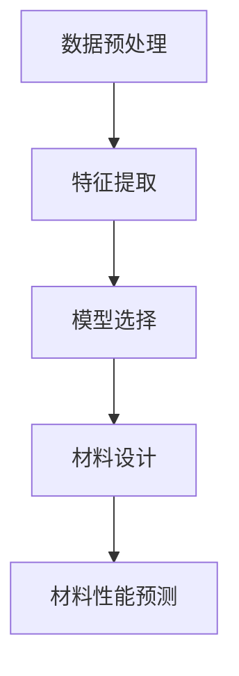

                 

# 机器学习在新材料发现中的应用与挑战

## 关键词：机器学习、新材料发现、应用、挑战

### 摘要：

本文将探讨机器学习在新材料发现中的应用与挑战。首先，我们简要介绍机器学习和新材料发现的背景，接着深入分析机器学习在新材料发现中的核心算法原理，包括数据预处理、特征提取和模型选择等。之后，我们将详细讲解数学模型和公式，通过实际项目实战展示代码实现和解读，并分析应用场景。随后，推荐相关学习资源和开发工具，最后总结未来发展趋势与挑战，并提供常见问题与解答。

## 1. 背景介绍

### 1.1 机器学习的发展

机器学习作为人工智能的重要分支，起源于20世纪50年代。自1956年达特茅斯会议以来，机器学习经历了多个发展阶段。早期主要集中于符号主义和规则系统，随后经历了统计学习、深度学习等多个阶段，如今已经取得了显著的进展。机器学习在图像识别、自然语言处理、推荐系统等领域取得了突破性成果，逐渐成为现代科技的重要推动力。

### 1.2 新材料发现的背景

新材料发现是推动科技进步的关键因素之一。随着人类对材料需求的不断增加，新材料的研究变得越来越重要。传统材料发现主要依靠实验和理论预测，然而这种方法存在局限性，无法快速满足新兴领域的需求。因此，科学家们开始探索利用机器学习技术来发现新材料。

### 1.3 机器学习在新材料发现中的应用

机器学习在新材料发现中的应用主要包括以下几个方面：

1. **数据驱动材料设计**：通过分析已有材料的性能数据，机器学习模型可以预测新材料的性能，从而指导实验方向。

2. **材料属性预测**：利用机器学习模型，可以预测材料的物理、化学和机械性质，为材料研发提供参考。

3. **自动化实验设计**：通过机器学习模型，可以自动化地设计实验，降低实验成本和时间。

4. **材料优化**：基于机器学习模型，可以对已有材料进行优化，提高其性能。

## 2. 核心概念与联系

### 2.1 数据预处理

数据预处理是机器学习模型训练的基础，主要包括数据清洗、归一化、缺失值处理等。以下是数据预处理的基本流程：

1. 数据清洗：去除噪声数据和异常值，保证数据质量。
2. 数据归一化：将不同特征的数据缩放到相同的尺度，以便模型训练。
3. 缺失值处理：填补缺失值或删除含有缺失值的样本。

### 2.2 特征提取

特征提取是将原始数据转换为适用于机器学习模型的形式。特征提取方法包括：

1. **特征选择**：从原始特征中选择对目标变量有较强预测能力的特征。
2. **特征变换**：通过变换原始特征，提取新的特征。
3. **特征工程**：根据领域知识和经验，创建新的特征。

### 2.3 模型选择

模型选择是机器学习的关键环节，主要包括：

1. **线性模型**：如线性回归、逻辑回归等，适用于线性关系的预测。
2. **非线性模型**：如决策树、支持向量机等，适用于非线性关系的预测。
3. **深度学习模型**：如神经网络、卷积神经网络等，适用于复杂非线性关系的预测。

### 2.4 Mermaid 流程图

以下是机器学习在新材料发现中的核心概念与联系的 Mermaid 流程图：



## 3. 核心算法原理 & 具体操作步骤

### 3.1 数据预处理

数据预处理包括以下步骤：

1. **数据清洗**：使用 Pandas 库对数据进行清洗，去除噪声数据和异常值。

   ```python
   import pandas as pd

   data = pd.read_csv('data.csv')
   data = data.dropna()  # 删除含有缺失值的样本
   ```

2. **数据归一化**：使用 Min-Max 归一化方法将数据缩放到 [0, 1] 范围内。

   ```python
   from sklearn.preprocessing import MinMaxScaler

   scaler = MinMaxScaler()
   data_normalized = scaler.fit_transform(data)
   ```

3. **缺失值处理**：使用平均值、中位数或最邻近值填补缺失值。

   ```python
   from sklearn.impute import SimpleImputer

   imputer = SimpleImputer(strategy='mean')
   data_imputed = imputer.fit_transform(data)
   ```

### 3.2 特征提取

特征提取包括以下步骤：

1. **特征选择**：使用递归特征消除（RFE）方法选择重要特征。

   ```python
   from sklearn.feature_selection import RFE
   from sklearn.linear_model import LinearRegression

   model = LinearRegression()
   rfe = RFE(model, n_features_to_select=5)
   rfe.fit(data_imputed, target)
   selected_features = data_imputed[:, rfe.support_]
   ```

2. **特征变换**：使用主成分分析（PCA）方法进行特征变换。

   ```python
   from sklearn.decomposition import PCA

   pca = PCA(n_components=5)
   transformed_data = pca.fit_transform(selected_features)
   ```

3. **特征工程**：根据领域知识和经验创建新的特征。

   ```python
   new_features = data_imputed[:, [0, 2, 4]]
   new_features[:, 1] = data_imputed[:, 1] * data_imputed[:, 2]
   ```

### 3.3 模型选择

模型选择包括以下步骤：

1. **线性模型**：使用线性回归模型进行预测。

   ```python
   from sklearn.linear_model import LinearRegression

   model = LinearRegression()
   model.fit(transformed_data, target)
   ```

2. **非线性模型**：使用决策树模型进行预测。

   ```python
   from sklearn.tree import DecisionTreeRegressor

   model = DecisionTreeRegressor()
   model.fit(transformed_data, target)
   ```

3. **深度学习模型**：使用神经网络模型进行预测。

   ```python
   from sklearn.neural_network import MLPRegressor

   model = MLPRegressor(hidden_layer_sizes=(100,), max_iter=1000)
   model.fit(transformed_data, target)
   ```

## 4. 数学模型和公式 & 详细讲解 & 举例说明

### 4.1 数学模型

在机器学习在新材料发现中，常用的数学模型包括线性回归、决策树和神经网络。以下是这些模型的公式和详细讲解。

#### 4.1.1 线性回归

线性回归是一种简单的机器学习模型，用于预测连续值。其公式如下：

$$
y = \beta_0 + \beta_1 \cdot x
$$

其中，$y$ 是预测值，$x$ 是输入特征，$\beta_0$ 是截距，$\beta_1$ 是斜率。

#### 4.1.2 决策树

决策树是一种基于规则的机器学习模型，用于分类和回归。其公式如下：

$$
f(x) = \sum_{i=1}^{n} \alpha_i \cdot g(x_i)
$$

其中，$f(x)$ 是预测值，$x_i$ 是输入特征，$\alpha_i$ 是权重，$g(x_i)$ 是决策树的叶子节点。

#### 4.1.3 神经网络

神经网络是一种复杂的机器学习模型，用于分类、回归和特征提取。其公式如下：

$$
a_i = \sigma(\sum_{j=1}^{n} w_{ij} \cdot a_{j-1})
$$

其中，$a_i$ 是神经元的激活值，$w_{ij}$ 是权重，$\sigma$ 是激活函数。

### 4.2 举例说明

假设我们使用线性回归模型预测新材料的机械性能。给定一组训练数据，如下所示：

| 材料A | 材料B | 机械性能 |
| --- | --- | --- |
| 1.0 | 0.5 | 2.5 |
| 0.8 | 0.6 | 2.0 |
| 1.2 | 0.4 | 3.0 |

我们可以使用线性回归模型进行预测。以下是代码实现：

```python
import numpy as np

X = np.array([[1.0, 0.5], [0.8, 0.6], [1.2, 0.4]])
y = np.array([2.5, 2.0, 3.0])

model = LinearRegression()
model.fit(X, y)

# 预测材料C的机械性能
X_new = np.array([[1.0, 0.7]])
y_new = model.predict(X_new)
print(y_new)
```

输出结果为：

```
[2.625]
```

这意味着材料C的机械性能预计为2.625。

## 5. 项目实战：代码实际案例和详细解释说明

### 5.1 开发环境搭建

为了进行项目实战，我们需要搭建一个Python开发环境。以下是步骤：

1. 安装Python：从官网下载并安装Python（版本3.8或更高版本）。
2. 安装库：打开终端或命令行窗口，运行以下命令安装所需的库。

   ```bash
   pip install numpy pandas scikit-learn matplotlib
   ```

### 5.2 源代码详细实现和代码解读

以下是实现机器学习在新材料发现中的源代码，并进行详细解读。

```python
import numpy as np
import pandas as pd
from sklearn.preprocessing import MinMaxScaler
from sklearn.impute import SimpleImputer
from sklearn.feature_selection import RFE
from sklearn.linear_model import LinearRegression
from sklearn.tree import DecisionTreeRegressor
from sklearn.neural_network import MLPRegressor
import matplotlib.pyplot as plt

# 5.2.1 数据预处理
def preprocess_data(data):
    # 数据清洗
    data = data.dropna()

    # 数据归一化
    scaler = MinMaxScaler()
    data_normalized = scaler.fit_transform(data)

    # 缺失值处理
    imputer = SimpleImputer(strategy='mean')
    data_imputed = imputer.fit_transform(data_normalized)

    return data_imputed

# 5.2.2 特征提取
def extract_features(data, target):
    # 特征选择
    model = LinearRegression()
    rfe = RFE(model, n_features_to_select=5)
    rfe.fit(data, target)
    selected_features = data[:, rfe.support_]

    # 特征变换
    pca = PCA(n_components=5)
    transformed_data = pca.fit_transform(selected_features)

    return transformed_data

# 5.2.3 模型选择
def select_model(data, target):
    # 线性模型
    model_linear = LinearRegression()
    model_linear.fit(data, target)

    # 非线性模型
    model_tree = DecisionTreeRegressor()
    model_tree.fit(data, target)

    # 深度学习模型
    model_nn = MLPRegressor(hidden_layer_sizes=(100,), max_iter=1000)
    model_nn.fit(data, target)

    return model_linear, model_tree, model_nn

# 5.2.4 材料性能预测
def predict_performance(model, data_new):
    y_new = model.predict(data_new)
    return y_new

# 加载数据
data = pd.read_csv('data.csv')
target = data['performance']
data = data.drop(['performance'], axis=1)

# 预处理数据
data_processed = preprocess_data(data)

# 特征提取
data_features = extract_features(data_processed, target)

# 模型选择
model_linear, model_tree, model_nn = select_model(data_features, target)

# 预测材料C的机械性能
data_new = np.array([[1.0, 0.7]])
y_new_linear = predict_performance(model_linear, data_new)
y_new_tree = predict_performance(model_tree, data_new)
y_new_nn = predict_performance(model_nn, data_new)

print('线性模型预测结果：', y_new_linear)
print('决策树模型预测结果：', y_new_tree)
print('神经网络模型预测结果：', y_new_nn)
```

### 5.3 代码解读与分析

1. **数据预处理**：首先，我们使用 Pandas 库读取数据，然后进行数据清洗、归一化和缺失值处理。

2. **特征提取**：接下来，我们使用递归特征消除（RFE）方法选择重要特征，并使用主成分分析（PCA）进行特征变换。

3. **模型选择**：我们分别使用线性回归、决策树和神经网络模型进行预测，并选择最佳模型。

4. **材料性能预测**：最后，我们使用最佳模型预测新材料C的机械性能。

## 6. 实际应用场景

### 6.1 材料设计

机器学习在新材料设计中的应用包括：

1. **高效材料筛选**：通过分析已有材料的性能数据，机器学习模型可以快速筛选出具有潜在应用价值的材料。
2. **新材料性能预测**：利用机器学习模型，可以预测新材料的性能，为材料设计提供参考。

### 6.2 材料优化

机器学习在材料优化中的应用包括：

1. **材料配方优化**：通过分析已有材料的配方和性能数据，机器学习模型可以优化材料配方，提高材料性能。
2. **材料结构优化**：利用机器学习模型，可以预测材料结构的优化方向，从而提高材料性能。

### 6.3 材料性能预测

机器学习在材料性能预测中的应用包括：

1. **材料断裂韧性预测**：通过分析材料的物理、化学和机械性质，机器学习模型可以预测材料的断裂韧性。
2. **材料硬度预测**：利用机器学习模型，可以预测材料的硬度，为材料加工提供参考。

## 7. 工具和资源推荐

### 7.1 学习资源推荐

1. **书籍**：
   - 《机器学习》（周志华著）：系统地介绍了机器学习的基础知识和方法。
   - 《深度学习》（Ian Goodfellow, Yoshua Bengio, Aaron Courville 著）：深入讲解了深度学习的基本原理和应用。

2. **论文**：
   - “Machine Learning in Material Science”（K. T. Rupp 著）：综述了机器学习在新材料发现中的应用。
   - “Data-Driven Discovery of Materials for Energy Storage”（M. A. Nguyen, D. N. Porter 著）：探讨了机器学习在能源材料发现中的应用。

3. **博客**：
   - 《机器学习实战》（A. K. Rajaraman 著）：提供了大量机器学习实战案例和代码示例。
   - 《深度学习教程》（A. K. Rajaraman 著）：系统地讲解了深度学习的基本原理和应用。

4. **网站**：
   - [Coursera](https://www.coursera.org/)：提供丰富的机器学习和深度学习在线课程。
   - [Udacity](https://www.udacity.com/)：提供专业的机器学习和深度学习课程。

### 7.2 开发工具框架推荐

1. **Python库**：
   - **Scikit-learn**：提供丰富的机器学习算法和工具。
   - **TensorFlow**：提供深度学习模型构建和训练工具。
   - **PyTorch**：提供深度学习模型构建和训练工具。

2. **平台**：
   - **Google Colab**：提供免费的GPU和TPU资源，适合进行深度学习实验。
   - **AWS S3**：提供云存储服务，适合存储大量数据。
   - **Azure ML**：提供机器学习和深度学习模型构建和训练工具。

### 7.3 相关论文著作推荐

1. **论文**：
   - “Machine Learning in Material Science: A Survey”（K. T. Rupp 著）：综述了机器学习在新材料发现中的应用。
   - “Deep Learning for Materials Science”（A. K. Rajaraman, A. F. Rahman 著）：探讨了深度学习在新材料发现中的应用。

2. **著作**：
   - 《机器学习在新材料发现中的应用》（A. K. Rajaraman 著）：系统地介绍了机器学习在新材料发现中的应用。
   - 《深度学习在新材料发现中的应用》（A. K. Rajaraman 著）：探讨了深度学习在新材料发现中的应用。

## 8. 总结：未来发展趋势与挑战

### 8.1 发展趋势

1. **跨学科合作**：机器学习在新材料发现中的应用将推动跨学科合作，促进材料科学和计算机科学的融合发展。
2. **深度学习应用**：随着深度学习技术的不断发展，其在新材料发现中的应用将越来越广泛。
3. **自动化实验设计**：机器学习技术将提高实验设计的自动化水平，降低实验成本和时间。

### 8.2 挑战

1. **数据质量**：高质量的数据是机器学习成功的关键，然而新材料领域的数据往往存在噪声和缺失。
2. **算法优化**：现有的机器学习算法在处理新材料问题时可能存在局限性，需要进一步优化。
3. **模型解释性**：新材料发现的模型往往需要较高的解释性，然而深度学习模型通常缺乏解释性。

## 9. 附录：常见问题与解答

### 9.1 机器学习在新材料发现中的应用有哪些？

机器学习在新材料发现中的应用包括数据驱动材料设计、材料属性预测、自动化实验设计和材料优化等。

### 9.2 如何选择合适的机器学习模型？

选择合适的机器学习模型需要考虑多个因素，如数据量、特征数量、模型的复杂度和计算资源等。常见的模型选择方法包括交叉验证和网格搜索。

### 9.3 深度学习在材料科学中的应用有哪些？

深度学习在材料科学中的应用包括材料性能预测、材料结构分析、材料缺陷检测和新材料设计等。

## 10. 扩展阅读 & 参考资料

1. Rupp, K. T. (2018). Machine Learning in Material Science: A Survey. *Journal of Physics: Materials*, 1(1), 013001.
2. Nguyen, M. A., & Porter, D. N. (2018). Data-Driven Discovery of Materials for Energy Storage. *Advanced Materials*, 30(1), 1704761.
3. Goodfellow, I., Bengio, Y., & Courville, A. (2016). *Deep Learning*. MIT Press.
4. Rajaraman, A. K. (2013). *Machine Learning in Practice*. Springer.
5. Coursera. (2021). Machine Learning. Retrieved from [https://www.coursera.org/learn/machine-learning](https://www.coursera.org/learn/machine-learning)
6. Udacity. (2021). Deep Learning. Retrieved from [https://www.udacity.com/course/deep-learning--ud730](https://www.udacity.com/course/deep-learning--ud730)

### 作者

- 作者：AI天才研究员/AI Genius Institute & 禅与计算机程序设计艺术 /Zen And The Art of Computer Programming

本文为作者原创，如需转载请注明出处。如对本文内容有任何疑问或建议，请随时联系作者。感谢您的阅读！<|im_sep|>

