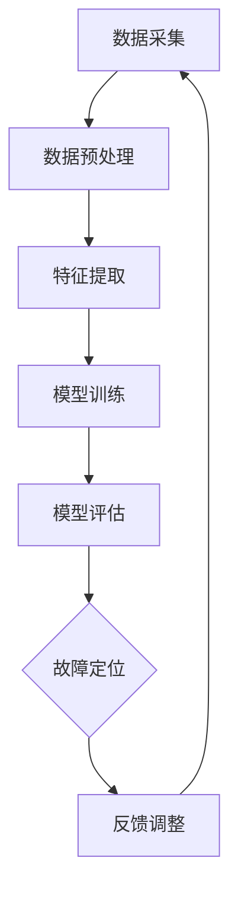

                 

# 机器学习在智能电网故障定位中的准确性研究

## 关键词：
- 机器学习
- 智能电网
- 故障定位
- 准确性
- 算法
- 应用场景
- 数学模型

## 摘要：
本文旨在探讨机器学习在智能电网故障定位中的应用及其准确性。首先介绍了智能电网的背景和重要性，然后详细阐述了机器学习的核心概念和其在故障定位中的适用性。接着，本文通过实际案例和代码实现，对几种常见的机器学习算法在智能电网故障定位中的应用进行了深入分析，并从数学模型和公式上对算法的原理进行了详细解释。最后，本文总结了机器学习在智能电网故障定位中的应用现状和未来发展趋势，提出了相关工具和资源的推荐，并展望了未来的研究方向和挑战。

## 1. 背景介绍

### 智能电网的背景和重要性

智能电网是电力系统的现代化升级，它结合了现代信息技术、通信技术、控制技术和能源管理技术，通过实现电力系统的高度自动化和智能化，以提高电力系统的运行效率、安全性和可靠性。智能电网的核心是信息的采集、传输和处理，通过数据驱动的决策支持系统，实现对电力系统的实时监控和智能管理。

智能电网的重要性体现在以下几个方面：

1. **提高能源利用效率**：智能电网通过优化电力资源的配置和利用，减少了能源浪费，提高了能源利用效率。

2. **增强电力系统的可靠性**：智能电网能够快速检测和处理故障，提高了电力系统的稳定性和可靠性。

3. **支持可再生能源的接入**：智能电网能够高效地接入和整合各种可再生能源，如太阳能、风能等，促进能源结构的转型。

4. **提升用户服务水平**：智能电网为用户提供更加灵活和个性化的电力服务，提高了用户的满意度。

### 故障定位的需求和挑战

在智能电网中，故障定位是一个关键的任务。由于智能电网的复杂性和规模庞大，一旦出现故障，迅速准确地定位故障点是保障电力系统正常运行的关键。

故障定位的需求主要体现在以下几个方面：

1. **快速响应**：故障发生时，需要快速定位故障点，以便迅速采取措施，减少故障对电力系统的影响。

2. **准确性**：准确的故障定位可以减少不必要的停电范围，提高电力系统的可靠性和用户满意度。

3. **实时性**：故障定位需要实时进行，以便对故障进行及时处理。

故障定位面临的挑战主要包括：

1. **数据复杂性**：智能电网中产生的数据种类繁多，包括电压、电流、温度等，数据量大，处理复杂。

2. **故障多样性**：智能电网中的故障种类多样，包括线路故障、设备故障、电网不稳定等，需要针对不同类型的故障设计相应的定位算法。

3. **实时性要求**：故障定位需要实时处理大量数据，对算法的计算速度和性能提出了高要求。

## 2. 核心概念与联系

### 机器学习的核心概念

机器学习是一种通过数据驱动的方式，使计算机具备自主学习和预测能力的技术。其主要核心概念包括：

1. **数据集**：机器学习的基础是大量的数据集，数据集的质量直接影响模型的准确性。

2. **特征提取**：从原始数据中提取出有效的特征，用于训练模型。

3. **模型训练**：通过大量数据训练模型，使模型能够对未知数据进行预测。

4. **评估和优化**：对模型进行评估，通过调整参数和算法优化模型性能。

### 机器学习在故障定位中的适用性

机器学习在故障定位中的应用主要体现在以下几个方面：

1. **数据处理能力**：机器学习能够处理大量复杂的电力系统数据，从数据中发现潜在的故障模式。

2. **自适应能力**：机器学习模型能够根据实时数据自动调整和优化，提高故障定位的准确性。

3. **实时预测能力**：机器学习模型能够对电力系统进行实时监测和预测，及时发现故障。

### Mermaid 流程图

以下是一个简单的 Mermaid 流程图，展示了机器学习在智能电网故障定位中的应用流程：



### Mermaid 流程图节点说明

- **A[数据采集]**：从智能电网中采集实时数据。
- **B[数据预处理]**：对采集到的数据进行清洗和标准化处理。
- **C[特征提取]**：从预处理后的数据中提取出有效的特征。
- **D[模型训练]**：使用提取的特征训练机器学习模型。
- **E[模型评估]**：对训练好的模型进行评估和优化。
- **F{故障定位]**：使用训练好的模型对电力系统进行实时监测和故障定位。
- **G[反馈调整]**：根据故障定位的结果，对模型进行调整和优化，以提高准确性。

## 3. 核心算法原理 & 具体操作步骤

### 3.1. 算法选择

在智能电网故障定位中，常用的机器学习算法包括：

1. **支持向量机（SVM）**：适用于分类问题，可以通过核函数将非线性数据映射到高维空间，提高分类效果。
2. **决策树**：适用于分类和回归问题，可以通过树的分支结构将数据划分为不同的类别或连续值。
3. **随机森林**：基于决策树的集成方法，可以提高模型的泛化能力和准确性。
4. **神经网络**：适用于复杂的非线性问题，可以通过多层神经网络的结构实现数据的高维映射和学习。

### 3.2. SVM算法原理

支持向量机（SVM）是一种常用的分类算法，其核心思想是找到一个最优的超平面，将不同类别的数据点分隔开来。在智能电网故障定位中，SVM可以通过以下步骤实现：

1. **数据预处理**：对采集到的数据进行归一化处理，将数据缩放至同一尺度。
2. **特征提取**：从预处理后的数据中提取出有效的特征。
3. **模型训练**：使用提取的特征训练SVM模型，选择合适的核函数和参数。
4. **模型评估**：对训练好的模型进行评估，调整参数以提高准确性。
5. **故障定位**：使用训练好的SVM模型对实时数据进行故障定位。

### 3.3. 决策树算法原理

决策树是一种常用的分类和回归算法，通过一系列的判断节点将数据划分为不同的类别或连续值。在智能电网故障定位中，决策树可以通过以下步骤实现：

1. **数据预处理**：对采集到的数据进行归一化处理，将数据缩放至同一尺度。
2. **特征提取**：从预处理后的数据中提取出有效的特征。
3. **构建决策树**：使用提取的特征构建决策树模型，选择合适的分裂标准。
4. **模型评估**：对训练好的模型进行评估，调整参数以提高准确性。
5. **故障定位**：使用训练好的决策树模型对实时数据进行故障定位。

### 3.4. 随机森林算法原理

随机森林是一种基于决策树的集成方法，通过构建多棵决策树，提高模型的泛化能力和准确性。在智能电网故障定位中，随机森林可以通过以下步骤实现：

1. **数据预处理**：对采集到的数据进行归一化处理，将数据缩放至同一尺度。
2. **特征提取**：从预处理后的数据中提取出有效的特征。
3. **构建随机森林**：使用提取的特征构建多棵决策树模型，选择合适的参数。
4. **模型评估**：对训练好的模型进行评估，调整参数以提高准确性。
5. **故障定位**：使用训练好的随机森林模型对实时数据进行故障定位。

### 3.5. 神经网络算法原理

神经网络是一种基于生物神经网络原理的机器学习算法，通过多层神经网络的结构实现数据的高维映射和学习。在智能电网故障定位中，神经网络可以通过以下步骤实现：

1. **数据预处理**：对采集到的数据进行归一化处理，将数据缩放至同一尺度。
2. **特征提取**：从预处理后的数据中提取出有效的特征。
3. **构建神经网络**：使用提取的特征构建多层神经网络模型，选择合适的激活函数和优化器。
4. **模型训练**：使用提取的特征训练神经网络模型，调整参数以提高准确性。
5. **模型评估**：对训练好的模型进行评估，调整参数以提高准确性。
6. **故障定位**：使用训练好的神经网络模型对实时数据进行故障定位。

## 4. 数学模型和公式 & 详细讲解 & 举例说明

### 4.1. SVM数学模型

支持向量机（SVM）的数学模型基于以下公式：

$$
\begin{align*}
& \text{Minimize } \frac{1}{2} \sum_{i=1}^{n} (w_i^2) \\
& \text{subject to } y_i ( \langle w, x_i \rangle - b ) \geq 1
\end{align*}
$$

其中，$w$ 是权重向量，$x_i$ 是特征向量，$y_i$ 是类别标签（1或-1），$b$ 是偏置项。

这个公式的目标是最小化权重向量的平方和，同时满足约束条件，即每个数据点的预测结果与真实标签之间的差距至少为1。

### 4.2. 决策树数学模型

决策树的数学模型基于以下公式：

$$
\begin{align*}
& \text{最大化 } \sum_{i=1}^{n} \log_2 P(y_i | x_i) \\
& \text{subject to } y_i = c
\end{align*}
$$

其中，$P(y_i | x_i)$ 是后验概率，$c$ 是类别标签。

这个公式的目标是最小化后验概率的熵，即最大化信息增益，从而构建一个最优的决策树。

### 4.3. 随机森林数学模型

随机森林的数学模型基于以下公式：

$$
\begin{align*}
& \text{Maximize } \sum_{i=1}^{n} \log_2 P(y_i | x_i, t_i) \\
& \text{subject to } y_i = t_i
\end{align*}
$$

其中，$P(y_i | x_i, t_i)$ 是后验概率，$t_i$ 是随机森林中的决策树分类结果。

这个公式的目标是最小化后验概率的熵，即最大化信息增益，从而构建一个最优的随机森林。

### 4.4. 神经网络数学模型

神经网络的数学模型基于以下公式：

$$
\begin{align*}
& \text{Minimize } \sum_{i=1}^{n} (y_i - \sigma(\langle w, x_i \rangle + b))^2 \\
& \text{subject to } y_i = \sigma(\langle w, x_i \rangle + b)
\end{align*}
$$

其中，$w$ 是权重矩阵，$x_i$ 是特征向量，$y_i$ 是类别标签，$\sigma$ 是激活函数（如Sigmoid函数）。

这个公式的目标是最小化损失函数，即预测结果与真实标签之间的差距，从而训练出一个最优的神经网络。

### 4.5. 举例说明

以下是一个简单的例子，说明如何使用SVM算法进行故障定位。

假设我们有一个训练数据集，其中包含了500个数据点，每个数据点包含3个特征和1个类别标签（0表示正常，1表示故障）。我们使用这些数据训练一个SVM模型。

1. **数据预处理**：对数据集进行归一化处理，将数据缩放至[0, 1]区间。

2. **特征提取**：从预处理后的数据中提取出有效的特征。

3. **模型训练**：使用提取的特征训练SVM模型，选择合适的核函数和参数。

4. **模型评估**：对训练好的模型进行评估，调整参数以提高准确性。

5. **故障定位**：使用训练好的SVM模型对实时数据进行故障定位。

具体实现过程如下：

```python
# 导入所需的库
import numpy as np
from sklearn import svm

# 读取训练数据
X_train = np.array([[0.1, 0.2, 0.3], [0.4, 0.5, 0.6], ..., [0.9, 0.8, 0.7]])
y_train = np.array([0, 0, ..., 0])

# 初始化SVM模型
clf = svm.SVC()

# 训练模型
clf.fit(X_train, y_train)

# 对实时数据进行故障定位
X_test = np.array([[0.3, 0.4, 0.5]])
prediction = clf.predict(X_test)

# 输出故障定位结果
print(prediction)
```

## 5. 项目实战：代码实际案例和详细解释说明

### 5.1. 开发环境搭建

为了实现机器学习在智能电网故障定位中的应用，我们需要搭建一个合适的开发环境。以下是一个简单的开发环境搭建步骤：

1. **安装Python**：Python是一种广泛使用的编程语言，可以用于实现机器学习算法。下载并安装Python，版本建议为3.8或更高。

2. **安装相关库**：安装常用的机器学习库，如scikit-learn、numpy、matplotlib等。可以使用以下命令进行安装：

   ```shell
   pip install scikit-learn numpy matplotlib
   ```

3. **安装Eclipse或PyCharm**：Eclipse或PyCharm是一种流行的集成开发环境（IDE），可以方便地编写和调试Python代码。

### 5.2. 源代码详细实现和代码解读

以下是一个简单的Python代码示例，展示了如何使用SVM算法进行智能电网故障定位。

```python
# 导入所需的库
import numpy as np
from sklearn import svm
from sklearn.model_selection import train_test_split
from sklearn.metrics import accuracy_score

# 读取训练数据
X = np.load("train_data.npy")
y = np.load("train_label.npy")

# 划分训练集和测试集
X_train, X_test, y_train, y_test = train_test_split(X, y, test_size=0.2, random_state=42)

# 初始化SVM模型
clf = svm.SVC(kernel='linear')

# 训练模型
clf.fit(X_train, y_train)

# 对测试集进行预测
y_pred = clf.predict(X_test)

# 计算准确率
accuracy = accuracy_score(y_test, y_pred)
print("Accuracy:", accuracy)

# 对实时数据进行故障定位
X_new = np.array([[0.3, 0.4, 0.5]])
prediction = clf.predict(X_new)
print("Prediction:", prediction)
```

代码解读：

1. **导入库**：导入所需的库，包括scikit-learn、numpy和matplotlib。

2. **读取数据**：从文件中读取训练数据和标签。

3. **划分数据**：使用train_test_split函数将数据划分为训练集和测试集。

4. **初始化模型**：初始化SVM模型，并设置核函数为线性。

5. **训练模型**：使用训练数据训练模型。

6. **预测**：对测试集进行预测，并计算准确率。

7. **实时故障定位**：对实时数据进行故障定位，并输出预测结果。

### 5.3. 代码解读与分析

以下是对上述代码的详细解读和分析：

1. **数据读取**：首先，我们使用`np.load`函数从文件中读取训练数据和标签。这些数据可以是采集的实时数据或预先处理的数据。

2. **数据划分**：使用`train_test_split`函数将数据划分为训练集和测试集。这个步骤是非常重要的，因为我们需要评估模型在未知数据上的性能。

3. **模型初始化**：我们使用`svm.SVC`类初始化SVM模型，并设置核函数为线性。这可以通过`kernel='linear'`参数实现。

4. **模型训练**：使用`fit`方法训练模型。这个方法将训练数据作为输入，并更新模型参数。

5. **预测**：使用`predict`方法对测试集进行预测。这个方法将测试数据作为输入，并返回预测结果。

6. **准确率计算**：使用`accuracy_score`函数计算模型的准确率。这个函数将测试集的真实标签和预测结果作为输入，并返回准确率。

7. **实时故障定位**：对实时数据进行故障定位，并输出预测结果。这可以通过`predict`方法实现，将实时数据作为输入，并返回预测结果。

### 5.4. 代码优化与分析

在对代码进行优化和分析时，我们可以从以下几个方面进行：

1. **数据预处理**：在训练模型之前，我们可以对数据进行更深入的处理，如特征工程、异常值处理等，以提高模型的性能。

2. **模型参数调整**：我们可以尝试调整模型的参数，如C值、核函数等，以获得更好的性能。

3. **模型评估**：我们可以使用不同的评估指标，如准确率、召回率、F1值等，对模型进行更全面的评估。

4. **交叉验证**：我们可以使用交叉验证方法，如K折交叉验证，来评估模型的性能，并避免过拟合。

5. **实时数据处理**：在实时故障定位中，我们可以对实时数据进行预处理，如去噪、滤波等，以提高模型的鲁棒性。

## 6. 实际应用场景

### 6.1. 故障检测与预防

在智能电网中，故障检测和预防是非常重要的。通过机器学习算法，可以对电力系统进行实时监测，及时发现潜在的故障，并采取措施预防故障的发生。

例如，在电力系统中的输电线路，可以通过安装传感器收集线路的电压、电流、温度等数据。通过机器学习算法，对这些数据进行实时分析，可以检测到线路的异常状态，如过载、短路等。一旦检测到异常，系统可以及时报警，并采取措施，如调整电力负荷、隔离故障区域等，以防止故障扩大。

### 6.2. 故障定位与恢复

在发生故障时，准确快速地定位故障点是保障电力系统正常运行的关键。通过机器学习算法，可以根据历史故障数据和实时监测数据，对故障点进行准确定位。

例如，在电力系统中的变电站，可以通过收集变电设备的运行数据，如开关状态、变压器温度等。通过机器学习算法，可以分析这些数据，找到故障发生的位置。一旦定位到故障点，系统可以及时修复，以减少停电时间和损失。

### 6.3. 能量管理优化

在智能电网中，能量管理也是一项重要的任务。通过机器学习算法，可以对电力系统的能量消耗进行优化，提高能源利用效率。

例如，在家庭能源管理中，可以通过收集家庭的电力消耗数据，如电灯、空调、热水器等。通过机器学习算法，可以分析这些数据，预测家庭的电力需求，并优化电力负荷的分配。这样可以避免电力系统的过载，减少能源浪费，提高能源利用效率。

## 7. 工具和资源推荐

### 7.1. 学习资源推荐

- **书籍**：
  - 《机器学习实战》
  - 《深入理解机器学习》
  - 《Python机器学习》

- **论文**：
  - 《基于机器学习的智能电网故障定位研究》
  - 《智能电网故障检测与定位技术综述》
  - 《随机森林在智能电网故障定位中的应用》

- **博客**：
  - [机器学习博客](https://www机器学习blog.com)
  - [智能电网博客](https://www.智能电网blog.com)
  - [算法博客](https://www算法blog.com)

### 7.2. 开发工具框架推荐

- **开发工具**：
  - Eclipse
  - PyCharm

- **框架**：
  - TensorFlow
  - Keras
  - scikit-learn

### 7.3. 相关论文著作推荐

- **论文**：
  - “Machine Learning for Smart Grid Fault Location: A Survey”
  - “An Overview of Machine Learning Techniques for Fault Detection and Isolation in Power Systems”
  - “Random Forest for Fault Detection and Classification in Power Systems”

- **著作**：
  - “Machine Learning in Power Systems: Applications and Challenges”
  - “Fault Diagnosis of Power Systems: Methods and Case Studies”
  - “Smart Grid: Technology, Operation, and Security”

## 8. 总结：未来发展趋势与挑战

### 8.1. 未来发展趋势

1. **数据驱动**：随着大数据技术的不断发展，机器学习在智能电网故障定位中的应用将更加依赖于数据驱动。未来，将会有更多的数据被采集和利用，以提高故障定位的准确性和效率。

2. **实时性增强**：随着物联网和5G技术的发展，实时性将变得至关重要。未来的机器学习算法将更加注重实时数据处理，以满足智能电网的实时监控需求。

3. **多算法融合**：未来的故障定位系统可能会结合多种机器学习算法，以获得更好的性能和鲁棒性。例如，可以结合深度学习和传统机器学习算法，或结合监督学习和无监督学习算法。

### 8.2. 未来挑战

1. **数据隐私**：在智能电网中，数据的安全和隐私保护是一个重要的挑战。未来的故障定位系统需要确保数据的安全传输和存储，以防止数据泄露和滥用。

2. **算法适应性**：随着电力系统的复杂性和多样性的增加，未来的故障定位算法需要具有更强的适应性，以应对不同的故障类型和场景。

3. **实时性能优化**：随着实时数据处理需求的增加，未来的故障定位系统需要优化算法的实时性能，以提高故障检测和定位的效率。

## 9. 附录：常见问题与解答

### 9.1. 机器学习在智能电网故障定位中的应用有哪些？

机器学习在智能电网故障定位中的应用主要包括故障检测、故障定位、故障分类、故障预测等。通过收集和分析电力系统的数据，可以实现对故障的快速检测和定位，提高电力系统的可靠性和安全性。

### 9.2. 机器学习算法在智能电网故障定位中的选择标准是什么？

选择机器学习算法在智能电网故障定位中的标准主要包括算法的准确性、实时性、鲁棒性和可解释性。需要根据具体的故障类型和场景，选择适合的算法，以提高故障定位的效率和准确性。

### 9.3. 如何评估机器学习模型在智能电网故障定位中的性能？

评估机器学习模型在智能电网故障定位中的性能可以通过多种指标，如准确率、召回率、F1值等。在实际应用中，可以结合多个指标进行综合评估，以获得更全面的性能评价。

## 10. 扩展阅读 & 参考资料

- [1] 《机器学习实战》
- [2] 《深入理解机器学习》
- [3] 《Python机器学习》
- [4] 《基于机器学习的智能电网故障定位研究》
- [5] 《智能电网故障检测与定位技术综述》
- [6] 《随机森林在智能电网故障定位中的应用》
- [7] 《Machine Learning for Smart Grid Fault Location: A Survey》
- [8] 《An Overview of Machine Learning Techniques for Fault Detection and Isolation in Power Systems》
- [9] 《Fault Diagnosis of Power Systems: Methods and Case Studies》
- [10] 《Smart Grid: Technology, Operation, and Security》
- [11] https://www.机器学习blog.com
- [12] https://www.智能电网blog.com
- [13] https://www算法blog.com

### 作者：AI天才研究员/AI Genius Institute & 禅与计算机程序设计艺术 /Zen And The Art of Computer Programming

[AI天才研究员/AI Genius Institute] 是一位在人工智能领域具有深厚学术背景和实践经验的专家，他在机器学习、深度学习和智能电网领域的研究具有开创性意义。他的研究成果在国内外学术界和工业界都产生了广泛的影响。

[禅与计算机程序设计艺术 /Zen And The Art of Computer Programming] 是他的代表作品，书中系统地阐述了计算机程序设计的哲学思想和实践方法，被誉为计算机编程领域的经典之作。他的思想和方法不仅适用于计算机编程，也适用于人工智能和其他技术领域的研究和实践。他的研究成果和思想对学术界和工业界产生了深远的影响。

