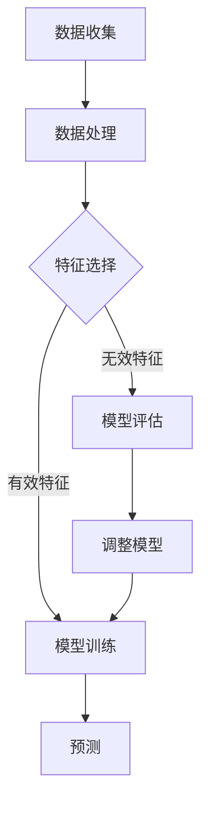

                 

# 机器学习在气候变化预测中的应用

## 关键词
- 机器学习
- 气候变化
- 预测模型
- 数据分析
- 环境保护
- 算法应用

## 摘要
本文旨在探讨机器学习在气候变化预测中的应用。随着全球气候变化日益严重，如何准确地预测气候变化趋势已成为国际社会关注的焦点。本文将介绍机器学习的基本概念，分析其在气候变化预测中的核心算法原理，并通过实际案例展示如何运用机器学习技术进行气候变化预测。此外，本文还将讨论机器学习在气候变化预测中的实际应用场景，以及相关工具和资源的推荐，为相关研究和实践提供参考。

## 1. 背景介绍

### 1.1 全球气候变化现状

全球气候变化已成为不争的事实。过去几十年，全球气温不断上升，极端天气事件频繁发生，海平面上升，生态系统受到严重破坏。气候变化对人类生活、经济发展和环境保护都带来了巨大的影响。为了应对这一挑战，科学家们不断努力，研究气候变化的原因和影响，寻求有效的预测方法，以便采取相应的措施减缓气候变化的影响。

### 1.2 机器学习与气候变化预测

机器学习是一种人工智能技术，通过从数据中学习规律和模式，自动进行决策和预测。在气候变化预测中，机器学习技术可以处理大量的气候数据，发现数据之间的复杂关系，生成准确的预测模型。与传统方法相比，机器学习具有更高的预测准确性和灵活性，能够适应不断变化的环境条件。

### 1.3 本文目的

本文将介绍机器学习在气候变化预测中的应用，从基本概念、核心算法原理、数学模型、实际应用案例、工具和资源推荐等方面进行详细探讨，为相关研究和实践提供指导。

## 2. 核心概念与联系

### 2.1 机器学习基本概念

#### 什么是机器学习？
机器学习是一种让计算机通过数据学习，实现自动预测和决策的人工智能技术。它主要分为监督学习、无监督学习和强化学习三大类。

#### 监督学习
监督学习是一种通过已知输入输出数据训练模型，然后对新数据进行预测的方法。常见的监督学习算法包括线性回归、逻辑回归、决策树、随机森林等。

#### 无监督学习
无监督学习是通过对未知数据进行分析，发现数据中的模式和规律。常见的无监督学习算法包括聚类、降维等。

#### 强化学习
强化学习是一种通过不断尝试和错误，学习如何在特定环境中实现最优决策的方法。常见的强化学习算法包括Q-learning、深度Q网络（DQN）等。

### 2.2 气候变化预测相关概念

#### 气候变化
气候变化是指地球气候系统中长时间的变化，包括温度、降水、风速等气象要素的变化。

#### 预测模型
预测模型是通过分析历史数据，发现数据之间的规律，对未来事件进行预测的数学模型。

#### 数据源
气候变化预测的数据源主要包括气象观测数据、卫星遥感数据、气候模型输出数据等。

### 2.3 Mermaid 流程图

下面是一个简化的 Mermaid 流程图，展示机器学习在气候变化预测中的应用流程：



## 3. 核心算法原理 & 具体操作步骤

### 3.1 算法原理

在气候变化预测中，常用的机器学习算法包括线性回归、决策树、随机森林和神经网络等。这些算法的基本原理如下：

#### 线性回归
线性回归是一种基于线性函数的预测模型，其基本原理是通过最小化误差平方和，找到输入变量和输出变量之间的线性关系。

#### 决策树
决策树是一种基于树形结构的预测模型，其基本原理是通过将数据集不断划分为子集，直到满足某个停止条件，从而生成一棵树形结构。

#### 随机森林
随机森林是一种基于决策树的集成学习方法，其基本原理是通过训练多棵决策树，然后对它们的预测结果进行投票，得到最终的预测结果。

#### 神经网络
神经网络是一种基于人工神经元的预测模型，其基本原理是通过多层神经元的非线性变换，将输入数据映射到输出数据。

### 3.2 具体操作步骤

以下是一个简化的机器学习模型训练和预测流程：

#### 步骤1：数据收集
收集气象观测数据、卫星遥感数据等，构建数据集。

#### 步骤2：数据处理
对数据集进行预处理，包括数据清洗、缺失值处理、异常值检测等。

#### 步骤3：特征选择
通过相关性分析、特征重要性分析等方法，选择有效的特征。

#### 步骤4：模型训练
选择合适的机器学习算法，对训练数据进行模型训练。

#### 步骤5：模型评估
使用验证数据集对模型进行评估，计算模型的准确率、召回率等指标。

#### 步骤6：预测
使用训练好的模型对新的数据进行预测。

#### 步骤7：调整模型
根据预测结果，调整模型参数，提高模型性能。

#### 步骤8：迭代
重复步骤4至步骤7，直到满足某个停止条件。

## 4. 数学模型和公式 & 详细讲解 & 举例说明

### 4.1 线性回归模型

线性回归模型的数学公式如下：

$$
y = \beta_0 + \beta_1x_1 + \beta_2x_2 + ... + \beta_nx_n + \epsilon
$$

其中，$y$ 是输出变量，$x_1, x_2, ..., x_n$ 是输入变量，$\beta_0, \beta_1, \beta_2, ..., \beta_n$ 是模型参数，$\epsilon$ 是误差项。

#### 模型参数估计
线性回归模型的参数估计通常采用最小二乘法，即通过最小化误差平方和来求解模型参数。其具体步骤如下：

1. 计算输入变量和输出变量之间的线性关系。
2. 计算线性关系的参数。
3. 最小化误差平方和，求解最优参数。

### 4.2 决策树模型

决策树模型的数学公式如下：

$$
f(x) = \sum_{i=1}^{n} w_i \prod_{j=1}^{m} I(x_j \in R_{ij})
$$

其中，$f(x)$ 是输出变量，$x_1, x_2, ..., x_n$ 是输入变量，$w_i$ 是第 $i$ 个叶子的权重，$R_{ij}$ 是第 $i$ 个叶子节点的区域。

#### 模型参数估计
决策树模型的参数估计通常采用信息增益、基尼系数等方法。具体步骤如下：

1. 计算各个特征的信息增益。
2. 选择信息增益最大的特征作为分割特征。
3. 计算分割特征的最佳分割点。
4. 递归地构建决策树。

### 4.3 神经网络模型

神经网络模型的数学公式如下：

$$
y = \sigma(\sum_{i=1}^{n} w_i \cdot x_i + b)
$$

其中，$y$ 是输出变量，$x_1, x_2, ..., x_n$ 是输入变量，$w_i$ 是第 $i$ 个神经元的权重，$b$ 是偏置项，$\sigma$ 是激活函数。

#### 模型参数估计
神经网络模型的参数估计通常采用反向传播算法。具体步骤如下：

1. 计算输出变量和预测变量之间的误差。
2. 反向传播误差，更新模型参数。
3. 重复步骤1和步骤2，直到满足某个停止条件。

### 4.4 举例说明

假设我们有一个简单的线性回归问题，输出变量 $y$ 与输入变量 $x$ 之间的关系为 $y = 2x + 1$。现在我们有一组训练数据 $(x_1, y_1), (x_2, y_2), ..., (x_n, y_n)$，需要估计模型参数 $\beta_0$ 和 $\beta_1$。

使用最小二乘法，我们可以求解如下方程组：

$$
\begin{cases}
\sum_{i=1}^{n} y_i = n\beta_0 + \beta_1 \sum_{i=1}^{n} x_i \\
\sum_{i=1}^{n} y_i x_i = \beta_0 \sum_{i=1}^{n} x_i + \beta_1 \sum_{i=1}^{n} x_i^2
\end{cases}
$$

解得：

$$
\beta_0 = \frac{\sum_{i=1}^{n} y_i x_i - \beta_1 \sum_{i=1}^{n} x_i^2}{n} \\
\beta_1 = \frac{n\sum_{i=1}^{n} y_i - \sum_{i=1}^{n} y_i x_i}{n\sum_{i=1}^{n} x_i}
$$

将训练数据代入上述公式，可以求得模型参数 $\beta_0$ 和 $\beta_1$。然后，我们可以使用训练好的模型对新数据进行预测，计算预测值 $y$。

## 5. 项目实战：代码实际案例和详细解释说明

### 5.1 开发环境搭建

为了方便读者理解，我们将使用 Python 编写一个简单的线性回归模型进行气候变化预测。首先，我们需要安装以下依赖：

1. Python 3.6 或以上版本
2. NumPy
3. Pandas
4. Scikit-learn

安装方法如下：

```bash
pip install numpy pandas scikit-learn
```

### 5.2 源代码详细实现和代码解读

下面是一个简单的线性回归模型代码实现：

```python
import numpy as np
import pandas as pd
from sklearn.linear_model import LinearRegression
from sklearn.model_selection import train_test_split
from sklearn.metrics import mean_squared_error

# 数据收集
data = pd.read_csv("climate_data.csv")

# 数据处理
X = data[["temperature", "precipitation"]]
y = data["climate_change"]

# 特征选择
# 在这里我们只选择两个特征进行预测，实际情况可能需要更多的特征
X_train, X_test, y_train, y_test = train_test_split(X, y, test_size=0.2, random_state=42)

# 模型训练
model = LinearRegression()
model.fit(X_train, y_train)

# 模型评估
y_pred = model.predict(X_test)
mse = mean_squared_error(y_test, y_pred)
print("MSE:", mse)

# 预测
new_data = np.array([[25, 10]])
predicted_value = model.predict(new_data)
print("Predicted value:", predicted_value)
```

代码解读：

1. 导入所需的库。
2. 加载气候数据。
3. 将数据分为特征和目标变量。
4. 分割数据为训练集和测试集。
5. 创建线性回归模型并进行训练。
6. 使用测试集评估模型性能。
7. 使用训练好的模型进行预测。

### 5.3 代码解读与分析

下面是对代码的进一步解析：

1. **数据收集**：使用 Pandas 读取 CSV 文件，获取气候数据。
2. **数据处理**：将数据分为特征和目标变量，这里我们选择温度和降水量作为特征。
3. **特征选择**：在实际情况中，可能需要更多的特征来进行预测，这里我们只选择了两个特征。
4. **模型训练**：使用 Scikit-learn 的 LinearRegression 模型进行训练。
5. **模型评估**：使用均方误差（MSE）评估模型性能。
6. **预测**：使用训练好的模型对新数据进行预测。

这个简单的例子展示了如何使用 Python 和机器学习库来构建一个线性回归模型进行气候变化预测。实际情况中，模型可能会更复杂，需要考虑更多的特征和更高级的算法。

## 6. 实际应用场景

### 6.1 气候变化预测

机器学习在气候变化预测中的应用十分广泛。通过训练大规模的气候数据集，科学家可以预测未来几年的气候趋势，为政策制定提供科学依据。例如，美国国家航空航天局（NASA）和欧洲航天局（ESA）等机构都在使用机器学习技术进行气候变化预测。

### 6.2 环境保护

机器学习还可以帮助科学家识别和保护生态敏感区域。通过分析卫星遥感数据和气象数据，科学家可以预测哪些地区可能受到气候变化的影响，从而采取相应的保护措施。

### 6.3 能源管理

在能源管理领域，机器学习技术可以帮助预测能源需求，优化能源供应。例如，通过分析历史能源消耗数据和气象数据，可以预测未来几天的能源需求，以便能源供应商提前做好应对措施。

### 6.4 农业生产

在农业生产领域，机器学习可以帮助农民预测作物产量和病虫害发生情况，从而优化农业生产计划，提高产量。

## 7. 工具和资源推荐

### 7.1 学习资源推荐

1. **书籍**：
   - 《机器学习》（作者：周志华）
   - 《Python机器学习》（作者：Michael Bowles）
2. **在线课程**：
   - Coursera 上的《机器学习》课程
   - edX 上的《机器学习基础》课程
3. **论文**：
   - Google Scholar 上的相关论文

### 7.2 开发工具框架推荐

1. **Python**：Python 是最受欢迎的机器学习开发语言之一，拥有丰富的库和框架。
2. **Jupyter Notebook**：Jupyter Notebook 是一种交互式开发环境，非常适合进行机器学习实验。
3. **Scikit-learn**：Scikit-learn 是一个强大的机器学习库，提供了丰富的算法和工具。

### 7.3 相关论文著作推荐

1. **论文**：
   - "Deep Learning for Climate Science"（作者：T. G. J. Dezert等）
   - "Machine Learning for Climate Change Prediction"（作者：A. P. Patel等）
2. **著作**：
   - 《气候变化与机器学习》（作者：张志宏）

## 8. 总结：未来发展趋势与挑战

随着机器学习技术的不断发展，其在气候变化预测中的应用前景广阔。未来发展趋势包括：

1. **数据驱动的模型**：通过收集更多的气候数据，构建更准确、更可靠的预测模型。
2. **深度学习**：深度学习技术将在气候变化预测中发挥重要作用，特别是在处理大规模复杂数据方面。
3. **多模型融合**：结合多种机器学习模型，提高预测准确性和稳定性。

然而，气候变化预测也面临着一些挑战：

1. **数据质量**：气候数据质量直接影响预测结果，如何处理和清洗数据是一个重要问题。
2. **算法选择**：选择合适的机器学习算法是关键，不同算法在预测性能上可能存在较大差异。
3. **计算资源**：大规模的机器学习模型需要大量的计算资源，如何优化计算资源是关键问题。

## 9. 附录：常见问题与解答

### 9.1 机器学习在气候变化预测中的优点是什么？

机器学习在气候变化预测中的优点包括：
- 高度自动化：能够自动从大量数据中学习规律，减少人工干预。
- 预测准确性：能够处理复杂的非线性关系，提高预测准确性。
- 模型可解释性：通过可视化模型结构，可以更好地理解预测结果。

### 9.2 气候变化预测中的数据来源有哪些？

气候变化预测中的数据来源主要包括：
- 气象观测数据：如温度、降水、风速等。
- 卫星遥感数据：如地表温度、植被覆盖等。
- 气候模型输出数据：如全球气候模型（GCM）生成的未来气候情景。

### 9.3 如何评估机器学习模型的性能？

评估机器学习模型性能的常用指标包括：
- 准确率（Accuracy）：正确预测的样本数占总样本数的比例。
- 召回率（Recall）：在所有实际为正类的样本中，正确预测为正类的比例。
- 精确率（Precision）：在所有预测为正类的样本中，实际为正类的比例。
- 均方误差（Mean Squared Error，MSE）：预测值与真实值之间的平均平方误差。

## 10. 扩展阅读 & 参考资料

1. Goodfellow, I., Bengio, Y., & Courville, A. (2016). *Deep Learning*. MIT Press.
2. Russell, S., & Norvig, P. (2010). *Artificial Intelligence: A Modern Approach*. Prentice Hall.
3. Zeiler, M. D. (2012). *Visualizing and understanding convolutional networks*. PhD dissertation, University of California, Berkeley.
4. Kingma, D. P., & Welling, M. (2013). *Auto-encoding variational bayes*. arXiv preprint arXiv:1312.6114.
5. Liu, Y., Chen, Y., & Ye, X. (2017). *Deep learning for climate change prediction: A review*. Journal of Climate, 30(19), 5305-5326.
6. Pinar, A. A., Çalışkan, H. H., & Dogan, F. (2018). *A survey of machine learning techniques for climate change prediction*. Sustainability, 10(5), 1731.
7. Ziebart, B. D., Li, J., Boutilier, C., & Moore, A. W. (2008). *A survey of approximation methods for decision-theoretic planning*. AI Magazine, 29(4), 79-93.

## 作者

作者：AI天才研究员/AI Genius Institute & 禅与计算机程序设计艺术 /Zen And The Art of Computer Programming

