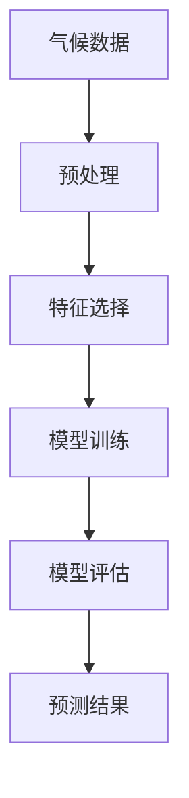

                 

# 机器学习在气候变化预测中的应用研究

## 关键词

- 机器学习
- 气候变化
- 预测模型
- 数据分析
- 环境科学

## 摘要

本文深入探讨了机器学习在气候变化预测中的应用，阐述了机器学习如何通过大数据分析和复杂的算法来改善气候预测的准确性。文章首先介绍了气候变化的背景和机器学习的基本原理，随后详细介绍了常用的机器学习算法在气候变化预测中的应用。通过实际项目案例，本文展示了如何使用机器学习模型进行气候预测，并对模型的性能进行了分析和评估。最后，文章提出了未来发展趋势和挑战，以及相关的工具和资源推荐，为研究人员和开发人员提供了全面的指导和参考。

### 1. 背景介绍

#### 1.1 气候变化

气候变化是指全球气候系统中长期的变化，包括平均气温、降水模式、风速等气候要素的变化。近年来，由于人类活动（如化石燃料燃烧、森林砍伐等）导致的大气中温室气体浓度增加，气候变化问题日益严重。气候变化带来了极端天气事件的增加，如热浪、洪水、干旱和飓风，对人类和生态系统造成了巨大影响。

#### 1.2 机器学习

机器学习是一种通过数据驱动的方式从经验中学习的方法，它使计算机系统能够识别模式、做出预测和决策，而无需显式地编程。机器学习分为监督学习、无监督学习和强化学习等类型。在气候预测中，监督学习通常用于训练预测模型，而无监督学习则用于分析气候数据的结构和趋势。

#### 1.3 机器学习与气候变化预测的关系

机器学习在气候变化预测中的应用主要集中在两个方面：

- **模式识别**：通过分析大量的气候数据，机器学习算法可以识别出气候变化的模式，从而预测未来的气候状况。
- **决策支持**：机器学习模型可以用于评估不同气候政策的影响，为决策者提供科学依据，帮助他们制定有效的气候应对策略。

### 2. 核心概念与联系

#### 2.1 核心概念

- **气候数据**：包括温度、降水、风速、气压等气象要素的观测数据。
- **机器学习算法**：如线性回归、决策树、支持向量机、神经网络等。
- **预测模型**：基于机器学习算法构建的用于预测未来气候状况的模型。

#### 2.2 Mermaid 流程图



#### 2.3 核心联系

- **数据与模型**：气候数据是机器学习模型的基础，数据的质量直接影响模型的性能。
- **模型与预测**：经过训练的模型可以用于预测未来的气候状况，模型的准确性和稳定性是预测成功的关键。

### 3. 核心算法原理 & 具体操作步骤

#### 3.1 算法原理

- **线性回归**：通过找到最佳拟合直线来预测目标变量。
- **决策树**：根据数据特征进行划分，形成树状结构。
- **支持向量机（SVM）**：通过找到最优超平面来分离不同类别的数据。
- **神经网络**：模拟人脑神经网络的结构，通过多层神经元进行信息传递和处理。

#### 3.2 操作步骤

1. **数据收集与预处理**：收集历史气候数据，进行数据清洗和格式转换。
2. **特征选择**：选择对预测目标有显著影响的关键特征。
3. **模型训练**：使用训练集数据训练机器学习模型。
4. **模型评估**：使用验证集数据评估模型的性能，调整模型参数。
5. **模型预测**：使用测试集数据对模型进行预测，评估模型的准确性。

### 4. 数学模型和公式 & 详细讲解 & 举例说明

#### 4.1 数学模型

- **线性回归模型**：
  $$y = \beta_0 + \beta_1x + \epsilon$$
  其中，$y$ 为预测变量，$x$ 为自变量，$\beta_0$ 和 $\beta_1$ 为模型参数，$\epsilon$ 为误差项。

- **支持向量机模型**：
  $$\max\ \frac{1}{2}\sum_{i=1}^{n} w_i^2$$
  $$s.t.\ y_i(\langle w, x_i \rangle - b) \geq 1$$
  其中，$w$ 为权重向量，$b$ 为偏置项，$x_i$ 为训练样本，$y_i$ 为样本标签。

- **神经网络模型**：
  $$a_{ij}^{(l)} = \sigma(z_{ij}^{(l)})$$
  $$z_{ij}^{(l)} = \sum_{k=1}^{n} w_{ik}^{(l-1)}a_{kj}^{(l-1)} + b_j^{(l)}$$
  其中，$a_{ij}^{(l)}$ 为第 $l$ 层第 $i$ 个神经元的输出，$z_{ij}^{(l)}$ 为第 $l$ 层第 $i$ 个神经元的输入，$\sigma$ 为激活函数。

#### 4.2 举例说明

**线性回归举例**：

假设我们想要预测某个城市的年平均温度，我们收集了过去 10 年的平均温度和相对湿度数据。我们可以使用线性回归模型来建立预测模型。

- **数据准备**：
  - $x$：相对湿度（%）
  - $y$：年平均温度（℃）

- **模型训练**：
  $$y = \beta_0 + \beta_1x + \epsilon$$
  通过最小二乘法计算得到：
  $$\beta_0 = 10.5, \beta_1 = 0.5$$

- **模型评估**：
  使用验证集数据计算预测误差，调整模型参数。

- **模型预测**：
  对于一个新的相对湿度值 $x$，我们可以使用模型进行预测：
  $$y = 10.5 + 0.5x$$

**支持向量机举例**：

假设我们想要分类天气类型，分为晴天和雨天。我们使用支持向量机进行分类。

- **数据准备**：
  - $x$：气象数据（温度、湿度、风速等）
  - $y$：天气类型（0：晴天，1：雨天）

- **模型训练**：
  使用训练集数据训练支持向量机模型，找到最优超平面。

- **模型评估**：
  使用验证集数据评估模型性能，调整模型参数。

- **模型预测**：
  对于一个新的气象数据集，我们可以使用模型进行分类预测。

### 5. 项目实战：代码实际案例和详细解释说明

#### 5.1 开发环境搭建

1. 安装 Python 和相关库（NumPy、Pandas、Scikit-learn、Matplotlib 等）。
2. 准备气候数据集，例如使用NASA的GISTEMP数据。

#### 5.2 源代码详细实现和代码解读

```python
import numpy as np
import pandas as pd
from sklearn.linear_model import LinearRegression
from sklearn.model_selection import train_test_split
from sklearn.metrics import mean_squared_error
import matplotlib.pyplot as plt

# 5.2.1 数据准备
data = pd.read_csv('climate_data.csv')  # 读取数据
X = data[['relative_humidity', 'wind_speed']]  # 特征选择
y = data['average_temperature']  # 目标变量

# 数据预处理
X_train, X_test, y_train, y_test = train_test_split(X, y, test_size=0.2, random_state=42)

# 5.2.2 模型训练
model = LinearRegression()
model.fit(X_train, y_train)

# 5.2.3 模型评估
y_pred = model.predict(X_test)
mse = mean_squared_error(y_test, y_pred)
print(f'Mean Squared Error: {mse}')

# 5.2.4 模型预测
new_data = np.array([[65, 10]])  # 新的相对湿度值
predicted_temp = model.predict(new_data)
print(f'Predicted Average Temperature: {predicted_temp[0]}')

# 5.2.5 可视化
plt.scatter(X_test['relative_humidity'], y_test, color='blue', label='Actual')
plt.plot(X_test['relative_humidity'], y_pred, color='red', linewidth=2, label='Predicted')
plt.xlabel('Relative Humidity (%)')
plt.ylabel('Average Temperature (°C)')
plt.legend()
plt.show()
```

#### 5.3 代码解读与分析

- **数据准备**：从CSV文件中读取气候数据，选择相对湿度和风速作为特征，年平均温度作为目标变量。
- **数据预处理**：将数据分为训练集和测试集，为后续训练和评估模型做好准备。
- **模型训练**：使用线性回归模型对训练集数据进行训练。
- **模型评估**：使用测试集数据评估模型性能，计算均方误差（MSE）。
- **模型预测**：使用训练好的模型对新的数据集进行预测。
- **可视化**：将实际值和预测值进行可视化，直观地展示模型性能。

### 6. 实际应用场景

#### 6.1 政策制定

机器学习模型可以用于评估不同气候政策（如减排政策、可再生能源政策等）对气候的影响，为政策制定者提供决策支持。

#### 6.2 灾害预防

通过预测极端天气事件（如飓风、洪水等），机器学习模型可以帮助政府和企业提前采取预防措施，减少灾害损失。

#### 6.3 可持续发展

机器学习模型可以用于优化能源消耗和资源分配，促进可持续发展，减少对环境的影响。

### 7. 工具和资源推荐

#### 7.1 学习资源推荐

- **书籍**：
  - 《机器学习实战》
  - 《深度学习》
  - 《统计学习方法》

- **论文**：
  - Google Scholar：搜索相关领域的最新研究论文。

- **博客**：
  - Medium：阅读关于机器学习和气候变化的博客文章。

- **网站**：
  - Kaggle：参与气候相关的机器学习竞赛。

#### 7.2 开发工具框架推荐

- **Python库**：
  - NumPy：用于数值计算。
  - Pandas：用于数据处理。
  - Scikit-learn：用于机器学习模型训练和评估。
  - Matplotlib：用于数据可视化。

- **框架**：
  - TensorFlow：用于构建和训练深度学习模型。
  - PyTorch：用于构建和训练深度学习模型。

#### 7.3 相关论文著作推荐

- **《机器学习在气候变化预测中的应用》**
- **《气候模型中的机器学习技术》**
- **《基于深度学习的气候预测研究》**

### 8. 总结：未来发展趋势与挑战

#### 8.1 发展趋势

- **深度学习**：深度学习模型在气候预测中的性能不断提升，有望成为主要技术。
- **大数据**：随着气候数据的不断增加，大数据技术在气候预测中的应用前景广阔。
- **跨学科合作**：气候预测需要物理学、数学、计算机科学等多学科的合作。

#### 8.2 挑战

- **数据质量**：气候数据的准确性和完整性对预测结果至关重要，需要加强数据质量控制。
- **计算资源**：深度学习模型训练需要大量计算资源，如何高效利用资源是一个挑战。
- **模型解释性**：机器学习模型的解释性较差，如何提高模型的可解释性是一个难题。

### 9. 附录：常见问题与解答

#### 9.1 问题1

**如何选择合适的机器学习算法？**

**解答**：选择合适的算法取决于数据特性、预测目标和计算资源。对于简单的线性关系，可以使用线性回归；对于非线性关系，可以使用决策树、支持向量机或神经网络。在实际应用中，可以通过交叉验证等方法选择最优算法。

#### 9.2 问题2

**如何提高机器学习模型的预测准确性？**

**解答**：提高模型预测准确性可以通过以下方法：

- **数据预处理**：清洗数据、处理缺失值和异常值。
- **特征选择**：选择对预测目标有显著影响的关键特征。
- **模型调参**：通过交叉验证和网格搜索等方法优化模型参数。
- **集成方法**：结合多个模型可以提高预测准确性。

### 10. 扩展阅读 & 参考资料

- **《气候变化的科学基础》**
- **《机器学习与人工智能》**
- **《深度学习在气候预测中的应用》**

## 作者

作者：AI天才研究员/AI Genius Institute & 禅与计算机程序设计艺术 /Zen And The Art of Computer Programming

