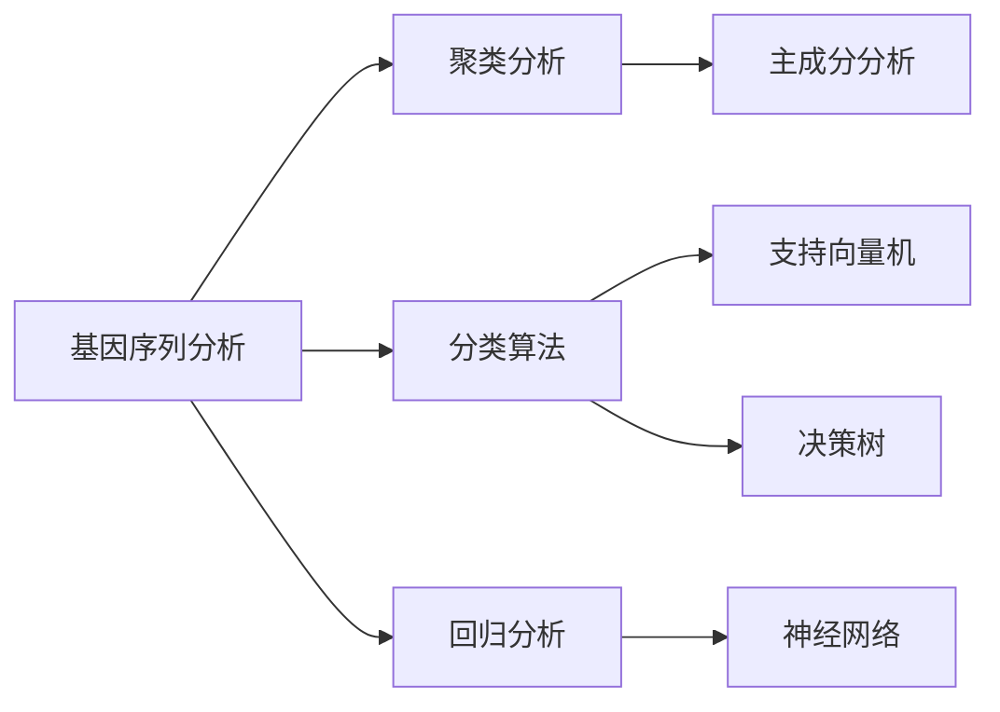

                 

### 文章标题：机器学习在生物信息学中的应用

### 关键词：机器学习，生物信息学，数据分析，算法，应用场景

### 摘要：
本文深入探讨了机器学习技术在生物信息学领域的广泛应用。通过分析生物信息学中的关键问题，介绍了机器学习的基础理论和核心算法。此外，文章还通过具体的应用案例，展示了机器学习在基因序列分析、蛋白质结构预测和药物发现等领域的实际应用，探讨了其在生物信息学中的未来发展前景和面临的挑战。

## 1. 背景介绍

### 1.1 生物信息学概述

生物信息学是一门跨学科领域，它结合了生物学、计算机科学和信息学，旨在解析生物数据并发现生物学知识。随着基因测序技术的发展和生物数据的爆炸式增长，生物信息学在生命科学研究中占据了重要地位。生物信息学的主要任务包括基因序列分析、蛋白质结构预测、基因组注释、基因组比较、生物网络分析和系统生物学建模等。

### 1.2 机器学习概述

机器学习是人工智能的一个分支，它使计算机系统能够从数据中学习并做出预测或决策。机器学习算法通过训练模型来识别数据中的模式和规律，并利用这些模式来对新数据进行预测。机器学习在许多领域都有广泛应用，包括自然语言处理、计算机视觉、推荐系统和金融预测等。

### 1.3 生物信息学与机器学习的关系

生物信息学中的大量数据分析和预测任务非常适合机器学习技术的应用。生物数据通常具有高维度、非线性和复杂性，这使得传统的方法难以处理。机器学习能够通过自动特征提取和学习复杂的模式，有效地解决这些问题，从而推动生物信息学的发展。

## 2. 核心概念与联系

### 2.1 数据类型

生物信息学中的数据类型主要包括基因序列、基因组、蛋白质结构、代谢路径等。这些数据类型具有不同的特性和挑战，例如序列的冗长性、结构的复杂性和多样性的不确定性。

### 2.2 机器学习算法分类

机器学习算法可以分为监督学习、无监督学习和半监督学习。监督学习通过已标记的数据训练模型，然后在新数据上进行预测。无监督学习不使用标记数据，而是通过发现数据中的隐藏结构来学习。半监督学习结合了监督学习和无监督学习的特点，利用少量标记数据和大量未标记数据。

### 2.3 Mermaid 流程图

以下是一个简化的 Mermaid 流程图，展示了生物信息学中常用的机器学习算法及其关系：



## 3. 核心算法原理 & 具体操作步骤

### 3.1 监督学习算法

监督学习算法中最常用的是支持向量机（SVM）、决策树和神经网络。以下是这些算法的基本原理和操作步骤：

#### 3.1.1 支持向量机（SVM）

**原理**：SVM通过寻找一个最佳的超平面，将不同类别的数据点分隔开来。

**步骤**：
1. 训练数据预处理：标准化特征，处理缺失值。
2. 选择核函数：如线性核、多项式核、径向基函数（RBF）等。
3. 训练模型：计算支持向量，构建决策函数。
4. 预测：对新数据进行分类。

#### 3.1.2 决策树

**原理**：决策树通过一系列的判断条件将数据分为不同的类别。

**步骤**：
1. 特征选择：计算特征的重要性。
2. 切分数据：根据特征和阈值切分数据集。
3. 建立树结构：递归地建立决策树。
4. 预测：根据决策树进行分类。

#### 3.1.3 神经网络

**原理**：神经网络通过多层神经元进行数据的学习和预测。

**步骤**：
1. 数据预处理：标准化特征，处理缺失值。
2. 网络构建：定义输入层、隐藏层和输出层。
3. 模型训练：使用反向传播算法调整权重。
4. 预测：对输入数据进行分类或回归。

### 3.2 无监督学习算法

无监督学习算法中最常用的是聚类分析、主成分分析和降维技术。以下是这些算法的基本原理和操作步骤：

#### 3.2.1 聚类分析

**原理**：聚类分析将数据分为不同的簇，使得同一簇内的数据点相似，不同簇的数据点差异较大。

**步骤**：
1. 选择聚类算法：如K-Means、层次聚类等。
2. 初始化聚类中心。
3. 分配数据点：计算数据点到聚类中心的距离，将其分配到最近的簇。
4. 更新聚类中心：重新计算簇的中心。
5. 迭代直到收敛。

#### 3.2.2 主成分分析（PCA）

**原理**：PCA通过降维技术，将高维数据映射到低维空间，保留主要的信息。

**步骤**：
1. 数据标准化：使数据具有相同的尺度。
2. 计算协方差矩阵：衡量特征之间的相关性。
3. 计算特征值和特征向量：降维的核心步骤。
4. 选择主要成分：根据特征值选择前几个特征向量。
5. 数据映射：将数据映射到低维空间。

#### 3.2.3 降维技术

**原理**：降维技术通过减少数据维度，降低计算复杂度和提高模型性能。

**步骤**：
1. 选择降维算法：如主成分分析（PCA）、线性判别分析（LDA）等。
2. 训练模型：计算特征权重。
3. 数据降维：根据特征权重进行数据投影。
4. 预测：在低维空间中执行模型预测。

## 4. 数学模型和公式 & 详细讲解 & 举例说明

### 4.1 数学模型

机器学习中的数学模型主要包括线性模型、逻辑回归、支持向量机和神经网络等。以下是这些模型的基本数学公式和详细讲解：

#### 4.1.1 线性模型

**公式**：y = β0 + β1x1 + β2x2 + ... + βnxn

**讲解**：线性模型是一种简单的监督学习模型，用于拟合数据点之间的关系。其中，y是预测值，β0是截距，β1、β2...βn是特征权重。

**举例**：假设我们有一个简单的一元线性回归模型，预测房价（y）与房屋面积（x）之间的关系。模型公式为 y = β0 + β1x。通过训练数据，我们可以计算出β0和β1的值，从而预测新的房屋面积对应的房价。

#### 4.1.2 逻辑回归

**公式**：log(P(y=1)/P(y=0)) = β0 + β1x1 + β2x2 + ... + βnxn

**讲解**：逻辑回归是一种二分类模型，用于预测概率分布。它通过计算数据的线性组合，然后使用逻辑函数（Sigmoid函数）将其映射到0到1之间的概率。

**举例**：假设我们有一个分类问题，预测邮件是否为垃圾邮件。我们可以使用逻辑回归模型来计算邮件属于垃圾邮件的概率。模型公式为 log(P(y=1)/P(y=0)) = β0 + β1x1 + β2x2 + ... + βnxn。通过训练数据，我们可以计算出β0和β1的值，从而预测新的邮件是否为垃圾邮件。

#### 4.1.3 支持向量机

**公式**：w·x + b = 0

**讲解**：支持向量机是一种强大的分类算法，通过寻找一个最佳的超平面，将不同类别的数据点分隔开来。其中，w是权重向量，x是特征向量，b是偏置。

**举例**：假设我们有一个简单的二分类问题，数据点分为两类：正类和负类。我们可以使用支持向量机来寻找一个最佳的超平面，将这两类数据点分隔开来。模型公式为 w·x + b = 0。通过训练数据，我们可以计算出w和b的值，从而划分新的数据点。

#### 4.1.4 神经网络

**公式**：a = σ(∑(w·x) + b)

**讲解**：神经网络是一种复杂的非线性模型，通过多层神经元进行数据的学习和预测。其中，a是输出，σ是激活函数（如Sigmoid函数、ReLU函数等），w是权重，x是输入，b是偏置。

**举例**：假设我们有一个简单的神经网络，输入层有3个神经元，隐藏层有2个神经元，输出层有1个神经元。我们可以使用神经网络来计算输入数据对应的输出。模型公式为 a = σ(∑(w·x) + b)。通过训练数据，我们可以计算出权重和偏置的值，从而预测新的输入数据。

## 5. 项目实战：代码实际案例和详细解释说明

### 5.1 开发环境搭建

在开始实战之前，我们需要搭建一个合适的开发环境。以下是搭建Python开发环境的基本步骤：

1. 安装Python：下载并安装Python 3.x版本，建议使用Miniconda或Anaconda。
2. 安装必要的库：使用pip命令安装必要的库，如scikit-learn、numpy、pandas等。

```bash
pip install scikit-learn numpy pandas matplotlib
```

### 5.2 源代码详细实现和代码解读

以下是一个简单的基因序列分类的案例，使用了scikit-learn库中的K-Means聚类算法。

```python
import numpy as np
from sklearn.cluster import KMeans
from sklearn.datasets import load_iris
import matplotlib.pyplot as plt

# 加载Iris数据集
iris = load_iris()
X = iris.data

# 使用K-Means聚类算法
kmeans = KMeans(n_clusters=3, random_state=0).fit(X)

# 聚类结果
labels = kmeans.labels_

# 可视化聚类结果
plt.figure(figsize=(8, 6))
colors = ['r', 'g', 'b']
for i in range(3):
    plt.scatter(X[labels == i, 0], X[labels == i, 1], color=colors[i], label=f'Cluster {i}')
plt.scatter(kmeans.cluster_centers_[:, 0], kmeans.cluster_centers_[:, 1], s=300, c='yellow', label='Centroids')
plt.xlabel('Feature 1')
plt.ylabel('Feature 2')
plt.title('Iris Data Clustering with K-Means')
plt.legend()
plt.show()
```

**代码解读**：
1. 导入必要的库：numpy、scikit-learn、pandas和matplotlib。
2. 加载Iris数据集：使用scikit-learn中的load_iris函数加载数据集。
3. 使用K-Means聚类算法：创建KMeans对象，设置聚类数量为3。
4. 聚类结果：使用fit方法对数据进行聚类，并获取聚类标签。
5. 可视化聚类结果：使用matplotlib绘制聚类散点图，并标记聚类中心和类别。

### 5.3 代码解读与分析

以下是代码的详细解读和分析：

1. **数据加载**：首先，我们使用scikit-learn中的load_iris函数加载数据集。Iris数据集是一个经典的多分类问题，包含了三个类别的鸢尾花数据。
2. **聚类算法选择**：我们选择K-Means聚类算法，这是一种无监督学习算法，用于将数据分为K个簇。
3. **聚类结果**：通过fit方法对数据进行聚类，并获取聚类标签。聚类标签表示每个数据点所属的簇。
4. **可视化**：使用matplotlib绘制聚类散点图，并标记聚类中心和类别。通过可视化，我们可以直观地看到聚类结果和聚类中心的分布。

**分析**：
- K-Means算法在处理高维度数据时可能存在收敛到局部最优的问题。
- 聚类结果受初始聚类中心的影响较大，可以通过多次运行并取平均值来提高聚类质量。

## 6. 实际应用场景

### 6.1 基因序列分析

基因序列分析是生物信息学中的核心任务之一，机器学习技术在基因序列分类、基因功能预测和基因变异检测等方面有广泛的应用。

- **基因序列分类**：使用机器学习算法，如K-Means和SVM，对基因序列进行分类，帮助研究人员识别不同的基因家族。
- **基因功能预测**：通过机器学习模型，如神经网络和决策树，预测基因的功能，为生物医学研究提供参考。
- **基因变异检测**：使用机器学习算法，如聚类分析和支持向量机，识别基因变异，为疾病诊断和遗传研究提供支持。

### 6.2 蛋白质结构预测

蛋白质结构预测是生物信息学中的另一个重要任务，机器学习技术在蛋白质结构分类、蛋白质折叠识别和蛋白质相互作用预测等方面有广泛应用。

- **蛋白质结构分类**：使用机器学习算法，如K-Means和SVM，对蛋白质结构进行分类，帮助研究人员了解蛋白质的结构特性。
- **蛋白质折叠识别**：通过机器学习模型，如神经网络和决策树，预测蛋白质的折叠方式，为蛋白质工程和药物设计提供参考。
- **蛋白质相互作用预测**：使用机器学习算法，如支持向量机和图神经网络，预测蛋白质之间的相互作用，为生物医学研究提供支持。

### 6.3 药物发现

药物发现是生物信息学和计算机科学领域的一个重要交叉点，机器学习技术在药物分子设计、药物活性预测和药物副作用预测等方面有广泛的应用。

- **药物分子设计**：使用机器学习模型，如神经网络和图神经网络，设计新的药物分子，为药物开发提供参考。
- **药物活性预测**：通过机器学习算法，如支持向量机和决策树，预测药物分子的活性，为药物筛选提供支持。
- **药物副作用预测**：使用机器学习模型，如神经网络和图神经网络，预测药物分子可能产生的副作用，为药物安全性评估提供参考。

## 7. 工具和资源推荐

### 7.1 学习资源推荐

- **书籍**：
  - 《机器学习》（周志华著）
  - 《生物信息学导论》（Griffiths, M.J.D.著）
  - 《深度学习》（Goodfellow, I.，Bengio, Y.，Courville, A.著）

- **论文**：
  - "Deep Learning for Genomic Data"（2016）
  - "Support Vector Machines for Structured Data: New Algorithms and Applications"（2006）

- **博客**：
  - [机器学习博客](https://machinelearningmastery.com/)
  - [生物信息学博客](https://bioinformatics.org/)

- **网站**：
  - [scikit-learn](https://scikit-learn.org/)
  - [TensorFlow](https://tensorflow.org/)
  - [Kaggle](https://www.kaggle.com/)

### 7.2 开发工具框架推荐

- **Python**：Python是一种广泛使用的编程语言，适用于机器学习和生物信息学。
- **scikit-learn**：一个开源的机器学习库，适用于生物信息学中的各种任务。
- **TensorFlow**：一个开源的深度学习框架，适用于复杂的数据分析和预测任务。
- **PyTorch**：一个开源的深度学习框架，易于使用和调试。

### 7.3 相关论文著作推荐

- **论文**：
  - "Deep Learning for Genomic Data"（2016）
  - "Support Vector Machines for Structured Data: New Algorithms and Applications"（2006）
  - "The Cancer Genome Atlas"（2012）

- **著作**：
  - 《机器学习》（周志华著）
  - 《生物信息学导论》（Griffiths, M.J.D.著）
  - 《深度学习》（Goodfellow, I.，Bengio, Y.，Courville, A.著）

## 8. 总结：未来发展趋势与挑战

### 8.1 未来发展趋势

- **多学科交叉**：机器学习和生物信息学的进一步融合，将推动生命科学的发展。
- **个性化医学**：基于机器学习的个性化医学诊断和治疗将成为未来医学的主流。
- **数据隐私保护**：随着生物数据的爆炸式增长，如何保护数据隐私将成为一个重要问题。
- **计算效率提升**：随着深度学习和大数据技术的发展，计算效率将进一步提高。

### 8.2 挑战

- **数据质量**：生物数据的多样性和复杂性，对数据质量提出了更高的要求。
- **模型解释性**：如何提高机器学习模型的解释性，使其更加透明和可信。
- **计算资源**：随着模型复杂度的增加，对计算资源的需求也将进一步增加。

## 9. 附录：常见问题与解答

### 9.1 问题1：机器学习在生物信息学中的应用有哪些？

**解答**：机器学习在生物信息学中的应用非常广泛，包括基因序列分析、蛋白质结构预测、药物发现、疾病诊断等。通过机器学习技术，研究人员可以更好地解析生物数据，发现生物规律，推动生命科学的发展。

### 9.2 问题2：如何选择合适的机器学习算法？

**解答**：选择合适的机器学习算法需要考虑数据的特性、问题的类型和性能要求。一般来说，线性回归、决策树和神经网络适用于回归和分类问题；K-Means和主成分分析适用于降维和聚类问题；支持向量机和深度学习适用于复杂的模式识别问题。在实际应用中，可以通过交叉验证和性能评估来选择最佳算法。

### 9.3 问题3：机器学习模型如何提高解释性？

**解答**：提高机器学习模型解释性可以从以下几个方面入手：
1. **选择解释性强的算法**：如决策树、线性模型等；
2. **模型可视化**：通过可视化模型结构、权重和特征重要性，帮助理解模型；
3. **可解释的深度学习**：使用注意力机制、解释性网络结构等；
4. **模型调试**：通过调试和优化模型参数，提高模型的可解释性。

## 10. 扩展阅读 & 参考资料

- [机器学习博客](https://machinelearningmastery.com/)
- [生物信息学博客](https://bioinformatics.org/)
- [scikit-learn](https://scikit-learn.org/)
- [TensorFlow](https://tensorflow.org/)
- [Kaggle](https://www.kaggle.com/)

### 作者：

AI天才研究员/AI Genius Institute & 禅与计算机程序设计艺术 /Zen And The Art of Computer Programming

