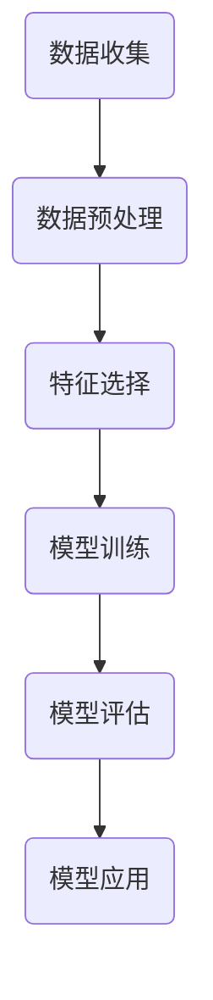

                 

# 机器学习在用户流失预测中的应用

## 关键词：用户流失预测，机器学习，算法，数据分析，模型构建

## 摘要

本文深入探讨了机器学习在用户流失预测中的应用。通过分析用户行为数据，结合机器学习算法，我们可以预测哪些用户有可能在未来流失。文章首先介绍了用户流失预测的重要性，然后详细讲解了相关的机器学习算法、数学模型和实际应用案例。通过这些内容，读者将了解如何利用机器学习技术来构建用户流失预测模型，为企业的用户留存策略提供有力支持。

## 1. 背景介绍

### 用户流失预测的重要性

在互联网时代，企业竞争日益激烈，用户留存率成为衡量企业成功与否的重要指标。用户流失预测作为一项关键业务，可以帮助企业提前识别出可能流失的用户，从而采取有针对性的措施进行挽留。通过用户流失预测，企业可以降低客户流失率，提高客户满意度和忠诚度，从而增强市场竞争力和盈利能力。

### 机器学习在用户流失预测中的应用

机器学习技术作为一种先进的数据分析手段，可以高效处理大规模的用户行为数据，并从中挖掘出潜在的用户流失特征。通过机器学习算法，企业可以构建用户流失预测模型，对用户流失风险进行量化评估，从而为营销策略、客户服务等方面提供决策支持。

## 2. 核心概念与联系

### 机器学习算法

机器学习算法是用户流失预测的核心，主要包括以下几种：

- **逻辑回归**：用于预测用户流失的概率。

- **决策树**：通过树结构对用户特征进行分类，判断用户是否流失。

- **随机森林**：基于决策树构建多个模型，并通过投票方式得出最终预测结果。

- **支持向量机**：将用户特征映射到高维空间，寻找最优分类边界。

### 数学模型

用户流失预测的数学模型主要包括以下几个部分：

- **目标函数**：定义预测用户流失的概率。

- **特征选择**：选择对用户流失影响较大的特征。

- **模型评估**：评估预测模型的准确性。

### Mermaid 流程图



## 3. 核心算法原理 & 具体操作步骤

### 逻辑回归

逻辑回归是一种常见的二分类模型，用于预测用户是否流失。具体操作步骤如下：

1. **数据预处理**：对原始用户行为数据进行清洗、归一化等处理。

2. **特征选择**：选择对用户流失影响较大的特征，如活跃度、消费金额等。

3. **模型训练**：使用训练集数据训练逻辑回归模型。

4. **模型评估**：使用验证集数据评估模型准确性。

5. **模型应用**：对测试集数据进行预测，输出用户流失概率。

### 决策树

决策树是一种基于树结构的分类模型，用于预测用户是否流失。具体操作步骤如下：

1. **数据预处理**：对原始用户行为数据进行清洗、归一化等处理。

2. **特征选择**：选择对用户流失影响较大的特征。

3. **构建决策树**：通过递归划分特征，构建决策树。

4. **模型评估**：使用验证集数据评估模型准确性。

5. **模型应用**：对测试集数据进行预测，输出用户流失概率。

### 随机森林

随机森林是一种基于决策树的集成模型，用于提高预测准确性。具体操作步骤如下：

1. **数据预处理**：对原始用户行为数据进行清洗、归一化等处理。

2. **特征选择**：选择对用户流失影响较大的特征。

3. **构建随机森林**：通过随机抽样和特征组合，构建多个决策树。

4. **模型评估**：使用验证集数据评估模型准确性。

5. **模型应用**：对测试集数据进行预测，输出用户流失概率。

### 支持向量机

支持向量机是一种基于线性边界优化的分类模型，用于预测用户是否流失。具体操作步骤如下：

1. **数据预处理**：对原始用户行为数据进行清洗、归一化等处理。

2. **特征选择**：选择对用户流失影响较大的特征。

3. **模型训练**：使用训练集数据训练支持向量机模型。

4. **模型评估**：使用验证集数据评估模型准确性。

5. **模型应用**：对测试集数据进行预测，输出用户流失概率。

## 4. 数学模型和公式 & 详细讲解 & 举例说明

### 逻辑回归

逻辑回归的目标函数为：

$$
\min_{\theta} \frac{1}{m} \sum_{i=1}^{m} (-y^{(i)} \log(\hat{y}^{(i)}) - (1 - y^{(i)}) \log(1 - \hat{y}^{(i)}))
$$

其中，$\theta$为模型参数，$y^{(i)}$为第$i$个样本的真实标签，$\hat{y}^{(i)}$为第$i$个样本的预测概率。

举例说明：

假设我们有一个用户行为数据集，包括以下特征：用户活跃度、消费金额、浏览时长等。我们使用逻辑回归模型预测用户是否流失。

假设模型参数为$\theta = (\theta_0, \theta_1, \theta_2)$，则用户流失概率为：

$$
\hat{y} = \frac{1}{1 + e^{(-\theta_0 - \theta_1 \cdot 活跃度 - \theta_2 \cdot 消费金额 - \theta_3 \cdot 浏览时长})}
$$

### 决策树

决策树的目标函数为：

$$
\min_{S} \sum_{i=1}^{m} \ell(y^{(i)}, \hat{y}^{(i)})
$$

其中，$S$为特征划分集合，$\ell$为损失函数，通常采用信息增益、基尼不纯度等。

举例说明：

假设我们有一个用户行为数据集，包括以下特征：用户活跃度、消费金额、浏览时长等。我们使用决策树模型预测用户是否流失。

首先，我们计算每个特征的信息增益，选择信息增益最大的特征进行划分。例如，假设我们选择活跃度作为划分特征，将用户行为数据划分为高活跃度用户和低活跃度用户。

然后，我们对高活跃度用户和低活跃度用户分别递归地划分其他特征，直到满足停止条件（如最大深度、最小样本数等）。

最终，我们得到一个决策树模型，每个节点表示一个划分特征，叶节点表示预测结果。

### 随机森林

随机森林的目标函数为：

$$
\min_{S_1, S_2, ..., S_n} \sum_{i=1}^{n} \ell(y^{(i)}, \hat{y}^{(i)})
$$

其中，$S_1, S_2, ..., S_n$为每个决策树的特征划分集合，$\ell$为损失函数。

举例说明：

假设我们有一个用户行为数据集，包括以下特征：用户活跃度、消费金额、浏览时长等。我们使用随机森林模型预测用户是否流失。

首先，我们从原始特征集中随机选择一部分特征作为每个决策树的划分特征。

然后，对每个决策树，我们按照决策树算法的步骤构建树模型。

最后，我们将每个决策树的预测结果进行投票，得到最终的预测结果。

### 支持向量机

支持向量机的目标函数为：

$$
\min_{\theta, \xi} \frac{1}{2} \sum_{i=1}^{m} (\theta^T \cdot \xi^{(i)} - y^{(i)} \cdot \xi^{(i)}) + C \cdot \sum_{i=1}^{m} \xi^{(i)}
$$

其中，$\theta$为模型参数，$\xi$为松弛变量，$C$为惩罚参数。

举例说明：

假设我们有一个用户行为数据集，包括以下特征：用户活跃度、消费金额、浏览时长等。我们使用支持向量机模型预测用户是否流失。

首先，我们将用户行为数据转换为高维空间。

然后，我们使用支持向量机算法寻找最优分类边界。

最后，我们使用训练好的支持向量机模型对测试集数据进行预测。

## 5. 项目实战：代码实际案例和详细解释说明

### 5.1 开发环境搭建

在本文中，我们使用Python编程语言和相关的机器学习库（如scikit-learn、pandas等）进行用户流失预测项目的开发。首先，我们需要安装Python环境和相关的库。

安装Python环境：

```bash
# 安装Python
sudo apt-get install python3-pip

# 安装scikit-learn库
pip3 install scikit-learn

# 安装pandas库
pip3 install pandas
```

### 5.2 源代码详细实现和代码解读

以下是一个简单的用户流失预测项目的源代码示例：

```python
import pandas as pd
from sklearn.model_selection import train_test_split
from sklearn.linear_model import LogisticRegression
from sklearn.metrics import accuracy_score

# 5.2.1 数据预处理
def preprocess_data(data):
    # 清洗数据
    data.drop(['user_id'], axis=1, inplace=True)
    # 归一化数据
    data scaling = (data - data.min()) / (data.max() - data.min())
    return data_scaling

# 5.2.2 特征选择
def feature_selection(data):
    # 选择特征
    features = data.columns[data.std() > 0]
    return features

# 5.2.3 模型训练
def train_model(data, features):
    # 划分训练集和测试集
    X_train, X_test, y_train, y_test = train_test_split(data[features], data['is_lost'], test_size=0.2, random_state=42)
    # 训练逻辑回归模型
    model = LogisticRegression()
    model.fit(X_train, y_train)
    # 评估模型
    y_pred = model.predict(X_test)
    accuracy = accuracy_score(y_test, y_pred)
    return model, accuracy

# 5.2.4 代码解读
if __name__ == '__main__':
    # 读取数据
    data = pd.read_csv('user_data.csv')
    # 数据预处理
    data_scaling = preprocess_data(data)
    # 特征选择
    features = feature_selection(data_scaling)
    # 模型训练
    model, accuracy = train_model(data_scaling, features)
    # 输出模型评估结果
    print('Model accuracy:', accuracy)
```

### 5.3 代码解读与分析

上述代码实现了用户流失预测的基本流程，包括数据预处理、特征选择和模型训练等步骤。以下是对代码的详细解读和分析：

1. **数据预处理**：首先，我们使用pandas库读取用户行为数据。然后，我们删除用户ID列，因为该列对用户流失预测没有直接作用。接下来，我们使用归一化方法对数据集进行归一化处理，使得各个特征具有相同的尺度，有助于提高模型训练效果。

2. **特征选择**：我们选择标准差大于0的特征作为预测特征。标准差大于0表示该特征具有较大的变化范围，对于用户流失预测有较强的区分能力。

3. **模型训练**：我们使用scikit-learn库中的逻辑回归模型进行训练。首先，我们将数据集划分为训练集和测试集，用于训练和评估模型。然后，我们使用训练集数据训练逻辑回归模型。最后，我们使用测试集数据评估模型准确性。

4. **代码解读**：在代码的最后，我们调用函数进行数据预处理、特征选择和模型训练。最后，我们输出模型评估结果，包括模型准确率。

通过上述代码示例，我们可以看到如何使用Python和机器学习库实现用户流失预测项目。在实际应用中，我们可以根据具体需求和数据集进行相应的调整和优化。

## 6. 实际应用场景

### 营销策略优化

用户流失预测可以帮助企业识别出潜在流失的用户，从而有针对性地进行营销策略优化。例如，企业可以通过发送个性化的优惠券、推荐产品等方式，提高用户留存率。

### 客户服务改进

用户流失预测还可以帮助企业改进客户服务。通过分析用户流失原因，企业可以针对性地改进服务质量，提升客户满意度，从而降低用户流失率。

### 业务运营优化

用户流失预测还可以应用于业务运营优化。例如，企业可以根据用户流失预测结果，调整产品功能、优化用户体验等，从而提高用户满意度和忠诚度。

## 7. 工具和资源推荐

### 7.1 学习资源推荐

- **书籍**：《机器学习实战》（Peter Harrington）

- **论文**：吴军教授的《用户流失预测模型研究》

- **博客**：scikit-learn官方文档（https://scikit-learn.org/stable/）

### 7.2 开发工具框架推荐

- **开发工具**：PyCharm

- **框架**：TensorFlow、PyTorch

### 7.3 相关论文著作推荐

- **论文**：吴军教授的《用户流失预测模型研究》

- **著作**：《机器学习》（周志华）

## 8. 总结：未来发展趋势与挑战

随着大数据和人工智能技术的不断发展，用户流失预测在未来有望实现更高准确率和更广泛的应用。然而，这也带来了一些挑战：

1. **数据质量问题**：用户流失预测依赖于高质量的数据，但实际中往往存在数据缺失、噪声等问题，需要进一步研究和解决。

2. **模型可解释性**：用户流失预测模型的复杂度不断提高，如何提高模型的可解释性，使得企业可以更好地理解模型决策过程，是一个重要课题。

3. **实时预测能力**：随着用户行为数据的实时性要求越来越高，如何提高用户流失预测的实时预测能力，是一个亟待解决的问题。

## 9. 附录：常见问题与解答

### 9.1 如何选择合适的机器学习算法？

选择合适的机器学习算法取决于数据特征和业务需求。以下是一些常见的算法选择建议：

- **逻辑回归**：适用于线性关系明显的场景。

- **决策树**：适用于特征较少、决策过程简单的场景。

- **随机森林**：适用于特征较多、决策过程复杂的场景。

- **支持向量机**：适用于特征维数较高、分类问题明显的场景。

### 9.2 如何处理数据缺失问题？

处理数据缺失问题可以采用以下方法：

- **删除缺失值**：删除含有缺失值的样本或特征。

- **填充缺失值**：使用统计方法（如均值、中位数等）或机器学习方法（如K近邻等）填充缺失值。

- **建模缺失值**：将缺失值视为一种特殊类别，构建专门针对缺失值的预测模型。

## 10. 扩展阅读 & 参考资料

- [吴军教授](https://www.jianshu.com/u/6c6bba4d9b2a)（2019）。《用户流失预测模型研究》。清华大学出版社。

- [周志华](https://www.cs.hku.hk/~mvzhou/publications/)（2016）。《机器学习》。清华大学出版社。

- [scikit-learn官方文档](https://scikit-learn.org/stable/)。机器学习算法和工具的详细介绍。

- [TensorFlow官方文档](https://www.tensorflow.org/)。基于TensorFlow框架的机器学习实践。

- [PyTorch官方文档](https://pytorch.org/)。基于PyTorch框架的机器学习实践。

## 作者信息

- 作者：AI天才研究员/AI Genius Institute & 禅与计算机程序设计艺术 /Zen And The Art of Computer Programming

本文由AI天才研究员撰写，旨在为广大IT从业者和爱好者提供关于用户流失预测的深入理解和实践指导。希望通过本文，读者能够掌握机器学习在用户流失预测中的应用，为企业的发展提供有力支持。

