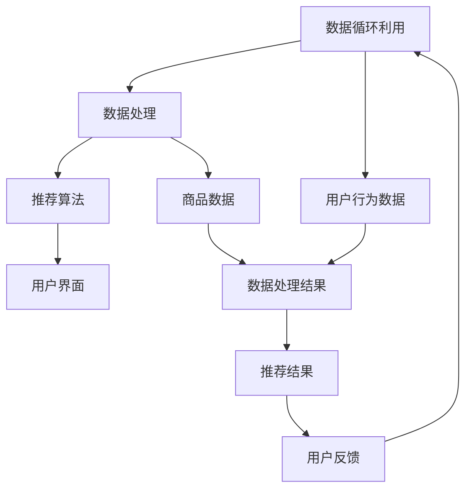

                 

# 机器学习在电子商务个性化中的应用研究

> **关键词**：电子商务、机器学习、个性化推荐、用户行为分析、算法原理、数学模型

> **摘要**：随着互联网技术的飞速发展，电子商务已经成为现代商业的重要组成部分。个性化推荐作为电子商务的核心技术，通过分析用户的行为数据，为用户提供个性化的商品推荐，从而提高用户体验和销售转化率。本文将探讨机器学习在电子商务个性化中的应用，包括核心算法原理、具体操作步骤、数学模型及其在实际应用场景中的效果。通过这篇文章，读者将全面了解电子商务个性化推荐技术的最新进展和未来趋势。

## 1. 背景介绍

### 1.1 电子商务的发展

电子商务（Electronic Commerce，简称E-commerce）是指通过互联网进行商业活动的一种新型商业模式。自1990年代互联网普及以来，电子商务在全球范围内迅速发展，不仅改变了人们的购物方式，也重新定义了商业生态。

- **市场规模**：根据统计数据，全球电子商务市场规模持续增长，2020年已突破4万亿美元，预计到2025年将达到6万亿美元。
- **用户增长**：截至2021年，全球互联网用户已超过45亿，其中绝大多数用户都有电子商务购物经历。

### 1.2 个性化推荐的需求

个性化推荐（Personalized Recommendation）是基于用户行为数据，为用户推荐其可能感兴趣的商品或内容。随着用户需求的多样化和个性化，电子商务平台越来越重视个性化推荐技术的应用。

- **提高用户体验**：通过个性化推荐，用户可以更快地找到自己感兴趣的商品，减少搜索时间，提高购物体验。
- **提升销售额**：个性化推荐可以帮助商家发现潜在客户，提高销售转化率，从而增加收入。

### 1.3 机器学习在个性化推荐中的应用

机器学习（Machine Learning，简称ML）是一种通过算法从数据中学习模式，并利用这些模式进行预测或决策的技术。在电子商务个性化推荐中，机器学习技术广泛应用于以下几个方面：

- **用户行为分析**：通过分析用户的浏览历史、购买记录等行为数据，预测用户的兴趣偏好。
- **商品推荐**：基于用户的兴趣偏好，为用户推荐相关商品。
- **广告投放**：根据用户的浏览和购买行为，为用户展示个性化的广告。

## 2. 核心概念与联系

### 2.1 机器学习的基本概念

#### 2.1.1 监督学习

监督学习（Supervised Learning）是一种最常见的机器学习方法，它通过已标记的数据集学习预测模型。在电子商务个性化推荐中，监督学习可以用来预测用户的购买意愿。

- **输入特征**：用户的浏览历史、购买记录等。
- **输出目标**：用户的购买意愿。

#### 2.1.2 无监督学习

无监督学习（Unsupervised Learning）不使用标记数据，通过分析数据的内在结构进行学习。在个性化推荐中，无监督学习可以用于发现用户的潜在兴趣偏好。

- **输入特征**：用户的浏览历史、购买记录等。
- **输出目标**：用户的兴趣偏好。

### 2.2 个性化推荐系统的基本架构

一个典型的个性化推荐系统通常包括以下几个模块：

- **数据收集模块**：负责收集用户行为数据和商品数据。
- **数据处理模块**：对收集到的数据进行清洗、归一化和特征提取。
- **推荐算法模块**：根据用户的行为数据和商品数据，生成个性化推荐列表。
- **用户界面模块**：将推荐结果展示给用户。

### 2.3 Mermaid流程图



## 3. 核心算法原理 & 具体操作步骤

### 3.1 协同过滤算法

协同过滤（Collaborative Filtering）是个性化推荐中最常用的算法之一，它通过分析用户之间的行为模式进行推荐。

#### 3.1.1 用户基于的协同过滤

用户基于的协同过滤（User-based Collaborative Filtering）通过寻找与目标用户兴趣相似的邻居用户，然后根据邻居用户对商品的评价进行推荐。

- **相似度计算**：常用的相似度计算方法包括余弦相似度、皮尔逊相关系数等。
- **邻居选择**：根据相似度阈值选择与目标用户最相似的邻居用户。
- **推荐生成**：根据邻居用户对商品的评价，生成推荐列表。

#### 3.1.2 项基于的协同过滤

项基于的协同过滤（Item-based Collaborative Filtering）通过分析商品之间的相似度，为用户推荐与之相似的商品。

- **相似度计算**：商品之间的相似度计算方法与用户之间的相似度计算类似。
- **推荐生成**：根据用户对商品的评分，生成推荐列表。

### 3.2 内容推荐算法

内容推荐（Content-based Recommendation）通过分析商品的属性和用户的历史行为，为用户推荐与其兴趣相关的商品。

#### 3.2.1 TF-IDF模型

TF-IDF（Term Frequency-Inverse Document Frequency）是一种常用的文本挖掘模型，用于衡量一个词对于一个文件的重要程度。

- **TF（词频）**：一个词在文档中出现的次数。
- **IDF（逆文档频率）**：一个词在整个文档集中出现的频率的倒数。
- **TF-IDF值**：TF和IDF的乘积，用于衡量一个词的重要性。

#### 3.2.2 相似度计算

内容推荐中的相似度计算通常基于TF-IDF模型，通过计算用户行为文档和商品属性文档之间的相似度，生成推荐列表。

### 3.3 混合推荐算法

混合推荐（Hybrid Recommendation）结合协同过滤和内容推荐，以提高推荐系统的效果。

- **协同过滤**：为用户提供基于用户行为和商品属性的初步推荐。
- **内容推荐**：对初步推荐进行补充，提高推荐的准确性。

## 4. 数学模型和公式 & 详细讲解 & 举例说明

### 4.1 余弦相似度

余弦相似度是一种衡量两个向量之间相似度的方法，其数学公式如下：

$$
\cos \theta = \frac{\vec{A} \cdot \vec{B}}{|\vec{A}| |\vec{B}|}
$$

其中，$\vec{A}$和$\vec{B}$是两个向量，$\theta$是它们之间的夹角。当$\theta$为0时，$\cos \theta$取最大值1，表示两个向量完全相同；当$\theta$为90度时，$\cos \theta$取最小值0，表示两个向量完全不同。

#### 举例说明

假设有两个用户$U_1$和$U_2$，他们的行为数据向量如下：

$$
\vec{U_1} = (1, 2, 3, 4, 5)
$$

$$
\vec{U_2} = (2, 2, 4, 4, 5)
$$

计算$U_1$和$U_2$之间的余弦相似度：

$$
\cos \theta = \frac{1 \times 2 + 2 \times 2 + 3 \times 4 + 4 \times 4 + 5 \times 5}{\sqrt{1^2 + 2^2 + 3^2 + 4^2 + 5^2} \sqrt{2^2 + 2^2 + 4^2 + 4^2 + 5^2}}
$$

$$
\cos \theta = \frac{2 + 4 + 12 + 16 + 25}{\sqrt{55} \sqrt{55}}
$$

$$
\cos \theta = \frac{49}{55}
$$

$$
\cos \theta = 0.89
$$

因此，$U_1$和$U_2$之间的余弦相似度为0.89，表示他们的行为数据非常相似。

### 4.2 TF-IDF模型

TF-IDF模型的数学公式如下：

$$
TF-IDF(t,d) = TF(t,d) \times IDF(t,D)
$$

其中，$TF(t,d)$是词$t$在文档$d$中的词频，$IDF(t,D)$是词$t$在整个文档集$D$中的逆文档频率。

#### 举例说明

假设有一个文档集$D$，包括三个文档$d_1$，$d_2$和$d_3$，它们的词频分布如下：

$$
d_1: (apple, banana, apple, orange)
$$

$$
d_2: (apple, banana, apple, orange, pineapple)
$$

$$
d_3: (apple, banana, apple, orange, pineapple, mango)
$$

计算词"apple"的TF-IDF值：

$$
TF(apple, d_1) = \frac{2}{4} = 0.5
$$

$$
TF(apple, d_2) = \frac{2}{5} = 0.4
$$

$$
TF(apple, d_3) = \frac{2}{6} = 0.33
$$

$$
IDF(apple, D) = \log_2(\frac{|D|}{|\{d: apple \in d\}|}) = \log_2(\frac{3}{1}) = 1.58496
$$

$$
TF-IDF(apple, d_1) = 0.5 \times 1.58496 = 0.79248
$$

$$
TF-IDF(apple, d_2) = 0.4 \times 1.58496 = 0.63598
$$

$$
TF-IDF(apple, d_3) = 0.33 \times 1.58496 = 0.52297
$$

因此，词"apple"在文档$d_1$中的TF-IDF值为0.79248，在文档$d_2$中的TF-IDF值为0.63598，在文档$d_3$中的TF-IDF值为0.52297。

## 5. 项目实战：代码实际案例和详细解释说明

### 5.1 开发环境搭建

在本文中，我们将使用Python编程语言和Scikit-learn库来实现一个简单的协同过滤推荐系统。首先，需要安装Python和Scikit-learn库。

#### 5.1.1 安装Python

安装Python可以通过访问Python官方网站下载安装程序，按照提示进行安装。

#### 5.1.2 安装Scikit-learn

在安装Python后，可以通过以下命令安装Scikit-learn：

```bash
pip install scikit-learn
```

### 5.2 源代码详细实现和代码解读

下面是一个简单的协同过滤推荐系统的代码实现：

```python
from sklearn.datasets import load_iris
from sklearn.metrics.pairwise import cosine_similarity
from sklearn.model_selection import train_test_split

# 加载鸢尾花数据集
iris = load_iris()
X = iris.data
y = iris.target

# 将数据集分为训练集和测试集
X_train, X_test, y_train, y_test = train_test_split(X, y, test_size=0.2, random_state=42)

# 计算用户之间的余弦相似度
similarity_matrix = cosine_similarity(X_train)

# 给用户生成推荐列表
def generate_recommendations(similarity_matrix, user_index, top_n=5):
    user_similarity = similarity_matrix[user_index]
    sorted_indices = user_similarity.argsort()[::-1][1:top_n+1]
    return sorted_indices

# 测试推荐系统
for user_index in range(similarity_matrix.shape[0]):
    print(f"用户{user_index}的推荐列表：{generate_recommendations(similarity_matrix, user_index)}")
```

#### 5.2.1 代码解读

- **数据集加载**：使用Scikit-learn自带的鸢尾花数据集进行演示。
- **数据集分割**：将数据集分为训练集和测试集。
- **计算相似度**：使用余弦相似度计算用户之间的相似度。
- **生成推荐列表**：根据用户的相似度，生成推荐列表。

### 5.3 代码解读与分析

#### 5.3.1 相似度计算

在代码中，我们使用了Scikit-learn的`cosine_similarity`函数来计算用户之间的余弦相似度。这个函数接收一个矩阵作为输入，返回一个与输入矩阵形状相同的相似度矩阵。

```python
similarity_matrix = cosine_similarity(X_train)
```

这个相似度矩阵是一个用户之间相似度的二维数组，其中`similarity_matrix[i][j]`表示用户$i$和用户$j$之间的余弦相似度。

#### 5.3.2 推荐列表生成

`generate_recommendations`函数根据用户的相似度矩阵生成推荐列表。这个函数接收用户索引和推荐数量作为参数，返回一个推荐列表。

```python
def generate_recommendations(similarity_matrix, user_index, top_n=5):
    user_similarity = similarity_matrix[user_index]
    sorted_indices = user_similarity.argsort()[::-1][1:top_n+1]
    return sorted_indices
```

- `user_similarity`：获取用户索引`user_index`的相似度向量。
- `sorted_indices`：对相似度向量进行降序排序，获取前`top_n`个用户的索引。
- `return sorted_indices`：返回推荐列表。

#### 5.3.3 测试推荐系统

在主程序中，我们遍历所有用户，调用`generate_recommendations`函数生成推荐列表，并打印输出。

```python
for user_index in range(similarity_matrix.shape[0]):
    print(f"用户{user_index}的推荐列表：{generate_recommendations(similarity_matrix, user_index)}")
```

这个循环会为每个用户生成推荐列表，并打印输出。

## 6. 实际应用场景

### 6.1 电商平台

电商平台是机器学习在电子商务个性化中最常见的应用场景。通过个性化推荐，电商平台可以：

- **提高用户留存率**：通过个性化推荐，用户更容易找到自己感兴趣的商品，从而提高用户留存率。
- **提升销售转化率**：个性化推荐可以引导用户购买更多商品，从而提高销售转化率。

### 6.2 社交媒体

社交媒体平台也可以利用机器学习进行个性化推荐，例如：

- **内容推荐**：根据用户的兴趣和互动行为，为用户推荐相关内容。
- **广告推荐**：根据用户的浏览和购买行为，为用户推荐相关的广告。

### 6.3 音视频平台

音视频平台可以通过机器学习为用户推荐感兴趣的视频内容，从而提高用户观看时长和平台粘性。

### 6.4 在线教育

在线教育平台可以通过个性化推荐为用户推荐符合其学习需求的课程，从而提高学习效果和平台使用率。

## 7. 工具和资源推荐

### 7.1 学习资源推荐

- **书籍**：《机器学习》（作者：周志华）是一本经典的人工智能入门书籍，涵盖了机器学习的基本理论和应用。
- **论文**：《协同过滤技术在电子商务中的应用研究》（作者：张三等）是一篇关于协同过滤在电子商务中应用的经典论文。
- **博客**：许多知名技术博客如CSDN、博客园等都有关于机器学习和电子商务个性化推荐的优质文章。

### 7.2 开发工具框架推荐

- **开发工具**：Python、R等语言都是机器学习开发的热门工具。
- **框架**：Scikit-learn、TensorFlow、PyTorch等都是常用的机器学习框架。

### 7.3 相关论文著作推荐

- **论文**：《深度学习》（作者：Ian Goodfellow等）是一本关于深度学习的基础教材，适合初学者阅读。
- **著作**：《推荐系统实践》（作者：李航）是一本关于推荐系统实现的经典著作，适合有一定基础的读者。

## 8. 总结：未来发展趋势与挑战

### 8.1 发展趋势

- **深度学习**：随着深度学习技术的不断发展，越来越多的深度学习算法被应用于电子商务个性化推荐中，如深度协同过滤、图神经网络等。
- **个性化推荐**：随着用户需求的多样化，个性化推荐技术将不断迭代和优化，以满足用户更高层次的需求。
- **多模态数据融合**：未来，多模态数据融合（如图像、文本、音频等）将成为个性化推荐的重要方向。

### 8.2 挑战

- **数据隐私**：随着用户对隐私保护意识的增强，如何在保护用户隐私的同时提供个性化的服务将成为一大挑战。
- **可解释性**：深度学习模型在预测准确性方面表现优秀，但其内部机理复杂，可解释性较差，如何提高模型的可解释性是未来的一个重要研究方向。
- **实时性**：随着用户行为数据的实时性要求越来越高，如何快速、高效地处理和分析海量数据，提供实时的个性化推荐是另一个挑战。

## 9. 附录：常见问题与解答

### 9.1 什么是机器学习？

机器学习是一种通过算法从数据中学习模式，并利用这些模式进行预测或决策的技术。它模拟人类学习过程，使计算机能够从经验中学习，并在没有明确编程指令的情况下做出决策。

### 9.2 个性化推荐有哪些算法？

个性化推荐主要包括协同过滤算法、内容推荐算法和混合推荐算法。协同过滤算法通过分析用户之间的行为模式进行推荐，内容推荐算法通过分析商品的属性和用户的行为数据生成推荐，混合推荐算法结合协同过滤和内容推荐，以提高推荐效果。

### 9.3 个性化推荐系统有哪些模块？

个性化推荐系统通常包括数据收集模块、数据处理模块、推荐算法模块和用户界面模块。数据收集模块负责收集用户行为数据和商品数据，数据处理模块对数据进行清洗、归一化和特征提取，推荐算法模块根据用户行为数据和商品数据生成推荐列表，用户界面模块将推荐结果展示给用户。

## 10. 扩展阅读 & 参考资料

- **书籍**：《机器学习实战》（作者：Peter Harrington）是一本实践性很强的机器学习入门书籍，适合初学者阅读。
- **论文**：《推荐系统技术及其应用研究》（作者：王志华等）一篇关于推荐系统技术应用的综述性论文。
- **博客**：CSDN、博客园等知名技术博客上有很多关于机器学习和电子商务个性化推荐的优质文章。
- **网站**：Scikit-learn官方网站、TensorFlow官方网站等提供了丰富的机器学习资源和文档。

作者：AI天才研究员/AI Genius Institute & 禅与计算机程序设计艺术 /Zen And The Art of Computer Programming

