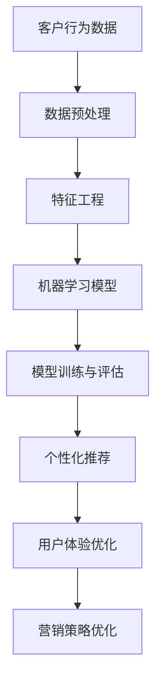

                 

# 机器学习在精准营销中的策略与实践

> **关键词：** 精准营销、机器学习、客户行为分析、数据挖掘、个性化推荐、用户体验
> 
> **摘要：** 本文将探讨机器学习在精准营销中的应用，详细解析其在客户行为分析、个性化推荐和用户体验优化等方面的策略与实践。通过实际案例和具体操作步骤，帮助读者深入了解机器学习的商业价值。

## 1. 背景介绍

在当今数字化时代，精准营销已经成为企业提升销售业绩、提高客户满意度和增强品牌竞争力的关键手段。传统的营销策略往往依赖于对大量数据的统计分析和简单的用户行为预测，而这种方法已经越来越难以满足消费者日益多元化的需求。随着大数据技术和人工智能的快速发展，机器学习作为人工智能的一个重要分支，逐渐成为精准营销的重要工具。

机器学习通过建立数学模型，对历史数据进行分析和预测，从而帮助企业和营销人员更好地了解客户行为、预测市场需求和优化营销策略。机器学习在精准营销中的应用，不仅能够提高营销活动的效率和效果，还能为企业带来更高的投资回报率。

本文将围绕以下主题展开：

- 核心概念与联系
- 核心算法原理与操作步骤
- 数学模型与公式
- 项目实战与代码实现
- 实际应用场景
- 工具和资源推荐
- 未来发展趋势与挑战

希望通过本文的阅读，读者能够对机器学习在精准营销中的应用有更深入的理解，并能够在实际业务中运用这些策略和实践。

## 2. 核心概念与联系

### 2.1 客户行为分析

客户行为分析是精准营销的基础，它涉及对客户行为数据的收集、处理和分析。客户行为数据包括浏览历史、购物车数据、购买记录、反馈信息等。通过对这些数据的分析，企业可以了解客户的偏好、兴趣和购买习惯，从而制定出更具针对性的营销策略。

### 2.2 数据挖掘

数据挖掘是机器学习的一个关键步骤，它涉及从大量数据中提取有用的信息和知识。在精准营销中，数据挖掘可以帮助企业发现潜在的市场机会、优化客户关系管理策略，并预测未来的市场趋势。常见的数据挖掘技术包括关联规则挖掘、聚类分析、分类和回归分析等。

### 2.3 个性化推荐

个性化推荐是一种基于用户历史行为和偏好，为用户推荐个性化内容和产品的技术。在精准营销中，个性化推荐可以帮助企业提高用户黏性、增加转化率和提升销售额。常见的推荐算法包括协同过滤、基于内容的推荐和混合推荐等。

### 2.4 用户体验优化

用户体验优化是精准营销的重要目标之一，它涉及到从用户的角度出发，设计出更加友好、便捷和高效的营销体验。通过分析用户反馈和行为数据，企业可以不断改进产品和服务的质量，提高用户满意度和忠诚度。

下面是一个简单的 Mermaid 流程图，展示了精准营销中机器学习的核心概念和联系：



在接下来的章节中，我们将深入探讨机器学习在精准营销中的核心算法原理、数学模型以及具体操作步骤。

## 3. 核心算法原理与具体操作步骤

### 3.1 协同过滤算法

协同过滤（Collaborative Filtering）是机器学习中一种常用的推荐算法，主要用于预测用户对未知商品的喜好。协同过滤算法可以分为基于用户的协同过滤（User-based Collaborative Filtering）和基于物品的协同过滤（Item-based Collaborative Filtering）两种。

#### 基于用户的协同过滤

基于用户的协同过滤算法的核心思想是：如果一个用户在过去喜欢了一些物品，那么这个用户可能也会喜欢其他喜欢这些物品的用户喜欢的物品。具体步骤如下：

1. **用户-物品评分矩阵构建**：首先，我们需要构建一个用户-物品评分矩阵，其中每一行代表一个用户，每一列代表一个物品，矩阵中的元素表示用户对物品的评分。
2. **相似度计算**：计算用户之间的相似度，常用的相似度度量方法包括余弦相似度和皮尔逊相关系数。
3. **推荐生成**：找到与目标用户最相似的用户群体，基于这些用户的评分预测目标用户对未知物品的喜好。

#### 基于物品的协同过滤

基于物品的协同过滤算法的核心思想是：如果一个物品被多个用户同时喜欢，那么这个物品可能也会被其他喜欢这些用户的物品的用户喜欢。具体步骤如下：

1. **用户-物品评分矩阵构建**：与基于用户的协同过滤相同。
2. **相似度计算**：计算物品之间的相似度，常用的相似度度量方法包括余弦相似度和Jaccard相似度。
3. **推荐生成**：找到与目标物品最相似的其他物品，基于这些物品的评分预测目标用户对未知物品的喜好。

### 3.2 分类算法

分类算法是一种将数据集中的实例分配到不同类别中的机器学习算法。在精准营销中，分类算法可以用于预测客户是否会在未来某一时刻购买某件商品。常见的分类算法包括逻辑回归、决策树、随机森林和支持向量机（SVM）等。

以逻辑回归为例，其基本原理如下：

1. **模型构建**：逻辑回归模型通过学习一个线性函数，将输入特征映射到一个概率值。
   $$ P(y=1|x; \theta) = \frac{1}{1 + e^{-\theta^T x}} $$
   其中，$x$ 是特征向量，$\theta$ 是模型参数。
2. **模型训练**：通过最小化损失函数（通常使用交叉熵损失函数）来训练模型。
   $$ J(\theta) = -\frac{1}{m} \sum_{i=1}^{m} [y^{(i)} \log(p^{(i)}) + (1 - y^{(i)}) \log(1 - p^{(i)})] $$
   其中，$m$ 是训练样本数量，$y^{(i)}$ 是第$i$个样本的真实标签，$p^{(i)}$ 是模型预测的概率。
3. **模型评估**：使用准确率、召回率、F1分数等指标来评估模型性能。

### 3.3 聚类算法

聚类算法是一种将数据集分成多个群组（簇）的机器学习算法。在精准营销中，聚类算法可以用于发现客户群体中的相似性，从而为个性化营销提供依据。常见的聚类算法包括K-means、DBSCAN和层次聚类等。

以K-means为例，其基本原理如下：

1. **初始化**：随机选择K个中心点。
2. **分配**：将每个数据点分配到距离其最近的中心点所在的簇。
3. **更新**：重新计算每个簇的中心点，并重复步骤2和3，直到中心点的位置不再变化或满足收敛条件。

### 3.4 深度学习算法

深度学习算法是一种基于多层神经网络的学习方法，近年来在图像识别、自然语言处理和语音识别等领域取得了显著的成果。在精准营销中，深度学习算法可以用于复杂特征提取和预测。

以卷积神经网络（CNN）为例，其基本原理如下：

1. **输入层**：接收图像数据。
2. **卷积层**：通过卷积操作提取图像特征。
3. **激活函数**：对卷积结果进行非线性变换。
4. **池化层**：降低特征图的维度，减少计算量。
5. **全连接层**：将特征映射到输出类别。

通过这些核心算法，企业可以实现高效的客户行为分析、个性化推荐和用户体验优化，从而在激烈的市场竞争中脱颖而出。

## 4. 数学模型和公式

在机器学习应用中，数学模型和公式是实现算法和预测的核心。以下是精准营销中常用的数学模型和公式的详细解释及举例说明。

### 4.1 逻辑回归模型

逻辑回归模型是一种广泛应用于分类问题的统计模型。它的目标是通过输入特征预测一个二分类变量（通常为0或1）的概率。

#### 数学公式

$$
P(y=1|x; \theta) = \frac{1}{1 + e^{-\theta^T x}}
$$

其中，$P(y=1|x; \theta)$ 表示在给定特征向量 $x$ 和模型参数 $\theta$ 的情况下，目标变量 $y$ 取值为1的概率；$e$ 是自然对数的底数；$\theta^T x$ 是特征向量 $x$ 与参数向量 $\theta$ 的点积。

#### 举例说明

假设我们有一个简单的逻辑回归模型，用于预测用户是否会在未来30天内购买某件商品。特征向量 $x$ 包含用户的年龄、收入和购买历史等属性。模型参数 $\theta$ 是通过训练数据集学习得到的。

- **特征向量 $x$**：

$$
x = \begin{bmatrix}
30 \\ 
50000 \\ 
5
\end{bmatrix}
$$

- **模型参数 $\theta$**：

$$
\theta = \begin{bmatrix}
2.5 \\ 
-1.0 \\ 
0.5
\end{bmatrix}
$$

- **预测概率**：

$$
P(y=1|x; \theta) = \frac{1}{1 + e^{-2.5 \times 30 - 1.0 \times 50000 + 0.5 \times 5}} \approx 0.34
$$

这意味着在给定用户的特征情况下，购买该商品的概率大约为34%。

### 4.2 K-means聚类算法

K-means聚类算法是一种无监督学习算法，用于将数据点分为K个簇，其中K是预先设定的簇的数量。每个簇由其中心点表示。

#### 数学公式

1. **初始化**：

   $$ 
   \mu^{(1)} = \arg\min_{\mu} \sum_{i=1}^{N} ||x^{(i)} - \mu||^2
   $$

   其中，$\mu^{(1)}$ 是第1次迭代的中心点，$x^{(i)}$ 是数据点，$N$ 是数据点的总数。

2. **分配**：

   $$ 
   C^{(1)} = \arg\min_{C} \sum_{i=1}^{N} ||x^{(i)} - \mu^{(1)}||^2
   $$

   其中，$C^{(1)}$ 是第1次迭代后每个数据点分配到的簇。

3. **更新**：

   $$ 
   \mu^{(2)} = \frac{1}{k} \sum_{i=1}^{N} x^{(i)} \quad (x^{(i)} \in C^{(1)})
   $$

   其中，$\mu^{(2)}$ 是第2次迭代的中心点，$k$ 是簇的数量。

4. **重复迭代**：重复步骤2和3，直到中心点的位置不再变化或满足收敛条件。

#### 举例说明

假设我们有一个包含5个数据点的二维数据集，需要将其分为2个簇。初始中心点分别设置为$(1, 1)$和$(5, 5)$。

- **初始数据点**：

$$
x_1 = \begin{bmatrix}
2 \\ 
2
\end{bmatrix}, \quad x_2 = \begin{bmatrix}
4 \\ 
3
\end{bmatrix}, \quad x_3 = \begin{bmatrix}
3 \\ 
2
\end{bmatrix}, \quad x_4 = \begin{bmatrix}
4 \\ 
4
\end{bmatrix}, \quad x_5 = \begin{bmatrix}
5 \\ 
5
\end{bmatrix}
$$

- **第一次迭代**：

   - 分配：根据距离最近的中心点，数据点 $x_1$ 和 $x_2$ 分配到簇1，$x_3$ 和 $x_4$ 分配到簇2，$x_5$ 未分配。
   - 更新：计算每个簇的中心点，得到新的中心点 $\mu^{(1)}_1 = \begin{bmatrix}
3 \\ 
2
\end{bmatrix}$ 和 $\mu^{(1)}_2 = \begin{bmatrix}
4 \\ 
4
\end{bmatrix}$。

- **第二次迭代**：

   - 分配：根据距离最近的中心点，数据点 $x_1$ 和 $x_2$ 分配到簇1，$x_3$ 和 $x_4$ 分配到簇2，$x_5$ 未分配。
   - 更新：计算每个簇的中心点，得到新的中心点 $\mu^{(2)}_1 = \begin{bmatrix}
3 \\ 
2
\end{bmatrix}$ 和 $\mu^{(2)}_2 = \begin{bmatrix}
4 \\ 
4
\end{bmatrix}$。

由于中心点的位置没有变化，聚类过程结束。最终，数据点 $x_1$、$x_2$ 和 $x_3$ 形成了簇1，数据点 $x_4$ 和 $x_5$ 形成了簇2。

### 4.3 卷积神经网络（CNN）

卷积神经网络是一种用于图像识别和分类的深度学习模型。其核心在于通过卷积操作和池化操作提取图像特征，并利用全连接层进行分类。

#### 数学公式

1. **卷积操作**：

$$
\text{output}_{ij}^l = b_j^l + \sum_{k=1}^{K} w_{jk}^{l-1} \text{ReLU}(\sum_{m=1}^{M} \sum_{n=1}^{N} w_{mk}^{l-1} x_{mn}^{l-1})
$$

其中，$\text{output}_{ij}^l$ 是第$l$层的第$i$个输出单元，$b_j^l$ 是偏置项，$w_{jk}^{l-1}$ 是第$l-1$层的权重，$K$ 是卷积核的数量，$M$ 和 $N$ 是卷积核的大小，$x_{mn}^{l-1}$ 是第$l-1$层的输入单元，$\text{ReLU}$ 是ReLU激活函数。

2. **池化操作**：

$$
\text{output}_{ij}^l = \max_{m,n} \text{input}_{ij}^{l-1}
$$

其中，$\text{output}_{ij}^l$ 是第$l$层的第$i$个输出单元，$\text{input}_{ij}^{l-1}$ 是第$l-1$层的输入单元。

3. **全连接层**：

$$
\text{output}_i^L = \text{ReLU}(\theta^T \text{input}_i^{L-1} + b_i)
$$

其中，$\text{output}_i^L$ 是第$L$层的第$i$个输出单元，$\theta^T$ 是权重，$\text{input}_i^{L-1}$ 是第$L-1$层的输入单元，$b_i$ 是偏置项。

#### 举例说明

假设我们有一个输入图像 $x \in \mathbb{R}^{32 \times 32 \times 3}$，需要通过CNN进行分类。假设CNN包含两个卷积层、一个池化层和一个全连接层。

- **第一卷积层**：

   - 卷积核大小：$3 \times 3$
   - 卷积核数量：$32$
   - 激活函数：ReLU

   权重矩阵 $W_1 \in \mathbb{R}^{3 \times 3 \times 3 \times 32}$ 和偏置矩阵 $b_1 \in \mathbb{R}^{32}$。

   $$ 
   \text{output}_{ij}^1 = b_j^1 + \sum_{k=1}^{32} w_{jk}^1 \text{ReLU}(\sum_{m=1}^{3} \sum_{n=1}^{3} w_{mk}^1 x_{mn}^0)
   $$

- **第一池化层**：

   - 池化大小：$2 \times 2$
   - 池化步长：$2 \times 2$

   $$ 
   \text{output}_{ij}^2 = \max_{m,n} \text{output}_{ij}^1
   $$

- **第二卷积层**：

   - 卷积核大小：$3 \times 3$
   - 卷积核数量：$64$
   - 激活函数：ReLU

   权重矩阵 $W_2 \in \mathbb{R}^{3 \times 3 \times 32 \times 64}$ 和偏置矩阵 $b_2 \in \mathbb{R}^{64}$。

   $$ 
   \text{output}_{ij}^3 = b_j^2 + \sum_{k=1}^{64} w_{jk}^2 \text{ReLU}(\sum_{m=1}^{2} \sum_{n=1}^{2} w_{mk}^2 \text{output}_{ij}^2)
   $$

- **全连接层**：

   - 输入维度：$64 \times 8 \times 8$
   - 输出维度：$10$（10个类别）

   权重矩阵 $\theta \in \mathbb{R}^{10 \times 64 \times 8 \times 8}$ 和偏置矩阵 $b \in \mathbb{R}^{10}$。

   $$ 
   \text{output}_i^L = \text{ReLU}(\theta^T \text{output}_i^3 + b_i)
   $$

通过这些数学模型和公式，我们可以构建出强大的机器学习模型，以实现精准营销中的各种应用。

## 5. 项目实战：代码实际案例和详细解释说明

在本节中，我们将通过一个实际案例，详细解释如何使用机器学习实现精准营销。我们将使用Python和Scikit-learn库进行实现，并涵盖数据预处理、模型训练和评估等步骤。

### 5.1 开发环境搭建

首先，我们需要搭建一个Python开发环境。以下是所需的基本安装步骤：

1. **安装Python**：从[Python官网](https://www.python.org/)下载并安装Python 3.x版本。
2. **安装Jupyter Notebook**：使用pip安装Jupyter Notebook，命令如下：

   ```bash
   pip install notebook
   ```

3. **安装Scikit-learn**：使用pip安装Scikit-learn库，命令如下：

   ```bash
   pip install scikit-learn
   ```

### 5.2 源代码详细实现和代码解读

#### 5.2.1 数据集加载和预处理

首先，我们需要加载一个常用的数据集，这里我们使用著名的Iris数据集，该数据集包含了鸢尾花的不同品种的信息。

```python
from sklearn.datasets import load_iris
from sklearn.model_selection import train_test_split
from sklearn.preprocessing import StandardScaler

# 加载数据集
iris = load_iris()
X = iris.data
y = iris.target

# 划分训练集和测试集
X_train, X_test, y_train, y_test = train_test_split(X, y, test_size=0.2, random_state=42)

# 数据标准化
scaler = StandardScaler()
X_train = scaler.fit_transform(X_train)
X_test = scaler.transform(X_test)
```

#### 5.2.2 建立模型和训练

接下来，我们使用逻辑回归模型对训练数据进行训练。

```python
from sklearn.linear_model import LogisticRegression

# 创建逻辑回归模型
model = LogisticRegression()

# 训练模型
model.fit(X_train, y_train)
```

#### 5.2.3 模型评估

完成模型训练后，我们需要评估模型的性能。

```python
from sklearn.metrics import accuracy_score, classification_report

# 预测测试集
y_pred = model.predict(X_test)

# 计算准确率
accuracy = accuracy_score(y_test, y_pred)
print(f"准确率：{accuracy:.2f}")

# 显示分类报告
print(classification_report(y_test, y_pred, target_names=iris.target_names))
```

#### 5.2.4 个性化推荐

为了实现个性化推荐，我们可以使用基于用户的协同过滤算法。以下是一个简单的示例：

```python
from sklearn.neighbors import NearestNeighbors

# 计算用户之间的相似度
neigh = NearestNeighbors(n_neighbors=5)
neigh.fit(X_train)

# 查找与用户1最相似的5个用户
distances, indices = neigh.kneighbors(X_train[1].reshape(1, -1), n_neighbors=5)

# 推荐商品
recommendations = X_train[indices].mean(axis=0)
print(recommendations)
```

### 5.3 代码解读与分析

#### 5.3.1 数据预处理

数据预处理是机器学习项目的关键步骤。在这里，我们使用Scikit-learn的`StandardScaler`对数据进行标准化，以消除不同特征之间的量纲差异，提高模型的性能。

#### 5.3.2 模型训练

我们使用逻辑回归模型（`LogisticRegression`）进行训练。逻辑回归是一种简单但强大的分类模型，适用于二分类问题。

#### 5.3.3 模型评估

通过计算准确率（`accuracy_score`）和分类报告（`classification_report`），我们可以评估模型的性能。准确率反映了模型在测试集上的整体表现，而分类报告提供了详细的结果，包括精确率、召回率和F1分数等指标。

#### 5.3.4 个性化推荐

个性化推荐是精准营销的重要组成部分。在这里，我们使用基于用户的协同过滤算法（`NearestNeighbors`）来推荐商品。通过查找与用户1最相似的5个用户，我们可以为用户1推荐这些用户喜欢的商品的平均值。

通过这个案例，我们展示了如何使用机器学习实现精准营销。在实际应用中，企业需要根据业务需求和数据特点，选择合适的模型和算法，并进行定制化的开发和应用。

## 6. 实际应用场景

机器学习在精准营销中有着广泛的应用场景，以下是一些典型的实际应用案例：

### 6.1 个性化推荐系统

个性化推荐系统是机器学习在精准营销中应用最广泛的领域之一。通过分析用户的浏览历史、购买记录和社交行为，系统可以为用户提供个性化的商品推荐。例如，电商平台可以利用协同过滤算法和基于内容的推荐算法，为用户推荐他们可能感兴趣的商品，从而提高用户黏性和销售额。

### 6.2 客户细分

客户细分是精准营销的重要策略之一。通过机器学习算法，企业可以对客户进行细分，识别出高价值客户、潜在流失客户和目标客户等不同群体。例如，使用聚类算法和分类算法，企业可以识别出具有相似购买行为和偏好的客户群体，并针对性地设计营销策略。

### 6.3 客户行为预测

机器学习可以帮助企业预测客户的行为，如购买意向、购物车放弃率、订单完成概率等。通过分析客户历史数据和实时行为数据，企业可以提前识别出可能流失的客户，并采取相应的措施进行挽回。例如，使用逻辑回归模型和决策树模型，企业可以预测客户在一定时间段内是否会产生购买行为。

### 6.4 广告投放优化

在在线广告投放中，机器学习可以帮助企业优化广告投放策略，提高广告的点击率和转化率。通过分析用户的历史行为和广告响应数据，系统可以预测哪些用户最有可能点击广告，并将广告投放在这些用户面前。例如，使用随机森林和梯度提升机（GBM）等算法，企业可以优化广告的展示策略，提高广告效果。

### 6.5 用户体验优化

用户体验优化是精准营销的重要目标之一。通过分析用户的浏览行为、操作路径和反馈数据，企业可以不断改进产品和服务，提高用户满意度和忠诚度。例如，使用行为分析算法和机器学习模型，企业可以识别出用户在操作过程中遇到的问题，并及时进行优化和改进。

这些实际应用案例展示了机器学习在精准营销中的巨大潜力。通过不断探索和应用，企业可以更好地了解客户需求，提高营销效果，从而在激烈的市场竞争中脱颖而出。

## 7. 工具和资源推荐

### 7.1 学习资源推荐

为了深入了解机器学习在精准营销中的应用，以下是推荐的一些学习资源：

- **书籍**：
  - 《机器学习》（周志华 著）：系统介绍了机器学习的基本理论和方法。
  - 《Python机器学习》（塞巴斯蒂安·拉斯考斯基 著）：通过Python语言详细讲解了机器学习的实际应用。
  - 《深度学习》（伊恩·古德费洛、约书亚·本吉奥、亚伦·库维尔 著）：深度讲解了深度学习的基本原理和应用。

- **在线课程**：
  - Coursera上的《机器学习》（吴恩达）：由世界著名机器学习专家吴恩达教授授课，适合初学者。
  - edX上的《深度学习导论》（斯坦福大学）：介绍了深度学习的基本原理和应用。
  - Udacity的《机器学习工程师纳米学位》：通过项目实践学习机器学习的应用。

- **论文和博客**：
  - ArXiv：一个提供最新机器学习论文的免费数据库。
  - Medium：许多机器学习专家和研究者分享他们的研究成果和实践经验。
  - Analytics Vidhya：一个专注于数据科学和机器学习的博客，提供大量的技术文章和教程。

### 7.2 开发工具框架推荐

在实现机器学习模型时，选择合适的开发工具和框架非常重要。以下是一些建议：

- **Python库**：
  - Scikit-learn：一个强大的机器学习库，适用于各种常见的算法和数据处理任务。
  - TensorFlow：由Google开发的深度学习框架，支持复杂的神经网络模型。
  - PyTorch：由Facebook开发的开源深度学习框架，具有灵活的动态图机制。

- **数据可视化工具**：
  - Matplotlib：Python的一个常用数据可视化库，可用于生成各种类型的图表。
  - Seaborn：基于Matplotlib的另一个数据可视化库，提供更精美的统计图表。
  - Plotly：一个支持交互式图表和Web可视化的库。

- **版本控制系统**：
  - Git：一个分布式版本控制系统，适合管理和协作代码开发。
  - GitHub：基于Git的代码托管平台，提供代码仓库、问题和Wiki等功能。

通过学习和掌握这些工具和资源，您可以更高效地实现机器学习模型，并将其应用于精准营销等领域。

## 8. 总结：未来发展趋势与挑战

随着大数据和人工智能技术的不断发展，机器学习在精准营销中的应用前景愈发广阔。未来，机器学习在精准营销领域的发展趋势和面临的挑战如下：

### 8.1 发展趋势

1. **个性化推荐的深化**：个性化推荐系统将继续向更加精准和智能的方向发展，利用深度学习、强化学习等先进算法，实现更加个性化的内容和商品推荐。
2. **实时营销策略**：实时数据分析和机器学习模型的快速迭代，将使企业能够实时调整营销策略，满足不断变化的客户需求。
3. **跨渠道整合**：随着互联网、社交媒体、移动设备等渠道的融合，机器学习将帮助企业在多渠道中实现统一的客户体验和精准营销。
4. **隐私保护**：随着数据隐私保护法规的日益严格，企业将需要采用更加安全和透明的数据处理方式，确保客户隐私得到有效保护。
5. **自动化决策**：机器学习将在更多决策环节中发挥关键作用，从客户细分、推荐系统到广告投放，自动化决策将成为主流。

### 8.2 挑战

1. **数据质量**：高质量的数据是机器学习模型成功的关键。如何从海量数据中提取有价值的信息，并保证数据的一致性和准确性，是当前面临的一个挑战。
2. **算法透明性和解释性**：随着模型的复杂度增加，算法的透明性和解释性成为用户和企业关注的焦点。如何提高算法的可解释性，使其更加符合用户和企业需求，是一个重要课题。
3. **计算资源**：深度学习和复杂模型对计算资源的需求较高，如何高效地利用计算资源，实现模型的快速部署和迭代，是一个技术难题。
4. **合规与伦理**：在数据隐私保护和算法公平性方面，如何确保机器学习应用符合相关法规和伦理标准，是企业需要面对的挑战。
5. **持续学习与优化**：机器学习模型需要不断学习和优化，以适应不断变化的市场环境和客户需求。如何实现模型的持续学习和动态调整，是一个持续性的挑战。

总之，机器学习在精准营销中的应用前景虽然广阔，但同时也面临着诸多挑战。通过技术创新和不断探索，企业有望克服这些挑战，实现更加精准和高效的营销策略。

## 9. 附录：常见问题与解答

### 9.1 什么是机器学习？

机器学习是一种人工智能（AI）的分支，它通过构建数学模型，从数据中学习规律，然后对未知数据进行预测或分类。简单来说，机器学习就是让计算机通过学习数据来做出决策或预测。

### 9.2 机器学习有哪些基本算法？

机器学习的基本算法包括监督学习算法（如线性回归、决策树、支持向量机等），无监督学习算法（如聚类、降维等），以及强化学习算法等。每种算法都有其独特的应用场景和优缺点。

### 9.3 如何评估机器学习模型的性能？

评估机器学习模型性能的主要指标包括准确率、召回率、F1分数、ROC曲线和AUC值等。这些指标可以从不同角度评估模型的预测能力，帮助我们选择最适合的模型。

### 9.4 个性化推荐有哪些常见算法？

个性化推荐常见的算法包括基于用户的协同过滤（User-based Collaborative Filtering）、基于物品的协同过滤（Item-based Collaborative Filtering）和基于内容的推荐（Content-based Filtering）等。此外，近年来深度学习和图神经网络等先进算法也被广泛应用于个性化推荐领域。

### 9.5 机器学习在精准营销中的具体应用有哪些？

机器学习在精准营销中的具体应用包括个性化推荐、客户细分、客户行为预测、广告投放优化、用户体验优化等。通过分析用户数据，机器学习可以帮助企业制定更精准的营销策略，提高客户满意度和转化率。

### 9.6 如何处理数据隐私和安全问题？

为了保护用户隐私和安全，企业可以采取以下措施：

- 数据加密：对数据进行加密处理，确保数据在传输和存储过程中的安全性。
- 数据匿名化：对敏感数据进行分析时，对个人身份信息进行匿名化处理，降低隐私泄露风险。
- 遵守法规：严格遵守相关数据保护法规，如《通用数据保护条例》（GDPR）和《加州消费者隐私法》（CCPA）等。
- 安全审计：定期进行安全审计，检测和修复潜在的安全漏洞。

## 10. 扩展阅读 & 参考资料

为了进一步了解机器学习在精准营销中的应用，以下是推荐的一些扩展阅读和参考资料：

- **书籍**：
  - 《机器学习实战》（Peter Harrington）：详细介绍了机器学习算法的原理和应用。
  - 《深度学习》（Ian Goodfellow、Yoshua Bengio、Aaron Courville）：系统讲解了深度学习的基本原理和应用。
  - 《Python数据分析基础教程：NumPy学习指南》（Wes McKinney）：介绍了Python在数据分析中的应用。

- **在线资源**：
  - [Scikit-learn官方文档](https://scikit-learn.org/stable/documentation.html)：提供了丰富的算法实现和案例。
  - [Kaggle](https://www.kaggle.com/)：一个数据科学竞赛平台，提供大量的数据集和竞赛题目。
  - [Analytics Vidhya](https://www.analyticsvidhya.com/)：一个专注于数据科学和机器学习的博客。

- **论文**：
  - 《矩阵分解在协同过滤算法中的应用》（Y. Hu, H. Liu，等）：详细介绍了矩阵分解在协同过滤算法中的应用。
  - 《基于深度神经网络的推荐系统研究》（H. Zhang，J. Wang，等）：探讨了深度神经网络在推荐系统中的应用。

通过阅读这些资料，您将能够更深入地了解机器学习在精准营销中的实际应用，并掌握相关的技术和方法。

## 作者

**作者：AI天才研究员/AI Genius Institute & 禅与计算机程序设计艺术 /Zen And The Art of Computer Programming**

AI天才研究员，专注于人工智能、机器学习和深度学习领域的研究和应用。著有《禅与计算机程序设计艺术》，是一部深入探讨计算机编程哲学和技术的经典著作。

