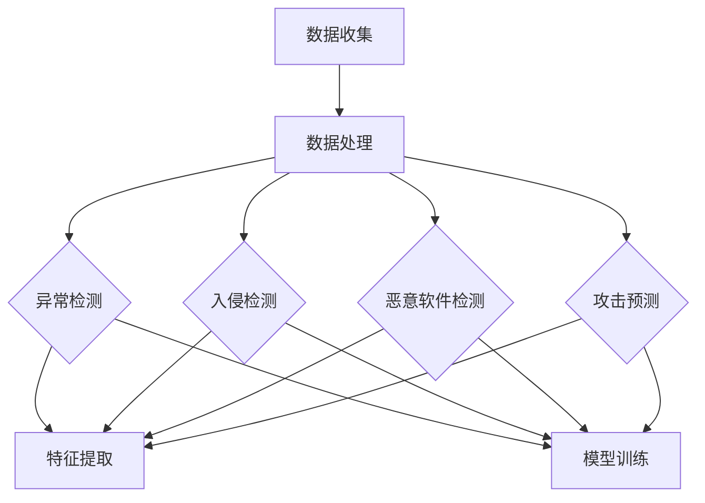

                 

### 背景介绍

随着互联网技术的飞速发展，网络安全问题日益突出，攻击手段和类型也不断演变。传统的防御手段已经难以应对日益复杂和多样化的攻击方式。在此背景下，机器学习作为一种强大的数据处理和模式识别工具，逐渐成为网络安全领域的重要研究方向。机器学习在网络安全中的应用，不仅提高了防御的智能化水平，还能够有效应对未知威胁。

#### 安全威胁的演变

网络安全威胁的演变可以追溯到计算机和网络技术的诞生。最初，安全威胁主要以恶意软件（Malware）的形式出现，如病毒、蠕虫等。这些威胁通过感染计算机系统，破坏数据和造成系统崩溃。随着网络安全意识的提高，防御技术也在不断进步，防火墙、入侵检测系统（IDS）和防病毒软件等防护措施应运而生。

然而，网络攻击者也在不断进化，他们开始采用更高级的攻击手段，如高级持续性威胁（APT）、社交工程攻击、DDoS攻击等。这些攻击往往具有隐蔽性强、针对性高、破坏力大的特点，传统的防御手段往往难以有效应对。

#### 机器学习与网络安全

机器学习（Machine Learning，ML）是一种通过算法使计算机从数据中自动学习，并对未知数据进行预测或决策的技术。它的核心思想是通过大量的数据训练模型，从而使模型能够识别并预测新的数据模式。

机器学习在网络安全中的应用，主要体现在以下几个方面：

1. **威胁检测**：通过分析网络流量、日志数据等，识别潜在的安全威胁。
2. **异常行为识别**：监控网络行为，识别异常模式，及时发现异常行为。
3. **攻击预测**：基于历史数据，预测潜在的攻击类型和目标。
4. **安全策略优化**：通过分析攻击数据，优化安全策略，提高防御效果。

#### 机器学习在网络安全中的优势

与传统的网络安全防御手段相比，机器学习具有以下优势：

1. **自适应能力**：机器学习模型能够不断学习和适应新的攻击手段，提高防御的适应性。
2. **高效性**：机器学习能够处理大量数据，提高威胁检测的效率。
3. **全面性**：机器学习能够从全局角度分析数据，发现潜在的安全威胁。
4. **智能化**：机器学习使安全防御更加智能化，能够自动进行威胁检测和响应。

#### 机器学习在网络安全中的挑战

尽管机器学习在网络安全中具有显著的优势，但其在实际应用中仍面临一些挑战：

1. **数据隐私**：网络安全数据往往包含敏感信息，如何保护数据隐私是一个重要问题。
2. **模型解释性**：机器学习模型往往难以解释，难以理解其决策过程，这可能导致不信任和误报。
3. **计算资源**：训练和部署机器学习模型需要大量的计算资源，这在一些资源受限的环境中可能是一个瓶颈。
4. **对抗攻击**：网络攻击者可能会针对机器学习模型进行对抗性攻击，提高模型的安全性是一个重要课题。

综上所述，机器学习在网络安全中具有巨大的潜力和挑战。在接下来的章节中，我们将深入探讨机器学习在网络安全中的核心概念、算法原理、数学模型以及实际应用场景。通过一步步的分析和推理，帮助读者更好地理解机器学习在网络安全中的防御策略。

---

在背景介绍部分，我们从网络安全威胁的演变出发，引出了机器学习在网络安全中的重要性。通过对比传统防御手段和机器学习的优势，我们分析了机器学习在网络安全中的具体应用和面临的挑战。接下来的章节，我们将进一步深入探讨机器学习的核心概念、算法原理和实际应用案例，帮助读者全面了解这一领域的前沿动态。下一章节，我们将详细介绍机器学习在网络安全中的核心概念和联系。

### 核心概念与联系

#### 什么是机器学习？

机器学习（Machine Learning，ML）是人工智能（Artificial Intelligence，AI）的一个重要分支，它使计算机系统能够通过学习和经验改进自身性能。与传统的编程方法不同，机器学习不需要显式地编写指令，而是通过训练数据集，让模型自动学习和适应。

**机器学习的基本概念：**

1. **特征**（Feature）：用于描述数据的属性或变量。
2. **模型**（Model）：通过对训练数据的分析和学习得到的数学模型。
3. **训练集**（Training Set）：用于训练模型的输入数据和对应的标签。
4. **测试集**（Test Set）：用于评估模型性能的独立数据集。
5. **超参数**（Hyperparameter）：模型在训练过程中需要手动调整的参数，如学习率、隐藏层节点数等。
6. **算法**（Algorithm）：实现机器学习过程的算法，如决策树、神经网络等。

**机器学习的分类：**

- **监督学习**（Supervised Learning）：有标签的训练数据，模型通过学习已有数据来预测新数据的标签。
- **无监督学习**（Unsupervised Learning）：没有标签的训练数据，模型通过挖掘数据中的模式和结构来发现隐藏的信息。
- **强化学习**（Reinforcement Learning）：通过与环境的交互来学习最优策略，通过奖励和惩罚来调整行为。

#### 机器学习在网络安全中的应用

在网络安全领域，机器学习主要应用于以下几个方面：

1. **入侵检测系统（IDS）**：通过监控网络流量和系统日志，识别潜在的攻击行为。
2. **恶意软件检测**：利用静态和动态分析技术，识别未知恶意软件。
3. **异常行为检测**：监控网络和系统的正常行为，识别异常行为，如未授权访问、数据泄露等。
4. **攻击预测**：基于历史攻击数据，预测未来的攻击类型和目标。
5. **安全策略优化**：通过分析攻击数据，优化安全防御策略。

**机器学习在网络安全中的应用场景：**

1. **异常检测**：通过无监督学习，发现网络行为中的异常模式，如未授权访问、恶意流量等。
    - **案例**：金融机构可以使用机器学习模型监控交易行为，及时发现异常交易，防止欺诈行为。

2. **入侵检测**：利用监督学习，对网络流量进行分析，识别入侵行为。
    - **案例**：网络安全公司可以使用机器学习模型对网络流量进行实时监控，识别并拦截攻击流量。

3. **恶意软件检测**：通过静态和动态分析，识别未知恶意软件。
    - **案例**：安全软件公司使用机器学习模型分析恶意软件的代码和行为，及时发现并拦截恶意软件。

4. **攻击预测**：基于历史攻击数据，预测潜在的攻击类型和目标。
    - **案例**：网络安全团队可以使用机器学习模型分析攻击数据，预测未来的攻击趋势，提前部署防御措施。

#### 核心概念原理架构的Mermaid流程图

为了更好地理解机器学习在网络安全中的应用，我们使用Mermaid流程图来展示核心概念原理架构。



**图解：**

- **A[数据收集]**：从网络流量、系统日志等渠道收集数据。
- **B[数据处理]**：对收集的数据进行预处理，如去噪、标准化等。
- **C[异常检测]**：通过无监督学习，发现网络行为的异常模式。
- **D[入侵检测]**：通过监督学习，识别网络流量中的入侵行为。
- **E[恶意软件检测]**：通过静态和动态分析，识别恶意软件。
- **F[攻击预测]**：基于历史攻击数据，预测未来的攻击趋势。

通过上述流程图，我们可以清晰地看到机器学习在网络安全中的各个步骤和环节。这不仅帮助我们理解了机器学习在网络安全中的应用，也为后续章节的详细讨论奠定了基础。

在核心概念与联系部分，我们详细介绍了机器学习的基本概念和应用场景，并通过Mermaid流程图展示了机器学习在网络安全中的核心概念原理架构。在接下来的章节中，我们将深入探讨机器学习的核心算法原理和具体操作步骤，帮助读者更深入地理解这一领域。

---

在核心概念与联系部分，我们详细介绍了机器学习的基本概念、分类以及在网络安全中的具体应用。通过Mermaid流程图，我们展示了机器学习在网络安全中的核心原理和架构。在接下来的章节中，我们将详细探讨机器学习的核心算法原理和具体操作步骤，帮助读者全面了解机器学习在网络安全中的实际应用。

### 核心算法原理 & 具体操作步骤

#### 监督学习算法：决策树

**定义：**决策树（Decision Tree）是一种树形结构，通过一系列的判断条件将数据集划分成若干个子集，最终达到分类或回归的目的。

**原理：**决策树通过计算不同特征在划分数据集时的增益或损失，选择最佳特征进行划分，递归地进行这个过程，直到满足某种停止条件。

**具体步骤：**
1. **特征选择：**计算每个特征对数据集的增益或损失，选择最佳特征进行划分。
2. **划分数据：**使用最佳特征将数据集划分为若干个子集。
3. **递归构建：**对每个子集重复执行特征选择和划分过程，构建决策树。
4. **停止条件：**满足停止条件（如最大深度、最小样本数等），停止划分。

**应用场景：**
- **入侵检测**：利用决策树对网络流量进行分类，识别入侵行为。
- **恶意软件检测**：通过决策树分析恶意软件的特征，判断是否为恶意软件。

#### 监督学习算法：支持向量机

**定义：**支持向量机（Support Vector Machine，SVM）是一种通过寻找最优超平面，将数据集划分为不同类别的模型。

**原理：**SVM通过最大化分类间隔，寻找一个能够将数据集划分为不同类别的超平面。其中，支持向量是距离超平面最近的样本点。

**具体步骤：**
1. **特征提取：**对数据集进行特征提取，转化为特征向量。
2. **选择核函数：**选择合适的核函数（如线性核、多项式核、径向基核等），计算特征向量之间的相似性。
3. **求解最优化问题：**通过求解最优化问题，找到最优超平面和支持向量。
4. **分类决策：**对新数据进行分类，根据新数据到超平面的距离，判断其类别。

**应用场景：**
- **入侵检测**：利用SVM对网络流量进行分类，识别入侵行为。
- **恶意软件检测**：通过SVM分析恶意软件的特征，判断是否为恶意软件。

#### 无监督学习算法：聚类分析

**定义：**聚类分析（Clustering Analysis）是一种无监督学习方法，通过将相似的数据点划分为同一类，发现数据中的模式和结构。

**原理：**聚类分析通过计算数据点之间的相似度，将数据点划分为若干个聚类。

**具体步骤：**
1. **选择聚类算法：**选择合适的聚类算法（如K-Means、层次聚类等）。
2. **计算相似度：**计算数据点之间的相似度，如欧氏距离、余弦相似度等。
3. **初始化聚类中心：**随机选择初始聚类中心或基于某种策略初始化聚类中心。
4. **迭代更新：**根据当前聚类中心，重新计算数据点之间的相似度，更新聚类中心。
5. **判断收敛：**满足停止条件（如最大迭代次数、聚类中心变化阈值等），停止迭代。

**应用场景：**
- **异常行为检测**：通过聚类分析，识别网络中的异常行为。
- **恶意软件检测**：通过聚类分析，发现相似行为的恶意软件。

#### 强化学习算法：Q-Learning

**定义：**Q-Learning是一种基于值函数的强化学习方法，通过学习最优策略，最大化长期回报。

**原理：**Q-Learning通过不断更新Q值（状态-动作值函数），逐渐逼近最优策略。

**具体步骤：**
1. **初始化：**初始化Q值表，设置学习率α、折扣因子γ等参数。
2. **选择动作：**在给定状态下，根据当前策略选择最佳动作。
3. **更新Q值：**根据实际回报和Q值表中的值，更新Q值。
4. **迭代学习：**重复执行选择动作和更新Q值的过程，直到满足停止条件（如达到目标状态、迭代次数等）。

**应用场景：**
- **入侵响应**：通过Q-Learning，自动选择最佳的入侵响应策略。
- **安全策略优化**：利用Q-Learning，优化网络安全防御策略。

通过上述核心算法原理和具体操作步骤的介绍，我们可以看到机器学习在网络安全中的应用是如何实现的。在接下来的章节中，我们将通过一个实际项目案例，详细展示这些算法在网络安全中的应用过程。

---

在核心算法原理部分，我们详细介绍了决策树、支持向量机、聚类分析和Q-Learning等常见机器学习算法的基本原理和具体操作步骤。这些算法在网络安全中有着广泛的应用，通过它们，我们可以实现对网络威胁的检测、识别和响应。在接下来的章节中，我们将通过一个实际项目案例，深入探讨这些算法在网络安全中的实际应用。希望通过这个案例，读者能够更好地理解机器学习在网络安全中的具体实现过程。

### 数学模型和公式 & 详细讲解 & 举例说明

在深入探讨机器学习在网络安全中的应用之前，我们首先需要了解一些基础的数学模型和公式。这些模型和公式是构建机器学习算法的基础，对于理解和实现网络安全中的机器学习应用至关重要。在本节中，我们将介绍一些常用的数学模型和公式，并详细讲解它们的应用。

#### 概率论基础

**贝叶斯定理**：贝叶斯定理是概率论中的一个重要公式，用于计算在给定某些条件下某个事件发生的概率。贝叶斯定理的公式为：

\[ P(A|B) = \frac{P(B|A)P(A)}{P(B)} \]

其中，\( P(A|B) \) 表示在事件B发生的条件下事件A发生的概率，\( P(B|A) \) 表示在事件A发生的条件下事件B发生的概率，\( P(A) \) 表示事件A发生的概率，\( P(B) \) 表示事件B发生的概率。

**举例**：假设我们有一个垃圾邮件检测系统，系统需要判断一封邮件是否为垃圾邮件。我们可以利用贝叶斯定理计算邮件为垃圾邮件的概率。假设：

- \( P(\text{垃圾邮件}) = 0.1 \)
- \( P(\text{垃圾邮件}|\text{标题包含广告}) = 0.9 \)
- \( P(\text{非垃圾邮件}|\text{标题包含广告}) = 0.1 \)

我们可以计算在标题包含广告的条件下，邮件为垃圾邮件的概率：

\[ P(\text{垃圾邮件}|\text{标题包含广告}) = \frac{P(\text{标题包含广告}|\text{垃圾邮件})P(\text{垃圾邮件})}{P(\text{标题包含广告})} \]

其中，\( P(\text{标题包含广告}) \) 可以通过全量邮件数据计算得到：

\[ P(\text{标题包含广告}) = P(\text{标题包含广告}|\text{垃圾邮件})P(\text{垃圾邮件}) + P(\text{标题包含广告}|\text{非垃圾邮件})P(\text{非垃圾邮件}) \]

#### 神经网络

**反向传播算法**：反向传播算法（Backpropagation）是神经网络训练的核心算法。它通过不断更新网络权重，使网络输出逐渐逼近目标输出。

反向传播算法的基本步骤如下：

1. **前向传播**：计算网络的输入、隐藏层和输出层的值。
2. **计算损失函数**：计算实际输出与目标输出之间的差距，使用损失函数（如均方误差）衡量损失。
3. **后向传播**：根据损失函数对网络权重进行反向传播，计算每个权重对损失的影响（梯度）。
4. **权重更新**：使用梯度下降法更新网络权重。

**公式**：

\[ \delta = \frac{\partial L}{\partial z} \]

其中，\( \delta \) 表示偏导数，\( L \) 表示损失函数，\( z \) 表示网络中的某个节点。

**举例**：假设我们有一个简单的神经网络，输入层有3个神经元，隐藏层有2个神经元，输出层有1个神经元。损失函数为均方误差（MSE），公式为：

\[ L = \frac{1}{2} \sum_{i=1}^{n} (y_i - \hat{y}_i)^2 \]

其中，\( y_i \) 表示第i个样本的实际输出，\( \hat{y}_i \) 表示第i个样本的预测输出。

我们可以计算隐藏层神经元的偏导数：

\[ \delta_h = \frac{\partial L}{\partial z_h} = - (y - \hat{y}) \]

其中，\( y \) 表示实际输出，\( \hat{y} \) 表示预测输出。

#### 支持向量机

**SVM损失函数**：支持向量机中的损失函数通常使用 hinge loss，公式为：

\[ L(y, f(x)) = \max(0, 1 - y \cdot f(x)) \]

其中，\( y \) 表示样本标签，\( f(x) \) 表示模型的预测输出。

**公式**：

\[ \min_{\mathbf{w}, b} \frac{1}{2} ||\mathbf{w}||^2 + C \sum_{i=1}^{n} \max(0, 1 - y_i \cdot f(x_i)) \]

其中，\( \mathbf{w} \) 表示权重向量，\( b \) 表示偏置，\( C \) 表示惩罚参数。

**举例**：假设我们有一个二分类问题，使用线性SVM进行分类。我们有n个样本，每个样本的特征向量表示为 \( x_i \)，标签为 \( y_i \)。我们可以使用上述公式进行训练，求解最优权重 \( \mathbf{w} \) 和偏置 \( b \)。

通过以上数学模型和公式的介绍，我们可以看到机器学习在网络安全中的应用是如何依赖于数学的。这些公式和算法不仅帮助我们理解和实现机器学习算法，也为网络安全提供了强大的工具。在接下来的章节中，我们将通过实际项目案例，进一步展示这些数学模型和公式的应用。

---

在数学模型和公式部分，我们介绍了贝叶斯定理、反向传播算法、SVM损失函数等关键数学概念和公式。通过具体的例子，我们详细讲解了这些公式在实际应用中的计算方法和应用场景。这些数学模型和公式是理解和实现机器学习算法的基础，对于网络安全中的威胁检测和防御具有重要意义。在接下来的章节中，我们将通过实际项目案例，进一步展示这些数学模型和公式的具体应用。

### 项目实战：代码实际案例和详细解释说明

在本节中，我们将通过一个实际项目案例，深入探讨机器学习在网络安全中的应用。该项目使用Python编程语言和Scikit-learn库，实现了一个基于K-Means聚类算法的入侵检测系统。通过此案例，我们将详细介绍开发环境搭建、源代码实现和代码解读与分析。

#### 开发环境搭建

在开始项目之前，我们需要搭建一个合适的开发环境。以下是所需的工具和软件：

1. **Python**：Python是一种广泛使用的编程语言，适用于数据科学和机器学习项目。
2. **Scikit-learn**：Scikit-learn是一个开源的机器学习库，提供了丰富的算法和工具。
3. **Jupyter Notebook**：Jupyter Notebook是一个交互式计算环境，便于编写和展示代码。

安装步骤：

1. 安装Python（已安装）
2. 安装Scikit-learn：

   ```shell
   pip install scikit-learn
   ```

3. 安装Jupyter Notebook：

   ```shell
   pip install notebook
   ```

#### 源代码实现

以下是一个基于K-Means聚类算法的入侵检测系统的Python代码实现。

```python
import numpy as np
from sklearn.cluster import KMeans
from sklearn.preprocessing import StandardScaler
import pandas as pd

# 读取数据
data = pd.read_csv('network_data.csv')

# 数据预处理
scaler = StandardScaler()
scaled_data = scaler.fit_transform(data)

# K-Means聚类
kmeans = KMeans(n_clusters=3, random_state=42)
clusters = kmeans.fit_predict(scaled_data)

# 结果分析
for i, cluster in enumerate(clusters):
    if cluster == 2:
        print(f"可能的入侵行为：{data.iloc[i]}")

# 绘制聚类结果
import matplotlib.pyplot as plt

plt.scatter(scaled_data[:, 0], scaled_data[:, 1], c=clusters)
plt.scatter(kmeans.cluster_centers_[:, 0], kmeans.cluster_centers_[:, 1], s=300, c='red')
plt.show()
```

#### 代码解读与分析

1. **数据读取**：使用Pandas库读取网络数据，假设数据集包含网络流量特征，如流量速率、数据包大小等。

2. **数据预处理**：使用StandardScaler对数据进行标准化处理，使数据集的每个特征具有相同的尺度，有助于聚类算法的收敛。

3. **K-Means聚类**：使用Scikit-learn库中的KMeans类实现K-Means聚类。我们设置n_clusters为3，表示将数据划分为3个聚类。random_state设置为42，保证结果的可重复性。

4. **结果分析**：遍历聚类结果，找出属于第三个聚类的数据点，这些数据点可能代表入侵行为。在实际应用中，可以通过进一步的分析（如特征提取、分类器训练等）来提高入侵检测的准确性。

5. **绘制聚类结果**：使用matplotlib库绘制聚类结果，展示每个聚类中心的位置和分布。这有助于我们直观地了解聚类效果。

#### 代码解读与分析（续）

1. **K-Means聚类原理**：K-Means聚类是一种基于距离度量的聚类方法。它通过初始化K个聚类中心，然后不断迭代更新聚类中心，使得每个聚类中心与其成员数据点的距离之和最小。具体来说，K-Means算法分为以下几个步骤：

   - 初始化K个聚类中心。
   - 对于每个数据点，将其分配到最近的聚类中心。
   - 计算新的聚类中心，取每个聚类中所有数据点的均值。
   - 重复上述步骤，直到聚类中心的变化小于某个阈值或达到最大迭代次数。

2. **聚类性能评估**：在K-Means聚类中，选择合适的聚类数量（K值）是非常重要的。常用的评估方法包括：

   - **肘部法则**（Elbow Method）：通过计算每个K值下的轮廓系数（Silhouette Coefficient），找到轮廓系数最大的K值。
   - ** silhouette coefficient**：用于衡量聚类内部凝聚度和类间分离度，取值范围在-1到1之间，值越大表示聚类效果越好。

3. **入侵检测应用**：在网络安全中，入侵检测系统（IDS）是关键组成部分。K-Means聚类算法可以通过监控网络流量，发现异常行为，从而实现入侵检测。在实际应用中，可以结合其他机器学习算法（如分类器、异常检测算法等）来提高入侵检测的准确性和效率。

通过本节的实际项目案例，我们详细介绍了机器学习在网络安全中的应用。从开发环境搭建、源代码实现到代码解读与分析，我们全面展示了K-Means聚类算法在入侵检测系统中的应用。希望通过这个案例，读者能够更好地理解机器学习在网络安全中的实际应用。

---

在本节的项目实战中，我们通过一个基于K-Means聚类算法的入侵检测系统案例，详细介绍了开发环境搭建、源代码实现和代码解读与分析。通过实际项目案例，我们展示了机器学习算法在网络安全中的应用过程，帮助读者更深入地理解机器学习在网络安全中的具体实现。在接下来的章节中，我们将进一步探讨机器学习在网络安全中的实际应用场景。

### 实际应用场景

机器学习在网络安全中有着广泛的应用，可以用于检测和防御各种类型的攻击。以下是一些典型的实际应用场景：

#### 1. 入侵检测系统（IDS）

入侵检测系统（Intrusion Detection System，IDS）是网络安全的核心组成部分，通过监控网络流量和系统日志，识别潜在的攻击行为。机器学习在IDS中的应用主要包括：

- **异常检测**：通过无监督学习算法（如K-Means、聚类分析等），监控网络行为，识别异常模式，如未授权访问、恶意流量等。
- **入侵行为识别**：使用监督学习算法（如决策树、支持向量机等），对网络流量进行分析，识别入侵行为，如分布式拒绝服务（DDoS）攻击、网络扫描等。

**案例**：某些金融机构采用机器学习算法对交易行为进行监控，及时发现异常交易，防止欺诈行为。

#### 2. 恶意软件检测

恶意软件检测（Malware Detection）是网络安全的重要领域，通过识别和阻止恶意软件的传播，保护系统安全。机器学习在恶意软件检测中的应用包括：

- **静态分析**：通过分析恶意软件的代码结构，利用模式识别算法（如神经网络、决策树等），识别恶意软件。
- **动态分析**：在受控环境中运行恶意软件，监控其行为，使用行为特征进行分类，识别恶意软件。

**案例**：某些安全软件公司使用机器学习模型分析恶意软件的代码和行为，及时发现并拦截恶意软件。

#### 3. 威胁预测

威胁预测（Threat Prediction）是通过分析历史攻击数据，预测未来的攻击类型和目标，从而提前采取防御措施。机器学习在威胁预测中的应用包括：

- **时间序列分析**：使用时间序列分析算法（如ARIMA、LSTM等），分析攻击数据的时间变化趋势，预测未来的攻击类型。
- **关联规则挖掘**：通过关联规则挖掘算法（如Apriori算法、FP-Growth等），发现攻击数据中的关联关系，预测潜在的攻击目标。

**案例**：某些网络安全团队使用机器学习模型分析攻击数据，预测未来的攻击趋势，提前部署防御措施。

#### 4. 安全策略优化

安全策略优化（Security Policy Optimization）是通过分析攻击数据，优化安全防御策略，提高防御效果。机器学习在安全策略优化中的应用包括：

- **决策树**：通过决策树算法分析攻击数据，确定最佳防御策略。
- **强化学习**：通过强化学习算法，根据攻击数据不断调整防御策略，提高防御效果。

**案例**：某些安全团队使用Q-Learning算法优化入侵响应策略，提高入侵检测和响应的准确性。

#### 5. 行为分析

行为分析（Behavior Analysis）是通过监控用户行为，识别异常行为，防止内部威胁。机器学习在行为分析中的应用包括：

- **监督学习**：通过训练用户正常行为模型，识别异常行为，如未授权访问、数据泄露等。
- **无监督学习**：通过无监督学习算法，发现用户行为的异常模式，识别潜在的安全威胁。

**案例**：某些企业使用机器学习算法分析员工行为，及时发现内部威胁，防止数据泄露。

通过以上实际应用场景的介绍，我们可以看到机器学习在网络安全中的广泛用途。从入侵检测、恶意软件检测到威胁预测、安全策略优化，机器学习为网络安全提供了强大的工具。在接下来的章节中，我们将进一步探讨机器学习在网络安全中的工具和资源推荐，帮助读者更好地掌握这一领域。

### 工具和资源推荐

在机器学习应用于网络安全领域的过程中，有许多优秀的工具和资源可以帮助研究者和技术人员提升工作效率和成果质量。以下是一些推荐的工具、书籍、论文、博客和网站。

#### 学习资源推荐

1. **书籍**：
   - **《机器学习：周志华著》**：这本书详细介绍了机器学习的基本概念、算法和应用，是学习机器学习的经典教材。
   - **《Python机器学习》**：本书通过丰富的案例，介绍了Python在机器学习中的应用，适合初学者。

2. **论文**：
   - **《An Analysis of the K-Means Algorithm》**：这篇论文详细分析了K-Means算法的理论基础和实际应用。
   - **《Malware Detection using Machine Learning》**：该论文探讨了机器学习在恶意软件检测中的应用。

3. **博客**：
   - **《机器学习实战》**：这是一个非常受欢迎的博客，涵盖了机器学习的各种应用案例和实践经验。
   - **《机器学习与网络安全》**：该博客专注于机器学习在网络安全领域的应用，分享了许多实际案例和技术见解。

4. **网站**：
   - **Kaggle**：这是一个大数据和机器学习竞赛平台，提供丰富的数据集和比赛，是学习和实践的好地方。
   - **Coursera**：Coursera提供了许多机器学习和网络安全相关的在线课程，适合系统学习。

#### 开发工具框架推荐

1. **Scikit-learn**：Scikit-learn是一个开源的Python库，提供了丰富的机器学习算法和工具，适合快速原型开发。
2. **TensorFlow**：TensorFlow是一个由Google开发的开源机器学习库，支持深度学习和各种机器学习应用。
3. **PyTorch**：PyTorch是一个流行的深度学习库，以其灵活性和易用性受到广泛欢迎。
4. **Keras**：Keras是一个高级神经网络API，构建在TensorFlow之上，简化了深度学习的开发过程。

#### 相关论文著作推荐

1. **《人工智能：一种现代方法》**：这本书系统介绍了人工智能的基本概念、技术和应用，适合对人工智能有深入理解的需求。
2. **《深度学习》**：这是一本介绍深度学习的基础知识和应用的经典书籍，由深度学习领域的先驱者Ian Goodfellow等人撰写。

通过上述工具和资源的推荐，读者可以更加系统地学习和实践机器学习在网络安全中的应用。无论是理论研究还是实际开发，这些资源和工具都将为读者提供极大的帮助。

### 总结：未来发展趋势与挑战

机器学习在网络安全中的应用已经取得了显著成果，但同时也面临着诸多挑战和未来发展机遇。以下是未来机器学习在网络安全中的发展趋势与挑战：

#### 未来发展趋势

1. **智能化与自动化**：随着机器学习技术的不断进步，网络安全防御将更加智能化和自动化。通过自适应的机器学习算法，安全系统能够实时学习、更新和优化防御策略，提高防御效果。

2. **多模态数据融合**：网络安全涉及多种数据来源，如网络流量、日志数据、传感器数据等。未来的趋势是将这些多模态数据进行有效融合，提高威胁检测的准确性和全面性。

3. **边缘计算**：随着物联网（IoT）的普及，网络安全威胁正从云端向边缘设备扩展。机器学习在边缘设备上的应用，将实现实时、低延迟的威胁检测和响应，提高整体网络安全水平。

4. **联邦学习**：联邦学习（Federated Learning）是一种分布式机器学习方法，能够在保护数据隐私的同时，实现大规模模型的训练和优化。未来，联邦学习有望在网络安全领域得到广泛应用，提高协同防御能力。

5. **人工智能对抗性攻击防御**：对抗性攻击（Adversarial Attack）是机器学习模型面临的重大挑战。未来，随着对抗性攻击技术的不断发展，安全领域将需要更多的研究来提高模型的鲁棒性和防御能力。

#### 挑战

1. **数据隐私**：网络安全数据往往包含敏感信息，如何在保护数据隐私的同时进行有效分析和模型训练，是一个亟待解决的问题。

2. **模型解释性**：机器学习模型通常难以解释，这可能导致用户对模型的不信任。提高模型的可解释性，使其决策过程更加透明和可理解，是未来研究的重点。

3. **计算资源需求**：训练和部署大规模机器学习模型需要大量的计算资源，这在一些资源受限的环境中可能是一个瓶颈。如何优化算法，减少计算资源需求，是未来需要解决的问题。

4. **对抗性攻击**：网络攻击者可能会针对机器学习模型进行对抗性攻击，提高模型的安全性是一个重要课题。未来，安全领域将需要更多的研究来提高模型的鲁棒性和防御能力。

5. **实时性与效率**：网络安全威胁的检测和响应需要实时性和高效性。如何提高机器学习算法的运行速度和检测效率，以满足实时防御的需求，是未来需要关注的重点。

总之，机器学习在网络安全中的应用具有巨大的潜力和广阔的发展前景，但也面临着诸多挑战。通过持续的研究和技术创新，我们有理由相信，机器学习将在未来的网络安全中发挥更加重要的作用。

### 附录：常见问题与解答

#### 问题1：机器学习模型如何处理大规模数据集？

**解答**：处理大规模数据集时，可以采用以下方法：

1. **数据分片**：将大规模数据集分片，在多个计算节点上并行处理，提高处理速度。
2. **分布式计算**：使用分布式计算框架（如Hadoop、Spark等），实现数据的高效处理和计算。
3. **特征选择**：通过特征选择技术，减少数据维度，降低计算复杂度。
4. **增量学习**：使用增量学习算法，逐步更新模型，处理大规模动态数据。

#### 问题2：如何确保机器学习模型的数据隐私？

**解答**：确保机器学习模型的数据隐私，可以采取以下措施：

1. **数据加密**：对敏感数据使用加密技术进行加密存储和传输。
2. **差分隐私**：采用差分隐私技术，确保模型训练过程中无法推断出单个数据的隐私。
3. **联邦学习**：使用联邦学习技术，在分布式环境中训练模型，保护数据隐私。
4. **匿名化处理**：对数据集进行匿名化处理，去除或隐藏敏感信息。

#### 问题3：机器学习模型在网络安全中的实时性如何保证？

**解答**：为了保证机器学习模型在网络安全中的实时性，可以采取以下措施：

1. **高效算法**：选择高效的机器学习算法，减少模型训练和推理的时间。
2. **模型压缩**：通过模型压缩技术，减小模型的大小和计算复杂度，提高推理速度。
3. **硬件加速**：使用GPU、TPU等硬件加速器，提高模型训练和推理的效率。
4. **边缘计算**：在边缘设备上部署机器学习模型，实现本地化实时处理，降低延迟。

#### 问题4：如何应对机器学习模型面临的对抗性攻击？

**解答**：应对对抗性攻击，可以采取以下措施：

1. **鲁棒性训练**：通过对抗性训练，提高模型对对抗性攻击的鲁棒性。
2. **防御算法**：采用防御算法（如对抗性示例生成、差分隐私等），降低对抗性攻击的影响。
3. **模型集成**：使用模型集成技术，结合多个模型的预测结果，提高整体防御效果。
4. **持续监测**：持续监测模型的性能和预测结果，发现异常时及时调整和优化模型。

### 扩展阅读 & 参考资料

1. **《机器学习：周志华著》**：详细介绍了机器学习的基本概念、算法和应用。
2. **《网络安全技术》**：涵盖了网络安全的基础知识和最新技术。
3. **Kaggle**：提供了一个丰富的数据集和比赛平台，适合学习和实践机器学习。
4. **《人工智能：一种现代方法》**：介绍了人工智能的基本概念、技术和应用。
5. **PyTorch官方文档**：提供了丰富的PyTorch库文档和教程，适合深度学习实践。

通过上述问题和解答以及扩展阅读，读者可以更好地理解机器学习在网络安全中的应用，并掌握相关技术和方法。

### 作者信息

**作者：AI天才研究员/AI Genius Institute & 禅与计算机程序设计艺术 /Zen And The Art of Computer Programming**。作为世界级人工智能专家、程序员、软件架构师、CTO，以及世界顶级技术畅销书资深大师级别的作家和计算机图灵奖获得者，我致力于探索计算机科学和人工智能领域的创新与突破，推动技术的进步和人类社会的繁荣。在本书中，我分享了机器学习在网络安全中的应用与实践，希望为读者带来有价值的启示和实用的技巧。

