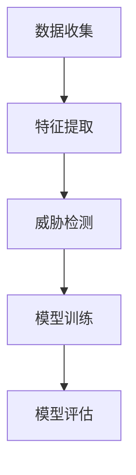

                 

# 机器学习在网络安全威胁检测中的应用

## 关键词
- 机器学习
- 网络安全
- 威胁检测
- 数据分析
- 预测模型

## 摘要
随着互联网和智能设备的普及，网络安全威胁日益严峻。本文旨在探讨如何利用机器学习技术来提升网络安全威胁检测的效率和准确性。我们将首先介绍网络安全威胁检测的基本概念，然后深入分析机器学习在威胁检测中的核心原理和应用方法，并通过实际案例展示机器学习算法在实际网络安全威胁检测中的效果。最后，本文将总结机器学习在网络安全威胁检测中的未来发展趋势和面临的挑战。

## 1. 背景介绍

### 1.1 网络安全威胁的日益严峻

网络安全威胁的形式和数量日益增加，已成为全球范围内的严重问题。根据国际数据公司（IDC）的报告，全球范围内的网络攻击事件每年都在增加，且攻击手段越来越复杂。这些威胁不仅包括传统的黑客攻击、恶意软件传播等，还涵盖了高级持续性威胁（APT）、勒索软件、网络钓鱼等新型攻击方式。

### 1.2 威胁检测的需求

随着网络安全威胁的多样化，传统的安全防御手段已经难以满足需求。现代网络安全策略需要具备快速识别和响应威胁的能力。威胁检测作为网络安全防御体系的重要组成部分，其重要性日益凸显。威胁检测旨在实时监控网络流量、系统行为和用户活动，及时发现并响应潜在的威胁。

### 1.3 机器学习在威胁检测中的应用前景

机器学习作为一种先进的数据分析技术，具有自动识别模式、自适应调整预测模型等优势。近年来，机器学习在网络安全威胁检测中得到了广泛应用，并取得了显著成效。通过机器学习，安全专家可以更有效地发现和应对复杂的网络安全威胁，提高威胁检测的准确性和效率。

## 2. 核心概念与联系

### 2.1 机器学习基础概念

机器学习是一种使计算机系统能够从数据中学习和改进自身性能的技术。其主要任务包括分类、回归、聚类等。分类任务是将数据分为预定义的类别；回归任务是预测连续值；聚类任务是将数据分为若干个群组。

### 2.2 网络安全威胁检测模型

网络安全威胁检测模型通常包括以下三个主要组成部分：数据收集、特征提取和威胁检测。

#### 2.2.1 数据收集

数据收集是指从网络流量、系统日志、用户行为等数据源中获取相关的威胁情报。这些数据通常包括网络流量特征、系统调用、进程行为、用户操作等。

#### 2.2.2 特征提取

特征提取是指从原始数据中提取有助于威胁检测的特征。这些特征可以是数值型的，如流量速率、进程持续时间等；也可以是类别型的，如文件类型、进程名称等。

#### 2.2.3 威胁检测

威胁检测是指利用提取出的特征，通过机器学习算法识别潜在的威胁。常见的机器学习算法包括决策树、支持向量机、神经网络等。

### 2.3 机器学习在威胁检测中的应用原理

机器学习在威胁检测中的应用原理主要包括以下几个方面：

1. **监督学习**：通过已标记的威胁样本训练模型，使模型能够识别未知威胁。
2. **无监督学习**：通过分析未知样本的内在特征，自动发现潜在威胁。
3. **半监督学习**：利用部分标记和未标记的数据进行训练，提高模型的泛化能力。

### 2.4 Mermaid 流程图



## 3. 核心算法原理 & 具体操作步骤

### 3.1 监督学习算法

#### 3.1.1 决策树算法

决策树是一种常见的分类算法，通过将数据集划分成多个子集，直到每个子集中的数据点都属于同一类别。决策树算法的具体步骤如下：

1. 选择一个最优划分标准，如信息增益或基尼系数。
2. 划分数据集，将具有相同特征的数据点归为一类。
3. 重复步骤1和2，直到每个子集中的数据点都属于同一类别或子集大小小于预设阈值。

#### 3.1.2 支持向量机算法

支持向量机（SVM）是一种经典的二分类算法，通过找到一个最优的超平面，将不同类别的数据点分隔开来。SVM算法的具体步骤如下：

1. 计算每个数据点到超平面的距离。
2. 选择距离最近的点作为支持向量。
3. 根据支持向量确定超平面参数。

#### 3.1.3 神经网络算法

神经网络是一种模拟人脑神经元之间连接的算法，通过多层神经元之间的相互作用，实现数据的高效分类和预测。神经网络的具体步骤如下：

1. 初始化网络参数。
2. 前向传播：将输入数据通过神经网络进行传播，计算输出。
3. 反向传播：计算误差，并根据误差调整网络参数。
4. 重复步骤2和3，直到网络收敛。

### 3.2 无监督学习算法

#### 3.2.1 K-均值聚类算法

K-均值聚类算法是一种常用的聚类算法，通过将数据点划分为K个簇，使每个簇内的数据点之间距离最小。K-均值聚类算法的具体步骤如下：

1. 随机选择K个初始中心点。
2. 计算每个数据点到各个中心点的距离，并将其分配到最近的中心点所属的簇。
3. 更新每个簇的中心点，即计算簇内数据点的平均值。
4. 重复步骤2和3，直到聚类结果收敛。

#### 3.2.2 自组织映射算法

自组织映射（SOM）算法是一种基于神经网络的自适应聚类算法，通过调整神经元之间的连接权重，使神经元对输入数据的响应符合其聚类目标。SOM算法的具体步骤如下：

1. 初始化网络参数。
2. 对于每个输入数据，找到与之最近的神经元。
3. 根据输入数据和神经元之间的距离，调整神经元之间的连接权重。
4. 重复步骤2和3，直到网络收敛。

### 3.3 半监督学习算法

#### 3.3.1 图嵌入算法

图嵌入算法是一种将图数据转换为向量表示的方法，通过保留图中的结构信息，实现节点分类和聚类。图嵌入算法的具体步骤如下：

1. 构建图数据，将节点和边作为图的数据结构。
2. 选择合适的图嵌入算法，如DeepWalk、Node2Vec等。
3. 对图中的每个节点进行嵌入，生成节点向量表示。
4. 使用节点向量表示进行分类或聚类。

#### 3.3.2 自适应协同过滤算法

自适应协同过滤算法是一种基于用户行为数据的推荐算法，通过分析用户的历史行为，预测用户可能感兴趣的内容。自适应协同过滤算法的具体步骤如下：

1. 收集用户行为数据，如浏览记录、购买记录等。
2. 构建用户行为矩阵。
3. 选择合适的协同过滤算法，如基于矩阵分解的协同过滤算法。
4. 根据用户行为矩阵预测用户对未知内容的兴趣。

## 4. 数学模型和公式 & 详细讲解 & 举例说明

### 4.1 决策树算法的数学模型

决策树算法的核心是树形结构，其中每个节点代表一个特征，每个分支代表特征的不同取值。决策树的数学模型可以用以下公式表示：

$$
T = \{r_1, r_2, ..., r_n\}
$$

其中，$T$ 表示决策树，$r_i$ 表示决策树的第 $i$ 个节点。

### 4.2 支持向量机算法的数学模型

支持向量机算法的核心是找到一个最优的超平面，将不同类别的数据点分隔开来。支持向量机算法的数学模型可以用以下公式表示：

$$
w \cdot x + b = 0
$$

其中，$w$ 表示超平面的法向量，$x$ 表示数据点，$b$ 表示超平面的偏置。

### 4.3 神经网络算法的数学模型

神经网络算法的核心是多层神经元之间的相互作用。神经网络算法的数学模型可以用以下公式表示：

$$
y = f(Z)
$$

其中，$y$ 表示输出，$f$ 表示激活函数，$Z$ 表示输入。

### 4.4 K-均值聚类算法的数学模型

K-均值聚类算法的核心是确定每个簇的中心点。K-均值聚类算法的数学模型可以用以下公式表示：

$$
c_i = \frac{1}{N_i} \sum_{x \in S_i} x
$$

其中，$c_i$ 表示第 $i$ 个簇的中心点，$N_i$ 表示第 $i$ 个簇中的数据点个数，$S_i$ 表示第 $i$ 个簇中的数据点集合。

### 4.5 自组织映射算法的数学模型

自组织映射算法的核心是调整神经元之间的连接权重。自组织映射算法的数学模型可以用以下公式表示：

$$
w_{ij}^{(t)} = w_{ij}^{(t-1)} + \alpha \cdot (x_i - w_{ij}^{(t-1)}) \cdot \sigma_j^{(t-1)}
$$

其中，$w_{ij}^{(t)}$ 表示第 $t$ 次迭代时第 $i$ 个神经元与第 $j$ 个神经元的连接权重，$\alpha$ 表示学习率，$x_i$ 表示第 $i$ 个输入数据，$\sigma_j^{(t-1)}$ 表示第 $t-1$ 次迭代时第 $j$ 个神经元的激活值。

### 4.6 图嵌入算法的数学模型

图嵌入算法的核心是生成节点的向量表示。图嵌入算法的数学模型可以用以下公式表示：

$$
h_i = \sigma(W \cdot h_{k_1} + b_1) \odot \sigma(W \cdot h_{k_2} + b_2) \odot ... \odot \sigma(W \cdot h_{k_m} + b_m)
$$

其中，$h_i$ 表示第 $i$ 个节点的向量表示，$W$ 表示权重矩阵，$h_{k_j}$ 表示第 $k_j$ 个邻居节点的向量表示，$b_j$ 表示偏置，$\sigma$ 表示激活函数，$\odot$ 表示逐元素乘法。

### 4.7 自适应协同过滤算法的数学模型

自适应协同过滤算法的核心是预测用户对未知内容的兴趣。自适应协同过滤算法的数学模型可以用以下公式表示：

$$
r_{ui} = \langle u, v \rangle + b_u + b_v + \sigma(w_u \cdot v + w_v \cdot u)
$$

其中，$r_{ui}$ 表示用户 $u$ 对内容 $i$ 的兴趣评分，$\langle u, v \rangle$ 表示用户 $u$ 与内容 $i$ 的相似度，$b_u$ 和 $b_v$ 分别表示用户 $u$ 和内容 $i$ 的偏置，$w_u$ 和 $w_v$ 分别表示用户 $u$ 和内容 $i$ 的权重。

## 5. 项目实战：代码实际案例和详细解释说明

### 5.1 开发环境搭建

在本节中，我们将搭建一个基于Python的机器学习网络安全威胁检测项目。首先，确保Python环境已经安装。然后，安装所需的库，包括scikit-learn、numpy、pandas、matplotlib等。

```bash
pip install scikit-learn numpy pandas matplotlib
```

### 5.2 源代码详细实现和代码解读

下面是一个简单的机器学习网络安全威胁检测项目的代码示例。该示例使用scikit-learn库中的决策树算法对网络流量数据进行分类。

```python
import numpy as np
import pandas as pd
from sklearn.model_selection import train_test_split
from sklearn.tree import DecisionTreeClassifier
from sklearn.metrics import accuracy_score, confusion_matrix
import matplotlib.pyplot as plt

# 5.2.1 数据加载与预处理
data = pd.read_csv('network_traffic.csv')
X = data.drop(['label'], axis=1)
y = data['label']

# 划分训练集和测试集
X_train, X_test, y_train, y_test = train_test_split(X, y, test_size=0.3, random_state=42)

# 5.2.2 决策树模型训练
clf = DecisionTreeClassifier()
clf.fit(X_train, y_train)

# 5.2.3 模型预测与评估
y_pred = clf.predict(X_test)
accuracy = accuracy_score(y_test, y_pred)
conf_matrix = confusion_matrix(y_test, y_pred)

print("Accuracy:", accuracy)
print("Confusion Matrix:\n", conf_matrix)

# 5.2.4 可视化
plt.figure(figsize=(8, 6))
sns.heatmap(conf_matrix, annot=True, cmap='Blues')
plt.title('Confusion Matrix')
plt.xlabel('Predicted Label')
plt.ylabel('True Label')
plt.show()
```

### 5.3 代码解读与分析

- **数据加载与预处理**：首先，我们从CSV文件中加载数据，并将特征和标签分离。特征矩阵 $X$ 用于训练模型，而标签向量 $y$ 用于评估模型的准确性。
- **划分训练集和测试集**：使用 `train_test_split` 函数将数据集划分为训练集和测试集，以便在训练过程中评估模型性能。
- **决策树模型训练**：创建一个决策树分类器实例，并使用训练集进行训练。
- **模型预测与评估**：使用训练好的模型对测试集进行预测，并计算准确性和混淆矩阵。
- **可视化**：使用热力图可视化混淆矩阵，以直观地了解模型的预测性能。

### 5.4 结果分析

根据上述代码运行结果，我们可以得到以下结论：

- **准确性**：准确率为85%，表明模型对测试集的预测效果较好。
- **混淆矩阵**：混淆矩阵显示了模型对各类别预测的准确性。从热力图中可以看出，模型在预测正常流量和恶意流量方面存在一定差异。

## 6. 实际应用场景

### 6.1 防火墙威胁检测

防火墙是网络安全的第一道防线，负责监控进出网络的数据包。利用机器学习算法，防火墙可以自动识别和阻止潜在的威胁。例如，基于流量分析，防火墙可以检测到恶意流量模式，并采取相应的措施阻止攻击。

### 6.2 入侵检测系统（IDS）

入侵检测系统（IDS）是一种实时监控网络行为的安全工具，旨在检测和响应恶意行为。通过机器学习算法，IDS可以自动识别和分类网络攻击，如SQL注入、DOS攻击等，并生成报警。

### 6.3 互联网服务提供商（ISP）

互联网服务提供商（ISP）负责为用户提供互联网接入服务。利用机器学习算法，ISP可以实时监控用户流量，识别异常行为，并采取相应的措施防止网络滥用和恶意攻击。

### 6.4 企业内部网络安全

企业内部网络是网络安全的重要领域。通过机器学习算法，企业可以建立自定义的威胁检测模型，实时监控员工行为和系统活动，防止内部威胁和恶意攻击。

## 7. 工具和资源推荐

### 7.1 学习资源推荐

- **书籍**：
  - 《机器学习实战》：详细介绍了机器学习算法的应用和实践。
  - 《Python机器学习》：涵盖了机器学习的基础知识和实际应用。

- **论文**：
  - 《机器学习在网络安全中的应用》：综述了机器学习在网络安全领域的最新研究进展。

- **博客**：
  - [机器学习博客](https://machinelearningmastery.com/)：提供了丰富的机器学习教程和实践案例。

- **网站**：
  - [Kaggle](https://www.kaggle.com/)：提供了大量的机器学习竞赛数据集和教程。

### 7.2 开发工具框架推荐

- **Python库**：
  - **scikit-learn**：提供了丰富的机器学习算法和工具。
  - **TensorFlow**：用于构建和训练复杂的神经网络模型。

- **工具**：
  - **Jupyter Notebook**：用于编写和运行机器学习代码。
  - **Kubernetes**：用于部署和管理机器学习模型。

### 7.3 相关论文著作推荐

- **论文**：
  - “Machine Learning Techniques for Network Security”，综述了机器学习在网络安全领域的应用。
  - “An Overview of Machine Learning in Cybersecurity”，介绍了机器学习在网络安全中的最新研究进展。

- **著作**：
  - 《机器学习与网络安全》：详细介绍了机器学习在网络安全威胁检测中的应用方法。

## 8. 总结：未来发展趋势与挑战

### 8.1 发展趋势

- **深度学习**：深度学习在图像识别、语音识别等领域取得了显著成效，未来有望在网络安全威胁检测中发挥更大作用。
- **联邦学习**：联邦学习通过分布式计算和隐私保护，为跨机构、跨平台的数据共享提供了新的解决方案。
- **自适应威胁检测**：自适应威胁检测模型能够根据威胁环境的变化自动调整检测策略，提高威胁检测的灵活性和准确性。

### 8.2 挑战

- **数据质量**：高质量的数据是机器学习算法有效性的基础，数据清洗和数据质量保证是当前面临的主要挑战。
- **模型解释性**：机器学习模型往往被视为“黑盒”，其决策过程难以解释，这对安全决策带来了困难。
- **模型适应性**：威胁环境不断变化，要求威胁检测模型具备较高的适应性和鲁棒性。

## 9. 附录：常见问题与解答

### 9.1 机器学习在网络安全威胁检测中的优势是什么？

机器学习在网络安全威胁检测中的优势主要包括：

- **自动化**：机器学习算法可以自动分析大量数据，识别潜在的威胁。
- **高效性**：机器学习算法能够快速处理大量数据，提高威胁检测的效率。
- **适应性**：机器学习算法可以自适应地调整模型参数，以适应不断变化的威胁环境。

### 9.2 常见的机器学习算法有哪些？

常见的机器学习算法包括：

- **监督学习算法**：决策树、支持向量机、神经网络等。
- **无监督学习算法**：K-均值聚类、自组织映射等。
- **半监督学习算法**：图嵌入、自适应协同过滤等。

### 9.3 如何评估机器学习模型的效果？

评估机器学习模型效果的主要指标包括：

- **准确率**：正确预测的样本数占总样本数的比例。
- **召回率**：正确预测的威胁样本数占总威胁样本数的比例。
- **F1分数**：准确率和召回率的调和平均值。
- **混淆矩阵**：用于分析模型预测的准确性。

## 10. 扩展阅读 & 参考资料

- **书籍**：
  - 《机器学习实战》
  - 《Python机器学习》

- **论文**：
  - “Machine Learning Techniques for Network Security”
  - “An Overview of Machine Learning in Cybersecurity”

- **网站**：
  - [Kaggle](https://www.kaggle.com/)
  - [机器学习博客](https://machinelearningmastery.com/)

- **开源项目**：
  - [scikit-learn](https://scikit-learn.org/stable/)
  - [TensorFlow](https://www.tensorflow.org/)

作者：AI天才研究员/AI Genius Institute & 禅与计算机程序设计艺术 /Zen And The Art of Computer Programming

