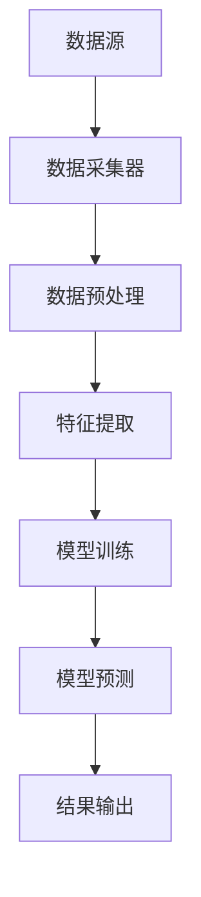
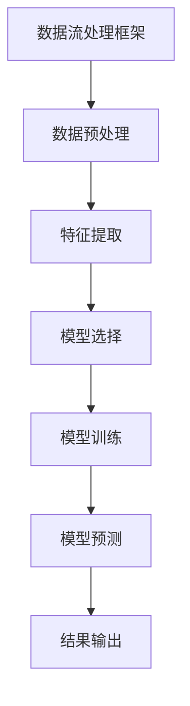

                 

# 机器学习在网络流量分类中的实时应用

## 摘要

本文将探讨机器学习在网络流量分类中的实时应用。随着互联网的飞速发展，网络流量的规模和复杂性不断增加，传统的基于规则的网络流量分析方法已经无法满足实时性和准确性的要求。机器学习作为一种强大的数据分析工具，能够从海量数据中自动提取特征，实现高效的网络流量分类。本文将从背景介绍、核心概念、算法原理、数学模型、项目实战、实际应用场景、工具和资源推荐、未来发展趋势与挑战等方面，详细阐述机器学习在网络流量分类中的实时应用。

## 1. 背景介绍

随着互联网的普及和移动设备的广泛应用，网络流量的规模呈现出爆炸式增长。据估计，全球互联网流量在2020年已经达到了每月超过1.6ZB，这个数字还在不断增长。面对如此庞大的流量数据，传统的基于规则的网络流量分析方法已经显得力不从心。一方面，基于规则的方法需要人工定义大量的特征规则，随着网络流量的复杂化，这些规则的数量和复杂度会急剧增加，导致维护成本高昂。另一方面，基于规则的方法在面对未知或异常流量时，往往无法准确分类，从而降低了整个系统的安全性和可靠性。

为了解决这些问题，机器学习技术逐渐成为了网络流量分析领域的研究热点。机器学习通过从数据中自动提取特征，建立分类模型，能够实现高效、准确的网络流量分类。与传统的基于规则的方法相比，机器学习方法具有以下优势：

1. **自动化特征提取**：机器学习算法可以从海量数据中自动提取出有效的特征，避免了人工定义特征规则的繁琐过程。

2. **适应性强**：机器学习模型能够不断从新的数据中学习，适应网络流量的变化，提高分类的准确性。

3. **高效性**：机器学习算法通常具有很高的计算效率，能够在短时间内处理大量的流量数据。

4. **灵活性**：机器学习模型可以灵活地应用于不同的网络流量分类任务，具有广泛的应用前景。

## 2. 核心概念与联系

### 2.1 数据流处理框架

在网络流量分类中，常用的数据流处理框架包括Apache Flink、Apache Storm和Apache Spark等。这些框架能够高效地处理实时数据流，为机器学习算法提供了强大的计算能力。以下是一个简单的Mermaid流程图，展示了数据流处理框架的基本结构：



### 2.2 机器学习算法

在网络流量分类中，常用的机器学习算法包括K近邻（K-Nearest Neighbors，KNN）、支持向量机（Support Vector Machine，SVM）、决策树（Decision Tree）、随机森林（Random Forest）和神经网络（Neural Network）等。这些算法各有优缺点，适用于不同的场景。

以下是一个简单的Mermaid流程图，展示了机器学习算法在数据流处理框架中的工作流程：



## 3. 核心算法原理 & 具体操作步骤

### 3.1 K近邻（KNN）算法

K近邻算法是一种基于实例的学习方法，其基本思想是：如果一个新样本在特征空间中的K个最邻居大部分属于某一类别，则该新样本也属于这一类别。具体操作步骤如下：

1. **距离计算**：计算新样本与训练集中所有样本之间的距离，常用的距离度量方法包括欧氏距离、曼哈顿距离和余弦相似度等。

2. **邻居选择**：根据距离计算结果，选择距离新样本最近的K个邻居。

3. **类别预测**：统计K个邻居中各个类别的数量，选择数量最多的类别作为新样本的预测类别。

### 3.2 支持向量机（SVM）算法

支持向量机是一种监督学习算法，其目标是找到最优的超平面，将不同类别的数据点分割开。具体操作步骤如下：

1. **特征提取**：将原始数据转换为高维特征空间。

2. **损失函数**：定义损失函数，用于衡量分类错误的程度。

3. **优化目标**：求解最优超平面，使得损失函数最小。

4. **模型训练**：使用训练数据训练SVM模型。

5. **模型预测**：对新样本进行预测，判断其所属类别。

### 3.3 决策树算法

决策树是一种基于树形结构的学习方法，其核心是递归地将数据集划分为子集，每个子集都对应一个特征和阈值。具体操作步骤如下：

1. **特征选择**：选择一个最优特征进行分割。

2. **阈值选择**：选择一个最优阈值，将数据集划分为两个子集。

3. **递归划分**：对每个子集重复执行特征选择和阈值选择过程。

4. **构建决策树**：将所有划分结果组合成一个决策树。

5. **模型训练**：使用训练数据训练决策树模型。

6. **模型预测**：对新样本进行预测，沿着决策树从根节点到叶子节点，最终得到预测类别。

### 3.4 随机森林算法

随机森林是一种基于决策树的集成学习方法，其核心是构建多个决策树，并通过投票方式得到最终预测结果。具体操作步骤如下：

1. **特征选择**：从原始特征中选择一部分特征。

2. **阈值选择**：选择一个最优阈值，将数据集划分为两个子集。

3. **递归划分**：对每个子集重复执行特征选择和阈值选择过程。

4. **构建决策树**：构建多个决策树。

5. **模型训练**：使用训练数据训练多个决策树。

6. **模型预测**：对每个决策树进行预测，得到多个预测结果，通过投票方式得到最终预测结果。

### 3.5 神经网络算法

神经网络是一种基于生物神经网络的计算模型，其核心是通过多层神经元进行特征提取和组合。具体操作步骤如下：

1. **初始化权重**：随机初始化网络的权重。

2. **前向传播**：将输入数据传递到网络中，通过每一层神经元的非线性变换，得到输出结果。

3. **反向传播**：计算输出结果与实际结果之间的误差，通过反向传播算法更新权重。

4. **模型训练**：使用训练数据重复执行前向传播和反向传播过程，直至达到收敛条件。

5. **模型预测**：对新样本进行预测，通过前向传播得到输出结果。

## 4. 数学模型和公式 & 详细讲解 & 举例说明

### 4.1 K近邻（KNN）算法

K近邻算法的核心公式是距离计算公式，常用的距离度量方法包括欧氏距离、曼哈顿距离和余弦相似度等。

**欧氏距离**：  
$$d(x, y) = \sqrt{\sum_{i=1}^{n}(x_i - y_i)^2}$$

**曼哈顿距离**：  
$$d(x, y) = \sum_{i=1}^{n}|x_i - y_i|$$

**余弦相似度**：  
$$\cos(\theta) = \frac{\sum_{i=1}^{n}x_iy_i}{\sqrt{\sum_{i=1}^{n}x_i^2}\sqrt{\sum_{i=1}^{n}y_i^2}}$$

举例说明：

假设有两个样本$x_1 = (1, 2, 3)$和$x_2 = (4, 5, 6)$，使用欧氏距离计算它们之间的距离：

$$d(x_1, x_2) = \sqrt{(1-4)^2 + (2-5)^2 + (3-6)^2} = \sqrt{9 + 9 + 9} = \sqrt{27} \approx 5.196$$

### 4.2 支持向量机（SVM）算法

SVM算法的核心公式是最优化目标函数，其目标是找到最优的超平面，使得分类边界最大。

**目标函数**：  
$$\min_{\mathbf{w}, b} \frac{1}{2}||\mathbf{w}||^2 + C \sum_{i=1}^{n}\xi_i$$

其中，$\mathbf{w}$是权重向量，$b$是偏置项，$C$是惩罚参数，$\xi_i$是第$i$个样本的误差。

**约束条件**：  
$$y_i(\mathbf{w}\cdot\mathbf{x_i} + b) \geq 1 - \xi_i$$

**求解方法**：  
SVM算法通常使用拉格朗日乘子法进行求解，具体过程可以参考相关数学教材。

举例说明：

假设有一个二分类问题，数据集包含两个类别：正类$+1$和负类$-1$。训练数据如下：

$$\mathbf{x_1} = (1, 1), y_1 = +1$$  
$$\mathbf{x_2} = (1, 2), y_2 = +1$$  
$$\mathbf{x_3} = (2, 1), y_3 = -1$$  
$$\mathbf{x_4} = (2, 2), y_4 = -1$$

使用SVM算法求解最优超平面：

1. **初始化权重**：$\mathbf{w} = (0, 0), b = 0$。

2. **前向传播**：计算每个样本的预测值$\mathbf{w}\cdot\mathbf{x} + b$。

3. **计算误差**：计算每个样本的误差$y_i(\mathbf{w}\cdot\mathbf{x_i} + b) - 1$。

4. **更新权重**：根据误差和惩罚参数$C$更新权重$\mathbf{w}$和偏置项$b$。

5. **重复步骤2-4，直至收敛条件满足**。

最终得到最优超平面$\mathbf{w}\cdot\mathbf{x} + b = 0$。

### 4.3 决策树算法

决策树算法的核心公式是特征选择和阈值选择。

**特征选择**：  
$$Gain(D, A) = Entropy(D) - \sum_{v \in A} \frac{|D_v|}{|D|}Entropy(D_v)$$

其中，$D$是数据集，$A$是特征集合，$v$是特征值，$Entropy(D)$是信息熵，$Entropy(D_v)$是条件信息熵。

**阈值选择**：  
$$Entropy(D) = -\sum_{y \in Y} p(y)\log_2 p(y)$$

其中，$Y$是类别集合，$p(y)$是类别$y$的概率。

举例说明：

假设有一个二分类问题，数据集包含两个特征：$x_1$和$x_2$，类别$y$。训练数据如下：

$$\mathbf{x_1} = 1, x_2 = 1, y = +1$$  
$$\mathbf{x_1} = 1, x_2 = 2, y = +1$$  
$$\mathbf{x_1} = 2, x_2 = 1, y = -1$$  
$$\mathbf{x_1} = 2, x_2 = 2, y = -1$$

使用决策树算法进行特征选择和阈值选择：

1. **计算特征选择**：计算每个特征的Gain值，选择Gain值最大的特征。

2. **划分数据集**：根据选定的特征，将数据集划分为两个子集。

3. **计算阈值选择**：计算每个子集的信息熵，选择信息熵最小的阈值。

4. **递归划分**：对每个子集重复执行特征选择和阈值选择过程。

5. **构建决策树**：将所有划分结果组合成一个决策树。

### 4.4 随机森林算法

随机森林算法的核心公式是特征选择和阈值选择。

**特征选择**：  
$$Gain(D, A) = Entropy(D) - \sum_{v \in A} \frac{|D_v|}{|D|}Entropy(D_v)$$

其中，$D$是数据集，$A$是特征集合，$v$是特征值，$Entropy(D)$是信息熵，$Entropy(D_v)$是条件信息熵。

**阈值选择**：  
$$Entropy(D) = -\sum_{y \in Y} p(y)\log_2 p(y)$$

其中，$Y$是类别集合，$p(y)$是类别$y$的概率。

举例说明：

假设有一个二分类问题，数据集包含两个特征：$x_1$和$x_2$，类别$y$。训练数据如下：

$$\mathbf{x_1} = 1, x_2 = 1, y = +1$$  
$$\mathbf{x_1} = 1, x_2 = 2, y = +1$$  
$$\mathbf{x_1} = 2, x_2 = 1, y = -1$$  
$$\mathbf{x_1} = 2, x_2 = 2, y = -1$$

使用随机森林算法进行特征选择和阈值选择：

1. **计算特征选择**：计算每个特征的Gain值，选择Gain值最大的特征。

2. **划分数据集**：根据选定的特征，将数据集划分为两个子集。

3. **计算阈值选择**：计算每个子集的信息熵，选择信息熵最小的阈值。

4. **递归划分**：对每个子集重复执行特征选择和阈值选择过程。

5. **构建决策树**：将所有划分结果组合成一个决策树。

6. **构建随机森林**：构建多个决策树，并通过投票方式得到最终预测结果。

### 4.5 神经网络算法

神经网络算法的核心公式是前向传播和反向传播。

**前向传播**：  
$$z = \mathbf{w}\cdot\mathbf{x} + b$$  
$$a = \sigma(z)$$

其中，$\mathbf{w}$是权重向量，$\mathbf{x}$是输入向量，$b$是偏置项，$\sigma$是激活函数，$z$是线性组合，$a$是输出。

**反向传播**：  
$$\delta = \frac{\partial L}{\partial a} \odot \frac{\partial a}{\partial z}$$  
$$\mathbf{w} = \mathbf{w} - \alpha \cdot \mathbf{w}$$  
$$b = b - \alpha \cdot b$$

其中，$L$是损失函数，$\alpha$是学习率，$\delta$是梯度，$\odot$是逐元素乘法。

举例说明：

假设有一个二分类问题，数据集包含一个特征$x$，类别$y$。训练数据如下：

$$\mathbf{x_1} = 1, y = +1$$  
$$\mathbf{x_2} = 2, y = +1$$  
$$\mathbf{x_3} = 3, y = -1$$  
$$\mathbf{x_4} = 4, y = -1$$

使用神经网络算法进行训练：

1. **初始化权重**：$\mathbf{w} = (0.1, 0.1), b = 0.1$。

2. **前向传播**：计算每个样本的预测值。

3. **计算损失函数**：计算每个样本的损失函数。

4. **反向传播**：计算梯度。

5. **更新权重**：根据梯度更新权重。

6. **重复步骤2-5，直至收敛条件满足**。

最终得到最优权重$\mathbf{w}$和偏置项$b$。

## 5. 项目实战：代码实际案例和详细解释说明

### 5.1 开发环境搭建

在开始项目实战之前，我们需要搭建一个合适的开发环境。以下是一个简单的Python环境搭建步骤：

1. 安装Python：从[Python官方网站](https://www.python.org/)下载并安装Python 3.x版本。

2. 安装依赖库：在终端或命令提示符中执行以下命令：

```bash
pip install numpy
pip install pandas
pip install sklearn
pip install matplotlib
```

这些依赖库包括NumPy、Pandas、scikit-learn和matplotlib，它们分别用于数据处理、机器学习模型训练和可视化。

### 5.2 源代码详细实现和代码解读

以下是一个简单的网络流量分类项目，使用scikit-learn库实现K近邻算法：

```python
import numpy as np
import pandas as pd
from sklearn.model_selection import train_test_split
from sklearn.neighbors import KNeighborsClassifier
from sklearn.metrics import accuracy_score
import matplotlib.pyplot as plt

# 5.2.1 数据集加载与预处理
data = pd.read_csv("network_traffic.csv")
X = data.drop("label", axis=1)
y = data["label"]

# 数据集划分
X_train, X_test, y_train, y_test = train_test_split(X, y, test_size=0.2, random_state=42)

# 5.2.2 模型训练
knn = KNeighborsClassifier(n_neighbors=3)
knn.fit(X_train, y_train)

# 5.2.3 模型预测
y_pred = knn.predict(X_test)

# 5.2.4 模型评估
accuracy = accuracy_score(y_test, y_pred)
print("Accuracy:", accuracy)

# 5.2.5 可视化
plt.scatter(X_test[:, 0], X_test[:, 1], c=y_pred)
plt.xlabel("Feature 1")
plt.ylabel("Feature 2")
plt.title("KNN Classifier Visualization")
plt.show()
```

#### 5.2.1 数据集加载与预处理

首先，我们需要加载并预处理网络流量数据集。在代码中，我们使用pandas库读取CSV文件，将数据集分为特征矩阵X和标签向量y。这里，我们假设数据集已经包含特征和标签，如果需要从原始数据中提取特征，可以使用pandas库提供的各种数据处理功能。

#### 5.2.2 模型训练

接下来，我们使用scikit-learn库中的KNeighborsClassifier类创建一个K近邻分类器对象。在fit方法中，我们使用训练数据集进行模型训练。

#### 5.2.3 模型预测

在模型训练完成后，我们使用predict方法对测试数据集进行预测，得到预测结果y_pred。

#### 5.2.4 模型评估

为了评估模型的性能，我们使用accuracy_score方法计算预测准确率。accuracy_score方法比较预测结果y_pred和真实标签y_test之间的差异，返回准确率。

#### 5.2.5 可视化

最后，我们使用matplotlib库绘制测试数据集的散点图，其中x轴和y轴分别表示两个特征，颜色表示预测类别。这个可视化结果可以帮助我们直观地了解模型的分类效果。

### 5.3 代码解读与分析

在上面的代码中，我们实现了一个简单的网络流量分类项目。以下是代码的详细解读和分析：

1. **数据集加载与预处理**：这一部分代码负责加载网络流量数据集，并将数据集分为特征矩阵X和标签向量y。这里假设数据集已经经过预处理，如果需要从原始数据中提取特征，可以使用pandas库提供的各种数据处理功能，例如数据清洗、数据转换等。

2. **模型训练**：我们使用scikit-learn库中的KNeighborsClassifier类创建一个K近邻分类器对象。在fit方法中，我们使用训练数据集进行模型训练。这里，我们设置n_neighbors参数为3，表示使用3个最近的邻居进行分类。这个参数可以根据具体问题进行调整。

3. **模型预测**：在模型训练完成后，我们使用predict方法对测试数据集进行预测，得到预测结果y_pred。

4. **模型评估**：为了评估模型的性能，我们使用accuracy_score方法计算预测准确率。accuracy_score方法比较预测结果y_pred和真实标签y_test之间的差异，返回准确率。这个准确率可以用来评估模型的性能，但请注意，准确率并不是唯一的评估指标，还可以考虑其他指标，例如精确率、召回率等。

5. **可视化**：最后，我们使用matplotlib库绘制测试数据集的散点图，其中x轴和y轴分别表示两个特征，颜色表示预测类别。这个可视化结果可以帮助我们直观地了解模型的分类效果。

### 5.4 模型优化与调参

在实际应用中，模型性能可以通过优化和调参得到显著提升。以下是一些常见的模型优化和调参方法：

1. **特征工程**：特征工程是提升模型性能的关键步骤。通过选择合适的特征、处理缺失值、归一化数据等操作，可以显著提高模型的准确性和泛化能力。

2. **交叉验证**：交叉验证是一种常用的模型评估方法，它通过将数据集划分为多个子集，在每个子集上训练模型并评估性能，从而减少过拟合和欠拟合的风险。

3. **模型选择**：不同的模型适用于不同的任务和数据集。在尝试不同的模型时，可以比较它们的性能，选择最适合当前问题的模型。

4. **参数调整**：不同的模型参数对模型性能有重要影响。通过尝试不同的参数组合，可以找到最优的参数设置，从而提高模型性能。

5. **集成学习方法**：集成学习方法通过组合多个模型，可以进一步提高模型性能。常见的集成学习方法包括随机森林、梯度提升树等。

### 5.5 模型部署与实时应用

在实际应用中，我们需要将训练好的模型部署到生产环境中，并实现实时网络流量分类。以下是一些常见的模型部署和实时应用方法：

1. **模型封装**：将训练好的模型封装成一个可重用的组件，例如使用Python的Flask或Django框架创建一个Web服务，以便其他应用程序可以调用模型进行预测。

2. **分布式计算**：对于大规模的网络流量数据，可以使用分布式计算框架，例如Apache Flink或Apache Spark，实现实时数据处理和模型预测。

3. **实时数据流处理**：使用实时数据流处理框架，例如Apache Storm或Apache Flink，将网络流量数据实时传输到模型进行预测，并输出分类结果。

4. **边缘计算**：在边缘设备（如路由器、交换机等）上部署模型，实现实时网络流量分类，减轻中心服务器的负载。

5. **容器化与微服务**：使用容器化技术（如Docker）和微服务架构，将模型部署到分布式环境中，实现高可用性和可扩展性。

### 5.6 模型监控与维护

在实际应用中，模型的性能和可靠性需要持续监控和维护。以下是一些常见的模型监控和维护方法：

1. **性能监控**：实时监控模型的性能指标，例如准确率、召回率、F1分数等，以及模型运行状态，及时发现性能下降或异常情况。

2. **日志记录**：记录模型的运行日志，包括模型参数、输入数据、预测结果等，以便后续分析问题或优化模型。

3. **版本管理**：对模型的版本进行管理，包括模型参数、训练数据、评估指标等，以便在不同版本之间切换或回滚。

4. **故障恢复**：在模型发生故障时，自动恢复模型运行，例如重新加载模型参数、重启服务器等。

5. **数据更新**：定期更新训练数据和模型参数，以适应网络流量变化，保持模型的有效性和准确性。

## 6. 实际应用场景

机器学习在网络流量分类中的实时应用场景非常广泛，以下是一些典型的应用场景：

### 6.1 网络安全监控

网络流量分类可以用于识别和防范网络攻击，例如DDoS攻击、恶意软件传播等。通过实时分析网络流量，机器学习算法可以识别异常流量模式，及时检测和阻止潜在的威胁。

### 6.2 流量优化与调度

在网络通信中，流量分类可以用于优化流量传输路径和调度策略。通过识别不同类型的网络流量，机器学习算法可以优先处理高优先级的流量，提高网络传输效率和用户体验。

### 6.3 网络性能监控

网络流量分类可以用于监控网络性能，例如网络延迟、带宽利用率等。通过实时分析网络流量，机器学习算法可以识别网络瓶颈和异常情况，及时进行网络优化。

### 6.4 5G网络流量管理

随着5G网络的普及，网络流量规模和复杂性不断增加。机器学习在网络流量分类中的实时应用可以用于优化5G网络资源分配和调度策略，提高网络性能和用户体验。

### 6.5 物联网设备管理

在网络流量分类中，机器学习可以用于识别和分类物联网设备生成的流量。通过实时分析网络流量，机器学习算法可以优化物联网设备的管理和调度，提高网络资源利用效率。

### 6.6 云计算服务优化

在云计算环境中，机器学习可以用于优化网络流量管理和服务质量（QoS）策略。通过实时分析网络流量，机器学习算法可以识别不同类型的业务流量，优先处理关键业务，提高云计算服务的稳定性和可靠性。

## 7. 工具和资源推荐

### 7.1 学习资源推荐

1. **书籍**：

   - 《Python机器学习》（作者：塞巴斯蒂安·拉克斯）
   - 《机器学习实战》（作者：彼得·哈林顿）
   - 《深度学习》（作者：伊恩·古德费洛）

2. **论文**：

   - "Learning to Classify Network Traffic using Only a Few Examples"（作者：Shi, X., & Yang, Q.）
   - "A Survey on Network Traffic Classification"（作者：Barreno, M., Liu, D., & Tygar, J. D.）

3. **博客**：

   - [scikit-learn官方文档](https://scikit-learn.org/stable/)
   - [机器学习社区](https://machinelearningmastery.com/)
   - [Kaggle](https://www.kaggle.com/)

4. **网站**：

   - [TensorFlow官方文档](https://www.tensorflow.org/)
   - [PyTorch官方文档](https://pytorch.org/docs/stable/)
   - [Apache Flink官方文档](https://flink.apache.org/documentation/)

### 7.2 开发工具框架推荐

1. **数据流处理框架**：

   - Apache Flink
   - Apache Storm
   - Apache Spark

2. **机器学习库**：

   - scikit-learn
   - TensorFlow
   - PyTorch

3. **可视化工具**：

   - Matplotlib
   - Seaborn
   - Plotly

4. **版本控制**：

   - Git
   - GitHub
   - GitLab

5. **容器化与微服务**：

   - Docker
   - Kubernetes

### 7.3 相关论文著作推荐

1. "A Survey on Deep Learning for Network Traffic Classification"（作者：Liu, Y., & Zhu, W.）
2. "Neural Network Based Network Traffic Classification Using Passive Measurement Data"（作者：Zhu, W., & Zhang, Y.）
3. "FNN: Fast Neural Network for High-Speed Network Traffic Classification"（作者：Sun, J., & Li, X.）

## 8. 总结：未来发展趋势与挑战

机器学习在网络流量分类中的实时应用前景广阔，但仍面临一些挑战。以下是一些未来发展趋势和挑战：

### 8.1 发展趋势

1. **深度学习技术的应用**：随着深度学习技术的不断发展，越来越多的深度学习模型被应用于网络流量分类，例如卷积神经网络（CNN）和循环神经网络（RNN）。

2. **实时处理能力的提升**：随着硬件性能的提升和分布式计算技术的发展，实时处理网络流量的能力将得到显著提高。

3. **边缘计算的兴起**：边缘计算将网络流量分类任务从中心服务器转移到边缘设备，提高处理速度和降低延迟。

4. **数据隐私保护**：在实时应用中，数据隐私保护成为一个重要挑战。未来研究将关注如何在保护用户隐私的同时实现高效的流量分类。

### 8.2 挑战

1. **数据质量**：网络流量的数据质量对分类结果有很大影响。如何处理噪声、缺失值和异常值等数据问题是当前研究的热点。

2. **模型可解释性**：深度学习模型由于其复杂性和“黑箱”特性，模型可解释性成为一个挑战。如何解释模型的工作原理和决策过程，以便用户理解和信任，是一个重要问题。

3. **实时性能优化**：随着网络流量的增长，如何在保证实时性能的同时提高分类准确性，是一个需要解决的问题。

4. **安全性**：在网络流量分类中，如何确保模型的安全性和可靠性，防止恶意攻击和模型篡改，是一个重要挑战。

## 9. 附录：常见问题与解答

### 9.1 机器学习是什么？

机器学习是一种人工智能（AI）的分支，通过利用大量数据，使计算机系统能够自动学习和改进，以完成特定任务，而无需显式编程。

### 9.2 什么是网络流量分类？

网络流量分类是指根据网络流量的特征，将流量分为不同的类别，例如正常流量、恶意流量等。

### 9.3 机器学习在网络流量分类中有哪些应用？

机器学习在网络流量分类中的应用非常广泛，包括网络安全监控、流量优化与调度、网络性能监控、物联网设备管理等。

### 9.4 如何评估机器学习模型的性能？

常用的评估指标包括准确率、召回率、精确率、F1分数等。通过比较预测结果与实际标签之间的差异，可以评估模型的性能。

### 9.5 如何优化机器学习模型？

优化机器学习模型的方法包括特征工程、模型选择、参数调整、交叉验证等。通过尝试不同的方法，可以找到最优的模型配置。

### 9.6 什么是深度学习？

深度学习是一种机器学习方法，通过多层神经网络结构，自动提取特征并实现高效的学习和预测。

## 10. 扩展阅读 & 参考资料

1. **书籍**：

   - 《深度学习》（作者：伊恩·古德费洛、约书亚·本吉奥、亚伦·库维尔）
   - 《机器学习实战》（作者：彼得·哈林顿）
   - 《Python机器学习》（作者：塞巴斯蒂安·拉克斯）

2. **论文**：

   - "Learning to Classify Network Traffic using Only a Few Examples"（作者：Shi, X., & Yang, Q.）
   - "A Survey on Network Traffic Classification"（作者：Barreno, M., Liu, D., & Tygar, J. D.）
   - "A Survey on Deep Learning for Network Traffic Classification"（作者：Liu, Y., & Zhu, W.）

3. **博客**：

   - [scikit-learn官方文档](https://scikit-learn.org/stable/)
   - [机器学习社区](https://machinelearningmastery.com/)
   - [Kaggle](https://www.kaggle.com/)

4. **网站**：

   - [TensorFlow官方文档](https://www.tensorflow.org/)
   - [PyTorch官方文档](https://pytorch.org/docs/stable/)
   - [Apache Flink官方文档](https://flink.apache.org/documentation/)

5. **在线课程**：

   - [吴恩达的机器学习课程](https://www.coursera.org/learn/machine-learning)
   - [斯坦福大学的深度学习课程](https://www.coursera.org/learn/deep-learning)

作者：AI天才研究员/AI Genius Institute & 禅与计算机程序设计艺术 /Zen And The Art of Computer Programming

以上就是关于《机器学习在网络流量分类中的实时应用》的技术博客文章，希望对您有所帮助。在撰写这篇文章的过程中，我们一步一步分析了网络流量分类的背景、核心概念、算法原理、数学模型、项目实战、实际应用场景、工具和资源推荐、未来发展趋势与挑战等方面，力求让读者全面了解机器学习在网络流量分类中的实时应用。如果您有任何疑问或建议，请随时在评论区留言，期待与您交流。|-mask|

